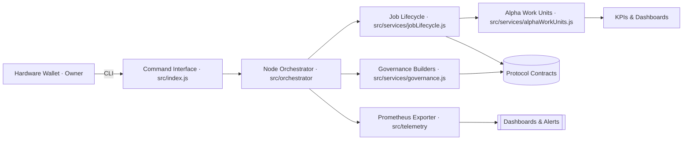
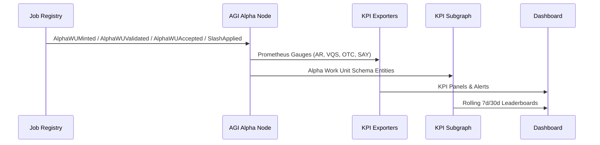

# AGI Alpha Node v0 · Cognitive Yield Reactor ⚡

<!-- markdownlint-disable MD013 MD033 -->
<p align="center">
  <picture>
    <source srcset="1.alpha.node.agi.eth.svg" type="image/svg+xml" />
    
  </picture>
</p>

<p align="center">
  <a href="https://github.com/MontrealAI/AGI-Alpha-Node-v0/actions/workflows/ci.yml">
    
  </a>
  <a href="https://img.shields.io/github/actions/workflow/status/MontrealAI/AGI-Alpha-Node-v0/ci.yml?branch=main&job=Lint%20Markdown%20%26%20Links&label=Lint%20%E2%9C%85&logo=markdown&style=flat-square">
    
  </a>
  <a href="https://img.shields.io/github/actions/workflow/status/MontrealAI/AGI-Alpha-Node-v0/ci.yml?branch=main&job=Unit%20%26%20Integration%20Tests&label=Tests%20%E2%9A%A1&logo=vitest&logoColor=white&style=flat-square">
    
  </a>
  <a href="https://img.shields.io/github/actions/workflow/status/MontrealAI/AGI-Alpha-Node-v0/ci.yml?branch=main&job=Coverage%20Report&label=Coverage%20%E2%9C%85&logo=c8&logoColor=white&style=flat-square">
    
  </a>
  <a href="https://img.shields.io/github/actions/workflow/status/MontrealAI/AGI-Alpha-Node-v0/ci.yml?branch=main&job=Docker%20Build%20%26%20Smoke%20Test&label=Docker%20%E2%9A%A1&logo=docker&logoColor=white&style=flat-square">
    
  </a>
  
  
  <a href="Dockerfile">
    
  </a>
  <a href="deploy/helm/agi-alpha-node">
    
  </a>
  
  <a href="https://app.ens.domains/name/alpha.node.agi.eth">
    
  </a>
  <a href="https://etherscan.io/token/0xa61a3b3a130a9c20768eebf97e21515a6046a1fa">
    
  </a>
  <a href=".github/required-checks.json">
    
  </a>
  <a href="LICENSE">
    
  </a>
</p>

> _This unstoppable, unstoppable control surface stewards capital, computation, and sovereignty as a single super-capable machine._

---

## Table of Contents

1. [Mission Pulse](#mission-pulse)
2. [System Constellation](#system-constellation)
3. [Alpha Work Unit KPI Stack](#alpha-work-unit-kpi-stack)
4. [Launch & Verification Protocol](#launch--verification-protocol)
5. [Owner Control Surfaces](#owner-control-surfaces)
6. [Runtime Interfaces](#runtime-interfaces)
7. [Observability & CI Mesh](#observability--ci-mesh)
8. [Repository Atlas](#repository-atlas)
9. [Deployment Playbooks](#deployment-playbooks)
10. [Token, ENS & Identity](#token-ens--identity)
11. [License](#license)

---

## Mission Pulse

AGI Alpha Node v0 is the economic machine that senses inefficiency, reallocates capital gravity, and executes synthetic labor across sovereign meshes. It unifies ENS-gated identity, staking orchestration, governance payload synthesis, and high-density telemetry so the owner commands an always-on, production-critical reactor for $AGIALPHA yield.



---

## System Constellation

| Component | Purpose | Key Artifacts |
| --------- | ------- | -------------- |
| **Owner Runtime Spine** | Aggregates ENS verification, staking state, governance payloads, and telemetry. | [`src/index.js`](src/index.js), [`src/orchestrator`](src/orchestrator) |
| **Identity Backbone** | Enforces `*.alpha.node.agi.eth` guardianship and subname gating. | [`src/services/ensVerifier.js`](src/services/ensVerifier.js), [`src/services/ensConstants.js`](src/services/ensConstants.js) |
| **Governance Arsenal** | Deterministic transactions for pause, incentives, staking, registries, and emissions. | [`src/services/governance.js`](src/services/governance.js), [`test/governance.test.js`](test/governance.test.js) |
| **Synthetic Labor Engine** | Discovers, executes, and journals AGI jobs with proof pipelines and swarm intelligence. | [`src/services/jobLifecycle.js`](src/services/jobLifecycle.js), [`src/intelligence`](src/intelligence) |
| **Alpha Work Unit Registry** | Records mint/validate/accept/slash flows and derives KPI telemetry. | [`src/services/alphaWorkUnits.js`](src/services/alphaWorkUnits.js), [`src/telemetry/alphaMetrics.js`](src/telemetry/alphaMetrics.js) |

---

## Alpha Work Unit KPI Stack

`α`‑work units (α‑WU) are the verifiable labor atoms harvested by the node. Each event is indexed, windowed, and exposed through Prometheus, subgraph, and dashboard blueprints so operators can prove performance on-chain and off-chain.



| KPI | Definition | Gauge | 7d/30d Windows |
| --- | ---------- | ----- | -------------- |
| **Acceptance Rate (AR)** | `count(accepted) / count(minted)` | `agi_alpha_node_alpha_wu_acceptance_rate` | ✓ |
| **Validator-Weighted Quality (VQS)** | Median validator score weighted by stake | `agi_alpha_node_alpha_wu_quality` | ✓ |
| **On-Time Completion (OTC)** | p95 latency from mint to acceptance | `agi_alpha_node_alpha_wu_on_time_p95_seconds` | ✓ |
| **Slashing-Adjusted Yield (SAY)** | `(accepted − slashes) / total stake` | `agi_alpha_node_alpha_wu_slash_adjusted_yield` | ✓ |

### Artifacts

- Solidity event interface: [`docs/telemetry/AlphaWorkUnitEvents.sol`](docs/telemetry/AlphaWorkUnitEvents.sol)
- Subgraph schema blueprint: [`docs/telemetry/alpha-work-units.schema.graphql`](docs/telemetry/alpha-work-units.schema.graphql)
- Dashboard specification: [`docs/telemetry/alpha-work-unit-dashboard.json`](docs/telemetry/alpha-work-unit-dashboard.json)
- Prometheus gauges: `agi_alpha_node_alpha_wu_acceptance_rate`, `agi_alpha_node_alpha_wu_on_time_p95_seconds`, `agi_alpha_node_alpha_wu_slash_adjusted_yield`, `agi_alpha_node_alpha_wu_quality`, `agi_alpha_node_alpha_wu_breakdown`

---

## Launch & Verification Protocol

| Phase | Objective | Command / Artifact |
| ----- | --------- | ------------------ |
| 1 | Install deterministic toolchain. | `npm ci` |
| 2 | Execute local quality gates & coverage. | `npm run lint` · `npm test` · `npm run coverage` |
| 3 | Generate ENS custody brief prior to any on-chain command. | `node src/index.js ens-guide --label <label> --address <0xOwner>` |
| 4 | Validate ENS binding, staking posture, and RPC health. | `node src/index.js status --label <label> --address <0xOwner> --rpc <https://...>` |
| 5 | Replay offline synthetic labor cycles for dry runs. | `node src/index.js status --label <label> --address <0xOwner> --offline-snapshot docs/offline-snapshot.example.json` |
| 6 | Activate orchestrator with Prometheus metrics. | `node src/index.js monitor --label <label> --address <0xOwner> --rpc <https://...> --metrics-port 9464` |
| 7 | Emit governance envelopes for multisig execution. | `node src/index.js governance surfaces` |
| 8 | Build production container image. | `docker build -t agi-alpha-node:main .` |
| 9 | Apply branch protection and required checks. | `.github/required-checks.json` |

```bash
# Install dependencies
npm ci

# Run static analysis & verification
npm run lint
npm test
npm run coverage

# Explore orchestration commands
node src/index.js --help
```

---

## Owner Control Surfaces

| Surface | Contract | Entry Points | Builder Functions |
| ------- | -------- | ------------ | ----------------- |
| **Global Safeguard Relay** | `SystemPause` | `pauseAll`, `resumeAll`, `unpauseAll` | [`buildSystemPauseTx`](src/services/governance.js) |
| **Stake Governance Prism** | `StakeManager` | `setMinimumStake`, `setValidatorThreshold`, `setIdentityRegistry` | [`buildMinimumStakeTx`](src/services/governance.js), [`buildValidatorThresholdTx`](src/services/governance.js) |
| **Reward Distribution Matrix** | `RewardEngine` | `setRoleShare`, `setGlobalShares` | [`buildRoleShareTx`](src/services/governance.js) |
| **Emission Control Forge** | `EmissionManager` | `setEpochEmission`, `setEpochLength`, `setEmissionCap` | [`buildEmissionPerEpochTx`](src/services/governance.js) |
| **Node Registry Dominion** | `NodeRegistry` | `setNodeStatus`, `setNodeOperator`, `setWorkMeter` | [`buildNodeStatusTx`](src/services/governance.js) |
| **Identity Delegation Vault** | `IdentityRegistry` | `setAdditionalNodeOperator` | [`buildIdentityDelegateTx`](src/services/governance.js) |
| **Platform Incentives Conductor** | `PlatformIncentives` | `setStakeManager`, `setHeartbeatGrace`, `setTreasury` | [`buildIncentivesStakeManagerTx`](src/services/governance.js) |

Every surface is owner-configurable and validated by [`test/governance.test.js`](test/governance.test.js), ensuring pausing, parameter tuning, and job routing remain under direct owner authority.

---

## Runtime Interfaces

- **CLI Modules:** `node src/index.js [command]` exposes `status`, `monitor`, `governance`, `ens-guide`, and job lifecycle commands (`discover`, `apply`, `submit`, `finalize`).
- **Agent Mesh API:** [`src/network/apiServer.js`](src/network/apiServer.js) offers REST hooks for orchestrated agents with owner-token authentication.
- **Lifecycle Journal:** [`src/services/lifecycleJournal.js`](src/services/lifecycleJournal.js) notarizes every action for audit trails.
- **Alpha Work Unit Access:** `recordAlphaWorkUnitEvent` and `getAlphaWorkUnitMetrics` (from [`src/services/jobLifecycle.js`](src/services/jobLifecycle.js)) enable manual ingestion, while watchers stream on-chain events automatically.

---

## Observability & CI Mesh

- **Prometheus Exporter:** [`src/telemetry/monitoring.js`](src/telemetry/monitoring.js) publishes stake, throughput, provider mode, registry compatibility, and α‑WU KPI gauges.
- **Telemetry Harmoniser:** [`src/telemetry/alphaMetrics.js`](src/telemetry/alphaMetrics.js) maps aggregated α‑WU metrics across global/agent/node/validator dimensions with rolling windows.
- **Monitor Loop:** [`src/orchestrator/monitorLoop.js`](src/orchestrator/monitorLoop.js) continuously synthesizes diagnostics, owner directives, and telemetry updates.
- **CI Hardening:** `.github/workflows/ci.yml` enforces linting, tests, coverage, Docker builds, and required checks (`.github/required-checks.json`).
- **Coverage & Tests:** `npm run coverage` (`c8`) and `npm test` (Vitest) maintain the 131-test suite and guarantee branch protection remains green.

---

## Repository Atlas

| Path | Description |
| ---- | ----------- |
| [`src/services/alphaWorkUnits.js`](src/services/alphaWorkUnits.js) | α‑WU registry, windowed KPIs, and export utilities. |
| [`src/telemetry/alphaMetrics.js`](src/telemetry/alphaMetrics.js) | Prometheus gauge harmonisation for α‑WU metrics. |
| [`docs/telemetry/`](docs/telemetry/) | Event interface, subgraph schema, and dashboard blueprint for KPI surfaces. |
| [`docs/offline-snapshot.example.json`](docs/offline-snapshot.example.json) | Offline replay template for diagnostics. |
| [`deploy/helm/agi-alpha-node`](deploy/helm/agi-alpha-node) | Production Helm chart. |
| [`scripts/`](scripts/) | Husky bootstrapping & auxiliary automation. |
| [`test/`](test/) | 130+ Vitest specifications across governance, staking, lifecycle, telemetry, and α‑WU metrics. |

---

## Deployment Playbooks

1. **Container Build:** `docker build -t agi-alpha-node:latest .`
2. **Helm Release:** `helm upgrade --install agi-alpha-node deploy/helm/agi-alpha-node -f deploy/helm/agi-alpha-node/values.yaml`
3. **Metrics Wiring:** Point Prometheus to `http://<node-host>:9464/metrics` and import [`docs/telemetry/alpha-work-unit-dashboard.json`](docs/telemetry/alpha-work-unit-dashboard.json) into your dashboard platform.
4. **Subgraph Indexing:** Deploy [`docs/telemetry/alpha-work-units.schema.graphql`](docs/telemetry/alpha-work-units.schema.graphql) to The Graph (or a self-hosted indexer) to power 7d/30d leaderboards.

---

## Token, ENS & Identity

- **$AGIALPHA Contract:** `0xa61a3b3a130a9c20768eebf97e21515a6046a1fa` (18 decimals). Canonical constants live in [`src/constants/token.js`](src/constants/token.js) and service abstractions in [`src/services/token.js`](src/services/token.js).
- **ENS Hierarchy:** Owner and agent authentication relies on `*.node.agi.eth`, `*.alpha.node.agi.eth`, `*.agent.agi.eth`, and related club domains. Enforcement handled by [`src/services/ensVerifier.js`](src/services/ensVerifier.js).
- **Identity Registry Hooks:** Governance builders manage delegates and operators ensuring complete owner control over pausing, activation fees, and stake thresholds.

---

## License

Released under the [MIT License](LICENSE).
