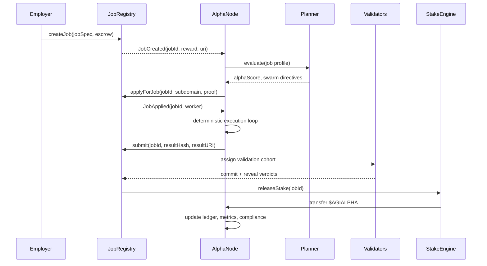
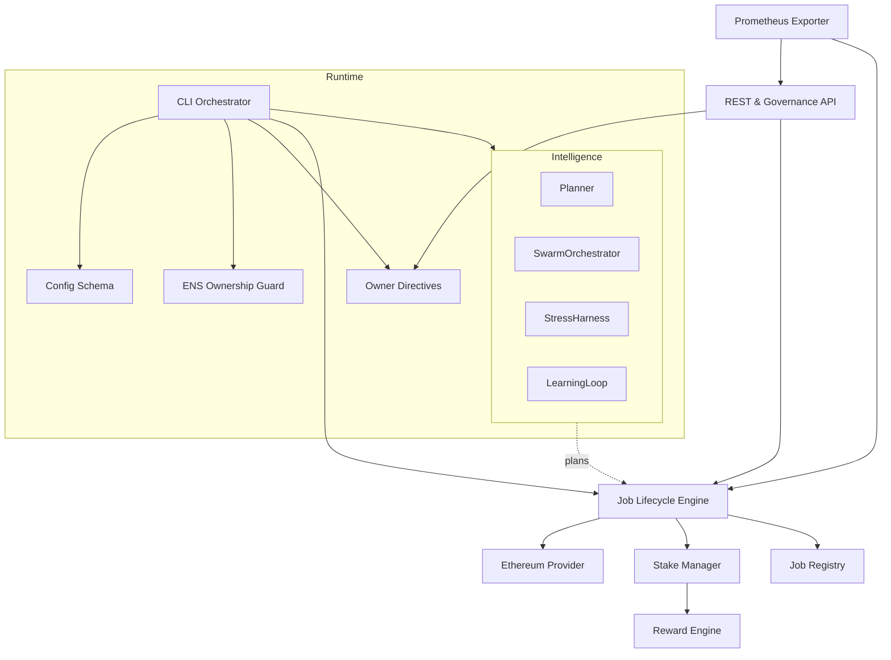

# AGI Alpha Node v0 ⚡ Sovereign Yield Intelligence Core

<!-- markdownlint-disable MD013 MD033 -->
<p align="center">
  
</p>

<p align="center">
  <a href="https://github.com/MontrealAI/AGI-Alpha-Node-v0/actions/workflows/ci.yml">
    
  </a>
  
  
  
  
  
  <a href="https://app.ens.domains/name/alpha.node.agi.eth">
    
  </a>
  <a href="https://etherscan.io/token/0xa61a3b3a130a9c20768eebf97e21515a6046a1fa">
    
  </a>
  
  <a href="Dockerfile">
    
  </a>
  <a href="LICENSE">
    
  </a>
</p>

> The AGI Alpha Node is the command spine for a sovereign intelligence yield engine. It locks ENS identity, wields $AGIALPHA liquidity, senses on-chain job flow, and mobilizes agentic swarms that can tilt entire markets the instant they awaken.

---

## Navigation

1. [Mission Charter](#mission-charter)
2. [Core Systems](#core-systems)
3. [Autonomous Lifecycle](#autonomous-lifecycle)
4. [System Topology](#system-topology)
5. [Operator Activation](#operator-activation)
6. [Configuration Matrix](#configuration-matrix)
7. [Owner Dominion](#owner-dominion)
8. [API & Telemetry Surface](#api--telemetry-surface)
9. [Deployment Continuum](#deployment-continuum)
10. [Observability & Assurance](#observability--assurance)
11. [Repository Atlas](#repository-atlas)
12. [Contributing](#contributing)
13. [License](#license)

---

## Mission Charter

| Vector | Signal | Coordinates |
| ------ | ------ | ----------- |
| **Identity Root** | ENS authority enforced before any workload activates. | [`alpha.node.agi.eth`](https://app.ens.domains/name/alpha.node.agi.eth) → delegated nodes such as `1.alpha.node.agi.eth`. |
| **Treasury Asset** | `$AGIALPHA` (18 decimals, canonical supply rail). | [Token contract `0xa61a3b3a130a9c20768eebf97e21515a6046a1fa`](https://etherscan.io/token/0xa61a3b3a130a9c20768eebf97e21515a6046a1fa). |
| **Runtime Spine** | CLI orchestrator verifies ENS, validates stake, and launches intelligence loops. | [`src/index.js`](src/index.js). |
| **Intelligence Mesh** | Planning lattice, swarm orchestrator, antifragile stress harness, curriculum evolution. | [`src/intelligence`](src/intelligence). |
| **Lifecycle Engine** | Deterministic discovery → apply → execute → submit → finalize. | [`src/services/jobLifecycle.js`](src/services/jobLifecycle.js), [`src/services/jobProof.js`](src/services/jobProof.js). |
| **Control Plane** | Owner-exclusive transaction builders and directive synthesis. | [`src/services/governance.js`](src/services/governance.js), [`src/services/controlPlane.js`](src/services/controlPlane.js). |
| **Telemetry Spine** | REST status bus plus Prometheus metrics for Grafana dashboards. | [`src/network/apiServer.js`](src/network/apiServer.js), [`src/telemetry/monitoring.js`](src/telemetry/monitoring.js). |
| **Deployment Surface** | Docker healthcheck + Helm charts for one-command activation. | [`Dockerfile`](Dockerfile), [`deploy/helm/agi-alpha-node`](deploy/helm/agi-alpha-node). |

---

## Core Systems

- **ENS Verification & Ownership Guard** – [`src/services/ensVerifier.js`](src/services/ensVerifier.js) ensures the node only operates under authorized subdomains and aborts instantly if authority is lost.
- **Planning Lattice** – [`src/intelligence/planning.js`](src/intelligence/planning.js) and [`src/intelligence/swarmOrchestrator.js`](src/intelligence/swarmOrchestrator.js) coordinate specialist agents, evaluate alpha scores, and drive deterministic execution.
- **Lifecycle Orchestrator** – [`src/services/jobLifecycle.js`](src/services/jobLifecycle.js) pairs with [`src/services/jobProof.js`](src/services/jobProof.js) and [`src/services/lifecycleJournal.js`](src/services/lifecycleJournal.js) to handle discovery, application, submission, and journaling.
- **Stake & Rewards Intelligence** – [`src/services/staking.js`](src/services/staking.js), [`src/services/rewards.js`](src/services/rewards.js), and [`src/services/economics.js`](src/services/economics.js) model thresholds, penalties, reinvestment, and share splits with BigInt precision.
- **Owner Control Plane** – [`src/services/controlPlane.js`](src/services/controlPlane.js) and [`src/services/governance.js`](src/services/governance.js) synthesize directives, craft governance payloads, and keep the operator in command.
- **Telemetry & Monitoring** – [`src/telemetry/monitoring.js`](src/telemetry/monitoring.js), [`src/network/apiServer.js`](src/network/apiServer.js), and [`src/orchestrator/monitorLoop.js`](src/orchestrator/monitorLoop.js) export Prometheus metrics, REST status, and compliance reporting.

---

## Autonomous Lifecycle

The node surveils on-chain intent, mobilizes specialists, and settles value flows with surgical precision. Every phase is restartable, observable, and test-backed.



### Validation-Ready Flow

```mermaid
flowchart LR
  A[Event Listener] -->|discover| B(Job Ledger)
  B -->|plan| C[AlphaPlanner]
  C -->|swarm directives| D[Specialist Modules]
  D -->|proofs| E[Commitment Builder]
  E -->|submit| F(JobRegistry)
  F -->|validation events| G[Validator Watch]
  G -->|verdict| H[Stake & Rewards]
  H -->|telemetry| I[Prometheus / REST]
```



---

## System Topology



---

## Operator Activation

1. **Clone & Install**

   ```bash
   git clone https://github.com/MontrealAI/AGI-Alpha-Node-v0.git
   cd AGI-Alpha-Node-v0
   npm install
   ```

2. **Configure Identity & Network**
   - Provide an ENS subdomain label via `NODE_LABEL` and matching `OPERATOR_ADDRESS`.
   - Supply an Ethereum RPC endpoint (`RPC_URL`) and optional whitelisted Merkle proof via `JOB_APPLICATION_PROOF`.
   - Keep `$AGIALPHA` token address pinned to `0xa61a3b3a130a9c20768eebf97e21515a6046a1fa` (18 decimals enforced by the config schema).
3. **Prime the Node**

   ```bash
   export NODE_LABEL=1
   export OPERATOR_ADDRESS=0xYourOperatorAddress
   export RPC_URL=https://your.ethereum.node
   npm start -- monitor
   ```

   The CLI will verify ENS control, inspect stake posture, launch monitoring loops, and emit owner directives from [`src/index.js`](src/index.js).
4. **API Surface**
   - Start the REST console: `npm start -- api`
   - Query status: `curl http://localhost:8080/status`
   - Inspect Prometheus feed: `curl http://localhost:9464/metrics`
5. **Autonomous Job Execution**
   - `npm start -- run` activates the deterministic lifecycle manager from [`src/services/jobLifecycle.js`](src/services/jobLifecycle.js).
   - Use `npm start -- swarm --agents orion:energy|finance:2` to experiment with alternative swarms defined in [`src/intelligence/swarmOrchestrator.js`](src/intelligence/swarmOrchestrator.js).

---

## Configuration Matrix

All environment switches are validated through [`src/config/schema.js`](src/config/schema.js), guaranteeing production-safe defaults. Key levers:

| Variable | Purpose | Default |
| -------- | ------- | ------- |
| `RPC_URL` | Ethereum RPC endpoint for contract calls and log surveillance. | `https://rpc.ankr.com/eth` |
| `ENS_PARENT_DOMAIN` | Parent ENS (e.g., `alpha.node.agi.eth`). | `alpha.node.agi.eth` |
| `NODE_LABEL` | Subdomain label bound to your operator wallet. | _Required for runtime_ |
| `OPERATOR_ADDRESS` | Ethereum address that holds the subdomain. | _Optional (derived from wallet if omitted)_ |
| `PLATFORM_INCENTIVES_ADDRESS` | Incentives contract for staking automation. | _Optional_ |
| `STAKE_MANAGER_ADDRESS` | StakeManager authority for governance controls. | _Optional_ |
| `REWARD_ENGINE_ADDRESS` | RewardEngine contract for share tuning. | _Optional_ |
| `JOB_REGISTRY_ADDRESS` | JobRegistry to engage with AGI Jobs v0/v2. | _Optional_ |
| `JOB_DISCOVERY_BLOCK_RANGE` | Log window for discovery sweeps. | `4800` |
| `DRY_RUN` | Non-destructive mode for simulation. | `true` |
| `AUTO_STAKE` | Enable automatic stake top-ups. | `false` |
| `DESIRED_MINIMUM_STAKE` | Governance target for minimum stake. | _Optional_ |
| `DESIRED_OPERATOR_SHARE_BPS`/`DESIRED_VALIDATOR_SHARE_BPS`/`DESIRED_TREASURY_SHARE_BPS` | Reward distribution targets in basis points. | _Optional_ |
| `ROLE_SHARE_TARGETS` | Fine-grained share overrides per role. | _Optional_ |
| `SYSTEM_PAUSE_ADDRESS` | System-wide pause contract for failsafe directives. | _Optional_ |
| `OFFLINE_SNAPSHOT_PATH` | Signed offline telemetry snapshots. | `.agi/lifecycle` |
| `METRICS_PORT` / `API_PORT` | Ports for Prometheus & REST. | `9464` / `8080` |

Additional toggles such as Vault integration, governance ledger storage, and lifecycle journals are detailed inline within the schema and supporting services.

---

## Owner Dominion

The operator retains absolute control through deterministic payload builders and directive synthesis:

- [`src/services/governance.js`](src/services/governance.js) crafts transactions for pausing, adjusting minimum stake, updating validator thresholds, re-pointing registries, tuning role shares, swapping validation modules, and delegating operators. Every payload includes metadata for ledgering and on-chain audit trails.
- [`src/services/controlPlane.js`](src/services/controlPlane.js) fuses live stake telemetry, reward projections, and operator preferences to recommend or auto-generate governance actions (pause, stake top-up, share realignment) while keeping `$AGIALPHA` math precise.
- [`src/network/apiServer.js`](src/network/apiServer.js) exposes REST endpoints so secured dashboards can trigger owner directives, stake activations, or dispute escalations without touching raw ABIs.
- [`src/services/staking.js`](src/services/staking.js) and [`src/services/stakeActivation.js`](src/services/stakeActivation.js) ensure the owner can authorize, activate, or reclaim stake in a single flow, preserving 18-decimal discipline at each step.

Every directive can be paused, simulated, or replayed through the governance ledger in [`src/services/governanceLedger.js`](src/services/governanceLedger.js), guaranteeing traceability.

---

## API & Telemetry Surface

The Agent Gateway binds intelligence modules, lifecycle orchestration, and owner controls into a unified interface:

- REST endpoints for job discovery, manual apply/submit/finalize overrides, and governance payload catalogues live in [`src/network/apiServer.js`](src/network/apiServer.js).
- Deterministic job proofs and submission payloads originate from [`src/services/jobProof.js`](src/services/jobProof.js) and are journaled via [`src/services/lifecycleJournal.js`](src/services/lifecycleJournal.js).
- Prometheus metrics exported from [`src/telemetry/monitoring.js`](src/telemetry/monitoring.js) capture stake posture, lifecycle throughput, latency, and antifragile stress scores for Grafana overlays.
- The CLI monitor loop in [`src/orchestrator/monitorLoop.js`](src/orchestrator/monitorLoop.js) merges ENS verification, stake health, compliance scoring, and planner feedback to present a complete situational dashboard.

---

## Deployment Continuum

- **Docker**: The [Dockerfile](Dockerfile) packages the runtime with healthcheck hitting [`src/healthcheck.js`](src/healthcheck.js). `docker build --tag agi-alpha-node .` followed by `docker run --rm agi-alpha-node --help` mirrors the CI smoke test.
- **Helm**: [`deploy/helm/agi-alpha-node`](deploy/helm/agi-alpha-node) ships Kubernetes manifests with readiness/liveness probes, secret wiring, and config maps aligned to the schema.
- **One-Command Bootstrap**: [`scripts/prepare-husky.cjs`](scripts/prepare-husky.cjs) primes Git hooks; [`deploy/docker/entrypoint.sh`](deploy/docker/entrypoint.sh) validates secrets, ENS bindings, and stake posture before starting services.
- **CI Pipeline**: [`./github/workflows/ci.yml`](.github/workflows/ci.yml) enforces linting, tests, coverage, and Docker smoke checks on every PR. Required status checks are codified in [`.github/required-checks.json`](.github/required-checks.json).

---

## Observability & Assurance

- Test suite (`npm test`) covers lifecycle orchestration, governance controls, staking math, intelligence modules, and monitoring surfaces using [Vitest](https://vitest.dev) (`test/*.test.js`).
- Coverage reports (`npm run coverage`) rely on `c8` instrumentation for deterministic audit trails.
- Markdown linting & link validation (`npm run lint`) lock documentation accuracy; README badges mirror the enforced CI steps.
- Prometheus metrics + `/status` heartbeat deliver real-time health and compliance insights for operators and auditors alike.

---

## Repository Atlas

| Path | Purpose |
| ---- | ------- |
| [`src/index.js`](src/index.js) | CLI entrypoint combining ENS verification, stake analytics, intelligence planning, and orchestration. |
| [`src/intelligence`](src/intelligence) | Planning, swarm coordination, antifragility stress testing, and curriculum evolution modules. |
| [`src/services`](src/services) | On-chain services: governance, staking, rewards, token, lifecycle, proofs, snapshots, control plane. |
| [`src/network`](src/network) | REST and governance API server bridging intelligence and owner controls. |
| [`src/orchestrator`](src/orchestrator) | Bootstrap, runtime diagnostics, and monitor loop logic. |
| [`src/telemetry`](src/telemetry) | Prometheus instrumentation and monitoring exports. |
| [`deploy`](deploy) | Docker entrypoints, Helm chart, and infrastructure manifests. |
| [`docs`](docs) | Strategic briefs and operator manuals for extended missions. |
| [`test`](test) | Comprehensive Vitest suite validating deterministic behavior across modules. |

---

## Contributing

1. Fork & branch (`git checkout -b feature/alpha-upgrade`).
2. Run lint + tests locally:

   ```bash
   npm run lint
   npm test
   npm run coverage
   ```

3. Ensure Docker smoke test passes: `docker build --tag agi-alpha-node . && docker run --rm agi-alpha-node --help`.
4. Submit PRs with CI passing and follow the security-first code review guidelines in `docs/`.

---

## License

Released under the [MIT License](LICENSE).
