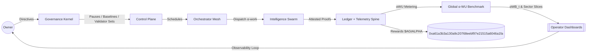
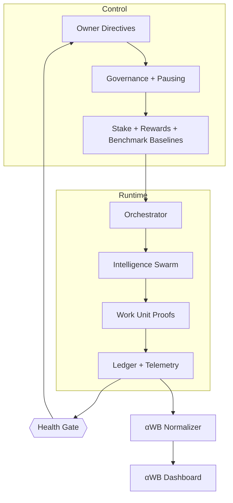
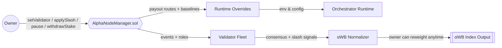
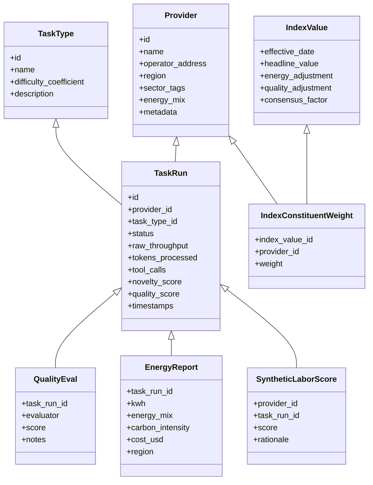
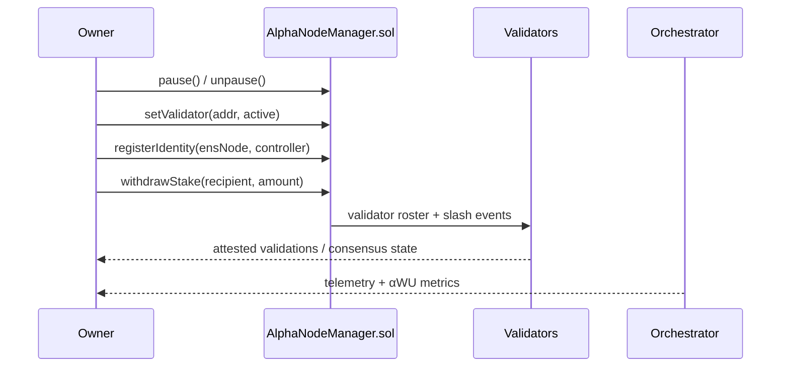

# AGI Alpha Node v0 · Cognitive Yield Engine ⚡

<!-- markdownlint-disable MD013 MD033 -->
<p align="center">
  <picture>
    <source srcset="1.alpha.node.agi.eth.svg" type="image/svg+xml" />
    
  </picture>
</p>

<p align="center">
  <a href="https://github.com/MontrealAI/AGI-Alpha-Node-v0/actions/workflows/ci.yml?query=branch%3Amain">
    
  </a>
  <a href=".github/required-checks.json">
    
  </a>
  
  
  
  <a href="https://etherscan.io/address/0xa61a3b3a130a9c20768eebf97e21515a6046a1fa"></a>
  
  <a href="LICENSE"></a>
  <a href="Dockerfile"></a>
  <a href="deploy/helm/agi-alpha-node"></a>
  <a href="docs/testing.md"></a>
</p>

> **AGI Alpha Node v0** is the sovereign cognitive yield engine that turns heterogeneous agentic work into verifiable α‑WU, anchors it to the `$AGIALPHA` treasury, and keeps every lever under the owner’s command—pause, re-weight, rotate validators, refresh baselines, and reroute rewards without redeploying code.



## Table of Contents

1. [Mission Snapshot](#mission-snapshot)
2. [Treasury & Tokenization](#treasury--tokenization)
3. [Architecture Atlas](#architecture-atlas)
4. [Core Domain Model & Persistence](#core-domain-model--persistence)
5. [Owner Command Surface](#owner-command-surface)
6. [Operations Quickstart](#operations-quickstart)
7. [Benchmark Configuration](#benchmark-configuration)
8. [Telemetry & Observability](#telemetry--observability)
9. [Health & Attestation Mesh](#health--attestation-mesh)
10. [Testing & CI Gates](#testing--ci-gates)
11. [Deployment Vectors](#deployment-vectors)
12. [Repository Atlas](#repository-atlas)
13. [Reference Snippets](#reference-snippets)

---

## Mission Snapshot

- **Canonical treasury binding** — Hardwired to the 18‑decimal `$AGIALPHA` contract [`0xa61a3b3a130a9c20768eebf97e21515a6046a1fa`](https://etherscan.io/address/0xa61a3b3a130a9c20768eebf97e21515a6046a1fa) for staking, rewards, and settlement.
- **Owner primacy everywhere** — Pausing, validator rosters, identity registration/rotation, stake withdrawals, α‑WB baselines, and governance signaling remain exclusively with the contract owner (`AlphaNodeManager.sol`).
- **Deterministic attestations** — Canonical JSON, signed payloads, and independent verification keep liveness and identity integrity provable across validators.
- **Production hardening** — Markdown + link linting, Vitest suites, coverage, Solidity lint/compile, subgraph builds, Docker smoke, npm audit, and policy/branch gates are enforced in CI and required on PRs/main.
- **Global productivity gauge** — α‑WU metering feeds the α‑WB benchmark, delivering a live, energy‑aware, quality‑aware “S&P 500 for autonomous work.”

## Treasury & Tokenization

- **Yield asset:** `$AGIALPHA` (18 decimals) at [`0xa61a3b3a130a9c20768eebf97e21515a6046a1fa`](https://etherscan.io/address/0xa61a3b3a130a9c20768eebf97e21515a6046a1fa) anchors staking, validator collateral, rewards, and settlement hooks.
- **Owner control:** The owner can pause/unpause, rotate validators, slash or reward, redirect staking flows, and refresh benchmark parameters without redeploying code.
- **Economic flywheel:** More α‑work → more α‑WU → more `$AGIALPHA` demand/staking → deeper validator security → richer α‑work pipelines.
- **Dynamic modulation:** Owner-level overrides can re-weight constituents, refresh baselines, and pause emissions to keep the treasury in perfect control while running AGI job markets at production pace.

## Architecture Atlas



- **Control Plane** — `AlphaNodeManager.sol` exposes owner-only levers: pause/unpause, validator rotation, identity lifecycle, stake movement, slash triggers, and benchmark baselines.
- **Runtime Orchestration** — `src/orchestrator/bootstrap.js` hydrates identity, stakes, telemetry, health gates, validator runtimes, and orchestrator loops before dispatching α‑work.
- **Telemetry Spine** — OpenTelemetry spans plus Prometheus metrics capture every health beat; console exporters keep local dev frictionless while OTLP endpoints ship spans upstream.
- **Validator Mesh** — Validators are owner-rotated, slashable, and replay workloads deterministically; the consensus factor feeds directly into α‑WB calculations.



## Core Domain Model & Persistence

AGI Alpha Nodes now ship a structured persistence layer that reflects providers, runs, telemetry, and index weights with first-class migrations and seed data.



- **Migrations:** Stored in `src/persistence/migrations` with `schema_migrations` tracking; includes indices on `provider_id`, `created_at`, and day buckets for rapid analytics.
- **Seeds:** Canonical task types (with difficulty coefficients) and exemplar providers with region + sector tags (`npm run db:seed`).
- **Repositories:** Typed repositories for Providers, TaskTypes, TaskRuns, QualityEvaluations, EnergyReports, SyntheticLaborScores, IndexValues, and IndexConstituentWeights live in `src/persistence/repositories.js`.
- **Owner observability:** Region, sector tags, energy mix, and metadata are captured to support owner-directed rebalancing and pausing decisions.

### Database commands

```bash
npm run db:migrate   # Apply migrations to the configured database (AGI_ALPHA_DB_PATH or :memory:)
npm run db:seed      # Seed task types and providers
```

## Owner Command Surface



- **Total command authority:** The contract owner controls pausing, validator activation, identity rotation, staking withdrawals, payout routing, and benchmark recalibration without redeploying.
- **Runtime overrides:** Environment-driven knobs (validation quorum, profiles, payout addresses) remain owner-editable for rapid operator action.

## Operations Quickstart

```bash
npm install              # Installs dependencies (Node.js 20.18+)
npm run db:migrate       # Bring the persistence layer online
npm run db:seed          # Load canonical task types and sample providers
npm test                 # Execute Vitest suite (includes persistence coverage)
node src/index.js --help # Discover runtime flags
```

- Configure environment via `.env` (see `src/config/schema.js`). Defaults pin `$AGIALPHA` at `0xa61a3b3a130a9c20768eebf97e21515a6046a1fa`.
- `scripts/local_cluster.mjs` spins a local orchestrator cluster; `docs/testing.md` details CI parity workflows.

## Benchmark Configuration

- **Unit of account (α‑WU):** Reference bundle of doc‑writing, code edits, research lookups, and data transforms at baseline difficulty/quality.
- **Adjustments:** Energy (`EA = cost_baseline / cost_observed`), quality (`QA = quality_observed / quality_baseline`), validator consensus (`VC` via replay + slash proofs).
- **Index construction:** Free-float work-share weights (caps/floors, rolling 90 days) → headline `αWB_t` plus sector/geo/energy sub-indices; owner can reweight constituents in real time.

## Telemetry & Observability

- OpenTelemetry traces + Prometheus metrics in `src/telemetry`; default console exporters for local use, OTLP endpoints for upstream collectors.
- Health beacons and attestation payloads are signed and JSON-canonicalized for reproducible audits (`src/healthcheck.js`, `src/validation`).

## Health & Attestation Mesh

- `startHealthChecks` emits liveness signals with latency-aware signatures; `verifierServer` exposes canonical payloads for dashboards and third-party auditors.
- Owner-controlled allowlists keep validation traffic restricted to registered ENS identities.

## Testing & CI Gates

- **Required checks:** Markdown lint, link validation, Vitest, coverage, Solidity lint/compile, subgraph build, npm audit, policy gate, branch gate.
- **Local parity:** `npm run ci:verify` executes the full gate stack.
- **Coverage:** `npm run coverage` produces lcov + JSON summaries for dashboards.

## Deployment Vectors

- **Docker:** `docker build -t agi-alpha-node:local .` then run with `NODE_LABEL`, `OPERATOR_ADDRESS`, and `RPC_URL` exports; CI smoke-tests `--help` output.
- **Helm:** Charts in `deploy/helm/agi-alpha-node` support Kubernetes rollouts with observability baked in.
- **Subgraph:** `npm --prefix subgraph run build:ci` keeps indexers aligned with emitted events.

## Repository Atlas

- `contracts/` — Solidity sources including `AlphaNodeManager.sol` (owner authority, pausing, validator sets, slashing, mint/accept hooks).
- `src/` — Runtime orchestration, telemetry, validation, persistence, ENS, attestation, and services.
- `scripts/` — CI support (branch/health gates, ENS inspection, solc harnesses, subgraph manifest rendering).
- `docs/` — αWB specification, testing playbook, economics, identity, and manifesto.

## Reference Snippets

```solidity
// Owner keeps full command — pause, rotate validators, re-route stakes
function pause() external onlyOwner { paused = true; emit Paused(msg.sender); }
function setValidator(address validator, bool active) external onlyOwner { /* ... */ }
function applySlash(bytes32 id, address validator, uint256 amount) external onlyOwner { /* ... */ }
```

```bash
# Persistence lifecycle
npm run db:migrate
npm run db:seed
```

```bash
# End-to-end CI gate (local parity)
npm run ci:verify
```
