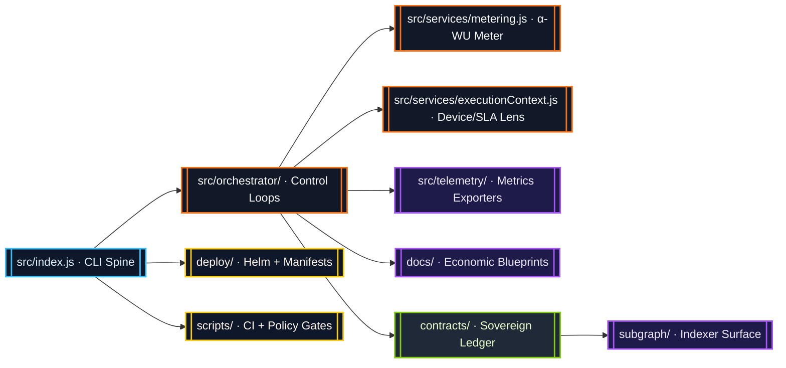
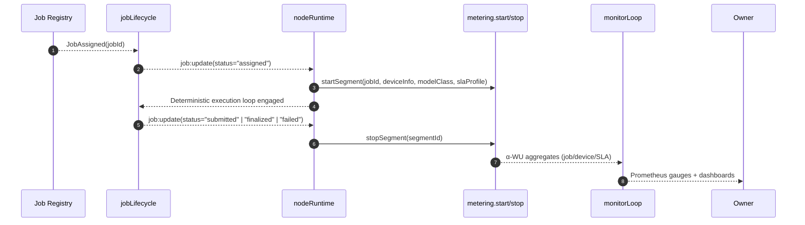
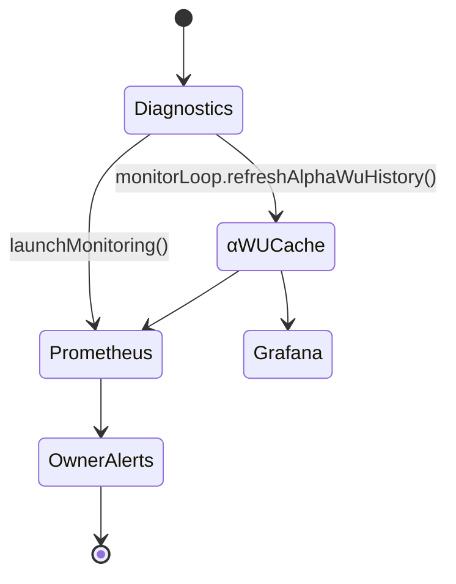

# AGI Alpha Node v0 · HyperSovereign Cognition Mesh ⚡

<!-- markdownlint-disable MD013 MD033 -->
<p align="center">
  <picture>
    <source srcset="1.alpha.node.agi.eth.svg" type="image/svg+xml" />
    
  </picture>
</p>

<p align="center">
  <a href="https://github.com/MontrealAI/AGI-Alpha-Node-v0/actions/workflows/ci.yml">
    
  </a>
  
  
  <a href="Dockerfile">
    
  </a>
  <a href="deploy/helm/agi-alpha-node">
    
  </a>
  <a href="https://etherscan.io/address/0xa61a3b3a130a9c20768eebf97e21515a6046a1fa">
    
  </a>
  <a href="LICENSE">
    
  </a>
</p>

> A sovereign cognition spine that fuses deterministic execution, tokenized economics, and metered intelligence into a single command lattice under absolute owner control.

---

## Table of Contents

1. [Singularity Mission](#singularity-mission)
2. [System Constellation](#system-constellation)
3. [Deterministic Execution Lattice](#deterministic-execution-lattice)
4. [Metering Conductor](#metering-conductor)
5. [Device & SLA Intelligence](#device--sla-intelligence)
6. [Lifecycle Journal & Governance Synthesis](#lifecycle-journal--governance-synthesis)
7. [Smart-Contract Sovereignty](#smart-contract-sovereignty)
8. [Telemetry & Insight Weave](#telemetry--insight-weave)
9. [Deployment & Operations](#deployment--operations)
10. [Continuous Integration](#continuous-integration)
11. [Quickstart](#quickstart)
12. [Testing & Quality Gates](#testing--quality-gates)
13. [Further Reading](#further-reading)

---

## Singularity Mission

AGI Alpha Node v0 is engineered as a production-grade cognition mesh that continuously arbitrages global inefficiencies. The runtime synchronizes blockchain truth, GPU enclaves, metered α-work units, and governance levers so the contract owner can bend the network to any strategy in real time. Every module is designed for immediate execution by a single operator while sustaining planetary scale throughput.

* **Canonical Token:** `$AGIALPHA` (18 decimals) is fixed at [`0xa61a3b3a130a9c20768eebf97e21515a6046a1fa`](https://etherscan.io/address/0xa61a3b3a130a9c20768eebf97e21515a6046a1fa) and hard-coded across runtime, contracts, and config validation.
* **Owner Totality:** Contracts and CLI expose pause/resume, validator curation, ENS authority rotation, treasury extraction, and SLA mutation in seconds.
* **Deterministic Metering:** Every deterministic execution loop is measured, weighted, and aggregated into α-work units for rewards, dashboards, and governance triggers.
* **Operator UX:** Container images, Helm charts, Prometheus exporters, and Grafana atlases ensure a non-technical operator can deploy and audit safely.

---

## System Constellation

The repository is organized as a constellation of tightly coupled surfaces. The diagram below highlights the major components and how data flows through them.



| Surface | Description |
| --- | --- |
| [`src/`](src) | Node.js runtime, deterministic execution loop, metering service, execution context helpers, telemetry exporters, and orchestration logic. |
| [`contracts/`](contracts) | Solidity control plane anchored by `AlphaNodeManager` with owner-controlled pausing, validator curation, identity mesh, and stake custody. |
| [`docs/`](docs) | Economics treatises, telemetry atlases, α-WU framework, and operator runbooks. |
| [`deploy/`](deploy) | Helm chart, Kubernetes manifests, and operational automation. |
| [`scripts/`](scripts) | CI gates, subgraph rendering, governance verification, and policy tooling. |
| [`subgraph/`](subgraph) | Graph Protocol mappings for α-WU events, governance signals, and operator leaderboards. |

---

## Deterministic Execution Lattice

The orchestrator binds job lifecycle events to metering and telemetry so each deterministic execution loop is observable, accountable, and owner-directed.



Key orchestrator entry points:

* [`bindExecutionLoopMetering`](src/orchestrator/nodeRuntime.js) wires lifecycle events to `startSegment` / `stopSegment`, ensuring every deterministic loop is measured.
* [`startMonitorLoop`](src/orchestrator/monitorLoop.js) refreshes diagnostics, updates Prometheus gauges, and maintains a rolling α-WU history via `getRecentEpochSummaries`.
* [`bootstrapContainer`](src/orchestrator/bootstrap.js) coordinates config loading, job lifecycle watchers, health gate state, metering binding, telemetry server, and optional monitor loop.

---

## Metering Conductor

The metering service (`src/services/metering.js`) captures GPU minutes, multiplies by configured quality weights, and emits α-work unit aggregates by job, device class, and SLA profile. It operates entirely in-memory for instantaneous feedback and feeds downstream telemetry.

```mermaid
graph TD
  classDef store fill:#0f172a,stroke:#38bdf8,color:#e0f2fe;
  classDef compute fill:#1f2937,stroke:#a855f7,color:#ede9fe;

  Start[startSegment(jobId, deviceInfo, modelClass, slaProfile)]:::compute --> Active[(Active Segment Map)]:::store
  Active --> Stop[stopSegment(segmentId)]:::compute
  Stop --> Totals[(Epoch Buckets & Job Totals)]:::store
  Totals --> Aggregates[getRecentEpochSummaries()]:::compute
  Aggregates --> Telemetry[[monitorLoop.getAlphaWuHistory()]]:::compute
  Totals --> API[[getJobAlphaWU() / getJobAlphaSummary() / getGlobalAlphaSummary() / getEpochAlphaWU()]]:::compute
```

Usage highlights:

```js
import {
  startSegment,
  stopSegment,
  getJobAlphaSummary,
  getGlobalAlphaSummary,
  getEpochAlphaWU
} from './src/services/metering.js';

const { segmentId, epochId } = startSegment({
  jobId: 'job-42',
  deviceInfo: { deviceClass: 'A100-80GB', vramTier: 'TIER_80', gpuCount: 2 },
  modelClass: 'LLM_70B',
  slaProfile: 'LOW_LATENCY_ENCLAVE'
});

// ...deterministic execution loop...

const segment = stopSegment(segmentId);
console.log(segment.alphaWU); // Weighted α-work units for the loop

const epoch = getEpochAlphaWU(epochId);
console.table(epoch.alphaWU_by_job); // Rolling aggregates for telemetry and payouts

const jobSummary = getJobAlphaSummary('job-42');
console.table(jobSummary.modelClassBreakdown); // Quality-adjusted mix for proof + ledger

const networkSummary = getGlobalAlphaSummary();
console.log(networkSummary.total); // Platform-wide cognitive throughput
```

Weights and epoch cadence are derived from [`WORK_UNITS`](src/config/schema.js) with defaults declared in [`src/constants/workUnits.js`](src/constants/workUnits.js). Override weights by exporting `WORK_UNITS` JSON (validated by schema) to immediately tune economics.

---

## Device & SLA Intelligence

`src/services/executionContext.js` enriches metering with real-world hardware and SLA insights:

* **`getDeviceInfo()`** inspects environment variables (`GPU_MODEL`, `GPU_VRAM_GB`, `GPU_COUNT`, `NODE_LABEL`, etc.) and classifies VRAM into canonical tiers.
* **`getSlaProfile(jobConfig, runtimeConfig)`** normalizes SLA hints from job metadata, tags (`sla:LOW_LATENCY_ENCLAVE`), runtime overrides, or environment defaults.

These helpers keep `bindExecutionLoopMetering` fully deterministic—segments inherit device benchmarks and SLA weights without manual intervention.

---

## Lifecycle Journal & Governance Synthesis

Completion telemetry now flows through a triad of metering, journaling, and governance ledgers so every α-WU is provably accounted for when the owner executes policy changes.

```mermaid
flowchart TB
  classDef ledger fill:#111827,stroke:#84cc16,stroke-width:2px,color:#ecfccb;
  classDef journal fill:#0f172a,stroke:#38bdf8,stroke-width:2px,color:#e0f2fe;
  classDef service fill:#1e1b4b,stroke:#a855f7,stroke-width:2px,color:#ede9fe;
  classDef control fill:#1f2937,stroke:#f97316,stroke-width:2px,color:#f8fafc;

  Metering[[metering.stopSegment()]]:::service --> AlphaSummary[[getJobAlphaSummary()]]:::service
  AlphaSummary --> Lifecycle[[jobLifecycle.finalize()]]:::journal
  Lifecycle --> Journal[[lifecycleJournal.append()]]:::journal
  AlphaSummary --> Proof[[createJobProof()]]:::service
  Proof --> Governance[[recordGovernanceAction()]]:::ledger
  Governance --> Owner[[Owner CLI/API Submit, Stake, Reward]]:::control
```

Key integrations:

* **Lifecycle enrichment:** `jobLifecycle` automatically calls `getJobAlphaWU` / `getJobAlphaSummary` during finalization. The resulting `alphaWU` object (totals, model-class distribution, SLA distribution, per-segment detail) is cached on the job record and hashed into every journal entry for tamper-evident provenance.
* **Proof payloads:** `createJobProof` now emits `{ resultUri, alphaWU }` alongside deterministic commitments so validators, auditors, or zk pipelines can validate the quality mix attached to a commitment before it touches chain.
* **Ledger augmentation:** Every governance ledger entry whose `meta.method` contains `submit`, `stake`, or `reward` is auto-enriched with either job-scoped or global α-WU rollups. Stake moves and reward receipts are therefore contextualized with the exact cognitive throughput that motivated them.

Programmatic access:

```js
import {
  getJobAlphaSummary,
  getGlobalAlphaSummary
} from './src/services/metering.js';

const jobAlpha = getJobAlphaSummary('0x…jobId');
console.log(jobAlpha.total, jobAlpha.modelClassBreakdown);

const networkAlpha = getGlobalAlphaSummary();
console.table(networkAlpha.slaBreakdown);
```

Ledger entries written via CLI (`agi-alpha-node governance …`) or the API server will always embed these structures, making compliance, auditing, and revenue attribution immediate even under extreme operational tempo.

---

## Smart-Contract Sovereignty

The Solidity surface is tuned for absolute owner authority while maintaining protocol integrity.

| Contract | Highlights | Owner Controls |
| --- | --- | --- |
| [`AlphaNodeManager.sol`](contracts/AlphaNodeManager.sol) | Ownable orchestrator for validators, staking, identity registry, and α-WU event emission. | Pause/unpause, curate validators, register/rotate ENS controllers, toggle identities, withdraw stake, and enforce minimums instantly. |
| [`IAlphaWorkUnitEvents.sol`](contracts/interfaces/IAlphaWorkUnitEvents.sol) | Shared ABI for runtime, telemetry, and subgraph ingestion. | Emits `AlphaWUMinted`, `AlphaWUValidated`, `AlphaWUAccepted`, `SlashApplied`. |

Every control surfaces through the CLI (see [`src/index.js`](src/index.js)) and is guarded by CI policy tests (`npm run ci:policy`). Treasury operations, validator rotations, and pause sequences are executable by a single owner wallet—no hidden multisig.

---

## Telemetry & Insight Weave

Prometheus exporters and Grafana atlases render the cognition field in real time.



* Prometheus gauges and counters reside in [`src/telemetry/monitoring.js`](src/telemetry/monitoring.js).
* α-WU summaries (overall, by job, device class, and SLA) are emitted through `monitor.getAlphaWuHistory()` for dashboards or automated payouts.
* Grafana JSON atlases live in [`docs/telemetry`](docs/telemetry) for immediate import.
* Health gate state (`src/services/healthGate.js`) ensures telemetry reflects whether the node is ready or sealed.

---

## Deployment & Operations

| Surface | Highlights |
| --- | --- |
| [`Dockerfile`](Dockerfile) | Node.js 20 image with CLI, telemetry exporter, health checks, and deterministic dependencies. |
| [`deploy/helm/agi-alpha-node`](deploy/helm/agi-alpha-node) | Helm chart wiring ConfigMaps, secrets, Prometheus scraping, and rollout policies. |
| [`scripts/`](scripts) | Health gate verification, subgraph manifest rendering, governance payload builders, branch policy enforcement. |

Operational blueprint:

1. **Bootstrap** – `npm install && node src/index.js diagnostics` to validate ENS, staking, and governance posture.
2. **Containerize** – Build/pull the Docker image, inject `.env` overrides, and deploy via Helm.
3. **Observe** – Point Prometheus to `METRICS_PORT` (default `9464`) and import Grafana dashboards.
4. **Govern** – Use CLI governance commands or the API server (`src/network/apiServer.js`) to issue owner directives, rotate validators, or rebalance stakes.

Owner retains unilateral ability to pause, resume, and mutate economic levers while telemetry confirms every action.

---

## Continuous Integration

All commits and pull requests are validated by [`ci.yml`](.github/workflows/ci.yml) with required checks enforced on `main` and PR branches.

| Check | Scope |
| --- | --- |
| `Lint Markdown & Links` | `npm run lint` (Markdown lint + link check) |
| `Unit & Integration Tests` | `npm run test` (Vitest suite) |
| `Coverage Report` | `npm run coverage` (c8 + Vitest) |
| `Docker Build & Smoke Test` | Container build verification |
| `Solidity Lint & Compile` | `npm run ci:solidity` (solhint + solcjs) |
| `Subgraph TypeScript Build` | `npm run ci:ts` |
| `Dependency Security Scan` | `npm run ci:security` |
| `Policy & Branch Gates` | `npm run ci:policy` + `npm run ci:branch` |

The CI badge at the top of this README reflects the current status; merges are blocked until every gate is green.

---

## Quickstart

```bash
npm install
npm run start -- --help                 # Explore CLI commands and governance levers
node src/index.js diagnostics           # One-shot diagnostics (ENS, staking, governance)
npm run lint                            # Markdown + link linting
npm run test                            # Vitest unit and integration suite
npm run ci:verify                       # Full CI pipeline locally
```

Inject configuration via environment variables or `.env` files:

```bash
export RPC_URL="https://rpc.ankr.com/eth"
export NODE_LABEL="1"
export OPERATOR_ADDRESS="0x..."
export GPU_MODEL="NVIDIA-H100"
export GPU_VRAM_GB="80"
export WORK_UNITS='{"weights":{"slaProfile":{"LOW_LATENCY_ENCLAVE":2.5}}}'
node src/index.js jobs list
```

---

## Testing & Quality Gates

| Command | Purpose |
| --- | --- |
| `npm run lint` | Markdown linting + link validation across README and docs. |
| `npm run test` | Vitest suite covering orchestrator, metering, governance, and telemetry modules. |
| `npm run coverage` | Generates coverage reports (text, lcov, JSON summary). |
| `npm run ci:verify` | Mirrors the GitHub Actions workflow locally. |
| `npm run ci:solidity` | Solidity lint + compilation. |
| `npm run ci:ts` | Subgraph TypeScript generation and build. |

---

## Further Reading

* [$AGIALPHA Token Constants](src/constants/token.js)
* [α-WU Canonical Framework](docs/alpha-wu.md)
* [Telemetry Atlases](docs/telemetry)
* [Economics Treatise](docs/economics.md)
* [Operator Runbook](docs/operator-runbook.md)
* [Manifesto](docs/manifesto.md)

---

### License

Released under the [MIT License](LICENSE).
