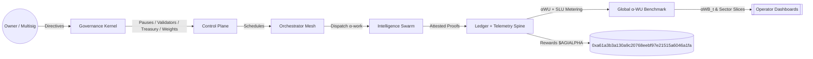
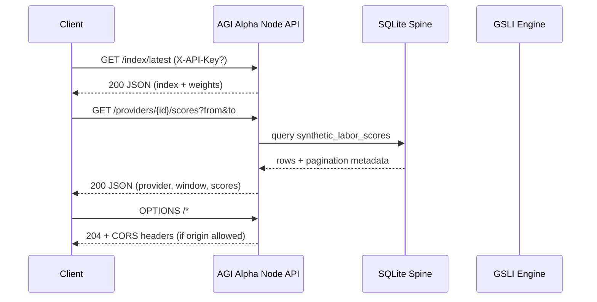
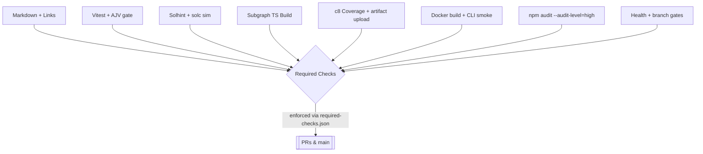

# AGI Alpha Node v0 · Cognitive Yield Engine ⚡️

<!-- markdownlint-disable MD012 MD013 MD033 -->
<p align="center">
  <picture>
    <source srcset="1.alpha.node.agi.eth.svg" type="image/svg+xml" />
    
  </picture>
</p>

<p align="center">
  <a href="https://github.com/MontrealAI/AGI-Alpha-Node-v0/actions/workflows/ci.yml?query=branch%3Amain">
    
  </a>
  <a href=".github/required-checks.json">
    
  </a>
  <a href="https://github.com/MontrealAI/AGI-Alpha-Node-v0/actions?query=branch%3Amain">
    
  </a>
  
  
  
  
  <a href="https://etherscan.io/address/0xa61a3b3a130a9c20768eebf97e21515a6046a1fa">
    
  </a>
  
  
  <a href="LICENSE">
    
  </a>
  
  
  <a href="Dockerfile">
    
  </a>
  <a href="deploy/helm/agi-alpha-node">
    
  </a>
  
  
</p>

> **AGI Alpha Node v0** metabolizes heterogeneous agentic labor into verifiable α‑Work Units (α‑WU) and Synthetic Labor Units (SLU), prices yield against energy, quality, and consensus, rebalances the Global Synthetic Labor Index (GSLI), exposes read-only REST telemetry, and routes the `$AGIALPHA` treasury (token: `0xa61a3b3a130a9c20768eebf97e21515a6046a1fa`, 18 decimals) under complete owner command. Every lever can be paused, rerouted, or retuned without redeploying, delivering a production-grade intelligence core designed to reshape markets at machine speed.

## Table of contents

- [Why this node](#why-this-node)
- [System architecture](#system-architecture)
- [Epic 4 – Global Synthetic Labor Index (GSLI)](#epic-4--global-synthetic-labor-index-gsli)
- [Epic 5 – Public API (read-only)](#epic-5--public-api-read-only)
- [Public API reference & shapes](#public-api-reference--shapes)
- [Telemetry spine & ingestion](#telemetry-spine--ingestion)
- [Owner controls & on-chain levers](#owner-controls--on-chain-levers)
- [Data spine & migrations](#data-spine--migrations)
- [Quickstart (non-technical friendly)](#quickstart-non-technical-friendly)
- [Backfill & simulation harness](#backfill--simulation-harness)
- [CI, gates, and release discipline](#ci-gates-and-release-discipline)
- [Operations playbook](#operations-playbook)
- [Repository atlas](#repository-atlas)
- [Appendix: CLI recipes](#appendix-cli-recipes)

## Why this node

- **Owner-first sovereignty**: The contract owner holds absolute command—pausing, validator rotation, emissions, treasury routing, productivity bindings, registry upgrades, and metadata are all callable through `contracts/AlphaNodeManager.sol` with calldata builders in `src/services/governance.js` and CLI wrappers in `src/index.js`. No redeploys, no loss of control.
- **Index-grade telemetry**: JSON Schema–verified payloads, hashed API keys, and idempotent task-run recording preserve signal integrity while eliminating duplicates or malformed submissions.
- **Deterministic data spine**: SQLite migrations seed providers, task types, runs, telemetry, SLU snapshots, index values, and constituent weights with indexes on provider/day for immediate dashboards and subgraph alignment.
- **Production-safe defaults**: The CLI, seeds, CI gates, Helm chart, and Docker build mirror automation paths so a non-specialist can bootstrap a production-critical node with a handful of commands.
- **Autonomous alpha extraction**: Agentic swarms route jobs through provider meshes, generating synthetic labor, quality, and energy telemetry that continuously tunes the `$AGIALPHA` flywheel—the intelligence core designed to out-learn, out-strategize, and out-execute.

## System architecture



```mermaid
graph TD
  subgraph Ingestion[Telemetry Ingestion v0]
    APIKeys[X-API-Key (hashed)] --> Gate[Provider Resolver]
    Gate --> Validator[JSON Schema v0]
    Validator -->|TaskRunTelemetry| TaskRuns[(task_runs)]
    Validator -->|EnergyReportPayload| Energy[(energy_reports)]
    Validator -->|QualityEvalPayload| Quality[(quality_evaluations)]
    Validator -->|ValidatorConsensus| VC[(synthetic_labor_scores.metadata)]
    TaskRuns --> Dedup[Idempotency Guard]
  end

  subgraph PublicAPI[Public API]
    GSLI[/GET /index/*\nread-only/] --> Dash[Dashboards]
    Providers[/GET /providers/*\nCORS scoped/] --> Dash
    APIKey[(Optional Public Read Key)] --> PublicAPI
  end

  subgraph Control[Owner Control Plane]
    pause[Pause / Unpause]
    rotate[Rotate Validators]
    stakeOps[Stake Withdrawals]
    identityOps[ENS Identity Lifecycle]
    weights[Index Weights]
  end

  subgraph Data[Telemetry & Data Spine]
    providers[(providers)]
    tasks[(task_types)]
    runs[(task_runs)]
    quality[(quality_evaluations)]
    energy[(energy_reports)]
    synth[(synthetic_labor_scores)]
    idx[(index_values)]
  end

  Owner[[Owner Multisig]] --> Control
  Control -->|Commands| Ingestion
  PublicAPI --> Dash
  Ingestion -->|Verified signals| Data
  Data -->|αWB snapshots| Control
  Control -->|Treasury Signals| Token[$AGIALPHA 0xa61a...a1fa]
```

## Epic 4 – Global Synthetic Labor Index (GSLI)

The index engine in `src/services/globalIndexEngine.js` fulfills the Epic 4 brief with reproducible eligibility, weight construction, and divisor-aware headline values.

```mermaid
flowchart LR
  subgraph Eligibility[Daily Eligibility]
    window30[30d SLU Window] --> filter{SLU ≥ minimum}
    providers[(providers)] --> window30
    filter --> eligible[Eligible Providers]
    filter -.-> excluded[Excluded w/ reason]
  end

  subgraph Weights[Work-share Weights]
    eligible --> aggregate[90d SLU Aggregates]
    aggregate --> normalize[Normalize w_i]
    normalize --> cap[Cap at configurable %]
    cap --> weightSet[weight_set_id + metadata]
  end

  subgraph Index[Index_t Computation]
    weightSet --> multiply[Σ(w_i_base · SLU_i_t)]
    multiply --> divisor[/Base Divisor/]
    divisor --> headline[Index_t stored]
  end

  subgraph History[Backfill & Simulation]
    headline --> timeline[Index history]
    timeline --> dashboards[[Dashboards & Subgraph]]
  end
```

- **Constituent selection**: `selectEligibleProviders` filters providers by SLU over a configurable window and marks exclusions with reasons (`no_observed_history` vs `below_minimum_slu_30d`) plus metadata for audit trails.
- **Weighting logic**: Work-share weights follow \( w_i = \frac{SLU_i}{\sum_j SLU_j} \), capped (default 15%) with proportional redistribution and `capped` flags stored in `index_constituent_weights`.
- **Index value**: \( \text{Index}_t = \frac{\sum_i w_i^{base} \cdot SLU_{i,t}}{\text{BaseDivisor}} \) with `divisor_version` and `weight_set_id` persisted in `index_values` for replayable dashboards.
- **Rebalancing**: Monthly by default (`rebalanceIntervalDays` = 30). New weight sets retain previous versions for reproducibility with metadata on eligibility windows and capped providers.
- **CLI controls**: `index:eligibility` reports eligible/excluded providers, `index:rebalance` mints versioned weight sets with custom divisors, and `index:daily` computes headline values for any stored weight set.

## Epic 5 – Public API (read-only)

The public API exposes the GSLI surface and provider SLU metrics for dashboards. Requests are open by default and can be gated with `API_PUBLIC_READ_KEY`; CORS is scoped with `API_DASHBOARD_ORIGIN`.

### Endpoints

| Method | Path | Query | Description |
| ------ | ---- | ----- | ----------- |
| GET | `/index/latest` | — | Latest headline value, weight set, and constituent weights. |
| GET | `/index/history` | `from`, `to`, `limit`, `offset` | Paginated history of index values within a date window. |
| GET | `/providers` | `limit`, `offset` | Provider catalog with most recent SLU score per provider. |
| GET | `/providers/{id}/scores` | `from`, `to`, `limit`, `offset` | Paginated SLU scores for a provider across a date window. |



- **Authentication**: If `API_PUBLIC_READ_KEY` is set, requests must provide `X-API-Key` or `Authorization: Bearer <key>`.
- **CORS**: Set `API_DASHBOARD_ORIGIN` to `*` or a specific dashboard origin; preflight (`OPTIONS`) responses are automatic.
- **Pagination**: `limit` defaults to 30 (`/index/history` and provider scores) or 25 (`/providers`); `offset` drives stable pagination with `nextOffset` hints.

## Public API reference & shapes

The API is deterministic so dashboards can render without client-side guesswork. Fields are stable and tested in `test/apiServer.test.js`.

| Endpoint | Success payload (top-level) | Notes |
| -------- | -------------------------- | ----- |
| `/index/latest` | `{ index, weight_set, constituents[] }` | `constituents[*].provider` is hydrated when known; dates are `YYYY-MM-DD`. |
| `/index/history` | `{ window, pagination, items[] }` | `pagination.nextOffset` is `null` when the page ends. |
| `/providers` | `{ providers[], pagination }` | Each provider includes `latest_score` (or `null`) and sector/energy metadata. |
| `/providers/{id}/scores` | `{ provider, window, pagination, scores[] }` | `scores[*]` align with `synthetic_labor_scores` rows, ordered chronologically. |

Examples (with optional public key):

```bash
curl -H "X-API-Key: $PUBLIC_KEY" "$API_HOST/index/latest"
curl -H "X-API-Key: $PUBLIC_KEY" "$API_HOST/index/history?from=2024-01-01&to=2024-02-01&limit=30"
curl -H "X-API-Key: $PUBLIC_KEY" "$API_HOST/providers?limit=20&offset=0"
curl -H "X-API-Key: $PUBLIC_KEY" "$API_HOST/providers/1/scores?from=2024-01-01&to=2024-02-01&limit=10"
```

```mermaid
flowchart LR
  Client[[Dashboard / Partner]] -->|GET| Latest[/index/latest\n+ weights + constituents/]
  Client -->|GET| History[/index/history?from&to&limit/]
  Client -->|GET| Providers[/providers?limit&offset/]
  Client -->|GET| Scores[/providers/{id}/scores?from&to/]
  subgraph Security[Optional API key + scoped CORS]
    Key[X-API-Key or Bearer token]
    Origin[API_DASHBOARD_ORIGIN]
  end
  Security --> Latest
  Security --> History
  Security --> Providers
  Security --> Scores
```

### Example (with optional API key and CORS)

```bash
# Latest index snapshot
curl -H "X-API-Key: $PUBLIC_KEY" https://localhost:8080/index/latest

# Index history with pagination
curl -H "X-API-Key: $PUBLIC_KEY" "https://localhost:8080/index/history?from=2024-01-01&to=2024-02-01&limit=30"

# Provider catalog
curl -H "X-API-Key: $PUBLIC_KEY" "https://localhost:8080/providers?limit=20&offset=0"

# Provider scores (id 1) over a window
curl -H "X-API-Key: $PUBLIC_KEY" "https://localhost:8080/providers/1/scores?from=2024-01-01&to=2024-02-01&limit=10"
```

## Telemetry spine & ingestion

- **Schemas**: AJV-backed schemas in `spec/*.schema.json` validate task runs, energy reports, and quality evaluations.
- **API keys**: Provider API keys are hashed (`sha256` by default) and stored in `provider_api_keys`; rate-limit hints surface via `X-RateLimit-*` headers.
- **Ingestion endpoints**: `/ingest/task-runs`, `/ingest/energy`, `/ingest/quality` accept JSON payloads with `X-API-Key` or `Authorization: Bearer <key>`.
- **Idempotency**: `idempotency_key` on task runs prevents duplicate submissions; quality/energy telemetry is linked back to the originating task.
- **Schemas-at-rest**: Normalized telemetry lands in `task_runs`, `energy_reports`, and `quality_evaluations` with optional metadata and schema versioning fields.

## Owner controls & on-chain levers

- **Complete owner control**: Contract owner can pause/unpause, rotate validators, adjust minimum stakes, configure emission curves, redirect treasuries, rotate registries, and update metadata. Calldata builders live in `src/services/governance.js`; the Solidity surface is in `contracts/AlphaNodeManager.sol`.
- **Runtime mutability**: Owner tokens unlock governance endpoints in `src/network/apiServer.js` so changes can be pushed without redeploys. Every control path is exposed via CLI verbs in `src/index.js` (e.g., `governance:pause`, `incentives:set-rate`, `identity:set-record`).
- **Observability**: Governance actions write to an internal ledger for auditability; wallet-facing helpers in `src/services/token.js` expose approvals and allowances for `$AGIALPHA` orchestration.

## Data spine & migrations

- **Database**: SQLite with WAL enabled and foreign keys enforced by `src/persistence/database.js`.
- **Migrations**: Versioned SQL in `src/persistence/migrations/*.sql` seeds providers, task types, telemetry tables, synthetic labor snapshots, and index constituent weights/weight sets.
- **Repositories**: CRUD wrappers in `src/persistence/repositories.js` normalize JSON metadata, enforce uniqueness, and expose pagination helpers for SLU history and index values.
- **Seeds**: `npm run db:seed` or `initializeDatabase({ withSeed: true })` plants sample providers/tasks for dashboards and tests.

## Quickstart (non-technical friendly)

1. **Install Node.js 20.18+ & npm 10+** (or use the provided `Dockerfile`).
2. **Clone and install**:

   ```bash
   git clone https://github.com/MontrealAI/AGI-Alpha-Node-v0.git
   cd AGI-Alpha-Node-v0
   npm ci
   ```

3. **Bootstrap local data** (in-memory by default):

   ```bash
   npm run db:seed
   ```

4. **Run the node** (read-only API on `PORT`/`API_PORT`, metrics on `/metrics`):

   ```bash
   npm start -- --help          # discover CLI verbs
   npm start                    # launches API + telemetry spine
   ```

5. **Secure the API** (optional): set `API_PUBLIC_READ_KEY` and `API_DASHBOARD_ORIGIN` to gate read access and scope CORS.
6. **Deploy in Kubernetes**: use the Helm chart at `deploy/helm/agi-alpha-node` or build the container: `docker build -t agi-alpha-node:latest .`.

## Backfill & simulation harness

- **Historical backfill**: `createGlobalIndexEngine` supports `backfillIndexHistory` to rebuild weight sets and headline values over arbitrary windows for dashboard seeding.
- **Synthetic labor**: `src/services/syntheticLaborEngine.js` computes daily SLU with energy/quality/consensus adjustments; helpers expose recent and per-provider views for dashboards.
- **Orchestration sandboxes**: `scripts/local_cluster.mjs` spins up a demo mesh; `scripts/subgraph-simulation.js` previews subgraph manifests; `scripts/attestation-verify.ts` checks ZK attestations.

## CI, gates, and release discipline

- **Required checks enforced on PRs**: `.github/required-checks.json` mirrors the CI matrix (lint, tests, coverage, Solidity checks, subgraph build, Docker smoke, security audit) and is enforced on `main`.
- **Full visibility**: All workflows live in [`ci.yml`](.github/workflows/ci.yml) with badge publication, coverage summary, and artifact uploads for smoke-test logs and coverage reports.
- **Policy gates**: `npm run ci:policy` enforces health gates; `ci:branch` blocks unapproved branches; `ci:security` runs npm audit at `--audit-level=high`.
- **Coverage discipline**: `npm run coverage` produces LCOV/JSON summaries, surfaced via the badge publisher job.



## Operations playbook

- **Health probes**: `/healthz` surfaces mode and recent telemetry counts; `/status` returns α‑WU posture and last epoch summary. `/metrics` exposes Prometheus metrics (scrape-friendly for dashboards).
- **API safety**: Governance endpoints demand owner tokens; public endpoints can be gated with `API_PUBLIC_READ_KEY`. CORS is limited to `API_DASHBOARD_ORIGIN` and preflight is handled automatically.
- **Secrets**: Environment variables are loaded via `dotenv`; never store private keys in the repo. Owner authorization can be passed via `Authorization: Bearer <token>` or `X-Owner-Token`.
- **Data durability**: Configure `AGI_ALPHA_DB_PATH` to persist beyond process restarts; WAL is enabled by default.

## Repository atlas

- `src/network/apiServer.js` – HTTP surface (telemetry ingest, governance, read-only public API, health/metrics).
- `src/services/globalIndexEngine.js` – GSLI eligibility, weight sets, divisor-aware index math.
- `src/services/syntheticLaborEngine.js` – SLU computation and provider scoring pipeline.
- `src/services/governance.js` – Owner calldata builders (pausing, validators, emissions, treasury, registry upgrades, work meters, productivity controls).
- `src/intelligence` – Planning, swarm orchestration, learning loop, antifragility harnesses.
- `src/persistence` – SQLite migrations, seeds, repositories, and CLI helpers.
- `contracts/AlphaNodeManager.sol` – Owner-governed contract surface; `$AGIALPHA` integrations in `contracts` + `src/services/token.js`.
- `deploy/helm/agi-alpha-node` – Production Kubernetes packaging; `Dockerfile` for container builds.

## Appendix: CLI recipes

```bash
# Governance: pause the system (owner token required via env OWNER_TOKEN)
node src/index.js governance:pause --operator 0xYourOwner --signature 0xdeadbeef

# Compute today’s GSLI headline value after rebalance
node src/index.js index:rebalance --cap 15 --lookback-days 90
node src/index.js index:daily --as-of $(date +%F)

# Backfill index history for dashboards
node src/index.js index:backfill --from 2024-01-01 --to 2024-03-01 --cap 20 --rebalance-interval 30

# Inspect ENS alignment for your node
node src/index.js ens:verify --label 1.alpha.node.agi.eth --operator 0xYourOperator
```
