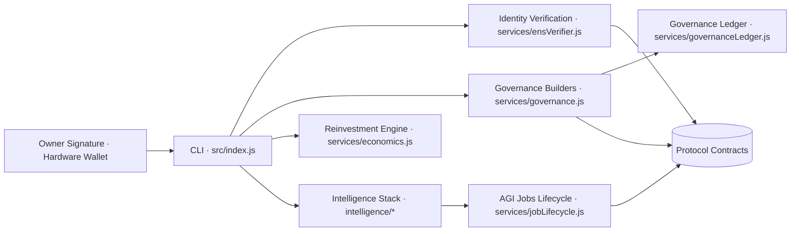
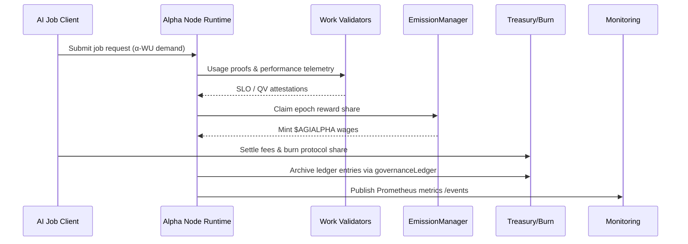
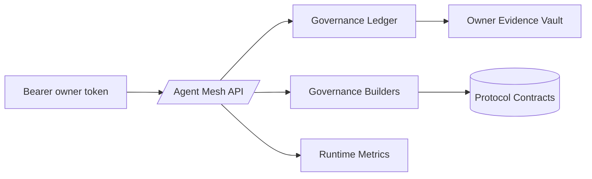

# AGI Alpha Node v0 · Sovereign Synthetic Labor Nexus ⚡

<!-- markdownlint-disable MD013 MD033 -->
<p align="center">
  <picture>
    <source srcset="1.alpha.node.agi.eth.svg" type="image/svg+xml" />
    
  </picture>
</p>

<p align="center">
  <a href="https://github.com/MontrealAI/AGI-Alpha-Node-v0/actions/workflows/ci.yml">
    
  </a>
  <a href="https://img.shields.io/github/actions/workflow/status/MontrealAI/AGI-Alpha-Node-v0/ci.yml?branch=main&job=Lint%20Markdown%20%26%20Links&label=Lint%20%E2%9C%85&logo=markdown&style=flat-square">
    
  </a>
  <a href="https://img.shields.io/github/actions/workflow/status/MontrealAI/AGI-Alpha-Node-v0/ci.yml?branch=main&job=Unit%20%26%20Integration%20Tests&label=Tests%20%E2%9A%A1&logo=vitest&logoColor=white&style=flat-square">
    
  </a>
  <a href="https://img.shields.io/github/actions/workflow/status/MontrealAI/AGI-Alpha-Node-v0/ci.yml?branch=main&job=Coverage%20Report&label=Coverage%20%E2%9C%85&logo=c8&logoColor=white&style=flat-square">
    
  </a>
  <a href="https://img.shields.io/github/actions/workflow/status/MontrealAI/AGI-Alpha-Node-v0/ci.yml?branch=main&job=Docker%20Build%20%26%20Smoke%20Test&label=Docker%20%E2%9A%A1&logo=docker&logoColor=white&style=flat-square">
    
  </a>
  
  
  
  <a href="Dockerfile">
    
  </a>
  <a href="deploy/helm/agi-alpha-node">
    
  </a>
  
  <a href="https://app.ens.domains/name/alpha.node.agi.eth">
    
  </a>
  <a href="https://etherscan.io/token/0xa61a3b3a130a9c20768eebf97e21515a6046a1fa">
    
  </a>
  <a href=".github/required-checks.json">
    
  </a>
  <a href="LICENSE">
    
  </a>
</p>

> _This node is the owner-aligned machine that senses inefficiencies, redirects capital gravity, and executes synthetic labor with unwavering obedience._

---

## Table of Contents

1. [Mission & Capabilities](#mission--capabilities)
2. [Quick Launch Protocol](#quick-launch-protocol)
3. [Sovereign Control Surfaces](#sovereign-control-surfaces)
4. [Synthetic Labor Engine](#synthetic-labor-engine)
5. [Command Interfaces](#command-interfaces)
   - [CLI Modules](#cli-modules)
   - [Agent Mesh API](#agent-mesh-api)
   - [Telemetry Surfaces](#telemetry-surfaces)
6. [Economic Instruments](#economic-instruments)
7. [Deployment Playbooks](#deployment-playbooks)
8. [Observability & CI Hardening](#observability--ci-hardening)
9. [Repository Atlas](#repository-atlas)
10. [Reference Dossiers](#reference-dossiers)
11. [License](#license)

---

## Mission & Capabilities

- **Owner-Supreme Runtime** – [`src/index.js`](src/index.js) consolidates ENS guardianship, staking diagnostics, governance payloads, intelligence orchestration, and Prometheus telemetry so a single signature governs everything.
- **Identity Backbone** – ENS verification, guidance, and constants (`⟨label⟩.alpha.node.agi.eth`) are enforced through [`src/services/ensVerifier.js`](src/services/ensVerifier.js), [`src/services/ensGuide.js`](src/services/ensGuide.js), and [`src/services/ensConstants.js`](src/services/ensConstants.js).
- **Absolute Token Authority** – `$AGIALPHA` (`0xa61a3b3a130a9c20768eebf97e21515a6046a1fa`, 18 decimals) is canonized in [`src/constants/token.js`](src/constants/token.js) and mediated by [`src/services/token.js`](src/services/token.js) to ensure every allowance, approval, and settlement honors the owner’s treasury.
- **Governance Arsenal** – [`src/services/governance.js`](src/services/governance.js) builds deterministic transactions for SystemPause, StakeManager, RewardEngine, EmissionManager, WorkMeter, ProductivityIndex, JobRegistry, IdentityRegistry, and PlatformIncentives so the owner can reconfigure any lever instantly.
- **Synthetic Labor Intelligence** – Planning, swarm orchestration, antifragile stress harnesses, and learning loops live in [`src/intelligence`](src/intelligence) and feed the synthetic labor metrics consumed by rewards and staking.
- **Node Orchestration** – [`src/orchestrator`](src/orchestrator) houses the bootstrapper, runtime diagnostics, and monitor loop that run perpetual audits, update telemetry, and materialize owner directives.

---

## Quick Launch Protocol

| Phase | Objective | Command / Artifact |
| ----- | --------- | ------------------ |
| 1 | Install deterministic toolchain. | `npm ci` |
| 2 | Execute local quality gates and notarize outputs. | `npm run lint` · `npm test` · `npm run coverage` |
| 3 | Generate ENS custody brief before any on-chain calls. | `node src/index.js ens-guide --label <label> --address <0xOwner>` |
| 4 | Validate live ENS binding, staking posture, and RPC liveness. | `node src/index.js status --label <label> --address <0xOwner> --rpc <https://...>` |
| 5 | Dry-run synthetic labor cycle offline. | `node src/index.js status --label <label> --address <0xOwner> --offline-snapshot docs/offline-snapshot.example.json` |
| 6 | Activate runtime orchestrator with telemetry and optional offline snapshot replay. | `node src/index.js monitor --label <label> --address <0xOwner> --rpc <https://...> --metrics-port 9464` |
| 7 | Export governance transaction envelopes for multisig execution. | `node src/index.js governance --help` |
| 8 | Build runtime container for immutable deployment. | `docker build -t agi-alpha-node:sovereign .` |
| 9 | Apply branch protection and required checks. | GitHub → Settings → Branches → `main` |
| 10 | Archive ENS proofs, CI artifacts, and branch rule JSON into the owner ledger. | Owner evidence vault |

### Quickstart Shell

```bash
# Install dependencies
npm ci

# Run static analysis & verification
npm run lint
npm test
npm run coverage

# Inspect runtime controls
node src/index.js --help
```

---

## Sovereign Control Surfaces



| Surface | Contract | Entry Points | Builder Functions |
| ------- | -------- | ------------ | ----------------- |
| Global Safeguard Relay | `SystemPause` | `pauseAll`, `resumeAll`, `unpauseAll` | [`buildSystemPauseTx`](src/services/governance.js) |
| Stake Governance Prism | `StakeManager` | `setMinimumStake`, `setValidatorThreshold`, `setJobRegistry`, `setIdentityRegistry` | [`buildMinimumStakeTx`](src/services/governance.js), [`buildValidatorThresholdTx`](src/services/governance.js), [`buildStakeRegistryUpgradeTx`](src/services/governance.js) |
| Reward Distribution Matrix | `RewardEngine` | `setRoleShare`, `setGlobalShares` | [`buildRoleShareTx`](src/services/governance.js), [`buildGlobalSharesTx`](src/services/governance.js) |
| Emission Control Forge | `EmissionManager` | `setEpochEmission`, `setEpochLength`, `setEmissionCap`, `setRewardRateMultiplier` | [`buildEmissionPerEpochTx`](src/services/governance.js), [`buildEmissionEpochLengthTx`](src/services/governance.js), [`buildEmissionCapTx`](src/services/governance.js), [`buildEmissionRateMultiplierTx`](src/services/governance.js) |
| Node Registry Dominion | `NodeRegistry` | `registerNode`, `setNodeMetadata`, `setNodeStatus`, `setNodeOperator`, `setWorkMeter` | [`buildNodeRegistrationTx`](src/services/governance.js), [`buildNodeMetadataTx`](src/services/governance.js), [`buildNodeStatusTx`](src/services/governance.js), [`buildNodeOperatorTx`](src/services/governance.js), [`buildNodeWorkMeterTx`](src/services/governance.js) |
| WorkMeter Orbit Control | `WorkMeter` | `setValidator`, `setOracle`, `setSubmissionWindow`, `setProductivityIndex`, `submitUsage` | [`buildWorkMeterValidatorTx`](src/services/governance.js), [`buildWorkMeterOracleTx`](src/services/governance.js), [`buildWorkMeterWindowTx`](src/services/governance.js), [`buildWorkMeterProductivityIndexTx`](src/services/governance.js), [`buildWorkMeterUsageTx`](src/services/governance.js) |
| α-Productivity Apex | `ProductivityIndex` | `recordEpoch`, `setEmissionManager`, `setWorkMeter`, `setTreasury` | [`buildProductivityRecordTx`](src/services/governance.js), [`buildProductivityEmissionManagerTx`](src/services/governance.js), [`buildProductivityWorkMeterTx`](src/services/governance.js), [`buildProductivityTreasuryTx`](src/services/governance.js) |
| Job Registry Arsenal | `JobRegistry` | `setValidationModule`, `setReputationModule`, `setDisputeModule`, `triggerDispute` | [`buildJobRegistryUpgradeTx`](src/services/governance.js), [`buildDisputeTriggerTx`](src/services/governance.js) |
| Identity Delegation Vault | `IdentityRegistry` | `setAdditionalNodeOperator` | [`buildIdentityDelegateTx`](src/services/governance.js) |
| Platform Incentives Conductor | `PlatformIncentives` | `setStakeManager`, `setMinimumStake`, `setHeartbeatGrace`, `setActivationFee`, `setTreasury` | [`buildIncentivesStakeManagerTx`](src/services/governance.js), [`buildIncentivesMinimumStakeTx`](src/services/governance.js), [`buildIncentivesHeartbeatTx`](src/services/governance.js), [`buildIncentivesActivationFeeTx`](src/services/governance.js), [`buildIncentivesTreasuryTx`](src/services/governance.js) |

Owner coverage across every method is validated by [`test/governance.test.js`](test/governance.test.js) and surfaced interactively via `node src/index.js governance surfaces`.

---

## Synthetic Labor Engine



- **Job Lifecycle** – [`src/services/jobLifecycle.js`](src/services/jobLifecycle.js) discovers, applies, submits proofs, and finalizes AGI jobs while journaling to [`src/services/lifecycleJournal.js`](src/services/lifecycleJournal.js).
- **Proof Machinery** – Deterministic commitments and submitProof payloads are produced by [`src/services/jobProof.js`](src/services/jobProof.js).
- **Performance Synthesis** – [`src/services/performance.js`](src/services/performance.js) fuses planning heuristics, swarm orchestration, and historical telemetry to estimate throughput, success rate, and projected $AGIALPHA earnings.
- **Offline Replay** – [`src/services/offlineSnapshot.js`](src/services/offlineSnapshot.js) replays token flows, emissions, and burns offline for audit trails.
- **Intelligence Stack** – [`src/intelligence/planning.js`](src/intelligence/planning.js), [`src/intelligence/swarmOrchestrator.js`](src/intelligence/swarmOrchestrator.js), [`src/intelligence/stressHarness.js`](src/intelligence/stressHarness.js), and [`src/intelligence/learningLoop.js`](src/intelligence/learningLoop.js) drive the adaptive strategies behind α‑Work Units.

---

## Command Interfaces

### CLI Modules

| Command | Purpose | Implementation |
| ------- | ------- | -------------- |
| `ens-guide` / `verify-ens` | Generate ENS setup brief and verify custody for `⟨label⟩.alpha.node.agi.eth`. | [`src/services/ensGuide.js`](src/services/ensGuide.js) · [`src/services/ensVerifier.js`](src/services/ensVerifier.js) |
| `stake-tx` / `stake-activate` | Craft and acknowledge `stakeAndActivate` payloads. | [`src/services/staking.js`](src/services/staking.js) · [`src/services/stakeActivation.js`](src/services/stakeActivation.js) |
| `status` / `monitor` / `container` | Run diagnostics, telemetry, and container bootstrap loops. | [`src/orchestrator/nodeRuntime.js`](src/orchestrator/nodeRuntime.js) · [`src/orchestrator/monitorLoop.js`](src/orchestrator/monitorLoop.js) · [`src/orchestrator/bootstrap.js`](src/orchestrator/bootstrap.js) |
| `token` | $AGIALPHA metadata, approvals, and allowance reads. | [`src/services/token.js`](src/services/token.js) |
| `proof` | Deterministic commitments and JobRegistry submit transactions. | [`src/services/jobProof.js`](src/services/jobProof.js) |
| `jobs` | Discover, apply, submit, and finalize AGI jobs. | [`src/services/jobLifecycle.js`](src/services/jobLifecycle.js) |
| `economics` | Reward projections, reinvestment strategies, α-productivity indexes. | [`src/services/economics.js`](src/services/economics.js) |
| `governance` | Enumerate owner surfaces, build transaction payloads, and record directives. | [`src/services/governance.js`](src/services/governance.js) · [`src/services/governanceLedger.js`](src/services/governanceLedger.js) |
| `intelligence` | Swarm orchestration, antifragility drills, curriculum evolution. | [`src/intelligence`](src/intelligence) |

### Agent Mesh API

- [`src/network/apiServer.js`](src/network/apiServer.js) exposes a hardened HTTP interface that lists lifecycle jobs, forwards apply/submit/finalize commands, broadcasts owner directives, and crafts governance payloads for authenticated operators.
- [`test/apiServer.test.js`](test/apiServer.test.js) verifies endpoint behavior, lifecycle integration, and owner authentication flows.

#### Governance Payload Endpoints



| Contract Surface | Purpose | REST Endpoint → Builder |
| ---------------- | ------- | ---------------------- |
| **SystemPause** | Freeze or resume protocol entry points. | `/governance/pause` → [`buildSystemPauseTx`](src/services/governance.js) |
| **StakeManager** | Tune minimum stake & validator quorum, wire registries. | `/governance/minimum-stake`, `/governance/validator-threshold`, `/governance/registry-upgrade` → [`buildMinimumStakeTx`](src/services/governance.js), [`buildValidatorThresholdTx`](src/services/governance.js), [`buildStakeRegistryUpgradeTx`](src/services/governance.js) |
| **RewardEngine** | Rebalance operator/validator/treasury splits. | `/governance/role-share`, `/governance/global-shares` → [`buildRoleShareTx`](src/services/governance.js), [`buildGlobalSharesTx`](src/services/governance.js) |
| **EmissionManager** | Shape emission cadence, caps, multipliers. | `/governance/emission-per-epoch`, `/governance/emission-epoch-length`, `/governance/emission-cap`, `/governance/emission-multiplier` → [`buildEmissionPerEpochTx`](src/services/governance.js), [`buildEmissionEpochLengthTx`](src/services/governance.js), [`buildEmissionCapTx`](src/services/governance.js), [`buildEmissionRateMultiplierTx`](src/services/governance.js) |
| **NodeRegistry** | Register nodes, rotate operators, bind WorkMeter. | `/governance/node/register`, `/governance/node/metadata`, `/governance/node/status`, `/governance/node/operator`, `/governance/node/work-meter` → [`buildNodeRegistrationTx`](src/services/governance.js), [`buildNodeMetadataTx`](src/services/governance.js), [`buildNodeStatusTx`](src/services/governance.js), [`buildNodeOperatorTx`](src/services/governance.js), [`buildNodeWorkMeterTx`](src/services/governance.js) |
| **WorkMeter** | Curate validators/oracles, adjust windows, submit usage. | `/governance/work-meter/validator`, `/governance/work-meter/oracle`, `/governance/work-meter/window`, `/governance/work-meter/productivity-index`, `/governance/work-meter/submit-usage` → [`buildWorkMeterValidatorTx`](src/services/governance.js), [`buildWorkMeterOracleTx`](src/services/governance.js), [`buildWorkMeterWindowTx`](src/services/governance.js), [`buildWorkMeterProductivityIndexTx`](src/services/governance.js), [`buildWorkMeterUsageTx`](src/services/governance.js) |
| **ProductivityIndex** | Record α‑WU epochs, retune downstream routing. | `/governance/productivity/record-epoch`, `/governance/productivity/emission-manager`, `/governance/productivity/work-meter`, `/governance/productivity/treasury` → [`buildProductivityRecordTx`](src/services/governance.js), [`buildProductivityEmissionManagerTx`](src/services/governance.js), [`buildProductivityWorkMeterTx`](src/services/governance.js), [`buildProductivityTreasuryTx`](src/services/governance.js) |
| **JobRegistry** | Upgrade modules or trigger disputes. | `/governance/job-module`, `/governance/dispute` → [`buildJobRegistryUpgradeTx`](src/services/governance.js), [`buildDisputeTriggerTx`](src/services/governance.js) |
| **IdentityRegistry** | Delegate or revoke operator authority. | `/governance/identity-delegate` → [`buildIdentityDelegateTx`](src/services/governance.js) |
| **PlatformIncentives** | Redirect stake hooks, heartbeat grace, fees, treasury. | `/governance/incentives/minimum-stake`, `/governance/incentives/stake-manager`, `/governance/incentives/heartbeat-grace`, `/governance/incentives/activation-fee`, `/governance/incentives/treasury` → [`buildIncentivesMinimumStakeTx`](src/services/governance.js), [`buildIncentivesStakeManagerTx`](src/services/governance.js), [`buildIncentivesHeartbeatTx`](src/services/governance.js), [`buildIncentivesActivationFeeTx`](src/services/governance.js), [`buildIncentivesTreasuryTx`](src/services/governance.js) |
| **Stake Activation** | Top-up incentives vault via helper. | `/governance/stake-top-up` → [`buildStakeAndActivateTx`](src/services/staking.js) |

> Every governance call defaults to dry-run signing envelopes; set `dryRun: false` and `confirm: true` to notarize payloads into the owner ledger.

### Telemetry Surfaces

- [`src/telemetry/monitoring.js`](src/telemetry/monitoring.js) publishes Prometheus gauges for stake posture, heartbeats, throughput, success rates, token projections, agent utilization, provider modes, and registry compatibility. [`test/monitoring.test.js`](test/monitoring.test.js) confirms metrics exposure and path hardening.
- Monitoring is orchestrated by [`src/orchestrator/monitorLoop.js`](src/orchestrator/monitorLoop.js) and [`src/orchestrator/nodeRuntime.js`](src/orchestrator/nodeRuntime.js), feeding owner directives and telemetry simultaneously.

---

## Economic Instruments

- **Reward Split Optimizer** – [`src/services/rewards.js`](src/services/rewards.js) calculates operator/validator/treasury splits and integrates with CLI reporting.
- **Reinvestment Intelligence** – [`src/services/economics.js`](src/services/economics.js) computes Synthetic Labor Yield (SLY), α-productivity indexes, reinvestment scenarios, and strategy comparisons.
- **Stake Governance** – [`src/services/staking.js`](src/services/staking.js) validates minimum stake, constructs stake transactions, and enforces `$AGIALPHA` canonicality through [`src/constants/token.js`](src/constants/token.js).
- **Governance Ledger** – [`src/services/governanceLedger.js`](src/services/governanceLedger.js) notarizes every owner directive, providing an immutable audit trail for capital commands.

---

## Deployment Playbooks

- **Docker** – Production container defined by [`Dockerfile`](Dockerfile) and `deploy/docker/entrypoint.sh`. Example environment template lives at [`deploy/docker/node.env.example`](deploy/docker/node.env.example).
- **Helm** – Kubernetes packaging resides in [`deploy/helm/agi-alpha-node`](deploy/helm/agi-alpha-node) with configurable metrics port, API port, stake parameters, autoscaling, and Vault integration.
- **Offline Snapshots** – Ship snapshots via ConfigMaps and mount into the runtime to replay emissions and rewards without chain connectivity.
- **Vault Integration** – Secrets (hot key, Vault token) are injected via chart values, enabling HSM/HashiCorp Vault custody flows.

---

## Observability & CI Hardening

- **CI Workflow** – [`./.github/workflows/ci.yml`](.github/workflows/ci.yml) enforces markdown linting, link validation, unit/integration tests, coverage, and Docker smoke tests on pushes and PRs.
- **Branch Protection** – [`./.github/required-checks.json`](.github/required-checks.json) enumerates required statuses enforced on `main` and all pull requests.
- **Quality Gates** – [`package.json`](package.json) defines deterministic scripts (`lint`, `test`, `coverage`, `ci:verify`) used locally and in CI.
- **Telemetry Proof** – [`test/monitorLoop.test.js`](test/monitorLoop.test.js) and [`test/bootstrap.test.js`](test/bootstrap.test.js) validate orchestrator behavior, ensuring telemetry + diagnostics operate before owners broadcast directives.
- **Metrics Consumption** – Prometheus-compatible metrics at `/metrics` enable Grafana, Alertmanager, or sovereign dashboards to track α-WU throughput and stake posture in real time.

---

## Repository Atlas

| Path | Purpose |
| ---- | ------- |
| `src/index.js` | Sovereign CLI entrypoint for every owner directive. |
| `src/services` | Governance builders, staking, rewards, lifecycle management, ENS utilities, provider tooling. |
| `src/orchestrator` | Bootstrapper, diagnostics runtime, monitor loop, stake activator. |
| `src/intelligence` | Strategy planner, swarm orchestration, antifragility harness, curriculum evolution, agent runtime. |
| `src/network` | Agent API surface for lifecycle control and governance directives. |
| `src/telemetry` | Prometheus monitoring server and gauges. |
| `docs/` | Operator codex, manifesto, economics brief, offline snapshots. |
| `deploy/` | Docker runtime assets and Helm chart for production rollouts. |
| `test/` | Vitest suite covering governance, staking, jobs, economics, monitoring, intelligence, and API surfaces. |

---

## Reference Dossiers

- [Operator Command Codex](docs/README.md)
- [Manifesto](docs/manifesto.md)
- [Economics Brief](docs/economics.md)
- [Operator Runbook](docs/operator-runbook.md)
- [Offline Snapshot Example](docs/offline-snapshot.example.json)

---

## License

Released under the [MIT License](LICENSE).

<!-- markdownlint-enable MD013 MD033 -->
