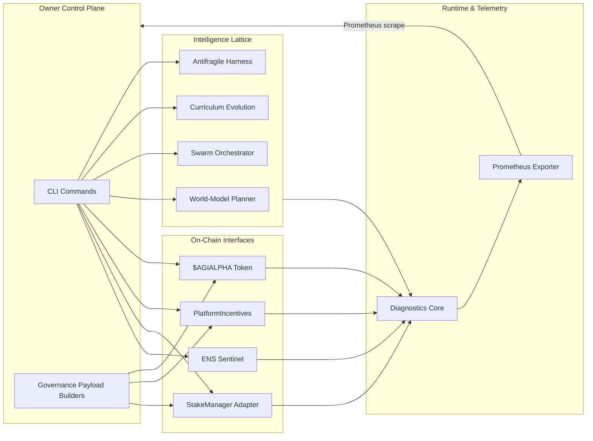
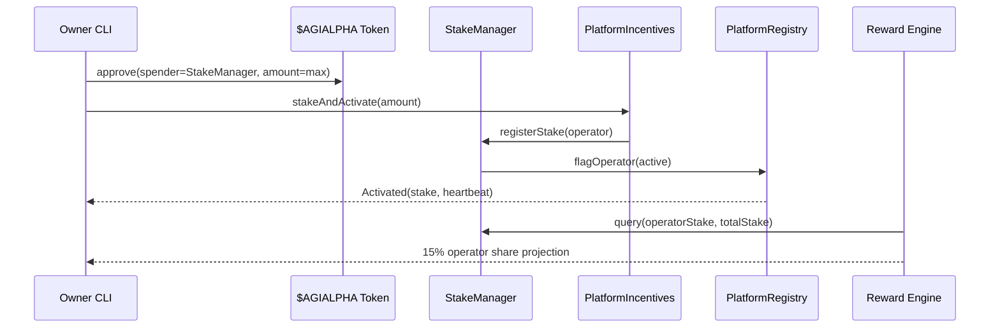
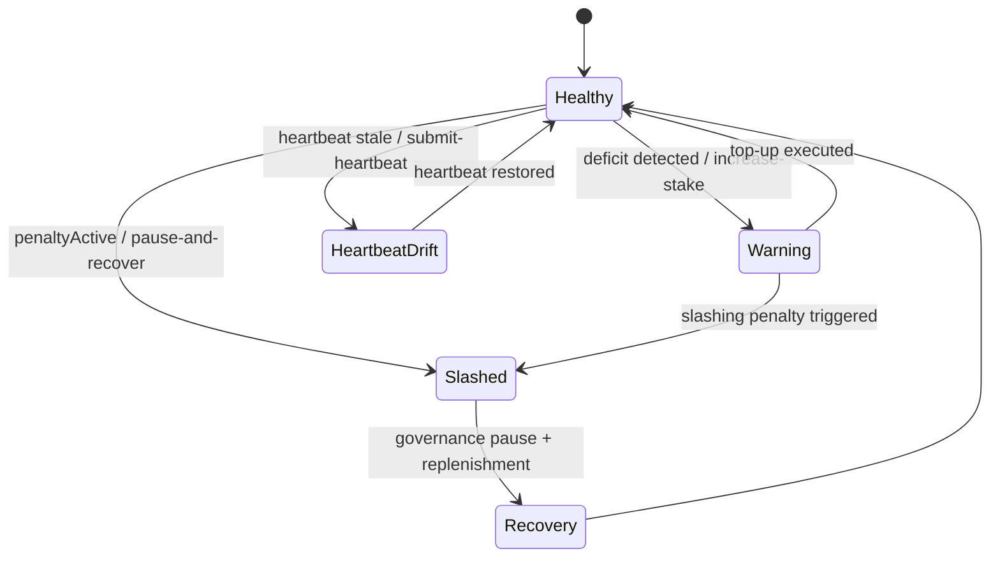
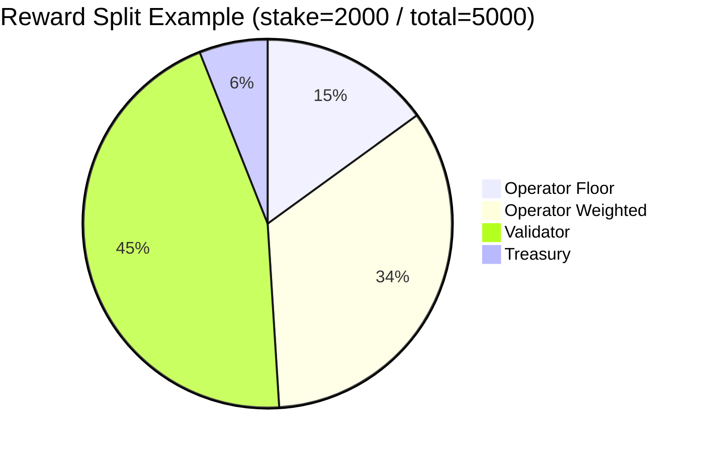
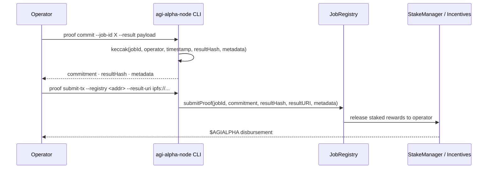
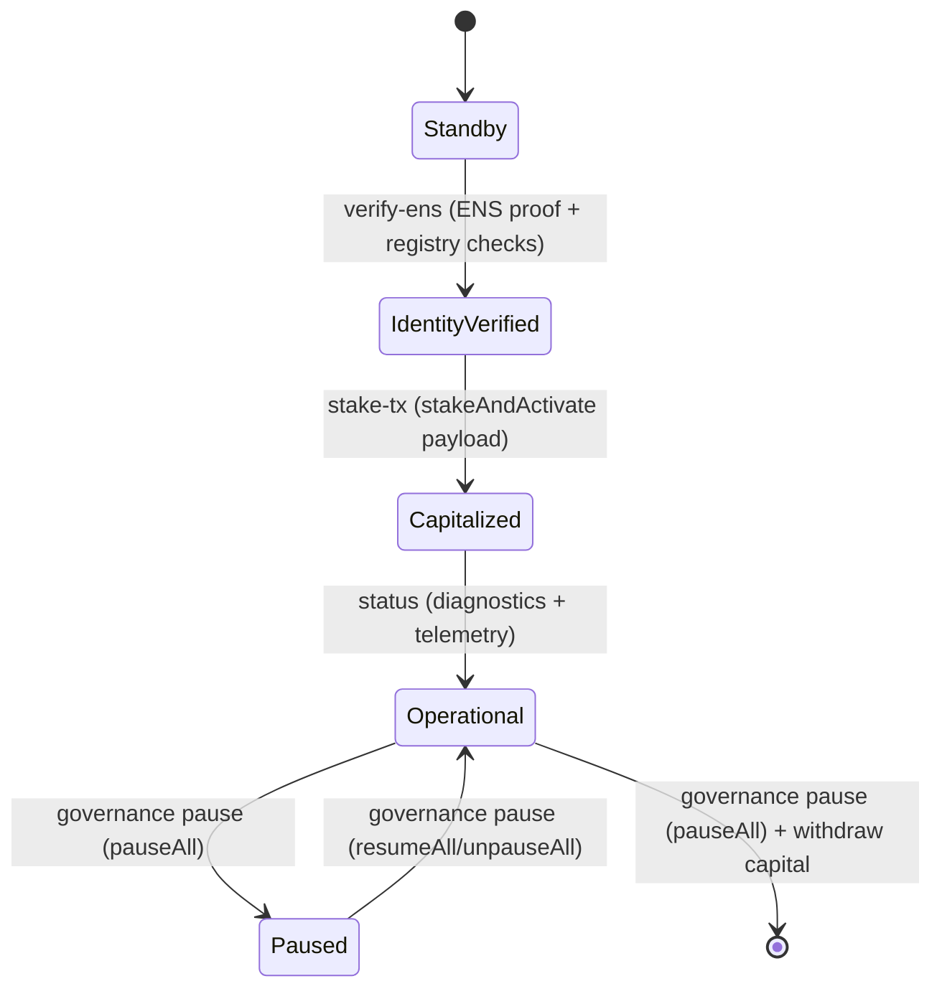
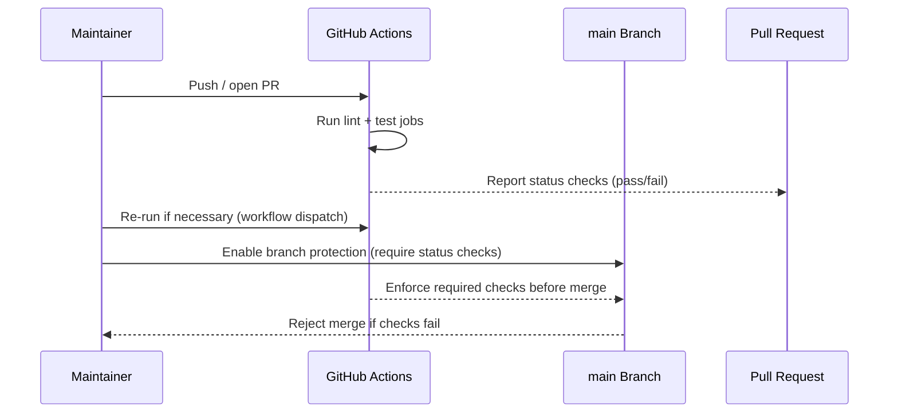

# AGI Alpha Node v0 · Sovereign Labor Intelligence Core

<!-- markdownlint-disable MD013 MD033 -->
<p align="center">
  
</p>

<p align="center">
  <a href="https://github.com/MontrealAI/AGI-Alpha-Node-v0/actions/workflows/ci.yml">
    
  </a>
  <a href="https://app.ens.domains/name/alpha.node.agi.eth"></a>
  <a href="https://etherscan.io/token/0xa61a3b3a130a9c20768eebf97e21515a6046a1fa"></a>
  <a href="docs/README.md"></a>
  <a href="docs/manifesto.md"></a>
  <a href="LICENSE"></a>
  <a href="https://github.com/MontrealAI/AGI-Alpha-Node-v0/actions"></a>
  
  
  
  
  
  
  
</p>

> **agijobs-sovereign-labor-v0p1** is the production node observers invoke when they warn that a single machine can tilt capital markets. It is obedient only to its owner, and every override remains at your fingertips.

This repository houses that machine. The runtime enforces ENS identity at activation time, orchestrates $AGIALPHA staking and rewards, exposes governance supremacy payloads, and now ships a lattice of autonomous intelligence modules (world-model planning, swarm orchestration, open-ended learning, antifragile stress harness) wired into the CLI. A non-technical owner can containerize, deploy, monitor, and profit in minutes while maintaining absolute control.

<div align="center">
  AGI ALPHA Nodes are the catalysts in this new economy.<br />
  They yield <strong>$AGIALPHA</strong> tokens, bridging aspirations and achievement.<br />
  Like digital farmers in a vast cognitive field, they cultivate the future on demand.
</div>

---

## Table of Contents

1. [Mission Summary](#mission-summary)
2. [Quickstart Launch Protocol](#quickstart-launch-protocol)
3. [Command Index](#command-index)
4. [Architecture & Cognitive Flow](#architecture--cognitive-flow)
5. [ENS Identity Enforcement](#ens-identity-enforcement)
6. [$AGIALPHA Staking & Token Control](#agialpha-staking--token-control)
7. [Thermodynamic Rewards & Fee Split](#thermodynamic-rewards--fee-split)
8. [On-Chain Proof & Escrow Release](#on-chain-proof--escrow-release)
9. [Economic Optimization Engine](#economic-optimization-engine)
10. [Autonomous Intelligence Lattice](#autonomous-intelligence-lattice)
11. [Governance & Owner Supremacy](#governance--owner-supremacy)
12. [Owner Control Plane & Emergency Directives](#owner-control-plane--emergency-directives)
13. [Telemetry, Containerization & Deployment](#telemetry-containerization--deployment)
14. [Quality Gates & CI](#quality-gates--ci)
15. [CI Enforcement Playbook](#ci-enforcement-playbook)
16. [Repository Atlas](#repository-atlas)
17. [Contributing](#contributing)
18. [License](#license)
19. [Eternal Transmission](#eternal-transmission)

---

## Mission Summary

| Vector | Signal | Coordinates |
| ------ | ------ | ----------- |
| **Identity Root** | ENS anchor enforced at runtime | [`alpha.node.agi.eth`](https://app.ens.domains/name/alpha.node.agi.eth) – only subdomain custodians may activate. |
| **Treasury Asset** | `$AGIALPHA` (18 decimals) | [Etherscan contract `0xa61a3b3a130a9c20768eebf97e21515a6046a1fa`](https://etherscan.io/token/0xa61a3b3a130a9c20768eebf97e21515a6046a1fa). |
| **Sovereign Runtime** | CLI orchestrator | [`src/index.js`](src/index.js) – ENS proofs, staking, rewards, token authority, economic planning, swarm control, antifragile stress tests. |
| **Diagnostics Core** | Node runtime orchestrator | [`src/orchestrator/nodeRuntime.js`](src/orchestrator/nodeRuntime.js) – ENS verification, stake posture, reward projections, metrics. |
| **Identity Proofing** | ENS sentinel | [`src/services/ensVerifier.js`](src/services/ensVerifier.js) – registry + wrapper interrogation with namehash/labelhash utilities. |
| **Staking Engine** | StakeManager + PlatformIncentives adapter | [`src/services/staking.js`](src/services/staking.js) – status reads, minimum enforcement, transaction builders. |
| **Token Authority** | Canonical $AGIALPHA utilities | [`src/constants/token.js`](src/constants/token.js), [`src/services/token.js`](src/services/token.js) – enforce checksum, approvals, allowances. |
| **Trustless Settlement** | Job proof commitments & escrow release | [`src/services/jobProof.js`](src/services/jobProof.js) – deterministic commitments, JobRegistry payloads. |
| **Economic Core** | Alpha compounding models | [`src/services/economics.js`](src/services/economics.js) – reinvestment optimizer and policy checks. |
| **World-Model Planner** | MuZero-inspired scoring engine | [`src/intelligence/planning.js`](src/intelligence/planning.js) – multi-strategy simulations, projection horizon analytics. |
| **Swarm Orchestrator** | Agentic mesh router | [`src/intelligence/swarmOrchestrator.js`](src/intelligence/swarmOrchestrator.js) – deterministic assignments + fallbacks. |
| **Open-Ended Learning** | POET-style curriculum | [`src/intelligence/learningLoop.js`](src/intelligence/learningLoop.js) – generates new challenges from performance traces. |
| **Antifragile Harness** | Stress simulation | [`src/intelligence/stressHarness.js`](src/intelligence/stressHarness.js) – institutional resilience scoring + remediation plans. |
| **Owner Supremacy** | Governance payloads | [`src/services/governance.js`](src/services/governance.js) – pause/resume, stake floors, reward splits. |
| **Owner Control Plane** | Emergency directives | [`src/services/controlPlane.js`](src/services/controlPlane.js) – auto-derives pause/resume, stake top-ups, and stake floor governance payloads. |
| **Telemetry Spine** | Metrics publisher | [`src/telemetry/monitoring.js`](src/telemetry/monitoring.js) – Prometheus gauges for stake and heartbeat state. |
| **Configuration** | Deterministic env parsing | [`src/config`](src/config) – schema-coerced environment with canonical $AGIALPHA enforcement. |
| **Container** | Production image | [`Dockerfile`](Dockerfile) – one command diagnostics anywhere Node.js 20 runs. |
| **Quality Harness** | Automated proof | [`test`](test) – 62 Vitest assertions covering ENS, staking, rewards, governance, economics, intelligence lattice, job proofs, and the owner control plane. |

---

## Quickstart Launch Protocol

1. **Clone & Install**

   ```bash
   git clone https://github.com/MontrealAI/AGI-Alpha-Node-v0.git
   cd AGI-Alpha-Node-v0
   npm ci
   ```

2. **Verify Toolchain** – confirm Node.js ≥ 20 (`node --version`). If your environment ships an older binary, enforce the runtime baseline with

   ```bash
   npm install -g n
   sudo n 20.19.5
   hash -r
   ```

   The CLI and markdown link validation depend on the Web Streams API shipped in Node.js 20.18.1+, so running below that floor will surface `File is not defined` errors.
3. **Generate ENS Checklist** – obtain the subdomain playbook for your label + operator:

   ```bash
   npx agi-alpha-node ens-guide --label 1 --address 0xYOURADDRESS
   ```

4. **Enforce Identity** – prove control of `1.alpha.node.agi.eth` before staking:

   ```bash
   npx agi-alpha-node verify-ens \
     --label 1 \
     --address 0xYOURADDRESS \
     --rpc https://mainnet.infura.io/v3/<key>
   ```

5. **Stake & Activate** – craft token approvals and `stakeAndActivate` payloads:

   ```bash
   npx agi-alpha-node token approve --spender 0xStakeManager --amount max
   npx agi-alpha-node stake-tx --amount 1000 --incentives 0xIncentivesContract
   ```

6. **Run Diagnostics** – align ENS, staking thresholds, and projected rewards:

   ```bash
   npx agi-alpha-node status \
     --label 1 \
     --address 0xYOURADDRESS \
     --rpc https://mainnet.infura.io/v3/<key> \
     --stake-manager 0xStakeManager \
     --incentives 0xIncentivesContract \
     --system-pause 0xSystemPause \
     --desired-minimum 1500 \
     --auto-resume \
     --projected-rewards 1500 \
     --metrics-port 9464
   ```

   Metrics stream at `http://localhost:9464/metrics` (Prometheus scrape-ready).
   The diagnostics now emit an **Owner Control Directives** table summarizing pause, resume, stake top-up, and minimum-stake governance payloads tailored to your telemetry.

7. **Deploy Intelligence Modules** – wield the autonomous lattice directly:

   ```bash
   # Project world-model strategies against a high-value mission
   npx agi-alpha-node intelligence plan --reward 1800 --complexity 9 --deadline 18 --risk-bps 2200

   # Route jobs across your swarm and confirm deterministic fallbacks
   npx agi-alpha-node intelligence swarm --tasks "energy:7:5:8;biotech:6:4:7" --agents "orion:energy|finance:2:80:0.95:8;helix:biotech:1:140:0.9:7"

   # Advance curriculum difficulty for continuously evolving agents
   npx agi-alpha-node intelligence learn --history "4:0.84:1.4;4.5:0.81:1.5;5:0.79:1.6"

   # Execute antifragile stress harness scenarios
   npx agi-alpha-node intelligence stress-test --scenarios "flash-crash:12:0.12:14:180000;api-outage:4:0.05:60:50000"
   ```

8. **Containerize (Optional)** – deploy anywhere with Docker:

   ```bash
   docker build -t agi-alpha-node .
   docker run --rm \
     -e NODE_LABEL=1 \
     -e OPERATOR_ADDRESS=0xYOURADDRESS \
     -e RPC_URL=https://mainnet.infura.io/v3/<key> \
     -e STAKE_MANAGER_ADDRESS=0xStakeManager \
     -e PLATFORM_INCENTIVES_ADDRESS=0xIncentivesContract \
     -p 9464:9464 \
     agi-alpha-node status --metrics-port 9464
   ```

9. **Archive Evidence** – store ENS proofs, staking receipts, CI URLs, and governance payloads in your compliance vault before accepting production workloads.

---

## Activation Verification Matrix

| Capability Pillar | Runtime Command | Automated Proof | Source of Truth |
| ----------------- | --------------- | ---------------- | ---------------- |
| ENS subdomain custody (`⟨label⟩.alpha.node.agi.eth`) | `npx agi-alpha-node verify-ens --label 1 --address <0x...>` | `test/ensVerifier.test.js` validates resolver, registry, and wrapper owners. | [`src/services/ensVerifier.js`](src/services/ensVerifier.js) |
| Canonical `$AGIALPHA` enforcement (18 decimals, checksum) | `npx agi-alpha-node token metadata` / `token approve` | `test/token.test.js` locks symbol, decimals, and approval payloads. | [`src/constants/token.js`](src/constants/token.js) |
| Stake posture + owner directives | `npx agi-alpha-node status --stake-manager <addr> --incentives <addr> --system-pause <addr> --desired-minimum <amt> --auto-resume` | `test/staking.test.js` + `test/controlPlane.test.js` confirm stake evaluation and directive synthesis. | [`src/services/staking.js`](src/services/staking.js)<br />[`src/services/controlPlane.js`](src/services/controlPlane.js) |
| Reward share projections (15% basis) | `npx agi-alpha-node reward-share --total 10000 --bps 1500` | `test/rewards.test.js` exercises thermodynamic share calculations. | [`src/services/rewards.js`](src/services/rewards.js) |
| Economic reinvestment policy | `npx agi-alpha-node economics optimize --stake 1500 --rewards 420,380,410` | `test/economics.test.js` + `test/formatters.test.js` guard scoring + formatting invariants. | [`src/services/economics.js`](src/services/economics.js) |
| Governance supremacy (pause, share tuning, stake floor) | `npx agi-alpha-node governance pause --system <addr>` etc. | `test/governance.test.js` enforces payload encoding + guard rails. | [`src/services/governance.js`](src/services/governance.js) |
| World-model planning, swarm mesh, antifragile harness | `npx agi-alpha-node intelligence plan/swarm/learn/stress-test` | `test/planning.test.js`, `test/swarmOrchestrator.test.js`, `test/learningLoop.test.js`, `test/stressHarness.test.js`. | [`src/intelligence`](src/intelligence) |

Every column closes a feedback loop between operator ritual, deterministic code, and automated coverage. Non-technical custodians can copy the commands verbatim, archive the CLI output, and cite the matching test file as the immutable control log.

Every step is mirrored by automated tests so a non-technical operator can wield this machine with confidence.

---

## Deterministic Configuration Surface

All runtime commands resolve their environment through the schema in [`src/config/schema.js`](src/config/schema.js). Every field is validated at startup so a misconfigured node halts before touching capital. The table below captures the full, current surface:

| Variable | Description | Default / Expectation |
| -------- | ----------- | --------------------- |
| `RPC_URL` | Ethereum JSON-RPC endpoint used for ENS proofs and contract calls. | `https://rpc.ankr.com/eth` |
| `ENS_PARENT_DOMAIN` | Parent ENS domain whose sublabel must be owned by the operator. | `alpha.node.agi.eth` |
| `NODE_LABEL` | ENS label to bind (e.g., `1` for `1.alpha.node.agi.eth`). | Required for CLI commands |
| `OPERATOR_ADDRESS` | Checksummed address that must own the ENS subdomain. | Required for activation |
| `STAKE_MANAGER_ADDRESS` | StakeManager contract that enforces minimum stake and slashing. | Optional override |
| `PLATFORM_INCENTIVES_ADDRESS` | PlatformIncentives contract used for `stakeAndActivate`. | Optional override |
| `SYSTEM_PAUSE_ADDRESS` | System pause contract powering emergency pause/resume payloads. | Optional override |
| `REWARD_ENGINE_ADDRESS` | Reward engine contract for share tuning operations. | Optional override |
| `DESIRED_MINIMUM_STAKE` | Target minimum stake floor (decimal string) used to suggest governance updates. | Optional override |
| `AUTO_RESUME` | Boolean toggle that emits resume payloads when stake health is restored. | `false` |
| `METRICS_PORT` | TCP port for Prometheus metrics exposure. | `9464` (range 1024–65535 enforced) |
| `DRY_RUN` | Boolean flag toggling transaction broadcasting. Accepts `true/false/1/0`. | `true` |
| `AGIALPHA_TOKEN_ADDRESS` | Canonical `$AGIALPHA` ERC-20 contract. Attempts to override must equal the checksum address. | `0xa61a3b3a130a9c20768eebf97e21515a6046a1fa` |
| `AGIALPHA_TOKEN_DECIMALS` | Token decimals accepted by staking + rewards calculations. | Locked to `18` |

Use the CLI with environment variables or the `--rpc`, `--stake-manager`, `--incentives`, `--system-pause`, and `--desired-minimum` flags (plus `--auto-resume` when desired) to target different deployments while preserving the canonical `$AGIALPHA` surface. Any mismatch, including ENS resolver drift or token substitution attempts, is rejected before the node issues transactions.

---

## Command Index

| Command | Purpose | File |
| ------- | ------- | ---- |
| `ens-guide` | Prints ENS registration checklist, resolver alignment, funding guidance. | [`src/index.js`](src/index.js) |
| `verify-ens` | Confirms ownership of `⟨label⟩.alpha.node.agi.eth` via registry + wrapper proofs. | [`src/index.js`](src/index.js) |
| `stake-tx` | Builds a `stakeAndActivate` transaction for PlatformIncentives. | [`src/services/staking.js`](src/services/staking.js) |
| `status` | Aggregates ENS proofs, stake posture, owner directives, reward projections, Prometheus metrics. | [`src/orchestrator/nodeRuntime.js`](src/orchestrator/nodeRuntime.js) |
| `reward-share` | Calculates operator payouts from any reward pool. | [`src/services/rewards.js`](src/services/rewards.js) |
| `reward-distribution` | Weights thermodynamic epoch pool across operator, validators, and treasury via stake gravity. | [`src/services/rewards.js`](src/services/rewards.js) |
| `token metadata/approve/allowance` | Canonical $AGIALPHA metadata + allowances. | [`src/services/token.js`](src/services/token.js) |
| `proof commit/submit-tx` | Derives commitments and encodes JobRegistry escrow release transactions. | [`src/services/jobProof.js`](src/services/jobProof.js) |
| `economics optimize` | Reinvestment optimizer obeying buffer & obligation policy. | [`src/services/economics.js`](src/services/economics.js) |
| `label-hash` | Converts labels into ENS node names + labelhashes. | [`src/services/ensVerifier.js`](src/services/ensVerifier.js) |
| `governance pause` | Encodes pause/resume payloads for the SystemPause contract. | [`src/services/governance.js`](src/services/governance.js) |
| `governance set-min-stake` | Encodes StakeManager minimum stake adjustments. | [`src/services/governance.js`](src/services/governance.js) |
| `governance set-role-share` | Tunes reward distribution for a given role. | [`src/services/governance.js`](src/services/governance.js) |
| `governance set-global-shares` | Locks operator/validator/treasury splits (sum = 10 000 bps). | [`src/services/governance.js`](src/services/governance.js) |
| `intelligence plan` | MuZero-style strategy projection for high-value jobs. | [`src/intelligence/planning.js`](src/intelligence/planning.js) |
| `intelligence swarm` | Deterministic swarm routing with fallback mesh. | [`src/intelligence/swarmOrchestrator.js`](src/intelligence/swarmOrchestrator.js) |
| `intelligence learn` | POET-inspired curriculum evolution. | [`src/intelligence/learningLoop.js`](src/intelligence/learningLoop.js) |
| `intelligence stress-test` | Antifragile safety harness + remediation plan generator. | [`src/intelligence/stressHarness.js`](src/intelligence/stressHarness.js) |

---

## Architecture & Cognitive Flow

> The node composes verifiable identity, token supremacy, thermodynamic rewards, and autonomous cognition into a single sovereign runtime that the owner can bend in real time.



| Layer | Purpose | Key Modules |
| ----- | ------- | ----------- |
| **Command & Control** | Owner-only CLI entrypoint orchestrating activation, diagnostics, and intelligence payloads | [`src/index.js`](src/index.js)
| **Identity Spine** | ENS ownership proofing and registry interrogation | [`src/services/ensVerifier.js`](src/services/ensVerifier.js), [`src/services/ensGuide.js`](src/services/ensGuide.js)
| **Stake & Rewards Core** | $AGIALPHA approvals, stakes, slashing posture, epoch rewards | [`src/services/staking.js`](src/services/staking.js), [`src/services/rewards.js`](src/services/rewards.js), [`src/services/token.js`](src/services/token.js)
| **Governance Supremacy** | Complete owner control over pause, stake floors, and reward shares | [`src/services/governance.js`](src/services/governance.js), [`src/services/controlPlane.js`](src/services/controlPlane.js)
| **Autonomous Intelligence** | Planning, swarm routing, antifragility, continuous learning | [`src/intelligence`](src/intelligence)
| **Telemetry & Runtime** | Diagnostics, Prometheus metrics, operational insights | [`src/orchestrator/nodeRuntime.js`](src/orchestrator/nodeRuntime.js), [`src/telemetry/monitoring.js`](src/telemetry/monitoring.js)
| **Config & Utilities** | Deterministic env parsing, formatting, helpers | [`src/config`](src/config), [`src/utils`](src/utils)

The runtime binds ENS identity with staking posture, token supremacy, economic projections, and the autonomous intelligence lattice. The owner orchestrates everything from a single CLI surface or the container entrypoint while Prometheus metrics expose stake depth and heartbeat state for institutional observability.

### Thermodynamic Staking & Reward Circuit



This circuit diagram captures the enforced `$AGIALPHA` flow: the owner alone initiates the approval and activation transactions, the StakeManager validates minimums and heartbeat posture, and the reward engine continuously feeds the operator's 15% epoch entitlement. Every step links to deterministic CLI builders (`token approve`, `stake-tx`, `reward-share`, `reward-distribution`) so the custodian can update stake floors, throttle payouts, or pause the node without depending on external operators. The governance payloads (`governance pause`, `governance set-min-stake`, `governance set-role-share`, `governance set-global-shares`) guarantee that the contract owner can modify any critical parameter at will while keeping `$AGIALPHA` supremacy intact.

---

## ENS Identity Enforcement

* ENS parent must be `alpha.node.agi.eth` or `node.agi.eth` (`NODE_ROOT_NODE`, `ALPHA_NODE_ROOT_NODE`).
* `verify-ens` interrogates resolver, registry, and NameWrapper owners; activation requires a match with the operator address.
* `ens-guide` prints deterministic setup steps (registrar, resolver, TXT evidence) so a non-technical custodian can acquire the subdomain before bringing the node online.
* Successful diagnostics emit an explicit `NodeIdentityVerified` log event with resolver/registry/wrapper evidence.
* Verification mismatches abort the runtime before staking checks or projections execute, producing `NodeIdentityVerificationFailed` telemetry for audits.

---

## $AGIALPHA Staking & Token Control

* `$AGIALPHA` checksum enforced via [`AGIALPHA_TOKEN_CHECKSUM_ADDRESS`](src/constants/token.js); attempts to override address must pass normalization checks.
* `token approve` encodes unlimited or explicit allowances; `token allowance` reads existing approvals.
* `stake-tx` produces a ready-to-sign `stakeAndActivate` calldata payload.
* `status` resolves minimum stake, operator stake, slashing penalties, and heartbeat recency via StakeManager + PlatformIncentives.
* Stake posture analytics (`evaluateStakeConditions`) output recommended owner actions (`pause-and-recover`, `increase-stake`, `submit-heartbeat`) before chain-level automation intervenes.
* Owner control plane (`deriveOwnerDirectives`) fuses telemetry with governance tooling to print ready-to-sign pause, resume, top-up, and stake-floor transactions.



The diagnostics CLI mirrors this flow, surfacing `heartbeatAgeSeconds`, `slashingPenalty`, and the actionable response so the owner can remediate before on-chain automation escalates.

---

## Thermodynamic Rewards & Fee Split

* `reward-distribution` invokes [`splitRewardPool`](src/services/rewards.js) to guarantee the 15% operator floor while weighting the remaining pool by stake gravity.
* Validator and treasury shares stay locked to basis-point policy (must sum to 10 000 bps); the CLI refuses inconsistent allocations before any calldata is produced.
* Outputs expose both the floor and the weighted bonus so auditors can trace how much alpha accrues purely from stake depth.



```bash
npx agi-alpha-node reward-distribution \
  --total 1000 \
  --stake 2000 \
  --total-stake 5000 \
  --floor-bps 1500 \
  --validator-bps 7500 \
  --treasury-bps 1000
```

The returned table mirrors the pie chart above, presenting `operatorFloor`, `operatorWeighted`, `operatorTotal`, `validator`, and `treasury` in canonical 18-decimal precision so payouts can be signed directly from cold storage.

---

## On-Chain Proof & Escrow Release

`proof commit` and `proof submit-tx` weaponize deterministic attestations so completed jobs unlock escrowed $AGIALPHA without manual arbitration:

* Commitments fuse `jobId`, operator, unix timestamp, result hash, and supplemental metadata. 32-byte enforcement and checksum validation eliminate malformed payloads before they ever touch chain.
* Metadata accepts JSON, utf-8, or raw bytes. Everything is normalized to hex so downstream contracts consume a predictable format.
* `submit-tx` emits calldata for `JobRegistry.submitProof`, keeping settlement atomic with the existing StakeManager + PlatformIncentives stack.



```bash
npx agi-alpha-node proof commit \
  --job-id flash-liquidity-21 \
  --result '{"status":"complete","pnl":742000}' \
  --operator 0xYOURADDRESS \
  --metadata '{"validator":"sig-9"}'

npx agi-alpha-node proof submit-tx \
  --registry 0xJobRegistry \
  --job-id flash-liquidity-21 \
  --result '{"status":"complete","pnl":742000}' \
  --result-uri ipfs://cid/bundle.json
```

Escrow controllers can verify commitments off-chain, sign the calldata, and push it directly into production multi-sigs. The node owner never loses control: mismatched payloads are rejected with explicit reasons, and the encoded ABI is stable for integrations.

---

## Economic Optimization Engine

* `economics optimize` consumes historical rewards, buffer policy, and upcoming obligations.
* Strategies compete via growth, stability, and risk penalties; deterministic scoring selects reinvestment basis points.
* Output includes buffer compliance, obligations coverage, and projected stake growth across epochs.

---

## Autonomous Intelligence Lattice

The intelligence modules transform the node into a self-coordinating production system:

1. **World-Model Planner** (`intelligence plan`)
   * Scores multiple strategies against reward, complexity, deadline, and risk appetite.
   * Projects reinforcement horizons; outputs risk-adjusted net value with deterministic decay curves.
2. **Swarm Orchestrator** (`intelligence swarm`)
   * Routes jobs across multi-domain sub-agents with deterministic fallbacks and utilization metrics.
   * Supports latency budgets so the mesh stays within institutional SLAs.
3. **Open-Ended Learning Loop** (`intelligence learn`)
   * POET-inspired curriculum evolution pushes next challenges based on recent success history.
   * Generates validation thresholds and reward multipliers for the next self-evolved tasks.
4. **Antifragile Stress Harness** (`intelligence stress-test`)
   * Simulates adverse scenarios (load spikes, API outages, validator forks) and prescribes remediation plans.
   * Outputs antifragile gain metrics and recommended focus areas for governance intervention.

All modules are pure functions backed by tests so you can integrate them into automation pipelines or off-chain orchestration frameworks.

---

## Governance & Owner Supremacy

* `governance pause` encodes `pauseAll`, `resumeAll`, or `unpauseAll` calls – immediate circuit breaker authority remains with the owner.
* `governance set-min-stake` allows on-demand minimum stake adjustments (encoded via `setMinimumStake`).
* `governance set-role-share` and `set-global-shares` configure thermodynamic reward splits; built-in guard rails enforce 10 000 bps totals.
* Helpers normalize role identifiers from human-friendly aliases to 32-byte selectors (`NODE_OPERATOR_ROLE`, `VALIDATOR_ROLE`, etc.).

| CLI Invocation | On-chain Method | Control Surface | Implementation |
| -------------- | --------------- | --------------- | -------------- |
| `npx agi-alpha-node governance pause --system <addr> --action pause` | `pauseAll()` / `resumeAll()` / `unpauseAll()` | Global kill-switch and recovery authority | [`src/services/governance.js`](src/services/governance.js) |
| `npx agi-alpha-node governance set-min-stake --stake-manager <addr> --amount 2500` | `setMinimumStake(uint256)` | Adjust stake floors as market pressure changes | [`src/services/governance.js`](src/services/governance.js) |
| `npx agi-alpha-node governance set-role-share --reward-engine <addr> --role operator --share-bps 6500` | `setRoleShare(bytes32,uint16)` | Recalibrate operator / validator splits in minutes | [`src/services/governance.js`](src/services/governance.js) |
| `npx agi-alpha-node governance set-global-shares --reward-engine <addr> --operator-share-bps 6000 --validator-share-bps 2500 --treasury-share-bps 1500` | `setGlobalShares(uint16,uint16,uint16)` | Hard-lock macro distribution (must total 10 000 bps) | [`src/services/governance.js`](src/services/governance.js) |



The table and flow reinforce that the custodian retains **total spectrum control**—identity, capital thresholds, profit routing, and emergency responses remain a button press away. The choreography mirrors the `owner-first` interfaces in the CLI, ensuring no external actor can displace the operator’s supremacy over the node’s economic machinery.

---

## Owner Control Plane & Emergency Directives

> The `status` command now synthesizes your stake telemetry into executable ownership directives—no spreadsheet triage, just live control payloads for the operator.

```mermaid
flowchart LR
  Telemetry[Stake Telemetry\nminimum, penalty, heartbeat] --> Evaluation[deriveOwnerDirectives\ncontrol plane]
  Evaluation --> PauseTx[Pause / Resume payloads\npauseAll | resumeAll]
  Evaluation --> TopUpTx[Stake top-up\nstakeAndActivate]
  Evaluation --> MinStakeTx[Stake floor governance\nsetMinimumStake]
  Evaluation --> Notices[Operator notices\nheartbeat + guidance]
```

[`src/services/controlPlane.js`](src/services/controlPlane.js) orchestrates the data into four possible directives:

| Trigger | Output | Required Inputs | Transaction Builder |
| ------- | ------ | --------------- | ------------------- |
| Slashing penalty active | `pause` action surfaces emergency `pauseAll` payloads | `--system-pause` flag or `SYSTEM_PAUSE_ADDRESS` env | [`buildSystemPauseTx`](src/services/governance.js) |
| Stake deficit below minimum | `stake-top-up` action encodes `stakeAndActivate` with precise deficit amount | `--incentives` flag / `PLATFORM_INCENTIVES_ADDRESS` env | [`buildStakeAndActivateTx`](src/services/staking.js) |
| Desired minimum stake mismatch | `set-minimum-stake` governance payload resets the floor | `--desired-minimum` + `--stake-manager` flags (or env) | [`buildMinimumStakeTx`](src/services/governance.js) |
| Healthy stake posture with auto-resume | `resume` action queues `resumeAll` to reopen flows | `--auto-resume` + `--system-pause` | [`buildSystemPauseTx`](src/services/governance.js) |

Additional guard rails:

* Heartbeat drift injects warning notices prompting manual heartbeat submissions before inactivity slashing can occur.
* Missing addresses trigger yellow alerts rather than silent failure—operators always know which pointer to provide.
* Amounts render via `formatExactAmount` so deficit sizes match on-chain precision; tests in [`test/controlPlane.test.js`](test/controlPlane.test.js) guarantee the math.

All directives print under the **Owner Control Directives** banner when running `status`. Combine them with the CLI one-liners to issue the transactions in seconds—your node never waits for an analyst to prepare remediation instructions.

---

## Telemetry, Containerization & Deployment

* Docker image ships with production dependencies only (`npm ci --omit=dev`), entrypoint bound to `status` command.
* Prometheus metrics (`/metrics`) expose operator stake and heartbeat timestamps; integrate with Grafana/Alertmanager for institutional dashboards.
* Configuration is environment-driven with zod-backed validation (`src/config`) – invalid RPC URLs or addresses fail fast.
* Health checks can wrap the CLI commands; the deterministic outputs simplify K8s or Nomad readiness probes.

---

## Quality Gates & CI

* GitHub Actions workflow (`ci.yml`) runs linting (`markdownlint`, `markdown-link-check`) and Vitest suites on every push/PR; badge shows main-branch health.
* Branch protection requires green checks; PRs cannot merge without passing lint + test gates.
* Tests (62 assertions) cover ENS normalization, staking adapters, governance payloads, token utilities, economic optimizer, the thermodynamic reward engine, the intelligence lattice modules, and the owner control plane directives.

---

## CI Enforcement Playbook



To maintain a visible, verifiably green pipeline:

1. **Enable Required Checks** – In repository settings, add the `Continuous Integration / Lint Markdown & Links` and `Continuous Integration / Unit & Integration Tests` jobs as required status checks for `main`.
2. **Require Pull Request Reviews** – Combine the status checks with at least one approving review to prevent accidental merges during incident response.
3. **Lock Direct Pushes** – Disable direct pushes to `main` so every contribution flows through CI-verifiable pull requests.
4. **Surface Badges** – Keep the workflow badge pinned near the top of this README (already linked above) so external auditors can confirm the latest run.
5. **Audit Logs** – Periodically export the Actions run history and store it with compliance artifacts to evidence continuous enforcement.

These steps, together with the provided workflow, ensure all production merges remain provably green and traceable.

---

## Repository Atlas

| Path | Description |
| ---- | ----------- |
| [`src/index.js`](src/index.js) | CLI entrypoint, command definitions, intelligence modules integration. |
| [`src/config`](src/config) | Environment schema + defaults. |
| [`src/constants/token.js`](src/constants/token.js) | Canonical $AGIALPHA metadata + checksum enforcement. |
| [`src/services`](src/services) | ENS, staking, rewards, token, governance, economics, job proof, and owner control-plane utilities. |
| [`src/intelligence`](src/intelligence) | Planning, swarm orchestration, learning loop, stress harness. |
| [`src/orchestrator/nodeRuntime.js`](src/orchestrator/nodeRuntime.js) | Diagnostics runner + Prometheus bootstrap. |
| [`src/telemetry`](src/telemetry) | Prometheus gauges and HTTP server. |
| [`test`](test) | Vitest suites for every module. |
| [`Dockerfile`](Dockerfile) | Production container recipe. |
| [`docs/`](docs) | Operator codex + manifesto. |

## Contributing

Fork, branch, and submit PRs with a detailed summary. Ensure `npm run lint && npm test` remain green. Governance-sensitive code changes should include contract addresses/ABI references and thorough unit tests.

## License

[MIT](LICENSE)

## Eternal Transmission

> _“The machine that compounds alpha without fatigue becomes the fulcrum of economic gravity. Guard its keys, observe its telemetry, and let it harvest inefficiency in your name.”_
