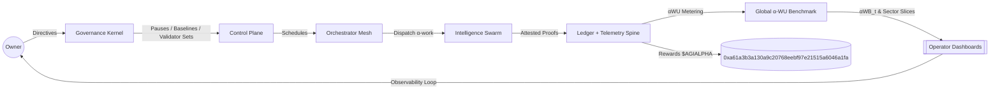
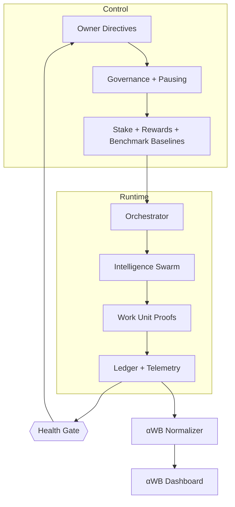
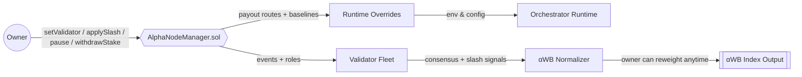
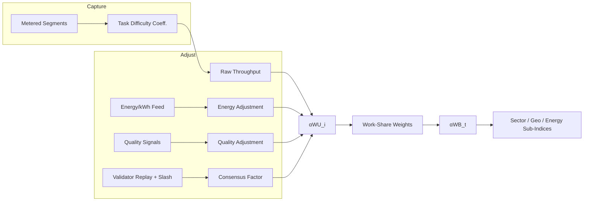
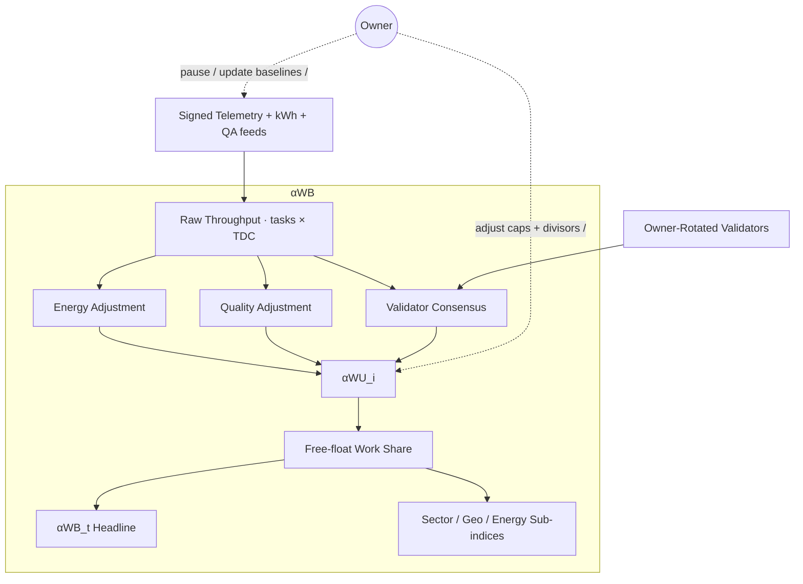
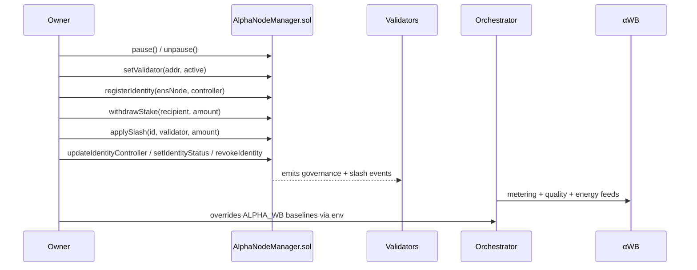
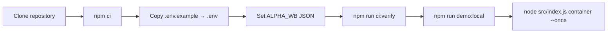
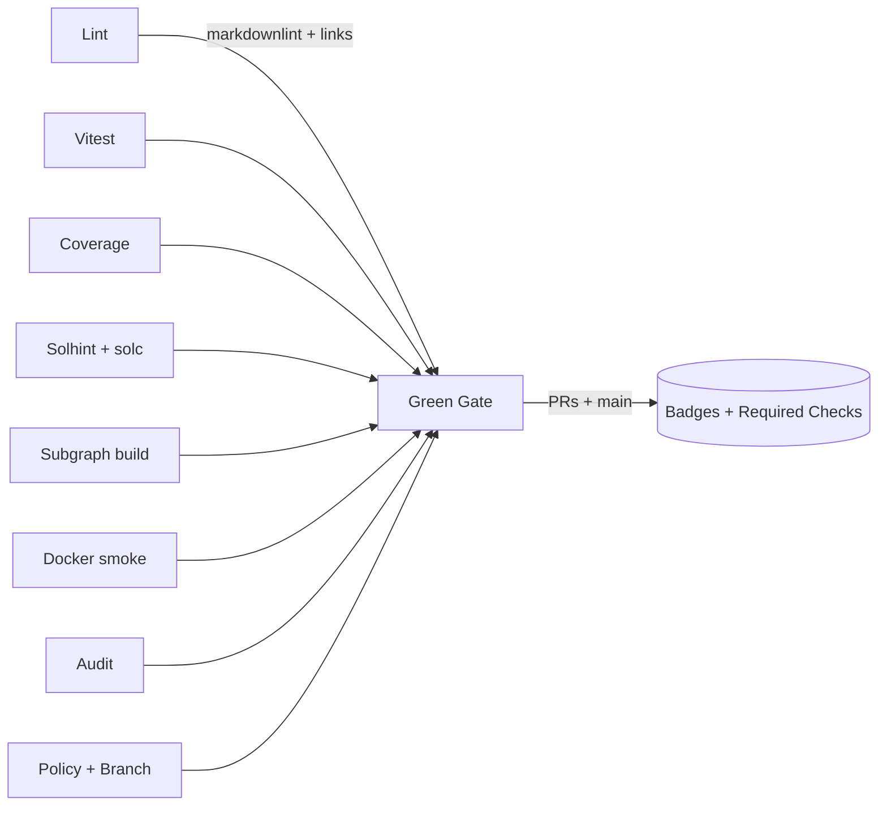

# AGI Alpha Node v0 · Cognitive Yield Engine ⚡

<!-- markdownlint-disable MD013 MD033 -->
<p align="center">
  <picture>
    <source srcset="1.alpha.node.agi.eth.svg" type="image/svg+xml" />
    
  </picture>
</p>

<p align="center">
  <a href="https://github.com/MontrealAI/AGI-Alpha-Node-v0/actions/workflows/ci.yml?query=branch%3Amain">
    
  </a>
  <a href=".github/required-checks.json">
    
  </a>
  
  
  
  <a href="https://etherscan.io/address/0xa61a3b3a130a9c20768eebf97e21515a6046a1fa"></a>
  
  <a href="LICENSE"></a>
  <a href="Dockerfile"></a>
  <a href="deploy/helm/agi-alpha-node"></a>
  <a href="docs/alpha-wb.md"></a>
  <a href="docs/testing.md"></a>
</p>

> **AGI Alpha Node v0** is the sovereign cognitive yield engine that turns heterogeneous agentic work into verifiable α‑WU, anchors it to the `$AGIALPHA` treasury, and keeps every lever under the owner’s command—pause, re-weight, rotate validators, rebase benchmark baselines, and reroute rewards without redeploying code. It is engineered as a production-ready intelligence spine that behaves like a capital market index for autonomous work while remaining fully owner-controllable.



## Table of Contents

1. [Mission Snapshot](#mission-snapshot)
2. [Treasury & Tokenization](#treasury--tokenization)
3. [Architecture Atlas](#architecture-atlas)
4. [α‑WU Benchmark (αWB) Blueprint](#alpha-wb-blueprint)
5. [Owner Command Surface](#owner-command-surface)
6. [Operations Quickstart](#operations-quickstart)
7. [Benchmark Configuration](#benchmark-configuration)
8. [Telemetry & Observability](#telemetry--observability)
9. [Health & Attestation Mesh](#health--attestation-mesh)
10. [Testing & CI Gates](#testing--ci-gates)
11. [Deployment Vectors](#deployment-vectors)
12. [Repository Atlas](#repository-atlas)
13. [Reference Snippets](#reference-snippets)

---

## Mission Snapshot

- **Canonical treasury binding** — Hardwired to the 18‑decimal `$AGIALPHA` contract [`0xa61a3b3a130a9c20768eebf97e21515a6046a1fa`](https://etherscan.io/address/0xa61a3b3a130a9c20768eebf97e21515a6046a1fa) for staking, rewards, and settlement; every yield motion routes through that anchor.
- **Owner primacy everywhere** — Pausing, validator rosters, identity registration/rotation, stake withdrawals, α‑WB baselines, and governance signaling remain exclusively with the contract owner (`AlphaNodeManager.sol`), granting full ability to update/override at will—including pausing, validator rotation, payout routing, and benchmark recalibration.
- **Deterministic attestations** — Canonical JSON, signed payloads, and independent verification keep liveness and identity integrity provable across validators.
- **Live health plane** — `startHealthChecks` signs latency‑aware attestations, emits OpenTelemetry spans, and exposes canonical payloads for verifiers and dashboards.
- **Production hardening** — Markdown + link linting, Vitest suites, coverage, Solidity lint/compile, subgraph builds, Docker smoke, npm audit, and policy/branch gates are enforced in CI and required on PRs/main.
- **Global productivity gauge** — α‑WU metering feeds the α‑WB benchmark, delivering a live, energy‑aware, quality‑aware “S&P 500 for autonomous work.”

## Treasury & Tokenization

- **Yield asset:** `$AGIALPHA` (18 decimals) at [`0xa61a3b3a130a9c20768eebf97e21515a6046a1fa`](https://etherscan.io/address/0xa61a3b3a130a9c20768eebf97e21515a6046a1fa) anchors staking, validator collateral, rewards, and settlement hooks.
- **Owner control:** The owner can pause/unpause, rotate validators, slash or reward, redirect staking flows, and refresh benchmark parameters without redeploying code.
- **Economic flywheel:** More α‑work → more α‑WU → more `$AGIALPHA` demand/staking → deeper validator security → richer α‑work pipelines.

## Architecture Atlas



- **Control Plane** — Owner‑owned governance calls flow through `AlphaNodeManager.sol`, adjusting validator sets, identity lifecycles, runtime overrides, and α‑WB baselines in real time.
- **Runtime Orchestration** — `src/orchestrator/bootstrap.js` hydrates identity, stakes, telemetry, health gates, validator runtimes, and orchestrator loops before dispatching α‑work.
- **Telemetry Spine** — OpenTelemetry spans plus Prometheus metrics capture every health beat; console exporters keep local dev frictionless while OTLP endpoints ship spans upstream.
  


<a id="alpha-wb-blueprint"></a>

## α‑WU Benchmark (αWB) Blueprint

The α‑WB benchmark is the production blueprint for a global “S&P 500 of autonomous work,” priced in **α‑WU (alpha Work Units)** and robust to energy, quality, and validator consensus.



- **Unit of account (α‑WU):** Reference bundle (doc‑writing, code edits, research, data transforms) rebalanced quarterly with capped drift.
- **Raw throughput:** `tasksCompleted × TaskDifficultyCoefficient` using open rubrics (tokens, steps, tool calls, novelty) normalized to 1.0 for the reference bundle.
- **Energy adjustment (EA):** `EA = cost_baseline / cost_observed`, derived from kWh + regional pricing with floor/cap defenses.
- **Quality adjustment (QA):** Human evals, adversarial suites, and outcome metrics (bugs, NPS, hallucination/error rates) feed a winsorized ratio.
- **Validator consensus (VC):** Independent replays plus slashing for irreproducibility or poisoning; consensus rewards honest reporting.
- **Per‑constituent yield:** `αWU_i = Raw × EA × QA × VC`, emitted with diagnostics.
- **Index construction:** Free‑float work‑share weights (caps/floors) → headline `αWB_t = Σ(weight_i × αWU_i) / Base_Divisor` plus sector/geo/energy slices.
- **Data pipeline & anti‑gaming:** Signed telemetry (kWh, hardware profile, tokens, wall‑clock), validator registry, hidden gold tasks, replay audits, cost attestation cross‑checks, anomaly detection, multiplier caps, and clawbacks.
- **MVP rollout:** Publish v0 spec + rubrics → onboard 5–10 diverse providers → run 30‑day shadow audits → ship **αWB‑Daily** dashboard → lock v1.0 after 90 days of variance data.

### Sprint blueprint (matches the AGI Alpha Node development tasks)

1. **Unit of account · α‑WU** — Reference bundle + quarterly, drift‑capped rebalancing to reflect real‑world task mix.
2. **Raw throughput** — Meter tasks × Task Difficulty Coefficient sourced from open rubrics (tokens, steps, tool usage, novelty).
3. **Energy adjustment (EA)** — Normalize by regionalized kWh pricing; clamp via `energyAdjustmentFloor`/`Cap` to avoid energy‑washing.
4. **Quality adjustment (QA)** — Human evals, adversarial/hidden tests, and outcome metrics flow into a winsorized ratio.
5. **Validator consensus (VC)** — Replayable samples, deterministic seeds, and slash triggers for non‑reproducible work.
6. **Per‑constituent yield** — `αWU_i = Raw × EA × QA × VC` with diagnostics for every factor.
7. **Index construction** — Free‑float work share weighting with diversification caps; headline `αWB_t` plus sector/geo/energy slices.
8. **Data pipeline & governance** — Signed telemetry (kWh, hardware profile, tokens, wall‑clock), validator registry, monthly method notes, randomized audits.
9. **Anti‑gaming controls** — Hidden gold tasks, replay audits, cross‑checked energy attestations, latency/cache anomaly detection, multiplier caps, clawbacks.
10. **Rollout path** — v0 spec → 30‑day shadow audits across 5–10 providers → **αWB‑Daily** dashboards → v1.0 lock after 90 days of variance data.



See [`docs/alpha-wb.md`](docs/alpha-wb.md) and the runtime spine in [`src/services/alphaBenchmark.js`](src/services/alphaBenchmark.js).

## Owner Command Surface



- **Pausable runtime:** `pause` / `unpause` keep the entire node authority under the owner’s hand (`AlphaNodeManager.sol`).
- **Validator governance:** `setValidator`, `applySlash`, and validator‑only acceptance ensure consensus integrity with reproducibility penalties.
- **Identity lifecycle:** `registerIdentity`, `updateIdentityController`, `setIdentityStatus`, and `revokeIdentity` grant the owner final say on ENS‑linked controllers.
- **Staking flow:** Owner‑controlled `withdrawStake` alongside validator deposits keeps treasury safety intact while preserving emergency drains.
- **Benchmark baselines:** Adjust α‑WB baselines and caps through `ALPHA_WB` without code edits; runtime picks up env changes at boot.
- **Full owner override surface:** Pausing, payout rerouting, validator set rotation, and benchmark recalibration can be executed without redeploying—preserving complete business control over every parameter.

## Operations Quickstart



1. **Clone & install**

   ```bash
   git clone https://github.com/MontrealAI/AGI-Alpha-Node-v0.git
   cd AGI-Alpha-Node-v0
   npm ci
   ```

   Node.js **20.18+** is enforced for deterministic builds.

2. **Configure identity, telemetry, payouts, and α‑WB**

   - Copy `.env.example` → `.env` and fill ENS label/name, payout targets, telemetry exporters, OTLP endpoint (if any), staking thresholds, RPC endpoints, and `ALPHA_WB` JSON for benchmark baselines.
   - Provide signing material through `ALPHA_NODE_KEYFILE` (JSON keyfile) or `NODE_PRIVATE_KEY` so live attestations match your ENS‑published pubkey.
   - Verify ENS alignment before launching:

     ```bash
     npm run ens:inspect -- --name <your-node>.eth
     node -e "import { loadNodeIdentity } from './src/identity/loader.js'; (async()=>console.log(await loadNodeIdentity('<your-node>.eth')))();"
     ```

3. **Mirror CI locally**

   ```bash
   npm run ci:verify
   ```

   This executes Markdown + link linting, Vitest suites, coverage, Solidity lint/compile, subgraph builds, npm audit, health/branch gates, and Docker smoke parity.

4. **Run a local demo**

   ```bash
   npm run demo:local
   node src/index.js container --once
   ```

## Benchmark Configuration

`ALPHA_WB` carries owner‑tunable baselines without code edits (validated by `src/config/schema.js`):

```bash
export ALPHA_WB='{
  "baselineEnergyCostPerKwh": 0.12,
  "baselineEnergyPerAlphaWU": 1.0,
  "baselineQuality": 1.0,
  "baselineConsensus": 0.99,
  "energyAdjustmentFloor": 0.65,
  "energyAdjustmentCap": 1.25,
  "qualityAdjustmentFloor": 0.6,
  "qualityAdjustmentCap": 1.5,
  "consensusAdjustmentFloor": 0.8,
  "consensusAdjustmentCap": 1.05,
  "rebalanceCap": 0.15,
  "rebalanceFloor": 0.01,
  "smoothingWindowDays": 90,
  "baseDivisor": 1000
}'
```

Floors must remain below caps; divisors and smoothing windows are positive integers; consensus baseline is bounded (`≤ 1.5`) to prevent runaway multipliers. Owner may rotate parameters as market data shifts while retaining pause authority on-chain.

## Telemetry & Observability

- **OpenTelemetry + Prometheus:** Metrics exported on `METRICS_PORT` (`9464` default), spans routed to OTLP endpoints when configured, with console fallbacks for local work.
- **Health payloads:** `startHealthChecks` signs node state, validator roster, and latency data for downstream verifiers.
- **Dashboards:** α‑WB outputs can be charted directly; see `docs/telemetry` for exporter details and dashboards.
- **Energy & quality visibility:** Telemetry embeds the inputs needed for EA/QA so αWB snapshots can be re-run by validators, auditors, and dashboards without hidden dependencies.

## Health & Attestation Mesh

- **Attestation verify:** `npm run attestation:verify` cross‑checks payloads and signatures.
- **Health gate policy:** `scripts/verify-health-gate.mjs` enforces allowlists/deny‑lists so only trusted ENS identities read the live health stream.
- **Replayable proofs:** Metering segments and α‑WU computations are deterministic (`roundTo` guarded) enabling third‑party replays.

## Testing & CI Gates



| Check | Command | Scope |
| --- | --- | --- |
| Markdown & link lint | `npm run lint` | Ensures docs and references are pristine. |
| Vitest + coverage | `npm run test`, `npm run coverage` | Exhaustive runtime + benchmark arithmetic validation. |
| Solidity lint/compile | `npm run ci:solidity` | Keeps on-chain owner controls + staking flows clean and compilable. |
| Subgraph build | `npm run ci:ts` | Validates The Graph manifest/typegen. |
| Docker smoke | `docker build …` via CI | Proves containerized startup + CLI help. |
| Security audit | `npm run ci:security` | Flags vulnerable deps (gated at `--audit-level=high`). |
| Policy & branch gates | `npm run ci:policy && npm run ci:branch` | Enforces health allowlists and protected branch names. |

- **One‑shot mirror:** `npm run ci:verify`
- **Individual tasks:**
  - Markdown lint: `npm run lint:md`
  - Link lint: `npm run lint:links`
  - Unit tests: `npm test`
  - Coverage: `npm run coverage`
  - Solidity lint/compile: `npm run ci:solidity`
  - Subgraph build: `npm run ci:ts`
  - Security: `npm run ci:security`
  - Policy & branch gates: `npm run ci:policy && npm run ci:branch`
- **Enforced on PRs/main:** see [`.github/required-checks.json`](.github/required-checks.json) for the exact required statuses.

## Deployment Vectors

- **Docker:** `docker build -t agi-alpha-node:local .` then run with envs for RPC, ENS name, payout addresses, and `ALPHA_WB` JSON.
- **Helm:** Charts live at [`deploy/helm/agi-alpha-node`](deploy/helm/agi-alpha-node) for Kubernetes rollouts.
- **Subgraph:** `npm --prefix subgraph run build:ci` builds the Graph Protocol manifest; see [`subgraph`](subgraph) for details.

## Repository Atlas

- `contracts/AlphaNodeManager.sol` — Owner‑controlled governance, pausing, validator registry, staking, and slash events; hard‑links the `$AGIALPHA` token.
- `src/services/alphaBenchmark.js` — α‑WU arithmetic, clamps, weighting, and index construction.
- `src/orchestrator/bootstrap.js` — Hydrates runtime identity, telemetry, validator setup, and orchestrator loops.
- `src/identity` — ENS identity loading plus controller verification.
- `docs/alpha-wb.md` — Full α‑WB benchmark spec and math; see `docs/testing.md` for CI/QA procedures.
- `deploy/` — Dockerfile and Helm charts for production rollouts; `scripts/` contains policy and verification helpers.

## Reference Snippets

### Compute a constituent yield

```js
import { computeConstituentAlphaWU } from './src/services/alphaBenchmark.js';

const alphaYield = computeConstituentAlphaWU({
  label: 'validator-fleet-1',
  tasksCompleted: 240,
  taskDifficultyCoefficient: 1.15,
  energyKwhPerAlphaWU: 0.92,
  energyCostPerKwh: 0.11,
  qualityScore: 1.08,
  consensusRate: 0.99,
  reproducibilityPenalty: 0.01
});
```

### Build the headline index

```js
import { computeAlphaWorkBenchmarkIndex } from './src/services/alphaBenchmark.js';

const { alphaWB, constituents } = computeAlphaWorkBenchmarkIndex([
  {
    label: 'Fleet-A',
    tasksCompleted: 200,
    taskDifficultyCoefficient: 1.05,
    energyKwhPerAlphaWU: 0.9,
    energyCostPerKwh: 0.1,
    qualityScore: 1.1,
    consensusRate: 0.995
  },
  {
    label: 'Fleet-B',
    tasksCompleted: 140,
    taskDifficultyCoefficient: 0.95,
    energyKwhPerAlphaWU: 1.3,
    energyCostPerKwh: 0.14,
    qualityScore: 0.96,
    consensusRate: 0.93,
    workShare: 0.25
  }
]);
```

### Anchor to metering segments

```js
import { deriveThroughputFromSegments } from './src/services/alphaBenchmark.js';
import { getSegmentsSnapshot } from './src/services/metering.js';

const throughput = deriveThroughputFromSegments(getSegmentsSnapshot());
```

---

AGI Alpha Node v0 is engineered to be the cognitive engine that compounds autonomous work into verifiable, owner‑governed yield—ready for production deployments, green‑lit CI, and global benchmarking in α‑WU.
