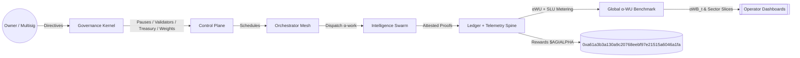

# AGI Alpha Node v0 · Cognitive Yield Engine ⚡️

<!-- markdownlint-disable MD012 MD013 MD033 -->
<p align="center">
  <picture>
    <source srcset="1.alpha.node.agi.eth.svg" type="image/svg+xml" />
    
  </picture>
</p>

<p align="center">
  <a href="https://github.com/MontrealAI/AGI-Alpha-Node-v0/actions/workflows/ci.yml?query=branch%3Amain">
    
  </a>
  <a href=".github/required-checks.json">
    
  </a>
  <a href="https://github.com/MontrealAI/AGI-Alpha-Node-v0/actions?query=branch%3Amain">
    
  </a>
  
  
  
  
  <a href="https://etherscan.io/address/0xa61a3b3a130a9c20768eebf97e21515a6046a1fa">
    
  </a>
  
  
  
  <a href="Dockerfile">
    
  </a>
  <a href="deploy/helm/agi-alpha-node">
    
  </a>
  
  
</p>

> **AGI Alpha Node v0** metabolizes heterogeneous agentic labor into verifiable α‑Work Units (α‑WU) and Synthetic Labor Units (SLU), prices the yield against energy, quality, and consensus, rebalances the Global Synthetic Labor Index (GSLI), and routes the `$AGIALPHA` treasury (token: `0xa61a3b3a130a9c20768eebf97e21515a6046a1fa`, 18 decimals) under complete owner command. Every lever can be paused, rerouted, or retuned without redeploying.

## Table of contents

- [Why this node](#why-this-node)
- [System architecture](#system-architecture)
- [Core capabilities](#core-capabilities)
- [Quickstart (non-technical friendly)](#quickstart-non-technical-friendly)
- [Telemetry spine & ingestion](#telemetry-spine--ingestion)
- [Global Synthetic Labor Index (GSLI)](#global-synthetic-labor-index-gsli)
- [Owner controls & on-chain levers](#owner-controls--on-chain-levers)
- [Data spine & migrations](#data-spine--migrations)
- [CI, gates, and release discipline](#ci-gates-and-release-discipline)
- [Operations playbook](#operations-playbook)
- [Repository atlas](#repository-atlas)
- [Appendix: CLI recipes](#appendix-cli-recipes)

## Why this node

- **Owner-first sovereignty**: The owner steers every critical parameter—pauses, validator rotation, identity lifecycle, staking thresholds, emission multipliers, treasury routing, and governance ledgers—without altering deployed code. Command surfaces live in `contracts/AlphaNodeManager.sol` with orchestration helpers in `src/services/governance.js`.
- **Index-grade telemetry**: JSON Schema–verified payloads, hashed API keys, and idempotent task-run recording preserve signal integrity while eliminating duplicates or malformed submissions.
- **Deterministic data spine**: SQLite migrations seed providers, task types, runs, telemetry, SLU snapshots, α‑index values, and constituent weights with indexes on provider/day for immediate dashboards and subgraph alignment.
- **Production-safe defaults**: The CLI, seeds, CI gates, Helm chart, and Docker build mirror automation paths so a non-specialist can bootstrap a production-critical node with a handful of commands.
- **Autonomous alpha extraction**: Agentic swarms route jobs through provider meshes, generating synthetic labor, quality, and energy telemetry that continuously tunes the `$AGIALPHA` flywheel.

## System architecture



```mermaid
graph TD
  subgraph Ingestion[Telemetry Ingestion v0]
    APIKeys[X-API-Key (hashed)] --> Gate[Provider Resolver]
    Gate --> Validator[JSON Schema v0]
    Validator -->|TaskRunTelemetry| TaskRuns[(task_runs)]
    Validator -->|EnergyReportPayload| Energy[(energy_reports)]
    Validator -->|QualityEvalPayload| Quality[(quality_evaluations)]
    Validator -->|ValidatorConsensus| VC[(synthetic_labor_scores.metadata)]
    TaskRuns --> Dedup[Idempotency Guard]
  end

  subgraph Control[Owner Control Plane]
    pause[Pause / Unpause]
    rotate[Rotate Validators]
    stakeOps[Stake Withdrawals]
    identityOps[ENS Identity Lifecycle]
    weights[Index Weights]
  end

  subgraph Data[Telemetry & Data Spine]
    providers[(providers)]
    tasks[(task_types)]
    runs[(task_runs)]
    quality[(quality_evaluations)]
    energy[(energy_reports)]
    synth[(synthetic_labor_scores)]
    idx[(index_values)]
  end

  Owner[[Owner Multisig]] --> Control
  Control -->|Commands| Ingestion
  Ingestion -->|Verified signals| Data
  Data -->|αWB snapshots| Control
  Control -->|Treasury Signals| Token[$AGIALPHA 0xa61a...a1fa]
```

## Core capabilities

- **Global Synthetic Labor Index (GSLI)**: Constituent eligibility, capped work-share weighting, base divisor versioning, and headline index computation live in `src/services/globalIndexEngine.js` with CLI surfaces in `src/index.js`.
- **Telemetry & scoring**: Synthetic labor scoring (`src/services/syntheticLaborEngine.js`) fuses throughput, energy, quality, and validator consensus into SLU per provider, per day.
- **Owner supremacy**: Pausing, validator set rotation, identity lifecycle, staking flows, treasury reassignment, and productivity index binding reside in `contracts/AlphaNodeManager.sol` and `src/services/governance.js`.
- **Observability**: Pino + OpenTelemetry tracing, Prometheus metrics, c8 coverage, and Vitest suites guard regressions while Docker + Helm ship identical probes.
- **Deterministic seeds**: `src/persistence` migrations and seeds hydrate providers, task archetypes, validators, telemetry exemplars, and index scaffolding.

## Quickstart (non-technical friendly)

1. **Install runtime**: Node.js 20.18+ and npm 10+. Run `npm ci` in the repo root for deterministic dependencies.
2. **Bootstrap the data spine**: `npm run db:migrate && npm run db:seed` hydrates providers, task archetypes, validators, telemetry exemplars, and initial index scaffolding.
3. **Boot the node locally**: `npm start` launches the API + orchestration server with seeded providers and task types.
4. **Dry-run telemetry**: `npm run demo:local` fires the local cluster simulator; observe persisted records in the SQLite spine.
5. **Score a day of labor**: `node src/index.js score:daily --date 2024-05-01` prints per-provider SLU with difficulty, energy, quality, and validator consensus adjustments.
6. **Rebalance the GSLI**: `node src/index.js index:rebalance --date 2024-05-02 --cap 15 --min-slu 2` applies capped work-share weights, records exclusions, and persists a `weight_set_id` for reproducibility.
7. **Inspect the headline index**: `node src/index.js index:daily --date 2024-05-02` reports `Index_t` with the active `weight_set_id`, `divisor_version`, and divisor applied.
8. **Simulate + backfill**: `node src/index.js index:simulate --days 90` generates synthetic telemetry, backfills 90d of index history with monthly rebalances, and prints the latest headline value.
9. **Operate via CLI**: `node src/index.js --help` lists governance, staking, lifecycle, telemetry, scoring, and antifragility commands; each subcommand validates inputs and prints tabular outputs for easy auditing.
10. **Container + Helm**: `docker build -t agi-alpha-node:local .` for a portable image, or use `deploy/helm/agi-alpha-node` to land in Kubernetes with the same health and telemetry probes.

## Telemetry spine & ingestion

- **Schemas**: Task runs (`spec/task_run_telemetry.schema.json`), energy reports (`spec/energy_report.schema.json`), quality evaluations (`spec/quality_eval.schema.json`), and validator consensus telemetry (`spec/validator_consensus.schema.json`) are enforced via AJV before persistence.
- **Versioning & provenance**: Every stored record carries `schema_version`, metadata (notes, task label, request fingerprint), and a payload hash for auditability.
- **Rate-limit stub**: Per-provider windows are tracked and surfaced via `X-RateLimit-*` headers to prepare for enforced throttling.
- **Example payloads** are provided in `docs/identity.md` and `spec/` fixtures for immediate replay.

## Global Synthetic Labor Index (GSLI)

```mermaid
flowchart LR
  subgraph Eligibility[Daily Eligibility]
    window30[30d SLU Window] --> filter{SLU >= min threshold}
    providers[(providers)] --> window30
    filter --> eligible[Eligible Providers]
    filter -.-> excluded[Excluded w/ reason]
  end

  subgraph Weights[Work-share Weights]
    eligible --> aggregate[90d SLU Aggregates]
    aggregate --> normalize[Normalize w_i]
    normalize --> cap[Cap at 15% (configurable)]
    cap --> weightSet[weight_set_id + metadata]
  end

  subgraph Index[Index_t Computation]
    weightSet --> multiply[Σ(w_i_base * SLU_i_t)]
    multiply --> divisor[/Base Divisor/]
    divisor --> headline[Index_t stored]
  end

  subgraph History[Backfill & Simulation]
    headline --> timeline[Index history]
    timeline --> dashboards[[Dashboards & Subgraph]]
  end
```

- **Constituent selection (MVP)**: Daily job filters providers by minimum 30d SLU. Exclusions persist with reasons in `index_constituent_exclusions` via `IndexConstituentExclusionRepository`.
- **Weighting logic**: Work-share weights computed as \( w_i = \frac{SLU_i}{\sum_j SLU_j} \) across the 90d lookback (configurable). A provider cap (default 15%) redistributes residual weight proportionally while flagging capped constituents.
- **Index value**: \( \text{Index}_t = \frac{\sum_i w_i^{base} \cdot SLU_{i,t}}{\text{BaseDivisor}} \). Stored with `divisor_version`, `weight_set_id`, and adjustment factors in `index_values`.
- **Rebalancing**: Monthly by default (configurable `rebalanceIntervalDays`) and versioned (`weight_set_id`) to preserve historical reproducibility. Prior weights remain addressable for audits.
- **Backfill + simulation**: `index:simulate` CLI generates synthetic telemetry, rebalances, and backfills 90d of history for demos or dashboards.
- **Code anchors**: Algorithms live in `src/services/globalIndexEngine.js` with persistence in `src/persistence/repositories.js` and CLI entrypoints in `src/index.js`.

## Owner controls & on-chain levers

- **Contract surface**: `contracts/AlphaNodeManager.sol` (token: `$AGIALPHA` at `0xa61a3b3a130a9c20768eebf97e21515a6046a1fa`) exposes pausing, validator rotation, identity lifecycle, stake custody, productivity index wiring, and treasury direction. The owner can update any critical parameter, pause flows, or reroute control without redeploying.
- **Command helpers**: `src/services/governance.js` builds calldata for productivity index binding, emission manager assignment, treasury routing, and validator operations; CLI wrappers live in `src/index.js`.
- **Identity**: ENS-aware node identity utilities (`src/identity`) keep local keys aligned with registry state while gating telemetry ingestion and staking operations.

## Data spine & migrations

- **Database**: SQLite with migrations and seeds in `src/persistence`. Run `npm run db:migrate && npm run db:seed` to hydrate providers, task types, telemetry exemplars, SLU snapshots, and index scaffolding.
- **Repositories**: Typed repositories for task runs, energy, quality, synthetic labor scores, index weight sets, exclusions, and values ensure consistent reads/writes across services.
- **Subgraph alignment**: `subgraph/` holds manifest rendering and codegen for The Graph deployments; CI validates builds via `npm run ci:ts`.

## CI, gates, and release discipline

- **Workflow**: `.github/workflows/ci.yml` runs markdown lint, link checks, Vitest suites, Solidity lint/compile, subgraph TypeScript builds, coverage, Docker smoke tests, npm security audits, and policy/branch gates. Badges publish on `main` for transparency.
- **Local equivalence**: `npm run ci:verify` reproduces the full gate locally. Individual stages exist (`ci:lint`, `ci:test`, `ci:coverage`, `ci:solidity`, `ci:ts`, `ci:security`, `ci:policy`, `ci:branch`).
- **Required checks**: `.github/required-checks.json` enforces green pipelines on PRs and `main`.
- **Coverage discipline**: `npm run coverage` emits `coverage/coverage-summary.json` consumed by the badge publisher and ensures test drift is visible.

## Operations playbook

- **Healthcheck**: `src/healthcheck.js` exposes readiness/liveness indicators for Kubernetes probes and local diagnostics.
- **Metrics**: Prometheus metrics emit from `src/services/monitoring.js`; scrape endpoints are wired into the API server when enabled.
- **Tracing**: OpenTelemetry bootstrap logs confirm exporter registration; defaults to console exporter for air-gapped environments.
- **Pausing & safety**: Owner can pause staking, validation, and mint/acceptance flows instantly via contract calls or CLI governance helpers.
- **Disaster drills**: `test/ownerControls.smoke.test.js` and `test/governance.test.js` validate control-plane safety; `test/docker` smoke in CI ensures runtime help output remains available.

## Repository atlas

- `src/` — Runtime services (orchestrator, telemetry ingestion, identity, governance, economics, global index engine).
- `contracts/` — Solidity contracts and interfaces with owner-forward controls.
- `spec/` — JSON Schemas for telemetry payloads.
- `docs/` — Economics notes, identity guidance, and manifesto.
- `scripts/` — CI helpers, ENS tooling, badge publisher, solc runner, and demos.
- `deploy/helm/agi-alpha-node/` — Helm chart for Kubernetes deployments.
- `subgraph/` — Graph Protocol manifest generator and TypeScript bindings.
- `test/` — Vitest suites covering governance, telemetry, economics, index math, and operational smoke flows.

## Appendix: CLI recipes

- **Daily SLU scoring**: `node src/index.js score:daily --date 2024-07-01`
- **Index rebalance**: `node src/index.js index:rebalance --date 2024-07-15 --cap 15 --min-slu 1 --lookback 90`
- **Index headline**: `node src/index.js index:daily --date 2024-07-16`
- **Synthetic backfill**: `node src/index.js index:simulate --days 90 --end 2024-07-31`
- **Validator rotation**: `node src/index.js governance:set-validator --address 0xabc... --active true`
- **Treasury redirect**: `node src/index.js governance:set-treasury --index 0xIndexAddress --treasury 0xTreasury`
- **Pause / unpause**: `node src/index.js governance:pause` or `governance:unpause`

AGI Alpha Node v0 is engineered to compound labor intelligence, reweight providers in real time, and let owners steer every dial with confidence.
