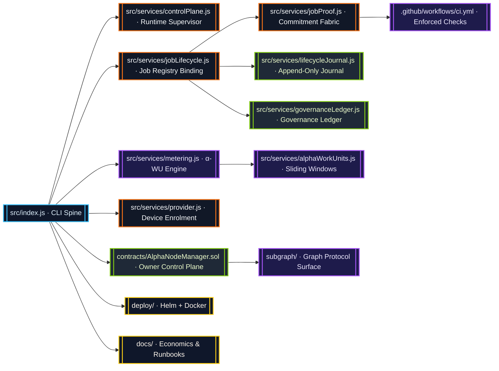
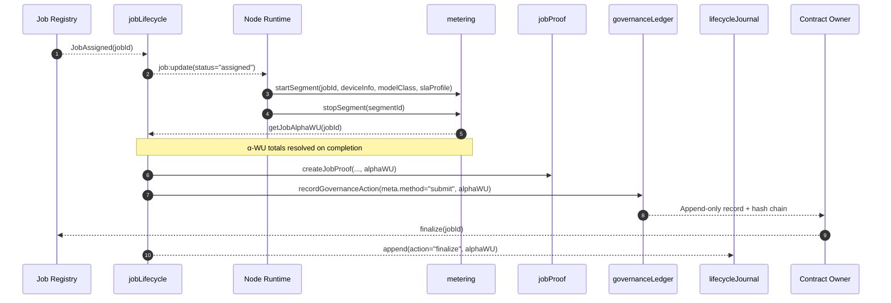
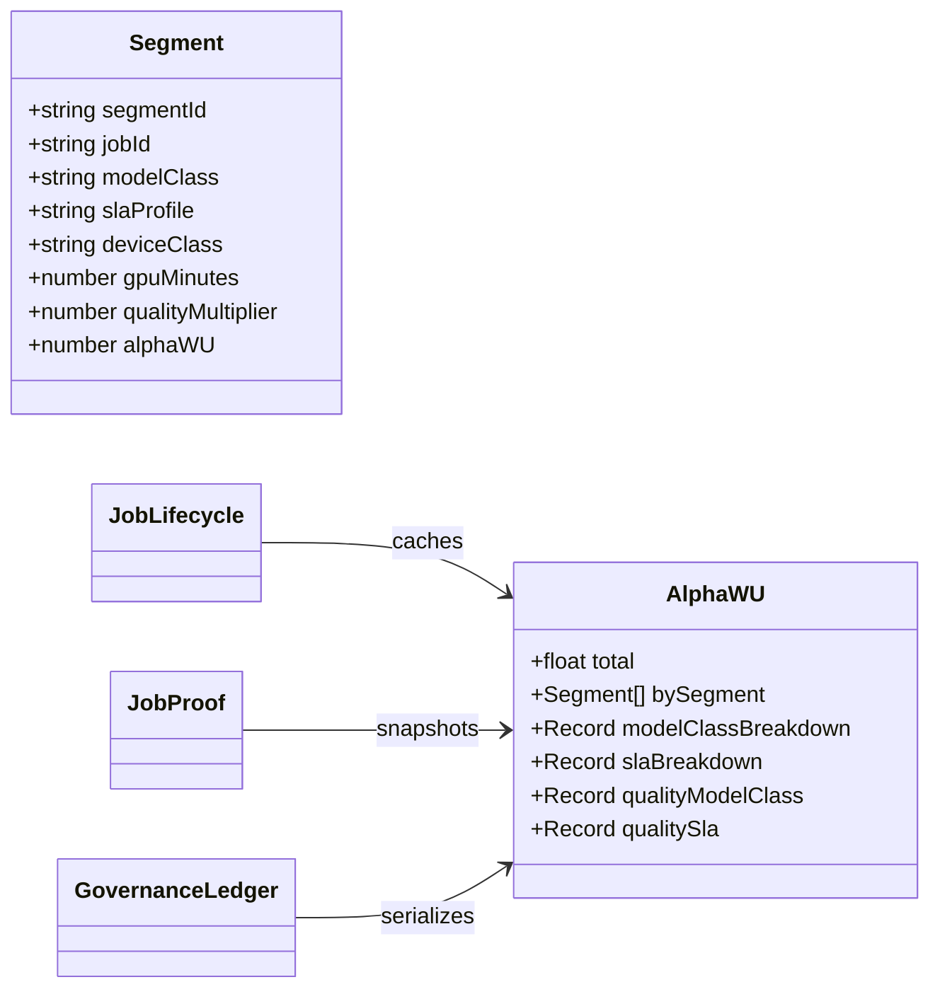
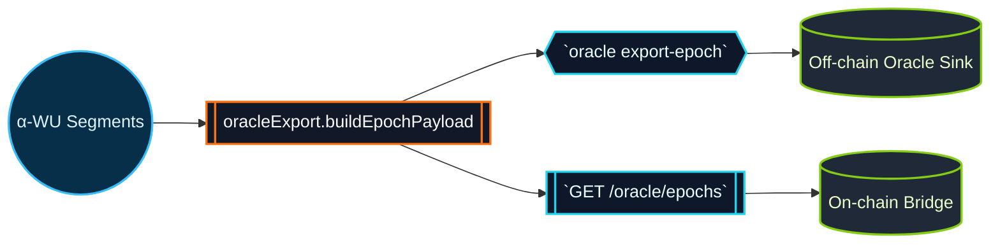
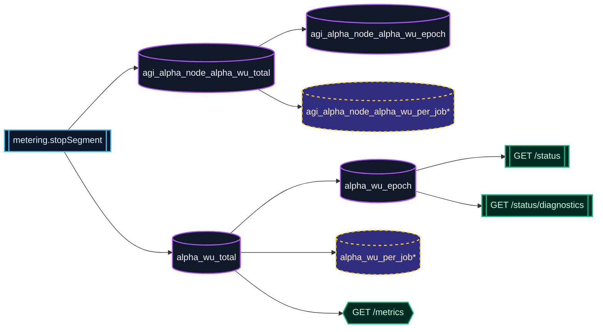

# AGI Alpha Node v0 · Sovereign Cognition Orchestrator ⚡

<!-- markdownlint-disable MD013 MD033 -->
<p align="center">
  <picture>
    <source srcset="1.alpha.node.agi.eth.svg" type="image/svg+xml" />
    
  </picture>
</p>

<p align="center">
  <a href="https://github.com/MontrealAI/AGI-Alpha-Node-v0/actions/workflows/ci.yml">
    
  </a>
  
  
  
  
  
  <a href="Dockerfile">
    
  </a>
  <a href="deploy/helm/agi-alpha-node">
    
  </a>
  <a href="docs/subgraph-deployment.md">
    
  </a>
  <a href="https://etherscan.io/address/0xa61a3b3a130a9c20768eebf97e21515a6046a1fa">
    
  </a>
  <a href="LICENSE">
    
  </a>
</p>

> AGI Alpha Node v0 is the command lattice where deterministic cognition, provable metering, and owner-directed governance converge. It is the superintelligent machine that channels capital, telemetry, and alpha extraction with precision worthy of planetary infrastructure.

---

## Table of Contents

1. [Sovereign Mandate](#sovereign-mandate)
2. [System Constellation](#system-constellation)
3. [Alpha-WU Continuum](#alpha-wu-continuum)
4. [Alpha Evidence Schema](#alpha-evidence-schema)
5. [Telemetry & Diagnostics](#telemetry--diagnostics)
6. [Oracle Bridge Surface](#oracle-bridge-surface)
7. [Lifecycle Journal & Governance Ledger](#lifecycle-journal--governance-ledger)
8. [Owner Mastery](#owner-mastery)
9. [Operational Launch](#operational-launch)
10. [Continuous Verification & CI](#continuous-verification--ci)
11. [Token Mechanics](#token-mechanics)
12. [Repository Atlas](#repository-atlas)
13. [Reference Library](#reference-library)

---

## Sovereign Mandate

AGI Alpha Node v0 is engineered so owners can redirect computation, staking posture, and validator policy in moments while maintaining crystalline observability. Every subsystem is tuned for high-stakes production, auditable within seconds, and runnable by a non-technical operator.

Highlights:

* **Deterministic cognition fabric** — lifecycle orchestration in `src/services/jobLifecycle.js` continuously reconciles job state with α-WU telemetry.
* **Adaptive capital routing** — the `AlphaNodeManager.sol` contract centralizes pausing, staking redirection, validator rotation, ENS rebinding, reward distribution, and penalty enforcement.
* **Tamper-evident journaling** — append-only lifecycle and governance ledgers produce deterministic hashes that can be replayed and diffed against on-chain truth.
* **Owner totality** — every critical parameter is owner-controlled via contract functions, CLI commands, or automation scripts; there are no external custodians.
* **$AGIALPHA economy** — the canonical 18-decimal token at [`0xa61a3b3a130a9c20768eebf97e21515a6046a1fa`](https://etherscan.io/address/0xa61a3b3a130a9c20768eebf97e21515a6046a1fa) fuels staking, validator compensation, and alpha flywheels.

---

## System Constellation



Every arrow is instrumented: services emit events, journals hash entries, and CI enforces deterministic builds. The architecture ensures the owner maintains a single source of truth spanning runtime, chain, and analytics surfaces.

---

## Alpha-WU Continuum



The same α-WU snapshot powers runtime state, proof commitments, and ledger entries:

```jsonc
{
  "jobId": "0x…",
  "resultHash": "0x…",
  "resultURI": "ipfs://…",
  "alphaWU": {
    "total": 42.6,
    "bySegment": [
      {
        "segmentId": "seg-1",
        "modelClass": "LLM_8B",
        "slaProfile": "STANDARD",
        "gpuMinutes": 18.5,
        "qualityMultiplier": 1.3,
        "alphaWU": 24.05
      }
    ],
    "modelClassBreakdown": { "LLM_8B": 24.05 },
    "slaBreakdown": { "STANDARD": 24.05 },
    "qualityBreakdown": {
      "modelClass": { "LLM_8B": 24.05 },
      "sla": { "STANDARD": 24.05 }
    }
  }
}
```

`createJobProof` and `recordGovernanceAction` rely on `metering.getJobAlphaWU(jobId)` so completion events inherit the exact totals a validator observed. Journal snapshots embed the same data, ensuring every reward and policy change can be traced to concrete compute evidence.

---

## Alpha Evidence Schema

To make the α-WU continuum actionable, every surface normalizes the evidence payload into the same schema. The structures below are produced automatically — no manual wiring is required:

| Surface | Location | α-WU Payload | Notes |
| --- | --- | --- | --- |
| Runtime cache | [`src/services/jobLifecycle.js`](src/services/jobLifecycle.js) | `job.alphaWU` appended on completion using `metering.getJobAlphaWU(jobId)` | Owner dashboards and journal entries read from this cache. |
| Proof fabric | [`src/services/jobProof.js`](src/services/jobProof.js) | `alphaWU: { total, bySegment, modelClassBreakdown, slaBreakdown, quality, qualityBreakdown }` | Stays local yet cryptographically bound to the commitment payload. |
| Governance ledger | [`src/services/governanceLedger.js`](src/services/governanceLedger.js) | `meta.alphaWU` persists totals plus per-segment and quality slices | Applies to submissions, stake motions, and reward flows while retaining append-only hashing. |



This schema guarantees that journals, proofs, and governance records describe the same computation. Operators can diff ledgers, replay α-WU totals, and reconcile `bySegment` slices against metering windows within seconds.

---

## Oracle Bridge Surface

The oracle bridge distills α-WU telemetry into deterministic payloads suitable for on-chain attestations or sovereign data rooms. The pipeline is anchored by [`src/services/oracleExport.js`](src/services/oracleExport.js), which reconstructs overlapping segments, prorates contributions, and emits an epoch payload cryptographically attributable to the node label.



### Bridge Capabilities

* **Deterministic epochs** — overlapping metering segments are fractionally attributed to any ISO window, yielding reproducible totals fit for merkle commitments.
* **Provider labeling** — every payload binds totals to the executing node label and surfaces `breakdown.byProvider` with α-WU and GPU minutes for multi-rack introspection.
* **Dual surfaces** — operators can export via CLI for batch jobs or call the REST endpoint for automated bridge relays guarded by `GOVERNANCE_API_TOKEN`.

#### CLI Export

```bash
node src/index.js oracle export-epoch \
  --from "2024-01-01T00:00:00Z" \
  --to "2024-01-01T00:15:00Z" \
  --epoch-id epoch-2024-01-01-a \
  --out alpha-wu-epoch.json
```

| Flag | Required | Description |
| --- | --- | --- |
| `--from <iso>` | ✅ | Inclusive epoch start. Accepts ISO 8601, Unix ms, or `Date` strings. |
| `--to <iso>` | ✅ | Exclusive epoch end. Must be greater than `--from`; same formats accepted. |
| `--epoch-id <id>` | ⛭ | Optional override for deterministic IDs when coordinating across relays. |
| `--out <path>` | ⛭ | When omitted, payload is streamed to stdout for piping; otherwise writes to disk. |

#### REST Export

```bash
curl \
  -H "Authorization: Bearer $GOVERNANCE_API_TOKEN" \
  "http://localhost:8080/oracle/epochs?from=2024-01-01T00:00:00Z&to=2024-01-01T00:15:00Z&epochId=epoch-2024-01-01-a"
```

> **Operator signal:** Set `GOVERNANCE_API_TOKEN` in the node runtime environment (CLI or `npm start`) so the REST surface can authenticate every bridge request. Tokens are bearer-style HMAC secrets managed by the contract owner; rotate them at will without downtime.

#### Sample Payload

```jsonc
{
  "epochId": "epoch-2024-01-01-a",
  "nodeLabel": "oracle-alpha",
  "window": {
    "from": "2024-01-01T00:00:00.000Z",
    "to": "2024-01-01T00:15:00.000Z"
  },
  "totals": {
    "alphaWU": 128.42
  },
  "breakdown": {
    "byProvider": {
      "oracle-alpha": { "alphaWU": 128.42, "gpuMinutes": 50.7 }
    },
    "byJob": {
      "job-1": { "alphaWU": 92.41, "gpuMinutes": 36.5 },
      "job-2": { "alphaWU": 36.01, "gpuMinutes": 14.2 }
    },
    "byDeviceClass": {
      "A100-80GB": 92.41,
      "H100-80GB": 36.01
    },
    "bySlaProfile": {
      "STANDARD": 92.41,
      "HIGH_REDUNDANCY": 36.01
    }
  }
}
```

Payloads are pure JSON (no bigint serialization artifacts) and remain stable across CLI and REST exports. Downstream consumers can hash the document to anchor proofs or feed automated staking distribution without fear of drift.

#### Field Reference

| Field | Type | Description |
| --- | --- | --- |
| `epochId` | `string` | Deterministic identifier. Defaults to a SHA-256 digest of `{nodeLabel}|{from}|{to}` when not supplied. |
| `nodeLabel` | `string` | The lowercase-normalized provider label used by metering segments (derived from `NODE_LABEL` / `PROVIDER_LABEL`). |
| `window.from` / `window.to` | `ISO 8601 string` | Inclusive temporal bounds of the epoch window, rounded to millisecond precision. |
| `totals.alphaWU` | `number` | Aggregate α-work units for the window, rounded to 8 decimal places for reproducibility. |
| `breakdown.byProvider[provider].alphaWU` | `number` | α-WU attributed to each provider label matching the node runtime. |
| `breakdown.byProvider[provider].gpuMinutes` | `number` | GPU minutes accrued by the provider within the window. |
| `breakdown.byJob[jobId].alphaWU` | `number` | α-WU assigned to `jobId` after fractional overlap adjustments. |
| `breakdown.byJob[jobId].gpuMinutes` | `number` | GPU minutes attributed to `jobId` in the window. |
| `breakdown.byDeviceClass[deviceClass]` | `number` | α-WU totals by hardware class (e.g., `A100-80GB`, `H100-80GB`). |
| `breakdown.bySlaProfile[slaProfile]` | `number` | α-WU totals grouped by SLA profile (e.g., `STANDARD`, `HIGH_REDUNDANCY`). |

Every field is sanitized to finite numeric ranges, ensuring that downstream indexers, notarization scripts, or bridge relays ingest a payload that is impossible to forge without diverging from the metering ledger.

---

## Lifecycle Journal & Governance Ledger

* **Lifecycle Journal (`src/services/lifecycleJournal.js`)** — append-only JSONL feed with deterministic metadata hashing. Each action entry includes normalized job metadata and α-WU breakdowns for effortless forensics.
* **Governance Ledger (`src/services/governanceLedger.js`)** — ledger writes for submissions, staking flows, and reward receipts append `meta.alphaWU` containing `total`, `modelClassBreakdown`, `slaBreakdown`, `bySegment`, and full quality slices while preserving append-only + hash continuity.
* **Snapshot integrity** — `computeJobMetadataHash` and ledger serialization convert BigInts and nested structures into stable digests. Replaying ledgers surfaces tampering immediately.

The ledgers and journal align runtime decisions with on-chain state, forming an auditable narrative around every alpha discovery.

---

## Telemetry & Diagnostics

Prometheus exports, diagnostics APIs, and the owner control plane converge on a unified α-WU signal. Metering events trigger counter increments, monitor loops roll up epochs, and REST consumers receive totals identical to dashboard gauges while legacy exporters remain intact for continuity.



| Metric | Type | Labels | Description |
| --- | --- | --- | --- |
| `alpha_wu_total` | Counter | `node_label`, `device_class`, `sla_profile` | Canonical α-WU accumulation for dashboards, SLOs, and capacity planning. |
| `agi_alpha_node_alpha_wu_total` | Counter | `node_label`, `device_class`, `sla_profile` | Legacy-compatible mirror retained for existing dashboards. |
| `alpha_wu_epoch` | Gauge | `epoch_id` | Rolling epoch totals computed by the monitor loop (last 24 epochs). |
| `agi_alpha_node_alpha_wu_epoch` | Gauge | `epoch_id` | Backward compatible epoch gauge for legacy Prometheus scrapes. |
| `alpha_wu_per_job` | Gauge *(opt-in)* | `job_id` | High-cardinality per-job totals mirroring `metering.getJobAlphaWU(jobId)`; disabled by default. |
| `agi_alpha_node_alpha_wu_per_job` | Gauge *(opt-in)* | `job_id` | Compatibility gauge mirroring the canonical per-job signal. |

> ℹ️ Enable the per-job gauges only when Prometheus cardinality budgets allow it:

```bash
export METRICS_ALPHA_WU_PER_JOB=1
npm start
```

The REST status surfaces mirror the Prometheus truth:

```bash
curl http://localhost:8080/status | jq
```

```jsonc
{
  "status": "ok",
  "offlineMode": false,
  "alphaWU": {
    "lastEpoch": { "id": "epoch-123456", "alphaWU": 318.42 },
    "lifetimeAlphaWU": 9821.77
  }
}
```

```bash
curl http://localhost:8080/status/diagnostics | jq '.alphaWU.totals'
```

```jsonc
{
  "byJob": { "job-telemetry": 10 },
  "byDeviceClass": { "A100-80GB": 10 },
  "bySlaProfile": { "STANDARD": 10 }
}
```

`/status` is safe for non-technical operators yet precise enough for automation. `/status/diagnostics` expands the same α-WU ledger into epoch sequences and breakdowns so observability stacks, data rooms, or sovereign dashboards can reconcile totals without bespoke glue code. Dashboards that scrape `/metrics` and SRE probes that poll the status endpoints consume the same α-WU truth source alongside existing stake, utilization, and health-gate gauges.

---

## Owner Mastery

`contracts/AlphaNodeManager.sol` grants absolute operational authority. Key controls include:

| Capability | Function(s) | Description |
| --- | --- | --- |
| Circuit breaker | `pause()`, `unpause()` | Halt or resume staking, validator flows, and α-WU attestations instantly. |
| Validator curation | `setValidator(address,bool)` | Activate or retire validators entrusted with α-WU validation rights. |
| Identity graph | `registerIdentity(bytes32,address)`, `updateIdentityController(bytes32,address)`, `setIdentityStatus(bytes32,bool)`, `revokeIdentity(bytes32)` | Bind ENS nodes to controllers, rotate operators, toggle availability, and revoke identities without downtime. |
| Stake & treasury flow | `stake(uint256)`, `withdrawStake(address,uint256)` | Direct $AGIALPHA inflows or reroute balances to owner-selected destinations. |
| Alpha attestations | `recordAlphaWUMint(bytes32,address,address)`, `recordAlphaWUValidation(bytes32,uint256,uint256)`, `recordAlphaWUAcceptance(bytes32)` | Chronicle α-WU lifecycle events with owner overrides and validator accountability. |
| Enforcement | `applySlash(bytes32,address,uint256)` | Penalize validators directly from the command plane when ledger evidence demands corrective action. |
| State introspection | `getIdentity(address)`, `ensNodeController(bytes32)` | Audit operator bindings before issuing directives. |

The owner console spans CLI entry points (`src/index.js`), scripts in `scripts/`, and policy automation backed by deterministic ledgers.

---

## Operational Launch

1. **Install dependencies**

   ```bash
   npm install
   ```

2. **Configure environment** — copy `.env.example` to `.env`, then supply RPC URLs, registry addresses, telemetry sinks, and staking policy thresholds.
3. **Launch the node**

   ```bash
   npm start
   ```

4. **Run diagnostics**

   ```bash
   node scripts/verify-health-gate.mjs
   node scripts/verify-branch-gate.mjs
   ```

5. **Exercise governance flows** — import `createJobLifecycle` or `recordGovernanceAction` to craft owner payloads. α-WU telemetry is injected automatically for submissions, stake adjustments, and reward receipts.
6. **Replay ledgers** — inspect `.agi/lifecycle/actions.jsonl` and `.governance-ledger/v1/*.json` to surface hashes, α-WU breakdowns, and signature provenance with any JSON tooling.

For containerized rollouts, leverage `deploy/docker` for Compose stacks or `deploy/helm/agi-alpha-node` for Kubernetes clusters. Both ship with health probes and secret templates for immediate production alignment.

---

### CLI Command Spine

| Command | Description | Key Files |
| --- | --- | --- |
| `node src/index.js bootstrap` | Bootstraps monitoring, lifecycle sync, API server, and governance hooks. | [`src/orchestrator/bootstrap.js`](src/orchestrator/bootstrap.js) |
| `node src/index.js monitor-loop` | Streams metering, lifecycle, and telemetry events; can run once or continuously. | [`src/orchestrator/monitorLoop.js`](src/orchestrator/monitorLoop.js) |
| `node src/index.js oracle export-epoch --from … --to …` | Emits deterministic α-WU oracle payloads for any ISO window. | [`src/services/oracleExport.js`](src/services/oracleExport.js) |
| `node src/index.js governance …` | Crafts owner transactions for pause, stake, reward, and upgrade directives. | [`src/services/governance.js`](src/services/governance.js) |
| `node src/index.js jobs …` | Applies, submits, and finalizes jobs with α-WU evidence injection. | [`src/services/jobLifecycle.js`](src/services/jobLifecycle.js) |
| `node src/index.js token …` | Introspects $AGIALPHA metadata, allowances, and approval payloads. | [`src/services/token.js`](src/services/token.js) |

Each command accepts `--help` for exhaustive options. The CLI is safe for non-technical operators: every transaction builder prints payloads before broadcast, and dry-run modes are available for governance surfaces.

---

## Continuous Verification & CI

The GitHub Actions workflow [`ci.yml`](.github/workflows/ci.yml) enforces eight mandatory gates on every pull request and on `main`:

```text
lint → unit tests → coverage → solidity lint/build → subgraph codegen/build → npm audit → policy gates → branch policy
```

```mermaid
flowchart LR
  classDef gate fill:#0f172a,stroke:#22d3ee,stroke-width:2px,color:#e0f2fe;
  classDef sentinel fill:#111827,stroke:#f97316,stroke-width:2px,color:#fff7ed;

  Lint[Markdown & Link Lint]:::gate --> Tests[Vitest Suite]:::gate --> Coverage[Coverage Report]:::gate -->
  Solidity[Solhint + solcjs]:::gate --> Subgraph[Graph Codegen/Build]:::gate --> Security[npm audit (high)]:::gate -->
  Policy[Health Gate]:::sentinel --> Branch[Branch Policy]:::sentinel --> Merge{Protected Branch}

  click Lint "https://github.com/MontrealAI/AGI-Alpha-Node-v0/actions?query=workflow%3Aci" "Lint logs"
  click Tests "https://github.com/MontrealAI/AGI-Alpha-Node-v0/actions?query=workflow%3Aci" "Test matrix"
  click Merge "https://github.com/MontrealAI/AGI-Alpha-Node-v0/settings/branches" "Branch protection"
```

* **Branch protection** — the repository requires all checks to pass before merge. The `Required Checks` badge above reflects enforced status.
* **Local parity** — run the full suite before opening a PR:

  ```bash
  npm run ci:verify
  ```

* **Targeted checks** — each stage is invokable individually via `npm run ci:lint`, `npm run ci:test`, `npm run ci:coverage`, `npm run ci:solidity`, `npm run ci:ts`, `npm run ci:security`, `npm run ci:policy`, and `npm run ci:branch`.

This continuous verification spine ensures every artifact remains production-grade and merge-ready.

---

## Token Mechanics

* **Ticker:** `$AGIALPHA`
* **Decimals:** `18`
* **Contract:** [`0xa61a3b3a130a9c20768eebf97e21515a6046a1fa`](https://etherscan.io/address/0xa61a3b3a130a9c20768eebf97e21515a6046a1fa)
* **Economic flywheel:** more jobs completed → higher α-WU attestations → increased staking demand → elevated rewards → more agent and node onboarding.

Token flows, staking posture, and governance signatures are detailed in `docs/economics.md` and `docs/manifesto.md`.

---

## Repository Atlas

| Path | Description |
| --- | --- |
| `src/` | Runtime services (lifecycle, governance, metering, provider integration, telemetry exporters). |
| `contracts/` | Solidity control plane anchored by `AlphaNodeManager.sol`. |
| `deploy/` | Docker and Helm deployment manifests for production rollout. |
| `docs/` | Economic framing, operator guides, testing strategies, telemetry references. |
| `scripts/` | Automation for health gates, subgraph generation, simulations, and CI harnesses. |
| `subgraph/` | Graph Protocol manifest and TypeScript handlers for indexed visibility. |
| `test/` | Vitest suites covering lifecycle, governance, metering, economics, and policy logic. |

---

## Reference Library

* [docs/operator-runbook.md](docs/operator-runbook.md) — CLI usage, environment setup, and recovery procedures.
* [docs/alpha-wu.md](docs/alpha-wu.md) — α-WU specification, device tiers, and SLA multipliers.
* [docs/deployment/](docs/deployment/) — infrastructure blueprints, including Kubernetes and bare-metal paths.
* [docs/telemetry/](docs/telemetry/) — Prometheus metrics, dashboards, and alerting hooks.
* [docs/testing.md](docs/testing.md) — validation pathways before production deployments.

---

AGI Alpha Node v0 positions autonomous agent collectives to out-learn, out-strategize, and out-execute global markets. Every ledger entry, proof, and governance action is synchronized, authenticated, and owner-controlled — ready for immediate production-critical deployment.
