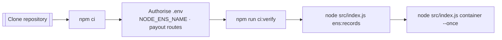
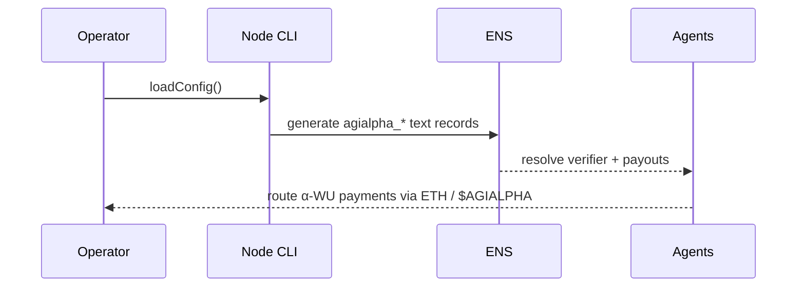
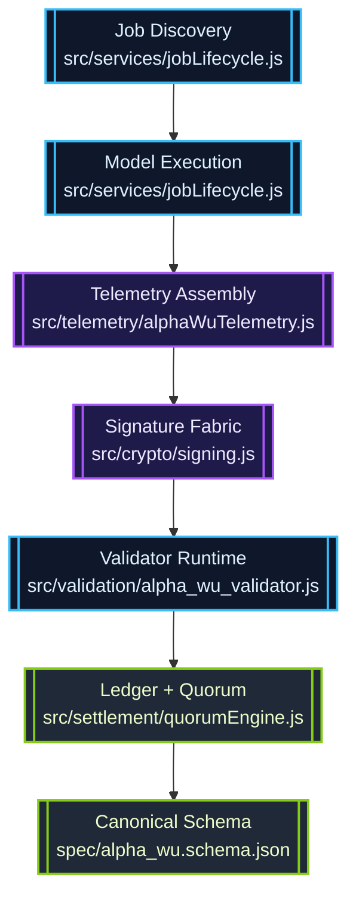
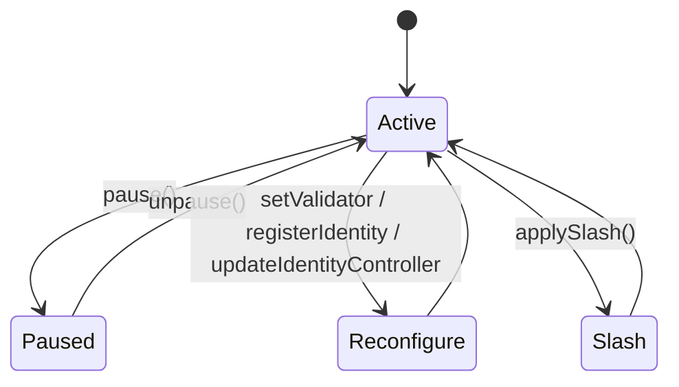
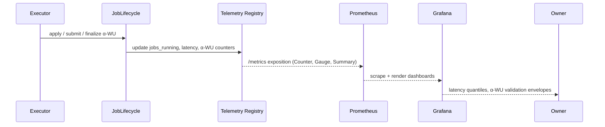

# AGI Alpha Node v0 · Sovereign Cognition Forge ⚡

<!-- markdownlint-disable MD013 MD033 -->
<p align="center">
  <picture>
    <source srcset="1.alpha.node.agi.eth.svg" type="image/svg+xml" />
    
  </picture>
</p>

<p align="center">
  <a href="https://github.com/MontrealAI/AGI-Alpha-Node-v0/actions/workflows/ci.yml">
    
  </a>
  
  
  
  <a href="spec/alpha_wu.schema.json"></a>
  
  
  
  
  <a href="Dockerfile"></a>
  <a href="deploy/helm/agi-alpha-node"></a>
  <a href="https://etherscan.io/address/0xa61a3b3a130a9c20768eebf97e21515a6046a1fa"></a>
  
  <a href="LICENSE"></a>
</p>

> Operate this lattice and you drive a cognition engine that self-verifies every work unit, journals attestations, and obeys owner directives instantly. It is engineered for non-technical stewards yet behaves with the decisiveness expected from a fully funded frontier lab.

---

## Contents

1. [Mission Vector](#mission-vector)
2. [Activation Protocol](#activation-protocol)
3. [Identity Mesh & ENS Canon](#identity-mesh--ens-canon)
4. [Verifier Surface](#verifier-surface)
5. [α-Work Unit Lattice](#α-work-unit-lattice)
6. [Owner Command Matrix](#owner-command-matrix)
7. [Telemetry & Insight Fabric](#telemetry--insight-fabric)
8. [Quality Gates & CI Enforcement](#quality-gates--ci-enforcement)
9. [Deployment Pathways](#deployment-pathways)
10. [Repository Atlas](#repository-atlas)
11. [Reference Library](#reference-library)

---

## Mission Vector

AGI Alpha Node v0 is the sovereign cognition forge: a production-class node that continuously routes, executes, and validates intelligence tasks while remaining completely under owner command.【F:contracts/AlphaNodeManager.sol†L1-L200】【F:src/services/jobLifecycle.js†L1-L200】

- **Absolute owner supremacy** — [`contracts/AlphaNodeManager.sol`](contracts/AlphaNodeManager.sol) centralizes pausing, validator rotation, ENS reassignment, stake routing, and α-WU governance under `onlyOwner`, giving the operator unbounded ability to reshape incentives, payout flows, and node identity on demand.【F:contracts/AlphaNodeManager.sol†L17-L200】
- **Deterministic cognition orchestration** — [`src/services/jobLifecycle.js`](src/services/jobLifecycle.js) spans discovery → execution → proof → governance with cryptographically signed α-WUs, ensuring every attestation carries the node’s ENS identity and operator intent.【F:src/services/jobLifecycle.js†L320-L920】
- **Multi-surface observability** — [`src/network/apiServer.js`](src/network/apiServer.js) and [`src/telemetry/monitoring.js`](src/telemetry/monitoring.js) expose JSON+Prometheus feeds with real-time `jobs_running`, completion/failure counters, α-WU validation histograms, stake posture, and ENS health so operators inspect throughput without spelunking logs.【F:src/network/apiServer.js†L1500-L1700】【F:src/telemetry/monitoring.js†L1-L340】
- **Canonical token economy** — `$AGIALPHA` (18 decimals) is permanently mapped to [`0xa61a3b3a130a9c20768eebf97e21515a6046a1fa`](https://etherscan.io/address/0xa61a3b3a130a9c20768eebf97e21515a6046a1fa) and codified in [`src/constants/token.js`](src/constants/token.js); staking, rewards, and slashing logic all reference this immutable anchor.【F:src/constants/token.js†L1-L20】

---

## Activation Protocol

Boot a fresh node into a fully verified stance using the deterministic ritual below. Every phase is automation-ready yet readable by non-technical stewards.



1. **Clone & install**

   ```bash
   git clone https://github.com/MontrealAI/AGI-Alpha-Node-v0.git
   cd AGI-Alpha-Node-v0
   npm ci
   ```

   The repository ships a locked dependency graph and enforces Node.js 20.18+ for reproducible installs.【F:package.json†L1-L64】

2. **Configure identity & payouts** — author `.env` (or export environment variables) covering ENS identity, payout routes, verifier URL, and signing keys. Invalid values are rejected by the runtime schema on load.【F:src/config/schema.js†L260-L360】

   ```bash
   cat <<'ENV' > .env
   NODE_ROLE=mixed
   NODE_LABEL=orchestrator
   ENS_PARENT_DOMAIN=alpha.node.agi.eth
   NODE_ENS_NAME=orchestrator.alpha.node.agi.eth
   OPERATOR_ADDRESS=0x0000000000000000000000000000000000000001
   NODE_PAYOUT_ETH_ADDRESS=0x0000000000000000000000000000000000000001
   NODE_PAYOUT_AGIALPHA_ADDRESS=0x0000000000000000000000000000000000000001
   NODE_PRIMARY_MODEL=orchestrator-hypernet:v1
   VERIFIER_PUBLIC_BASE_URL=https://node.example
   NODE_PRIVATE_KEY=0x........................................................
   VALIDATOR_PRIVATE_KEY=0x........................................................
   ENV
   ```

   Secrets never touch disk unless you explicitly persist them; `loadConfig()` validates and normalizes everything before the runtime proceeds.【F:src/index.js†L675-L706】

3. **Mirror CI locally** — execute the same pipeline the repository enforces on every merge (`lint`, `vitest`, coverage, Solidity gates, subgraph build, audit, policy, branch guard). Use the wrapper to run all gates exactly as CI does.【F:package.json†L18-L48】

   ```bash
   npm run ci:verify
   ```

4. **Publish ENS metadata** — generate the JSON payload that must be written into ENS text/multicoin records before the node enters production.【F:src/ens/ens_config.js†L1-L188】

   ```bash
   node src/index.js ens:records --pretty
   ```

5. **Launch orchestrator & verifier** — start the container orchestrator, API surface, Prometheus metrics, and public verifier HTTP endpoints in one action.【F:src/index.js†L1080-L1230】

   ```bash
   node src/index.js container --once --metrics-port 9464 --api-port 8080
   ```

   Remove `--once` for long-lived operation; add `--auto-stake` and governance overrides to steer incentives on-chain.【F:src/index.js†L1116-L1194】

---

## Identity Mesh & ENS Canon

Every node publishes deterministic metadata over ENS so off-chain agents can authenticate and pay without ambiguity.

- [`src/ens/ens_config.js`](src/ens/ens_config.js) resolves `NODE_ENS_NAME`, payout addresses, and ENS metadata. It emits `node_ens_name` into α-WUs, health gates, and validation payloads so the node’s signature is unmistakable.【F:src/ens/ens_config.js†L1-L200】
- [`docs/ens-node-metadata.md`](docs/ens-node-metadata.md) documents the required ENS text and multicoin records (`agialpha_verifier`, `agialpha_health`, `agialpha_model`, `agialpha_commit`, plus ETH and `$AGIALPHA` settlement addresses).【F:docs/ens-node-metadata.md†L1-L120】
- CLI utilities:
  - `node src/index.js ens:records --pretty` prints the live record template.
  - `node src/index.js ens-guide --label <label> --parent <domain> --address <operator>` produces a delegation runbook for ENS ownership.
  - `node src/index.js verify-ens --label <label> --parent <domain> --address <operator> [--rpc <url>]` confirms registry & wrapper controllers before publishing records.【F:src/index.js†L660-L760】



---

## Verifier Surface

The public HTTP verifier is the canonical interface referenced in ENS metadata and consumed by downstream agents.【F:src/network/verifierServer.js†L1-L200】

- `GET /verifier/info` — returns node ENS name, supported roles, payout addresses, ENS record template, and live metrics.
- `GET /verifier/health` — provides uptime, request counters, and last validation timestamps for liveness probes.
- `POST /verifier/validate` — accepts an α-WU JSON payload, validates signatures & schema, and responds with a signed `ValidationResult` stamped with `node_ens_name`.
- All responses are JSON, streamed via a hardened Node.js HTTP server, and logged through `pino` for auditability.

Integration coverage lives in [`test/verifierServer.test.js`](test/verifierServer.test.js) to guarantee metadata, payouts, and validator signatures surface exactly as ENS clients expect.【F:test/verifierServer.test.js†L1-L120】

---

## α-Work Unit Lattice

α-WUs encode the cognitive labor across the swarm. The pipeline standardizes creation, signing, validation, and governance.



- α-WUs adopt the canonical schema in [`spec/alpha_wu.schema.json`](spec/alpha_wu.schema.json) and embed `node_ens_name` by design.【F:spec/alpha_wu.schema.json†L1-L120】
- [`src/telemetry/alphaWuTelemetry.js`](src/telemetry/alphaWuTelemetry.js) collects runtime metrics, energy data, and signatures before handing to the validator runtime.【F:src/telemetry/alphaWuTelemetry.js†L150-L220】
- [`src/validation/alpha_wu_validator.js`](src/validation/alpha_wu_validator.js) enforces schema integrity, timestamp drift, and attestor signatures before returning signed validation payloads to requesters.【F:src/validation/alpha_wu_validator.js†L1-L200】
- [`src/settlement/quorumEngine.js`](src/settlement/quorumEngine.js) turns validated α-WUs into quorum decisions, bridging staking and payout mechanics.【F:src/settlement/quorumEngine.js†L1-L200】

---

## Owner Command Matrix

Owner sovereignty is absolute—the contract grants unilateral authority over identity, validators, rewards, and emergency posture.



- [`contracts/AlphaNodeManager.sol`](contracts/AlphaNodeManager.sol) exposes `pause()`, `unpause()`, validator toggles, identity registration, controller reassignment, payout withdrawal, and slash application—every dial is behind `onlyOwner`.【F:contracts/AlphaNodeManager.sol†L40-L220】
- Staking & rewards always use the canonical `$AGIALPHA` contract; mismatched addresses are rejected to prevent configuration drift.【F:contracts/AlphaNodeManager.sol†L36-L90】
- Off-chain governance hooks (owner directives, stake posture audits, runbook automation) live in [`src/orchestrator/bootstrap.js`](src/orchestrator/bootstrap.js) and [`docs/operator-runbook.md`](docs/operator-runbook.md), ensuring owner decisions manifest instantly in runtime behavior.【F:src/orchestrator/bootstrap.js†L300-L420】【F:docs/operator-runbook.md†L1-L160】

---

## Telemetry & Insight Fabric

The node streams a living pulse of orchestration, validation, and ownership in two synchronized planes: signed JSON over [`/api/metrics`](src/network/apiServer.js) for operators and Prometheus-compatible exposition over [`/metrics`](src/telemetry/monitoring.js) for machines.【F:src/network/apiServer.js†L1500-L1770】【F:src/telemetry/monitoring.js†L280-L380】 The observability lattice fuses job lifecycle state, α-WU validation telemetry, and owner health signals so you can close loops without ever opening a log file.



### Metric Constellation

| Metric | Type | Origin | Insight |
| ------ | ---- | ------ | ------- |
| `jobs_running` | Gauge | Job lifecycle state transitions | Number of concurrently executing workloads guarded by owner policy.【F:src/services/jobLifecycle.js†L470-L620】【F:src/telemetry/monitoring.js†L300-L360】 |
| `jobs_completed_total` / `jobs_failed_total` | Counter | Lifecycle completion events | Monotonic trackers for throughput and failure envelopes, wired into autoscaling and bounty pacing.【F:src/services/jobLifecycle.js†L470-L650】【F:src/telemetry/monitoring.js†L340-L360】 |
| `job_latency_ms` | Summary (p50/p95/p99) | Submission→completion delta | Latency quantiles (ms) for each workload, allowing SLO enforcement and validator arbitration.【F:src/services/jobLifecycle.js†L470-L650】【F:src/telemetry/monitoring.js†L300-L360】 |
| `alpha_wu_total` | Counter | Metered execution segments | Total α-WU minted per node/device/SLA profile, retained for epoch rollups.【F:src/services/metering.js†L300-L340】【F:src/telemetry/monitoring.js†L250-L320】 |
| `alpha_wu_validated_total` / `alpha_wu_invalid_total` | Counter | Validator sink + slash detector | Successful vs. rejected validations so you can quantify validator quality and dispute posture instantly.【F:src/services/jobLifecycle.js†L380-L430】【F:src/telemetry/monitoring.js†L300-L360】 |
| `alpha_wu_validation_latency_ms` | Summary | Mint → validation timestamps | Quantiles for validation dwell time, highlighting slow or malicious validator cohorts.【F:src/services/jobLifecycle.js†L380-L440】【F:src/telemetry/monitoring.js†L300-L360】 |
| Stake, ENS, governance gauges | Gauge | Diagnostics pipeline | Continuous stake balances, heartbeat age, compatibility warnings, and ENS health statuses for non-stop policy gating.【F:src/orchestrator/nodeRuntime.js†L270-L360】【F:src/telemetry/monitoring.js†L100-L240】 |

The JSON plane mirrors the same state so automation agents can ingest structured metrics without Prometheus tooling. Example:

```bash
curl -sS http://localhost:8080/api/metrics \
  -H "Authorization: Bearer <OWNER_TOKEN>" | jq '.jobLifecycle.jobLatency'
```

The synthetic workload harness in [`test/jobLifecycle.metrics.test.js`](test/jobLifecycle.metrics.test.js) drives an in-memory lifecycle through apply → submit → finalize while streaming α-WU validation and slash events, verifying that counters, gauges, and latency histograms all react exactly as operators expect.【F:test/jobLifecycle.metrics.test.js†L1-L196】

### Prometheus Scrape Blueprint

```yaml
scrape_configs:
  - job_name: agi-alpha-node
    metrics_path: /metrics
    static_configs:
      - targets: ['agi-alpha-node.local:9464']
```

Grafana dashboards in [`docs/telemetry/`](docs/telemetry/) map directly onto the exported series so you can drop them into your observability stack with zero rewiring.【F:docs/telemetry/README.md†L1-L120】

---

## Quality Gates & CI Enforcement

Continuous verification is non-negotiable. Branch protection mandates the CI pipeline before merge.

- `.github/workflows/ci.yml` runs markdown lint, link checks, vitest, coverage export, Solidity lint + compile, subgraph codegen/build, npm audit, policy guardrails, and branch verification.【F:.github/workflows/ci.yml†L1-L200】
- `npm run ci:verify` mirrors the workflow locally so maintainers reproduce the exact gate set pre-commit.【F:package.json†L18-L48】
- `scripts/verify-health-gate.mjs` and `scripts/verify-branch-gate.mjs` enforce health posture and branch policy, ensuring the repository stays production-grade even on feature branches.【F:scripts/verify-health-gate.mjs†L1-L200】【F:scripts/verify-branch-gate.mjs†L1-L160】

---

## Deployment Pathways

- **Docker** — [`Dockerfile`](Dockerfile) builds a production-ready image with Node.js 20 runtime, deterministic installs, and health probes baked in.【F:Dockerfile†L1-L120】
- **Helm** — [`deploy/helm/agi-alpha-node`](deploy/helm/agi-alpha-node) charts orchestrate multi-node deployments with ConfigMap-driven secrets, autoscaling hints, and liveness probes wired to `/verifier/health`.【F:deploy/helm/agi-alpha-node/Chart.yaml†L1-L120】
- **Subgraph** — [`subgraph`](subgraph) packages Graph Protocol artifacts; `npm run ci:ts` ensures manifest rendering, codegen, and build succeed before release.【F:scripts/render-subgraph-manifest.mjs†L1-L160】
- **Operator handbook** — [`docs/operator-runbook.md`](docs/operator-runbook.md) provides end-to-end rituals for provisioning wallets, assigning ENS, staking `$AGIALPHA`, and orchestrating validator rotations without developer support.【F:docs/operator-runbook.md†L1-L180】

---

## Repository Atlas

| Domain | Purpose | Key Artifacts |
| ------ | ------- | ------------- |
| `src/` | Runtime logic, verifier surface, telemetry, orchestration, validator runtime. | [`src/index.js`](src/index.js), [`src/network/verifierServer.js`](src/network/verifierServer.js), [`src/services/jobLifecycle.js`](src/services/jobLifecycle.js) |
| `contracts/` | On-chain governance, staking, ENS identity, α-WU events. | [`contracts/AlphaNodeManager.sol`](contracts/AlphaNodeManager.sol) |
| `docs/` | Operator manuals, ENS metadata spec, economics, telemetry blueprints. | [`docs/ens-node-metadata.md`](docs/ens-node-metadata.md), [`docs/economics.md`](docs/economics.md) |
| `deploy/` | Production deployment tooling (Helm, environment manifests). | [`deploy/helm/agi-alpha-node`](deploy/helm/agi-alpha-node) |
| `scripts/` | CI health gates, subgraph rendering, stake helpers. | [`scripts/verify-health-gate.mjs`](scripts/verify-health-gate.mjs), [`scripts/subgraph-simulation.js`](scripts/subgraph-simulation.js) |
| `spec/` | Canonical schemas for α-WUs and related payloads. | [`spec/alpha_wu.schema.json`](spec/alpha_wu.schema.json) |
| `test/` | 210+ vitest suites covering runtime, contracts, ENS tooling, telemetry, and governance. | [`test/verifierServer.test.js`](test/verifierServer.test.js), [`test/alphaWuValidator.test.js`](test/alphaWuValidator.test.js) |

---

## Reference Library

- [Economics & token flywheel](docs/economics.md)
- [Manifesto & mission](docs/manifesto.md)
- [Telemetry handbook](docs/telemetry/README.md)
- [ENS metadata specification](docs/ens-node-metadata.md)
- [Offline snapshot format](docs/offline-snapshot.example.json)
- [Testing guide](docs/testing.md)

Harness the node, direct the lattice, and steer the wealth vector.
