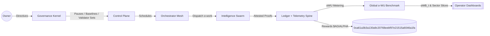
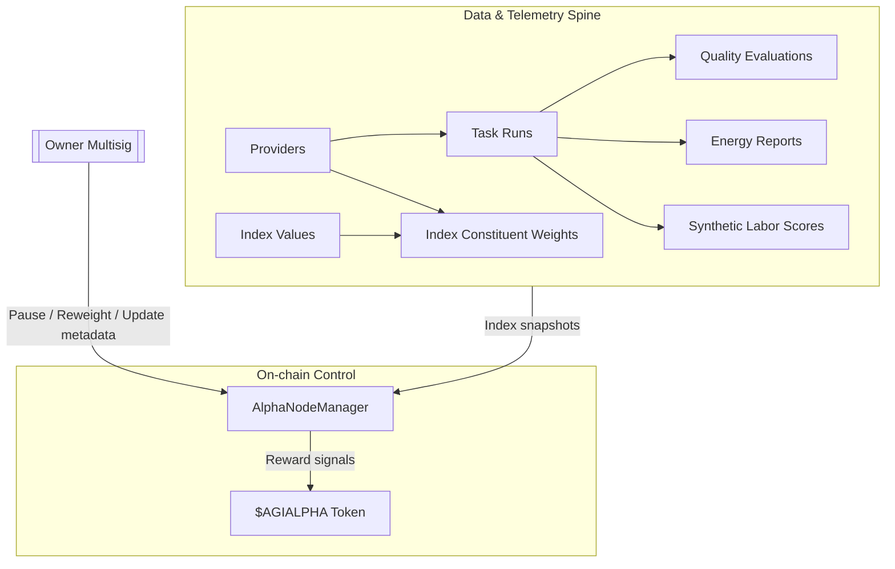

# AGI Alpha Node v0 · Cognitive Yield Engine ⚡

<!-- markdownlint-disable MD013 MD033 -->
<p align="center">
  <picture>
    <source srcset="1.alpha.node.agi.eth.svg" type="image/svg+xml" />
    
  </picture>
</p>

<p align="center">
  <a href="https://github.com/MontrealAI/AGI-Alpha-Node-v0/actions/workflows/ci.yml?query=branch%3Amain">
    
  </a>
  <a href=".github/required-checks.json">
    
  </a>
  <a href="docs/testing.md">
    
  </a>
  
  
  <a href="https://etherscan.io/address/0xa61a3b3a130a9c20768eebf97e21515a6046a1fa"></a>
  
  <a href="LICENSE"></a>
  <a href="Dockerfile"></a>
  <a href="deploy/helm/agi-alpha-node"></a>
  <a href="docs/testing.md"></a>
  <a href="https://github.com/MontrealAI/AGI-Alpha-Node-v0/graphs/contributors"></a>
  
</p>

> **AGI Alpha Node v0** is a cognitive yield engine that turns heterogeneous agentic work into verifiable α‑Work Units (α‑WU), anchors them to the `$AGIALPHA` treasury (`0xa61a3b3a130a9c20768eebf97e21515a6046a1fa`, 18 decimals), and keeps every lever under the owner’s command—pause, re-weight, rotate validators, refresh baselines, and reroute rewards without redeploying code.

## Table of contents

- [Why this node](#why-this-node)
- [Quickstart](#quickstart)
- [System architecture](#system-architecture)
- [Data spine: entities and migrations](#data-spine-entities-and-migrations)
- [Repositories & usage](#repositories--usage)
- [Owner controls & on-chain levers](#owner-controls--on-chain-levers)
- [CI, quality gates, and release rigor](#ci-quality-gates-and-release-rigor)
- [Operations playbook](#operations-playbook)
- [Contributing](#contributing)

## Why this node

- **Owner-first sovereignty**: every critical switch is held by the contract owner—pause/unpause, validator rotation, identity lifecycle, staking withdrawals, index rewrites, and slashing routines are callable without redeployment from `contracts/AlphaNodeManager.sol`.
- **Deterministic data spine**: SQLite migrations seed providers, task types, runs, telemetry, α‑index values, and constituent weights with indexes on provider/day for instant dashboards and subgraph alignment.
- **Production-safe defaults**: the CLI, seeds, and Helm chart mirror automation paths so non-specialists can bootstrap a high-stakes node with a single command stream.
- **Always-on alpha extraction**: agentic swarms route jobs through provider meshes, generating synthetic labor, quality, and energy telemetry that continuously tune the `$AGIALPHA` flywheel.

## Quickstart

```bash
git clone https://github.com/MontrealAI/AGI-Alpha-Node-v0.git
cd AGI-Alpha-Node-v0
npm ci                    # installs native better-sqlite3, solc, vitest, subgraph toolchain
npm run db:migrate        # initializes SQLite spine (override with AGI_ALPHA_DB_PATH)
npm run db:seed           # loads canonical providers + task types
npm test                  # full vitest suite, policy gates, persistence coverage
npm start -- --help       # explore runtime flags
```

**One-liner for operators:** `npm ci && npm run ci:verify` executes the exact GitHub Actions pipeline locally.

## System architecture





## Data spine: entities and migrations

SQLite migrations live in `src/persistence/migrations` and bootstrap the entire telemetry surface:

| Entity | Purpose | Key fields |
| --- | --- | --- |
| `providers` | Registered execution nodes with region, sector tags, energy mix, metadata | `name`, `operator_address`, `region`, `sector_tags[]`, `energy_mix`, `metadata`, timestamps |
| `task_types` | Canonical α‑WU templates with difficulty coefficients | `name`, `description`, `difficulty_coefficient`, timestamps |
| `task_runs` | Individual executions tied to providers & task types | `provider_id`, `task_type_id`, `status`, `raw_throughput`, `tokens_processed`, `tool_calls`, `novelty_score`, `quality_score`, lifecycle timestamps |
| `quality_evaluations` | Evaluator-scored runs | `task_run_id`, `evaluator`, `score`, `notes`, `created_at` |
| `energy_reports` | Energy/region signals per run | `task_run_id`, `kwh`, `energy_mix`, `carbon_intensity_gco2_kwh`, `cost_usd`, `region`, `created_at` |
| `synthetic_labor_scores` | Synthetic labor uplift per provider/run | `provider_id`, `task_run_id`, `score`, `rationale`, `created_at` |
| `index_values` | Headline Alpha Index values | `effective_date`, `headline_value`, `energy_adjustment`, `quality_adjustment`, `consensus_factor`, `created_at` |
| `index_constituent_weights` | Provider weights for each index value | `index_value_id`, `provider_id`, `weight`, `created_at` |

Indexes cover provider/day hotspots: `providers(region, created_at)`, `task_runs(provider_id, created_at, day)`, `index_values(effective_date)`, and composite uniqueness for `index_constituent_weights`.

### Migrate & seed

```bash
npm run db:migrate            # uses AGI_ALPHA_DB_PATH or in-memory
npm run db:seed               # seeds task types & providers
node src/persistence/cli.js migrate data/alpha.sqlite
node src/persistence/cli.js seed data/alpha.sqlite
```

Seeds ship with high-signal task types (`code-refactor`, `research-dossier`, `data-cleanse`, `agent-benchmark`) and exemplar providers (`helios-labs`, `aurora-intel`) including sector tags, regions, and energy mixes.

## Repositories & usage

CRUD repositories wrap serialization (JSON metadata, sector tags) and timestamps for every entity.

```js
import { initializeDatabase } from './src/persistence/database.js';
import {
  ProviderRepository,
  TaskTypeRepository,
  TaskRunRepository,
  QualityEvaluationRepository,
  EnergyReportRepository,
  SyntheticLaborScoreRepository,
  IndexValueRepository,
  IndexConstituentWeightRepository
} from './src/persistence/repositories.js';

const db = initializeDatabase({ filename: 'data/alpha.sqlite', withSeed: true });
const providers = new ProviderRepository(db);
const taskTypes = new TaskTypeRepository(db);
const runs = new TaskRunRepository(db);
const quality = new QualityEvaluationRepository(db);
const energy = new EnergyReportRepository(db);
const synthetic = new SyntheticLaborScoreRepository(db);
const indexValues = new IndexValueRepository(db);
const weights = new IndexConstituentWeightRepository(db);

const provider = providers.findByName('helios-labs');
const taskType = taskTypes.findByName('code-refactor');

const run = runs.create({
  provider_id: provider.id,
  task_type_id: taskType.id,
  external_id: 'alpha-run-001',
  status: 'running',
  raw_throughput: 1.2,
  tokens_processed: 12000
});

quality.create({ task_run_id: run.id, evaluator: 'cognitive-audit', score: 0.93 });
energy.create({ task_run_id: run.id, kwh: 4.2, energy_mix: 'hydro', region: 'na-east' });

const indexValue = indexValues.create({
  effective_date: '2024-02-01',
  headline_value: 101.25,
  energy_adjustment: 0.98,
  quality_adjustment: 1.02,
  consensus_factor: 0.99
});

weights.create({ index_value_id: indexValue.id, provider_id: provider.id, weight: 0.42 });
```

## Owner controls & on-chain levers

`contracts/AlphaNodeManager.sol` binds the `$AGIALPHA` token (18 decimals, `0xa61a3b3a130a9c20768eebf97e21515a6046a1fa`) to a control plane designed for full operator command:

- **Pause / resume** the entire node surface (`pause`, `unpause`).
- **Validator lifecycle**: add/remove validators, rotate sets, and gate participation (`setValidator`).
- **Identity mastery**: register ENS nodes, update controllers, revoke or deactivate controllers, and enforce active identities for staking (`registerIdentity`, `updateIdentityController`, `setIdentityStatus`, `revokeIdentity`).
- **Staking & treasury routing**: deposit/withdraw `$AGIALPHA` stakes with owner-directed withdrawals (`stake`, `withdrawStake`).
- **Safety rails**: strict address/ENS validation, immutable token binding, and explicit error codes for every critical path.

These controls are callable without redeployments, keeping governance nimble while retaining absolute owner authority.

## CI, quality gates, and release rigor

```mermaid
flowchart LR
  Lint[Markdown + Links + Policy] --> Tests[Vitest JS/TS]
  Tests --> Coverage[Coverage + Upload]
  Coverage --> Solidity[Solhint + solc smoke]
  Solidity --> Subgraph[Subgraph build]
  Subgraph --> Security[High-severity npm audit]
  Security --> Branch[Branch Gate]
  Branch --> Docker[Docker build + runtime help]
  Docker --> Merge[PR Merge Allowed]
```



- **Required checks**: `.github/required-checks.json` enforces all gates on `main` and PRs.
- **Workflow**: `.github/workflows/ci.yml` runs lint, policy gates, full Vitest suite (including persistence and on-chain harnesses), coverage export, Solidity lint/compile, subgraph codegen/build, high-severity npm audit, branch policy, and Docker smoke tests.
- **Local parity**: `npm run ci:verify` mirrors the Actions matrix; coverage artifacts land in `coverage/` for downstream upload.

## Operations playbook

- **Database lifecycle**: `node src/persistence/cli.js migrate|seed [db]` mirrors production automation for migrations and seeds.
- **Runtime**: `npm start -- --help` surfaces all flags; environment variables (e.g., `AGI_ALPHA_DB_PATH`, telemetry endpoints, ENS config) are documented inline in `src/index.js`.
- **Subgraph**: `npm run simulate:subgraph` renders manifests; `npm run ci:ts` performs full build/codegen.
- **Docker & Helm**: `docker build -t agi-alpha-node:local .` then `docker run agi-alpha-node:local --help`; Helm chart lives in `deploy/helm/agi-alpha-node` for cluster rollout.

## Contributing

1. `npm ci` (native modules included).
2. `npm run ci:verify` before opening a PR.
3. Keep docs and diagrams aligned with code; link updates require `npm run lint:links` to stay green.
4. PRs must keep the CI badge green and respect `.github/required-checks.json`.

AGI Alpha Node is engineered to stay ahead of any market edge: autonomous swarms learn faster, coordinate tighter, and deliver deterministic yield signals powered by `$AGIALPHA`.
