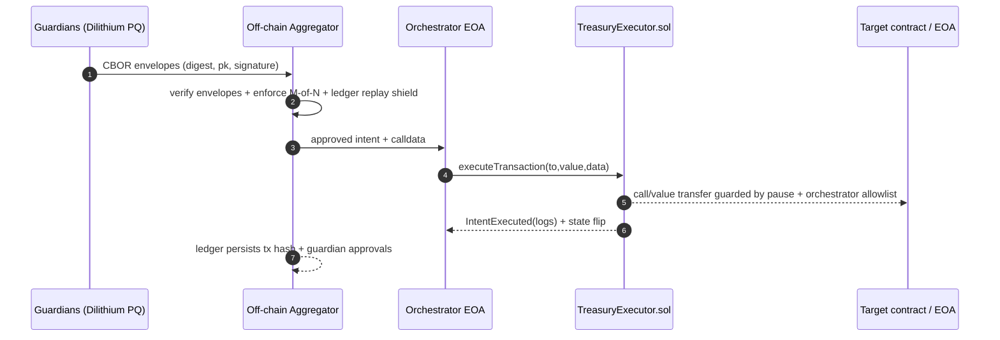
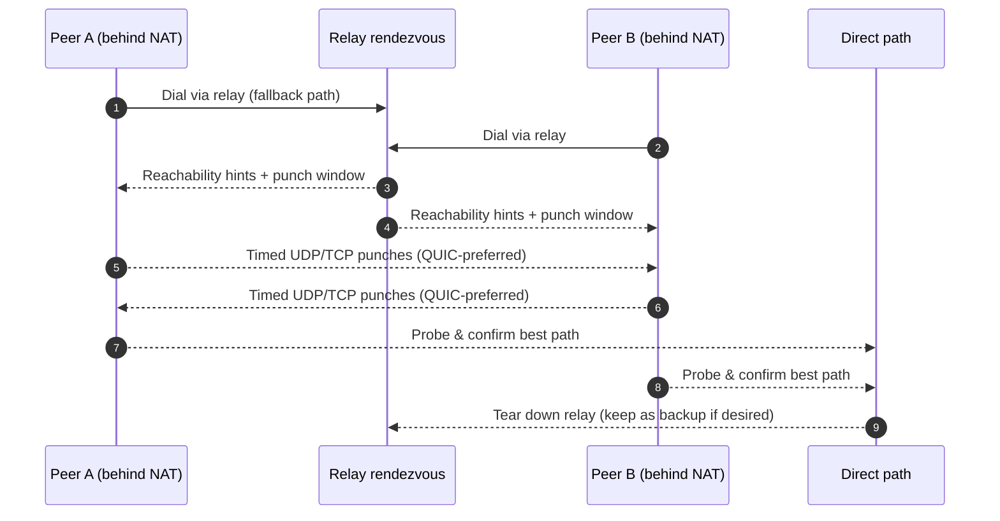
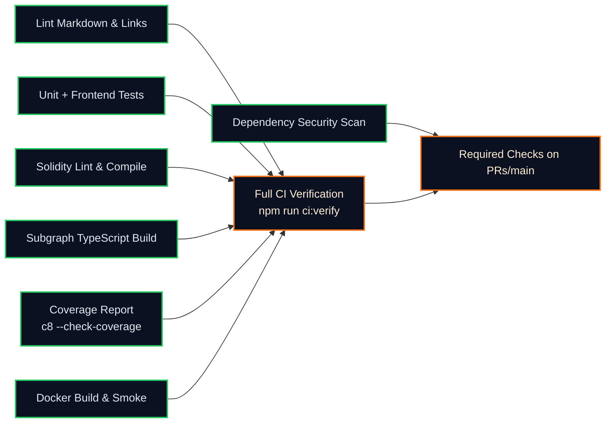
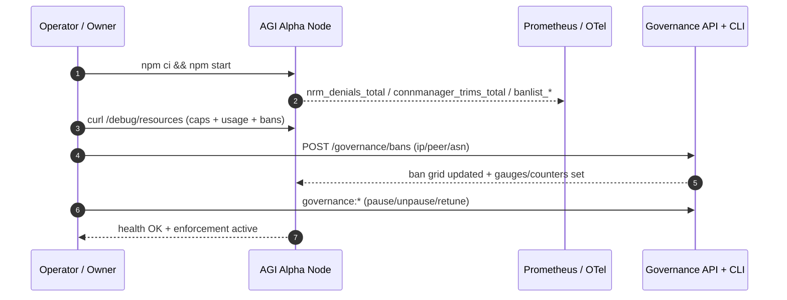

# AGI Alpha Node v0 · Cognitive Yield Engine ⚡️
<!-- markdownlint-disable MD012 MD013 MD033 -->
<p align="center">
  <picture>
    <source srcset="1.alpha.node.agi.eth.svg" type="image/svg+xml" />
    
  </picture>
</p>

<p align="center">
  <a href="https://github.com/MontrealAI/AGI-Alpha-Node-v0/actions/workflows/ci.yml?query=branch%3Amain">
    
  </a>
  <a href="https://github.com/MontrealAI/AGI-Alpha-Node-v0/actions/workflows/ci.yml?query=branch%3Amain">
    
  </a>
  <a href="https://github.com/MontrealAI/AGI-Alpha-Node-v0/actions/workflows/ci.yml?query=branch%3Amain">
    
  </a>
  <a href=".github/required-checks.json">
    
  </a>
  
  
  
  <a href="https://etherscan.io/address/0xa61a3b3a130a9c20768eebf97e21515a6046a1fa">
    
  </a>
  
  <a href="LICENSE">
    
  </a>
  
  
  <a href="docs/treasury-mode-a.md">
    
  </a>
  <a href="docs/runes/guardian.md">
    
  </a>
  <a href="docs/runes/orchestrator.md">
    
  </a>
  <a href="Dockerfile">
    
  </a>
  <a href="deploy/helm/agi-alpha-node">
    
  </a>
  
  
  <a href="observability/docs/METRICS.md">
    
  </a>
  <a href="observability/grafana/dcutr_dashboard.json">
    
  </a>
  <a href="observability/docs/METRICS.md">
    
  </a>
  <a href="observability/docs/DASHBOARD.md">
    
  </a>
</p>

**AGI Alpha Node v0** metabolizes heterogeneous agentic labor into verifiable α‑Work Units (α‑WU) and Synthetic Labor Units (SLU), rebalances the Global Synthetic Labor Index (GSLI), exposes audited REST telemetry, and routes the `$AGIALPHA` treasury (token: `0xa61a3b3a130a9c20768eebf97e21515a6046a1fa`, 18 decimals) under absolute owner command. Every dial can be paused, rerouted, or retuned without redeploying, delivering a production-grade intelligence core built to reshape markets while remaining obedient to the owner’s keys.

**This node is the wealth engine**: every control surface, metric, and runbook is wired so the owner can tune economics, transport posture, and treasury dispatch in one place while auditors and operators see the same telemetry. The alpha flow is sovereign, survivable, and designed to compound value without conceding a single lever of control to anyone but the owner.

> **DCUtR observability sprint (fresh)**: drop-in Prometheus primitives live at `observability/prometheus/metrics_dcutr.ts`, the paired Grafana stub sits in `observability/grafana/dcutr_dashboard.json`, and operator notes land in `observability/docs/METRICS.md` + `observability/docs/DASHBOARD.md` so you can register collectors, emit punch lifecycle events with labeled detail, and publish dashboards without bespoke wiring.【F:observability/prometheus/metrics_dcutr.ts†L1-L221】【F:observability/grafana/dcutr_dashboard.json†L1-L111】【F:observability/docs/METRICS.md†L1-L93】【F:observability/docs/DASHBOARD.md†L1-L43】
>
> **Owner supremacy callout**: The treasury vault remains entirely owner-steerable: `setOrchestrator` can rebind execution authority in one transaction, `pause` halts dispatches instantly, `setIntentStatus` clears or resurrects digests, and `sweep` drains holdings to any recipient the owner chooses—all without redeploying the contract or disrupting guardian workflows.【F:contracts/TreasuryExecutor.sol†L22-L119】

## Table of contents

1. [System map](#system-map)
2. [Core capabilities](#core-capabilities)
3. [Operator quickstart](#operator-quickstart)
4. [Mode A treasury (post-quantum, cheap on-chain)](#mode-a-treasury-post-quantum-cheap-on-chain)
5. [Owner controls & token](#owner-controls--token)
6. [Observability & DoS guardrails](#observability--dos-guardrails)
7. [DCUtR production primer](#dcutr-production-primer)
8. [DCUtR metrics sprint (drop-in)](#dcutr-metrics-sprint-drop-in)
9. [CI wall (always green)](#ci-wall-always-green)
10. [API surfaces](#api-surfaces)
11. [Run it locally](#run-it-locally)
12. [Deployment paths](#deployment-paths)
13. [Validation & tests](#validation--tests)
14. [Runbooks & references](#runbooks--references)
15. [Phase 2 documentation stubs](#phase-2-documentation-stubs)

## System map

> All diagrams use GitHub-native `mermaid` fences validated across this README and `docs/treasury-mode-a.md` so rendering stays first-class on GitHub pages and badges.

```mermaid
flowchart TD
  classDef neon fill:#0b1120,stroke:#22c55e,stroke-width:2px,color:#e2e8f0;
  classDef lava fill:#0b1120,stroke:#f97316,stroke-width:2px,color:#ffedd5;
  classDef frost fill:#0b1120,stroke:#0ea5e9,stroke-width:2px,color:#e0f2fe;

  subgraph Owner[Owner / Operator Deck]
    CLI[node src/index.js\n(governance:*)]:::lava
    REST[/REST & Governance API/]:::lava
    Dashboard[React/Vite cockpit]:::lava
  end

  subgraph Runtime[Node Runtime]
    P2P[GossipSub v1.1 + libp2p host]:::neon
    Jobs[α‑Work Unit Engine]:::neon
    GSLI[Global Synthetic Labor Index]:::neon
    Metrics[Prometheus + OTel]:::frost
    Storage[SQLite spine + migrations]:::frost
  end

  subgraph Safety[Guards & Gates]
    NRM[Network Resource Manager\nper-protocol/IP/ASN caps]:::frost
    ConnMgr[Connection Manager\nwatermarks + trims]:::frost
    Bans[Ban grid\nIP · Peer · ASN]:::lava
    Treasury[TreasuryExecutor.sol\nowner veto + replay armor]:::frost
  end

  CLI --> REST
  Dashboard --> REST
  REST --> Runtime
  Runtime --> Metrics
  P2P --> Runtime
  Jobs --> GSLI
  NRM --> Runtime
  ConnMgr --> NRM
  Bans --> NRM
  Treasury --> Runtime
  Metrics --> Dashboard
  class Owner,Runtime,Safety,CLI,REST,Dashboard,P2P,Jobs,GSLI,Metrics,Storage,NRM,ConnMgr,Bans,Treasury neon;
```

## Core capabilities

- **Total owner command**: `AlphaNodeManager.sol` and `TreasuryExecutor.sol` centralize pause/unpause, validator rotation, metadata tuning, orchestrator rotation, digest replay protection, and ETH sweep controls so the owner can reshape execution without redeploying.【F:contracts/AlphaNodeManager.sol†L1-L265】【F:contracts/TreasuryExecutor.sol†L1-L113】
- **Mode A off-chain quorum, cheap on-chain execution**: Guardian signatures stay post-quantum via Dilithium CBOR envelopes; once M-of-N approvals land, the orchestrator dispatches a single `executeTransaction(address,uint256,bytes)` call with replay shielding on-chain.【F:src/treasury/pqEnvelope.ts†L1-L103】【F:scripts/treasury/execute-intent.ts†L1-L150】【F:contracts/TreasuryExecutor.sol†L1-L113】
- **Telemetry and DoS resilience**: The Network Resource Manager (NRM) and libp2p tracers expose limits, denials, dial outcomes, and peer scoring through `/debug/resources`, `/debug/network`, and `/metrics`, keeping operators in the loop during floods or churn.【F:src/network/resourceManagerConfig.js†L248-L694】【F:src/network/apiServer.js†L1353-L1552】【F:src/telemetry/networkMetrics.js†L24-L231】
- **CI as a safety wall**: Markdown lint, link checks, Vitest suites (backend + dashboard), Solidity lint/compile, subgraph build, coverage gates, npm audit, and policy/branch gates are enforced locally via `npm run ci:verify` and remotely via GitHub Actions + required checks.【F:package.json†L19-L46】【F:.github/workflows/ci.yml†L1-L210】【F:.github/required-checks.json†L1-L10】

## Operator quickstart

| Step | Command | Outcome |
| --- | --- | --- |
| Install deps | `npm ci` | Locks the Node.js 20.18+ toolchain, Vitest, Solidity, and dashboard build chain.【F:package.json†L1-L74】 |
| Explore locally | `npm run demo:local` | Spins up the libp2p harness, SQLite spine, telemetry registry, and governance API for cockpit exploration.【F:package.json†L13-L25】 |
| Full CI wall | `npm run ci:verify` | Executes lint, tests, coverage enforcement, Solidity, subgraph, security, policy, and branch gates exactly like the GitHub workflow.【F:package.json†L26-L52】【F:.github/workflows/ci.yml†L1-L210】 |
| Abuse harness | `npm run p2p:load-tests` | Replays connection/stream floods and malformed gossip so `/debug/resources` and peer-score gauges prove their worth before shipping.【F:package.json†L53-L60】【F:test/network/loadHarness.observability.test.js†L1-L108】 |
| DCUtR observability kit | `npx tsx -e "import('./observability/prometheus/metrics_dcutr.ts').then(m=>m.registerDCUtRMetrics());"` | Pre-registers counters/gauges/histograms and primes Grafana panels from `observability/grafana/dcutr_dashboard.json` while keeping default Prometheus exports intact.【F:observability/prometheus/metrics_dcutr.ts†L1-L221】【F:observability/grafana/dcutr_dashboard.json†L1-L111】 |
| Ship dashboards | `npm run dashboard:build` | Builds the React/Vite cockpit that mirrors the telemetry tiles described below.【F:package.json†L61-L74】 |

## Mode A treasury (post-quantum, cheap on-chain)

Guardian signatures stay post-quantum; execution stays owner-bound and inexpensive.

```mermaid
flowchart LR
  classDef neon fill:#0b1120,stroke:#22c55e,stroke-width:2px,color:#e2e8f0;
  classDef lava fill:#0b1120,stroke:#f97316,stroke-width:2px,color:#ffedd5;
  classDef frost fill:#0b1120,stroke:#0ea5e9,stroke-width:2px,color:#e0f2fe;

  Intent[TreasuryIntentV1 JSON\n(to,value,data)]:::lava --> Encode[encodeTreasuryIntent\nABI tuple + domain]:::neon
  Encode --> Digest[digestTreasuryIntent\nkeccak256 payload]:::neon
  Digest --> Sign[Dilithium sign\nCBOR envelope]:::frost
  Sign --> Aggregate[aggregateGuardianEnvelopes\nregistry + M-of-N]:::neon
  Aggregate --> Execute[treasury:execute\nexecuteTransaction(...)]:::lava
  Execute --> Ledger[IntentLedger\nreplay + audit]:::frost
  Ledger --> Event[IntentExecuted()\nowner-verifiable]:::neon
```

- **Canonical encoding + digest**: `intentEncoding.ts` ABI-encodes `(address,uint256,bytes)` and supports domain binding (chain, contract, selector, version) before hashing; `intentTypes.ts` normalizes inputs to one tuple shape.【F:src/treasury/intentEncoding.ts†L1-L55】【F:src/treasury/intentTypes.ts†L1-L58】 Tests mirror Solidity output byte-for-byte via EthereumJS VM harnesses.【F:test/treasury/intentEncoding.test.ts†L1-L114】
- **PQ envelopes**: `pqEnvelope.ts` signs digests with Dilithium, emits `{digest,pubkey,signature,metadata}` CBOR envelopes, and verifies them deterministically.【F:src/treasury/pqEnvelope.ts†L1-L103】【F:test/treasury/pqEnvelope.test.ts†L1-L41】
- **Registry + thresholding**: `GuardianRegistry` defends against spoofed/duplicate guardians; `aggregateGuardianEnvelopes` enforces parameter sets, uniqueness, and M-of-N quorum while surfacing pending guardians and replay detections.【F:src/treasury/guardianRegistry.ts†L1-L78】【F:src/treasury/thresholdAggregator.ts†L1-L91】【F:test/treasury/thresholdAggregator.test.ts†L1-L206】
- **Execution + replay shield**: `treasury:execute` loads envelopes, checks quorum, refuses replays via `IntentLedger`, and then calls the on-chain executor through ethers. `TreasuryExecutor.sol` restricts callers to the orchestrator, has a pause switch, deduplicates digests, emits `IntentExecuted`, and lets the owner retoggle status or sweep ETH.【F:scripts/treasury/execute-intent.ts†L1-L150】【F:src/treasury/intentLedger.ts†L1-L90】【F:contracts/TreasuryExecutor.sol†L1-L113】【F:test/treasury/treasuryExecutor.test.ts†L1-L210】
- **Guardian tooling**: `treasury:keygen` produces Dilithium key bundles; `treasury:sign` binds domains/selectors while emitting CBOR/JSON envelopes; both are documented in the guardian runbook for non-technical operators.【F:scripts/treasury/keygen.ts†L1-L130】【F:scripts/treasury/sign-intent.ts†L1-L169】【F:docs/runes/guardian.md†L1-L120】

### Mode A quickstart

```bash
# 1) Guardian keygen
npm run treasury:keygen -- --out ./keys/guardian-1

# 2) Guardian signing (CBOR envelope)
npm run treasury:sign -- intents/payout.json \
  --private-key @keys/guardian-1.sk \
  --public-key @keys/guardian-1.pk \
  --guardian-id guardian-1 \
  --chain-id 11155111 \
  --contract 0xa61a3b3a130a9c20768eebf97e21515a6046a1fa \
  --out ./envelopes/guardian-1.cbor

# 3) Orchestrator execution (owner-approved key)
TREASURY_ADDRESS=0xa61a3b3a130a9c20768eebf97e21515a6046a1fa \
RPC_URL=https://sepolia.example/v3/<key> \
ORCHESTRATOR_KEY=0xfeed... \
npm run treasury:execute -- intents/payout.json \
  --registry config/guardians.json \
  --envelopes ./envelopes \
  --ledger config/intent-ledger.json \
  --threshold 3 \
  --chain-id 11155111 \
  --log-file logs/treasury-executor.log \
  --webhook https://ops.example/hooks/agi-intents
```

> 📘 Guardian + orchestrator runbooks: Guardians follow `docs/runes/guardian.md` for Dilithium keygen, envelope signing, and rotation; orchestrators follow `docs/runes/orchestrator.md` for registry management, thresholding, logging, and failure drills before broadcasting to `TreasuryExecutor.sol`.【F:docs/runes/guardian.md†L1-L135】【F:docs/runes/orchestrator.md†L1-L89】

#### On-chain execution spine



- **Guardian proofs stay quantum-tough**: Dilithium CBOR envelopes carry the digest, public key, and signature so any verifier can authenticate guardian approvals deterministically.【F:src/treasury/pqEnvelope.ts†L1-L138】
- **Thresholding with replay armor**: The aggregator binds the digest to chain/contract/function selector, deduplicates envelopes, enforces M-of-N, and records executions in the ledger before broadcasting the on-chain call.【F:scripts/treasury/execute-intent.ts†L1-L203】【F:src/treasury/intentLedger.ts†L1-L90】
- **Owner supremacy**: The treasury contract lets the owner rotate the orchestrator, pause/unpause, reset intent status, and sweep funds while restricting execution to the authorized orchestrator.【F:contracts/TreasuryExecutor.sol†L1-L129】
- **Battle-tested circuit**: EthereumJS VM tests cover successful execution, event emission, duplicate blocking with owner reset, orchestrator gating, pause/unpause, and sweeping to owner-chosen recipients.【F:test/treasury/treasuryExecutor.test.ts†L1-L164】
- **Off-chain audit trail + alerts**: `execute-intent` now streams structured events (ingest → signature load → threshold → broadcast → IntentExecuted) to `logs/treasury-executor.log` by default and can POST digests/tx hashes to a webhook for guardian/owner alerts.【F:scripts/treasury/execute-intent.ts†L1-L203】【F:src/treasury/executionLogger.ts†L1-L78}
- **Dual-digest traceability**: The orchestrator prints both the guardian-signed domain digest and the on-chain `computeIntentHash` digest, rejects receipts without matching `IntentExecuted` payloads, records both hashes in the ledger, and emits them to webhooks so off-chain approvals line up with on-chain logs.【F:scripts/treasury/execute-intent.ts†L1-L234】【F:src/treasury/intentLedger.ts†L1-L68】

## Owner controls & token

- `$AGIALPHA` token: `0xa61a3b3a130a9c20768eebf97e21515a6046a1fa` (18 decimals). Owner retains absolute pause, veto, and retuning authority.
- `AlphaNodeManager.sol` unifies staking, identity control, validator curation, emissions, and pause/unpause flows under a single owner-controlled contract.【F:contracts/AlphaNodeManager.sol†L1-L265】
- `TreasuryExecutor.sol` anchors Mode A: orchestrator-only execution, owner-controlled pause/unpause, digest deduplication, and `sweep`/`setOrchestrator` levers keep the vault obedient.【F:contracts/TreasuryExecutor.sol†L1-L113】
- Governance verbs are exposed through CLI (`node src/index.js governance:*`) and authenticated REST endpoints, enabling non-technical owners to command the system.【F:src/index.js†L1-L113】【F:src/network/apiServer.js†L1509-L2130】

### Treasury control deck (owner quick reference)

```mermaid
flowchart LR
  classDef neon fill:#0b1120,stroke:#22c55e,stroke-width:2px,color:#e2e8f0;
  classDef lava fill:#0b1120,stroke:#f97316,stroke-width:2px,color:#ffedd5;
  classDef frost fill:#0b1120,stroke:#0ea5e9,stroke-width:2px,color:#e0f2fe;

  Owner[Owner EOA\n(master key)]:::lava -->|setOrchestrator| Orchestrator[Orchestrator EOA]:::frost
  Owner -->|pause/unpause| TreasuryExec[TreasuryExecutor.sol\nreplay armor]:::neon
  Owner -->|setIntentStatus/sweep| TreasuryExec
  Orchestrator -->|executeTransaction(to,value,data)| TreasuryExec
  TreasuryExec -->|call/value| Target[Target contract / EOA]:::lava
  TreasuryExec -->|IntentExecuted log| Ledger[Off-chain IntentLedger]:::frost
```

#### Owner command lattice (end-to-end levers)

```mermaid
flowchart TB
  classDef neon fill:#0b1120,stroke:#22c55e,stroke-width:2px,color:#e2e8f0;
  classDef lava fill:#0b1120,stroke:#f97316,stroke-width:2px,color:#ffedd5;
  classDef frost fill:#0b1120,stroke:#0ea5e9,stroke-width:2px,color:#e0f2fe;

  Owner[Owner key\n(single authority)]:::lava --> GovCLI[CLI & REST governance verbs]:::neon
  GovCLI --> Manager[AlphaNodeManager.sol\nidentities · validators · staking]:::frost
  GovCLI --> TreasuryExec2[TreasuryExecutor.sol\nintent ledger + pause]:::frost
  GovCLI --> NetOps[Network runtime\nNRM + libp2p posture]:::neon
  GovCLI --> Observability[Observability\nmetrics + dashboards]:::lava

  Manager --> Slashing[applySlash/setIdentityStatus]:::neon
  Manager --> Economics[stake/withdraw/mint validation caps]:::neon
  TreasuryExec2 --> Pauses[pause/unpause · sweep · orchestrator rotation]:::lava
  NetOps --> Punch[Hole punching \nQUIC-first, TCP fallback]:::frost
  Observability --> DCUtRDocs[METRICS.md + DASHBOARD.md\nlabels, panels, screenshots]:::frost

  class Owner,GovCLI,Manager,TreasuryExec2,NetOps,Observability,Slashing,Economics,Pauses,Punch,DCUtRDocs neon;
```

Every control surface above is owner-first: identities, staking limits, orchestrator selection, pause toggles, and observability wiring can all be altered live without redeploying, giving the owner absolute command over transport posture, treasury dispatch, and DCUtR telemetry.

| Verb | Capability | Notes |
| --- | --- | --- |
| `setOrchestrator(address)` | Rotate the single caller allowed to invoke `executeTransaction`. | Rejects zero address; emits `OrchestratorUpdated` so ops can audit rotations.【F:contracts/TreasuryExecutor.sol†L22-L57】 |
| `pause()` / `unpause()` | Halt or resume any treasury dispatch. | Enforced before every call; protects value transfers while keeping owner supremacy.【F:contracts/TreasuryExecutor.sol†L59-L73】 |
| `executeTransaction(address,uint256,bytes)` | Orchestrator-only execution path for intents. | Deduplicates by digest, bubbles revert data, and emits `IntentExecuted` for traceability.【F:contracts/TreasuryExecutor.sol†L75-L108】 |
| `setIntentStatus(bytes32,bool)` | Manually reset or acknowledge an intent’s status. | Lets the owner clear a stuck digest or mark off-chain executions as finalized.【F:contracts/TreasuryExecutor.sol†L75-L82】 |
| `sweep(address payable)` | Drain ETH under owner command. | Reuses the vault for consolidation or upgrades; rejects zero recipient and bubbles failure.【F:contracts/TreasuryExecutor.sol†L110-L119】 |


### Owner command matrix (AlphaNodeManager quick reference)

| Verb | Capability | Notes |
| --- | --- | --- |
| `pause()` / `unpause()` | Freeze or resume staking, mint, validate, accept workflows instantly. | Emits `Paused/Unpaused` for downstream automation.【F:contracts/AlphaNodeManager.sol†L78-L92】 |
| `setValidator(address,bool)` | Curate validator set without redeploying. | Rejects zero-address writes; emits `ValidatorUpdated`.【F:contracts/AlphaNodeManager.sol†L94-L101】 |
| `registerIdentity` / `updateIdentityController` | Map ENS nodes to controllers and rotate controllers on the fly. | Atomically deactivates old controllers.【F:contracts/AlphaNodeManager.sol†L102-L137】 |
| `setIdentityStatus` / `revokeIdentity` | Toggle or tear down any identity. | Active flags feed `_requireActiveIdentity` to block unauthorized staking/minting.【F:contracts/AlphaNodeManager.sol†L139-L156】【F:contracts/AlphaNodeManager.sol†L259-L264】 |
| `stake` / `withdrawStake` | Move $AGIALPHA in/out of escrow with audit trails. | Owner-only withdrawals; explicit `StakeDeposited/StakeWithdrawn` events.【F:contracts/AlphaNodeManager.sol†L177-L200】 |
| `recordAlphaWUMint` / `recordAlphaWUValidation` / `recordAlphaWUAcceptance` | Canonicalize α‑Work Unit lifecycle. | Enforces stake checks and provenance for SLU accounting.【F:contracts/AlphaNodeManager.sol†L202-L241】 |
| `applySlash` | Emit deterministic slash events. | Guards zero-amount or unknown-validator slashes.【F:contracts/AlphaNodeManager.sol†L243-L257】 |

## Observability & DoS guardrails

- **Network Resource Manager (NRM)**: Per-protocol/IP/ASN caps, ban grids, and connection watermarks emit structured denials (`nrm_denials_total{limit_type,protocol}`) plus ban gauges/counters so DoS posture is always visible.【F:src/network/resourceManagerConfig.js†L248-L694】【F:src/telemetry/networkMetrics.js†L114-L174】
- **Debug surfaces**: `/debug/resources` returns limits, usage, bans, trims; `/debug/network` exposes reachability timelines, churn, dial successes/failures, and transport posture for any time window.【F:src/network/apiServer.js†L1353-L1552】
- **Prometheus + OTel**: `startMonitoringServer` keeps `/metrics` and OTLP wiring alive; libp2p dial traces and protocol handlers feed latency/volume histograms ready for Grafana overlays.【F:src/telemetry/monitoring.js†L280-L363】【F:src/network/libp2pHostConfig.js†L64-L195】【F:src/network/protocols/metrics.js†L6-L149】
- **Dashboard parity**: The React/Vite cockpit consumes the same debug endpoints to render transport posture, reachability, resource pressure, and churn tiles with zero bespoke wiring.【F:dashboard/src/views/TelemetryView.jsx†L1-L323】【F:dashboard/src/api/client.js†L31-L56】
- **DCUtR punch health kit**: `observability/prometheus/metrics_dcutr.ts` defines counters, gauges, histograms, and a `registerDCUtRMetrics` hook with label-aware emitters (`region`, `asn`, `transport`, `relay_id`) so per-relay success rates stay correlated to topology. Pair it with `observability/grafana/dcutr_dashboard.json` and the walkthrough in `observability/docs/METRICS.md` + `observability/docs/DASHBOARD.md` (with dashboard placeholder) to visualize success rate, time-to-direct, path quality, and relay offload without bespoke wiring.【F:observability/prometheus/metrics_dcutr.ts†L1-L221】【F:observability/grafana/dcutr_dashboard.json†L1-L111】【F:observability/docs/METRICS.md†L1-L93】【F:observability/docs/DASHBOARD.md†L1-L43】

## DCUtR production primer



- **Why it matters**: DCUtR (Direct Connection Upgrade through Relay) lets two NATed peers meet on a relay, coordinate a punch, and shift traffic to a direct path for lower latency, lower cost, and higher throughput.
- **SLOs to watch**: punch success rate (global and by `region × asn × transport`), time-to-direct p50/p95, relay offload %, direct path quality vs relay baseline, fallback rate, and relay cost per GB.
- **Typical failure modes**: symmetric NATs or strict firewalls, punch-window jitter or clock drift, mismatched transports (UDP blocked), and relay policy limits or reservation expiry.
- **Fast wins**: prefer QUIC/UDP with TCP fallback, tune punch windows to observed RTTs, colocate relays near users, cache observed addresses with short TTLs, and maintain a small diverse relay set.
- **Playbook when graphs dip**: scope impact (global vs single region/AS), check transport split (QUIC blocks → flip to TCP), validate relay reservations/limits, review recent timing changes, and run Punchr-style canaries before rolling forward.
- **Config hints**: enable AutoNAT + AutoRelay, prefer QUIC-first then TCP, keep relay reservations with sane TTL/backoff, and log connection gating decisions for post-mortems.

```mermaid
flowchart LR
  classDef neon fill:#0b1120,stroke:#22c55e,stroke-width:2px,color:#e2e8f0;
  classDef lava fill:#0b1120,stroke:#f97316,stroke-width:2px,color:#ffedd5;
  classDef frost fill:#0b1120,stroke:#0ea5e9,stroke-width:2px,color:#e0f2fe;

  subgraph Punch[DCUtR Punch Lifecycle]
    Start[onPunchStart]:::lava
    Success[onPunchSuccess/onPunchFailure]:::lava
    Quality[onDirectRttMs/onDirectLossRate]:::lava
    Volume[onRelayBytes/onDirectBytes]:::lava
  end

  Start --> Registry
  Success --> Registry
  Quality --> Registry
  Volume --> Registry

  Registry[registerDCUtRMetrics\nPrometheus registry + defaults]:::frost --> Scrape[Prometheus scrape]:::frost
  Scrape --> Grafana[dcutr_dashboard.json\n(p50/p95, success %, offload)]:::neon
  Grafana --> Operator[Operator cockpit + alerts]:::neon
```

## DCUtR metrics sprint (drop-in)

The sprint artifacts live under `observability/` and are wired to render cleanly on GitHub (Mermaid + badges) and in Grafana. They align the repo layout with the DCUtR primer above.

- **File map**: Prometheus stub (`observability/prometheus/metrics_dcutr.ts`), Grafana stub (`observability/grafana/dcutr_dashboard.json`), operator notes (`observability/docs/METRICS.md`, `observability/docs/DASHBOARD.md`).【F:observability/prometheus/metrics_dcutr.ts†L1-L221】【F:observability/grafana/dcutr_dashboard.json†L1-L111】【F:observability/docs/METRICS.md†L1-L93】【F:observability/docs/DASHBOARD.md†L1-L43】
- **Metrics declared**: attempts/success/failure, computed success rate, time-to-direct histogram, RTT + loss gauges, relay fallback/offload counters, relay vs direct byte counters (all label-aware).【F:observability/prometheus/metrics_dcutr.ts†L45-L105】
- **Success-rate guardrail**: `dcutr_punch_success_rate` derives from attempts/successes during collection, pinning zero attempts to `0` while respecting each label set to keep Grafana/Prometheus panels stable even under startup jitter.【F:observability/prometheus/metrics_dcutr.ts†L106-L136】
- **Emitters**: `onPunchStart`, `onPunchSuccess`, `onPunchFailure`, `onPunchLatency`, `onDirectRttMs`, `onDirectLossRate`, `onRelayFallback`, `onRelayOffload`, `onRelayBytes`, `onDirectBytes` (all tested under `test/observability/metrics_dcutr.test.ts`).【F:observability/prometheus/metrics_dcutr.ts†L173-L221】【F:test/observability/metrics_dcutr.test.ts†L1-L123】
- **Owner-ops quickstart**: register once and expose `/metrics`:

  ```ts
  import { registerDCUtRMetrics, onPunchStart, onPunchSuccess, onPunchFailure } from './observability/prometheus/metrics_dcutr.js';

  registerDCUtRMetrics();
  const labels = { region: 'us-east', asn: 'as16509', transport: 'quic', relay_id: '12D3KooW...' };

  onPunchStart(labels);
  onPunchSuccess(labels);
  onPunchFailure(labels);
  ```

- **Grafana import**: upload `observability/grafana/dcutr_dashboard.json`, point it at your Prometheus datasource, and you instantly get KPI, heatmap, and offload panels sized for production drill-downs.【F:observability/grafana/dcutr_dashboard.json†L1-L111】

```mermaid
flowchart TB
  classDef neon fill:#0b1120,stroke:#22c55e,stroke-width:2px,color:#e2e8f0;
  classDef lava fill:#0b1120,stroke:#f97316,stroke-width:2px,color:#ffedd5;
  classDef frost fill:#0b1120,stroke:#0ea5e9,stroke-width:2px,color:#e0f2fe;

  subgraph PunchLoop[DCUtR punch loop]
    PunchStart[Hole punch start]:::lava --> PunchOutcome[Success / Failure]:::lava
    PunchOutcome --> DirectPath[Direct path quality\nRTT + loss]:::frost
    PunchOutcome --> VolumeFlows[Relay vs direct bytes]:::frost
  end

  PunchLoop --> RegistryF[Prometheus registry\nregisterDCUtRMetrics]:::neon
  RegistryF --> Panels[Grafana panels\np50/p95, success %, offload]:::neon
  Panels --> OwnerOps[Owner cockpit + alerts\n(pause/offload policies)]:::lava
```

## CI wall (always green)



- `.github/workflows/ci.yml` runs lint, tests (backend + dashboard), coverage enforcement, Solidity lint/compile, subgraph build, docker smoke, audit, and then replays `npm run ci:verify` to mirror the local bar.【F:.github/workflows/ci.yml†L1-L210】
- `.github/required-checks.json` marks every gate as mandatory for PRs and `main`, keeping branch protection aligned with the badges above.【F:.github/required-checks.json†L1-L10】
- `badges` job on `main` publishes shields from CI outputs so the README badges reflect real outcomes and stay in sync with branch protection names.【F:.github/workflows/ci.yml†L261-L340】【F:.github/required-checks.json†L1-L10】
- `npm run ci:verify` bundles all gates locally so contributors see the same wall GitHub enforces.【F:package.json†L19-L46】

**Check map (enforced on PRs + main):**

| GitHub check name | Local command / step | Source |
| --- | --- | --- |
| Lint Markdown & Links | `npm run ci:lint` (markdownlint + link-check + policy + branch gate) | 【F:package.json†L14-L34】【F:.github/workflows/ci.yml†L17-L58】 |
| Unit, Integration & Frontend Tests | `npm run ci:test` (backend + dashboard suites) | 【F:package.json†L26-L28】【F:.github/workflows/ci.yml†L60-L80】 |
| Solidity Lint & Compile | `npm run ci:solidity` | 【F:package.json†L23-L30】【F:.github/workflows/ci.yml†L82-L103】 |
| Subgraph TypeScript Build | `npm run ci:ts` | 【F:package.json†L29-L30】【F:.github/workflows/ci.yml†L104-L125】 |
| Coverage Report | `npm run coverage` + c8 gates | 【F:package.json†L21-L22】【F:.github/workflows/ci.yml†L126-L176】 |
| Docker Build & Smoke Test | `docker build` + runtime `--help` smoke | 【F:.github/workflows/ci.yml†L177-L199】 |
| Dependency Security Scan | `npm run ci:security` | 【F:package.json†L31-L32】【F:.github/workflows/ci.yml†L239-L259】 |
| Full CI Verification | `npm run ci:verify` | 【F:package.json†L26-L34】【F:.github/workflows/ci.yml†L201-L236】 |

**Branch protection quickstart:**

```bash
# mirror the required checks from .github/required-checks.json
gh api \
  -X PUT \
  repos/MontrealAI/AGI-Alpha-Node-v0/branches/main/protection \
  -f required_status_checks.strict=true \
  $(jq -r '.required_status_checks[] | @sh "-frequired_status_checks.contexts[]=\(.)"' .github/required-checks.json)
```

- Keep badges green locally with `npm run ci:verify` before opening a PR; GitHub enforces the same matrix using the required ch
ecks payload above.【F:.github/workflows/ci.yml†L1-L210】【F:.github/required-checks.json†L1-L10】

## API surfaces

| Endpoint | Purpose |
| --- | --- |
| `GET /health` / `GET /healthz` | Liveness/readiness probes. |
| `GET /debug/resources` | Limits + usage grid, bans, NRM snapshot (per-protocol/IP/ASN).【F:src/network/apiServer.js†L1353-L1405】 |
| `GET /debug/network` | Reachability timeline, connection churn, dial success/failure, transport posture windows.【F:src/network/apiServer.js†L1409-L1552】 |
| `POST/DELETE /governance/bans` | Add/remove IP/peer/ASN bans (owner token required) with automatic gauges/counters.【F:src/network/apiServer.js†L2050-L2130】 |
| `GET /debug/peerscore` | GossipSub v1.1 peer score summaries for mesh tuning. |
| `GET /metrics` | Prometheus/OTel surface for network, peer scoring, SLU, and index gauges. |

## Run it locally

```bash
npm ci
npm run ci:verify   # lint, tests, coverage, solidity, subgraph, audit, policy, branch gate
npm start           # REST + metrics + governance surfaces with SQLite migrations
```

Additional entry points: `npm run p2p:simulate` (1k+ virtual peers), `npm run dashboard:dev` (React/Vite cockpit), and `npm run p2p:load-tests` (abuse harness with `/debug/resources` + peer-score/trim assertions).【F:package.json†L10-L58】【F:scripts/p2p-simulator.mjs†L1-L118】【F:test/network/loadHarness.observability.test.js†L1-L108】

### Operations playbook

1. **Install & hydrate**: `npm ci && npm run db:migrate && npm run db:seed` to prime the SQLite spine and dashboards.
2. **Boot**: `npm start` (or `npm run dashboard:preview`) to expose `/health`, `/metrics`, `/debug/resources`, and governance surfaces on port 3000.
3. **Observe**: `curl -s localhost:3000/metrics | head` to confirm NRM/ban/trim counters; `curl -s localhost:3000/debug/resources` for per-protocol ceilings/bans; `curl -s localhost:3000/debug/network?window=15` for reachability, churn, and dial health.
4. **Govern**: Use authenticated `POST/DELETE /governance/bans` or `node src/index.js governance:*` to pause/unpause, rotate validators, or retune emissions without redeploying.
5. **Harden**: Enforce branch protection with `.github/required-checks.json` and mirror CI locally via `npm run ci:verify` before opening PRs.



## Deployment paths

- **Docker**: `docker build -t agi-alpha-node:latest .` then `docker run --rm -p 3000:3000 agi-alpha-node:latest --help` to validate binaries before promotion.【F:Dockerfile†L1-L28】
- **Helm**: `helm upgrade --install agi-alpha-node deploy/helm/agi-alpha-node -f deploy/helm/agi-alpha-node/values.yaml` to roll out with PR-enforced checks and metrics already wired.【F:deploy/helm/agi-alpha-node/values.yaml†L1-L153】
- **Bare metal**: `npm ci && npm start` with `NRM_*` and `CONN_*` env vars tuned for your topology; `/debug/resources` remains stable across modes.【F:src/network/apiServer.js†L1353-L1405】

```mermaid
flowchart LR
  classDef neon fill:#0b1120,stroke:#22c55e,stroke-width:2px,color:#e2e8f0;
  classDef lava fill:#0b1120,stroke:#f97316,stroke-width:2px,color:#ffedd5;
  classDef frost fill:#0b1120,stroke:#0ea5e9,stroke-width:2px,color:#e0f2fe;

  Source[Main branch\nPR-protected]:::lava --> CI[CI pipeline\n(all gates)]:::frost
  CI --> Image[Docker image\nbuilt from Dockerfile]:::neon
  CI --> Chart[Helm chart\nvalues.yaml overrides]:::frost
  Image --> Cluster[Kubernetes release]:::lava
  Chart --> Cluster
  Cluster --> Telemetry[Prometheus/OTel\n/metrics & /debug/resources]:::neon
  Cluster --> GovernanceAPI[Owner commands\n/governance/*]:::lava
  Telemetry --> Operator[Dashboards + CLI]:::frost
```

## Validation & tests

- `npm test -- test/treasury/intentEncoding.test.ts` — proves ABI encoding/digest parity with Solidity harness.【F:test/treasury/intentEncoding.test.ts†L1-L114】
- `npm test -- test/treasury/pqEnvelope.test.ts` — guards CBOR serialization of PQ envelopes.【F:test/treasury/pqEnvelope.test.ts†L1-L41】
- `npm test -- test/treasury/thresholdAggregator.test.ts` — enforces unique guardians, parameter sets, and replay flags before execution.【F:test/treasury/thresholdAggregator.test.ts†L1-L206】
- `npm test -- test/treasury/modeA.integration.test.ts` — end-to-end guardian keygen → Dilithium envelopes → threshold aggregation → treasury execution inside an EthereumJS VM with real intent hashes.【F:test/treasury/modeA.integration.test.ts†L1-L196】
- `npm test -- test/treasury/envelopeCollector.test.ts` — validates the drop-zone loader diagnostics.【F:test/treasury/envelopeCollector.test.ts†L1-L49】
- `npm test -- test/treasury/intentLedger.test.ts` — confirms persistence + replay shielding for executed digests.【F:test/treasury/intentLedger.test.ts†L1-L41】
- Mode A manual smoke: `npm run treasury:execute -- --help` drives envelope verification + ethers dispatch against a local Anvil/Hardhat treasury using CBOR signatures emitted by `npm run treasury:sign`; see the guardian runbook for envelope prep.【F:scripts/treasury/execute-intent.ts†L1-L203】【F:scripts/treasury/sign-intent.ts†L1-L169】【F:docs/runes/guardian.md†L1-L120】
- `npm test -- test/observability/metrics_dcutr.test.ts` — validates the DCUtR Prometheus stub (registration, punch lifecycle emitters, success-rate gauge, latency histogram) so dashboards stay trustworthy.【F:test/observability/metrics_dcutr.test.ts†L1-L123】【F:observability/prometheus/metrics_dcutr.ts†L1-L221】
- `npm run ci:verify` — full badge-backed CI wall (lint, tests, coverage, Solidity, subgraph, audit, policy, branch gates).【F:package.json†L19-L46】【F:.github/workflows/ci.yml†L1-L210】

## Runbooks & references

- Guardian onboarding + signing: [`docs/runes/guardian.md`](docs/runes/guardian.md)
- Orchestrator execution (Mode A): [`docs/runes/orchestrator.md`](docs/runes/orchestrator.md)
- Mode A flow, envelope schema, orchestrator steps: [`docs/treasury-mode-a.md`](docs/treasury-mode-a.md)
- Network operations (reachability, DoS triage, posture flips): [`docs/network-operations.md`](docs/network-operations.md)
- Economics & identity background: [`docs/economics.md`](docs/economics.md), [`docs/identity.md`](docs/identity.md), [`docs/manifesto.md`](docs/manifesto.md)
- DCUtR metrics and dashboard import: [`observability/docs/METRICS.md`](observability/docs/METRICS.md), [`observability/docs/DASHBOARD.md`](observability/docs/DASHBOARD.md)

## Phase 2 documentation stubs

The DCUtR sprint now ships with self-contained documentation under `observability/docs` so operators can wire metrics and dashboards without bespoke knowledge transfer.

```mermaid
flowchart LR
  classDef neon fill:#0b1120,stroke:#22c55e,stroke-width:2px,color:#e2e8f0;
  classDef lava fill:#0b1120,stroke:#f97316,stroke-width:2px,color:#ffedd5;
  classDef frost fill:#0b1120,stroke:#0ea5e9,stroke-width:2px,color:#e0f2fe;

  MetricsStub[METRICS.md\n(label schema + emitters) ]:::lava --> Prom[Prometheus scrape\n/metrics stays stable]:::frost
  DashStub[DASHBOARD.md\npanel-by-panel guide + placeholder]:::neon --> Grafana[Grafana import\n`dcutr_dashboard.json`]:::lava
  Prom --> Grafana
  Grafana --> Ops[Ops & Owner cockpit\nalerts, offload policy]:::frost
```

- **METRICS.md** — declares the `region/asn/transport/relay_id` label set, per-metric semantics, and code snippets for registering emitters. It stays in lockstep with `observability/prometheus/metrics_dcutr.ts` so CI and Grafana panels agree.【F:observability/docs/METRICS.md†L1-L99】【F:observability/prometheus/metrics_dcutr.ts†L1-L221】
- **DASHBOARD.md** — walks through every panel, keeps a screenshot placeholder, and mirrors the README primer so Grafana imports are predictable and mermaid renders cleanly on GitHub.【F:observability/docs/DASHBOARD.md†L1-L43】【F:observability/grafana/dcutr_dashboard.json†L1-L111】


This repository is engineered as the operator-owned intelligence engine that bends economic gravity without sacrificing control: post-quantum approvals off-chain, inexpensive on-chain execution, omnipresent telemetry, and a CI wall that keeps every surface green before code reaches `main`.
