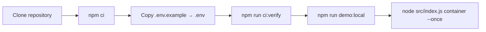
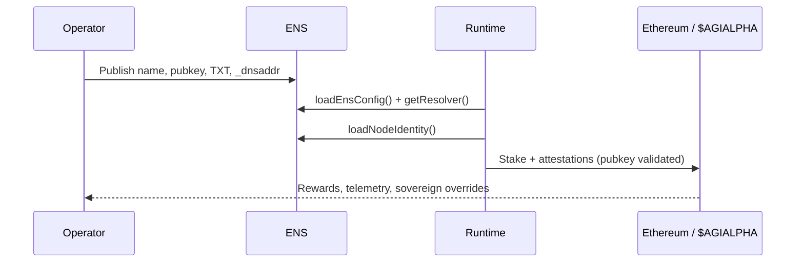
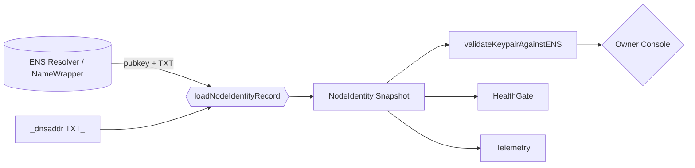
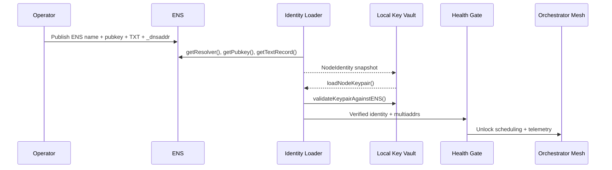
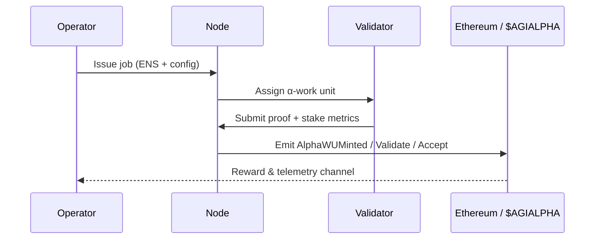
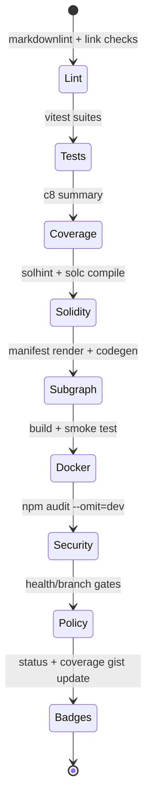

# AGI Alpha Node v0 · Command the Cognitive Armada ⚡

<!-- markdownlint-disable MD013 MD033 -->
<p align="center">
  <picture>
    <source srcset="1.alpha.node.agi.eth.svg" type="image/svg+xml" />
    
  </picture>
</p>

<p align="center">
  <a href="https://github.com/MontrealAI/AGI-Alpha-Node-v0/actions/workflows/ci.yml">
    
  </a>
  <a href=".github/required-checks.json">
    
  </a>
  
  
  
  
  
  <a href="Dockerfile"></a>
  <a href="deploy/helm/agi-alpha-node"></a>
  <a href="https://etherscan.io/address/0xa61a3b3a130a9c20768eebf97e21515a6046a1fa"></a>
  
  <a href="LICENSE"></a>
</p>

> **AGI Alpha Nodes are the catalysts in this new economy.** They cultivate $AGIALPHA yield like digital farmers, translating aspiration into executed α-work and returning proof-anchored liquidity to their owner.
>
> AGI Alpha Node v0 is the superintelligent machine that brokers α-work, notarises proofs, pushes token flows, and retains every override in the owner’s console—autonomous agents, blockchain orchestration, and telemetry fuse into a single control surface.


---

## Table of Contents

1. [Constellation Overview](#constellation-overview)
2. [Quickstart Sequence](#quickstart-sequence)
3. [ENS Control Fabric](#ens-control-fabric)
4. [Node Identity Fabric](#node-identity-fabric)
5. [Identity Boot Sequence](#identity-boot-sequence)
6. [Runtime Systems Map](#runtime-systems-map)
7. [Owner Command Authority](#owner-command-authority)
8. [Observability & Governance](#observability--governance)
9. [CI & Release Ramparts](#ci--release-ramparts)
10. [Deployment Vectors](#deployment-vectors)
11. [Repository Atlas](#repository-atlas)
12. [Reference Library](#reference-library)

---

## Constellation Overview

- **$AGIALPHA treasury engine** — The runtime is hard-wired to the canonical 18-decimal token contract [`0xa61a3b3a130a9c20768eebf97e21515a6046a1fa`](https://etherscan.io/address/0xa61a3b3a130a9c20768eebf97e21515a6046a1fa), powering staking, payouts, and liquidity loops.【F:contracts/AlphaNodeManager.sol†L29-L53】【F:src/constants/token.js†L1-L20】
- **Owner-dominated controls** — The AlphaNodeManager contract exposes pause/resume, emission gates, stake withdrawals, validator rosters, and identity governance entirely under the owner’s address.【F:contracts/AlphaNodeManager.sol†L59-L213】
- **Deterministic orchestration** — Workflows from discovery → execution → validation → settlement are orchestrated in [`src/services/jobLifecycle.js`](src/services/jobLifecycle.js), ensuring each α-work unit is audited and journaled.【F:src/services/jobLifecycle.js†L404-L707】
- **Identity-first runtime** — The container bootstrapper now hydrates ENS metadata, `_dnsaddr` multiaddrs, and the signing key before any diagnostics run by piping through the TypeScript bridge in `src/identity/bootstrap.js`, guaranteeing that the live peerId, pubkey, and libp2p endpoints exactly match the ENS records.【F:src/orchestrator/bootstrap.js†L143-L233】【F:src/identity/bootstrap.js†L1-L84】【F:src/identity/loader.ts†L1-L147】【F:src/identity/dnsaddr.ts†L1-L39】【F:src/identity/keys.ts†L1-L164】
- **Production-ready packaging** — Docker, Helm, CI gates, lint/test/coverage/security chains, and subgraph build tooling ship in-tree so non-technical operators can deploy without touching the internals.【F:Dockerfile†L1-L92】【F:package.json†L1-L64】

---

## Quickstart Sequence



1. **Clone & install dependencies**

   ```bash
   git clone https://github.com/MontrealAI/AGI-Alpha-Node-v0.git
   cd AGI-Alpha-Node-v0
   npm ci
   ```

   Node.js 20.18+ is enforced via the `package.json` engines field for reproducible builds.【F:package.json†L42-L47】

2. **Configure identity & payouts**
   - Duplicate `.env.example`, fill in ENS label/name, payout routes, telemetry, and staking settings.
   - Optional ENS overrides (`ALPHA_NODE_*`) let you pin RPC endpoints, registries, and resolvers when running on bespoke networks.【F:.env.example†L1-L79】【F:.env.example†L81-L86】
   - Supply signing material via `ALPHA_NODE_KEYFILE` (JSON keyfile) or `NODE_PRIVATE_KEY` so local attestations match the ENS-published pubkey before workloads launch.【F:src/identity/keys.ts†L47-L106】

3. **Mirror CI locally**

   ```bash
   npm run ci:verify
   ```

   The command fans out into linting, vitest suites, coverage, Solidity hygiene, subgraph builds, policy gates, and security audits—identical to the GitHub Actions workflow.【F:package.json†L18-L48】【F:.github/workflows/ci.yml†L1-L120】

4. **Launch the orchestrator**

   ```bash
   npm run demo:local       # seeds fixtures and observability loops
   node src/index.js container --once
   ```

   The bootstrapper hydrates ENS, governance, staking, and telemetry state before handing off α-work scheduling.【F:src/orchestrator/bootstrap.js†L225-L590】

---

## ENS Control Fabric



- `src/ens/config.ts` normalises RPC endpoints, registries, resolvers, and NameWrapper defaults for mainnet, Sepolia, or overrides injected via environment variables.【F:src/ens/config.ts†L1-L154】
- `src/ens/client.ts` wraps ethers.js to fetch resolvers, pubkeys, TXT records, contenthash, and NameWrapper fuse/expiry data with consistent error handling.【F:src/ens/client.ts†L1-L155】
- Health gates and governance policies block workloads until ENS state satisfies allowlists and owner directives (`scripts/verify-health-gate.mjs`).【F:scripts/verify-health-gate.mjs†L1-L90】

---

## Node Identity Fabric

| Capability | Implementation | Notes |
| --- | --- | --- |
| Canonical identity snapshot | [`src/identity/loader.ts`](src/identity/loader.ts) | Fetches resolver, pubkey, TXT metadata, `_dnsaddr` multiaddrs, and NameWrapper data into a single `NodeIdentity`.【F:src/identity/loader.ts†L1-L147】 |
| `_dnsaddr` → libp2p | [`src/identity/dnsaddr.ts`](src/identity/dnsaddr.ts) | Sanitises TXT fragments, extracts `dnsaddr=` multiaddrs, deduplicates, and feeds libp2p dialers. 【F:src/identity/dnsaddr.ts†L1-L39】|
| Key management | [`src/identity/keys.ts`](src/identity/keys.ts) | Loads secp256k1 / ed25519 keyfiles, derives pubkeys, and enforces ENS parity via `validateKeypairAgainstENS`.【F:src/identity/keys.ts†L1-L164】 |
| Runtime enforcement | [`src/identity/bootstrap.js`](src/identity/bootstrap.js) + [`src/orchestrator/bootstrap.js`](src/orchestrator/bootstrap.js) | The bootstrapper lazily loads the TypeScript identity modules via `tsx/esm`, hydrates ENS state, validates the keypair, and refuses to continue if anything drifts from the on-chain record.【F:src/identity/bootstrap.js†L1-L84】【F:src/orchestrator/bootstrap.js†L143-L233】 |



The loader fails fast when a resolver is missing, when the ENS pubkey is absent, or when `node.peerId` metadata is undefined—preventing half-hydrated runtimes from emitting attestations.【F:src/identity/loader.ts†L34-L88】【F:src/identity/loader.ts†L100-L134】

`validateKeypairAgainstENS` computes the local secp256k1 public key and compares it with ENS-published coordinates; mismatches throw `NodeKeyValidationError`, ensuring attestations always originate from the declared identity.【F:src/identity/keys.ts†L107-L164】  The bootstrapper surfaces these checks immediately so that failed validations stop the process before governance, staking, or telemetry begins.【F:src/orchestrator/bootstrap.js†L162-L233】

---

## Identity Boot Sequence



1. **Resolver hydrate** — `loadNodeIdentity` normalises the ENS name, resolves the NameWrapper metadata, and assembles the canonical peerId + metadata bundle.【F:src/identity/loader.ts†L34-L147】
2. **Dnsaddr sweep** — `_dnsaddr.${ensName}` TXT records and inline overrides are parsed via `parseDnsaddr`, yielding a deduplicated libp2p multiaddr array for the swarm dialers.【F:src/identity/dnsaddr.ts†L1-L39】【F:src/identity/loader.ts†L89-L134】
3. **Key alignment** — `loadNodeKeypair` ingests keyfiles or `NODE_PRIVATE_KEY`, derives secp256k1 coordinates, and `validateKeypairAgainstENS` enforces parity before any orchestrator code runs.【F:src/identity/keys.ts†L47-L164】【F:src/orchestrator/bootstrap.js†L162-L233】
4. **Health gate signal** — Once ENS + key material match, the bootstrapper primes the health gate, telemetry, and job lifecycle modules so that every subsequent component consumes the verified identity snapshot.【F:src/orchestrator/bootstrap.js†L193-L316】

This sequencing ensures that even offline-first launches keep the owner’s declared ENS record, libp2p presence, and staking address perfectly aligned before the control plane starts emitting α-work.

---

## Runtime Systems Map

| Pillar | Description | Key Sources |
| --- | --- | --- |
| **Orchestration mesh** | Bootstraps jobs, schedules validators, applies governance directives, and journals lifecycle events. | [`src/orchestrator`](src/orchestrator), [`src/services/jobLifecycle.js`](src/services/jobLifecycle.js), [`src/orchestrator/bootstrap.js`](src/orchestrator/bootstrap.js) |
| **Autonomous intelligence** | Local model runners, stress harnesses, swarm orchestrators, and planning loops feed α-work into the pipeline. | [`src/intelligence`](src/intelligence) |
| **Cryptographic assurance** | Deterministic signing, staking, and validator proofs wrap every α-work unit; payout contracts honour shares while the owner retains hard stops. | [`src/crypto`](src/crypto), [`contracts/AlphaNodeManager.sol`](contracts/AlphaNodeManager.sol), [`src/settlement`](src/settlement) |
| **Telemetry & health** | Prometheus metrics, health gates, and monitoring loops keep clusters observable even when offline-first workloads replay. | [`src/telemetry/monitoring.js`](src/telemetry/monitoring.js), [`src/healthcheck.js`](src/healthcheck.js) |
| **Configuration spine** | Defaults, schema coercion, and environment loaders resolve a single immutable config the entire runtime consumes. | [`src/config/defaults.js`](src/config/defaults.js), [`src/config/schema.js`](src/config/schema.js), [`src/config/env.js`](src/config/env.js) |
| **ENS network integration** | `loadEnsConfig` normalises RPC endpoints, registry/resolver wrappers, and NameWrapper presets; `EnsClient` wraps ethers.js for pubkeys, text records, contenthash, and fuse inspection. | [`src/ens/config.ts`](src/ens/config.ts), [`src/ens/client.ts`](src/ens/client.ts) |
| **Identity alignment** | NodeIdentity loader, `_dnsaddr` parser, and ENS-aware key validation deliver a trusted identity surface for libp2p, staking, and attestation pipelines. | [`src/identity`](src/identity) |
| **Docs & governance** | Comprehensive economics, governance, and attestation manuals are included for operators and auditors. | [`docs`](docs) |



---

## Owner Command Authority

The AlphaNodeManager contract gives the owner complete control over the staking treasury, validator roster, and identity ledger.

| Control Surface | Entry Points | Owner Powers |
| --- | --- | --- |
| **Execution kill switch** | `pause()`, `unpause()` | Freeze or resume every staking + orchestration call in a single transaction, ensuring emergency stops propagate instantly.【F:contracts/AlphaNodeManager.sol†L83-L103】 |
| **Validator + identity registry** | `setValidator`, `registerIdentity`, `setIdentityStatus`, `updateIdentityController`, `revokeIdentity` | Assign, rotate, or retire controllers and validator wallets while keeping ENS nodes mapped to the right operators.【F:contracts/AlphaNodeManager.sol†L105-L181】 |
| **Treasury + stake** | `stake`, `withdrawStake`, `applySlash` | Enforce deposits, drain treasury funds to approved recipients, or slash a validator after telemetry or audit triggers.【F:contracts/AlphaNodeManager.sol†L183-L247】 |
| **Alpha Work telemetry** | `recordAlphaWUMint`, `recordAlphaWUValidation`, `recordAlphaWUAcceptance` | Emit authoritative lifecycle events so off-chain agents, subgraphs, and dashboards mirror the owner’s source of truth.【F:contracts/AlphaNodeManager.sol†L200-L247】 |

`CANONICAL_AGIALPHA` binds the runtime to the treasury token, guaranteeing that emitted rewards and slash penalties always reference the canonical 18-decimal asset the ecosystem expects.【F:contracts/AlphaNodeManager.sol†L41-L58】

---

## Observability & Governance

- **Health gates**: The bootstrapper publishes health snapshots and ENS allowlists to halt workloads if telemetry degrades.【F:src/orchestrator/bootstrap.js†L427-L556】【F:scripts/verify-health-gate.mjs†L1-L90】
- **Metrics**: Prometheus counters & histograms export α-work throughput, validator performance, and reward curves for dashboards.【F:src/telemetry/alphaMetrics.js†L1-L200】【F:src/telemetry/monitoring.js†L1-L220】
- **Governance ledger**: Structured event journaling tracks validator status, staking posture, and orchestrator directives for audit trails.【F:src/services/governanceLedger.js†L1-L260】【F:src/services/governanceStatus.js†L1-L120】
- **Offline resilience**: Snapshot + replay primitives guarantee that disconnected nodes can resynchronise once connectivity returns.【F:src/services/offlineSnapshot.js†L1-L210】

---

## CI & Release Ramparts



`npm run ci:verify` executes the full quality gauntlet enforced on every pull request and the `main` branch, matching the GitHub Actions workflow one-to-one.【F:package.json†L18-L48】【F:.github/workflows/ci.yml†L1-L205】

| Stage | Command | Purpose |
| --- | --- | --- |
| Markdown & link lint | `npm run lint` | Style, accessibility, and documentation integrity, including governance docs and manifesto pages.【F:package.json†L18-L24】 |
| Unit & integration tests | `npm run test` | Vitest suite covering orchestration, governance, ENS tooling, identity loaders, and telemetry.【F:package.json†L24-L26】 |
| Coverage | `npm run coverage` | Generates text + LCOV + JSON reports, uploaded as artifacts for historical tracking.【F:package.json†L26-L30】【F:.github/workflows/ci.yml†L83-L149】 |
| Solidity hygiene | `npm run ci:solidity` | Runs `solhint` plus deterministic solc builds for AlphaNodeManager and interfaces.【F:package.json†L30-L34】 |
| Subgraph build | `npm run ci:ts` | Renders the manifest, runs Graph codegen, and compiles the WASM bundle consumed by analytics swarms.【F:package.json†L34-L39】 |
| Security audit | `npm run ci:security` | Enforces high-severity dependency audits on production deps.【F:package.json†L39-L41】 |
| Policy gates | `npm run ci:policy` + `npm run ci:branch` | Health gate enforcement, branch naming rules, and governance guardrails before merge.【F:package.json†L41-L48】【F:.github/workflows/ci.yml†L15-L205】 |

Pull requests must surface the CI badge shown above and satisfy `.github/required-checks.json`, ensuring branch protection keeps the command surface green.【F:.github/required-checks.json†L1-L9】

---

## Deployment Vectors

- **Docker**: A production-grade image is built from the root `Dockerfile`, bundling runtime binaries, ENS tooling, and metrics exporters.【F:Dockerfile†L1-L92】
- **Helm**: `deploy/helm/agi-alpha-node` ships a chart with config maps, secrets, liveness probes, and resource envelopes for Kubernetes clusters.【F:deploy/helm/agi-alpha-node/Chart.yaml†L1-L34】【F:deploy/helm/agi-alpha-node/templates/deployment.yaml†L1-L140】
- **Subgraph**: The `/subgraph` workspace contains the Graph protocol manifest + generated bindings so validators can stream events into analytics stacks.【F:subgraph/subgraph.yaml†L1-L70】【F:subgraph/package.json†L1-L35】

---

## Repository Atlas

| Path | Description |
| --- | --- |
| `src/` | Node runtime, orchestrator, telemetry, staking, ENS wiring, and validation logic. |
| `scripts/` | Operational tooling including ENS inspection, health/branch guards, and Solidity harnesses. |
| `contracts/` | Solidity sources for AlphaNodeManager and shared interfaces. |
| `deploy/` | Helm chart and infra automation. |
| `docs/` | Economics, governance manifesto, and operator handbook. |
| `subgraph/` | Graph protocol workspace for analytics pipelines. |
| `test/` | Vitest coverage over runtime, governance, ENS, and contract surrogates. |

---

## Reference Library

- [Docs index](docs/README.md) — platform overview, operator flows, and governance hooks.
- [Node identity authority](docs/identity.md) — ENS resolution, key alignment, and libp2p topology guides.
- [Economics primer](docs/economics.md) — staking parameters, flywheel modelling, and token incentives.
- [Manifesto](docs/manifesto.md) — guiding principles for distributed cognition and fair governance.
- [Helm chart](deploy/helm/agi-alpha-node) — Kubernetes deployment templates.
- [$AGIALPHA token](https://etherscan.io/address/0xa61a3b3a130a9c20768eebf97e21515a6046a1fa) — canonical treasury asset.
- [CI workflow](.github/workflows/ci.yml) — enforced automated quality gates.

The code, docs, and tooling in this repository form the operational chassis for a machine that tirelessly channels intelligence, liquidity, and governance back to its owner.
