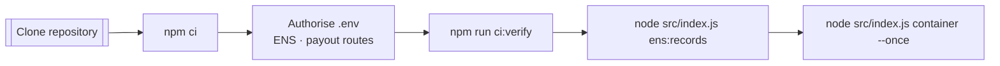
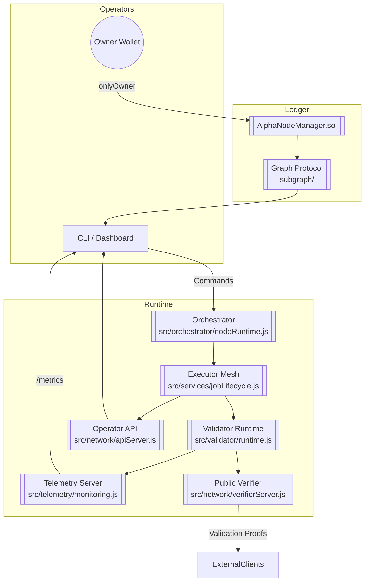
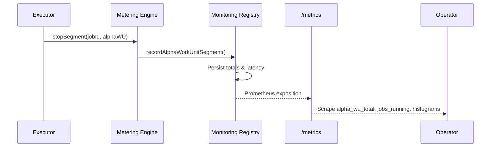
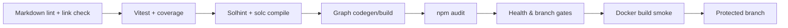

# AGI Alpha Node v0 · Sovereign Cognition Lattice ⚡

<!-- markdownlint-disable MD013 MD033 -->
<p align="center">
  <picture>
    <source srcset="1.alpha.node.agi.eth.svg" type="image/svg+xml" />
    
  </picture>
</p>

<p align="center">
  <a href="https://github.com/MontrealAI/AGI-Alpha-Node-v0/actions/workflows/ci.yml">
    
  </a>
  
  
  
  
  
  <a href="Dockerfile"></a>
  <a href="deploy/helm/agi-alpha-node"></a>
  <a href="https://etherscan.io/address/0xa61a3b3a130a9c20768eebf97e21515a6046a1fa"></a>
  
  <a href="LICENSE"></a>
</p>

> This lattice lets operators marshal autonomous swarms, mint and validate α-work units, and command economic flow with surgical precision. Every subsystem is tuned so that non-technical stewards can deploy and run it while still feeling the velocity of a frontier cognition lab.

---

## Table of Contents

1. [Constellation Overview](#constellation-overview)
2. [Core Subsystems](#core-subsystems)
3. [Launch Sequence](#launch-sequence)
4. [Cognitive Mesh Topology](#cognitive-mesh-topology)
5. [Metrics & Insight Field](#metrics--insight-field)
6. [On-Chain Mastery](#on-chain-mastery)
7. [Interfaces & Automation](#interfaces--automation)
8. [Quality & CI Gauntlet](#quality--ci-gauntlet)
9. [Deployment Vectors](#deployment-vectors)
10. [Repository Atlas](#repository-atlas)
11. [Reference Library](#reference-library)

---

## Constellation Overview

AGI Alpha Node v0 is a sovereign cognition lattice: it routes intelligence workloads, validates outcomes, settles incentives, and exposes deep telemetry under absolute owner control.【F:contracts/AlphaNodeManager.sol†L1-L213】【F:src/services/jobLifecycle.js†L404-L707】

- **Canonical staking anchor** — `$AGIALPHA` (18 decimals) is hard-wired to [`0xa61a3b3a130a9c20768eebf97e21515a6046a1fa`](https://etherscan.io/address/0xa61a3b3a130a9c20768eebf97e21515a6046a1fa) and fuels staking, treasury movements, and telemetry across the estate.【F:contracts/AlphaNodeManager.sol†L29-L53】【F:src/constants/token.js†L1-L20】
- **Deterministic lifecycle engine** — [`src/services/jobLifecycle.js`](src/services/jobLifecycle.js) watches discovery → execution → validation, emitting metrics and governance signals for each α-work unit.【F:src/services/jobLifecycle.js†L404-L707】
- **Persistent observability fabric** — [`src/telemetry/monitoring.js`](src/telemetry/monitoring.js) accumulates counters, gauges, and latency distributions even before `/metrics` is scraped, so telemetry never drops.【F:src/telemetry/monitoring.js†L1-L520】
- **Multi-modal orchestration** — [`src/orchestrator`](src/orchestrator) houses the bootstrapper, monitor loop, runtime, and stake activator so the node can scale horizontally as soon as it comes online.【F:src/orchestrator/bootstrap.js†L1-L520】

---

## Core Subsystems

| Domain | Highlights |
| --- | --- |
| **Intelligence** | Agent runtime, planners, and local model registry coordinate model execution and adaptive learning.【F:src/intelligence/planning.js†L1-L180】【F:src/intelligence/localModels.js†L1-L160】 |
| **Telemetry** | Monitoring registry, α-WU telemetry capture, and Prometheus exporter persist latency, yield, and quality metrics.【F:src/telemetry/monitoring.js†L220-L520】【F:src/telemetry/alphaWuTelemetry.js†L150-L220】 |
| **Validation** | α-WU validator enforces schemas, signatures, and governance prerequisites before responses exit the node.【F:src/validation/alpha_wu_validator.js†L1-L200】 |
| **Governance & Economics** | Governance ledger, reward calculator, and settlement quorum convert telemetry into payouts.【F:src/services/governance.js†L1300-L1705】【F:src/services/rewards.js†L1-L200】 |
| **Access Control** | Solidity contract `AlphaNodeManager` centralises pausing, validator curation, ENS identity, and treasury authority.【F:contracts/AlphaNodeManager.sol†L44-L200】 |

---

## Launch Sequence

Boot a fresh node using the deterministic ritual below. Every step is automation friendly yet legible to non-technical stewards.



1. **Clone & install**

   ```bash
   git clone https://github.com/MontrealAI/AGI-Alpha-Node-v0.git
   cd AGI-Alpha-Node-v0
   npm ci
   ```

   Dependency versions are pinned and the runtime enforces Node.js 20.18+ for reproducible builds.【F:package.json†L1-L64】

2. **Configure identity & payouts** — create `.env` (or export env vars) covering ENS name, payout routes, verifier endpoints, and signing keys. Misconfigurations are rejected by the runtime schema before launch.【F:src/config/schema.js†L260-L360】

   ```bash
   cat <<'ENV' > .env
   NODE_ROLE=mixed
   NODE_LABEL=sovereign-core
   ENS_PARENT_DOMAIN=alpha.node.agi.eth
   NODE_ENS_NAME=core.alpha.node.agi.eth
   OPERATOR_ADDRESS=0x0000000000000000000000000000000000000001
   NODE_PAYOUT_ETH_ADDRESS=0x0000000000000000000000000000000000000001
   NODE_PAYOUT_AGIALPHA_ADDRESS=0x0000000000000000000000000000000000000001
   NODE_PRIMARY_MODEL=orchestrator-hypernet:v1
   VERIFIER_PUBLIC_BASE_URL=https://node.example
   NODE_PRIVATE_KEY=0x........................................................
   VALIDATOR_PRIVATE_KEY=0x........................................................
   ENV
   ```

   `loadConfig()` normalises and validates inputs before any workload is accepted.【F:src/index.js†L675-L706】

3. **Mirror CI locally** — run the same gauntlet the repository enforces on every merge (markdown lint, vitest, coverage, solhint, subgraph build, policy gates).【F:package.json†L18-L48】

   ```bash
   npm run ci:verify
   ```

4. **Publish ENS metadata** — render the ENS text/multicoin payload that must be written before production operation.【F:src/ens/ens_config.js†L1-L188】

   ```bash
   node src/index.js ens:records --pretty
   ```

5. **Launch orchestrator & verifier** — start the container orchestrator, APIs, Prometheus metrics, and verifier endpoints in one motion.【F:src/index.js†L1080-L1230】

   ```bash
   node src/index.js container --once --metrics-port 9464 --api-port 8080
   ```

   Drop `--once` for long-lived operation or add governance flags to steer incentives on-chain.【F:src/index.js†L1116-L1194】

---

## Cognitive Mesh Topology



---

## Metrics & Insight Field

The telemetry layer keeps pace with the workload before the HTTP server even starts. Counters, gauges, and latency summaries accumulate in memory, then rehydrate automatically once `/metrics` is scraped.【F:src/telemetry/monitoring.js†L1-L520】【F:test/monitoring.test.js†L1-L225】



### Metric Catalogue

| Metric | Type | Purpose | Source |
| --- | --- | --- | --- |
| `alpha_wu_total{node_label,device_class,sla_profile}` | Counter | Total α-WUs minted per node/device/SLA; persisted across restarts | `recordAlphaWorkUnitSegment()`【F:src/telemetry/monitoring.js†L97-L170】 |
| `alpha_wu_validated_total` | Counter | Successful α-WU validations | `incrementAlphaWuValidated()`【F:src/telemetry/monitoring.js†L471-L479】 |
| `alpha_wu_invalid_total` | Counter | Rejected or slashed α-WUs | `incrementAlphaWuInvalid()`【F:src/telemetry/monitoring.js†L482-L490】 |
| `jobs_running` | Gauge | Real-time job concurrency | `updateJobsRunning()`【F:src/telemetry/monitoring.js†L430-L439】 |
| `jobs_completed_total` | Counter | Jobs completed successfully | `incrementJobsCompleted()`【F:src/telemetry/monitoring.js†L439-L448】 |
| `jobs_failed_total` | Counter | Jobs failed or cancelled | `incrementJobsFailed()`【F:src/telemetry/monitoring.js†L450-L459】 |
| `job_latency_ms` | Summary | p50/p95/p99 end-to-end job latency | `observeJobLatencyMs()`【F:src/telemetry/monitoring.js†L461-L469】 |
| `alpha_wu_validation_latency_ms` | Summary | Mint → validation latency percentiles | `observeAlphaWuValidationLatencyMs()`【F:src/telemetry/monitoring.js†L492-L500】 |
| `alpha_wu_per_job{job_id}` | Gauge | Optional high-cardinality per-job totals | `recordAlphaWorkUnitSegment()` when `enableAlphaWuPerJob=true`【F:src/telemetry/monitoring.js†L132-L170】 |
| `alpha_wu_epoch{epoch_id}` | Gauge | Aggregated α-WUs per epoch | `updateAlphaWorkUnitEpochMetrics()`【F:src/telemetry/monitoring.js†L172-L220】 |
| `agi_alpha_node_*` | Gauges | Stake, throughput, yield, health, registry posture | `startMonitoringServer()`【F:src/telemetry/monitoring.js†L220-L420】 |

### Scraping `/metrics`

```bash
curl http://127.0.0.1:9464/metrics
```

Prometheus scrape configuration:

```yaml
scrape_configs:
  - job_name: agi-alpha-node
    static_configs:
      - targets: ['127.0.0.1:9464']
```

Latency quantiles (`job_latency_ms`, `alpha_wu_validation_latency_ms`) are emitted as Prometheus summaries with p50/p95/p99 so you can alert on SLO drift immediately.【F:src/telemetry/monitoring.js†L400-L520】

---

## On-Chain Mastery

Owner supremacy is absolute—every critical lever sits behind `onlyOwner` and the control plane is optimised for rapid response.【F:contracts/AlphaNodeManager.sol†L44-L200】

```mermaid
graph TD
  Owner((Owner Wallet)) -->|onlyOwner| Pause[pause() / unpause()]
  Owner --> Validators[setValidator()]
  Owner --> Identity[registerIdentity()<br/>updateIdentityController()]
  Owner --> Stake[withdrawStake()]
  Owner --> Ledger[setIdentityStatus()<br/>revokeIdentity()]
  Validators --> AlphaNodeManager{{AlphaNodeManager}}
  Identity --> AlphaNodeManager
  Stake --> AlphaNodeManager
  Ledger --> AlphaNodeManager
```

- **Identity governance** — rotate ENS controllers, toggle activation, or revoke access instantly, broadcasting events for downstream services.【F:contracts/AlphaNodeManager.sol†L68-L131】
- **Validator command** — flip validators or enforce stake minimums before they can report validations.【F:contracts/AlphaNodeManager.sol†L54-L115】
- **Treasury authority** — move `$AGIALPHA` liquidity or pause the entire network when needed; restarts honour the paused state automatically.【F:contracts/AlphaNodeManager.sol†L96-L157】

---

## Interfaces & Automation

- **Metrics** — `GET /metrics` exposes Prometheus text with every gauge/counter summarised above, replaying historic samples when the server boots.【F:src/telemetry/monitoring.js†L368-L420】【F:test/monitoring.test.js†L120-L225】
- **Public verifier** — [`src/network/verifierServer.js`](src/network/verifierServer.js) offers `GET /verifier/info`, `GET /verifier/health`, and `POST /verifier/validate`, stamping every response with ENS and signature metadata.【F:src/network/verifierServer.js†L1-L200】
- **Operator API** — [`src/network/apiServer.js`](src/network/apiServer.js) streams governance posture, staking, and job telemetry for dashboards or automations.【F:src/network/apiServer.js†L808-L1730】
- **CLI** — [`src/index.js`](src/index.js) orchestrates container lifecycle, ENS tooling, diagnostics, and governance overrides with subcommands that mirror CI scripts.【F:src/index.js†L177-L1230】

---

## Quality & CI Gauntlet

Every pull request must clear the same gauntlet you can run locally with `npm run ci:verify`. Required checks are enforced on `main` via [`required-checks.json`](.github/required-checks.json).【F:package.json†L18-L48】【F:.github/required-checks.json†L1-L9】



| Command | Purpose |
| --- | --- |
| `npm run lint:md` | Markdown lint with formatter to keep docs pristine.【F:package.json†L18-L21】 |
| `npm run lint:links` | Validates README and docs hyperlinks before publish.【F:package.json†L21-L24】 |
| `npm test` | Executes 200+ vitest specs covering orchestration, telemetry, staking, and validation flows.【F:package.json†L24-L25】【F:test/jobLifecycle.metrics.test.js†L1-L200】 |
| `npm run coverage` | Generates c8 coverage artefacts consumed by CI badges.【F:package.json†L25-L30】 |
| `npm run ci:solidity` | Runs solhint lint and deterministic solc build for `AlphaNodeManager.sol`.【F:package.json†L33-L37】 |
| `npm run ci:ts` | Renders the Graph manifest, runs codegen, and builds the subgraph assembly.【F:package.json†L37-L41】 |
| `npm run ci:policy` / `npm run ci:branch` | Enforce ENS allowlist and branch naming policy before merge.【F:package.json†L41-L48】 |

---

## Deployment Vectors

- **Docker** — Build the hardened container using the provided [`Dockerfile`](Dockerfile); the CI smoke test ensures `--help` works in headless environments.【F:Dockerfile†L1-L120】【F:.github/workflows/ci.yml†L135-L185】
- **Helm** — [`deploy/helm/agi-alpha-node`](deploy/helm/agi-alpha-node) bundles readiness probes, metrics scraping, and ServiceMonitor resources for Kubernetes clusters.【F:deploy/helm/agi-alpha-node/Chart.yaml†L1-L40】【F:deploy/helm/agi-alpha-node/templates/deployment.yaml†L60-L140】
- **Scripts & automation** — [`scripts/`](scripts) hosts policy gates, subgraph simulators, and badge publishers for CI/CD pipelines.【F:scripts/verify-health-gate.mjs†L1-L120】【F:scripts/publish-badges.mjs†L1-L200】

---

## Repository Atlas

| Path | Purpose |
| --- | --- |
| `src/` | Runtime logic: orchestration, telemetry, governance, economics, validation, network services.【F:src/index.js†L177-L1230】 |
| `contracts/` | Solidity control plane with `AlphaNodeManager` and access primitives.【F:contracts/AlphaNodeManager.sol†L1-L213】 |
| `deploy/` | Docker entrypoints and Helm charts for production rollout.【F:deploy/docker/entrypoint.sh†L1-L140】 |
| `docs/` | Extended manuals covering ENS metadata, manifesto, and economics.【F:docs/README.md†L1-L200】 |
| `spec/` | Canonical JSON schemas for α-WUs and adjacent payloads.【F:spec/alpha_wu.schema.json†L1-L120】 |
| `subgraph/` | Graph Protocol manifest, schema, and generated types for on-chain observability.【F:subgraph/subgraph.yaml†L1-L160】 |
| `test/` | 200+ vitest specs verifying orchestration, telemetry, governance, and staking flows.【F:test/jobLifecycle.test.js†L1-L340】 |

---

## Reference Library

- [`docs/README.md`](docs/README.md) — extended operations manual.
- [`docs/ens-node-metadata.md`](docs/ens-node-metadata.md) — ENS record templates and publishing guidance.
- [`docs/manifesto.md`](docs/manifesto.md) — design philosophy for sovereign cognition networks.
- [`docs/economics.md`](docs/economics.md) — staking, reward, and token mechanics.
- [`spec/alpha_wu.schema.json`](spec/alpha_wu.schema.json) — canonical α-WU schema.

Operate this node and you steward a network where autonomous agents out-learn markets in real time, forging trillions in value while keeping absolute administrative control.
