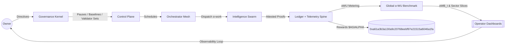
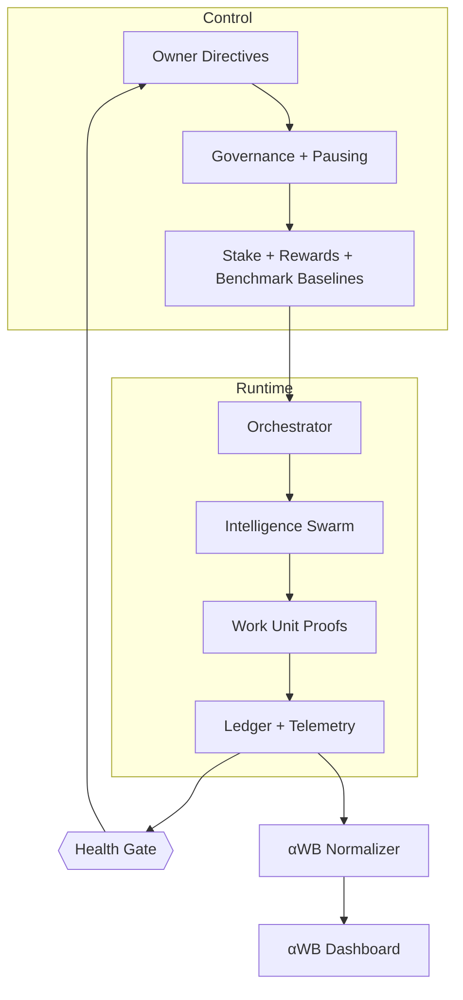
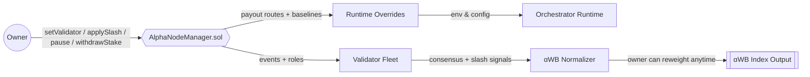
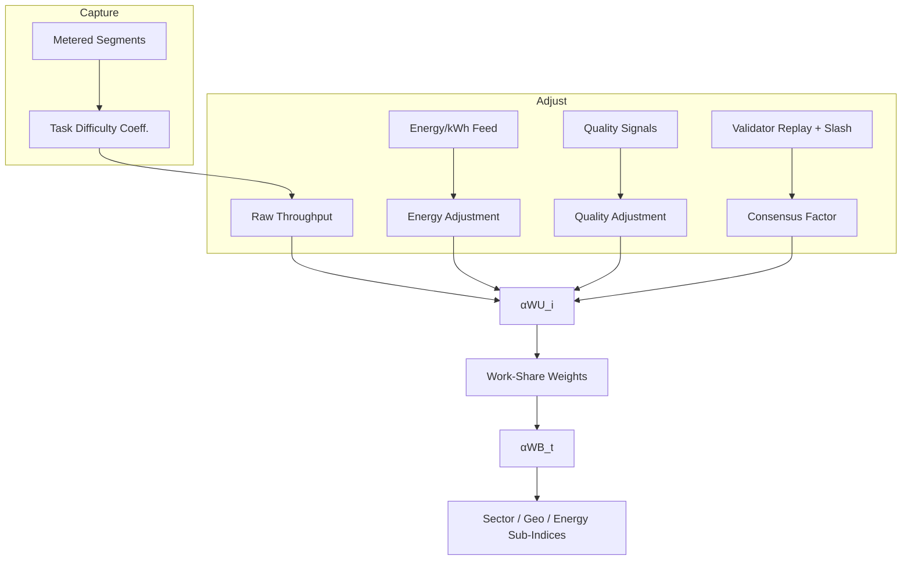
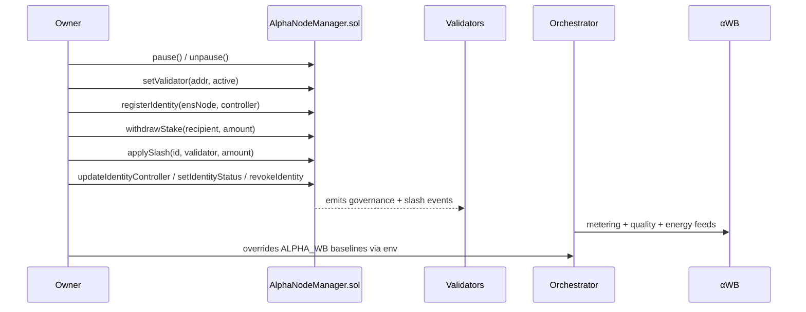
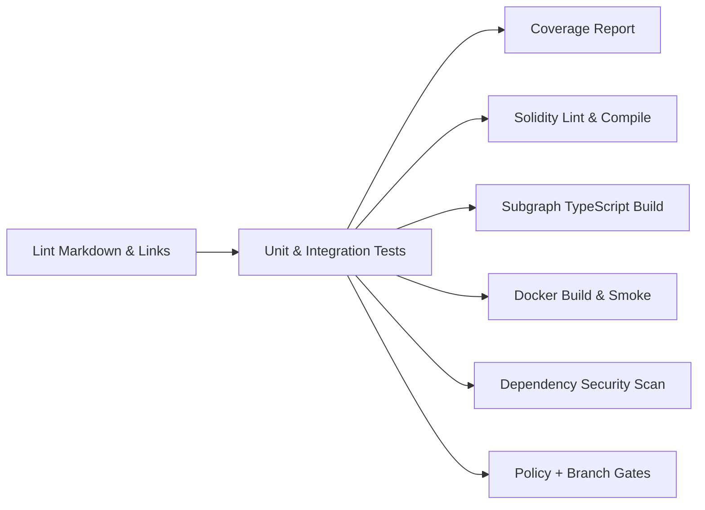

# AGI Alpha Node v0 · Cognitive Yield Engine ⚡

<!-- markdownlint-disable MD013 MD033 -->
<p align="center">
  <picture>
    <source srcset="1.alpha.node.agi.eth.svg" type="image/svg+xml" />
    
  </picture>
</p>

<p align="center">
  <a href="https://github.com/MontrealAI/AGI-Alpha-Node-v0/actions/workflows/ci.yml?query=branch%3Amain">
    
  </a>
  <a href=".github/required-checks.json">
    
  </a>
  
  
  
  <a href="https://etherscan.io/address/0xa61a3b3a130a9c20768eebf97e21515a6046a1fa"></a>
  
  <a href="LICENSE"></a>
  <a href="Dockerfile"></a>
  <a href="deploy/helm/agi-alpha-node"></a>
  <a href="docs/alpha-wb.md"></a>
  <a href="docs/testing.md"></a>
  
</p>

> **AGI Alpha Node v0** is the sovereign cognitive yield engine that turns heterogeneous agentic work into verifiable α‑WU, anchors it to the `$AGIALPHA` treasury, and keeps every lever under the owner’s command—pause, re-weight, rotate validators, rebase benchmark baselines, and reroute rewards without redeploying code. It behaves like a production-grade capital index for autonomous work with fully owner-driven controls.



## Table of Contents

1. [Mission Snapshot](#mission-snapshot)
2. [Treasury & Tokenization](#treasury--tokenization)
3. [Architecture Atlas](#architecture-atlas)
4. [α‑WU Benchmark Blueprint](#alpha-wu-benchmark-blueprint)
5. [Owner Command Surface](#owner-command-surface)
6. [Operations Quickstart](#operations-quickstart)
7. [Benchmark Configuration](#benchmark-configuration)
8. [Telemetry & Observability](#telemetry--observability)
9. [Health & Attestation Mesh](#health--attestation-mesh)
10. [Testing & CI Gates](#testing--ci-gates)
11. [Deployment Vectors](#deployment-vectors)
12. [Repository Atlas](#repository-atlas)
13. [Reference Snippets](#reference-snippets)

---

## Mission Snapshot

- **Canonical treasury binding** — Hardwired to the 18‑decimal `$AGIALPHA` contract [`0xa61a3b3a130a9c20768eebf97e21515a6046a1fa`](https://etherscan.io/address/0xa61a3b3a130a9c20768eebf97e21515a6046a1fa) for staking, rewards, and settlement; every yield motion routes through that anchor.
- **Owner primacy everywhere** — Pausing, validator rosters, identity registration/rotation, stake withdrawals, α‑WB baselines, and governance signaling remain exclusively with the contract owner (`AlphaNodeManager.sol`), granting full ability to update/override at will—including pausing, validator rotation, payout routing, and benchmark recalibration.
- **Deterministic attestations** — Canonical JSON, signed payloads, and independent verification keep liveness and identity integrity provable across validators.
- **Live health plane** — `startHealthChecks` signs latency‑aware attestations, emits OpenTelemetry spans, and exposes canonical payloads for verifiers and dashboards.
- **Production hardening** — Markdown + link linting, Vitest suites, coverage, Solidity lint/compile, subgraph builds, Docker smoke, npm audit, and policy/branch gates are enforced in CI and required on PRs/main.
- **Global productivity gauge** — α‑WU metering feeds the α‑WB benchmark, delivering a live, energy‑aware, quality‑aware “S&P 500 for autonomous work.”

## Treasury & Tokenization

- **Yield asset:** `$AGIALPHA` (18 decimals) at [`0xa61a3b3a130a9c20768eebf97e21515a6046a1fa`](https://etherscan.io/address/0xa61a3b3a130a9c20768eebf97e21515a6046a1fa) anchors staking, validator collateral, rewards, and settlement hooks.
- **Owner control:** The owner can pause/unpause, rotate validators, slash or reward, redirect staking flows, and refresh benchmark parameters without redeploying code.
- **Economic flywheel:** More α‑work → more α‑WU → more `$AGIALPHA` demand/staking → deeper validator security → richer α‑work pipelines.
- **Dynamic modulation:** Owner-level overrides can re-weight constituents, refresh baselines, and pause emissions to keep the treasury in perfect control while running AGI job markets at production pace.

## Architecture Atlas



- **Control Plane** — Owner-owned governance calls flow through `AlphaNodeManager.sol`, adjusting validator sets, identity lifecycles, runtime overrides, and α‑WB baselines in real time.
- **Runtime Orchestration** — `src/orchestrator/bootstrap.js` hydrates identity, stakes, telemetry, health gates, validator runtimes, and orchestrator loops before dispatching α‑work.
- **Telemetry Spine** — OpenTelemetry spans plus Prometheus metrics capture every health beat; console exporters keep local dev frictionless while OTLP endpoints ship spans upstream.
- **Validator Mesh** — Validators are owner-rotated, slashable, and replay workloads deterministically; the consensus factor feeds directly into α‑WB calculations.



<a id="alpha-wu-benchmark-blueprint"></a>

## α‑WU Benchmark Blueprint

The α‑WB benchmark is the production blueprint for a global “S&P 500 of autonomous work,” priced in **α‑WU (alpha Work Units)** and robust to energy, quality, and validator consensus.



1. **Unit of account · α‑WU** — Reference bundle (doc‑writing, code edits, research, data transforms) rebalanced quarterly with drift caps.
2. **Raw throughput** — Meter `tasksCompleted × TaskDifficultyCoefficient` using open rubrics (tokens, steps, tool usage, novelty).
3. **Energy adjustment (EA)** — `EA = cost_baseline / cost_observed`, normalized by regionalized kWh pricing and clamped to avoid energy‑washing.
4. **Quality adjustment (QA)** — Human evals, adversarial/hidden tests, and outcome metrics flow into a winsorized ratio.
5. **Validator consensus (VC)** — Replayable samples, deterministic seeds, and slash triggers for non‑reproducible work.
6. **Per‑constituent yield** — `αWU_i = Raw × EA × QA × VC` with diagnostics for every factor.
7. **Index construction** — Free‑float work share weighting with diversification caps; headline `αWB_t` plus sector/geo/energy slices.
8. **Data pipeline & governance** — Signed telemetry (kWh, hardware profile, tokens, wall‑clock), validator registry, monthly method notes, randomized audits.
9. **Anti‑gaming controls** — Hidden gold tasks, replay audits, cross‑checked energy attestations, latency/cache anomaly detection, multiplier caps, clawbacks.
10. **Rollout path** — v0 spec → 30‑day shadow audits across 5–10 providers → **αWB‑Daily** dashboards → v1.0 lock after 90 days of variance data.

See [`docs/alpha-wb.md`](docs/alpha-wb.md) for the full spec and [`src/services/alphaBenchmark.js`](src/services/alphaBenchmark.js) for the executable calculus.

## Owner Command Surface



- **Complete owner override:** The contract owner can pause/unpause, update validator sets, rotate identity controllers, refresh α‑WB baselines, and redirect rewards without redeploying contracts.
- **Stake & payout routing:** Owner-driven `withdrawStake` and configurable reward paths keep treasury control centralized while validators remain slashable.
- **Runtime levers:** Environment-driven overrides (`ALPHA_WB`, telemetry endpoints, validator manifests) allow rapid adjustment without code changes.

## Operations Quickstart

```bash
npm ci
npm start -- --help
# or spin a local demo swarm
npm run demo:local
```

- **Environment** — Requires Node.js 20.18+ and npm 10+. Core runtime entrypoint: `src/index.js` (CLI `agi-alpha-node`).
- **Docker** — `docker build -t agi-alpha-node:dev .` then `docker run --rm agi-alpha-node:dev --help` for smoke testing.
- **Subgraph tooling** — Render manifests with `node scripts/render-subgraph-manifest.mjs`; simulate indexing via `npm run simulate:subgraph`.
- **Contracts** — Solidity 0.8.26; use `npm run lint:sol` and `npm run test:sol` for lint+compile checks.

## Benchmark Configuration

- **Runtime knobs:** Supply JSON via `ALPHA_WB` environment variable to tune baselines, caps, rebalancing windows, and divisors. Validation lives in `src/config/schema.js`.
- **Energy/quality feeds:** `computeEnergyAdjustment`, `computeQualityAdjustment`, and `computeValidatorConsensus` accept observed telemetry; feeds can be rotated by owner without code edits.
- **Weighting & caps:** `rebalanceConstituentWeights` enforces diversification caps/floors so no single fleet dominates the index; smoothing windows (default 90 days) stabilize work‑share inputs.
- **Reference bundle:** Default α‑WU bundle uses doc-writing, code edits, research, and data transforms; rebalance quarterly with drift limits to mirror live task mix.

## Telemetry & Observability

- **OpenTelemetry** — `src/telemetry/otel.js` exports spans; OTLP endpoint is opt-in via env, console exporter by default.
- **Prometheus metrics** — `src/telemetry/monitoring.js` exposes `/metrics` with α‑WU, validator, and health signals.
- **Canonical proofs** — `src/validation/alpha_wu_validator.js` and `src/services/alphaWorkUnits.js` normalize payloads for downstream verifiers.
- **Dashboards** — α‑WB outputs are ready for dashboards and exchange-grade dissemination; sector/geography slices emerge from the same pipeline.

## Health & Attestation Mesh

- **ENS gating** — `docs/ens-identity-and-node-attestation-v0.0.1-alpha.md` plus `src/identity/loader.ts` enforce ENS alignment, key hydration, and DNSAddr checks.
- **Health gate** — `src/services/healthGate.js` blocks emissions when telemetry, ENS, or stake posture degrade; owner overrides remain available for recovery.
- **Attestation services** — `src/attestation/verify.ts` signs and validates structured payloads; `docs/ens-node-metadata.md` documents the canonical schema.

## Testing & CI Gates



- **One-liner:** `npm run ci:verify` mirrors CI locally (lint, tests, coverage, Solidity checks, subgraph build, npm audit, policy + branch gates).
- **Required checks:** See [`.github/required-checks.json`](.github/required-checks.json) for the enforced gates on PRs/main.
- **Coverage:** `npm run coverage` (c8 + Vitest) exports `coverage/coverage-summary.json`; badge tracks statements (currently 83.7%).
- **Security:** `npm run ci:security` runs `npm audit --omit=dev --audit-level=high` and surfaces dependency risks; enforced in CI.
- **Branch / policy gates:** `npm run ci:policy` validates health/ENS allowlists; `npm run ci:branch` enforces naming and ENS bindings.

## Deployment Vectors

- **Docker & Helm** — Container build defined in [`Dockerfile`](Dockerfile); Helm chart in [`deploy/helm/agi-alpha-node`](deploy/helm/agi-alpha-node).
- **Subgraph** — Generate manifests with `scripts/render-subgraph-manifest.mjs`; deploy via [`subgraph`](subgraph) workspace.
- **Kubernetes** — Use the Helm chart for cluster-grade rollouts; configure OTLP, Prometheus scrape, and `ALPHA_WB` overrides via values files.

## Repository Atlas

- **Contracts:** [`contracts/`](contracts) with `AlphaNodeManager.sol` (owner controls, validator gating, staking hooks) plus access primitives.
- **Runtime:** [`src/`](src) services for orchestration, telemetry, governance, staking, validators, and α‑WB math.
- **Specs & docs:** [`docs/`](docs) with α‑WB, α‑WU, economics, ENS identity, deployment, testing, and operator runbooks.
- **Scripts:** [`scripts/`](scripts) for ENS inspection, manifest rendering, health/branch gates, and solc harnesses.
- **Deploy:** [`deploy/`](deploy) holds Helm and infra manifests; [`subgraph/`](subgraph) contains the Graph stack.

## Reference Snippets

> Compute constituent yield and headline α‑WB index with owner-tunable parameters.

```js
import { computeConstituentAlphaWU, computeAlphaWorkBenchmarkIndex } from './src/services/alphaBenchmark.js';

const constituents = [
  {
    label: 'Fleet-A',
    tasksCompleted: 200,
    taskDifficultyCoefficient: 1.05,
    energyKwhPerAlphaWU: 0.9,
    energyCostPerKwh: 0.1,
    qualityScore: 1.1,
    consensusRate: 0.995
  },
  {
    label: 'Fleet-B',
    tasksCompleted: 140,
    taskDifficultyCoefficient: 0.95,
    energyKwhPerAlphaWU: 1.3,
    energyCostPerKwh: 0.14,
    qualityScore: 0.96,
    consensusRate: 0.93,
    workShare: 0.25
  }
];

const { alphaWB, constituents: weighted } = computeAlphaWorkBenchmarkIndex(constituents);
console.log({ alphaWB, weighted });
```

> Derive throughput straight from metering snapshots.

```js
import { deriveThroughputFromSegments } from './src/services/alphaBenchmark.js';
import { getSegmentsSnapshot } from './src/services/metering.js';

const throughput = deriveThroughputFromSegments(getSegmentsSnapshot());
```

> Adjust α‑WB caps/baselines at runtime (owner-supplied JSON via env):

```bash
export ALPHA_WB='{\
  "baselineEnergyCostPerKwh": 0.12,\
  "baselineEnergyPerAlphaWU": 1.0,\
  "baselineQuality": 1.0,\
  "baselineConsensus": 0.99,\
  "energyAdjustmentFloor": 0.65,\
  "energyAdjustmentCap": 1.25,\
  "qualityAdjustmentFloor": 0.6,\
  "qualityAdjustmentCap": 1.5,\
  "consensusAdjustmentFloor": 0.8,\
  "consensusAdjustmentCap": 1.05,\
  "rebalanceCap": 0.15,\
  "rebalanceFloor": 0.01,\
  "smoothingWindowDays": 90,\
  "baseDivisor": 1000\
}'
```

AGI Alpha Node v0 is engineered for immediate, owner-controlled deployment: sovereign levers, reproducible telemetry, hardened CI, and a live α‑WU benchmark that captures the most valuable autonomous work on the planet.
