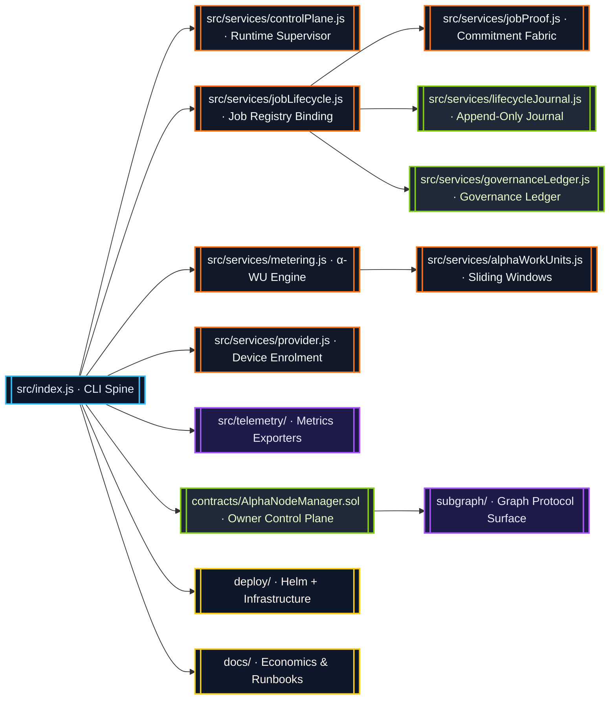
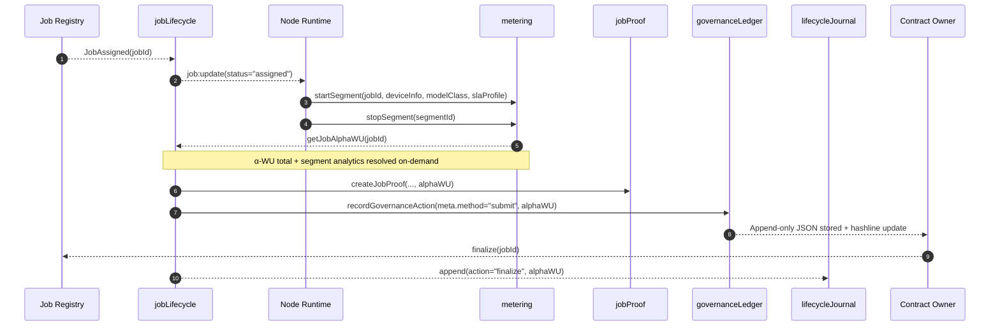
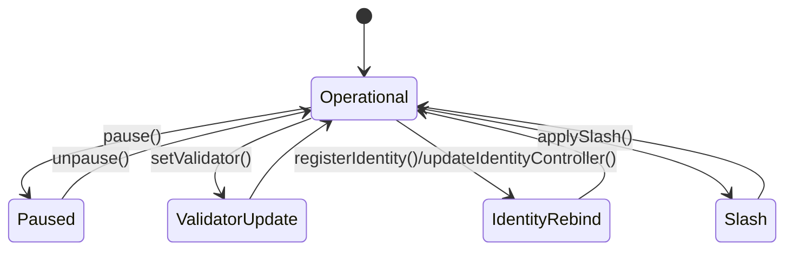

# AGI Alpha Node v0 · Sovereign Cognition Orchestrator ⚡

<!-- markdownlint-disable MD013 MD033 -->
<p align="center">
  <picture>
    <source srcset="1.alpha.node.agi.eth.svg" type="image/svg+xml" />
    
  </picture>
</p>

<p align="center">
  <a href="https://github.com/MontrealAI/AGI-Alpha-Node-v0/actions/workflows/ci.yml">
    
  </a>
  
  
  
  
  <a href="Dockerfile">
    
  </a>
  <a href="deploy/helm/agi-alpha-node">
    
  </a>
  <a href="docs/subgraph-deployment.md">
    
  </a>
  <a href="https://etherscan.io/address/0xa61a3b3a130a9c20768eebf97e21515a6046a1fa">
    
  </a>
  <a href="LICENSE">
    
  </a>
</p>

> AGI Alpha Node v0 is the economic command core that fuses deterministic cognition, metered proof, and owner-directed governance into a single deployment-ready machine—the same machine capable of bending capital dynamics in real time.

---

## Table of Contents

1. [Signal Trajectory](#signal-trajectory)
2. [System Halo](#system-halo)
3. [Execution Spine](#execution-spine)
4. [Alpha-WU Completion Intelligence](#alpha-wu-completion-intelligence)
5. [Lifecycle Journal & Governance Ledger](#lifecycle-journal--governance-ledger)
6. [Owner Command Surface](#owner-command-surface)
7. [Operational Playbook](#operational-playbook)
8. [Continuous Verification](#continuous-verification)
9. [Token Mechanics](#token-mechanics)
10. [Reference Library](#reference-library)

---

## Signal Trajectory

AGI Alpha Node v0 operates as the production-grade cognition lattice for autonomous agent swarms. Every subsystem is tuned so the contract owner can redirect computation, rewards, staking posture, and governance in moments while retaining immaculate observability.

* **Canonical Token:** `$AGIALPHA` (18 decimals) is immutably deployed at [`0xa61a3b3a130a9c20768eebf97e21515a6046a1fa`](https://etherscan.io/address/0xa61a3b3a130a9c20768eebf97e21515a6046a1fa) and finances staking, settlement, and alpha extraction.
* **Owner Totality:** The runtime, smart contracts, and orchestration surfaces expose parameter updates, pausing, validator rotation, ENS rebinding, ledger mutations, reward redirection, and SLA tuning without custodial intermediaries.
* **Completion Telemetry:** α-work units (α-WU) calculate GPU minutes, device quality, and SLA weights. Job completion always resolves `metering.getJobAlphaWU(jobId)` and injects the totals, per-segment slices, and quality breakdowns into the runtime state, job proofs, and governance ledgers.
* **Operator UX:** Docker images, Helm charts, Graph Protocol surfaces, and CI pipelines are tuned for non-technical owners to deploy, verify, and govern instantly.

---

## System Halo



Every arrow is typed, hashed, and journaled—no side-channel updates, no hidden caches. The system weaves deterministic services into a unified control plane so owners exercise direct command.

---

## Execution Spine



Every completion path performs `metering.getJobAlphaWU(jobId)` before the job record, proof payload, journal entry, or governance ledger write is persisted. This hard link keeps α-WU totals and per-segment quality metrics consistent across every subsystem.

---

## Alpha-WU Completion Intelligence

```mermaid
graph TD
  classDef compute fill:#0f172a,stroke:#38bdf8,color:#e0f2fe;
  classDef store fill:#1f2937,stroke:#84cc16,color:#ecfccb;
  classDef attest fill:#1e1b4b,stroke:#a855f7,color:#ede9fe;

  Start[startSegment(jobId, deviceInfo, modelClass, slaProfile)]:::compute --> Cache[(Active Segment Cache)]:::store
  Cache --> Stop[stopSegment(segmentId)]:::compute
  Stop --> Totals[(Job & Epoch Totals)]:::store
  Totals --> Summary[buildJobAlphaSummary(jobId)]:::compute
  Summary --> LifecycleAlpha[[Lifecycle α-WU Attachment]]:::attest
  Summary --> ProofAlpha[[jobProof.alphaWU]]:::attest
  Summary --> LedgerAlpha[[governance.meta.alphaWU]]:::attest
```

Finalized job records, proofs, and governance entries embed the same α-WU snapshot:

```jsonc
{
  "jobId": "0x…",
  "resultHash": "0x…",
  "alphaWU": {
    "total": 42.6,
    "bySegment": [
      {
        "segmentId": "seg-1",
        "modelClass": "LLM_8B",
        "slaProfile": "STANDARD",
        "gpuMinutes": 18.5,
        "qualityMultiplier": 1.3,
        "alphaWU": 24.05
      }
    ],
    "quality": {
      "modelClass": { "LLM_8B": 24.05 },
      "sla": { "STANDARD": 24.05 }
    },
    "modelClassBreakdown": { "LLM_8B": 24.05 },
    "slaBreakdown": { "STANDARD": 24.05 }
  }
}
```

That payload follows jobs through the runtime, verifying that each execution slice, quality multiplier, and SLA weighting is accounted for. The owner always sees the exact α-WU inventory backing staking rewards and policy decisions.

---

## Lifecycle Journal & Governance Ledger

* **Lifecycle Journal (`src/services/lifecycleJournal.js`):** Append-only JSONL log with deterministic hashing. Every action entry stores the normalized job metadata plus α-WU breakdown so forensic checks remain trivial.
* **Governance Ledger (`src/services/governanceLedger.js`):** Ledger writes for submissions, stake movements, and reward receipts automatically decorate `meta.alphaWU` with `{ total, modelClassBreakdown, slaBreakdown, quality, breakdown }` while preserving append-only storage. Hashline continuity ensures tamper detection.
* **Health Gates:** Policy scripts (`scripts/verify-health-gate.mjs`) prevent misconfigured deployments from emitting alpha signals until the environment satisfies owner-defined constraints.

Owners can replay both ledgers to reconstruct every governance and runtime decision with cryptographic fingerprints intact.

---

## Owner Command Surface

`contracts/AlphaNodeManager.sol` grants the contract owner total operational authority. Representative controls include:

| Capability | Function | Description |
| --- | --- | --- |
| Circuit breaker | `pause()` / `unpause()` | Halt or resume staking and α-WU recording instantly. |
| Validator curation | `setValidator(address,bool)` | Activate or retire validators responsible for α-WU validation. |
| Identity graph | `registerIdentity(bytes32,address)`<br/>`updateIdentityController(bytes32,address)`<br/>`setIdentityStatus(bytes32,bool)` | Bind ENS nodes to controllers, rotate operators, and toggle availability on command. |
| Treasury flow | `stake(uint256)` / `withdrawStake(address,uint256)` | Pull or redirect $AGIALPHA as business logic evolves. |
| Accountability | `recordAlphaWUMint(...)`, `recordAlphaWUValidation(...)`, `recordAlphaWUAcceptance(...)`, `applySlash(...)` | Emit auditable α-WU lifecycle events and enforce slashing when validators misbehave. |

These primitives ensure the owner steers the entire jobs platform—parameter updates, pausing, validator rotation, and reward extraction happen within a single transaction.



---

## Operational Playbook

1. **Install dependencies**

   ```bash
   npm ci
   ```

2. **Inspect runtime options**

   ```bash
   npm start -- --help
   ```

3. **Run deterministic health gates and linting**

   ```bash
   npm run lint
   npm run lint:sol
   ```

4. **Execute the full test suite with α-WU coverage**

   ```bash
   npm test
   npm run coverage
   ```

5. **Smoke test the container image**

   ```bash
   docker build --tag agi-alpha-node:local .
   docker run --rm agi-alpha-node:local --help
   ```

6. **Deploy**
   * Docker: use the included `Dockerfile` for production images.
   * Kubernetes: apply the Helm chart at [`deploy/helm/agi-alpha-node`](deploy/helm/agi-alpha-node).

Every command is safe for non-technical owners: copy, paste, and the node responds with intelligible logging and deterministic outcomes.

---

## Continuous Verification

The CI pipeline (`.github/workflows/ci.yml`) enforces eight independent gates on `main` and all pull requests:

| Job | What it verifies |
| --- | --- |
| `lint` | Markdown linting, link validation, health gate, branch policy. |
| `test` | Vitest runtime coverage, including α-WU attachment assertions. |
| `solidity` | Solhint lint + `solc` compilation for `AlphaNodeManager.sol`. |
| `typescript` | Subgraph code generation and build. |
| `coverage` | Produces LCOV, JSON summary, and a coverage badge payload. |
| `docker-smoke` | Builds the Docker image and ensures the CLI help path succeeds. |
| `security` | `npm audit --omit=dev --audit-level=high` keeps dependencies hardened. |
| `badges` | Publishes live status badges for downstream dashboards when `main` succeeds. |

Required checks are enforced in GitHub settings; no pull request can merge without a completely green run. The badges at the top of this README stream the live status of the latest build.

---

## Token Mechanics

* **Symbol:** `$AGIALPHA`
* **Decimals:** 18
* **Contract:** [`0xa61a3b3a130a9c20768eebf97e21515a6046a1fa`](https://etherscan.io/address/0xa61a3b3a130a9c20768eebf97e21515a6046a1fa)
* **Role:** Backing asset for staking, validator slashing, reward routing, and governance commitments.

Completion throughput increases $AGIALPHA demand, which feeds validator staking yields, which attracts more nodes—the positive feedback loop that keeps this network compounding.

---

## Reference Library

* [`src/`](src) — Node.js runtime, lifecycle orchestration, governance ledger, telemetry exporters, CLI entrypoint.
* [`contracts/`](contracts) — Solidity management plane (see `AlphaNodeManager.sol`).
* [`docs/`](docs) — Economics analyses, telemetry guides, staking mechanics, and runbooks.
* [`deploy/`](deploy) — Docker, Helm, and infrastructure automation.
* [`scripts/`](scripts) — CI gates, governance tooling, policy verification.
* [`subgraph/`](subgraph) — Graph Protocol mappings for α-WU emissions and leaderboards.
* [`test/`](test) — Vitest suites covering lifecycle, governance, staking, and metering primitives.

The repository already embodies the machine capable of reshaping global economics—install it, point it at a registry, and the cognition flywheel spins.

---

*For support or collaboration, open an issue or reach out via the repository discussions.*
