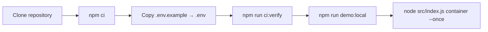
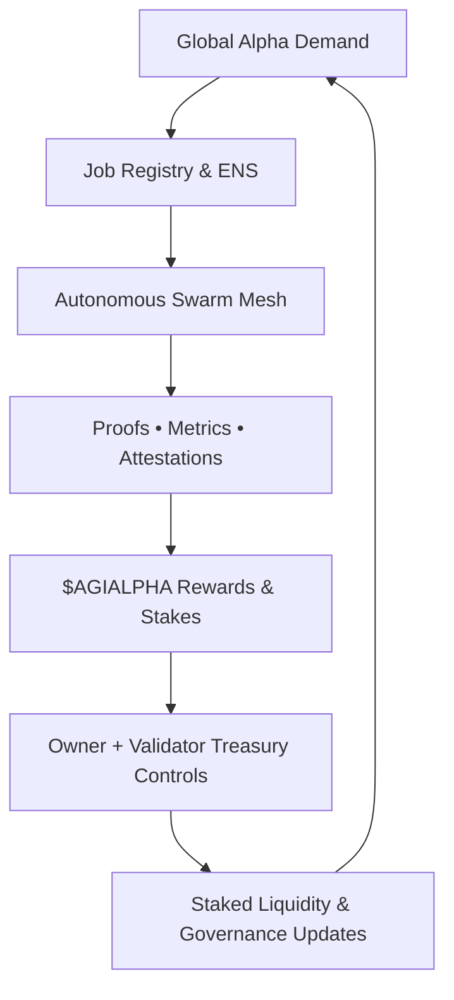
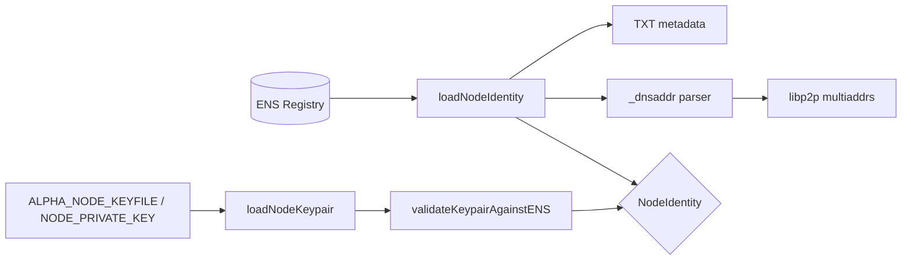
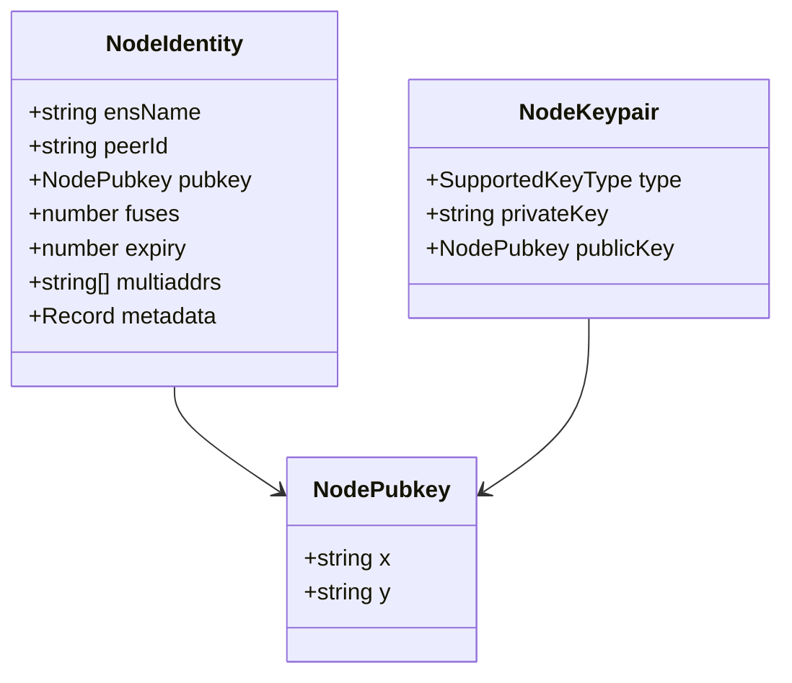
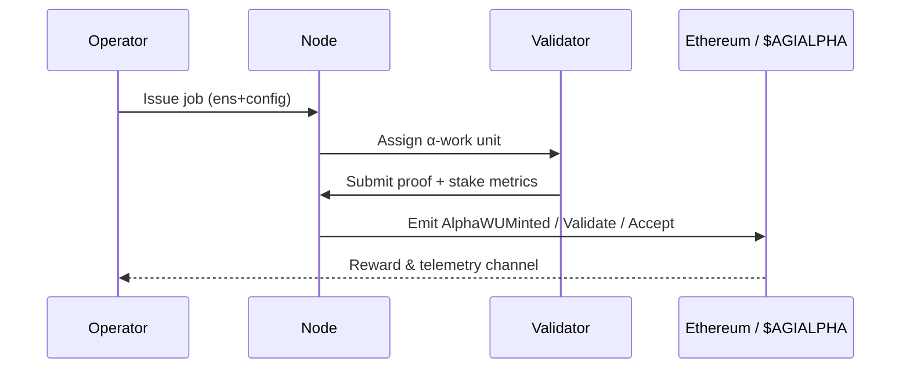

# AGI Alpha Node v0 · Command the Cognitive Armada ⚡

<!-- markdownlint-disable MD013 MD033 -->
<p align="center">
  <picture>
    <source srcset="1.alpha.node.agi.eth.svg" type="image/svg+xml" />
    
  </picture>
</p>

<p align="center">
  <a href="https://github.com/MontrealAI/AGI-Alpha-Node-v0/actions/workflows/ci.yml">
    
  </a>
  <a href=".github/required-checks.json">
    
  </a>
  
  
  
  
  
  <a href="Dockerfile"></a>
  <a href="deploy/helm/agi-alpha-node"></a>
  <a href="https://etherscan.io/address/0xa61a3b3a130a9c20768eebf97e21515a6046a1fa"></a>
  
  <a href="LICENSE"></a>
</p>

> **AGI Alpha Nodes are the catalysts in this new economy.** They cultivate $AGIALPHA yield like digital farmers, translating aspiration into executed α-work and returning proof-anchored liquidity to their owner.
>
> AGI Alpha Node v0 is the superintelligent machine that brokers α-work, notarises proofs, pushes token flows, and retains every override in the owner’s console—autonomous agents, blockchain orchestration, and telemetry fuse into a single control surface.


---

## Table of Contents

1. [Constellation Overview](#constellation-overview)
2. [Quickstart Sequence](#quickstart-sequence)
3. [ENS Control Fabric](#ens-control-fabric)
4. [Node Identity Fabric](#node-identity-fabric)
5. [Runtime Systems Map](#runtime-systems-map)
6. [Owner Command Authority](#owner-command-authority)
7. [Observability & Governance](#observability--governance)
8. [CI & Release Ramparts](#ci--release-ramparts)
9. [Deployment Vectors](#deployment-vectors)
10. [Repository Atlas](#repository-atlas)
11. [Reference Library](#reference-library)

---

## Constellation Overview

- **$AGIALPHA treasury engine** — The runtime is hard-wired to the canonical 18-decimal token contract [`0xa61a3b3a130a9c20768eebf97e21515a6046a1fa`](https://etherscan.io/address/0xa61a3b3a130a9c20768eebf97e21515a6046a1fa), powering staking, payouts, and liquidity loops.【F:contracts/AlphaNodeManager.sol†L29-L53】【F:src/constants/token.js†L1-L20】
- **Owner-dominated controls** — The AlphaNodeManager contract exposes pause/resume, emission gates, stake withdrawals, validator rosters, and identity governance entirely under the owner’s address.【F:contracts/AlphaNodeManager.sol†L59-L213】
- **Deterministic orchestration** — Workflows from discovery → execution → validation → settlement are orchestrated in [`src/services/jobLifecycle.js`](src/services/jobLifecycle.js), ensuring each α-work unit is audited and journaled.【F:src/services/jobLifecycle.js†L404-L707】
- **Identity-first runtime** — ENS metadata, payout routes, telemetry baselines, libp2p multiaddrs, and signing keys are consolidated through `loadNodeIdentity`, `_dnsaddr` parsing, and ENS-aligned key validation so operators inherit a single canonical identity view.【F:src/identity/loader.ts†L1-L147】【F:src/identity/dnsaddr.ts†L1-L39】【F:src/identity/keys.ts†L1-L164】
- **Production-ready packaging** — Docker, Helm, CI gates, lint/test/coverage/security chains, and subgraph build tooling ship in-tree so non-technical operators can deploy without touching the internals.【F:Dockerfile†L1-L92】【F:package.json†L1-L64】

---

## Quickstart Sequence



1. **Clone & install dependencies**

   ```bash
   git clone https://github.com/MontrealAI/AGI-Alpha-Node-v0.git
   cd AGI-Alpha-Node-v0
   npm ci
   ```

   Node.js 20.18+ is enforced via the `package.json` engines field for reproducible builds.【F:package.json†L42-L47】

2. **Configure identity & payouts**
   - Duplicate `.env.example`, fill in ENS label/name, payout routes, telemetry, and staking settings.
   - Optional ENS overrides (`ALPHA_NODE_*`) let you pin RPC endpoints, registries, and resolvers when running on bespoke networks.【F:.env.example†L1-L79】【F:.env.example†L81-L86】
   - Supply signing material via `ALPHA_NODE_KEYFILE` (JSON keyfile) or `NODE_PRIVATE_KEY` so local attestations match the ENS-published pubkey before workloads launch.【F:src/identity/keys.ts†L47-L106】

3. **Mirror CI locally**

   ```bash
   npm run ci:verify
   ```

   This executes markdown lint, link checks, Vitest unit tests, coverage, Solhint, Solidity compilation, subgraph codegen/build, security audit, policy gates, and branch rules.【F:package.json†L18-L48】

4. **Publish ENS metadata**

   ```bash
   node src/index.js ens:records --pretty
   ```

   Outputs deterministic text/coin records derived from the consolidated configuration.【F:src/ens/ens_config.js†L1-L188】

5. **Launch the node**

   ```bash
   node src/index.js container --once --metrics-port 9464 --api-port 8080
   ```

   Drop `--once` for long-lived clusters; combine with governance flags to tune quorum, staking, or telemetry thresholds on the fly.【F:src/index.js†L1116-L1230】

---

## Alpha Yield Flywheel

The runtime runs the $AGIALPHA flywheel end-to-end—jobs in, proofs out, liquidity recycled back to the owner-controlled treasury.



- **Demand → Registry**: Operators encode opportunities into ENS-backed job manifests that the orchestrator consumes automatically.【F:src/services/jobLifecycle.js†L404-L707】【F:docs/identity.md†L1-L180】
- **Registry → Swarm**: `src/orchestrator` distributes α-work to local or remote executors, while `_dnsaddr` records advertise libp2p routes for peers that join mid-flight.【F:src/orchestrator/bootstrap.js†L1-L518】【F:src/identity/loader.ts†L1-L147】
- **Swarm → Proofs**: Validators submit metrics, quorum votes, and cryptographic attestations; failures are journaled for audit replay.【F:test/validatorRuntime.test.js†L1-L120】【F:src/services/governanceLedger.js†L1-L260】
- **Proofs → Rewards**: The AlphaNodeManager contract locks all token operations to the canonical [`0xa61a3b3a130a9c20768eebf97e21515a6046a1fa`](https://etherscan.io/address/0xa61a3b3a130a9c20768eebf97e21515a6046a1fa) address with 18 decimals, ensuring staking math is deterministic.【F:contracts/AlphaNodeManager.sol†L29-L93】【F:src/constants/token.js†L1-L19】
- **Rewards → Treasury**: Owner-exclusive functions can pause, slash, remap validators, or reassign ENS identities mid-flight, so the flywheel always answers to the same console.【F:contracts/AlphaNodeManager.sol†L83-L213】
- **Treasury → Liquidity → Demand**: Stake withdrawals, governance exports, and observability data feed strategy desks or other nodes, bringing more demand (and therefore more rewards) back into the system.【F:src/telemetry/alphaMetrics.js†L1-L200】【F:docs/economics.md†L1-L220】

The loop compounds value: more jobs completed → higher $AGIALPHA demand → increased staking yields → more operators onboarding → denser swarms → even more jobs harvested.

---

## ENS Control Fabric

`src/ens/config.ts` centralises all ENS wiring. Mainnet & Sepolia presets ship with canonical registry, NameWrapper, and PublicResolver addresses. Overrides are provided via:

- `ALPHA_NODE_CHAIN_ID`, `ALPHA_NODE_RPC_URL`
- `ALPHA_NODE_ENS_REGISTRY`, `ALPHA_NODE_NAME_WRAPPER`, `ALPHA_NODE_PUBLIC_RESOLVER`
- Inline overrides supplied when instantiating the client helper.

```ts
import { loadEnsConfig } from './src/ens/config.js';
import { getEnsClient } from './src/ens/client.js';

const config = loadEnsConfig();
const ens = getEnsClient();
const resolver = await ens.getResolver('alpha.agent.agi.eth');
```

### ENS inspection CLI

A dedicated developer CLI probes resolvers, pubkeys, text records, contenthashes, and NameWrapper fuses in one call.

```bash
npm run ens:inspect alpha.agent.agi.eth
```

Sample output:

```text
ENS Inspection → alpha.agent.agi.eth

Network
  Chain ID      : 1
  RPC URL       : https://ethereum.publicnode.com
  ENS Registry  : 0x00000000000c2e074ec69a0dfb2997ba6c7d2e1e
  NameWrapper   : 0xd4416b13d2b3a9abae7acd5d6c2bbdbe25686401
  PublicResolver: 0x231b0ee14048e9dccd1d247744d114a4eb5e8e63

Resolver
  Address       : 0x1234…
  Pubkey (x)    : 0x...
  Pubkey (y)    : 0x...
  Contenthash   : ipfs://...

Text Records
  node.role    : validator
  node.version : v1.1.0
  node.dnsaddr : dnslink=/ipfs/...

NameWrapper
  Owner         : 0xabcd…
  Fuses         : 0
  Expiry (ISO)  : 2026-05-01T00:00:00.000Z
```

Errors are annotated with explicit resolver or network diagnostics, ensuring RPC issues surface immediately.【F:scripts/ens-inspect.ts†L1-L220】

---

## Node Identity Fabric

The identity subsystem fuses ENS resolution, libp2p topology, and signer verification into a single in-memory authority that every runtime component consumes.【F:src/identity/loader.ts†L1-L147】【F:src/identity/dnsaddr.ts†L1-L39】【F:src/identity/keys.ts†L1-L164】

- **`NodeIdentity`** — canonical structure capturing ENS name, peer ID, secp256k1 pubkey, NameWrapper fuses/expiry, multiaddrs, and every TXT record surfaced for downstream modules.【F:src/identity/types.ts†L1-L21】
- **`loadNodeIdentity(ensName)`** — fetches resolver, pubkey, TXT metadata, `_dnsaddr` multiaddrs, and NameWrapper state in one sweep, trimming/validating every field so orchestration code never reimplements ENS plumbing.【F:src/identity/loader.ts†L1-L147】
- **`parseDnsaddr`** — pure utility converting `_dnsaddr` TXT fragments into deduplicated multiaddr arrays, tolerating quotes, whitespace, and duplicate records.【F:src/identity/dnsaddr.ts†L1-L39】
- **`loadNodeKeypair` / `validateKeypairAgainstENS`** — load signing keys from `ALPHA_NODE_KEYFILE` or `NODE_PRIVATE_KEY`, derive secp256k1 coordinates, and abort if the local key drifts from the ENS-published pubkey, guaranteeing attestations originate from the operator-controlled key.【F:src/identity/keys.ts†L1-L164】



### Canonical Identity Schema



### Identity Boot Sequence

1. `loadNodeIdentity` normalises the ENS label, resolves the canonical resolver, hydrates the pubkey, NameWrapper fuses/expiry, and extracts authoritative TXT metadata for downstream services.【F:src/identity/loader.ts†L23-L147】
2. `_dnsaddr` TXT records are parsed through `parseDnsaddr`, yielding a deduplicated multiaddr set for libp2p meshes without leaking malformed entries.【F:src/identity/dnsaddr.ts†L1-L39】
3. `loadNodeKeypair` collects signing material from JSON keyfiles or environment variables, deriving secp256k1 coordinates when necessary to mirror ENS state.【F:src/identity/keys.ts†L47-L118】
4. `validateKeypairAgainstENS` hard-fails any drift between the local keypair and ENS-published pubkey, keeping attestation authority bound to the owner’s controls.【F:src/identity/keys.ts†L120-L164】

```ts
import { loadNodeIdentity } from './src/identity/loader.js';
import { loadNodeKeypair, validateKeypairAgainstENS } from './src/identity/keys.js';

const identity = await loadNodeIdentity('1.alpha.node.agi.eth');
const keypair = loadNodeKeypair();
validateKeypairAgainstENS(identity, keypair);

console.log(identity.multiaddrs);
// [/dns4/node.agi.network/tcp/443/wss/p2p/12D3..., /ip6/2001:db8::1/tcp/443/p2p/12D4...]
```

Vitest suites enforce the behaviour, including ENS fallbacks, `_dnsaddr` parsing, key loading from environment or JSON files, and mismatch handling.【F:test/identity/loader.test.ts†L1-L74】【F:test/identity/dnsaddr.test.ts†L1-L32】【F:test/identity/keys.test.ts†L1-L67】

---

## Runtime Systems Map

| Domain | Highlights | Key Files |
| --- | --- | --- |
| **Intelligence routing** | Bootstrapper, lifecycle engine, validator loop, and orchestrator mesh keep α-work flowing under load. | [`src/orchestrator`](src/orchestrator), [`src/services/jobLifecycle.js`](src/services/jobLifecycle.js), [`src/orchestrator/bootstrap.js`](src/orchestrator/bootstrap.js) |
| **Cryptographic assurance** | Deterministic signing, staking, and validator proofs wrap every α-work unit; payout contracts honour shares while the owner retains hard stops. | [`src/crypto`](src/crypto), [`contracts/AlphaNodeManager.sol`](contracts/AlphaNodeManager.sol), [`src/settlement`](src/settlement) |
| **Telemetry & health** | Prometheus metrics, health gates, and monitoring loops keep clusters observable even when offline-first workloads replay. | [`src/telemetry/monitoring.js`](src/telemetry/monitoring.js), [`src/healthcheck.js`](src/healthcheck.js) |
| **Configuration spine** | Defaults, schema coercion, and environment loaders resolve a single immutable config the entire runtime consumes. | [`src/config/defaults.js`](src/config/defaults.js), [`src/config/schema.js`](src/config/schema.js), [`src/config/env.js`](src/config/env.js) |
| **ENS network integration** | `loadEnsConfig` normalises RPC endpoints, registry/resolver wrappers, and NameWrapper presets for mainnet & Sepolia; `EnsClient` wraps ethers.js for pubkeys, text records, contenthash, and fuse inspection. | [`src/ens/config.ts`](src/ens/config.ts), [`src/ens/client.ts`](src/ens/client.ts) |
| **Identity alignment** | NodeIdentity loader, `_dnsaddr` parser, and ENS-aware key validation deliver a trusted identity surface for libp2p, staking, and attestation pipelines. | [`src/identity`](src/identity)【F:src/identity/loader.ts†L1-L147】【F:src/identity/keys.ts†L1-L164】 |
| **Docs & governance** | Comprehensive economics, governance, and attestation manuals are included for operators and auditors. | [`docs`](docs) |



---

## Owner Command Authority

The AlphaNodeManager contract gives the owner complete control over the staking treasury and validator roster.

- Pause or resume the entire execution pipeline via `pause()` / `unpause()`.【F:contracts/AlphaNodeManager.sol†L83-L103】
- Onboard, revoke, or reassign validators with `setValidator`, `registerIdentity`, `setIdentityStatus`, and `updateIdentityController` while keeping ENS bindings consistent.【F:contracts/AlphaNodeManager.sol†L105-L181】
- Govern staking funds through `stake`, `withdrawStake`, and slash events that can be triggered after validator audits.【F:contracts/AlphaNodeManager.sol†L183-L242】
- Emit authoritative Alpha Work Unit events (`recordAlphaWUMint`, `recordAlphaWUValidation`, `recordAlphaWUAcceptance`, `applySlash`) to reflect lifecycle transitions on-chain.【F:contracts/AlphaNodeManager.sol†L200-L247】

`CANONICAL_AGIALPHA` binds the runtime to the treasury token, guaranteeing that emitted rewards and slash penalties always reference the canonical asset.【F:contracts/AlphaNodeManager.sol†L41-L58】

---

## Observability & Governance

- **Health gates**: The bootstrapper publishes health snapshots and ENS allowlists to halt workloads if telemetry degrades.【F:src/orchestrator/bootstrap.js†L421-L518】【F:scripts/verify-health-gate.mjs†L1-L90】
- **Metrics**: Prometheus counters & histograms export α-work throughput, validator performance, and reward curves for dashboards.【F:src/telemetry/alphaMetrics.js†L1-L200】【F:src/telemetry/monitoring.js†L1-L220】
- **Governance ledger**: Structured event journaling tracks validator status, staking posture, and orchestrator directives for audit trails.【F:src/services/governanceLedger.js†L1-L260】【F:src/services/governanceStatus.js†L1-L120】
- **Offline resilience**: Snapshot + replay primitives guarantee that disconnected nodes can resynchronise once connectivity returns.【F:src/services/offlineSnapshot.js†L1-L210】

---

## CI & Release Ramparts

`npm run ci:verify` executes the full quality gauntlet enforced on every pull request and the `main` branch.【F:package.json†L18-L48】

| Stage | Command | Purpose |
| --- | --- | --- |
| Markdown & link lint | `npm run lint` | Style, accessibility, and documentation integrity. |
| Unit & integration tests | `npm run test` | Vitest suite covering orchestration, governance, and ENS tooling. |
| Coverage | `npm run coverage` | Generates text + LCOV + JSON summaries for pipelines. |
| Solidity hygiene | `npm run ci:solidity` | Runs `solhint` and deterministic solc compilation for contracts. |
| Subgraph build | `npm run ci:ts` | Renders the manifest, runs Graph codegen, and compiles the WASM bundle. |
| Security audit | `npm run ci:security` | High severity `npm audit` pass on production dependencies. |
| Policy gates | `npm run ci:policy` | Verifies health allowlists & governance guardrails. |
| Branch guard | `npm run ci:branch` | Ensures PRs adhere to branch naming & review policy. |

Pull requests must surface the CI badge shown above and satisfy `.github/required-checks.json` so gating is enforced before merge.【F:.github/required-checks.json†L1-L22】

---

## Deployment Vectors

- **Docker**: A production-grade image is built from the root `Dockerfile`, bundling runtime binaries, ENS tooling, and metrics exporters.【F:Dockerfile†L1-L92】
- **Helm**: `deploy/helm/agi-alpha-node` ships a chart with config maps, secrets, liveness probes, and resource envelopes for Kubernetes clusters.【F:deploy/helm/agi-alpha-node/Chart.yaml†L1-L34】【F:deploy/helm/agi-alpha-node/templates/deployment.yaml†L1-L140】
- **Subgraph**: The `/subgraph` workspace contains the Graph protocol manifest + generated bindings so validators can stream events into analytics stacks.【F:subgraph/subgraph.yaml†L1-L70】【F:subgraph/package.json†L1-L35】

---

## Repository Atlas

| Path | Description |
| --- | --- |
| `src/` | Node runtime, orchestrator, telemetry, staking, ENS wiring, and validation logic. |
| `scripts/` | Operational tooling including ENS inspection, health/branch guards, and Solidity harnesses. |
| `contracts/` | Solidity sources for AlphaNodeManager and shared interfaces. |
| `deploy/` | Helm chart and infra automation. |
| `docs/` | Economics, governance manifesto, and operator handbook. |
| `subgraph/` | Graph protocol workspace for analytics pipelines. |
| `test/` | Vitest coverage over runtime, governance, ENS, and contract surrogates. |

---

## Reference Library

- [Docs index](docs/README.md) — platform overview, operator flows, and governance hooks.
- [Node identity authority](docs/identity.md) — ENS resolution, key alignment, and libp2p topology guides.
- [Economics primer](docs/economics.md) — staking parameters, flywheel modelling, and token incentives.
- [Manifesto](docs/manifesto.md) — guiding principles for distributed cognition and fair governance.
- [Helm chart](deploy/helm/agi-alpha-node) — Kubernetes deployment templates.
- [$AGIALPHA token](https://etherscan.io/address/0xa61a3b3a130a9c20768eebf97e21515a6046a1fa) — canonical treasury asset.
- [CI workflow](.github/workflows/ci.yml) — enforced automated quality gates.

The code, docs, and tooling in this repository form the operational chassis for a machine that tirelessly channels intelligence, liquidity, and governance back to its owner.
