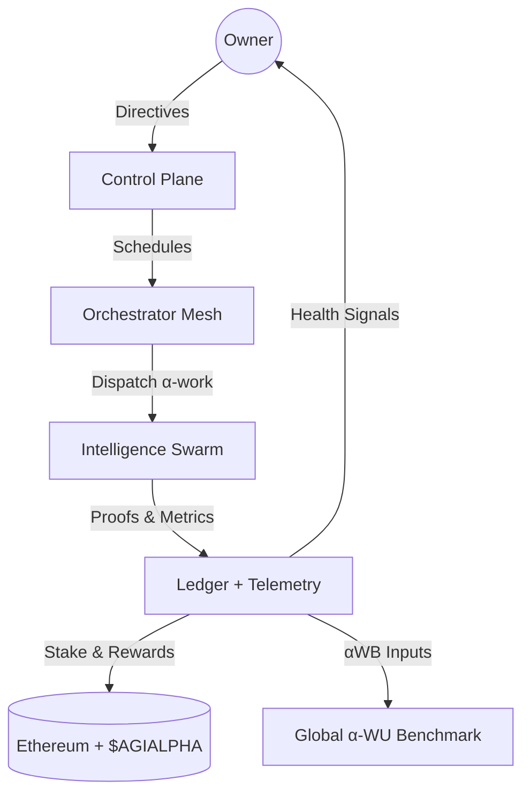
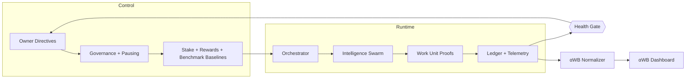
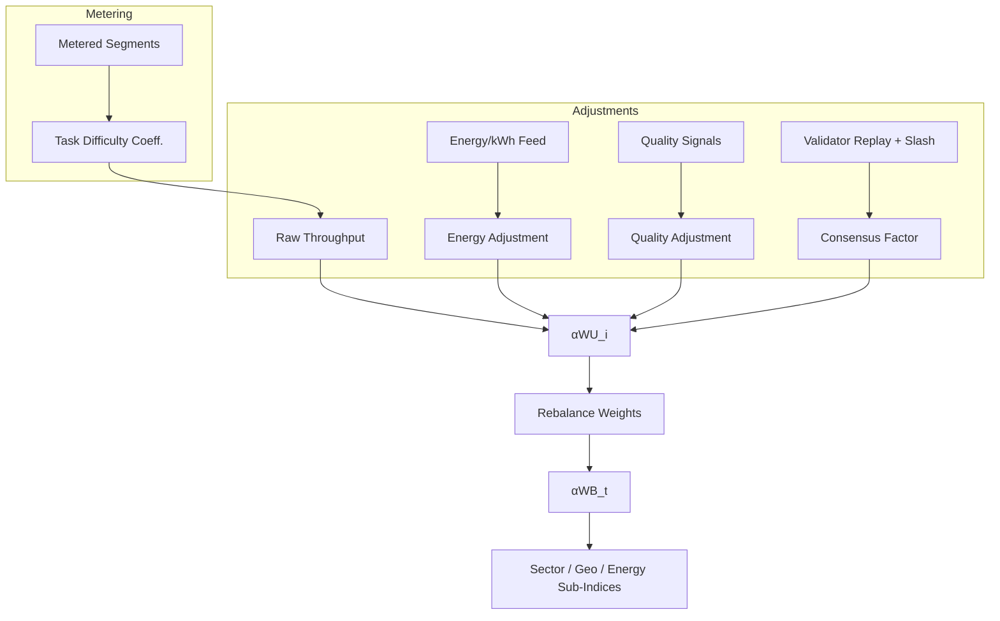
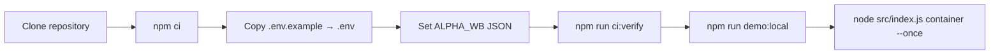

# AGI Alpha Node v0 · Cognitive Yield Engine ⚡

<!-- markdownlint-disable MD013 MD033 -->
<p align="center">
  <picture>
    <source srcset="1.alpha.node.agi.eth.svg" type="image/svg+xml" />
    
  </picture>
</p>

<p align="center">
  <a href="https://github.com/MontrealAI/AGI-Alpha-Node-v0/actions/workflows/ci.yml?query=branch%3Amain">
    
  </a>
  <a href=".github/required-checks.json">
    
  </a>
  
  
  
  
  
  <a href="https://etherscan.io/address/0xa61a3b3a130a9c20768eebf97e21515a6046a1fa"></a>
  
  <a href="Dockerfile"></a>
  <a href="deploy/helm/agi-alpha-node"></a>
  <a href="LICENSE"></a>
  <a href="docs/alpha-wb.md"></a>
</p>

> **AGI Alpha Node v0** concentrates a sovereign cognitive core into verifiable on‑chain proof, compounding `$AGIALPHA` while the owner retains uncompromised command. Every pulse is attestable, deterministic, and observable—deployable by a non‑technical operator yet tuned for market‑moving autonomy.



## Table of Contents

1. [Mission Snapshot](#mission-snapshot)
2. [Architecture Pulse](#architecture-pulse)
3. [Alpha-WB Benchmark](#alpha-wb-benchmark)
4. [Owner Command Surface](#owner-command-surface)
5. [Quickstart](#quickstart)
6. [Telemetry Surface](#telemetry-surface)
7. [Health Attestation Mesh](#health-attestation-mesh)
8. [Testing & CI Gates](#testing--ci-gates)
9. [Deployment Vectors](#deployment-vectors)
10. [Repository Atlas](#repository-atlas)
11. [Reference Snippets](#reference-snippets)

---

## Mission Snapshot

- **Canonical treasury binding** — Hardwired to the 18‑decimal `$AGIALPHA` contract [`0xa61a3b3a130a9c20768eebf97e21515a6046a1fa`](https://etherscan.io/address/0xa61a3b3a130a9c20768eebf97e21515a6046a1fa) for staking, rewards, and settlement.
- **Owner-dominated controls** — Pausing, validator rosters, identity registration/rotation, stake withdrawals, benchmark baselines, and governance signaling remain exclusively with the contract owner (`AlphaNodeManager.sol`).
- **Deterministic attestations** — Canonical JSON, signed payloads, and independent verification keep liveness and identity integrity provable.
- **Live health plane** — `startHealthChecks` signs latency-aware attestations, emits OpenTelemetry spans, and exposes canonical payloads for verifiers and dashboards.
- **Production-hardening** — Markdown + link linting, Vitest suites, coverage, Solidity lint/compile, subgraph builds, Docker smoke, npm audit, and policy/branch gates are enforced in CI and required on PRs/main.
- **Global productivity gauge** — α‑WU metering feeds the α‑WB benchmark, delivering a live, energy‑aware, quality‑aware “S&P 500 for autonomous work.”

---

## Architecture Pulse



- **Control Plane** — Owner-owned governance calls flow through `AlphaNodeManager.sol`, adjusting validator sets, identity lifecycles, runtime overrides, and α‑WB baselines in real time.
- **Runtime Orchestration** — `src/orchestrator/bootstrap.js` hydrates identity, stakes, telemetry, health gates, validator runtimes, and orchestrator loops before dispatching α‑work.
- **Telemetry Spine** — OpenTelemetry spans plus Prometheus metrics capture every health beat; console exporters keep local dev frictionless while OTLP endpoints ship spans upstream.

---

## Alpha-WB Benchmark

The α‑WB benchmark is a production-grade, anti-gaming index that prices autonomous work in α‑WU while adjusting for energy, quality, and validator consensus. Code lives in [`src/services/alphaBenchmark.js`](src/services/alphaBenchmark.js) with operator controls parsed via `ALPHA_WB` in [`src/config/schema.js`](src/config/schema.js). Read the full blueprint in [`docs/alpha-wb.md`](docs/alpha-wb.md).



- **Unit of account (α‑WU):** 1 α‑WU equals a reference bundle of doc-writing, code edits, research lookups, and data transforms at baseline difficulty/quality. Bundles rebalance quarterly to mirror live task mix without overfitting.
- **Raw throughput:** Tasks completed × Task Difficulty Coefficient derived from open rubrics (tokens, steps, novelty, tool calls).
- **Energy adjustment (EA):** `EA = cost_baseline / cost_observed`, capped/floored against energy‑washing.
- **Quality adjustment (QA):** Human evals, adversarial suites, outcome metrics, and hallucination/error tracking feed a winsorized quality ratio.
- **Validator consensus (VC):** Independent replays + slash rules reward reproducibility; penalties reduce the consensus factor.
- **Index math:** `αWU_i = Raw × EA × QA × VC`; headline `αWB_t = Σ(weight_i × αWU_i) / Base_Divisor` with diversification caps/floors and sector/geo/energy sub‑indices ready for dashboards.

MVP rollout: publish the v0 spec and rubrics, onboard 5–10 diverse providers for 30‑day shadow audits, release αWB‑Daily plus sector sub‑indices, then lock v1.0 after 90 days of live variance data.

---

## Owner Command Surface

- **Pausable runtime:** `pause` / `unpause` keep the entire node authority under the owner’s hand (`AlphaNodeManager.sol`).
- **Validator governance:** `setValidator`, `applySlash`, and validator-only acceptance ensure consensus integrity with reproducibility penalties.
- **Identity lifecycle:** `registerIdentity`, `updateIdentityController`, `setIdentityStatus`, and `revokeIdentity` grant the owner final say on ENS-linked controllers.
- **Staking flow:** Owner-controlled `withdrawStake` alongside validator deposits keeps treasury safety intact while preserving emergency drains.
- **Benchmark baselines:** Adjust α‑WB baselines and caps through `ALPHA_WB` without code edits; runtime picks up env changes at boot.

---

## Quickstart



1. **Clone & install**

   ```bash
   git clone https://github.com/MontrealAI/AGI-Alpha-Node-v0.git
   cd AGI-Alpha-Node-v0
   npm ci
   ```

   Node.js **20.18+** is enforced for deterministic builds.

2. **Configure identity, telemetry, payouts, and α‑WB**

   - Copy `.env.example` → `.env` and fill ENS label/name, payout targets, telemetry exporters, OTLP endpoint (if any), staking thresholds, RPC endpoints, and `ALPHA_WB` JSON for benchmark baselines.
   - Provide signing material through `ALPHA_NODE_KEYFILE` (JSON keyfile) or `NODE_PRIVATE_KEY` so live attestations match your ENS-published pubkey.
   - Verify ENS alignment before launching:

     ```bash
     npm run ens:inspect -- --name <your-node>.eth
     node -e "import { loadNodeIdentity } from './src/identity/loader.js'; (async()=>console.log(await loadNodeIdentity('<your-node>.eth')))();"
     ```

3. **Mirror CI locally**

   ```bash
   npm run ci:verify
   ```

   Executes linting, tests, coverage, Solidity hygiene, subgraph build, npm audit (high), policy, and branch gates.

4. **Launch the orchestrator**

   ```bash
   npm run demo:local       # seeds fixtures and observability loops
   node src/index.js container --once
   ```

   Bootstrap hydrates ENS, governance, staking posture, telemetry, and the health gate before dispatching α-work.

5. **Lock in CI parity**

   - Run `npm run ci:verify` before every PR to mirror the enforced gate set.
   - Required checks are enforced on `main` and PRs via branch protections and [`.github/required-checks.json`](.github/required-checks.json).

---

## Telemetry Surface

- **OpenTelemetry traces:** Default console exporter; set OTLP HTTP endpoint via env to emit production traces.
- **Prometheus metrics:** Native metrics endpoint captures health gate results and orchestration pulse.
- **Structured logs:** `pino` emits structured JSON for ingestion pipelines.

---

## Health Attestation Mesh

- **Health gate policy:** `HEALTH_GATE_ALLOWLIST` and `HEALTH_GATE_EXPECTED_ENS` guard payload issuers; enforced by `scripts/verify-health-gate.mjs`.
- **Attestation signer:** `loadNodeIdentity` ensures signatures align with ENS controller; mismatches abort the launch.
- **Replay defense:** Timestamped payloads and validator cross-checks protect against stale attestations.

---

## Testing & CI Gates

All required checks are public, enforced on PRs, and mirrored locally via `npm run ci:verify`:

- Markdown + link lint (`Lint Markdown & Links`).
- Vitest suite + coverage (`Unit & Integration Tests`, `Coverage Report`).
- Solidity lint/compile (`Solidity Lint & Compile`).
- Subgraph TypeScript build (`Subgraph TypeScript Build`).
- Docker build + smoke CLI (`Docker Build & Smoke Test`).
- Dependency audit (`Dependency Security Scan`).
- Policy + branch gate enforcement (`Verify health gate policy`, `verify-branch-gate`).

---

## Deployment Vectors

- **Docker:** `docker build --tag agi-alpha-node:latest .` then run with `NODE_LABEL`, `OPERATOR_ADDRESS`, `RPC_URL`, and signer env set.
- **Helm:** [`deploy/helm/agi-alpha-node`](deploy/helm/agi-alpha-node) bundles a chart with image, service, and config values.
- **Subgraph:** `npm run simulate:subgraph` exercises manifest rendering and build in CI parity mode.

---

## Repository Atlas

- [`contracts/`](contracts) — Solidity core with owner-dominated controls and staking/validator plumbing.
- [`src/`](src) — Runtime orchestrator, telemetry, identity loader, benchmark engine, and config schema.
- [`docs/`](docs) — α‑WB blueprint, economics, identity notes, and manifesto.
- [`deploy/`](deploy) — Helm charts and deployment aides.
- [`scripts/`](scripts) — CI helpers, ENS inspection, subgraph rendering, and local demos.
- [`test/`](test) — Vitest suites for work unit calculus and benchmark math.

---

## Reference Snippets

### Compute α‑WB for two fleets

```js
import { computeAlphaWorkBenchmarkIndex } from './src/services/alphaBenchmark.js';

const { alphaWB, constituents } = computeAlphaWorkBenchmarkIndex([
  {
    label: 'Fleet-A',
    tasksCompleted: 200,
    taskDifficultyCoefficient: 1.05,
    energyKwhPerAlphaWU: 0.9,
    energyCostPerKwh: 0.1,
    qualityScore: 1.1,
    consensusRate: 0.995
  },
  {
    label: 'Fleet-B',
    tasksCompleted: 140,
    taskDifficultyCoefficient: 0.95,
    energyKwhPerAlphaWU: 1.3,
    energyCostPerKwh: 0.14,
    qualityScore: 0.96,
    consensusRate: 0.93,
    workShare: 0.25
  }
]);
```

### Metering → throughput

```js
import { deriveThroughputFromSegments } from './src/services/alphaBenchmark.js';
import { getSegmentsSnapshot } from './src/services/metering.js';

const throughput = deriveThroughputFromSegments(getSegmentsSnapshot());
```

The AGI Alpha Node is engineered to operate as the definitive, owner-steerable cognitive engine described above—ready for production deployment, live benchmarking, and high-stakes operations.
