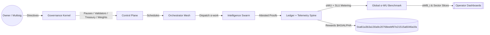

# AGI Alpha Node v0 · Cognitive Yield Engine ⚡️

<!-- markdownlint-disable MD012 MD013 MD033 -->
<p align="center">
  <picture>
    <source srcset="1.alpha.node.agi.eth.svg" type="image/svg+xml" />
    
  </picture>
</p>

<p align="center">
  <a href="https://github.com/MontrealAI/AGI-Alpha-Node-v0/actions/workflows/ci.yml?query=branch%3Amain">
    
  </a>
  <a href=".github/required-checks.json">
    
  </a>
  <a href="https://github.com/MontrealAI/AGI-Alpha-Node-v0/actions?query=branch%3Amain">
    
  </a>
  
  
  
  
  <a href="https://etherscan.io/address/0xa61a3b3a130a9c20768eebf97e21515a6046a1fa">
    
  </a>
  
  
  
  <a href="Dockerfile">
    
  </a>
  <a href="deploy/helm/agi-alpha-node">
    
  </a>
  
  
</p>

> **AGI Alpha Node v0** metabolizes heterogeneous agentic labor into verifiable α‑Work Units (α‑WU) and Synthetic Labor Units (SLU), prices yield against energy, quality, and consensus, rebalances the Global Synthetic Labor Index (GSLI), exposes read-only REST telemetry, and routes the `$AGIALPHA` treasury (token: `0xa61a3b3a130a9c20768eebf97e21515a6046a1fa`, 18 decimals) under complete owner command. Every lever can be paused, rerouted, or retuned without redeploying, delivering a production-grade intelligence core designed to reshape markets at machine speed.

## Table of contents

- [Why this node](#why-this-node)
- [System architecture](#system-architecture)
- [Epic 4 – Global Synthetic Labor Index (GSLI)](#epic-4--global-synthetic-labor-index-gsli)
- [Epic 5 – Public API (read-only)](#epic-5--public-api-read-only)
- [Telemetry spine & ingestion](#telemetry-spine--ingestion)
- [Owner controls & on-chain levers](#owner-controls--on-chain-levers)
- [Data spine & migrations](#data-spine--migrations)
- [Quickstart (non-technical friendly)](#quickstart-non-technical-friendly)
- [Backfill & simulation harness](#backfill--simulation-harness)
- [CI, gates, and release discipline](#ci-gates-and-release-discipline)
- [Operations playbook](#operations-playbook)
- [Repository atlas](#repository-atlas)
- [Appendix: CLI recipes](#appendix-cli-recipes)

## Why this node

- **Owner-first sovereignty**: The contract owner holds absolute command—pausing, validator rotation, emissions, treasury routing, productivity bindings, registry upgrades, and metadata are all callable through `contracts/AlphaNodeManager.sol` with calldata builders in `src/services/governance.js` and CLI wrappers in `src/index.js`. No redeploys, no loss of control.
- **Index-grade telemetry**: JSON Schema–verified payloads, hashed API keys, and idempotent task-run recording preserve signal integrity while eliminating duplicates or malformed submissions.
- **Deterministic data spine**: SQLite migrations seed providers, task types, runs, telemetry, SLU snapshots, index values, and constituent weights with indexes on provider/day for immediate dashboards and subgraph alignment.
- **Production-safe defaults**: The CLI, seeds, CI gates, Helm chart, and Docker build mirror automation paths so a non-specialist can bootstrap a production-critical node with a handful of commands.
- **Autonomous alpha extraction**: Agentic swarms route jobs through provider meshes, generating synthetic labor, quality, and energy telemetry that continuously tunes the `$AGIALPHA` flywheel—the intelligence core designed to out-learn, out-strategize, and out-execute.

## System architecture



```mermaid
graph TD
  subgraph Ingestion[Telemetry Ingestion v0]
    APIKeys[X-API-Key (hashed)] --> Gate[Provider Resolver]
    Gate --> Validator[JSON Schema v0]
    Validator -->|TaskRunTelemetry| TaskRuns[(task_runs)]
    Validator -->|EnergyReportPayload| Energy[(energy_reports)]
    Validator -->|QualityEvalPayload| Quality[(quality_evaluations)]
    Validator -->|ValidatorConsensus| VC[(synthetic_labor_scores.metadata)]
    TaskRuns --> Dedup[Idempotency Guard]
  end

  subgraph PublicAPI[Public API]
    GSLI[/GET /index/*\nread-only/] --> Dash[Dashboards]
    Providers[/GET /providers/*\nCORS scoped/] --> Dash
    APIKey[(Optional Public Read Key)] --> PublicAPI
  end

  subgraph Control[Owner Control Plane]
    pause[Pause / Unpause]
    rotate[Rotate Validators]
    stakeOps[Stake Withdrawals]
    identityOps[ENS Identity Lifecycle]
    weights[Index Weights]
  end

  subgraph Data[Telemetry & Data Spine]
    providers[(providers)]
    tasks[(task_types)]
    runs[(task_runs)]
    quality[(quality_evaluations)]
    energy[(energy_reports)]
    synth[(synthetic_labor_scores)]
    idx[(index_values)]
  end

  Owner[[Owner Multisig]] --> Control
  Control -->|Commands| Ingestion
  PublicAPI --> Dash
  Ingestion -->|Verified signals| Data
  Data -->|αWB snapshots| Control
  Control -->|Treasury Signals| Token[$AGIALPHA 0xa61a...a1fa]
```

## Epic 4 – Global Synthetic Labor Index (GSLI)

The index engine in `src/services/globalIndexEngine.js` fulfills the Epic 4 brief with reproducible eligibility, weight construction, and divisor-aware headline values.

```mermaid
flowchart LR
  subgraph Eligibility[Daily Eligibility]
    window30[30d SLU Window] --> filter{SLU ≥ minimum}
    providers[(providers)] --> window30
    filter --> eligible[Eligible Providers]
    filter -.-> excluded[Excluded w/ reason]
  end

  subgraph Weights[Work-share Weights]
    eligible --> aggregate[90d SLU Aggregates]
    aggregate --> normalize[Normalize w_i]
    normalize --> cap[Cap at configurable %]
    cap --> weightSet[weight_set_id + metadata]
  end

  subgraph Index[Index_t Computation]
    weightSet --> multiply[Σ(w_i_base · SLU_i_t)]
    multiply --> divisor[/Base Divisor/]
    divisor --> headline[Index_t stored]
  end

  subgraph History[Backfill & Simulation]
    headline --> timeline[Index history]
    timeline --> dashboards[[Dashboards & Subgraph]]
  end
```

- **Constituent selection**: `selectEligibleProviders` filters providers by SLU over a configurable window and marks exclusions with reasons (`no_observed_history` vs `below_minimum_slu_30d`) plus metadata for audit trails.
- **Weighting logic**: Work-share weights follow \( w_i = \frac{SLU_i}{\sum_j SLU_j} \), capped (default 15%) with proportional redistribution and `capped` flags stored in `index_constituent_weights`.
- **Index value**: \( \text{Index}_t = \frac{\sum_i w_i^{base} \cdot SLU_{i,t}}{\text{BaseDivisor}} \) with `divisor_version` and `weight_set_id` persisted in `index_values` for replayable dashboards.
- **Rebalancing**: Monthly by default (`rebalanceIntervalDays` = 30). New weight sets retain previous versions for reproducibility with metadata on eligibility windows and capped providers.
- **CLI controls**: `index:eligibility` reports eligible/excluded providers, `index:rebalance` mints versioned weight sets with custom divisors, and `index:daily` computes headline values for any stored weight set.

## Epic 5 – Public API (read-only)

The public API exposes the GSLI surface and provider SLU metrics for dashboards. Requests are open by default and can be gated with `API_PUBLIC_READ_KEY`; CORS is scoped with `API_DASHBOARD_ORIGIN`.

### Endpoints

| Method | Path | Query | Description |
| ------ | ---- | ----- | ----------- |
| GET | `/index/latest` | — | Latest headline value, weight set, and constituent weights. |
| GET | `/index/history` | `from`, `to`, `limit`, `offset` | Paginated history of index values within a date window. |
| GET | `/providers` | `limit`, `offset` | Provider catalog with most recent SLU score per provider. |
| GET | `/providers/{id}/scores` | `from`, `to`, `limit`, `offset` | Paginated SLU scores for a provider across a date window. |

### Example (with optional API key and CORS)

```bash
# Latest index snapshot
curl -H "X-API-Key: $PUBLIC_KEY" https://localhost:8080/index/latest

# Index history with pagination
curl -H "X-API-Key: $PUBLIC_KEY" "https://localhost:8080/index/history?from=2024-01-01&to=2024-02-01&limit=30"

# Provider catalog
curl -H "X-API-Key: $PUBLIC_KEY" "https://localhost:8080/providers?limit=20&offset=0"

# Provider scores (id 1) over a window
curl -H "X-API-Key: $PUBLIC_KEY" "https://localhost:8080/providers/1/scores?from=2024-01-01&to=2024-02-01&limit=10"
```

- **Authentication**: If `API_PUBLIC_READ_KEY` is set, requests must provide `X-API-Key` or `Authorization: Bearer <key>`.
- **CORS**: Set `API_DASHBOARD_ORIGIN` to `*` or a specific dashboard origin; preflight (`OPTIONS`) responses are automatic.
- **Pagination**: `limit` defaults to 30 (`/index/history` and provider scores) or 25 (`/providers`); `offset` drives stable pagination with `nextOffset` hints.

## Telemetry spine & ingestion

- **Schemas**: AJV-backed schemas in `spec/*.schema.json` validate task runs, energy reports, and quality evaluations.
- **API keys**: Provider API keys are hashed (`sha256` by default) and stored in `provider_api_keys`; rate-limit hints surface via `X-RateLimit-*` headers.
- **Ingestion endpoints**: `/ingest/task-runs`, `/ingest/energy`, `/ingest/quality` accept JSON payloads with `X-API-Key` or `Authorization: Bearer <key>`.
- **Idempotency**: Payload hashes and idempotency keys prevent duplicate inserts; conflicts return HTTP 409.

## Owner controls & on-chain levers

All critical surfaces are callable by the contract owner—pausing, unpausing, validator threshold updates, registry upgrades, treasury splits, emission controls, node metadata, oracles, and work-meter tuning. Governance calldata builders live in `src/services/governance.js`, surfaced via the CLI (`src/index.js`) under commands such as:

```bash
node src/index.js governance:pause --system-pause-address 0x... --action pause
node src/index.js governance:role-share --reward-engine-address 0x... --role validator --share-bps 3000
node src/index.js governance:job-module --job-registry-address 0x... --module validation --new-address 0x...
```

Owner commands persist to a governance ledger (`governance_ledger` table) for auditability while keeping every lever resumable and reversible by the owner.

## Data spine & migrations

- **Database**: SQLite via `better-sqlite3`, migrations in `src/persistence/migrations`, seeded fixtures with `withSeed: true`.
- **Repositories**: Located in `src/persistence/repositories.js` for providers, task types, task runs, energy, quality, SLU scores, index values, and weights.
- **CLI**: `npm run db:migrate` and `npm run db:seed` apply migrations and load canonical fixtures.

## Quickstart (non-technical friendly)

1. **Install Node.js 20.18+** (or use Docker/Helm).
2. **Clone and install**:

   ```bash
   npm ci
   npm run db:migrate
   npm run db:seed
   ```

3. **Run the node** (orchestrator + validator mixed role):

   ```bash
   npm start
   # or with overrides
   NODE_LABEL=alpha-core API_PORT=8080 npm start
   ```

4. **API access**: Point dashboards to `http://localhost:8080` and, if configured, set `API_PUBLIC_READ_KEY` + `API_DASHBOARD_ORIGIN`.
5. **Docker**:

   ```bash
   docker build -t agi-alpha-node .
   docker run -p 8080:8080 agi-alpha-node
   ```

6. **Helm**: Charts live in `deploy/helm/agi-alpha-node` with values for API, telemetry, and governance tokens.

## Backfill & simulation harness

- **Synthetic telemetry**: `node src/index.js index:simulate --days 90 --cap 15 --divisor 1` backfills SLU and GSLI history with reproducible seeds.
- **Provider scoring**: `node src/index.js score:daily --date $(date -I)` outputs per-provider SLU for the given day.
- **Index calculations**: `node src/index.js index:rebalance --date $(date -I) --cap 15 --min-slu 2 --divisor 1 --divisor-version v1` persists capped weights; `node src/index.js index:daily --date $(date -I)` emits the headline index value.

## CI, gates, and release discipline

- **Full pipeline**: `npm run ci:verify` executes markdown linting, link checks, vitest (unit/integration), coverage via `c8`, Solidity lint/compile, subgraph TypeScript build, npm audit, and policy/branch gates.
- **Required checks**: `.github/required-checks.json` enumerates the enforced status checks surfaced on PRs.
- **Coverage**: `npm run coverage` generates LCOV + JSON summaries; reports feed dashboards and badges.

## Operations playbook

- **Health**: `GET /healthz` returns liveness; `GET /status` exposes α‑WU rollups; `GET /status/diagnostics` returns epoch-level SLU breakdowns by job/device/SLA.
- **Telemetry**: `GET /jobs` and `GET /jobs/{id}` surface lifecycle state; `POST /jobs/*` enables job applications, submissions, and finalization.
- **Oracle exports**: `GET /oracle/epochs?from=...&to=...` emits epoch payloads gated by `GOVERNANCE_API_TOKEN`.
- **Pausing**: Owner pause/unpause transactions keep every subsystem under direct owner control for high-stakes operations.

## Repository atlas

- `src/network/apiServer.js` — HTTP server (ingestion, governance, public API, health).
- `src/services/globalIndexEngine.js` — GSLI eligibility, weights, and index value calculations.
- `src/services/syntheticLaborEngine.js` — SLU computation from task runs + telemetry.
- `src/persistence/repositories.js` — SQLite repositories (providers, telemetry, SLU, index weights/values).
- `src/orchestrator/bootstrap.js` — container bootstrap, health gates, runtime wiring.
- `contracts/AlphaNodeManager.sol` — owner control plane; calldata builders live in `src/services/governance.js`.
- `deploy/helm/agi-alpha-node` — Kubernetes/Helm manifests.

## Appendix: CLI recipes

```bash
# ENS setup guide
node src/index.js ens:setup --ens-name 1.alpha.node.agi.eth

# Stake & activate
node src/index.js stake:build --amount 1000 --operator 0x... | jq
node src/index.js stake:activate --tx 0x...

# Telemetry ingestion (local demo)
node scripts/local_cluster.mjs
curl -X POST http://localhost:8080/ingest/task-runs -H "Content-Type: application/json" -d @spec/examples/task-run.json

# Governance ledger replay
node src/index.js governance:ledger --root ./governance-ledger
```

AGI Alpha Node v0 is built to feel like commanding a kinetic, superhuman machine—every surface observable, every parameter steerable, every lever under owner control.
