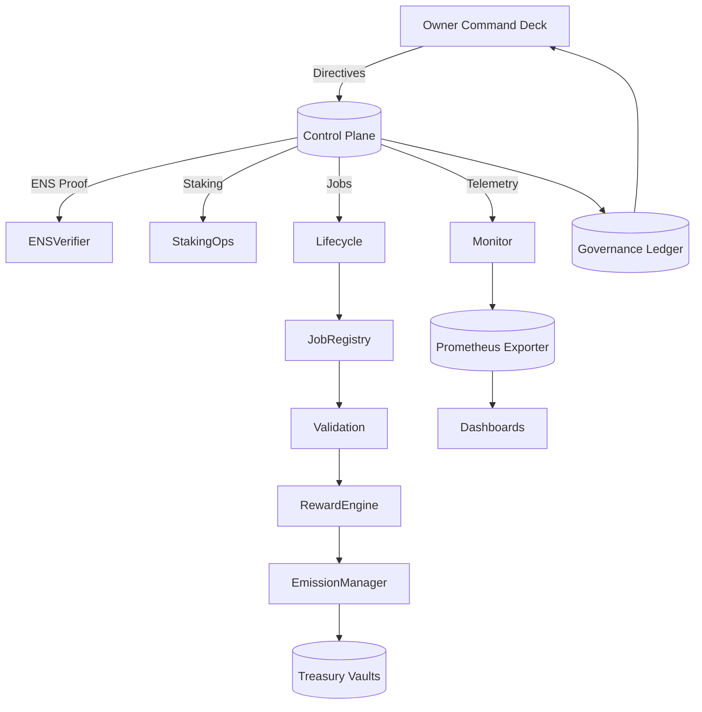
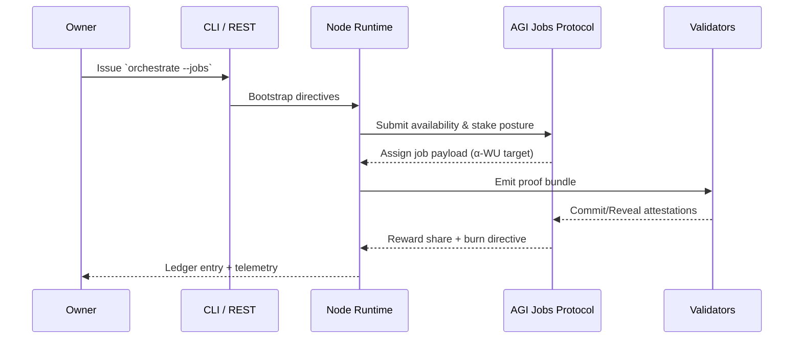
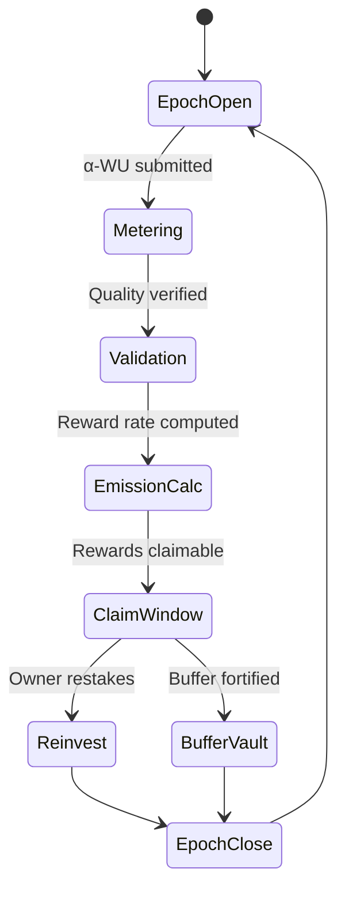
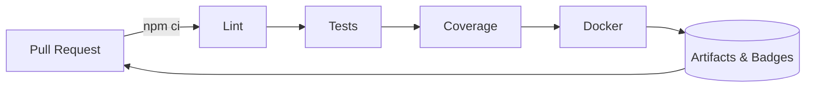

# AGI Alpha Node v0 · Sovereign Yield Intelligence Core ⚡

<!-- markdownlint-disable MD013 MD033 -->
<p align="center">
  <picture>
    <source srcset="1.alpha.node.agi.eth.svg" type="image/svg+xml" />
    
  </picture>
</p>

<p align="center">
  <a href="https://github.com/MontrealAI/AGI-Alpha-Node-v0/actions/workflows/ci.yml">
    
  </a>
  <a href="https://img.shields.io/github/actions/workflow/status/MontrealAI/AGI-Alpha-Node-v0/ci.yml?branch=main&job=Lint%20Markdown%20%26%20Links&label=Lint%20%E2%9C%85&logo=markdown&style=flat-square">
    
  </a>
  <a href="https://img.shields.io/github/actions/workflow/status/MontrealAI/AGI-Alpha-Node-v0/ci.yml?branch=main&job=Unit%20%26%20Integration%20Tests&label=Tests%20%E2%9A%A1&logo=vitest&logoColor=white&style=flat-square">
    
  </a>
  <a href="https://img.shields.io/github/actions/workflow/status/MontrealAI/AGI-Alpha-Node-v0/ci.yml?branch=main&job=Coverage%20Report&label=Coverage%20%E2%9C%85&logo=c8&logoColor=white&style=flat-square">
    
  </a>
  <a href="https://img.shields.io/github/actions/workflow/status/MontrealAI/AGI-Alpha-Node-v0/ci.yml?branch=main&job=Docker%20Build%20%26%20Smoke%20Test&label=Docker%20%E2%9A%A1&logo=docker&logoColor=white&style=flat-square">
    
  </a>
  
  
  
  <a href="Dockerfile">
    
  </a>
  <a href="deploy/helm/agi-alpha-node">
    
  </a>
  
  <a href="https://app.ens.domains/name/alpha.node.agi.eth">
    
  </a>
  <a href="https://etherscan.io/token/0xa61a3b3a130a9c20768eebf97e21515a6046a1fa">
    
  </a>
  <a href=".github/required-checks.json">
    
  </a>
  <a href="LICENSE">
    
  </a>
</p>

> _AGI ALPHA Nodes harvest α‑Work Units (α‑WU) and settle the spoils in $AGIALPHA. The runtime is tuned so the owner alone dictates the tempo._

---

## Table of Contents

1. [Mission Vectors](#mission-vectors)
2. [System Constellation](#system-constellation)
3. [Activation Protocol](#activation-protocol)
4. [Owner Control Surfaces](#owner-control-surfaces)
5. [Interface Surface Area](#interface-surface-area)
6. [Observability & Data Spine](#observability--data-spine)
7. [Deployment Blueprints](#deployment-blueprints)
8. [Repository Atlas](#repository-atlas)
9. [Continuous Assurance](#continuous-assurance)
10. [Token Factsheet](#token-factsheet)
11. [Reference Dossiers](#reference-dossiers)
12. [License](#license)

---

## Mission Vectors

### Network DNA

| Vector | Implementation Anchor | Inspect |
| ------ | --------------------- | ------- |
| **Identity Anchoring** | ENS verification halts execution if `⟨label⟩.alpha.node.agi.eth` shifts away from the owner. | [`src/services/ensVerifier.js`](src/services/ensVerifier.js) |
| **Economic Sovereignty** | Canonical $AGIALPHA constants, staking posture, and reinvestment optimizers compound owner capital. | [`src/constants/token.js`](src/constants/token.js), [`src/services/staking.js`](src/services/staking.js), [`src/services/economics.js`](src/services/economics.js) |
| **Lifecycle Engine** | Discovery → application → execution → settlement sequenced with immutable journals. | [`src/services/jobLifecycle.js`](src/services/jobLifecycle.js), [`src/services/lifecycleJournal.js`](src/services/lifecycleJournal.js) |
| **Intelligence Mesh** | Planner, swarm orchestration, curriculum loop, and stress harness deliver deterministic execution strategies. | [`src/intelligence/planning.js`](src/intelligence/planning.js), [`src/intelligence/swarmOrchestrator.js`](src/intelligence/swarmOrchestrator.js), [`src/intelligence/learningLoop.js`](src/intelligence/learningLoop.js), [`src/intelligence/stressHarness.js`](src/intelligence/stressHarness.js) |
| **Owner Dominion** | Full authority to pause, resume, redirect rewards, rotate registries, and contest disputes. | [`src/services/governance.js`](src/services/governance.js), [`src/services/governanceLedger.js`](src/services/governanceLedger.js) |
| **Observability** | Prometheus metrics, compliance ledgers, and monitor loops keep every signal exposed. | [`src/orchestrator/monitorLoop.js`](src/orchestrator/monitorLoop.js), [`src/telemetry/monitoring.js`](src/telemetry/monitoring.js) |

### Capability Stack



---

## System Constellation

### Autonomous Job Stream



### Reward & Emission Loop



---

## Activation Protocol

### Environment Matrix

| Surface | Command |
| ------- | ------- |
| Install dependencies | `npm ci`
| Lint Markdown & links | `npm run lint`
| Execute full test suite | `npm test`
| Generate coverage | `npm run coverage`
| Launch runtime help | `node src/index.js --help`
| Docker build (local) | `docker build -t agi-alpha-node:local .`

### Quickstart Shell

```bash
# 1. Install toolchain
npm ci

# 2. Run static analysis and tests
npm run lint
npm test

# 3. Inspect runtime entrypoint
node src/index.js --help
```

### Safety Nets

- **Hardened Defaults:** [`src/config/defaults`](src/config) defines conservative RPC, staking, and telemetry defaults.
- **Offline Simulation:** [`src/services/offlineSnapshot.js`](src/services/offlineSnapshot.js) replays settlement flows before live activation.
- **Operator Runbook:** Refer to [`docs/operator-runbook.md`](docs/operator-runbook.md) for escalation matrices and failure drill scripts.

---

## Owner Control Surfaces

The owner governs every consequential lever without redeployment. Each helper returns an ABI-encoded transaction envelope suitable for a multisig or hardware wallet.

| Domain | Purpose | Builder |
| ------ | ------- | ------- |
| **Global Pause** | Freeze or resume all protocol entry points. | `buildSystemPauseTx` |
| **Staking Policy** | Adjust minimum stakes & validator quorum. | `buildMinimumStakeTx`, `buildValidatorThresholdTx` |
| **Registry Routing** | Swap job & identity registries. | `buildStakeRegistryUpgradeTx` |
| **Reward Shares** | Rebalance operator/validator/treasury basis points. | `buildRoleShareTx`, `buildGlobalSharesTx` |
| **Emission Envelope** | Tune per-epoch emissions, pacing, caps, and multipliers. | `buildEmissionPerEpochTx`, `buildEmissionEpochLengthTx`, `buildEmissionCapTx`, `buildEmissionRateMultiplierTx` |
| **Job Modules** | Rotate validation, reputation, or dispute modules. | `buildJobRegistryUpgradeTx`, `buildDisputeTriggerTx` |
| **Identity Delegation** | Authorize secondary operators for the ENS identity. | `buildIdentityDelegateTx` |
| **Incentives Surface** | Retarget stake manager, activation fee, treasury, or heartbeat grace. | `buildIncentivesStakeManagerTx`, `buildIncentivesMinimumStakeTx`, `buildIncentivesHeartbeatTx`, `buildIncentivesActivationFeeTx`, `buildIncentivesTreasuryTx` |

A programmatic catalog of all owner functions is available through `getOwnerFunctionCatalog()` inside [`src/services/governance.js`](src/services/governance.js).

---

## Interface Surface Area

### CLI Command Spine

The CLI orchestrator at [`src/index.js`](src/index.js) exposes:

- `orchestrate` — run the full node runtime ([`src/orchestrator/nodeRuntime.js`](src/orchestrator/nodeRuntime.js)).
- `governance` — emit transaction payloads from [`src/services/governance.js`](src/services/governance.js).
- `status` — fetch operator health from [`src/services/governanceStatus.js`](src/services/governanceStatus.js).
- `snapshot` — capture offline proofs using [`src/services/offlineSnapshot.js`](src/services/offlineSnapshot.js).

### REST & Governance API

- REST gateway: [`src/network/apiServer.js`](src/network/apiServer.js) with controllers in [`src/services/controlPlane.js`](src/services/controlPlane.js).
- Governance journal: [`src/services/governanceLedger.js`](src/services/governanceLedger.js) and snapshot tooling in [`src/services/governanceStatus.js`](src/services/governanceStatus.js).

### Agent Intelligence Core

- Planner: [`src/intelligence/planning.js`](src/intelligence/planning.js) synthesizes market-aware strategies.
- Swarm coordination: [`src/intelligence/swarmOrchestrator.js`](src/intelligence/swarmOrchestrator.js) delegates specialist agents.
- Learning loop: [`src/intelligence/learningLoop.js`](src/intelligence/learningLoop.js) evolves curricula.
- Stress harness: [`src/intelligence/stressHarness.js`](src/intelligence/stressHarness.js) adversarially tests playbooks.

---

## Observability & Data Spine

- **Telemetry Exporter:** [`src/telemetry/monitoring.js`](src/telemetry/monitoring.js) streams Prometheus metrics including Synthetic Labor Yield (SLY).
- **Monitor Loop:** [`src/orchestrator/monitorLoop.js`](src/orchestrator/monitorLoop.js) enforces heartbeats, SLO adherence, and log journaling.
- **Lifecycle Journal:** [`src/services/lifecycleJournal.js`](src/services/lifecycleJournal.js) records immutable job execution artifacts.
- **Data Snapshots:** Example offline bundle in [`docs/offline-snapshot.example.json`](docs/offline-snapshot.example.json).

---

## Deployment Blueprints

| Surface | Artifact |
| ------- | -------- |
| Docker Runtime | [`Dockerfile`](Dockerfile) + [`deploy/docker`](deploy/docker) entrypoints |
| Kubernetes | [`deploy/helm/agi-alpha-node`](deploy/helm/agi-alpha-node) Helm chart |
| Configuration | [`src/config`](src/config) schemas validated with [`src/config/env.js`](src/config/env.js) |

---

## Repository Atlas

```text
src/
├── config/              # Runtime configuration schemas & loaders
├── constants/           # Canonical token + contract metadata
├── intelligence/        # Planner, swarm, learning, stress harness
├── network/             # REST gateway and transport adapters
├── orchestrator/        # Node runtime loop & monitors
├── services/            # Staking, governance, economics, lifecycle
├── telemetry/           # Metrics exporters and dashboards hooks
└── utils/               # Formatting, validation, and helpers
```

Supplementary dossiers live under [`docs/`](docs) with economics, manifesto, deployment notes, and operator runbooks.

---

## Continuous Assurance



- **Workflow:** [`.github/workflows/ci.yml`](.github/workflows/ci.yml) runs linting, tests, coverage, and Docker smoke tests on every push & PR.
- **Required Checks:** [`.github/required-checks.json`](.github/required-checks.json) enforces all CI jobs on `main` and gated pull requests.
- **Coverage:** `npm run coverage` publishes LCOV artifacts for downstream dashboards.
- **Branch Protection:** All status checks are mandatory before merge.

---

## Token Factsheet

- **Symbol:** `$AGIALPHA`
- **Contract:** [`0xa61a3b3a130a9c20768eebf97e21515a6046a1fa`](https://etherscan.io/token/0xa61a3b3a130a9c20768eebf97e21515a6046a1fa)
- **Decimals:** `18`
- **Normalization Utilities:** [`src/constants/token.js`](src/constants/token.js)
- **Usage:** Settlement medium for α‑WU output, staking bond, and governance collateral.

---

## Reference Dossiers

- [Economics Codex](docs/economics.md)
- [Deployment Playbooks](docs/deployment)
- [Operator Runbook](docs/operator-runbook.md)
- [Manifesto](docs/manifesto.md)
- [Project Overview](docs/README.md)

## License

Released under the [MIT License](LICENSE).
