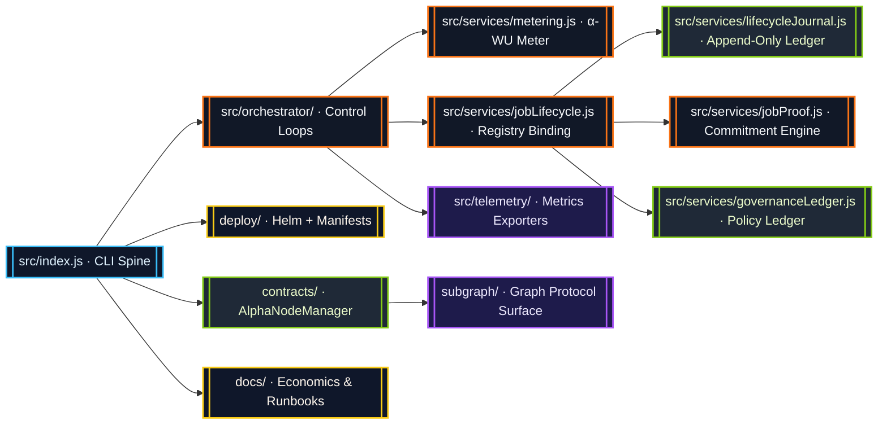
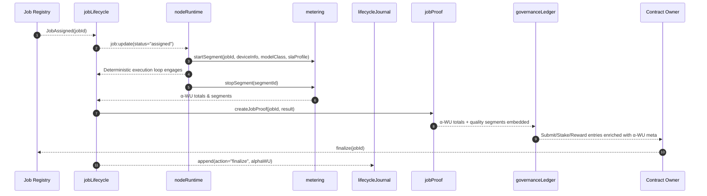

# AGI Alpha Node v0 · Owner-Dominion Cognition Engine ⚡

<!-- markdownlint-disable MD013 MD033 -->
<p align="center">
  <picture>
    <source srcset="1.alpha.node.agi.eth.svg" type="image/svg+xml" />
    
  </picture>
</p>

<p align="center">
  <a href="https://github.com/MontrealAI/AGI-Alpha-Node-v0/actions/workflows/ci.yml">
    
  </a>
  
  
  <a href="Dockerfile">
    
  </a>
  <a href="deploy/helm/agi-alpha-node">
    
  </a>
  <a href="https://etherscan.io/address/0xa61a3b3a130a9c20768eebf97e21515a6046a1fa">
    
  </a>
  <a href="LICENSE">
    
  </a>
</p>

> A sovereign cognition spine that binds deterministic execution, tokenized incentives, and metered intelligence into an operator-controlled command lattice that will not yield.

---

## Table of Contents

1. [Mission Singularity](#mission-singularity)
2. [Repository Topology](#repository-topology)
3. [Cognitive Flow Orchestration](#cognitive-flow-orchestration)
4. [α-Work Unit Intelligence](#α-work-unit-intelligence)
5. [Lifecycle Journal & Governance Ledger](#lifecycle-journal--governance-ledger)
6. [Sovereign Smart-Contract Surface](#sovereign-smart-contract-surface)
7. [Deployment & Operations](#deployment--operations)
8. [Continuous Integration](#continuous-integration)
9. [Quickstart](#quickstart)
10. [Testing & Quality Gates](#testing--quality-gates)
11. [Token & Economics](#token--economics)
12. [Further Reading](#further-reading)

---

## Mission Singularity

AGI Alpha Node v0 is engineered as the cognition engine that continuously arbitrages global inefficiencies. The runtime synchronizes blockchain truth, GPU enclaves, metered α-work units, and governance levers so the contract owner can bend the network to any strategy on demand. Every subsystem is hardened for immediate production launch by a single operator.

* **Canonical Token:** `$AGIALPHA` (18 decimals) is anchored at [`0xa61a3b3a130a9c20768eebf97e21515a6046a1fa`](https://etherscan.io/address/0xa61a3b3a130a9c20768eebf97e21515a6046a1fa) and enforced across runtime, contracts, and configuration schema.
* **Owner Totality:** Contracts and CLI expose pause/resume, validator curation, ENS authority rotation, treasury extraction, SLA tuning, and stake control in seconds.
* **Deterministic Metering:** Every deterministic execution loop is measured, weighted, and aggregated into α-work units for rewards, dashboards, and governance triggers.
* **Operator UX:** Container images, Helm charts, Prometheus exporters, Grafana atlases, and GitHub Actions all align so a non-technical owner can deploy and audit safely.

---

## Repository Topology



| Surface | Description |
| --- | --- |
| [`src/`](src) | Node.js runtime, deterministic execution loop, metering service, lifecycle journal, governance ledger, telemetry exporters, and CLI entrypoint. |
| [`contracts/`](contracts) | Solidity control plane anchored by `AlphaNodeManager` with owner-controlled pausing, validator curation, identity mesh, and stake custody. |
| [`docs/`](docs) | Economics treatises, telemetry atlases, α-WU framework, and operator runbooks. |
| [`deploy/`](deploy) | Helm chart, Kubernetes manifests, and operational automation. |
| [`scripts/`](scripts) | CI gates, subgraph rendering, governance verification, and policy tooling. |
| [`subgraph/`](subgraph) | Graph Protocol mappings for α-WU events, governance signals, and operator leaderboards. |

---

## Cognitive Flow Orchestration



Every job completion injects `getJobAlphaWU(jobId)` totals and per-segment quality into the cached job record, journal entries, proof objects, and governance ledger. Nothing proceeds without measured throughput.

---

## α-Work Unit Intelligence

The metering service (`src/services/metering.js`) captures GPU minutes, multiplies by configured quality weights, and emits α-work unit aggregates by job, device class, and SLA profile. It operates entirely in-memory for instantaneous feedback and feeds downstream telemetry, proofs, and governance.

```mermaid
graph TD
  classDef store fill:#0f172a,stroke:#38bdf8,color:#e0f2fe;
  classDef compute fill:#1f2937,stroke:#a855f7,color:#ede9fe;

  Start[startSegment(jobId, deviceInfo, modelClass, slaProfile)]:::compute --> Active[(Active Segment Map)]:::store
  Active --> Stop[stopSegment(segmentId)]:::compute
  Stop --> Totals[(Epoch Buckets & Job Totals)]:::store
  Totals --> Aggregates[getRecentEpochSummaries()]:::compute
  Aggregates --> Telemetry[[monitorLoop.getAlphaWuHistory()]]:::compute
  Totals --> API[[getJobAlphaWU / getJobAlphaSummary / getGlobalAlphaSummary / getEpochAlphaWU]]:::compute
```

Usage highlights:

```js
import {
  startSegment,
  stopSegment,
  getJobAlphaSummary,
  getGlobalAlphaSummary,
  getEpochAlphaWU
} from './src/services/metering.js';

const { segmentId, epochId } = startSegment({
  jobId: 'job-42',
  deviceInfo: { deviceClass: 'A100-80GB', vramTier: 'TIER_80', gpuCount: 2 },
  modelClass: 'LLM_70B',
  slaProfile: 'LOW_LATENCY_ENCLAVE'
});

// ...deterministic execution loop...

const segment = stopSegment(segmentId);
console.log(segment.alphaWU); // Weighted α-work units for the loop

const epoch = getEpochAlphaWU(epochId);
console.table(epoch.alphaWU_by_job); // Rolling aggregates for telemetry and payouts

const jobSummary = getJobAlphaSummary('job-42');
console.table(jobSummary.bySegment); // Quality-adjusted mix for proofs and ledgers

const networkSummary = getGlobalAlphaSummary();
console.log(networkSummary.total); // Platform-wide cognitive throughput
```

Weights and epoch cadence are derived from [`WORK_UNITS`](src/config/schema.js) with defaults declared in [`src/constants/workUnits.js`](src/constants/workUnits.js). Override weights via environment variables or JSON config to tune economics instantly.

---

## Lifecycle Journal & Governance Ledger

Completion telemetry now flows through a triad of metering, journaling, and governance ledgers so every α-WU is provably accounted for when the owner executes policy changes.

```mermaid
flowchart TB
  classDef ledger fill:#111827,stroke:#84cc16,stroke-width:2px,color:#ecfccb;
  classDef journal fill:#0f172a,stroke:#38bdf8,stroke-width:2px,color:#e0f2fe;
  classDef service fill:#1e1b4b,stroke:#a855f7,stroke-width:2px,color:#ede9fe;
  classDef control fill:#1f2937,stroke:#f97316,stroke-width:2px,color:#f8fafc;

  Metering[[metering.stopSegment()]]:::service --> AlphaSummary[[getJobAlphaSummary()]]:::service
  AlphaSummary --> Lifecycle[[jobLifecycle.finalize()]]:::journal
  Lifecycle --> Journal[[lifecycleJournal.append()]]:::journal
  AlphaSummary --> Proof[[createJobProof()]]:::service
  Proof --> Governance[[recordGovernanceAction()]]:::ledger
  Governance --> Owner[[Owner CLI/API Submit, Stake, Reward]]:::control
```

Highlights:

* **Lifecycle enrichment:** `jobLifecycle` automatically calls `getJobAlphaWU` and `getJobAlphaSummary` during finalization. The resulting `alphaWU` object (totals, model-class distribution, SLA distribution, per-segment quality) is cached on the job record and hashed into every journal entry for tamper-evident provenance.
* **Proof payloads:** `createJobProof` emits deterministic commitments plus `{ resultUri, alphaWU: { total, bySegment } }`, preserving quality multipliers per segment for auditors, validators, or zk pipelines before anything touches chain.
* **Ledger augmentation:** Governance ledger entries whose `meta.method` includes `submit`, `stake`, or `reward` are auto-enriched with `{ total, modelClassBreakdown, slaBreakdown }`. Stake moves and reward receipts now carry the exact cognitive throughput that motivated them.

Programmatic access:

```js
import { getJobAlphaSummary, getGlobalAlphaSummary } from './src/services/metering.js';
import { recordGovernanceAction } from './src/services/governanceLedger.js';

const jobAlpha = getJobAlphaSummary('0x…jobId');
console.log(jobAlpha.total, jobAlpha.modelClassBreakdown);

recordGovernanceAction({
  payload: { to: '0x0', data: '0x' },
  meta: {
    contract: 'JobRegistry',
    method: 'submitJob',
    args: { jobId: '0x…jobId' }
  }
}); // alphaWU summary is appended automatically
```

Ledger entries written via CLI (`agi-alpha-node governance …`) or the API server embed these structures automatically, giving compliance, auditing, and revenue attribution immediate clarity even under extreme operational tempo.

---

## Sovereign Smart-Contract Surface

The Solidity surface is tuned for absolute owner authority while maintaining protocol integrity.

| Contract | Highlights | Owner Controls |
| --- | --- | --- |
| [`AlphaNodeManager.sol`](contracts/AlphaNodeManager.sol) | Ownable orchestrator for validators, staking, identity registry, and α-WU event emission. | Pause/unpause, curate validators, register/rotate ENS controllers, toggle identities, withdraw stake, apply slashes, and delegate mint/accept flows instantly. |
| [`IAlphaWorkUnitEvents.sol`](contracts/interfaces/IAlphaWorkUnitEvents.sol) | Shared ABI for runtime, telemetry, and subgraph ingestion. | Emits `AlphaWUMinted`, `AlphaWUValidated`, `AlphaWUAccepted`, `SlashApplied`. |

Every control surfaces through the CLI (see [`src/index.js`](src/index.js)) and is guarded by CI policy tests (`npm run ci:policy`). Treasury operations, validator rotations, and pause sequences are executable by a single owner wallet—no hidden multisig.

---

## Deployment & Operations

| Surface | Highlights |
| --- | --- |
| [`Dockerfile`](Dockerfile) | Node.js 20 image with CLI, telemetry exporter, health checks, and deterministic dependencies. |
| [`deploy/helm/agi-alpha-node`](deploy/helm/agi-alpha-node) | Helm chart wiring ConfigMaps, secrets, Prometheus scraping, and rollout policies. |
| [`scripts/`](scripts) | Health gate verification, subgraph manifest rendering, governance payload builders, branch policy enforcement. |

Operational cadence:

1. **Bootstrap** – `npm install && node src/index.js diagnostics` to validate ENS, staking, and governance posture.
2. **Containerize** – Build/pull the Docker image, inject `.env` overrides, and deploy via Helm.
3. **Observe** – Point Prometheus to `METRICS_PORT` (default `9464`) and import Grafana dashboards from [`docs/telemetry`](docs/telemetry).
4. **Govern** – Use CLI governance commands or the API server (`src/network/apiServer.js`) to issue owner directives, rotate validators, or rebalance stakes.

Owner retains unilateral ability to pause, resume, and mutate economic levers while telemetry confirms every action in real time.

---

## Continuous Integration

All commits and pull requests are validated by [`ci.yml`](.github/workflows/ci.yml). Branch protection on `main` enforces a fully green pipeline before merges.

| Check | Scope |
| --- | --- |
| `npm run lint` | Markdown lint (`markdownlint-cli2`) and link validation (`markdown-link-check`). |
| `npm run test` | Vitest suites spanning orchestrator, metering, governance, telemetry, and contract adapters. |
| `npm run coverage` | c8 coverage (text, lcov, JSON summary) for auditors and dashboards. |
| `npm run ci:solidity` | `solhint` lint + `solcjs` compilation for Solidity integrity. |
| `npm run ci:ts` | Subgraph TypeScript generation and build. |
| `npm run ci:security` | `npm audit --omit=dev --audit-level=high` for dependency posture. |
| `npm run ci:policy` | Health gate + governance policy verification. |
| `npm run ci:branch` | Branch hygiene guard (enforces mainline protections). |

Run `npm run ci:verify` locally to execute the entire matrix before opening a pull request.

---

## Quickstart

```bash
npm install
npm run start -- --help                 # Explore CLI commands and governance levers
node src/index.js diagnostics           # One-shot diagnostics (ENS, staking, governance)
npm run lint                            # Markdown + link linting
npm run test                            # Vitest unit and integration suite
npm run ci:verify                       # Full CI pipeline locally
```

Inject configuration via environment variables or `.env` files:

```bash
export RPC_URL="https://rpc.ankr.com/eth"
export NODE_LABEL="alpha-node-1"
export OPERATOR_ADDRESS="0x..."
export GPU_MODEL="NVIDIA-H100"
export GPU_VRAM_GB="80"
export GPU_COUNT="2"
export WORK_UNITS='{"weights":{"slaProfile":{"LOW_LATENCY_ENCLAVE":2.5}}}'
node src/index.js jobs list
```

---

## Testing & Quality Gates

| Command | Purpose |
| --- | --- |
| `npm run lint` | Markdown linting + link validation across README and docs. |
| `npm run test` | Vitest suite covering orchestrator, metering, governance, telemetry, and ledger integrations. |
| `npm run coverage` | Generates coverage reports (text, lcov, JSON summary). |
| `npm run ci:verify` | Mirrors the GitHub Actions workflow locally. |
| `npm run ci:solidity` | Solidity lint + compilation for `AlphaNodeManager`. |
| `npm run ci:ts` | Subgraph TypeScript generation and build. |

---

## Token & Economics

* `$AGIALPHA` token contract: [`0xa61a3b3a130a9c20768eebf97e21515a6046a1fa`](https://etherscan.io/address/0xa61a3b3a130a9c20768eebf97e21515a6046a1fa) (18 decimals).
* Metering weights and epoch cadence are codified in [`src/constants/workUnits.js`](src/constants/workUnits.js) and validated via [`src/config/schema.js`](src/config/schema.js).
* Subgraph package in [`subgraph/`](subgraph) mirrors on-chain α-WU events for analytics, payouts, and governance instrumentation.
* Economics briefs in [`docs/economics.md`](docs/economics.md) outline the flywheel where more jobs → higher token demand → richer staking rewards → more nodes → compounding throughput.

---

## Further Reading

* [$AGIALPHA Token Constants](src/constants/token.js)
* [α-WU Canonical Framework](docs/alpha-wu.md)
* [Telemetry Atlases](docs/telemetry)
* [Economics Treatise](docs/economics.md)
* [Operator Runbook](docs/operator-runbook.md)
* [Manifesto](docs/manifesto.md)

---

### License

Released under the [MIT License](LICENSE).
