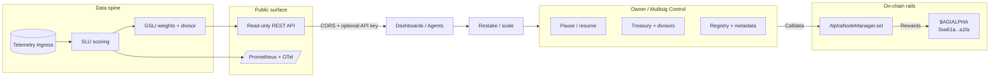
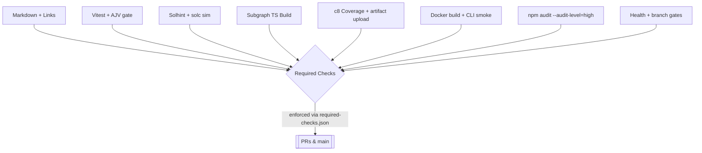

# AGI Alpha Node v0 · Cognitive Yield Engine ⚡️

<!-- markdownlint-disable MD012 MD013 MD033 -->
<p align="center">
  <picture>
    <source srcset="1.alpha.node.agi.eth.svg" type="image/svg+xml" />
    
  </picture>
</p>

<p align="center">
  <a href="https://github.com/MontrealAI/AGI-Alpha-Node-v0/actions/workflows/ci.yml?query=branch%3Amain">
    
  </a>
  <a href=".github/required-checks.json">
    
  </a>
  <a href="https://github.com/MontrealAI/AGI-Alpha-Node-v0/actions?query=branch%3Amain">
    
  </a>
  
  
  
  
  
  
  <a href="https://etherscan.io/address/0xa61a3b3a130a9c20768eebf97e21515a6046a1fa">
    
  </a>
  
  <a href="LICENSE">
    
  </a>
  
  
  <a href="Dockerfile">
    
  </a>
  <a href="deploy/helm/agi-alpha-node">
    
  </a>
  
  
</p>

> **AGI Alpha Node v0** metabolizes heterogeneous agentic labor into verifiable α‑Work Units (α‑WU) and Synthetic Labor Units (SLU), rebalances the Global Synthetic Labor Index (GSLI), exposes audited read‑only REST telemetry, and routes the `$AGIALPHA` treasury (token: `0xa61a3b3a130a9c20768eebf97e21515a6046a1fa`, 18 decimals) under complete owner command. Every dial can be paused, rerouted, or retuned without redeploying, delivering a production-grade intelligence core built to bend markets.

## Executive flash

- **Owner-first sovereignty**: `contracts/AlphaNodeManager.sol` plus CLI verbs in `src/index.js` keep pausing, validator rotation, emissions, treasury routing, productivity bindings, registry upgrades, and metadata under owner control with calldata builders in `src/services/governance.js`.
- **Read-only public API**: `/index/latest`, `/index/history`, `/providers`, and `/providers/{id}/scores` publish GSLI and provider metrics with optional API-key gating (`X-API-Key` or `Authorization: Bearer`), paginated windows, and CORS allowlisting for dashboards.
- **Telemetry spine**: Schema-validated ingest with hashed API keys, idempotent task-run recording, and Prometheus/OTel export keeps dashboards, subgraphs, and policies aligned.
- **Deterministic persistence**: SQLite migrations + seeds hydrate providers, SLU scores, and index values with indices tuned for provider/day lookups.
- **Deployment-ready**: Dockerfile + Helm chart, CI gates, and seeded CLIs make it deployable by non-specialists while remaining fully operator-tunable.

## System architecture



### Public API data flow

```mermaid
flowchart TD
  Ingest[Task runs + energy + quality] --> Validate[AJV/Zod validation]
  Validate --> Record[SQLite + idempotency]
  Record --> Scores[SLU scoring engine]
  Scores --> Indexing[GSLI rebalance + divisor]
  Indexing --> Latest[/GET /index/latest/]
  Indexing --> History[/GET /index/history/]
  Scores --> Providers[/GET /providers/]
  Scores --> ProviderScores[/GET /providers/{id}/scores/]
  classDef api fill:#111827,stroke:#0ea5e9,stroke-width:1.5px,color:#f9fafb;
  class Latest,History,Providers,ProviderScores api;
```

## Public API (read-only)

**Base URL**: `http://<host>:<API_PORT>` (default `8080`). All endpoints support CORS; set `API_DASHBOARD_ORIGIN` to a specific origin for production and `API_PUBLIC_READ_KEY` to require `X-API-Key` or `Authorization: Bearer <key>`.

| Endpoint | Purpose | Query params |
| --- | --- | --- |
| `GET /index/latest` | Latest GSLI value with weight set + constituents. | — |
| `GET /index/history` | Historical index values (paginated). | `from=YYYY-MM-DD`, `to=YYYY-MM-DD`, `limit`, `offset` |
| `GET /providers` | Provider registry with most recent SLU score (paginated). | `limit`, `offset` |
| `GET /providers/{id}/scores` | Provider SLU history (paginated). | `from`, `to`, `limit`, `offset` |

Example: latest index with keyed CORS gate.

```http
GET /index/latest
X-API-Key: public-key-123
Origin: https://dash.example.com
```

```json
{
  "index": {"id": 12, "effective_date": "2024-01-03", "headline_value": 24.3, "weight_set_id": 7, "divisor_version": "v1"},
  "weight_set": {"id": 7, "effective_date": "2024-01-03", "cap": 0.15, "lookback_window_days": 90},
  "constituents": [
    {
      "provider_id": 1,
      "weight": 0.42,
      "metadata": {"capped": false},
      "provider": {"id": 1, "name": "helios-labs", "region": "na-east", "sector_tags": ["llm"], "energy_mix": "hydro"}
    }
  ]
}
```

Example: SLU history for a provider.

```http
GET /providers/1/scores?from=2024-01-01&to=2024-01-03&limit=2
```

```json
{
  "provider": {"id": 1, "name": "helios-labs", "region": "na-east"},
  "window": {"from": "2024-01-01", "to": "2024-01-03"},
  "pagination": {"total": 2, "limit": 2, "offset": 0, "nextOffset": null},
  "scores": [
    {"id": 11, "provider_id": 1, "as_of_date": "2024-01-03", "slu": 0.86, "rationale": "growth-p2"},
    {"id": 10, "provider_id": 1, "as_of_date": "2024-01-02", "slu": 0.82, "rationale": "growth-p1"}
  ]
}
```

## Owner controls & $AGIALPHA

- **Contract surface**: `contracts/AlphaNodeManager.sol` plus calldata builders in `src/services/governance.js` keep pausing, validator rotations, emissions, treasury routing, registry upgrades, productivity directives, work-meter tuning, and metadata mutable at any time.
- **CLI wrappers**: `src/index.js` verbs cover pausing, divisors, node metadata, ENS alignment, staking/activation, treasury updates, emission multipliers, productivity routing, and job registry adjustments without redeploying.
- **API governance**: Authenticated endpoints (`/governance/*`) demand `GOVERNANCE_API_TOKEN` and log ledger entries for auditability; owner tokens may be supplied through `Authorization: Bearer` or `X-Owner-Token` headers.
- **Pause & recover**: System pause, submission windows, emission caps, and treasury addresses can be rotated at runtime, giving the operator complete command for the AGI jobs platform.

## Data spine & migrations

- **SQLite migrations**: `src/persistence/migrations` build durable tables for providers, task types, task runs, energy/quality reports, SLU scores, index weights/values, and governance ledger entries.
- **Seeds**: `npm run db:seed` plants sample providers and task types for immediate dashboards; `initializeDatabase({ withSeed: true })` drives tests and the API server for deterministic bootstraps.
- **Repositories**: CRUD helpers live in `src/persistence/repositories.js` with pagination + JSON normalization to keep API responses consistent.

## Quickstart (non-technical friendly)

1. **Install Node.js 20.18+ & npm 10+** (or build the container with the provided `Dockerfile`).
2. **Clone and install**:

   ```bash
   git clone https://github.com/MontrealAI/AGI-Alpha-Node-v0.git
   cd AGI-Alpha-Node-v0
   npm ci
   ```

3. **Bootstrap local data** (in-memory by default):

   ```bash
   npm run db:seed
   ```

4. **Run the node** (public API + telemetry on `API_PORT`, metrics on `/metrics`):

   ```bash
   npm start -- --help   # discover CLI verbs
   npm start             # launches API + telemetry spine
   ```

5. **Secure the API** (optional): set `API_PUBLIC_READ_KEY` and `API_DASHBOARD_ORIGIN` to gate read access and scope CORS.
6. **Deploy**: use the Helm chart at `deploy/helm/agi-alpha-node` or `docker build -t agi-alpha-node:latest .` for containerized rollouts.

## Configuration matrix

| Variable | Default | Purpose |
| --- | --- | --- |
| `API_PUBLIC_READ_KEY` | _(unset)_ | Optional API key required for `/index/*` and `/providers/*` endpoints when set. Provide via `X-API-Key` or `Authorization: Bearer <key>`. |
| `API_DASHBOARD_ORIGIN` | `*` | CORS allowlist for dashboards; set to an exact origin (e.g., `https://dash.example.com`) for production. |
| `API_PORT` | `8080` | HTTP port for the public API and telemetry ingest surface. |
| `METRICS_PORT` | `9464` | Prometheus `/metrics` port exposed by the monitoring server. |
| `GOVERNANCE_API_TOKEN` | _(unset)_ | Bearer token required for owner-only governance endpoints; send via `Authorization` or `X-Owner-Token`. |
| `AGI_ALPHA_DB_PATH` | `:memory:` | SQLite location; set to a filesystem path for persistence across restarts. |
| `TELEMETRY_ENABLED` | `true` | Toggles ingestion servers and monitoring gauges. |
| `TELEMETRY_HASH_ALGO` | `sha256` | Hashing algorithm for provider API keys stored in `provider_api_keys`. |
| `VERIFIER_PORT` | `8787` | Port for the verifier server that validates α‑WU attestations. |
| `AGIALPHA_TOKEN_ADDRESS` | `0xa61a3b3a130a9c20768eebf97e21515a6046a1fa` | Token contract used by staking, rewards, and governance helpers. |

## CI, quality gates, and observability



- **Full visibility**: CI definition lives in [`.github/workflows/ci.yml`](.github/workflows/ci.yml) with artifacts for coverage and Docker smoke logs.
- **Required checks**: `.github/required-checks.json` mirrors the matrix and is enforced on PRs and `main`.
- **Coverage discipline**: `npm run coverage` produces LCOV/JSON summaries; the coverage job uploads artifacts for downstream badges.
- **Security**: `npm audit --audit-level=high`, health gates, and branch policy checks run on every PR.

## Operations playbook

- **Health probes**: `/healthz` shows mode + recent telemetry counts; `/status` returns α‑WU posture and last epoch summary; `/status/diagnostics` expands per-job/device-class/SLA aggregates.
- **API safety**: Governance endpoints demand owner tokens; public endpoints can be gated with `API_PUBLIC_READ_KEY`. CORS is limited to `API_DASHBOARD_ORIGIN` and preflight is handled automatically.
- **Secrets**: Environment variables are loaded via `dotenv`; never store private keys in the repo. Owner auth is accepted via `Authorization: Bearer` or `X-Owner-Token`.
- **Data durability**: Configure `AGI_ALPHA_DB_PATH` to persist beyond restarts; WAL is enabled by default.

## Repository atlas

- `src/network/apiServer.js` – HTTP surface (telemetry ingest, governance, read-only public API, health/metrics).
- `src/services/globalIndexEngine.js` – GSLI eligibility, cap-aware weight sets, divisor-aware index math.
- `src/services/syntheticLaborEngine.js` – SLU computation and provider scoring pipeline.
- `src/services/governance.js` – Owner calldata builders (pausing, validators, emissions, treasury, registry upgrades, work meters, productivity controls).
- `src/persistence` – SQLite migrations, seeds, repositories, and CLI helpers.
- `contracts/AlphaNodeManager.sol` – Owner-governed contract surface; `$AGIALPHA` integrations in `contracts` + `src/services/token.js`.
- `deploy/helm/agi-alpha-node` – Production Kubernetes packaging; `Dockerfile` for container builds.

## Appendix: CLI & API recipes

```bash
# Governance: pause the system (owner token required via env OWNER_TOKEN)
node src/index.js governance:pause --operator 0xYourOwner --signature 0xdeadbeef

# Compute today’s GSLI headline value after rebalance
node src/index.js index:rebalance --cap 15 --lookback-days 90
node src/index.js index:daily --as-of $(date +%F)

# Backfill index history for dashboards
node src/index.js index:backfill --from 2024-01-01 --to 2024-03-01 --cap 20 --rebalance-interval 30

# Inspect ENS alignment for your node
node src/index.js ens:verify --label 1.alpha.node.agi.eth --operator 0xYourOperator
```
