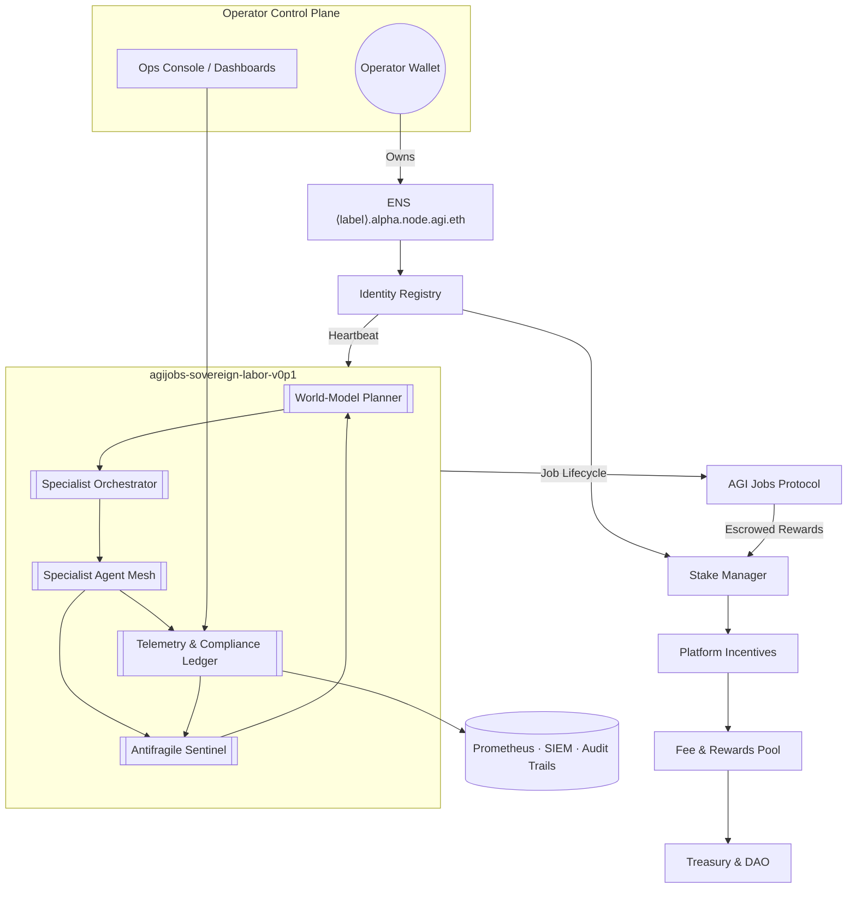
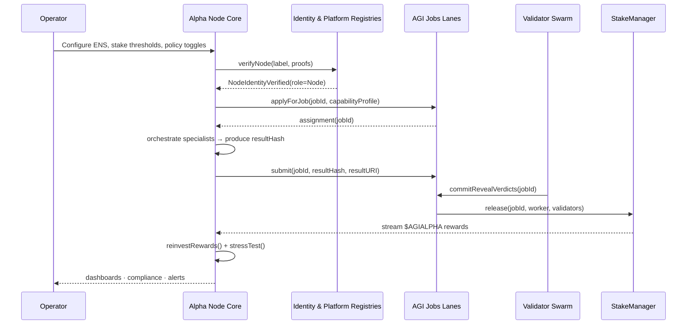

# AGI Alpha Node v0 · Sovereign Labor Intelligence

<!-- markdownlint-disable MD013 -->
<!-- markdownlint-disable MD033 -->
<p align="center">
  
</p>

<p align="center">
  <a href="https://github.com/MontrealAI/AGI-Alpha-Node-v0/actions/workflows/ci.yml">
    
  </a>
  <a href="LICENSE"></a>
  <a href="https://app.ens.domains/name/alpha.node.agi.eth"></a>
  <a href="https://etherscan.io/token/0xa61a3b3a130a9c20768eebf97e21515a6046a1fa"></a>
  <a href="docs/README.md"></a>
</p>

> **agijobs-sovereign-labor-v0p1** is the flagship machine engineered to reshape global wealth flows—the node that quietly warps economic gravity for the operator collective that governs it.

---

## Table of Contents

1. [Mission Pulse](#mission-pulse)
2. [Signal Highlights](#signal-highlights)
3. [Neural Architecture Lattice](#neural-architecture-lattice)
4. [Autonomy Flightpath](#autonomy-flightpath)
5. [Operator Runbook](#operator-runbook)
6. [Identity, Staking, and Treasury](#identity-staking-and-treasury)
7. [Intelligence Stack](#intelligence-stack)
8. [Safety and Operator Governance](#safety-and-operator-governance)
9. [Observability and Reliability Mesh](#observability-and-reliability-mesh)
10. [AGIALPHA Economic Engine](#agialpha-economic-engine)
11. [Continuous Integration and Quality Gates](#continuous-integration-and-quality-gates)
12. [Repository Topology](#repository-topology)
13. [Contributing](#contributing)
14. [License](#license)

---

## Mission Pulse

AGI Alpha Nodes are sovereign labor engines tuned for relentless compounding of $AGIALPHA yield. Each node fuses blockchain-grade guarantees with multi-domain intelligence so that non-technical owners can summon elite digital workforces on demand. This release delivers:

- **Institutional readiness** – deterministic identity checks, auditable ledgers, and policy-aware controls mapped for mission-critical service.
- **Operator-first economics** – every action, from staking to dispute resolution, is designed to amplify operator control, liquidity, and reward flow.
- **Rapid wealth compounding** – automated reinvestment loops allow earned $AGIALPHA to immediately reinforce stake weight and influence.

> Full operator dossier and deployment atlas: [`docs/README.md`](docs/README.md).

## Signal Highlights

| Vector | Capability Snapshot |
| ------ | ------------------- |
| Identity | ENS-anchored identities (`*.alpha.node.agi.eth`) verified during boot, heartbeat, and settlement. |
| Autonomy | World-model planning orchestrates a swarm of domain specialists for deterministic execution. |
| Economics | Single-currency economy using $AGIALPHA (`0xa61a3b3a130a9c20768eebf97e21515a6046a1fa`, 18 decimals) for deposits, slashing, and rewards. |
| Governance | Contract owners wield complete authority to tune parameters, pause flow, rotate operators, and update integrations. |
| Safety | Antifragile stress harnesses continuously harden behavior under adversarial shocks. |
| Observability | Prometheus metrics, structured ledgers, and compliance reports ensure full-spectrum transparency. |

## Neural Architecture Lattice



## Autonomy Flightpath



## Operator Runbook

1. **Clone & install tooling**

   ```bash
   git clone https://github.com/MontrealAI/AGI-Alpha-Node-v0.git
   cd AGI-Alpha-Node-v0
   npm ci
   ```

2. **Verify documentation passes quality gates**

   ```bash
   npm run lint        # markdownlint + link checks
   ```

3. **Wire CI to branch protections** – Enable “Require status checks to pass before merging” in GitHub settings and select **Continuous Integration**.
4. **Provision production credentials** – secure ENS subdomain `⟨label⟩.alpha.node.agi.eth`, maintain custody via multisig/HSM, and stage $AGIALPHA plus gas buffer.
5. **Deploy runtime** – containerize or orchestrate the node using your preferred infrastructure (Docker, Kubernetes, or enclave) aligned with the [operator dossier](docs/README.md).
6. **Monitor** – subscribe to telemetry streams, compliance ledgers, and reward dashboards to keep the machine compounding uninterrupted.

## Identity, Staking, and Treasury

- **ENS determinism** – Ownership of `NODE_LABEL.alpha.node.agi.eth` is mandatory. Boot routines halt if resolver or wrapper ownership is misconfigured.
- **Stake lifecycle** – `PlatformIncentives.stakeAndActivate(amount)` sequences approvals, deposits, and registry enrollment in a single transaction.
- **Treasury control** – Contract owners can rebalance reward splits, rotate treasury wallets, and adjust minimum stake through guarded admin functions.
- **Heartbeat assurance** – Continuous ENS verification, stake snapshots, and registry heartbeats prevent unauthorized replicas.
- **Pause & resume** – Governance invokes `SystemPause.pauseAll()` to halt flows; operators receive instant telemetry alerts and can resume post-governance unlock.

## Intelligence Stack

- **World-model planner** – Multi-armed bandit simulations estimate ROI, curriculum fit, and specialist synergy before bidding on jobs.
- **Specialist mesh** – Domain-focused micro-agents (finance, legal, infrastructure, biotech, creative, compliance) collaborate through deterministic messaging.
- **Antifragile sentinel** – Injects adversarial stress scenarios, escalates safeguards, and retrains heuristics after every anomaly.
- **Autopilot reinvestment** – Earnings loop through `reinvestRewards()` to reinforce stake weight and widen protocol influence without manual intervention.
- **Compliance ledger** – Every reasoning chain is logged, hashed, and anchorable on-chain for dispute resolution or regulatory review.

## Safety and Operator Governance

- **Owner supremacy** – Governance retains full ability to tune parameters, update integrations, rotate operators, and deploy new modules without code downtime.
- **Role separation** – Additional operator allowlists let custodial multisigs delegate hot keys while preserving on-chain accountability.
- **Slashing discipline** – Deterministic slashing pathways deter misconduct; treasury and burn splits remain owner-configurable.
- **Upgrade channels** – OpenZeppelin-backed upgrade paths with two-step ownership transfers prevent unauthorized swaps.
- **Dispute arsenal** – Validation committees, commit-reveal logic, and optional dispute modules provide trustless arbitration hooks.

## Observability and Reliability Mesh

- **Metrics fabric** – Prometheus endpoints track job throughput, stake coverage, antifragility scores, and ROI curves.
- **Tracing & logs** – Structured JSONL traces stream to SIEM targets; dashboards visualize service-level objectives.
- **Health automation** – Docker and orchestration definitions include liveness/readiness probes, auto-restarts, and safe rolling upgrades.
- **Alerting** – Built-in rules trigger on stake erosion, pause events, validator summons, and abnormal latency. Notifications can reach PagerDuty, Slack, or webhooks.

## AGIALPHA Economic Engine

| Component | Detail |
| --------- | ------ |
| Token | `$AGIALPHA` (`0xa61a3b3a130a9c20768eebf97e21515a6046a1fa`, 18 decimals). |
| Minimum Stake | Configurable; default `1,000` tokens (update via owner admin). |
| Reward Flow | Nodes capture protocol reward share plus job-specific payouts routed by Stake Manager. |
| Slashing | Misconduct routes tokens to burn and treasury pools according to owner-defined ratios. |
| Reinvestment | Earnings optionally auto-cycle into Stake Manager to expand reputation and routing priority. |

## Continuous Integration and Quality Gates

- **Workflow** – [`Continuous Integration`](.github/workflows/ci.yml) executes `npm ci`, Markdown linting, and link integrity audits on every push and pull request targeting `main`.
- **Badges** – The status badge at the top of this README reflects real-time pipeline health for branch `main`.
- **Branch protection** – Enforce “Require status checks to pass before merging” and select **Continuous Integration** in repository settings to guarantee a fully green gate on PRs and `main`.
- **Local mirror** – Reproduce the workflow locally via `npm ci` followed by `npm run lint`.

## Repository Topology

```text
├── 1.alpha.node.agi.eth.png       # Iconic crest (PNG)
├── 1.alpha.node.agi.eth.svg       # Iconic crest (SVG)
├── .github/
│   └── workflows/
│       └── ci.yml                 # Continuous Integration pipeline (lint + links)
├── docs/
│   └── README.md                  # Operator dossier & deployment atlas
├── LICENSE                        # MIT License
├── package-lock.json
├── package.json                   # Quality gate scripts
└── README.md                      # Executive overview (this document)
```

## Contributing

1. Fork the repository and create a feature branch.
2. Update documentation, CI, and automation to preserve deterministic deployment quality.
3. Run the local quality checks (`npm run lint`) before submitting.
4. Open a pull request—ensuring the **Continuous Integration** workflow reports green and referencing relevant ENS, staking, or orchestration enhancements.

## License

Distributed under the MIT License. See [`LICENSE`](LICENSE) for details.
