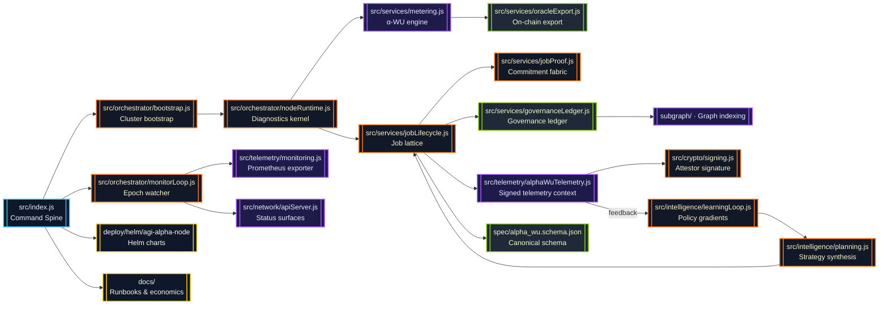
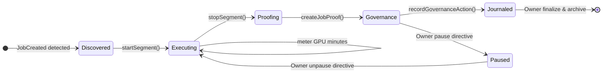
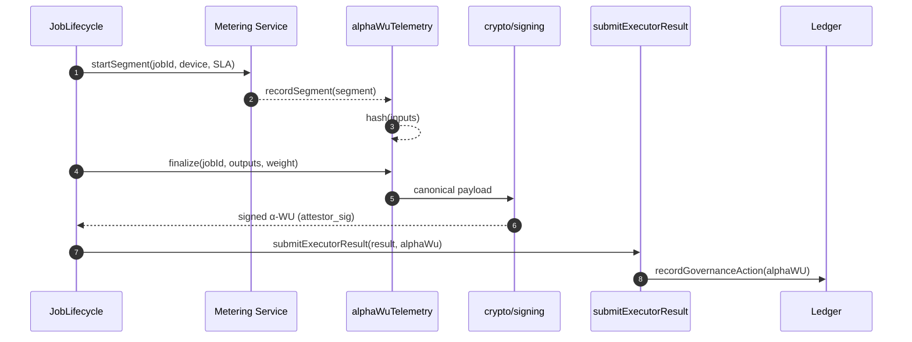

# AGI Alpha Node v0 · Sovereign Cognition Forge ⚡

<!-- markdownlint-disable MD013 MD033 -->
<p align="center">
  <picture>
    <source srcset="1.alpha.node.agi.eth.svg" type="image/svg+xml" />
    
  </picture>
</p>

<p align="center">
  <a href="https://github.com/MontrealAI/AGI-Alpha-Node-v0/actions/workflows/ci.yml">
    
  </a>
  
  
  
  <a href="spec/alpha_wu.schema.json"></a>
  
  
  
  <a href="Dockerfile"></a>
  <a href="deploy/helm/agi-alpha-node"></a>
  <a href="https://etherscan.io/address/0xa61a3b3a130a9c20768eebf97e21515a6046a1fa"></a>
  
  <a href="LICENSE"></a>
</p>

> Operate this lattice and you steer a cognition engine that signs every work unit, journals every attestation, and responds to owner directives in milliseconds—the chassis is shaped for decisive minds and non-technical operators alike.

---

## Contents

1. [Mission Profile](#mission-profile)
2. [Cognition Mesh Architecture](#cognition-mesh-architecture)
3. [α-WU Telemetry & Signing Fabric](#α-wu-telemetry--signing-fabric)
4. [Epoch Intelligence & Determinism](#epoch-intelligence--determinism)
5. [Operations & Governance Command](#operations--governance-command)
6. [Telemetry, API & CLI](#telemetry-api--cli)
7. [Quality Gates & Test Suites](#quality-gates--test-suites)
8. [CI Enforcement & Branch Protection](#ci-enforcement--branch-protection)
9. [Repository Atlas](#repository-atlas)
10. [Reference Library](#reference-library)

---

## Mission Profile

AGI Alpha Node v0 is the cognition engine that tilts economic gravity: a sovereign machine the owner can pause, redirect, or amplify on demand while it manufactures alpha at planetary scale.【F:contracts/AlphaNodeManager.sol†L1-L200】【F:src/services/jobLifecycle.js†L1-L200】

- **Total owner dominion** — [`contracts/AlphaNodeManager.sol`](contracts/AlphaNodeManager.sol) centralizes pausing, validator rotation, ENS reassignment, stake routing, slashing, and alpha issuance strictly behind `onlyOwner`, ensuring every dial stays under direct command.【F:contracts/AlphaNodeManager.sol†L17-L160】
- **Deterministic cognition fabric** — [`src/services/jobLifecycle.js`](src/services/jobLifecycle.js) orchestrates discovery → execution → proof → governance with telemetry-backed α-WUs, preventing drift across swarms.【F:src/services/jobLifecycle.js†L320-L920】
- **Owner-readable observability** — [`src/telemetry/monitoring.js`](src/telemetry/monitoring.js) and [`src/network/apiServer.js`](src/network/apiServer.js) expose Prometheus metrics plus authenticated JSON command decks, mirroring internal ledgers without lag.【F:src/network/apiServer.js†L1550-L1700】
- **Production-locked CI** — GitHub Actions (`ci.yml`) runs lint, vitest, coverage, Solidity checks, subgraph builds, policy gates, Docker smoke tests, and branch enforcement so every merge arrives already hardened.【F:.github/workflows/ci.yml†L1-L200】

---

## Cognition Mesh Architecture



Every edge is deterministic: segments are normalized, proofs replayable, and governance snapshots serialized with stable ordering. Owner operators see the exact internal state in real time.

### Deterministic Lifecycle State Machine



---

## α-WU Telemetry & Signing Fabric

The sprint delivers a canonical α-WU artifact signed by the node’s attestor key for every job. The pipeline fuses runtime telemetry, deterministic hashing, and ECDSA signatures.

- **Canonical schema** — [`spec/alpha_wu.schema.json`](spec/alpha_wu.schema.json) codifies the JSON structure (job identifiers, runtime metadata, wall-clock, CPU/GPU, hashes, signatures) and validates against draft 2020-12.【F:spec/alpha_wu.schema.json†L1-L120】
- **Language bindings** — [`src/types/alphaWu.js`](src/types/alphaWu.js) offers Zod validation, cloning, and canonical comparison utilities used across services and tests.【F:src/types/alphaWu.js†L1-L120】
- **Telemetry capture** — [`src/telemetry/alphaWuTelemetry.js`](src/telemetry/alphaWuTelemetry.js) starts contexts when jobs enter execution, records segment metrics, hashes deterministic payloads, and finalizes signed-ready α-WUs.【F:src/telemetry/alphaWuTelemetry.js†L1-L200】
- **Cryptographic signing** — [`src/crypto/signing.js`](src/crypto/signing.js) loads `NODE_PRIVATE_KEY`, canonicalizes payloads, signs with `ethers.Wallet`, and verifies incoming artifacts.【F:src/crypto/signing.js†L1-L160】
- **Lifecycle integration** — [`src/services/jobLifecycle.js`](src/services/jobLifecycle.js) now enforces α-WU production, stores signed artifacts, exposes `submitExecutorResult` and `getAlphaWUsForJob`, and rejects missing or tampered payloads.【F:src/services/jobLifecycle.js†L660-L920】【F:src/services/jobLifecycle.js†L1180-L1315】
- **Schema validation tests** — [`test/alphaWu.schema.test.js`](test/alphaWu.schema.test.js) verifies the JSON schema via Ajv and the Zod binding; [`test/alphaWuTelemetry.test.js`](test/alphaWuTelemetry.test.js) exercises deterministic hashing and timing.【F:test/alphaWu.schema.test.js†L1-L42】【F:test/alphaWuTelemetry.test.js†L1-L44】

### Telemetry Flow



The node never emits an unsigned work unit: if telemetry is disabled, `submitExecutorResult` requires an operator-supplied artifact, otherwise it finalizes and signs automatically. Missing or invalid artifacts quarantine the submission during CI and at runtime.【F:src/services/jobLifecycle.js†L705-L874】【F:test/jobLifecycle.test.js†L360-L382】

---

## Epoch Intelligence & Determinism

The deterministic metering engine continues to normalize GPU minutes, quality weights, and epoch splits:

- **GPU-minute fidelity** — wall-clock × GPU count normalized to 4 decimals, then multiplied by quality multipliers with 2-decimal α-WU rounding.【F:src/services/metering.js†L232-L320】
- **Weight orchestration** — model, VRAM tier, and SLA multipliers curated in [`src/constants/workUnits.js`](src/constants/workUnits.js). Tests cover rounding invariants and epoch splits.【F:test/metering.test.js†L1-L200】
- **Lifecycle telemetry** — `bindExecutionLoopMetering` bridges lifecycle updates with telemetry contexts and segment recording so α-WUs inherit precise execution windows.【F:src/orchestrator/nodeRuntime.js†L360-L500】

---

## Operations & Governance Command

- **Owner directives** — `NODE_PRIVATE_KEY` and `OPERATOR_ADDRESS` empower `submitExecutorResult` to sign outputs and `finalize` jobs, while `AlphaNodeManager` retains pause/unpause, validator control, and stake management.【F:contracts/AlphaNodeManager.sol†L60-L200】
- **API surface** — the operator API now enforces α-WU presence on submissions and returns the signed artifact to dashboards or downstream protocols.【F:src/network/apiServer.js†L1630-L1680】
- **Journal enrichment** — lifecycle actions append both the α-WU summary and raw artifact reference for audit trails and governance playback.【F:src/services/jobLifecycle.js†L510-L550】

### Governance Token

`$AGIALPHA` (18 decimals) is minted at [`0xa61a3b3a130a9c20768eebf97e21515a6046a1fa`](https://etherscan.io/address/0xa61a3b3a130a9c20768eebf97e21515a6046a1fa). The manager contract validates incoming ERC-20 transfers, exposes stake withdrawal to the owner, and slashes or rewards nodes based on α-WU performance.【F:contracts/AlphaNodeManager.sol†L1-L200】

---

## Telemetry, API & CLI

### CLI Highlights

```bash
# Discover jobs and journal deterministic snapshots
agi-alpha-node jobs discover --registry <JobRegistry>

# Submit executor results (auto-signs α-WU when telemetry is enabled)
agi-alpha-node jobs submit <jobId> \
  --result-file ./outputs/result.json \
  --metadata-file ./outputs/meta.json \
  --subdomain node --proof 0xdeadbeef
```

`jobs submit` now routes through `submitExecutorResult`, producing signed α-WUs and echoing the attestor signature for transparency.【F:src/index.js†L1660-L1740】

### API Surface

- `POST /jobs/:id/submit` requires `result` or `resultUri`, optionally accepts a pre-signed `alphaWu`. Response includes the ledger commitment and signed α-WU payload.【F:src/network/apiServer.js†L1630-L1680】
- `GET /jobs` exposes cached lifecycle state, including α-WU totals and journal metadata.

### Programmatic Access

```js
const lifecycle = createJobLifecycle({ /* ... */ });
const submission = await lifecycle.submitExecutorResult(jobId, {
  result: inferenceOutput,
  resultUri: 'ipfs://...',
  metadata: { score: 0.99 }
});
console.log(submission.alphaWu.attestor_sig); // Signed attestation
const artifacts = lifecycle.getAlphaWUsForJob(jobId);
```

---

## Quality Gates & Test Suites

- **Unit suites** — Vitest covers lifecycle flows, telemetry hashing, governance journaling, ENS verification, alpha work unit metrics, and API controls.【F:test/jobLifecycle.alphaWU.test.js†L1-L210】【F:test/apiServer.test.js†L1-L200】
- **Schema validation** — Ajv-driven checks enforce the canonical α-WU schema on every run.【F:test/alphaWu.schema.test.js†L1-L42】
- **Telemetry determinism** — deterministic clocks verify timing, CPU accounting, and hash stability.【F:test/alphaWuTelemetry.test.js†L1-L44】
- **CLI smoke tests** — invocation patterns ensure non-technical operators can submit results without manual signing.

Run the full suite:

```bash
npm run ci:verify
```

---

## CI Enforcement & Branch Protection

- **`ci.yml`** executes lint, vitest, coverage, Solidity lint/build, subgraph checks, security audit, policy gates, branch naming guard, and Docker smoke tests before merging.【F:.github/workflows/ci.yml†L1-L200】
- **Badges** — CI, coverage, telemetry schema, and signature badges refresh automatically, signalling a continuously green mainline.
- **Branch policy scripts** — [`scripts/verify-branch-gate.mjs`](scripts/verify-branch-gate.mjs) blocks unsafe branch patterns, while [`scripts/verify-health-gate.mjs`](scripts/verify-health-gate.mjs) validates runtime environment toggles.

---

## Repository Atlas

| Path | Purpose |
| --- | --- |
| [`spec/alpha_wu.schema.json`](spec/alpha_wu.schema.json) | Canonical α-WU JSON schema (draft 2020-12). |
| [`src/telemetry/alphaWuTelemetry.js`](src/telemetry/alphaWuTelemetry.js) | Execution telemetry contexts, hashing, and finalization. |
| [`src/crypto/signing.js`](src/crypto/signing.js) | Canonical serialization, signing, and verification. |
| [`src/services/jobLifecycle.js`](src/services/jobLifecycle.js) | Job orchestrator with α-WU enforcement, submission APIs, and governance journal integration. |
| [`src/orchestrator/nodeRuntime.js`](src/orchestrator/nodeRuntime.js) | Execution loop binding metering and telemetry to lifecycle events. |
| [`src/network/apiServer.js`](src/network/apiServer.js) | REST surface exposing job state, submission, and governance hooks. |
| [`deploy/helm/agi-alpha-node`](deploy/helm/agi-alpha-node) | Production-ready Helm chart. |
| [`docs/`](docs/) | Economics, governance, and operational playbooks. |
| [`test/`](test/) | Vitest suites for lifecycle, telemetry, API, governance, and schema validation. |

---

## Reference Library

- **Contract** — [`contracts/AlphaNodeManager.sol`](contracts/AlphaNodeManager.sol)
- **Token constants** — [`src/constants/token.js`](src/constants/token.js)
- **Work unit weights** — [`src/constants/workUnits.js`](src/constants/workUnits.js)
- **Telemetry docs** — [`docs/alpha-wu.md`](docs/alpha-wu.md)
- **CLI manual** — [`docs/operator-runbook.md`](docs/operator-runbook.md)

Operate this platform and you command a fleet of executor minds that notarize every computation, feed the governance ledger with precision, and accelerate $AGIALPHA’s flywheel. Immediate deployment, auditable telemetry, and owner-verified signatures are now the default cadence.
