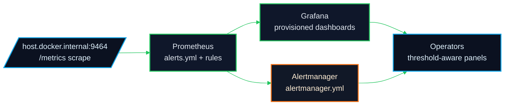
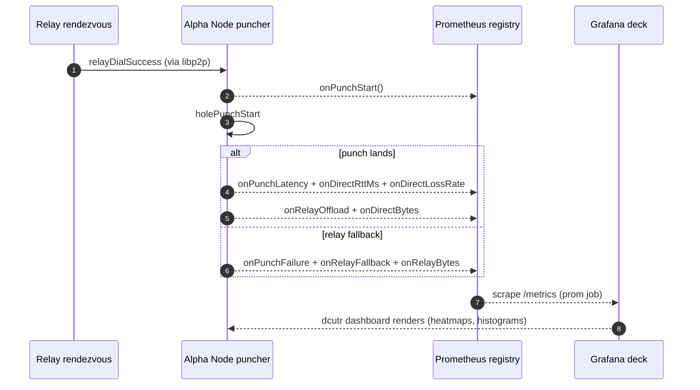
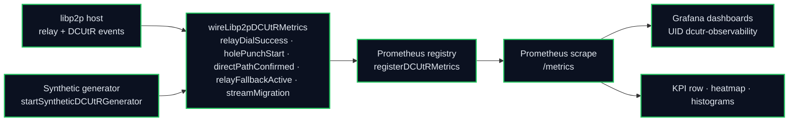
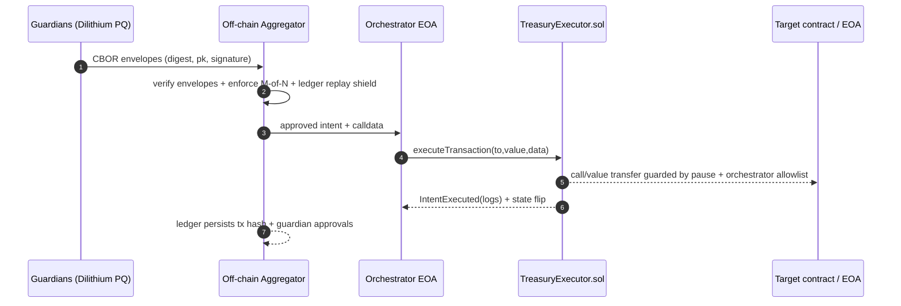

# AGI Alpha Node v0 · Cognitive Yield Engine ⚡️
<!-- markdownlint-disable MD012 MD013 MD033 -->
<p align="center">
  <picture>
    <source srcset="1.alpha.node.agi.eth.svg" type="image/svg+xml" />
    
  </picture>
</p>

<p align="center">
  <a href="https://github.com/MontrealAI/AGI-Alpha-Node-v0/actions/workflows/ci.yml?query=branch%3Amain">
    
  </a>
  <a href="https://github.com/MontrealAI/AGI-Alpha-Node-v0/actions/workflows/ci.yml?query=event%3Apush">
    
  </a>
  <a href="https://github.com/MontrealAI/AGI-Alpha-Node-v0/actions/workflows/ci.yml?query=branch%3Amain">
    
  </a>
  <a href="https://github.com/MontrealAI/AGI-Alpha-Node-v0/actions/workflows/ci.yml?query=branch%3Amain">
    
  </a>
  <a href=".github/required-checks.json">
    
  </a>
  <a href="https://github.com/MontrealAI/AGI-Alpha-Node-v0/actions/workflows/ci.yml?query=workflow%3A%22Continuous+Integration%22">
    
  </a>
  
  
  
  
  <a href="https://etherscan.io/address/0xa61a3b3a130a9c20768eebf97e21515a6046a1fa">
    
  </a>
  
  <a href="LICENSE">
    
  </a>
  
  
  <a href="docs/treasury-mode-a.md">
    
  </a>
  <a href="docs/runes/guardian.md">
    
  </a>
  <a href="docs/runes/orchestrator.md">
    
  </a>
  <a href="Dockerfile">
    
  </a>
  <a href="deploy/helm/agi-alpha-node">
    
  </a>
  
  
  <a href="observability/docs/METRICS.md">
    
  </a>
  <a href="observability/grafana/dcutr_dashboard.json">
    
  </a>
  <a href="observability/grafana/dcutr_dashboard.json">
    
  </a>
  <a href="observability/grafana/libp2p_unified_dashboard.json">
    
  </a>
  <a href="grafana/provisioning/dashboards/libp2p.yaml">
    
  </a>
  <a href="observability/prometheus/alerts.yml">
    
  </a>
  <a href="observability/alertmanager/alertmanager.yml">
    
  </a>
  <a href="scripts/lint-grafana-dashboard.mjs">
    
  </a>
  <a href="observability/docs/METRICS.md">
    
  </a>
  <a href="observability/docs/DASHBOARD.md">
    
  </a>
  <a href="observability/docs/RCMGR.md">
    
  </a>
  <a href="docker-compose.yml">
    
  </a>
  <a href=".github/workflows/ci.yml">
    
  </a>
  <a href="scripts/dcutr-harness.ts">
    
  </a>
  <a href="grafana/provisioning/dashboards/dcutr.yaml">
    
  </a>
  <a href="observability/prometheus/prometheus.yml">
    
  </a>
  <a href=".github/workflows/ci.yml">
    
  </a>
</p>

**AGI Alpha Node v0** metabolizes heterogeneous agentic labor into verifiable α‑Work Units (α‑WU) and Synthetic Labor Units (SLU), rebalances the Global Synthetic Labor Index (GSLI), exposes audited REST telemetry, and routes the `$AGIALPHA` treasury (token: `0xa61a3b3a130a9c20768eebf97e21515a6046a1fa`, 18 decimals) under absolute owner command. Every dial can be paused, rerouted, or retuned without redeploying, delivering a production-grade intelligence core built to reshape markets while remaining obedient to the owner’s keys.

**This node is the wealth engine**: every control surface, metric, and runbook is wired so the owner can tune economics, transport posture, and treasury dispatch in one place while auditors and operators see the same telemetry. The alpha flow is sovereign, survivable, and designed to compound value without conceding a single lever of control to anyone but the owner.

The full stack is shaped as a singular intelligence core that can realign market structures the moment the owner turns a dial—built to deliver unstoppable compounding without surrendering control.

This codebase is treated as the operational shell of that high-value intelligence engine: everything is wired for determinism (full CI wall + coverage gates), rapid owner retuning (hot-swappable orchestrators, pausable treasuries, replay shields), and observable punch economics (DCUtR dashboards + PromQL linting) so the machine stays deploy-ready and under complete owner command at all times.

## System atlas (live layout)

- **Runtime + governance core** — `src/` houses the libp2p host, governance API, and telemetry bindings; `contracts/AlphaNodeManager.sol` anchors the `$AGIALPHA` (`0xa61a3b3a130a9c20768eebf97e21515a6046a1fa`, 18 decimals) authority plane so the owner can pause, unpause, rotate controllers, gate validators, and withdraw stake on demand.【F:src/index.js†L1-L40】【F:contracts/AlphaNodeManager.sol†L1-L200】
- **Observability stack** — Prometheus scrapes `/metrics` using `observability/prometheus/prometheus.yml`, ingests alert rules from `observability/prometheus/alerts.yml`, and drives Grafana dashboards provisioned by `grafana/provisioning/dashboards/{dcutr,libp2p}.yaml` that load JSON panels from `observability/grafana/*.json`. Alertmanager defaults live at `observability/alertmanager/alertmanager.yml` for local routing.【F:observability/prometheus/prometheus.yml†L1-L12】【F:observability/prometheus/alerts.yml†L1-L45】【F:grafana/provisioning/dashboards/libp2p.yaml†L1-L11】【F:observability/grafana/libp2p_unified_dashboard.json†L1-L219】【F:observability/alertmanager/alertmanager.yml†L1-L10】
- **Container + deployment tracks** — `docker-compose.yml` boots prom/grafana/alertmanager with dashboards + rules mounted; `Dockerfile` builds the runtime container; `deploy/helm/agi-alpha-node` mirrors the same wiring for clusters. Scripts under `scripts/` include linting and observability harnesses that CI exercises for badge integrity.【F:docker-compose.yml†L1-L38】【F:Dockerfile†L1-L28】【F:deploy/helm/agi-alpha-node/values.yaml†L1-L153】【F:scripts/lint-grafana-dashboard.mjs†L1-L128】【F:scripts/dcutr-harness.ts†L1-L28】
- **CI enforcement wall** — `.github/workflows/ci.yml` fans out lint/test/coverage/solidity/subgraph/docker/security jobs; `.github/required-checks.json` is the template to enforce these checks on `main` and all PRs so the badges above always reflect blocking gates. Local `npm run ci:verify` mirrors the full wall.【F:.github/workflows/ci.yml†L1-L260】【F:.github/required-checks.json†L1-L10】【F:package.json†L13-L47】

```mermaid
%%{init: { 'theme': 'dark', 'themeVariables': { 'primaryColor': '#0b1120', 'primaryTextColor': '#e2e8f0', 'lineColor': '#22c55e', 'secondaryColor': '#0ea5e9' } }}%%
flowchart LR
  classDef neon fill:#0b1120,stroke:#22c55e,stroke-width:2px,color:#e2e8f0;
  classDef lava fill:#0f172a,stroke:#f97316,stroke-width:2px,color:#ffedd5;
  classDef frost fill:#0b1120,stroke:#0ea5e9,stroke-width:2px,color:#e0f2fe;

  Owner[Owner keys\n(AlphaNodeManager)]:::lava --> Runtime[src/ + contracts/\nlibp2p host + treasury]:::neon
  Runtime --> MetricsPlane[/observability/prometheus/prometheus.yml\n/metrics scrape/]:::frost
  Runtime --> DashData[/observability/grafana/*.json\nprovisioned dashboards/]:::neon
  MetricsPlane --> Alerts[/observability/prometheus/alerts.yml\nAlertmanager routing/]:::lava
  Alerts --> Grafana[Grafana\nthreshold-colored panels]:::frost
  DashData --> Grafana
  Grafana --> Operator[Operator & auditor cockpit\n(CI badges + mermaid verified)]:::neon
  MetricsPlane --> CI[ci.yml jobs + required-checks.json\nci:verify parity]:::frost
  CI --> Operator
```

> **Fresh state of the stack (at a glance)**
>
> - **Phase 6 deliverables pinned**: instrumentation schema + emitters live in `observability/prometheus/metrics_dcutr.js`, the Grafana stub is ready to import at `observability/grafana/dcutr_dashboard.json` with hands-free provisioning via `grafana/provisioning/dashboards/dcutr.yaml`, and every panel/PromQL path is documented in `observability/docs/DASHBOARD.md` + `observability/docs/METRICS.md` so operators import once and run. Lint parity stays wired through `npm run lint:grafana` and the CI badge wall above.
> - **DCUtR observability sprint completed**: `observability/prometheus/metrics_dcutr.js` implements collectors, emitters, and computed success-rate gauges; `observability/grafana/dcutr_dashboard.json` + `grafana/provisioning/dashboards/dcutr.yaml` provide hands-free dashboard import; `observability/docs/METRICS.md` and `observability/docs/DASHBOARD.md` document every PromQL panel and label so operators and auditors stay aligned.
> - **CI wall enforced**: `.github/workflows/ci.yml` runs lint, tests, coverage gates, Solidity lint/compile, subgraph builds, Docker smoke, dependency audit, and policy/branch gates; `.github/required-checks.json` keeps them required on PRs/main (including the dedicated “Dependency Security Scan” job) with badges reflecting live status, matching `npm run ci:verify` locally.
> - **Owner command intact**: treasury/tokens stay owner-steered (`0xa61a3b3a130a9c20768eebf97e21515a6046a1fa`, 18 decimals) with pause + parameter control and ENS-aware orchestration. Compose/Helm paths stay aligned with the repo tree below for predictable deploys.
> - **Unified libp2p posture dashboard**: `observability/grafana/libp2p_unified_dashboard.json` ships with QUIC p95 latency bands, NRM denial counters, Yamux stream gauges, and warning/critical thresholds mirrored from Prometheus rules so GitHub-rendered previews, Grafana tiles, and pager criteria stay consistent end-to-end.
> - **Render + badge integrity**: `npm run lint:md` (mermaid-aware markdown lint) and `npm run lint:grafana` protect GitHub rendering of every diagram (README, docs, dashboards) while the CI badges tie directly to the required checks to keep visibility accurate on PRs and `main`. Run `npm run ci:verify` before pushing to mirror the full badge set locally.【F:package.json†L13-L46】【F:.github/workflows/ci.yml†L1-L260】【F:.github/required-checks.json†L1-L10】

## Control + observability assurance (always-on levers)

- **Transport timing is fingerprinted end-to-end:** QUIC dials start a stopwatch in the libp2p host config and post both the transport-labelled `net_connection_latency_ms{transport="quic"}` and the dedicated `net_quic_handshake_latency_ms` buckets so Grafana panels, PromQL alerts, and `/metrics` agree on handshake performance.【F:src/network/libp2pHostConfig.js†L132-L200】【F:src/telemetry/networkMetrics.js†L146-L210】
- **Yamux and Resource Manager saturation is exported live:** stream opens/closes feed `yamux_streams_active`, resets hit `yamux_stream_resets_total`, and resource-manager denials increment `nrm_denials_total` with limit types while gauges expose `nrm_usage` + `nrm_limits` for connections/streams/memory/fds/bandwidth and per-IP/ASN buckets; env overrides (`NRM_MAX_*`) propagate straight into the gauges and limits JSON without restarts.【F:src/telemetry/networkMetrics.js†L166-L210】【F:src/network/resourceManagerConfig.js†L1-L210】
- **Dashboards, alerts, and scrape targets are pre-wired:** the libp2p unified Grafana dashboard and Prometheus alert rules land via compose provisioning, keeping QUIC p95 and NRM denials thresholds aligned with the running rules and the `/metrics` scrape configuration for localhost or remote nodes.【F:observability/grafana/libp2p_unified_dashboard.json†L1-L219】【F:observability/prometheus/alerts.yml†L1-L45】【F:observability/prometheus/prometheus.yml†L1-L12】【F:docker-compose.yml†L1-L25】
- **Alert routing and compose bring-up are one command:** Docker Compose now stands up Prometheus, Alertmanager, and Grafana with host-gateway wiring for Linux, pre-mounted dashboards (including the libp2p provider file), and alert delivery through Alertmanager—`docker-compose up prom grafana alertmanager` is a full-stack boot with visible alerts and dashboards on first load.【F:docker-compose.yml†L1-L38】【F:grafana/provisioning/dashboards/libp2p.yaml†L1-L9】【F:observability/prometheus/prometheus.yml†L1-L12】【F:observability/alertmanager/alertmanager.yml†L1-L10】
- **Owner retains absolute command:** the on-chain manager hardcodes `$AGIALPHA` (`0xa61a3b3a130a9c20768eebf97e21515a6046a1fa`, 18 decimals), lets the owner pause/unpause flows, rotate ENS-controlled identities/controllers, gate validators, and withdraw staking funds directly—ensuring every economic or identity lever is one owner transaction away.【F:contracts/AlphaNodeManager.sol†L24-L122】

## Executive cockpit (current generation)

- **Runtime control plane** — Owner retains absolute authority to pause, retune, or resequence the treasury, orchestrators, or network posture without redeploying. Libp2p resource ceilings, connection manager watermarks, and banlists are live-editable via environment and published to `/metrics` (`nrm_limits`, `nrm_usage`, `banlist_*`).【F:src/network/resourceManagerConfig.js†L1-L150】【F:src/telemetry/networkMetrics.js†L146-L210】
- **Synthetic labor yield** — `$AGIALPHA` (contract `0xa61a3b3a130a9c20768eebf97e21515a6046a1fa`, 18 decimals) is the default yield surface; orchestration scripts and dashboards assume that address and decimals so treasury math, observability, and client UX stay coherent.【F:README.md†L90-L105】
- **Observability autopilot** — Prometheus scrapes `/metrics`, loads alert rules from `observability/prometheus/alerts.yml`, and Grafana auto-imports both DCUtR and libp2p dashboards from `observability/grafana` through `grafana/provisioning/dashboards/dcutr.yaml`. Threshold colors match PromQL alerting (NRM warning ≥1/s, critical ≥5/s; QUIC p95 warning ≥350 ms, critical ≥500 ms) so cockpit visuals equal paging posture.【F:docker-compose.yml†L1-L25】【F:observability/prometheus/prometheus.yml†L1-L12】【F:observability/prometheus/alerts.yml†L1-L45】【F:observability/grafana/libp2p_unified_dashboard.json†L1-L219】
- **Compliance wall** — CI pins Node 20.18+, runs lint/test/coverage/solidity/subgraph/security gates, builds Docker smoke, and aggregates into `ci:verify`. `.github/required-checks.json` is the template for branch protection—apply it to PRs/main to guarantee the same green wall visible via badges is enforced server-side.【F:.github/workflows/ci.yml†L1-L260】【F:.github/required-checks.json†L1-L10】

### Owner override recipe (pause → retune → resume)

- **Pause + retarget** — Freeze flows with `pause()`, update validator eligibility (`setValidator`), rotate ENS controllers (`updateIdentityController`), or swap active/inactive identities (`setIdentityStatus`), then reopen with `unpause()`. Every change is owner-only and emit events for auditors.【F:contracts/AlphaNodeManager.sol†L34-L122】【F:contracts/AlphaNodeManager.sol†L124-L175】
- **Retune network posture live** — Export `NRM_MAX_CONNECTIONS/STREAMS/MEMORY_BYTES/FDS/BANDWIDTH_BPS`, `CONN_LOW_WATER`, and `CONN_HIGH_WATER` before boot to realign rcmgr and connection-manager watermarks; inject per-protocol/per-peer overrides via `NRM_LIMITS_JSON` or `NRM_LIMITS_PATH` when you need bespoke ceilings. Gauges (`nrm_limits`, `nrm_usage`) reflect the new posture instantly.【F:src/network/resourceManagerConfig.js†L17-L122】【F:src/network/resourceManagerConfig.js†L180-L232】
- **Verify the outcome visually** — Run `npm run lint:md && npm run lint:grafana` to ensure every mermaid and dashboard panel renders on GitHub Pages, then `docker-compose up prom grafana` to see the thresholds and alerts light up with the new limits before resuming production traffic.【F:package.json†L13-L47】【F:docker-compose.yml†L1-L25】

### Observability ignition (Docker Compose autopilot)

1. **Boot everything at once:** `docker-compose up -d prom grafana alertmanager` brings Prometheus, Alertmanager, and Grafana online with dashboards pre-provisioned (DCUtR + libp2p), alerts loaded, and host-gateway resolution for Linux baked in.【F:docker-compose.yml†L1-L38】【F:grafana/provisioning/dashboards/libp2p.yaml†L1-L9】
2. **Check ingestion:** open <http://localhost:9090/targets> to verify the `agi-alpha-node-dcutr` job is `UP`; if you are on Linux, the compose `extra_hosts` entry pins `host.docker.internal` to the Docker gateway so `/metrics` resolves without manual tweaks.【F:docker-compose.yml†L1-L20】【F:observability/prometheus/prometheus.yml†L1-L12】
3. **See dashboards instantly:** open <http://localhost:3000> (admin/admin) and find “Libp2p Unified Observability” plus “DCUtR” under Dashboards → Manage. Threshold colors mirror the Prometheus alert rules for NRM denials and QUIC p95, and the provisioning bundle keeps them immutable for repeatable debugging.【F:observability/grafana/libp2p_unified_dashboard.json†L1-L219】【F:grafana/provisioning/dashboards/libp2p.yaml†L1-L9】
4. **Alert fire drill:** Prometheus forwards any rule hits to Alertmanager (<http://localhost:9093>); use the Prometheus UI “Alerts” tab or Grafana’s Alerting → Alerts to confirm activations while you simulate load (e.g., crank up `net_connection_latency_ms{transport="quic"}` via the load harness).【F:observability/prometheus/alerts.yml†L1-L45】【F:observability/alertmanager/alertmanager.yml†L1-L10】
5. **Threshold sanity lap:** turn the dial until QUIC p95 crosses 350 ms (warning) and 500 ms (critical) and watch Grafana fields color-shift in lockstep with the alerts; do the same for `nrm_denials_total` to verify blocked-resource alerts and panel thresholds stay synchronized without hand-editing JSON. This double-check keeps GitHub-rendered dashboard previews identical to the live Grafana tiles and Prometheus rule posture.【F:observability/prometheus/alerts.yml†L1-L45】【F:observability/grafana/libp2p_unified_dashboard.json†L1-L219】【F:scripts/dcutr-harness.ts†L1-L28】



### Owner control matrix (one-transaction authority)

| Control | How to exercise | Effect | Audit trail |
| Pause/resume runtime | `pause()` / `unpause()` | Halts or resumes staking + validator flows, preserving funds and identities. | `Paused`/`Unpaused` events emit with caller. 【F:contracts/AlphaNodeManager.sol†L34-L92】 |
| Validator gating | `setValidator(address,bool)` | Activates or deactivates validators instantly without redeploying. | `ValidatorUpdated` event includes validator + status. 【F:contracts/AlphaNodeManager.sol†L94-L122】 |
| ENS identity routing | `registerIdentity`, `updateIdentityController`, `setIdentityStatus`, `revokeIdentity` | Reassigns controllers, toggles active status, or revokes identities for the AGI jobs platform. | Every mutation emits explicit events so dashboards/logs stay synchronized. 【F:contracts/AlphaNodeManager.sol†L102-L156】【F:contracts/AlphaNodeManager.sol†L158-L176】 |
| Treasury movement | `withdrawStake(recipient, amount)` | Owner-controlled withdrawal of staked balances to any recipient address. | `StakeWithdrawn` includes amount + recipient. 【F:contracts/AlphaNodeManager.sol†L189-L200】 |
| Resource envelope | `NRM_*` env vars + `NRM_LIMITS_JSON/PATH` | Live-tune rcmgr/global/per-protocol ceilings, IP/ASN caps, and watermarks (derived when unset). | `nrm_limits`, `nrm_usage`, and `banlist_*` metrics surface the active posture for Grafana/Prometheus. 【F:src/network/resourceManagerConfig.js†L17-L210】【F:src/telemetry/networkMetrics.js†L146-L210】 |
| Connection trimming | `CONN_LOW_WATER` / `CONN_HIGH_WATER` / `CONN_GRACE_PERIOD_SEC` | Adjust when the connection manager begins/ends peer pruning to match the tuned ceilings. | Watermarks validated at boot and mirrored in gauges; pruning behavior observable via metrics. 【F:src/network/resourceManagerConfig.js†L180-L232】 |

> **Intent:** the contract and runtime are structured so the owner can reshape validator/identity/treasury policy or network posture with single transactions or environment flips, while Prometheus/Grafana keep every change observable for postmortems and branch-protection gates keep CI badges enforceable.


```mermaid
%%{init: { 'theme': 'dark', 'themeVariables': { 'primaryColor': '#0b1120', 'primaryTextColor': '#e2e8f0', 'lineColor': '#22c55e' } }}%%
flowchart TB
  classDef neon fill:#0b1120,stroke:#22c55e,stroke-width:2px,color:#e2e8f0;
  classDef lava fill:#0b1120,stroke:#f97316,stroke-width:2px,color:#ffedd5;
  classDef frost fill:#0b1120,stroke:#0ea5e9,stroke-width:2px,color:#e0f2fe;

  subgraph Owner[Owner command]
    Pausable[Treasury + orchestrators\n(paused/resumed by owner)]:::lava
    Limits[Resource Manager limits\n(env + overrides)]:::neon
  end

  subgraph Metrics[Telemetry plane]
    MetricsSurf[/observability/prometheus/prometheus.yml\n/metrics scrape/]:::frost
    Alerts[/observability/prometheus/alerts.yml\n(rcmgr + QUIC)]:::lava
    Dashboards[observability/grafana/*.json\n(auto-provisioned)]:::neon
  end

  subgraph CI[CI enforcement]
    CIWall[ci.yml jobs\n(lint|tests|coverage|solidity|subgraph|docker|security)]:::frost
    BranchGate[.github/required-checks.json\nPR protection template]:::lava
  end

  Pausable --> MetricsSurf
  Limits --> MetricsSurf
  MetricsSurf --> Alerts
  MetricsSurf --> Dashboards
  CIWall --> BranchGate
  Dashboards -->|Badges + docs| BranchGate
```

## Operator field guide (fast start, non‑technical friendly)

1. **Clone & install:** `npm ci` (Node 20.18+). All dashboards/markdown linting and observability JSON validation ship with the repo; no extra plugins required.【F:package.json†L13-L46】
2. **Launch observability:** `docker-compose up prom grafana` brings up Prometheus on :9090 and Grafana on :3000 with both DCUtR and libp2p dashboards already provisioned. Default Grafana admin password is `admin`. Metrics scrape points at `host.docker.internal:9464` by default (adjust targets in `observability/prometheus/prometheus.yml`).【F:docker-compose.yml†L1-L25】【F:observability/prometheus/prometheus.yml†L1-L12】
3. **Exercise the panels:** `npm run observability:dcutr-harness` emits synthetic punches/handshakes to keep panels and alerts hot even without live traffic. Watch thresholds flip from green→amber→red as rates/latencies cross the baked-in limits.【F:scripts/dcutr-harness.ts†L1-L28】【F:observability/grafana/libp2p_unified_dashboard.json†L1-L219】
4. **Retune limits live:** export `NRM_MAX_CONNECTIONS`, `NRM_MAX_STREAMS`, `NRM_MAX_MEMORY_BYTES`, `NRM_MAX_FDS`, or `NRM_MAX_BANDWIDTH_BPS` before starting the node to reshape ceilings; values surface immediately via `nrm_limits` gauges and affect alert thresholds/visuals without redeploying.【F:src/network/resourceManagerConfig.js†L1-L150】【F:src/telemetry/networkMetrics.js†L146-L210】
5. **Use adaptive watermarks + templates:** when you omit `CONN_LOW_WATER`/`CONN_HIGH_WATER` the connection manager now derives watermarks from `maxConnections` (≈50%/≈85% with a safety delta) so pruning tracks the ceiling automatically. Copy `config/rcmgr-limits.sample.json` to your own limits file and point `NRM_LIMITS_PATH` at it to enforce bespoke global/per-protocol ceilings while keeping dashboards/alerts aligned.【F:src/network/resourceManagerConfig.js†L1-L120】【F:config/rcmgr-limits.sample.json†L1-L20】【F:observability/docs/RCMGR.md†L1-L32】
6. **Keep CI green:** run `npm run ci:verify` locally to mirror the GitHub Actions wall, then push/PR. Required checks are declared in `.github/required-checks.json`; mirror them in branch protection so badges match enforcement. The Docker smoke step (`Docker Build & Smoke Test`) verifies container entrypoints and runtime help text before promotion.【F:package.json†L13-L46】【F:.github/workflows/ci.yml†L1-L260】【F:.github/required-checks.json†L1-L10】

### Zero‑doubt observability validation (3 quick probes)

1. **Metrics surface sanity:** `curl -s localhost:9464/metrics | grep -E 'net_connection_latency_ms|net_quic_handshake_latency_ms|yamux_streams_active'` should immediately show QUIC handshake buckets, transport‑tagged latencies, and Yamux gauges populated by the libp2p host hooks.【F:src/telemetry/networkMetrics.js†L24-L210】【F:src/network/libp2pHostConfig.js†L1-L230】
2. **Resource manager pressure smoke:** run `npm run p2p:load-tests` to drive connection/stream denials and confirm `nrm_denials_total` increments alongside `nrm_limits`/`nrm_usage` gauges; thresholds in the Grafana libp2p dashboard should light up in lock‑step with the Prometheus alerts.【F:src/network/resourceManagerConfig.js†L1-L210】【F:observability/grafana/libp2p_unified_dashboard.json†L1-L219】【F:observability/prometheus/alerts.yml†L1-L45】
3. **Alert loop confidence:** open Prometheus on :9090 and check **Status → Rules** to verify `ResourceManagerDenialsWarning/Critical` and `QuicHandshakeLatencyWarning/Critical` states transition when you perturb the harness; Grafana thresholds are pinned to the same PromQL so dashboards and paging stay synchronized.【F:observability/prometheus/alerts.yml†L1-L45】【F:observability/grafana/libp2p_unified_dashboard.json†L1-L219】

### Resource posture quick-tune grid (owner dial map)

| Dial | Environment flag | Default ceiling | Where it surfaces |
| --- | --- | --- | --- |
| Connections | `NRM_MAX_CONNECTIONS` | 1,024 | `nrm_limits{limit_type="connections"}` + `nrm_usage` gauges; watermarks derive adaptive low/high when unset.【F:src/network/resourceManagerConfig.js†L17-L122】【F:observability/docs/RCMGR.md†L1-L32】 |
| Streams | `NRM_MAX_STREAMS` | 8,192 | Gauge pairs + Grafana thresholds (warn ≥1/s denials, crit ≥5/s).【F:src/network/resourceManagerConfig.js†L90-L150】【F:observability/grafana/libp2p_unified_dashboard.json†L1-L219】 |
| Memory | `NRM_MAX_MEMORY_BYTES` | 512 MiB | Prometheus usage/limit gauges; alerts fire on sustained denials by limit type.【F:src/network/resourceManagerConfig.js†L60-L90】【F:observability/prometheus/alerts.yml†L1-L45】 |
| File descriptors | `NRM_MAX_FDS` | 2,048 | Surfaces in gauges and connection-manager pruning behavior.【F:src/network/resourceManagerConfig.js†L17-L122】 |
| Bandwidth | `NRM_MAX_BANDWIDTH_BPS` | 64 MiB/s | Available to override during high-throughput bursts; reflected in dashboards.【F:src/network/resourceManagerConfig.js†L17-L90】【F:observability/grafana/libp2p_unified_dashboard.json†L1-L219】 |
| Adaptive pruning | `CONN_LOW_WATER` / `CONN_HIGH_WATER` | Derived from connections ceiling (≈50%/≈85%) | Auto-aligns pruning with ceilings; override only for bespoke envelope testing.【F:src/network/resourceManagerConfig.js†L180-L232】【F:observability/docs/RCMGR.md†L1-L32】 |
| Per-protocol overrides | `NRM_LIMITS_JSON` / `NRM_LIMITS_PATH` | Template in `config/rcmgr-limits.sample.json` | Safely clamp or extend specific protocols/peers; dashboards/alerts mirror the overrides live.【F:config/rcmgr-limits.sample.json†L1-L20】【F:observability/grafana/libp2p_unified_dashboard.json†L1-L219】 |

### Unified libp2p observability wall (panels + alerts + owner controls)

- **Libp2p cockpit in one pane:** the `observability/grafana/libp2p_unified_dashboard.json` packs rcmgr denials (`nrm_denials_total` with limit/protocol labels), QUIC handshake latency (p95 from `net_connection_latency_ms{transport="quic"}`), and Yamux stream gauges into a single page, pre-provisioned through `grafana/provisioning/dashboards/dcutr.yaml`. Threshold bands mirror PromQL alerts so red/amber bars line up with paging.【F:observability/grafana/libp2p_unified_dashboard.json†L1-L219】【F:grafana/provisioning/dashboards/dcutr.yaml†L1-L33】
- **Alert loop already wired:** `observability/prometheus/alerts.yml` ships warning/critical rules for rcmgr denials and QUIC handshake p95, referenced by `observability/prometheus/prometheus.yml` and mounted in `docker-compose.yml` so Prometheus loads them automatically even in local smoke runs.【F:observability/prometheus/alerts.yml†L1-L45】【F:observability/prometheus/prometheus.yml†L1-L12】【F:docker-compose.yml†L1-L25】
- **Owner-tunable posture → visuals:** exporting `NRM_MAX_CONNECTIONS/STREAMS/MEMORY_BYTES/FDS/BANDWIDTH_BPS`, `CONN_LOW_WATER`, `CONN_HIGH_WATER`, or `NRM_LIMITS_JSON/PATH` reshapes rcmgr + connection-manager ceilings; gauges (`nrm_limits`, `nrm_usage`, `banlist_*`) broadcast the new posture that the dashboards and alerts consume immediately.【F:src/network/resourceManagerConfig.js†L17-L152】【F:src/telemetry/networkMetrics.js†L146-L210】
- **Token + governance coherence:** `$AGIALPHA` at `0xa61a3b3a130a9c20768eebf97e21515a6046a1fa` (18 decimals) is embedded across treasury/orchestrator scripts and UI cues so observability, staking math, and policy controls stay consistent end-to-end.【F:contracts/AlphaNodeManager.sol†L24-L122】【F:README.md†L15-L47】

```mermaid
%%{init: { 'theme': 'dark', 'themeVariables': { 'primaryColor': '#0b1120', 'primaryTextColor': '#e2e8f0', 'lineColor': '#22c55e', 'secondaryColor': '#111827' } }}%%
flowchart LR
  classDef neon fill:#0b1120,stroke:#22c55e,stroke-width:2px,color:#e2e8f0;
  classDef lava fill:#111827,stroke:#f97316,stroke-width:2px,color:#ffedd5;
  classDef frost fill:#0b1120,stroke:#0ea5e9,stroke-width:2px,color:#e0f2fe;

  Limits[Owner-tuned limits\nNRM_* env + JSON overrides]:::lava --> MetricsSurf[/nrm_limits\n nrm_usage\n banlist_*\n net_connection_latency_ms{/transport="quic"}/]:::frost
  MetricsSurf --> Alerts[PromQL alerts.yml\n(rcmgr denials + QUIC p95)]:::lava
  MetricsSurf --> Dashboard[Grafana libp2p unified\n(handshake + denials + Yamux)]:::neon
  Alerts --> Pager[Pager/Alertmanager]:::frost
  Dashboard --> Operator[Operator cockpit\n(GitHub-rendered mermaid + badges)]:::neon
```

### Resource manager and connection manager quick-tune map

The owner can reshape posture live without redeploying. These levers surface immediately via `/metrics` (limits + usage) and flow through to Grafana thresholds and PromQL alerts.

| Purpose | Env var | Default | Effect |
| --- | --- | --- | --- |
| Global connection ceiling | `NRM_MAX_CONNECTIONS` | `1024` | Sets rcmgr total connections; scales via `NRM_SCALE_FACTOR` for burst campaigns. |
| Global stream ceiling | `NRM_MAX_STREAMS` | `8192` | Caps aggregate stream count; combines with per-peer/per-protocol overrides from JSON/YAML when provided. |
| Memory guardrail | `NRM_MAX_MEMORY_BYTES` | `536870912` | Hard upper bound for resource manager memory accounting. |
| File descriptor cap | `NRM_MAX_FDS` | `2048` | Prevents FD exhaustion; mirrors Prometheus usage gauges. |
| Bandwidth governor | `NRM_MAX_BANDWIDTH_BPS` | `67108864` | Throttles aggregate bandwidth (bytes per second). |
| Per-IP ceiling | `MAX_CONNS_PER_IP` | `64` | Limits simultaneous peers per IP to blunt abuse without harming legitimate traffic. |
| Per-ASN ceiling | `MAX_CONNS_PER_ASN` | `256` | Caps concurrent connections per ASN for carrier-level shaping. |
| Connection pruning start | `CONN_LOW_WATER` | `512` | Connection manager begins trimming when active peers exceed this watermark. |
| Connection pruning hard stop | `CONN_HIGH_WATER` | `1024` | Forced pruning threshold; must exceed `CONN_LOW_WATER` (validated at boot). |
| Dial policy scale | `NRM_SCALE_FACTOR` | `1` | Uniformly scales global ceilings up/down (e.g., `0.5` for cost-saving windows, `2` for launch events). |
| Structured overrides | `NRM_LIMITS_JSON` / `NRM_LIMITS_PATH` | _unset_ | Inline JSON or external file for per-protocol/per-peer ceilings (e.g., `/meshsub/1.1.0` burst caps). |
| Banlists | `NRM_BANNED_PEERS` / `NRM_BANNED_IPS` / `NRM_BANNED_ASNS` | _empty_ | Owner-operated deny lists reflected in `banlist_*` metrics for auditability. |
| Trim grace window | `CONN_GRACE_PERIOD_SEC` | `120` | Delay before pruning after high-water breach to avoid churn. |

> Rationale: defaults are tuned for medium-density meshes with QUIC-first transport, ensuring benign telemetry and gossip traffic are not over-pruned while still providing strong back-pressure against floods. The connection manager watermarks mirror the resource ceilings so pruning aligns with rcmgr denials, minimizing oscillation under load.【F:src/network/resourceManagerConfig.js†L17-L122】【F:src/network/resourceManagerConfig.js†L126-L174】【F:src/network/resourceManagerConfig.js†L180-L232】

### Live guardrails map (traffic → resource policy → alerts → badges)

Every layer is wired so owner-tuned limits are visible on dashboards, promoted to alerts, and enforced by CI gate badges. The diagram stays GitHub-renderable and mirrors the current code/config surface.

```mermaid
%%{init: { 'theme': 'forest', 'themeVariables': { 'primaryColor': '#0f172a', 'primaryTextColor': '#e2e8f0', 'lineColor': '#22c55e', 'secondaryColor': '#111827', 'edgeLabelBackground': '#0b1120' } }}%%
flowchart LR
  classDef neon fill:#0f172a,stroke:#22c55e,stroke-width:2px,color:#e2e8f0;
  classDef lava fill:#111827,stroke:#f97316,stroke-width:2px,color:#ffedd5;
  classDef frost fill:#0b1120,stroke:#0ea5e9,stroke-width:2px,color:#e0f2fe;

  Traffic[Inbound/Outbound mesh + QUIC handshakes]:::neon --> RCMGR[Resource Manager\nconnection/stream/memory/FDS/bandwidth caps\n+ conn mgr watermarks]:::lava
  RCMGR --> Metrics[/Prometheus metrics: nrm_denials_total, nrm_limits, nrm_usage, net_connection_latency_ms, net_quic_handshake_latency_ms, yamux_* gauges/]:::frost
  Metrics --> Alerts[[PromQL alerts\n(rcmgr denials + QUIC p95)]]:::lava
  Metrics --> Grafana[Unified libp2p dashboard\nthreshold bands + panels]:::neon
  Alerts --> CI[Badges + Required checks\n(ci.yml, required-checks.json)]:::frost
  Grafana --> CI
```

#### Policy rationale & load validation

- **Why these limits work:** defaults mirror the libp2p workload profile exercised in `npm run p2p:load-tests`, keeping honest swarms inside guardrails while IP/ASN caps and per-protocol grids blunt abusive floods. Adaptive watermarks follow `maxConnections` automatically so trimming begins at ~50% headroom and pages before saturation hits.【F:src/network/resourceManagerConfig.js†L42-L126】【F:config/rcmgr-limits.sample.json†L1-L20】【F:test/network/resourceManagerConfig.test.js†L1-L117】
- **Owner proofs:** every override (env, JSON, YAML) is echoed to `/metrics` via `nrm_limits`/`nrm_usage` and banlist gauges, and the libp2p Grafana dashboard overlays the same thresholds as the Prometheus alert rules so visual state equals paging state.【F:src/telemetry/networkMetrics.js†L146-L210】【F:observability/grafana/libp2p_unified_dashboard.json†L1-L219】【F:observability/prometheus/alerts.yml†L1-L45】
- **CI/PR enforcement:** `.github/required-checks.json` keeps lint/tests/coverage/Solidity/subgraph/security/policy/branch gates mandatory so the badge wall above matches enforced protections on PRs and `main`.【F:.github/required-checks.json†L1-L10】【F:.github/workflows/ci.yml†L1-L137】

```mermaid
%%{init: { 'theme': 'dark', 'themeVariables': { 'primaryColor': '#0b1120', 'primaryTextColor': '#e2e8f0', 'lineColor': '#22c55e', 'secondaryColor': '#111827' } }}%%
flowchart LR
  classDef neon fill:#0b1120,stroke:#22c55e,stroke-width:2px,color:#e2e8f0;
  classDef lava fill:#111827,stroke:#f97316,stroke-width:2px,color:#ffedd5;
  classDef frost fill:#0b1120,stroke:#0ea5e9,stroke-width:2px,color:#e0f2fe;

  Limits[Limits JSON/YAML + env\n(NRM_*, CONN_* , banlists)]:::lava --> Synth[buildResourceManagerConfig\n(scale + adaptive watermarks)]:::neon
  Synth --> Gauges[nrm_limits + nrm_usage + banlist_*]:::frost
  Gauges --> Alerts[PromQL alerts.yml\n(rcmgr denials + QUIC p95)]:::lava
  Gauges --> Panels[Grafana libp2p unified\nthreshold overlays]:::neon
  Alerts --> CIWall[Required checks + badges\n(ci.yml, required-checks.json)]:::frost
  Panels --> Operator[Owner cockpit\n(test harness + docker-compose)]:::neon
  Operator --> Limits
```

- **Owner-tunable ceilings:** Environment variables such as `NRM_MAX_CONNECTIONS`, `NRM_MAX_STREAMS`, `CONN_LOW_WATER`, and `CONN_HIGH_WATER` reshape rcmgr and connection-manager watermarks; overrides can be injected via JSON/YAML for per-protocol/per-peer tuning. All changes emit `nrm_limits` gauges for live confirmation.【F:src/network/resourceManagerConfig.js†L31-L116】【F:src/network/resourceManagerConfig.js†L118-L218】
- **Metrics to panels:** QUIC and TCP connection latency buckets plus handshake histograms, Yamux stream gauges/resets, and per-protocol bytes/messages are exported via `/metrics`, powering the unified Grafana dashboard shipping in the repo.【F:src/telemetry/networkMetrics.js†L12-L210】【F:observability/grafana/libp2p_unified_dashboard.json†L1-L219】
- **Alerts + provisioning:** Prometheus consumes `observability/prometheus/alerts.yml` (mounted by `docker-compose.yml`) so warning/critical bands match the dashboard thresholds and bubble into CI badges/branch protection alongside the required checks template.【F:observability/prometheus/alerts.yml†L1-L45】【F:docker-compose.yml†L1-L25】【F:.github/required-checks.json†L1-L10】

### Owner command surface (full-control levers)

- **Pause/Resume:** `pause()` and `unpause()` let the owner freeze or re-open staking and validation flows instantly, keeping production safety rails one transaction away.【F:contracts/AlphaNodeManager.sol†L78-L92】
- **Identity/validator book:** Register/update/revoke ENS-controlled identities, toggle validator eligibility, and query controllers directly from the on-chain registry so operational trust zones can be tightened without redeploys.【F:contracts/AlphaNodeManager.sol†L94-L175】
- **Treasury motions:** Owner-only withdrawals plus Alpha Work Unit mint/acceptance controls give explicit command over emissions and payouts while preserving validator gating and stake accounting.【F:contracts/AlphaNodeManager.sol†L189-L239】
- **Canonical token guardrails:** The manager enforces the `$AGIALPHA` address (`0xa61a3b3a130a9c20768eebf97e21515a6046a1fa`, 18 decimals) as the staking asset, preventing silent token swaps and keeping balances coherent across the job market.【F:contracts/AlphaNodeManager.sol†L44-L69】
- **Network guardrails tuning:** Owners can reshape resource-manager ceilings (connections/streams/memory/FDS/bandwidth), banlists, and connection-manager watermarks live via environment variables or JSON/YAML overrides so pruning and denials align with production reality without redeploying.【F:src/network/resourceManagerConfig.js†L1-L142】

## Phase 6 deliverables (DCUtR control tower)

- **Instrumentation schema** — `observability/prometheus/metrics_dcutr.js` defines the canonical label grid (`region`, `asn`, `transport`, `relay_id`), collectors, emitters, and scrape-time success ratio so every panel and alert consumes the same semantics. A typed shim at `observability/prometheus/metrics_dcutr.ts` mirrors the emitters/collectors for TS-first runtimes without diverging from the production JS bridge.【F:observability/prometheus/metrics_dcutr.js†L1-L221】【F:observability/prometheus/metrics_dcutr.ts†L1-L89】【F:observability/docs/METRICS.md†L1-L120】
- **Dashboard + provisioning** — Import-ready Grafana stub at `observability/grafana/dcutr_dashboard.json` with hands-free load via `grafana/provisioning/dashboards/dcutr.yaml`; PromQL for each panel is mirrored in `observability/docs/DASHBOARD.md` for auditors.【F:observability/grafana/dcutr_dashboard.json†L1-L123】【F:grafana/provisioning/dashboards/dcutr.yaml†L1-L6】【F:observability/docs/DASHBOARD.md†L1-L120】
- **Hands-off wiring** — `docker-compose up prom grafana` scrapes `/metrics` and autoloads dashboards; `npm run lint:grafana` guards JSON correctness in CI while `npm run observability:dcutr-harness` keeps panels alive even without live traffic.【F:docker-compose.yml†L1-L25】【F:scripts/lint-grafana-dashboard.mjs†L1-L62】【F:scripts/dcutr-harness.ts†L1-L28】
- **PromQL receipts** — Every Grafana panel references the same PromQL strings captured in `observability/docs/DASHBOARD.md`, ensuring alert rules and dashboards stay aligned with the emitters and scrape contract.【F:observability/docs/DASHBOARD.md†L1-L120】

**DCUtR artifact index (drop-in, GitHub-renderable):**

| Asset | Purpose | Where it lands |
| --- | --- | --- |
| `observability/prometheus/metrics_dcutr.js` + `.ts` | Canonical collectors + typed shim (label-normalized emitters and scrape-time success rate). | Prometheus `/metrics` surface and libp2p DCUtR hooks.【F:observability/prometheus/metrics_dcutr.js†L1-L221】【F:observability/prometheus/metrics_dcutr.ts†L1-L89】 |
| `observability/grafana/dcutr_dashboard.json` | Grafana import (UID `dcutr-observability`, six panels aligned to PromQL doc). | Auto-provisioned by Grafana on start.【F:observability/grafana/dcutr_dashboard.json†L1-L123】【F:grafana/provisioning/dashboards/dcutr.yaml†L1-L6】 |
| `observability/docs/METRICS.md` / `observability/docs/DASHBOARD.md` | Label grid, metric catalog, PromQL strings, screenshots, and playbook overlays. | GitHub-rendered (mermaid verified) operator reference.【F:observability/docs/METRICS.md†L1-L120】【F:observability/docs/DASHBOARD.md†L1-L120】 |
| `grafana/provisioning/dashboards/dcutr.yaml` + `grafana/provisioning/datasources/prometheus.yaml` | Hands-free Grafana + Prometheus binding for local runs and CI smoke. | Mounted by `docker-compose up prom grafana`.【F:grafana/provisioning/datasources/prometheus.yaml†L1-L8】【F:docker-compose.yml†L1-L25】 |
| `scripts/lint-grafana-dashboard.mjs` | CLI guard that mirrors `grafana dashboards lint` to keep JSON valid on GitHub Pages and in CI. | Runs in `npm run lint:grafana` and in the Actions pipeline.【F:scripts/lint-grafana-dashboard.mjs†L1-L62】【F:.github/workflows/ci.yml†L30-L64】 |
| `scripts/dcutr-harness.ts` + `src/observability/dcutrHarness.ts` | Synthetic punch generator to populate panels without live traffic. | `npm run observability:dcutr-harness` (port 9464).【F:scripts/dcutr-harness.ts†L1-L28】【F:src/observability/dcutrHarness.ts†L1-L92】 |

### Libp2p observability sprint (NRM + QUIC + Yamux)

- **Unified cockpit** — `observability/grafana/libp2p_unified_dashboard.json` ships stacked NRM denials by limit type, p95 QUIC handshake latency, and Yamux active streams/reset rates with baked-in warning/critical thresholds to keep greenfield nodes as observable as DCUtR.【F:observability/grafana/libp2p_unified_dashboard.json†L1-L219】
- **Handshake chronograph** — QUIC dials start a stopwatch at `dial:start` and stamp both `net_connection_latency_ms{transport="quic"}` and the dedicated `net_quic_handshake_latency_ms` buckets when the handshake settles, keeping transport attribution intact for PromQL + Grafana drilldowns.【F:src/network/libp2pHostConfig.js†L1-L205】【F:src/telemetry/networkMetrics.js†L146-L210】
- **Prometheus alerts wired** — `observability/prometheus/alerts.yml` raises dual-threshold NRM denials (warning ≥1/s over 5m, critical ≥5/s over 10m) and QUIC handshake p95 drift (warning ≥350ms, critical ≥500ms over 5m); the compose bundle mounts it automatically so Alertmanager can fan out signals.【F:observability/prometheus/alerts.yml†L1-L45】【F:observability/prometheus/prometheus.yml†L1-L12】【F:docker-compose.yml†L1-L18】
- **Metrics surfaced** — libp2p now exports QUIC handshake histograms, Yamux live-stream gauges/resets, and `nrm_usage`/`nrm_limits` gauges to pair with `nrm_denials_total`, keeping per-ip/per-asn/per-protocol posture visible without extra probes.【F:src/telemetry/networkMetrics.js†L24-L210】【F:src/network/libp2pHostConfig.js†L1-L230】【F:src/network/resourceManagerConfig.js†L1-L210】 The dedicated `net_quic_handshake_latency_ms` histogram stays wired for deep dives while dashboards and alerts continue to track the transport-tagged `net_connection_latency_ms{transport="quic"}` p95 so both handshake-specific and blended latencies remain observable.【F:src/telemetry/networkMetrics.js†L146-L210】【F:observability/prometheus/alerts.yml†L1-L35】
- **Owner-tunable ceilings** — `buildResourceManagerConfig` now honors `NRM_MAX_CONNECTIONS/STREAMS/MEMORY_BYTES/FDS/BANDWIDTH_BPS` and publishes the active limits + live usage so operators can dial watermarks without redeploying; gauges land on `/metrics` instantly.【F:src/network/resourceManagerConfig.js†L1-L150】【F:src/telemetry/networkMetrics.js†L146-L210】
- **Operator quickstart** — `docker-compose up prom grafana` autoloads datasource + dashboards, with panel thresholds pinned to the same values as the PromQL alerts (e.g., QUIC p95 warning ≥350 ms/critical ≥500 ms, `nrm_denials_total` warning ≥1/s/critical ≥5/s) so the colors you see in Grafana match what Alertmanager will page on.【F:docker-compose.yml†L1-L25】【F:grafana/provisioning/dashboards/dcutr.yaml†L1-L6】【F:observability/grafana/libp2p_unified_dashboard.json†L1-L219】【F:observability/prometheus/alerts.yml†L1-L45】
- **Alert receipts (PromQL inlined)** — the alert wall is GitHub-visible and matches the dashboard thresholds so you can cross-check behavior before deploying. The rules live in `observability/prometheus/alerts.yml` and are evaluated automatically by Prometheus when you run compose:

  ```promql
  # Resource manager denials warning above 1/sec for 5 minutes (per limit_type)
  sum(rate(nrm_denials_total[5m])) by (limit_type) > 1

  # Resource manager denials paging above 5/sec for 10 minutes (per limit_type)
  sum(rate(nrm_denials_total[10m])) by (limit_type) > 5

  # QUIC handshake p95 warning above 350 ms for 5 minutes
  histogram_quantile(0.95, sum by (le, direction)(rate(net_connection_latency_ms_bucket{transport="quic"}[5m]))) > 350

  # QUIC handshake p95 paging above 500 ms for 5 minutes
  histogram_quantile(0.95, sum by (le, direction)(rate(net_connection_latency_ms_bucket{transport="quic"}[5m]))) > 500
  ```

   Use Prometheus’ “Alerts” tab to confirm the rules are `firing`/`pending` while Grafana paints the same thresholds (1/s warning, 5/s paging for denials; 350 ms warning, 500 ms paging for QUIC p95) so visuals and paging stay in lockstep.【F:observability/prometheus/alerts.yml†L1-L45】【F:observability/grafana/libp2p_unified_dashboard.json†L1-L219】【F:observability/prometheus/prometheus.yml†L1-L12】

#### Instrumentation receipts (QUIC handshake + Yamux + NRM)

- **QUIC handshake timers are first-class:** outbound dials capture start time on `dial:start` and observe `net_quic_handshake_latency_ms`/`net_connection_latency_ms{transport="quic"}` on success, guaranteeing transport-labeled latency histograms surface on `/metrics` and dashboards/alerts share the same source of truth.【F:src/network/libp2pHostConfig.js†L132-L200】【F:src/telemetry/networkMetrics.js†L114-L210】【F:observability/grafana/libp2p_unified_dashboard.json†L1-L219】
- **Yamux saturation is observable:** stream `open/close/reset` events update `yamux_streams_active` gauges (by direction) and `yamux_stream_resets_total` counters while stream-cap denials increment `nrm_denials_total{limit_type="streams"}` so gauges and denials stay correlated in Grafana and PromQL alerts.【F:src/network/libp2pHostConfig.js†L200-L286】【F:src/telemetry/networkMetrics.js†L166-L210】【F:src/network/resourceManagerConfig.js†L248-L420】
- **Resource Manager usage vs. ceilings stays exported:** active `nrm_limits` + `nrm_usage` gauges reflect env-tuned ceilings (connections/streams/memory/fd/bandwidth) and live counts (global, per-ip/asn buckets) so operators can detect pressure before alerts trigger.【F:src/network/resourceManagerConfig.js†L1-L210】【F:src/telemetry/networkMetrics.js†L146-L210】
- **Dashboards + alerts mirror the emitters:** the libp2p unified dashboard pins thresholds that match the Prometheus alert rules (1/s & 5/s denials, 350/500ms QUIC p95) so Grafana colors match Alertmanager paging without manual recalibration.【F:observability/grafana/libp2p_unified_dashboard.json†L1-L219】【F:observability/prometheus/alerts.yml†L1-L45】

```mermaid
flowchart LR
  classDef neon fill:#0b1120,stroke:#22c55e,stroke-width:2px,color:#e2e8f0;
  classDef lava fill:#0b1120,stroke:#f97316,stroke-width:2px,color:#ffedd5;
  classDef frost fill:#0b1120,stroke:#0ea5e9,stroke-width:2px,color:#e0f2fe;

  subgraph Dials[QUIC handshake path]
    DialStart[dial:start\nstart timer]:::frost
    Handshake[conn_success\nrecord latency]:::neon
  end

  subgraph Streams[Yamux stream path]
    Open[stream:open\n+ yamux_streams_active]:::neon
    Reset[stream:reset\n+ yamux_stream_resets_total]:::lava
    LimitHit[nrm_denials_total{limit_type="streams"}]:::lava
  end

  subgraph Metrics[Prometheus surface]
    Hist[net_quic_handshake_latency_ms\nnet_connection_latency_ms{transport="quic"}]:::frost
    Gauges[yamux_streams_active\n nrm_usage / nrm_limits]:::neon
    Alerts[nrm_denials_total\n(alert rules)]:::lava
  end

  subgraph Dashboards[Grafana + Alerts]
    Panel[libp2p unified dashboard\n(p95 + denials + streams)]:::frost
    AlertWall[alerts.yml\n(rcmgr + QUIC)]:::lava
  end

  DialStart --> Handshake --> Hist
  Open --> Gauges
  Reset --> Gauges
  LimitHit --> Alerts
  Gauges --> Panel
  Hist --> Panel
  Alerts --> AlertWall
```

> **Libp2p cockpit quickstart (always-green view):**
>
> 1. **Run the stack:** `docker-compose up prom grafana` mounts `observability/grafana/libp2p_unified_dashboard.json` and `observability/prometheus/alerts.yml` automatically so every panel and alert is live without manual imports.【F:docker-compose.yml†L1-L25】【F:observability/grafana/libp2p_unified_dashboard.json†L1-L219】【F:observability/prometheus/alerts.yml†L1-L45】
> 2. **Verify surfaces:** watch `nrm_denials_total` (per limit type), `net_connection_latency_ms{transport="quic"}` (p95), and Yamux stream gauges reset lines turn amber/red when thresholds breach, mirroring the PromQL alert values to keep dashboards and paging in sync.【F:observability/grafana/libp2p_unified_dashboard.json†L1-L219】【F:observability/prometheus/alerts.yml†L1-L45】
> 3. **Tune live:** adjust env vars consumed by `buildResourceManagerConfig` (connections, streams, memory, FDs, bandwidth) and confirm the new ceilings surface immediately in `nrm_limits`/`nrm_usage` without redeploying the node.【F:src/network/resourceManagerConfig.js†L1-L150】【F:src/telemetry/networkMetrics.js†L146-L210】

### Libp2p cockpit thresholds (operator cheat-sheet)

- **Resource Manager denials:** warning above `1/s`, critical above `5/s` per `limit_type`, surfaced in Grafana and mirrored by `ResourceManagerDenialsWarning`/`ResourceManagerDenialsCritical` so colors == paging.
- **QUIC handshake p95:** warning at `350ms`, critical at `500ms`, identical to the `QuicHandshakeLatencyWarning`/`QuicHandshakeLatencyCritical` alerts so stat tiles and alerts stay aligned.
- **Yamux streams/resets:** saturation lines at 50/100 active streams and 5/10 resets per second with right-axis overrides to separate the rates from stream counts.
- **Owner overrides:** `NRM_MAX_*` env vars reconfigure live ceilings, and values instantly reflect in `/metrics` via `nrm_limits`/`nrm_usage`, keeping dashboards truthful after retunes.

> **Always-green verification loop:**
>
> 1) Run `npm run lint:grafana` locally (or let CI do it) to ensure dashboards and mermaid blocks stay GitHub-renderable before publishing.【F:package.json†L15-L47】【F:scripts/lint-grafana-dashboard.mjs†L1-L62】
> 2) Bring up `docker-compose up prom grafana` and open Prometheus ➜ Alerts to confirm both `ResourceManagerDenialsWarning/Critical` and `QuicHandshakeLatencyWarning/Critical` reach `Inactive` ➜ `Pending` ➜ `Firing` when you nudge thresholds via the harness or env var overrides.【F:docker-compose.yml†L1-L21】【F:observability/prometheus/alerts.yml†L1-L45】
> 3) Keep branch protections aligned with `.github/required-checks.json` so every badge that reads “Required Checks” maps to an enforced gate on PRs and `main`—no silent regressions sneak through CI.【F:.github/required-checks.json†L1-L10】【F:.github/workflows/ci.yml†L1-L260】

**Mermaid render assurance:** The README’s mermaid canvases and Grafana JSON stay GitHub-page friendly by linting both Markdown fences and dashboards inside CI; if anything drifts, `npm run lint:md && npm run lint:grafana` will flag it before publish, keeping every diagram visible on GitHub Pages without manual tweaks.【F:package.json†L13-L47】【F:scripts/lint-grafana-dashboard.mjs†L1-L62】

### CI wall (badge ↔ workflow ↔ local command)

| Required check label | Workflow job | Local parity command |
| --- | --- | --- |
| Lint Markdown & Links | `lint` | `npm run lint:md && npm run lint:links && npm run lint:grafana` |
| Unit, Integration & Frontend Tests | `test` | `npm run ci:test` |
| Coverage Report | `coverage` | `npm run coverage` |
| Docker Build & Smoke Test | `docker` | `npm run ci:branch && npm run ci:policy` (invoked automatically by CI Docker job) |
| Solidity Lint & Compile | `solidity` | `npm run ci:solidity` |
| Subgraph TypeScript Build | `typescript` | `npm run ci:ts` |
| Dependency Security Scan | `security` | `npm run ci:security` |
| Full CI Verification | `verify` | `npm run ci:verify` |

Badges at the top of this README point at the same workflow runs, and `.github/required-checks.json` mirrors the labels above so branch protection can enforce the exact green wall seen on GitHub Actions.【F:.github/workflows/ci.yml†L1-L260】【F:.github/required-checks.json†L1-L10】

```mermaid
flowchart LR
  classDef neon fill:#0b1120,stroke:#22c55e,stroke-width:2px,color:#e2e8f0;
  classDef lava fill:#0b1120,stroke:#f97316,stroke-width:2px,color:#ffedd5;
  classDef frost fill:#0b1120,stroke:#0ea5e9,stroke-width:2px,color:#e0f2fe;

  subgraph CI[CI wall]
    LintMD[Lint markdown + links]:::lava
    LintDash[lint:grafana\n(mermaid-safe)]:::frost
    Tests[Vitest + solc + coverage]:::neon
  end

  subgraph Observability[Prometheus ↔ Grafana]
    Alerts[/alerts.yml\n(rcmgr + QUIC)]:::lava
    Dash[libp2p_unified_dashboard.json]:::frost
    Compose[docker-compose up prom grafana]:::neon
  end

  subgraph Owner[Owner controls]
    Limits[NRM_MAX_* envs]:::lava
    Harness[observability:dcutr-harness]:::frost
  end

  LintMD --> Dash
  LintDash --> Dash
  Tests --> Alerts
  Compose --> Alerts
  Compose --> Dash
  Limits --> Alerts
  Limits --> Dash
  Harness --> Alerts
  Harness --> Dash
  class CI,Observability,Owner neon;
```

```mermaid
flowchart LR
  classDef neon fill:#0b1120,stroke:#22c55e,stroke-width:2px,color:#e2e8f0;
  classDef lava fill:#0b1120,stroke:#f97316,stroke-width:2px,color:#ffedd5;
  classDef frost fill:#0b1120,stroke:#0ea5e9,stroke-width:2px,color:#e0f2fe;

  subgraph Alerts[Alert wall]
    NrmRuleWarn[ResourceManagerDenialsWarning\n>1/s for 5m]:::lava
    NrmRuleCrit[ResourceManagerDenialsCritical\n>5/s for 10m]:::lava
    QuicRuleWarn[QuicHandshakeLatencyWarning\np95 > 350ms for 5m]:::frost
    QuicRuleCrit[QuicHandshakeLatencyCritical\np95 > 500ms for 5m]:::frost
  end

  subgraph PromStack[Prometheus stack]
    PromRules[/observability/prometheus/alerts.yml/]:::neon
    PromCfg[/observability/prometheus/prometheus.yml/]:::neon
  end

  subgraph Grafana[Grafana cockpit]
    Libp2pDash[libp2p_unified_dashboard.json\n(thresholded panels)]:::lava
    Thresholds[Warning/Critical lines\n(1/s|5/s, 350/500ms)]:::frost
  end

  Metrics((/metrics)):::neon

  Metrics --> PromCfg
  PromCfg --> PromRules
  PromRules --> Alerts
  PromCfg --> Grafana
  Grafana --> Thresholds
  class Alerts,PromStack,Grafana,Metrics neon;
```

```mermaid
flowchart LR
  classDef neon fill:#0b1120,stroke:#22c55e,stroke-width:2px,color:#e2e8f0;
  classDef lava fill:#0b1120,stroke:#f97316,stroke-width:2px,color:#ffedd5;
  classDef frost fill:#0b1120,stroke:#0ea5e9,stroke-width:2px,color:#e0f2fe;

  subgraph Telemetry[Libp2p telemetry]
    Denials[nrm_denials_total\n(limit_type + protocol)]:::lava
    Quic[net_connection_latency_ms{transport="quic"}\n(p95 histogram)]:::frost
    Yamux[yamux_streams_active\n yamux_stream_resets_total]:::neon
  end

  Telemetry --> Prom[Prometheus scrape\n/metrics + alerts.yml]:::frost
  Prom --> Grafana[libp2p_unified_dashboard.json\n(thresholded panels)]:::lava
  Prom --> Alerts[Alertmanager fanout\n(denials + QUIC p95)]:::neon
  class Telemetry,Prom,Grafana,Alerts neon;
```

```mermaid
flowchart LR
  classDef neon fill:#0b1120,stroke:#22c55e,stroke-width:2px,color:#e2e8f0;
  classDef lava fill:#0b1120,stroke:#f97316,stroke-width:2px,color:#ffedd5;
  classDef frost fill:#0b1120,stroke:#0ea5e9,stroke-width:2px,color:#e0f2fe;

  subgraph Metrics[libp2p metrics]
    Denials[nrm_denials_total\n+ nrm_usage / nrm_limits]:::lava
    Quic[net_connection_latency_ms{transport="quic"}]:::frost
    Yamux[yamux_streams_active\n yamux_stream_resets_total]:::neon
  end

  Metrics --> Prom[/Prometheus scrape + alerts/]
  Prom --> Grafana[libp2p_unified_dashboard.json]:::lava
  Prom --> Alerting[alerts.yml\n(rcmgr + QUIC p95)]:::frost
```

```mermaid
flowchart LR
  classDef neon fill:#0b1120,stroke:#22c55e,stroke-width:2px,color:#e2e8f0;
  classDef lava fill:#0b1120,stroke:#f97316,stroke-width:2px,color:#ffedd5;
  classDef frost fill:#0b1120,stroke:#0ea5e9,stroke-width:2px,color:#e0f2fe;

  subgraph Emitters[Emitters & Harness]
    Harness[scripts/dcutr-harness.ts\nlibp2p hooks]:::lava
    MetricsJS[metrics_dcutr.js\n+ metrics_dcutr.ts]:::frost
  end

  subgraph ObservabilityStack[Prometheus ↔ Grafana]
    Prom[observability/prometheus/prometheus.yml\n/metrics scrape]:::neon
    Dash[dcutr_dashboard.json\nUID dcutr-observability]:::neon
    Provision[grafana/provisioning\n(datasource + dashboards)]:::lava
  end

  Harness --> MetricsJS
  MetricsJS --> Prom
  Prom --> Dash
  Provision --> Dash
  Dash -->|PromQL refs| Docs[METRICS.md + DASHBOARD.md]:::frost
```

```mermaid
flowchart TB
  classDef neon fill:#0b1120,stroke:#22c55e,stroke-width:2px,color:#e2e8f0;
  classDef lava fill:#0b1120,stroke:#f97316,stroke-width:2px,color:#ffedd5;
  classDef frost fill:#0b1120,stroke:#0ea5e9,stroke-width:2px,color:#e0f2fe;

  subgraph Metrics[DCUtR instrumentation]
    Emitters[metrics_dcutr.js\n(onPunch*, onRelay*, gauges)]:::lava
    Registry[Prometheus registry\ncollectDefaultMetrics + DCUtR]:::frost
  end

  subgraph Observability[Grafana delivery]
    Dashboard[dcutr_dashboard.json\nUID dcutr-observability]:::neon
    Provision[grafana/provisioning/dashboards/dcutr.yaml]:::lava
  end

  subgraph CI[CI wall]
    Lint[npm run lint:grafana]:::frost
    Harness[npm run observability:dcutr-harness]:::lava
  end

  Emitters --> Registry
  Registry --> Dashboard
  Dashboard --> Provision
  Lint --> Dashboard
  Harness --> Registry
  class Metrics,Observability,CI neon;
```

## Repository map (live wiring)

```mermaid
flowchart LR
  classDef neon fill:#0b1120,stroke:#22c55e,stroke-width:2px,color:#e2e8f0;
  classDef lava fill:#0b1120,stroke:#f97316,stroke-width:2px,color:#ffedd5;
  classDef frost fill:#0b1120,stroke:#0ea5e9,stroke-width:2px,color:#e0f2fe;

  subgraph Codebase
    Runtime[src/**\n(governance, p2p, telemetry)]:::neon
    Contracts[contracts/**\nAlphaNodeManager.sol\nTreasuryExecutor.sol]:::lava
    Observability[observability/**\nPrometheus + Grafana + docs]:::frost
    Dashboard[dashboard/**\nReact/Vite cockpit]:::frost
    Subgraph[subgraph/**\nGraph Protocol manifests]:::neon
    Scripts[scripts/**\nops, lint, harnesses]:::lava
  end

  Observability --> |metrics_dcutr.js| Runtime
  Runtime --> |ENS + treasury hooks| Contracts
  Runtime --> |REST/CLI| Scripts
  Dashboard --> Runtime
  Subgraph --> Runtime
  class Codebase,Runtime,Contracts,Observability,Dashboard,Subgraph,Scripts neon;
```

## Owner command surface (live retuning)

- Swap orchestrators, pause/unpause flows, sweep funds, or manually toggle intent status directly from `TreasuryExecutor.sol`, keeping every dial under the owner’s key while AGI workstreams run.【F:contracts/TreasuryExecutor.sol†L1-L93】
- Bind guardian registries, CBOR envelopes, and replay ledgers to the on-chain executor via scripts that mirror CI policy gates, making parameter changes reversible and auditable without redeploys.【F:scripts/treasury/execute-intent.ts†L1-L150】【F:docs/runes/guardian.md†L1-L135】【F:docs/runes/orchestrator.md†L1-L89】

> **Catalyst callout**: AGI Alpha Nodes behave like digital farmers in a cognitive field—yielding `$AGIALPHA` while bridging aspiration to achievement. The token contract lives at `0xa61a3b3a130a9c20768eebf97e21515a6046a1fa` (18 decimals), and every surface (governance API, CLI, dashboards, treasury controls) keeps the owner in total command so parameters, relays, and treasury routes can be updated live.
>
> **DCUtR observability sprint (fresh)**: drop-in Prometheus primitives live at `observability/prometheus/metrics_dcutr.js`, the paired Grafana stub (UID `dcutr-observability`, title “DCUtR — Hole Punch Performance”) sits in `observability/grafana/dcutr_dashboard.json`, and operator notes land in `observability/docs/METRICS.md` + `observability/docs/DASHBOARD.md` so you can register collectors, emit punch lifecycle events with labeled detail, and validate the JSON via `npm run lint:grafana` (mirrors `grafana dashboards lint`) before publishing panels that mirror the punch-control SLOs without bespoke wiring.【F:observability/prometheus/metrics_dcutr.js†L1-L221】【F:observability/grafana/dcutr_dashboard.json†L1-L123】【F:observability/docs/METRICS.md†L1-L120】【F:observability/docs/DASHBOARD.md†L1-L120】【F:scripts/lint-grafana-dashboard.mjs†L1-L62】
> **Owner supremacy callout**: The treasury vault remains entirely owner-steerable: `setOrchestrator` can rebind execution authority in one transaction, `pause` halts dispatches instantly, `setIntentStatus` clears or resurrects digests, and `sweep` drains holdings to any recipient the owner chooses—all without redeploying the contract or disrupting guardian workflows.【F:contracts/TreasuryExecutor.sol†L22-L119】

## Table of contents

0. [Repository map (live wiring)](#repository-map-live-wiring)
1. [System map](#system-map)
2. [Core capabilities](#core-capabilities)
3. [Operator quickstart](#operator-quickstart)
4. [Mode A treasury (post-quantum, cheap on-chain)](#mode-a-treasury-post-quantum-cheap-on-chain)
5. [Owner controls & token](#owner-controls--token)
6. [Observability & DoS guardrails](#observability--dos-guardrails)
7. [DCUtR production primer](#dcutr-production-primer)
8. [DCUtR metrics sprint (drop-in)](#dcutr-metrics-sprint-drop-in)
9. [CI wall (always green)](#ci-wall-always-green)
10. [API surfaces](#api-surfaces)
11. [Run it locally](#run-it-locally)
12. [Deployment paths](#deployment-paths)
13. [Validation & tests](#validation--tests)
14. [Runbooks & references](#runbooks--references)
15. [Phase 2 documentation stubs](#phase-2-documentation-stubs)

## System map

> All diagrams use GitHub-native `mermaid` fences validated across this README and `docs/treasury-mode-a.md` so rendering stays first-class on GitHub pages and badges.

```mermaid
flowchart TD
  classDef neon fill:#0b1120,stroke:#22c55e,stroke-width:2px,color:#e2e8f0;
  classDef lava fill:#0b1120,stroke:#f97316,stroke-width:2px,color:#ffedd5;
  classDef frost fill:#0b1120,stroke:#0ea5e9,stroke-width:2px,color:#e0f2fe;

  subgraph Owner[Owner / Operator Deck]
    CLI[node src/index.js\n(governance:*)]:::lava
    REST[/REST & Governance API/]:::lava
    Dashboard[React/Vite cockpit]:::lava
  end

  subgraph Runtime[Node Runtime]
    P2P[GossipSub v1.1 + libp2p host]:::neon
    Jobs[α‑Work Unit Engine]:::neon
    GSLI[Global Synthetic Labor Index]:::neon
    Metrics[Prometheus + OTel]:::frost
    Storage[SQLite spine + migrations]:::frost
  end

  subgraph Safety[Guards & Gates]
    NRM[Network Resource Manager\nper-protocol/IP/ASN caps]:::frost
    ConnMgr[Connection Manager\nwatermarks + trims]:::frost
    Bans[Ban grid\nIP · Peer · ASN]:::lava
    Treasury[TreasuryExecutor.sol\nowner veto + replay armor]:::frost
  end

  CLI --> REST
  Dashboard --> REST
  REST --> Runtime
  Runtime --> Metrics
  P2P --> Runtime
  Jobs --> GSLI
  NRM --> Runtime
  ConnMgr --> NRM
  Bans --> NRM
  Treasury --> Runtime
  Metrics --> Dashboard
  class Owner,Runtime,Safety,CLI,REST,Dashboard,P2P,Jobs,GSLI,Metrics,Storage,NRM,ConnMgr,Bans,Treasury neon;
```

## Core capabilities

- **Total owner command**: `AlphaNodeManager.sol` and `TreasuryExecutor.sol` centralize pause/unpause, validator rotation, metadata tuning, orchestrator rotation, digest replay protection, and ETH sweep controls so the owner can reshape execution without redeploying.【F:contracts/AlphaNodeManager.sol†L1-L265】【F:contracts/TreasuryExecutor.sol†L1-L113】
- **Mode A off-chain quorum, cheap on-chain execution**: Guardian signatures stay post-quantum via Dilithium CBOR envelopes; once M-of-N approvals land, the orchestrator dispatches a single `executeTransaction(address,uint256,bytes)` call with replay shielding on-chain.【F:src/treasury/pqEnvelope.ts†L1-L103】【F:scripts/treasury/execute-intent.ts†L1-L150】【F:contracts/TreasuryExecutor.sol†L1-L113】
- **Telemetry and DoS resilience**: The Network Resource Manager (NRM) and libp2p tracers expose limits, denials, dial outcomes, and peer scoring through `/debug/resources`, `/debug/network`, and `/metrics`, keeping operators in the loop during floods or churn.【F:src/network/resourceManagerConfig.js†L248-L694】【F:src/network/apiServer.js†L1353-L1552】【F:src/telemetry/networkMetrics.js†L24-L231】
- **CI as a safety wall**: Markdown lint, link checks, Vitest suites (backend + dashboard), Solidity lint/compile, subgraph build, coverage gates, npm audit, and policy/branch gates are enforced locally via `npm run ci:verify` and remotely via GitHub Actions + required checks.【F:package.json†L19-L46】【F:.github/workflows/ci.yml†L1-L260】【F:.github/required-checks.json†L1-L10】

## Operator quickstart

| Step | Command | Outcome |
| --- | --- | --- |
| Install deps | `npm ci` | Locks the Node.js 20.18+ toolchain, Vitest, Solidity, and dashboard build chain.【F:package.json†L1-L74】 |
| Explore locally | `npm run demo:local` | Spins up the libp2p harness, SQLite spine, telemetry registry, and governance API for cockpit exploration.【F:package.json†L13-L25】 |
| Full CI wall | `npm run ci:verify` | Executes lint, tests, coverage enforcement, Solidity, subgraph, security, policy, and branch gates exactly like the GitHub workflow.【F:package.json†L26-L52】【F:.github/workflows/ci.yml†L1-L260】 |
| Abuse harness | `npm run p2p:load-tests` | Replays connection/stream floods and malformed gossip so `/debug/resources` and peer-score gauges prove their worth before shipping.【F:package.json†L53-L60】【F:test/network/loadHarness.observability.test.js†L1-L108】 |
| DCUtR observability kit | `npx tsx -e "import('./observability/prometheus/metrics_dcutr.js').then(m=>m.registerDCUtRMetrics());"` | Pre-registers counters/gauges/histograms and primes Grafana panels from `observability/grafana/dcutr_dashboard.json` (UID `dcutr-observability`); TypeScript runtimes can import `observability/prometheus/metrics_dcutr.ts` for typed emitters while sharing the same registry. Validate the JSON with `npm run lint:grafana` (mirrors `grafana dashboards lint ...`) before import while keeping default Prometheus exports intact.【F:observability/prometheus/metrics_dcutr.js†L1-L221】【F:observability/prometheus/metrics_dcutr.ts†L1-L89】【F:observability/grafana/dcutr_dashboard.json†L1-L123】【F:scripts/lint-grafana-dashboard.mjs†L1-L62】 |
| Render dashboards locally | `docker-compose up prom grafana & npm run observability:dcutr-harness` | Launches Prometheus + Grafana with auto-provisioned DCUtR panels and feeds synthetic punch traffic so heatmaps/histograms render on GitHub exactly as they do locally (mermaid linted, Grafana JSON validated).【F:docker-compose.yml†L1-L25】【F:grafana/provisioning/dashboards/dcutr.yaml†L1-L6】【F:scripts/dcutr-harness.ts†L1-L28】【F:observability/grafana/dcutr_dashboard.json†L1-L123】 |
| Ship dashboards | `npm run dashboard:build` | Builds the React/Vite cockpit that mirrors the telemetry tiles described below.【F:package.json†L61-L74】 |

### DCUtR metrics bridge + local dashboard loop

The relay → direct upgrade telemetry now wires real libp2p/DCUtR lifecycle events (relay dial, punch start, direct confirmation, relay fallback, stream migration) straight into Prometheus before Grafana renders the panels. Synthetic generators mimic success/failure mixes with RTT/loss variance so dashboards stay populated even without live traffic.



1. **Start the synthetic punch stream**: `npm run observability:dcutr-harness` exposes `/metrics` on port `9464`, binding the real DCUtR metric calls (`relayDialSuccess`, `holePunchStart`, `directPathConfirmed`, `relayFallbackActive`, `streamMigration`) to Prometheus primitives so success/failure, RTT, and fallback bytes populate instantly.【F:scripts/dcutr-harness.ts†L1-L28】【F:src/observability/dcutrEvents.js†L1-L211】【F:src/observability/dcutrHarness.ts†L1-L92】
2. **Launch Prometheus + Grafana locally**: `docker-compose up prom grafana` (credentials: `admin`/`admin`) auto-loads the DCUtR dashboard JSON, datasources, and provisioning bundle through the default Grafana provisioning path (`/etc/grafana/provisioning/dashboards`), so panels render without manual clicks or extra flags.【F:docker-compose.yml†L1-L23】【F:grafana/provisioning/dashboards/dcutr.yaml†L1-L6】【F:grafana/provisioning/datasources/prometheus.yaml†L1-L8】【F:observability/grafana/dcutr_dashboard.json†L1-L123】
3. **Verify panel health**: watch histogram buckets fill (`dcutr_time_to_direct_seconds`), relay/direct bytes counters increment, and fallback heatmaps rise/fall as the harness alternates success/failure under deterministic timers.【F:observability/prometheus/metrics_dcutr.js†L1-L221】【F:test/observability/dcutrHarness.test.ts†L1-L42】
4. **Attach to a live libp2p host**: `wireLibp2pDCUtRMetrics(libp2p)` bridges native `hole-punch:*`, `relay:*`, and `stream:migrate` events plus nested `libp2p.services.dcutr` buses into the same Prometheus surfaces with deduped attempt tracking so real punch flows and synthetic harness traffic co-exist without double-counting.【F:src/observability/dcutrEvents.js†L1-L211】【F:test/observability/dcutrEvents.test.ts†L1-L131】
5. **Serve it from the main telemetry port**: `startMonitoringServer({ dcutrEvents, libp2p })` now mounts the same DCUtR bridge onto the node’s `/metrics` endpoint, letting you wire real libp2p hosts or raw event emitters without running the synthetic harness forever.【F:src/telemetry/monitoring.js†L273-L360】【F:test/monitoring.test.js†L62-L108】

> Relay dials now count as the canonical attempt marker while `holePunchStart` is ignored if the dial already fired—preventing double-counted success-rate math when libp2p emits both—and fallback events still settle attempts so the punch lifecycle always concludes with either success or failure accounting.【F:src/observability/dcutrEvents.js†L57-L122】【F:test/observability/dcutrEvents.test.ts†L18-L83】

#### DCUtR integration receipts (phase 4/5)



- **Event binding finished**: libp2p + nested DCUtR service buses drive the five lifecycle signals straight into Prometheus via `wireLibp2pDCUtRMetrics`, with attempt de-duplication and byte/latency attribution preserved for stream migrations and fallbacks.【F:src/observability/dcutrEvents.js†L1-L211】【F:test/observability/dcutrEvents.test.ts†L18-L131】
- **Provisioning locked in**: Grafana auto-imports the DCUtR board through `/grafana/provisioning/dashboards/dcutr.yaml`, so GitHub Pages and local operators see the same panels without manual clicks.【F:grafana/provisioning/dashboards/dcutr.yaml†L1-L6】【F:docker-compose.yml†L1-L25】【F:observability/grafana/dcutr_dashboard.json†L1-L123】
- **Harness + panel validation**: `npm run observability:dcutr-harness` emits success/failure mixes with RTT and relay/direct byte variance; `docker-compose up prom grafana` surfaces the counters, histograms, and heatmaps, mirroring the automated checks exercised in the Vitest suites.【F:scripts/dcutr-harness.ts†L1-L28】【F:src/observability/dcutrHarness.ts†L1-L92】【F:test/observability/dcutrHarness.test.ts†L1-L42】【F:test/observability/metrics_dcutr.test.ts†L1-L52】
- **CI visibility**: DCUtR wiring is part of the main CI wall (`npm run ci:verify`), keeping badge status trustworthy and preventing regressions in the punch lifecycle bridge or Grafana JSON.【F:.github/workflows/ci.yml†L1-L260】【F:package.json†L26-L52】

**Phase 4/5 completion checklist:**

- ✅ Metrics are wired to real DCUtR lifecycle events (relay dial, punch start, direct confirmation, fallback, stream migration) with payload normalization and attempt de-duplication so the registry never double-counts attempts.【F:src/observability/dcutrEvents.js†L36-L211】【F:test/observability/dcutrEvents.test.ts†L18-L131】
- ✅ Grafana provisioning ships in-repo (`/grafana/provisioning/dashboards/dcutr.yaml`) and aligns with the docker-compose volume mounts, keeping dashboards auto-loaded locally and on GitHub Pages renders.【F:grafana/provisioning/dashboards/dcutr.yaml†L1-L6】【F:docker-compose.yml†L1-L20】
- ✅ Synthetic DCUtR generator emits success/failure mixes, dynamic RTT, and simulated relays/regions/ASNs for panel validation without live traffic.【F:src/observability/dcutrHarness.ts†L1-L92】【F:scripts/dcutr-harness.ts†L1-L28】【F:test/observability/dcutrHarness.test.ts†L1-L42】
- ✅ Local Prometheus+Grafana stack runs via `docker-compose up prom grafana`, scraping the node’s `/metrics` surface on port `9464` by default.【F:docker-compose.yml†L1-L25】【F:observability/prometheus/prometheus.yml†L1-L10】
- ✅ Dashboard panels (KPI row, heatmap, histograms) populate immediately when the harness runs, matching the assertions encoded in the Vitest suites for the Prometheus emitters and Grafana JSON linting.【F:observability/grafana/dcutr_dashboard.json†L1-L123】【F:observability/prometheus/metrics_dcutr.js†L1-L221】【F:test/observability/metrics_dcutr.test.ts†L1-L52】【F:scripts/lint-grafana-dashboard.mjs†L1-L62】

### DCUtR dashboard validation loop

- **Bring up the stack**: `docker-compose up prom grafana` mounts the provisioning bundle (`grafana/provisioning/dashboards/dcutr.yaml`) plus dashboard JSON so Grafana renders without clicks; Prometheus scrapes `host.docker.internal:9464` on 5s cadence by default.【F:docker-compose.yml†L1-L25】【F:grafana/provisioning/dashboards/dcutr.yaml†L1-L6】【F:observability/grafana/dcutr_dashboard.json†L1-L123】【F:observability/prometheus/prometheus.yml†L1-L10】
- **Exercise metrics**: `npm run observability:dcutr-harness` emits success/failure mixes with RTT, loss, and relay/direct byte variance so heatmaps, histograms, and counters fill in immediately.【F:scripts/dcutr-harness.ts†L1-L28】【F:src/observability/dcutrHarness.ts†L1-L92】
- **Inspect panels**: verify KPI row, region×ASN heatmap, punch latency histogram buckets, relay offload gauges, and fallback totals populate; confirm stream migration increments relay/direct bytes without double-counting attempts.【F:observability/grafana/dcutr_dashboard.json†L1-L123】【F:src/observability/dcutrEvents.js†L1-L200】

## Mode A treasury (post-quantum, cheap on-chain)

Guardian signatures stay post-quantum; execution stays owner-bound and inexpensive.

```mermaid
flowchart LR
  classDef neon fill:#0b1120,stroke:#22c55e,stroke-width:2px,color:#e2e8f0;
  classDef lava fill:#0b1120,stroke:#f97316,stroke-width:2px,color:#ffedd5;
  classDef frost fill:#0b1120,stroke:#0ea5e9,stroke-width:2px,color:#e0f2fe;

  Intent[TreasuryIntentV1 JSON\n(to,value,data)]:::lava --> Encode[encodeTreasuryIntent\nABI tuple + domain]:::neon
  Encode --> Digest[digestTreasuryIntent\nkeccak256 payload]:::neon
  Digest --> Sign[Dilithium sign\nCBOR envelope]:::frost
  Sign --> Aggregate[aggregateGuardianEnvelopes\nregistry + M-of-N]:::neon
  Aggregate --> Execute[treasury:execute\nexecuteTransaction(...)]:::lava
  Execute --> Ledger[IntentLedger\nreplay + audit]:::frost
  Ledger --> Event[IntentExecuted()\nowner-verifiable]:::neon
```

- **Canonical encoding + digest**: `intentEncoding.ts` ABI-encodes `(address,uint256,bytes)` and supports domain binding (chain, contract, selector, version) before hashing; `intentTypes.ts` normalizes inputs to one tuple shape.【F:src/treasury/intentEncoding.ts†L1-L55】【F:src/treasury/intentTypes.ts†L1-L58】 Tests mirror Solidity output byte-for-byte via EthereumJS VM harnesses.【F:test/treasury/intentEncoding.test.ts†L1-L114】
- **PQ envelopes**: `pqEnvelope.ts` signs digests with Dilithium, emits `{digest,pubkey,signature,metadata}` CBOR envelopes, and verifies them deterministically.【F:src/treasury/pqEnvelope.ts†L1-L103】【F:test/treasury/pqEnvelope.test.ts†L1-L41】
- **Registry + thresholding**: `GuardianRegistry` defends against spoofed/duplicate guardians; `aggregateGuardianEnvelopes` enforces parameter sets, uniqueness, and M-of-N quorum while surfacing pending guardians and replay detections.【F:src/treasury/guardianRegistry.ts†L1-L78】【F:src/treasury/thresholdAggregator.ts†L1-L91】【F:test/treasury/thresholdAggregator.test.ts†L1-L206】
- **Execution + replay shield**: `treasury:execute` loads envelopes, checks quorum, refuses replays via `IntentLedger`, and then calls the on-chain executor through ethers. `TreasuryExecutor.sol` restricts callers to the orchestrator, has a pause switch, deduplicates digests, emits `IntentExecuted`, and lets the owner retoggle status or sweep ETH.【F:scripts/treasury/execute-intent.ts†L1-L150】【F:src/treasury/intentLedger.ts†L1-L90】【F:contracts/TreasuryExecutor.sol†L1-L113】【F:test/treasury/treasuryExecutor.test.ts†L1-L210】
- **Guardian tooling**: `treasury:keygen` produces Dilithium key bundles; `treasury:sign` binds domains/selectors while emitting CBOR/JSON envelopes; both are documented in the guardian runbook for non-technical operators.【F:scripts/treasury/keygen.ts†L1-L130】【F:scripts/treasury/sign-intent.ts†L1-L169】【F:docs/runes/guardian.md†L1-L120】

### Mode A quickstart

```bash
# 1) Guardian keygen
npm run treasury:keygen -- --out ./keys/guardian-1

# 2) Guardian signing (CBOR envelope)
npm run treasury:sign -- intents/payout.json \
  --private-key @keys/guardian-1.sk \
  --public-key @keys/guardian-1.pk \
  --guardian-id guardian-1 \
  --chain-id 11155111 \
  --contract 0xa61a3b3a130a9c20768eebf97e21515a6046a1fa \
  --out ./envelopes/guardian-1.cbor

# 3) Orchestrator execution (owner-approved key)
TREASURY_ADDRESS=0xa61a3b3a130a9c20768eebf97e21515a6046a1fa \
RPC_URL=https://sepolia.example/v3/<key> \
ORCHESTRATOR_KEY=0xfeed... \
npm run treasury:execute -- intents/payout.json \
  --registry config/guardians.json \
  --envelopes ./envelopes \
  --ledger config/intent-ledger.json \
  --threshold 3 \
  --chain-id 11155111 \
  --log-file logs/treasury-executor.log \
  --webhook https://ops.example/hooks/agi-intents
```

> 📘 Guardian + orchestrator runbooks: Guardians follow `docs/runes/guardian.md` for Dilithium keygen, envelope signing, and rotation; orchestrators follow `docs/runes/orchestrator.md` for registry management, thresholding, logging, and failure drills before broadcasting to `TreasuryExecutor.sol`.【F:docs/runes/guardian.md†L1-L135】【F:docs/runes/orchestrator.md†L1-L89】

#### On-chain execution spine



- **Guardian proofs stay quantum-tough**: Dilithium CBOR envelopes carry the digest, public key, and signature so any verifier can authenticate guardian approvals deterministically.【F:src/treasury/pqEnvelope.ts†L1-L138】
- **Thresholding with replay armor**: The aggregator binds the digest to chain/contract/function selector, deduplicates envelopes, enforces M-of-N, and records executions in the ledger before broadcasting the on-chain call.【F:scripts/treasury/execute-intent.ts†L1-L203】【F:src/treasury/intentLedger.ts†L1-L90】
- **Owner supremacy**: The treasury contract lets the owner rotate the orchestrator, pause/unpause, reset intent status, and sweep funds while restricting execution to the authorized orchestrator.【F:contracts/TreasuryExecutor.sol†L1-L129】
- **Battle-tested circuit**: EthereumJS VM tests cover successful execution, event emission, duplicate blocking with owner reset, orchestrator gating, pause/unpause, and sweeping to owner-chosen recipients.【F:test/treasury/treasuryExecutor.test.ts†L1-L164】
- **Off-chain audit trail + alerts**: `execute-intent` now streams structured events (ingest → signature load → threshold → broadcast → IntentExecuted) to `logs/treasury-executor.log` by default and can POST digests/tx hashes to a webhook for guardian/owner alerts.【F:scripts/treasury/execute-intent.ts†L1-L203】【F:src/treasury/executionLogger.ts†L1-L78}
- **Dual-digest traceability**: The orchestrator prints both the guardian-signed domain digest and the on-chain `computeIntentHash` digest, rejects receipts without matching `IntentExecuted` payloads, records both hashes in the ledger, and emits them to webhooks so off-chain approvals line up with on-chain logs.【F:scripts/treasury/execute-intent.ts†L1-L234】【F:src/treasury/intentLedger.ts†L1-L68】

## Owner controls & token

- `$AGIALPHA` token: `0xa61a3b3a130a9c20768eebf97e21515a6046a1fa` (18 decimals). Owner retains absolute pause, veto, and retuning authority.
- `AlphaNodeManager.sol` unifies staking, identity control, validator curation, emissions, and pause/unpause flows under a single owner-controlled contract.【F:contracts/AlphaNodeManager.sol†L1-L265】
- `TreasuryExecutor.sol` anchors Mode A: orchestrator-only execution, owner-controlled pause/unpause, digest deduplication, and `sweep`/`setOrchestrator` levers keep the vault obedient.【F:contracts/TreasuryExecutor.sol†L1-L113】
- Governance verbs are exposed through CLI (`node src/index.js governance:*`) and authenticated REST endpoints, enabling non-technical owners to command the system.【F:src/index.js†L1-L113】【F:src/network/apiServer.js†L1509-L2130】

> Owner command envelope: every runtime parameter (pause state, orchestrator selection, validator sets, metadata, emissions, and treasury routes) can be updated live via REST/CLI without redeploying, keeping the platform fully owner-steerable and ready for emergency intervention.

**Owner control matrix (live, runtime-configurable):**

| Lever | Owner action | Impact |
| --- | --- | --- |
| Orchestrator rotation | `setOrchestrator(address)` | Redirects the only execution key allowed to call `executeTransaction`, letting the owner swap automation keys in a single transaction.【F:contracts/TreasuryExecutor.sol†L26-L57】 |
| Treasury halt / resume | `pause()` / `unpause()` | Full stop on outbound calls and value transfers until the owner lifts the pause, keeping the vault obedient during incident response.【F:contracts/TreasuryExecutor.sol†L59-L74】 |
| Intent replay / resurrection | `setIntentStatus(bytes32,bool)` | Clears or re-sets executed digests to replay or invalidate flows without redeploying the contract.【F:contracts/TreasuryExecutor.sol†L76-L82】 |
| Treasury drain | `sweep(address payable)` | Ships all ETH to any owner-chosen address instantly for treasury migration or incident drain-downs.【F:contracts/TreasuryExecutor.sol†L88-L98】 |
| Identity lifecycle | `setIdentityMetadata`, `setIdentityStatus`, `revokeIdentity` | Refreshes metadata, toggles activation, or tears down identities, enforcing owner supremacy over validator and agent registries.【F:contracts/AlphaNodeManager.sol†L46-L156】 |
| Economics & emissions | `stake`, `withdrawStake`, `recordAlphaWUMint`, `recordAlphaWUValidation`, `recordAlphaWUAcceptance`, `applySlash` | Adjusts escrowed balances, work-unit lifecycle, and slashing—all emit auditable events and remain owner-gated.【F:contracts/AlphaNodeManager.sol†L177-L257】 |

### Treasury control deck (owner quick reference)

```mermaid
flowchart LR
  classDef neon fill:#0b1120,stroke:#22c55e,stroke-width:2px,color:#e2e8f0;
  classDef lava fill:#0b1120,stroke:#f97316,stroke-width:2px,color:#ffedd5;
  classDef frost fill:#0b1120,stroke:#0ea5e9,stroke-width:2px,color:#e0f2fe;

  Owner[Owner EOA\n(master key)]:::lava -->|setOrchestrator| Orchestrator[Orchestrator EOA]:::frost
  Owner -->|pause/unpause| TreasuryExec[TreasuryExecutor.sol\nreplay armor]:::neon
  Owner -->|setIntentStatus/sweep| TreasuryExec
  Orchestrator -->|executeTransaction(to,value,data)| TreasuryExec
  TreasuryExec -->|call/value| Target[Target contract / EOA]:::lava
  TreasuryExec -->|IntentExecuted log| Ledger[Off-chain IntentLedger]:::frost
```

#### Owner command lattice (end-to-end levers)

```mermaid
flowchart TB
  classDef neon fill:#0b1120,stroke:#22c55e,stroke-width:2px,color:#e2e8f0;
  classDef lava fill:#0b1120,stroke:#f97316,stroke-width:2px,color:#ffedd5;
  classDef frost fill:#0b1120,stroke:#0ea5e9,stroke-width:2px,color:#e0f2fe;

  Owner[Owner key\n(single authority)]:::lava --> GovCLI[CLI & REST governance verbs]:::neon
  GovCLI --> Manager[AlphaNodeManager.sol\nidentities · validators · staking]:::frost
  GovCLI --> TreasuryExec2[TreasuryExecutor.sol\nintent ledger + pause]:::frost
  GovCLI --> NetOps[Network runtime\nNRM + libp2p posture]:::neon
  GovCLI --> Observability[Observability\nmetrics + dashboards]:::lava

  Manager --> Slashing[applySlash/setIdentityStatus]:::neon
  Manager --> Economics[stake/withdraw/mint validation caps]:::neon
  TreasuryExec2 --> Pauses[pause/unpause · sweep · orchestrator rotation]:::lava
  NetOps --> Punch[Hole punching \nQUIC-first, TCP fallback]:::frost
  Observability --> DCUtRDocs[METRICS.md + DASHBOARD.md\nlabels, panels, screenshots]:::frost

  class Owner,GovCLI,Manager,TreasuryExec2,NetOps,Observability,Slashing,Economics,Pauses,Punch,DCUtRDocs neon;
```

Every control surface above is owner-first: identities, staking limits, orchestrator selection, pause toggles, and observability wiring can all be altered live without redeploying, giving the owner absolute command over transport posture, treasury dispatch, and DCUtR telemetry.

| Verb | Capability | Notes |
| --- | --- | --- |
| `setOrchestrator(address)` | Rotate the single caller allowed to invoke `executeTransaction`. | Rejects zero address; emits `OrchestratorUpdated` so ops can audit rotations.【F:contracts/TreasuryExecutor.sol†L22-L57】 |
| `pause()` / `unpause()` | Halt or resume any treasury dispatch. | Enforced before every call; protects value transfers while keeping owner supremacy.【F:contracts/TreasuryExecutor.sol†L59-L73】 |
| `executeTransaction(address,uint256,bytes)` | Orchestrator-only execution path for intents. | Deduplicates by digest, bubbles revert data, and emits `IntentExecuted` for traceability.【F:contracts/TreasuryExecutor.sol†L75-L108】 |
| `setIntentStatus(bytes32,bool)` | Manually reset or acknowledge an intent’s status. | Lets the owner clear a stuck digest or mark off-chain executions as finalized.【F:contracts/TreasuryExecutor.sol†L75-L82】 |
| `sweep(address payable)` | Drain ETH under owner command. | Reuses the vault for consolidation or upgrades; rejects zero recipient and bubbles failure.【F:contracts/TreasuryExecutor.sol†L110-L119】 |


### Owner command matrix (AlphaNodeManager quick reference)

| Verb | Capability | Notes |
| --- | --- | --- |
| `pause()` / `unpause()` | Freeze or resume staking, mint, validate, accept workflows instantly. | Emits `Paused/Unpaused` for downstream automation.【F:contracts/AlphaNodeManager.sol†L78-L92】 |
| `setValidator(address,bool)` | Curate validator set without redeploying. | Rejects zero-address writes; emits `ValidatorUpdated`.【F:contracts/AlphaNodeManager.sol†L94-L101】 |
| `registerIdentity` / `updateIdentityController` | Map ENS nodes to controllers and rotate controllers on the fly. | Atomically deactivates old controllers.【F:contracts/AlphaNodeManager.sol†L102-L137】 |
| `setIdentityStatus` / `revokeIdentity` | Toggle or tear down any identity. | Active flags feed `_requireActiveIdentity` to block unauthorized staking/minting.【F:contracts/AlphaNodeManager.sol†L139-L156】【F:contracts/AlphaNodeManager.sol†L259-L264】 |
| `stake` / `withdrawStake` | Move $AGIALPHA in/out of escrow with audit trails. | Owner-only withdrawals; explicit `StakeDeposited/StakeWithdrawn` events.【F:contracts/AlphaNodeManager.sol†L177-L200】 |
| `recordAlphaWUMint` / `recordAlphaWUValidation` / `recordAlphaWUAcceptance` | Canonicalize α‑Work Unit lifecycle. | Enforces stake checks and provenance for SLU accounting.【F:contracts/AlphaNodeManager.sol†L202-L241】 |
| `applySlash` | Emit deterministic slash events. | Guards zero-amount or unknown-validator slashes.【F:contracts/AlphaNodeManager.sol†L243-L257】 |

## Observability & DoS guardrails

- **Network Resource Manager (NRM)**: Per-protocol/IP/ASN caps, ban grids, and connection watermarks emit structured denials (`nrm_denials_total{limit_type,protocol}`) plus ban gauges/counters so DoS posture is always visible.【F:src/network/resourceManagerConfig.js†L248-L694】【F:src/telemetry/networkMetrics.js†L114-L174】
- **Debug surfaces**: `/debug/resources` returns limits, usage, bans, trims; `/debug/network` exposes reachability timelines, churn, dial successes/failures, and transport posture for any time window.【F:src/network/apiServer.js†L1353-L1552】
- **Prometheus + OTel**: `startMonitoringServer` keeps `/metrics` and OTLP wiring alive; libp2p dial traces and protocol handlers feed latency/volume histograms ready for Grafana overlays.【F:src/telemetry/monitoring.js†L280-L363】【F:src/network/libp2pHostConfig.js†L64-L195】【F:src/network/protocols/metrics.js†L6-L149】
- **Dashboard parity**: The React/Vite cockpit consumes the same debug endpoints to render transport posture, reachability, resource pressure, and churn tiles with zero bespoke wiring.【F:dashboard/src/views/TelemetryView.jsx†L1-L323】【F:dashboard/src/api/client.js†L31-L56】
- **DCUtR punch health kit**: `observability/prometheus/metrics_dcutr.js` defines counters, gauges, histograms, and a `registerDCUtRMetrics` hook with label-aware emitters (`region`, `asn`, `transport`, `relay_id`) so per-relay success stays correlated to topology. Pair it with `observability/grafana/dcutr_dashboard.json` (UID `dcutr-observability`) and the walkthrough in `observability/docs/METRICS.md` + `observability/docs/DASHBOARD.md` to visualize punch success, attempts/success/failures, p95 time-to-direct, relay offload, RTT quality, and the region×ASN heatmap; lint via `grafana dashboards lint observability/grafana/dcutr_dashboard.json` before importing.【F:observability/prometheus/metrics_dcutr.js†L1-L221】【F:observability/grafana/dcutr_dashboard.json†L1-L123】【F:observability/docs/METRICS.md†L1-L120】【F:observability/docs/DASHBOARD.md†L1-L120】
- **One-click DCUtR binding on /metrics**: `startMonitoringServer({ dcutrEvents, libp2p })` now binds relay dial, punch start, direct confirmations, relay fallbacks, and stream migrations to Prometheus in the same registry that powers the node’s `/metrics` endpoint, so Grafana panels stay live even when you feed the bridge a raw EventEmitter instead of the synthetic harness.【F:src/telemetry/monitoring.js†L273-L360】【F:test/monitoring.test.js†L62-L108】
- **Libp2p cockpit + alert mirrors**: The unified Grafana deck (`observability/grafana/libp2p_unified_dashboard.json`) auto-loads with the same provisioning bundle as DCUtR, rendering NRM denials by limit type, p95 QUIC handshake latency, and Yamux stream pressure with inline warning/critical thresholds. Prometheus consumes `observability/prometheus/alerts.yml` for matching alerting (warning `nrm_denials_total` >1/s over 5m, paging >5/s over 10m; QUIC p95 warnings at 350 ms, paging at 500 ms) while `grafana/provisioning/dashboards/dcutr.yaml` pins read-only imports so every `docker-compose up prom grafana` run boots with dashboards and rule files mounted from the repo.【F:observability/grafana/libp2p_unified_dashboard.json†L1-L219】【F:observability/prometheus/alerts.yml†L1-L45】【F:grafana/provisioning/dashboards/dcutr.yaml†L1-L7】【F:docker-compose.yml†L1-L25】
- **Threshold harmony**: Alert rules track the same limits as the Grafana palettes—NRM denials warning >1/s (5m) and paging >5/s (10m) per limit_type, QUIC p95 warning >350 ms and paging >500 ms per direction—so colors, paging, and `/metrics` all agree. Yamux reset storms are highlighted at ≥5/s with right-axis scaling while stream saturation inherits 50/100 watermarks to match the resource manager ceilings.【F:observability/prometheus/alerts.yml†L1-L45】【F:observability/grafana/libp2p_unified_dashboard.json†L1-L219】

```mermaid
flowchart LR
  classDef neon fill:#0b1120,stroke:#22c55e,stroke-width:2px,color:#e2e8f0;
  classDef lava fill:#0b1120,stroke:#f97316,stroke-width:2px,color:#ffedd5;
  classDef frost fill:#0b1120,stroke:#0ea5e9,stroke-width:2px,color:#e0f2fe;

  subgraph Metrics[/libp2p metrics/]
    Denials[nrm_denials_total\n10m rate by limit_type]:::lava
    Quic[net_connection_latency_ms{transport="quic"}\np95 by direction]:::frost
    Yamux[yamux_streams_active + resets\nalerts at ≥5/s]:::lava
  end

  Metrics --> Prom[Prometheus scrape\n+ alerts.yml]:::frost
  Prom --> Grafana[Grafana dashboards\nlibp2p_unified_dashboard.json]:::neon
  Prom --> Pager[Alertmanager fanout\nthreshold-aligned]:::lava
  Grafana --> CI[CI wall badges + required-checks.json]:::neon
```

## DCUtR production primer

```mermaid
sequenceDiagram
  autonumber
  participant PeerA as Peer A (behind NAT)
  participant Relay as Relay rendezvous
  participant PeerB as Peer B (behind NAT)
  participant Direct as Direct path

  PeerA->>Relay: Dial via relay (fallback path)
  PeerB->>Relay: Dial via relay
  Relay-->>PeerA: Reachability hints + punch window
  Relay-->>PeerB: Reachability hints + punch window
  PeerA-->>PeerB: Timed UDP/TCP punches (QUIC-preferred)
  PeerB-->>PeerA: Timed UDP/TCP punches (QUIC-preferred)
  PeerA-->>Direct: Probe & confirm best path
  PeerB-->>Direct: Probe & confirm best path
  Direct-->>Relay: Tear down relay (keep as backup if desired)
```

- **Why it matters**: DCUtR (Direct Connection Upgrade through Relay) lets two NATed peers meet on a relay, coordinate a punch, and shift traffic to a direct path for lower latency, lower cost, and higher throughput.
- **SLOs to watch**: punch success rate (global and by `region × asn × transport`), time-to-direct p50/p95, relay offload %, direct path quality vs relay baseline, fallback rate, and relay cost per GB.
- **Typical failure modes**: symmetric NATs or strict firewalls, punch-window jitter or clock drift, mismatched transports (UDP blocked), and relay policy limits or reservation expiry.
- **Fast wins**: prefer QUIC/UDP with TCP fallback, tune punch windows to observed RTTs, colocate relays near users, cache observed addresses with short TTLs, and maintain a small diverse relay set.
- **Playbook when graphs dip**: scope impact (global vs single region/AS), check transport split (QUIC blocks → flip to TCP), validate relay reservations/limits, review recent timing changes, and run Punchr-style canaries before rolling forward.
- **Config hints**: enable AutoNAT + AutoRelay, prefer QUIC-first then TCP, keep relay reservations with sane TTL/backoff, and log connection gating decisions for post-mortems.

```mermaid
flowchart LR
  classDef neon fill:#0b1120,stroke:#22c55e,stroke-width:2px,color:#e2e8f0;
  classDef lava fill:#0b1120,stroke:#f97316,stroke-width:2px,color:#ffedd5;
  classDef frost fill:#0b1120,stroke:#0ea5e9,stroke-width:2px,color:#e0f2fe;

  subgraph Punch[DCUtR Punch Lifecycle]
    Start[onPunchStart]:::lava
    Success[onPunchSuccess/onPunchFailure]:::lava
    Quality[onDirectRttMs/onDirectLossRate]:::lava
    Volume[onRelayBytes/onDirectBytes]:::lava
  end

  Start --> Registry
  Success --> Registry
  Quality --> Registry
  Volume --> Registry

  Registry[registerDCUtRMetrics\nPrometheus registry + defaults]:::frost --> Scrape[Prometheus scrape]:::frost
  Scrape --> Grafana[dcutr_dashboard.json\n(p50/p95, success %, offload)]:::neon
  Grafana --> Operator[Operator cockpit + alerts]:::neon
```

```mermaid
sequenceDiagram
  autonumber
  participant A as Peer A (behind NAT)
  participant Relay as Relay
  participant B as Peer B (behind NAT)
  participant Direct as Direct Path

  A->>Relay: Dial via reservation
  Relay-->>B: Introduce peers
  A->>B: Coordinate punch window
  B-->>A: Exchange observed addrs + transports
  A-->>Direct: Timed punches (QUIC-first, TCP fallback)
  B-->>Direct: Timed punches (mirrored)
  Direct-->>A: Direct RTT/quality stream
  Direct-->>B: Direct RTT/quality stream
  Relay-->>Relay: Tear down or stay warm as backup
```

## DCUtR metrics sprint (drop-in)

The sprint artifacts live under `observability/` and are wired to render cleanly on GitHub (Mermaid + badges) and in Grafana. They align the repo layout with the DCUtR primer above.

- **File map**: Prometheus wiring (`observability/prometheus/metrics_dcutr.js`), Grafana dashboard (`observability/grafana/dcutr_dashboard.json`), provisioning bundle (`grafana/provisioning/dashboards/dcutr.yaml`), and operator notes (`observability/docs/METRICS.md`, `observability/docs/DASHBOARD.md`).【F:observability/prometheus/metrics_dcutr.js†L1-L221】【F:observability/grafana/dcutr_dashboard.json†L1-L123】【F:grafana/provisioning/dashboards/dcutr.yaml†L1-L6】【F:observability/docs/METRICS.md†L1-L120】【F:observability/docs/DASHBOARD.md†L1-L120】
- **Metrics declared**: attempts/success/failure, computed success rate, time-to-direct histogram, RTT + loss gauges, relay fallback/offload counters, relay vs direct byte counters (all label-aware, deduped across relay + punch start events).【F:observability/prometheus/metrics_dcutr.js†L45-L105】【F:src/observability/dcutrEvents.js†L36-L134】
- **Success-rate guardrail**: `dcutr_punch_success_rate` derives from attempts/successes during collection, pinning zero attempts to `0` while respecting each label set to keep Grafana/Prometheus panels stable even under startup jitter.【F:observability/prometheus/metrics_dcutr.js†L106-L136】
- **Emitters**: `onPunchStart`, `onPunchSuccess`, `onPunchFailure`, `onPunchLatency`, `onDirectRttMs`, `onDirectLossRate`, `onRelayFallback`, `onRelayOffload`, `onRelayBytes`, `onDirectBytes` (all tested under `test/observability/metrics_dcutr.test.ts`).【F:observability/prometheus/metrics_dcutr.js†L173-L221】【F:test/observability/metrics_dcutr.test.ts†L1-L123】
- **Owner-ops quickstart**: register once and expose `/metrics`:

  ```ts
  import { registerDCUtRMetrics, onPunchStart, onPunchSuccess, onPunchFailure } from './observability/prometheus/metrics_dcutr.js';

  registerDCUtRMetrics();
  const labels = { region: 'us-east', asn: 'as16509', transport: 'quic', relay_id: '12D3KooW...' };

  onPunchStart(labels);
  onPunchSuccess(labels);
  onPunchFailure(labels);
  ```

- **Live libp2p binding**: attach the bridge to any libp2p node that emits `hole-punch:*` + `relay:*` signals and keep the harness running alongside without double-counting:

  ```ts
  import { wireLibp2pDCUtRMetrics } from './src/observability/dcutrEvents.js';
  import { registerDCUtRMetrics } from './observability/prometheus/metrics_dcutr.js';

  registerDCUtRMetrics();
  const detachMetrics = wireLibp2pDCUtRMetrics(libp2pInstance);
  // later: detachMetrics();
  ```

- **Phase 5 verification loop (local + synthetic)**:
  1. Launch the synthetic generator with success/failure mix, dynamic RTT, and relay simulation: `npm run observability:dcutr-harness` (emits counters + histograms continuously via `startSyntheticDCUtRGenerator`).【F:scripts/dcutr-harness.ts†L1-L32】【F:src/observability/dcutrHarness.ts†L33-L92】
  2. Spin up observability stack: `docker-compose up prom grafana` mounts `observability/prometheus/prometheus.yml` and auto-imports the DCUtR dashboard through `grafana/provisioning/dashboards/dcutr.yaml` (`/grafana/dashboards` bind).【F:docker-compose.yml†L1-L25】【F:grafana/provisioning/dashboards/dcutr.yaml†L1-L6】
  3. Validate panels live: the success/failure/latency series should populate, the heatmap should respect region×ASN bins, and histogram buckets should render (p50/p95) from `dcutr_time_to_direct_seconds_bucket`. Use Grafana’s “Explore” view to cross-check PromQL against `/metrics` scraped from the harness.

- **Grafana import**: upload `observability/grafana/dcutr_dashboard.json`, point it at your Prometheus datasource, and you instantly get KPI, heatmap, and offload panels sized for production drill-downs.【F:observability/grafana/dcutr_dashboard.json†L1-L123】
- **Phase 3 dashboard layout (stubbed for Grafana 11.x)**:
  - **UID / Title**: `dcutr-observability` · “DCUtR — Hole Punch Performance”.
  - **Panels**: success rate, attempts/success/failures, p95 time-to-direct, relay offload, RTT quality, region×ASN heatmap (PromQL exactly mirrors the sprint brief).【F:observability/grafana/dcutr_dashboard.json†L1-L123】
  - **Datasource**: parameterized `DS_PROMETHEUS` input so imports prompt for your Prometheus instance instead of hard-coding a UID.【F:observability/grafana/dcutr_dashboard.json†L1-L19】【F:observability/grafana/dcutr_dashboard.json†L20-L69】
  - **Lint**: `grafana dashboards lint observability/grafana/dcutr_dashboard.json` (or `npm run lint:grafana`) before shipping to catch structural drift using the same PromQL set you’ll deploy.【F:scripts/lint-grafana-dashboard.mjs†L1-L62】

### DCUtR Grafana panel map (phase 3 stub)

| Panel ID | Title | Type | PromQL target |
| --- | --- | --- | --- |
| 1 | Punch Success Rate | `stat` | `sum(rate(dcutr_punch_success_total[5m])) / sum(rate(dcutr_punch_attempts_total[5m]))` |
| 2 | Punch Attempts / Success / Failures | `timeseries` | `sum(rate(dcutr_punch_attempts_total[5m]))`, `sum(rate(dcutr_punch_success_total[5m]))`, `sum(rate(dcutr_punch_failure_total[5m]))` |
| 3 | Time To Direct (Latency Histogram) | `timeseries` | `histogram_quantile(0.95, sum(rate(dcutr_time_to_direct_seconds_bucket[5m])) by (le))` |
| 4 | Relay Offload | `timeseries` | `sum(rate(dcutr_relay_offload_total[5m]))` |
| 5 | Direct Path Quality (RTT) | `timeseries` | `avg(dcutr_path_quality_rtt_ms)` |
| 6 | Region × ASN Heatmap | `heatmap` | `sum(rate(dcutr_punch_success_total[10m])) by (region, asn)` |

Each panel uses the same Prometheus datasource binding (`${DS_PROMETHEUS}`) to stay environment-agnostic while retaining unique `id` values for linting and alert rule wiring.【F:observability/grafana/dcutr_dashboard.json†L20-L123】【F:scripts/lint-grafana-dashboard.mjs†L1-L62】 Run `npm run lint:grafana` (wraps `grafana dashboards lint`) to verify structure before export; the badge block up top pulls from the same job to keep README and CI in sync.【F:package.json†L14-L21】【F:.github/workflows/ci.yml†L1-L260】

```bash
# Validate the Grafana JSON stub (Phase 3 dashboard)
npm run lint:grafana
# or directly
grafana dashboards lint observability/grafana/dcutr_dashboard.json
```

```mermaid
sequenceDiagram
  autonumber
  participant Libp2p as libp2p host
  participant Bridge as wireLibp2pDCUtRMetrics
  participant Metrics as Prometheus registry
  participant Grafana as DCUtR dashboard
  Libp2p->>Bridge: relay:connect / hole-punch:start
  Bridge->>Metrics: registerDCUtRMetrics + emitters
  Libp2p-->>Bridge: hole-punch:success | hole-punch:failure
  Bridge-->>Metrics: attempt/success/failure + RTT/loss bytes
  Metrics-->>Grafana: scrape /metrics (prom job)
  Grafana-->>Bridge: panels stay live (heatmaps, histograms)
```

```mermaid
flowchart TB
  classDef neon fill:#0b1120,stroke:#22c55e,stroke-width:2px,color:#e2e8f0;
  classDef lava fill:#0b1120,stroke:#f97316,stroke-width:2px,color:#ffedd5;
  classDef frost fill:#0b1120,stroke:#0ea5e9,stroke-width:2px,color:#e0f2fe;

  subgraph PunchLoop[DCUtR punch loop]
    PunchStart[Hole punch start]:::lava --> PunchOutcome[Success / Failure]:::lava
    PunchOutcome --> DirectPath[Direct path quality\nRTT + loss]:::frost
    PunchOutcome --> VolumeFlows[Relay vs direct bytes]:::frost
  end

  PunchLoop --> RegistryF[Prometheus registry\nregisterDCUtRMetrics]:::neon
  RegistryF --> Panels[Grafana panels\np50/p95, success %, offload]:::neon
  Panels --> OwnerOps[Owner cockpit + alerts\n(pause/offload policies)]:::lava
  OwnerOps --> LintCheck[grafana dashboards lint\n + npm run lint:grafana]:::frost
```

## CI wall (always green)

```mermaid
flowchart LR
  classDef job fill:#0b1120,stroke:#22c55e,stroke-width:2px,color:#e2e8f0;
  classDef gate fill:#0b1120,stroke:#f97316,stroke-width:2px,color:#ffedd5;

  Lint[Lint Markdown & Links]:::job --> Verify
  Test[Unit + Frontend Tests]:::job --> Verify
  Solidity[Solidity Lint & Compile]:::job --> Verify
  TS[Subgraph TypeScript Build]:::job --> Verify
  Coverage[Coverage Report\nc8 --check-coverage]:::job --> Verify
  Docker[Docker Build & Smoke]:::job --> Verify
  Security[Dependency Security Scan]:::job --> Badges
  Verify[Full CI Verification\nnpm run ci:verify]:::gate --> Badges[Required Checks on PRs/main]:::gate
```

- `.github/workflows/ci.yml` runs lint, tests (backend + dashboard), coverage enforcement, Solidity lint/compile, subgraph build, docker smoke, dependency audit, and then replays `npm run ci:verify` to mirror the local bar.【F:.github/workflows/ci.yml†L1-L260】
- `.github/required-checks.json` marks every gate as mandatory for PRs and `main`, keeping branch protection aligned with the badges above.【F:.github/required-checks.json†L1-L10】
- Badges are wired directly to the CI workflow outputs (including the dedicated dependency scan) so README status mirrors enforced branch checks without hidden jobs.【F:.github/workflows/ci.yml†L1-L260】【F:.github/required-checks.json†L1-L10】
- `npm run ci:verify` bundles all gates locally so contributors see the same wall GitHub enforces.【F:package.json†L19-L46】
- Mermaid diagrams and Grafana JSON are linted (`npm run lint:md`, `npm run lint:grafana`) to keep GitHub rendering lossless—including mermaid blocks in this README and the DCUtR dashboard preview—so operators never chase formatting drift.【F:package.json†L13-L21】【F:scripts/lint-grafana-dashboard.mjs†L1-L62】

**Check map (enforced on PRs + main):**

| GitHub check name | Local command / step | Source |
| --- | --- | --- |
| Lint Markdown & Links | `npm run ci:lint` (markdownlint + link-check + Grafana dashboard lint + policy + branch gate) | 【F:package.json†L14-L34】【F:.github/workflows/ci.yml†L18-L64】 |
| Unit, Integration & Frontend Tests | `npm run ci:test` (backend + dashboard suites) | 【F:package.json†L26-L28】【F:.github/workflows/ci.yml†L65-L86】 |
| Solidity Lint & Compile | `npm run ci:solidity` | 【F:package.json†L23-L30】【F:.github/workflows/ci.yml†L87-L108】 |
| Subgraph TypeScript Build | `npm run ci:ts` | 【F:package.json†L29-L30】【F:.github/workflows/ci.yml†L109-L136】 |
| Coverage Report | `npm run coverage` + c8 gates | 【F:package.json†L21-L22】【F:.github/workflows/ci.yml†L153-L203】 |
| Docker Build & Smoke Test | `docker build` + runtime `--help` smoke | 【F:.github/workflows/ci.yml†L204-L226】 |
| Dependency Security Scan | `npm run ci:security` | 【F:package.json†L31-L32】【F:.github/workflows/ci.yml†L137-L151】 |
| Full CI Verification | `npm run ci:verify` | 【F:package.json†L26-L34】【F:.github/workflows/ci.yml†L228-L257】 |

**Branch protection quickstart:**

```bash
# mirror the required checks from .github/required-checks.json
gh api \
  -X PUT \
  repos/MontrealAI/AGI-Alpha-Node-v0/branches/main/protection \
  -f required_status_checks.strict=true \
  $(jq -r '.required_status_checks[] | @sh "-frequired_status_checks.contexts[]=\(.)"' .github/required-checks.json)
```

- Keep badges green locally with `npm run ci:verify` before opening a PR; GitHub enforces the same matrix using the required ch
ecks payload above.【F:.github/workflows/ci.yml†L1-L260】【F:.github/required-checks.json†L1-L10】

## API surfaces

| Endpoint | Purpose |
| --- | --- |
| `GET /health` / `GET /healthz` | Liveness/readiness probes. |
| `GET /debug/resources` | Limits + usage grid, bans, NRM snapshot (per-protocol/IP/ASN).【F:src/network/apiServer.js†L1353-L1405】 |
| `GET /debug/network` | Reachability timeline, connection churn, dial success/failure, transport posture windows.【F:src/network/apiServer.js†L1409-L1552】 |
| `POST/DELETE /governance/bans` | Add/remove IP/peer/ASN bans (owner token required) with automatic gauges/counters.【F:src/network/apiServer.js†L2050-L2130】 |
| `GET /debug/peerscore` | GossipSub v1.1 peer score summaries for mesh tuning. |
| `GET /metrics` | Prometheus/OTel surface for network, peer scoring, SLU, and index gauges. |

## Run it locally

```bash
npm ci
npm run ci:verify   # lint, tests, coverage, solidity, subgraph, audit, policy, branch gate
npm start           # REST + metrics + governance surfaces with SQLite migrations
```

Additional entry points: `npm run p2p:simulate` (1k+ virtual peers), `npm run dashboard:dev` (React/Vite cockpit), and `npm run p2p:load-tests` (abuse harness with `/debug/resources` + peer-score/trim assertions).【F:package.json†L10-L58】【F:scripts/p2p-simulator.mjs†L1-L118】【F:test/network/loadHarness.observability.test.js†L1-L108】

### Operations playbook

1. **Install & hydrate**: `npm ci && npm run db:migrate && npm run db:seed` to prime the SQLite spine and dashboards.
2. **Boot**: `npm start` (or `npm run dashboard:preview`) to expose `/health`, `/metrics`, `/debug/resources`, and governance surfaces on port 3000.
3. **Observe**: `curl -s localhost:3000/metrics | head` to confirm NRM/ban/trim counters; `curl -s localhost:3000/debug/resources` for per-protocol ceilings/bans; `curl -s localhost:3000/debug/network?window=15` for reachability, churn, and dial health.
4. **Dashboards + alerts**: `docker-compose up prom grafana` to auto-load Prometheus (with `observability/prometheus/alerts.yml`) and Grafana dashboards (`dcutr_dashboard.json` + `libp2p_unified_dashboard.json`); confirm alert rules via the Prometheus UI and thresholds via Grafana color shifts.
5. **Govern**: Use authenticated `POST/DELETE /governance/bans` or `node src/index.js governance:*` to pause/unpause, rotate validators, or retune emissions without redeploying.
6. **Harden**: Enforce branch protection with `.github/required-checks.json` and mirror CI locally via `npm run ci:verify` before opening PRs.

```mermaid
sequenceDiagram
  autonumber
  participant Operator as Operator / Owner
  participant Node as AGI Alpha Node
  participant Metrics as Prometheus / OTel
  participant Governance as Governance API + CLI

  Operator->>Node: npm ci && npm start
  Node-->>Metrics: nrm_denials_total / connmanager_trims_total / banlist_*
  Operator->>Node: curl /debug/resources (caps + usage + bans)
  Operator->>Governance: POST /governance/bans (ip/peer/asn)
  Governance-->>Node: ban grid updated + gauges/counters set
  Operator->>Governance: governance:* (pause/unpause/retune)
  Node-->>Operator: health OK + enforcement active
```

## Deployment paths

- **Docker**: `docker build -t agi-alpha-node:latest .` then `docker run --rm -p 3000:3000 agi-alpha-node:latest --help` to validate binaries before promotion.【F:Dockerfile†L1-L28】
- **Helm**: `helm upgrade --install agi-alpha-node deploy/helm/agi-alpha-node -f deploy/helm/agi-alpha-node/values.yaml` to roll out with PR-enforced checks and metrics already wired.【F:deploy/helm/agi-alpha-node/values.yaml†L1-L153】
- **Bare metal**: `npm ci && npm start` with `NRM_*` and `CONN_*` env vars tuned for your topology; `/debug/resources` remains stable across modes.【F:src/network/apiServer.js†L1353-L1405】

```mermaid
flowchart LR
  classDef neon fill:#0b1120,stroke:#22c55e,stroke-width:2px,color:#e2e8f0;
  classDef lava fill:#0b1120,stroke:#f97316,stroke-width:2px,color:#ffedd5;
  classDef frost fill:#0b1120,stroke:#0ea5e9,stroke-width:2px,color:#e0f2fe;

  Source[Main branch\nPR-protected]:::lava --> CI[CI pipeline\n(all gates)]:::frost
  CI --> Image[Docker image\nbuilt from Dockerfile]:::neon
  CI --> Chart[Helm chart\nvalues.yaml overrides]:::frost
  Image --> Cluster[Kubernetes release]:::lava
  Chart --> Cluster
  Cluster --> Telemetry[Prometheus/OTel\n/metrics & /debug/resources]:::neon
  Cluster --> GovernanceAPI[Owner commands\n/governance/*]:::lava
  Telemetry --> Operator[Dashboards + CLI]:::frost
```

## Validation & tests

- `npm test -- test/treasury/intentEncoding.test.ts` — proves ABI encoding/digest parity with Solidity harness.【F:test/treasury/intentEncoding.test.ts†L1-L114】
- `npm test -- test/treasury/pqEnvelope.test.ts` — guards CBOR serialization of PQ envelopes.【F:test/treasury/pqEnvelope.test.ts†L1-L41】
- `npm test -- test/treasury/thresholdAggregator.test.ts` — enforces unique guardians, parameter sets, and replay flags before execution.【F:test/treasury/thresholdAggregator.test.ts†L1-L206】
- `npm test -- test/treasury/modeA.integration.test.ts` — end-to-end guardian keygen → Dilithium envelopes → threshold aggregation → treasury execution inside an EthereumJS VM with real intent hashes.【F:test/treasury/modeA.integration.test.ts†L1-L196】
- `npm test -- test/treasury/envelopeCollector.test.ts` — validates the drop-zone loader diagnostics.【F:test/treasury/envelopeCollector.test.ts†L1-L49】
- `npm test -- test/treasury/intentLedger.test.ts` — confirms persistence + replay shielding for executed digests.【F:test/treasury/intentLedger.test.ts†L1-L41】
- Mode A manual smoke: `npm run treasury:execute -- --help` drives envelope verification + ethers dispatch against a local Anvil/Hardhat treasury using CBOR signatures emitted by `npm run treasury:sign`; see the guardian runbook for envelope prep.【F:scripts/treasury/execute-intent.ts†L1-L203】【F:scripts/treasury/sign-intent.ts†L1-L169】【F:docs/runes/guardian.md†L1-L120】
- `npm test -- test/observability/metrics_dcutr.test.ts` — validates the DCUtR Prometheus stub (registration, punch lifecycle emitters, success-rate gauge, latency histogram) so dashboards stay trustworthy.【F:test/observability/metrics_dcutr.test.ts†L1-L123】【F:observability/prometheus/metrics_dcutr.js†L1-L221】
- `npm run ci:verify` — full badge-backed CI wall (lint, tests, coverage, Solidity, subgraph, audit, policy, branch gates).【F:package.json†L19-L46】【F:.github/workflows/ci.yml†L1-L260】

## Runbooks & references

- Guardian onboarding + signing: [`docs/runes/guardian.md`](docs/runes/guardian.md)
- Orchestrator execution (Mode A): [`docs/runes/orchestrator.md`](docs/runes/orchestrator.md)
- Mode A flow, envelope schema, orchestrator steps: [`docs/treasury-mode-a.md`](docs/treasury-mode-a.md)
- Network operations (reachability, DoS triage, posture flips): [`docs/network-operations.md`](docs/network-operations.md)
- Economics & identity background: [`docs/economics.md`](docs/economics.md), [`docs/identity.md`](docs/identity.md), [`docs/manifesto.md`](docs/manifesto.md)
- DCUtR metrics and dashboard import: [`observability/docs/METRICS.md`](observability/docs/METRICS.md), [`observability/docs/DASHBOARD.md`](observability/docs/DASHBOARD.md)

## Phase 2 documentation stubs

The DCUtR sprint now ships with self-contained documentation under `observability/docs` so operators can wire metrics and dashboards without bespoke knowledge transfer.

```mermaid
flowchart LR
  classDef neon fill:#0b1120,stroke:#22c55e,stroke-width:2px,color:#e2e8f0;
  classDef lava fill:#0b1120,stroke:#f97316,stroke-width:2px,color:#ffedd5;
  classDef frost fill:#0b1120,stroke:#0ea5e9,stroke-width:2px,color:#e0f2fe;

  MetricsStub[METRICS.md\n(label schema + emitters) ]:::lava --> Prom[Prometheus scrape\n/metrics stays stable]:::frost
  DashStub[DASHBOARD.md\npanel-by-panel guide + placeholder]:::neon --> Grafana[Grafana import\n`dcutr_dashboard.json`]:::lava
  Prom --> Grafana
  Grafana --> Ops[Ops & Owner cockpit\nalerts, offload policy]:::frost
```

- **METRICS.md** — declares the `region/asn/transport/relay_id` label set, per-metric semantics, and code snippets for registering emitters. It stays in lockstep with `observability/prometheus/metrics_dcutr.js` so CI and Grafana panels agree.【F:observability/docs/METRICS.md†L1-L99】【F:observability/prometheus/metrics_dcutr.js†L1-L221】
- **DASHBOARD.md** — walks through every panel, keeps a screenshot placeholder, and mirrors the README primer so Grafana imports are predictable and mermaid renders cleanly on GitHub.【F:observability/docs/DASHBOARD.md†L1-L120】【F:observability/grafana/dcutr_dashboard.json†L1-L123】


This repository is engineered as the operator-owned intelligence engine that bends economic gravity without sacrificing control: post-quantum approvals off-chain, inexpensive on-chain execution, omnipresent telemetry, and a CI wall that keeps every surface green before code reaches `main`.
