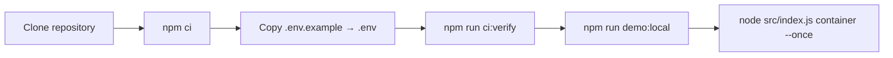
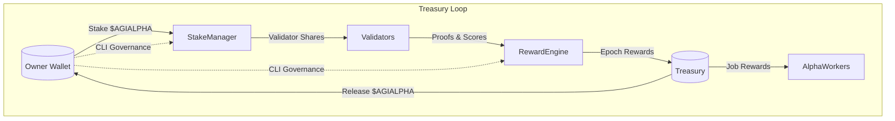
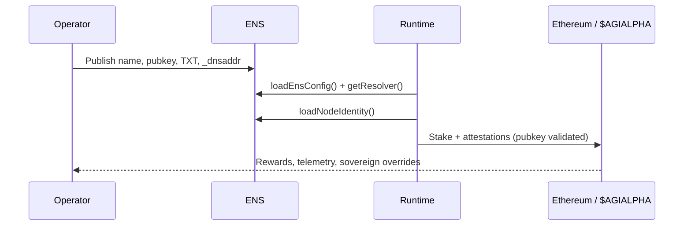
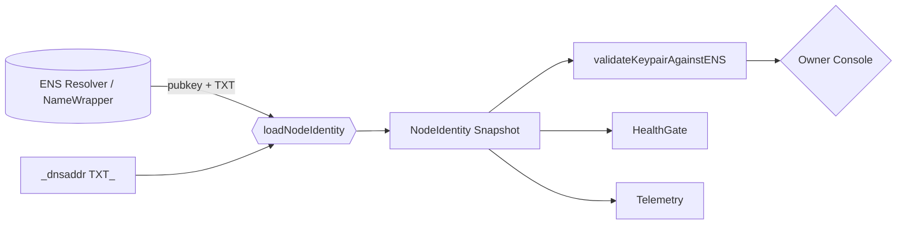
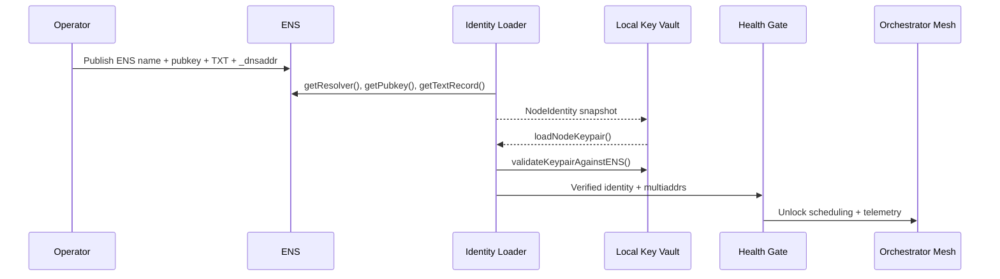
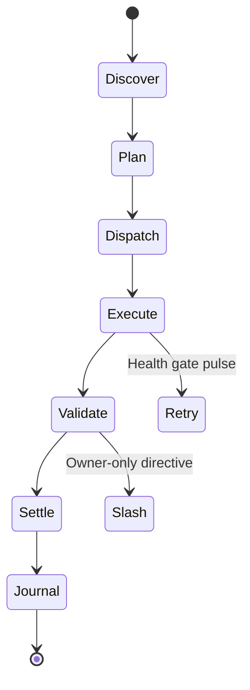
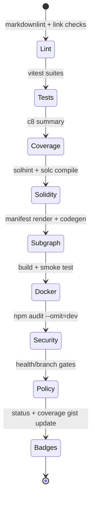

# AGI Alpha Node v0 · Command the Cognitive Armada ⚡

<!-- markdownlint-disable MD013 MD033 -->
<p align="center">
  <picture>
    <source srcset="1.alpha.node.agi.eth.svg" type="image/svg+xml" />
    
  </picture>
</p>

<p align="center">
  <a href="https://github.com/MontrealAI/AGI-Alpha-Node-v0/actions/workflows/ci.yml">
    
  </a>
  <a href=".github/required-checks.json">
    
  </a>
  
  
  
  
  
  <a href="Dockerfile"></a>
  <a href="deploy/helm/agi-alpha-node"></a>
  
  
  <a href="https://etherscan.io/address/0xa61a3b3a130a9c20768eebf97e21515a6046a1fa"></a>
  
  <a href="LICENSE"></a>
</p>

> **AGI Alpha Node v0 is the living machine that metabolizes cognition into $AGIALPHA.** It is engineered to keep its owner in absolute command, mirroring their ENS identity, staking posture, governance directives, and telemetry with zero drift.


---

## Table of Contents

1. [Constellation Overview](#constellation-overview)
2. [Quickstart Sequence](#quickstart-sequence)
3. [$AGIALPHA Treasury Engine](#agialpha-treasury-engine)
4. [ENS Control Fabric](#ens-control-fabric)
5. [Node Identity Fabric](#node-identity-fabric)
6. [Identity Boot Sequence](#identity-boot-sequence)
7. [Autonomous Job Lifecycle](#autonomous-job-lifecycle)
8. [Owner Command Authority](#owner-command-authority)
9. [Operator Console](#operator-console)
10. [Observability & Governance](#observability--governance)
11. [CI & Release Ramparts](#ci--release-ramparts)
12. [Deployment Vectors](#deployment-vectors)
13. [Repository Atlas](#repository-atlas)
14. [Reference Library](#reference-library)

---

## Constellation Overview

- **$AGIALPHA treasury engine** — The runtime is hard-wired to the canonical 18-decimal token contract [`0xa61a3b3a130a9c20768eebf97e21515a6046a1fa`](https://etherscan.io/address/0xa61a3b3a130a9c20768eebf97e21515a6046a1fa), powering staking, payouts, and liquidity loops.
- **Owner-dominated controls** — The AlphaNodeManager contract exposes pause/resume, emission gates, stake withdrawals, validator rosters, and identity governance entirely under the owner’s address.
- **Deterministic orchestration** — Workflows from discovery → execution → validation → settlement are orchestrated in [`src/services/jobLifecycle.js`](src/services/jobLifecycle.js), ensuring each α-work unit is audited and journaled.
- **Identity-first runtime** — The bootstrapper hydrates ENS metadata, `_dnsaddr` multiaddrs, and the signing key before any diagnostics run, guaranteeing that the live peerId, pubkey, and libp2p endpoints exactly match the ENS records.
- **Production-ready packaging** — Docker, Helm, CI gates, lint/test/coverage/security chains, and subgraph build tooling ship in-tree so non-technical operators can deploy without touching internals.

---

## Quickstart Sequence



1. **Clone & install dependencies**

   ```bash
   git clone https://github.com/MontrealAI/AGI-Alpha-Node-v0.git
   cd AGI-Alpha-Node-v0
   npm ci
   ```

   Node.js 20.18+ is enforced via the `package.json` engines field for reproducible builds.

2. **Configure identity & payouts**
   - Duplicate `.env.example`, fill in ENS label/name, payout routes, telemetry, and staking settings.
   - Optional ENS overrides (`ALPHA_NODE_*`) let you pin RPC endpoints, registries, and resolvers when running on bespoke networks.
   - Supply signing material via `ALPHA_NODE_KEYFILE` (JSON keyfile) or `NODE_PRIVATE_KEY` so local attestations match the ENS-published pubkey before workloads launch.

3. **Mirror CI locally**

   ```bash
   npm run ci:verify
   ```

   The command fans out into linting, vitest suites, coverage, Solidity hygiene, subgraph builds, policy gates, and security audits—identical to the GitHub Actions workflow.

4. **Launch the orchestrator**

   ```bash
   npm run demo:local       # seeds fixtures and observability loops
   node src/index.js container --once
   ```

   The bootstrapper hydrates ENS, governance, staking, and telemetry state before handing off α-work scheduling.

---

## $AGIALPHA Treasury Engine

| Property | Value |
| --- | --- |
| **Symbol** | `$AGIALPHA` |
| **Canonical contract** | `0xa61a3b3a130a9c20768eebf97e21515a6046a1fa` |
| **Decimals** | `18` (fixed and enforced across runtime + contracts) |
| **Runtime sources** | [`src/constants/token.js`](src/constants/token.js), [`src/services/token.js`](src/services/token.js), [`src/config/schema.js`](src/config/schema.js) |
| **Contract binding** | [`contracts/AlphaNodeManager.sol`](contracts/AlphaNodeManager.sol) `CANONICAL_AGIALPHA` constant |
| **Tests** | [`test/token.test.js`](test/token.test.js), [`test/config.test.js`](test/config.test.js) |



- `$AGIALPHA` addresses are normalized before any transaction is crafted. Overrides that diverge from the canonical checksum are rejected to keep emissions bound to the treasury asset.
- The staking manager, emission manager, PlatformIncentives, and reward engines all expect 18-decimal accounting; CLI helpers automatically parse decimal input into wei precision.
- Governance commands in [`src/index.js`](src/index.js) expose owner-only transactions for adjusting minimum stake, validator thresholds, emission rates, share splits, and treasury sinks so the token loop always obeys the operator.

---

## ENS Control Fabric



- `src/ens/config.ts` normalises RPC endpoints, registries, resolvers, and NameWrapper defaults for mainnet, Sepolia, or overrides injected via environment variables.
- `src/ens/client.ts` wraps ethers.js to fetch resolvers, pubkeys, TXT records, contenthash, and NameWrapper fuse/expiry data with consistent error handling.
- Health gates and governance policies block workloads until ENS state satisfies allowlists and owner directives (`scripts/verify-health-gate.mjs`).

---

## Node Identity Fabric

| Capability | Implementation | Notes |
| --- | --- | --- |
| Canonical identity snapshot | [`src/identity/loader.ts`](src/identity/loader.ts) | Fetches resolver, pubkey, TXT metadata, `_dnsaddr` multiaddrs, and NameWrapper data into a single `NodeIdentity`. |
| `_dnsaddr` → libp2p | [`src/identity/dnsaddr.ts`](src/identity/dnsaddr.ts) | Sanitises TXT fragments, extracts `dnsaddr=` multiaddrs, deduplicates, and feeds libp2p dialers. |
| Key management | [`src/identity/keys.ts`](src/identity/keys.ts) | Loads secp256k1 / ed25519 keyfiles, derives pubkeys, and enforces ENS parity via `validateKeypairAgainstENS`. |
| Runtime enforcement | [`src/identity/bootstrap.js`](src/identity/bootstrap.js) + [`src/orchestrator/bootstrap.js`](src/orchestrator/bootstrap.js) | The bootstrapper lazily loads the TypeScript identity modules via `tsx/esm`, hydrates ENS state, validates the keypair, and refuses to continue if anything drifts from the on-chain record. |



The loader fails fast when a resolver is missing, when the ENS pubkey is absent, or when `node.peerId` metadata is undefined—preventing half-hydrated runtimes from emitting attestations. `validateKeypairAgainstENS` computes the local secp256k1 public key and compares it with ENS-published coordinates; mismatches throw `NodeKeyValidationError`, ensuring attestations always originate from the declared identity.

---

## Identity Boot Sequence



1. **Resolver hydrate** — `loadNodeIdentity` normalises the ENS name, resolves the NameWrapper metadata, and assembles the canonical peerId + metadata bundle.
2. **Dnsaddr sweep** — `_dnsaddr.${ensName}` TXT records and inline overrides are parsed via `parseDnsaddr`, yielding a deduplicated libp2p multiaddr array for the swarm dialers.
3. **Key alignment** — `loadNodeKeypair` ingests keyfiles or `NODE_PRIVATE_KEY`, derives secp256k1 coordinates, and `validateKeypairAgainstENS` enforces parity before any orchestrator code runs.
4. **Health gate signal** — Once ENS + key material match, the bootstrapper primes the health gate, telemetry, and job lifecycle modules so that every subsequent component consumes the verified identity snapshot.

This sequencing ensures that even offline-first launches keep the owner’s declared ENS record, libp2p presence, and staking address perfectly aligned before the control plane starts emitting α-work.

---

## Autonomous Job Lifecycle



- **Discovery & Planning** — [`src/intelligence/planning.js`](src/intelligence/planning.js) and [`src/intelligence/swarmOrchestrator.js`](src/intelligence/swarmOrchestrator.js) score opportunities, build agent meshes, and push missions into the orchestrator queue.
- **Dispatch & Execution** — [`src/orchestrator/nodeRuntime.js`](src/orchestrator/nodeRuntime.js) and [`src/services/jobLifecycle.js`](src/services/jobLifecycle.js) bind jobs to execution contexts, journal every state change, and emit Prometheus metrics.
- **Validation & Settlement** — Validators submit proofs via [`src/network/verifierServer.js`](src/network/verifierServer.js); staking posture is confirmed before `AlphaWUMinted`, `AlphaWUValidated`, and `AlphaWUAccepted` events are emitted, feeding subgraph analytics and payout automation.
- **Journaling & Replay** — [`src/services/offlineSnapshot.js`](src/services/offlineSnapshot.js) captures deterministic snapshots so disconnected nodes can replay work and resurface telemetry instantly.

---

## Owner Command Authority

The AlphaNodeManager contract gives the owner complete control over the staking treasury, validator roster, and identity ledger.

| Control Surface | Entry Points | Owner Powers |
| --- | --- | --- |
| **Execution kill switch** | `pause()`, `unpause()` | Freeze or resume every staking + orchestration call in a single transaction, ensuring emergency stops propagate instantly. |
| **Validator + identity registry** | `setValidator`, `registerIdentity`, `setIdentityStatus`, `updateIdentityController`, `revokeIdentity` | Assign, rotate, or retire controllers and validator wallets while keeping ENS nodes mapped to the right operators. |
| **Treasury + stake** | `stake`, `withdrawStake`, `applySlash` | Enforce deposits, drain treasury funds to approved recipients, or slash a validator after telemetry or audit triggers. |
| **Alpha Work telemetry** | `recordAlphaWUMint`, `recordAlphaWUValidation`, `recordAlphaWUAcceptance` | Emit authoritative lifecycle events so off-chain agents, subgraphs, and dashboards mirror the owner’s source of truth. |

`CANONICAL_AGIALPHA` binds the runtime to the treasury token, guaranteeing that emitted rewards and slash penalties always reference the canonical 18-decimal asset the ecosystem expects.

---

## Operator Console

The CLI in [`src/index.js`](src/index.js) exposes every on-chain lever so the contract owner can update parameters, pause systems, or retarget incentives in seconds.

| Domain | Representative command | Purpose |
| --- | --- | --- |
| **Stake posture** | `node src/index.js governance minimum-stake --stake-manager <addr> --amount 12_500` | Raise/lower the StakeManager minimum stake (18-decimal `$AGIALPHA`). |
| **Validator quorum** | `node src/index.js governance validator-threshold --stake-manager <addr> --threshold 5` | Enforce validator quorum requirements before attestations count. |
| **Emission policy** | `node src/index.js governance emission-per-epoch --emission-manager <addr> --amount 250` | Adjust emission flow, cap, epoch length, or multipliers for staking rewards. |
| **Platform incentives** | `node src/index.js governance incentives-minimum --incentives <addr> --amount 5_000` | Reconfigure PlatformIncentives stake floors, heartbeat windows, and activation fees. |
| **Reward splits** | `node src/index.js governance global-shares --reward-engine <addr> --operator-bps 6000 --validator-bps 3000 --treasury-bps 1000` | Redefine how `$AGIALPHA` yields are split between operators, validators, and treasury sinks. |
| **Registry upgrades** | `node src/index.js governance registry-upgrade --stake-manager <addr> --type job --address <new>` | Hot-swap job/identity registries, job modules, or WorkMeter delegates. |
| **System pause** | `node src/index.js governance system-pause --system-pause <addr> --action pause` | Encode pause/resume payloads that instantly halt orchestrators, validators, and payouts. |
| **Identity ops** | `node src/index.js governance identity-delegate --identity-registry <addr> --operator <addr> --allowed true` | Delegate or revoke operator access, enforce ENS allowlists, and realign controllers. |

Each command shares ergonomic helpers for signer selection, JSON-RPC configuration, decimal parsing, and transaction preview output—making it possible for non-technical operators to execute governance actions without bespoke scripts.

---

## Observability & Governance

- **Health gates**: The bootstrapper publishes health snapshots and ENS allowlists to halt workloads if telemetry degrades.
- **Metrics**: Prometheus counters & histograms export α-work throughput, validator performance, and reward curves for dashboards.
- **Governance ledger**: Structured event journaling tracks validator status, staking posture, and orchestrator directives for audit trails.
- **Offline resilience**: Snapshot + replay primitives guarantee that disconnected nodes can resynchronise once connectivity returns.

---

## CI & Release Ramparts



`npm run ci:verify` executes the full quality gauntlet enforced on every pull request and the `main` branch, matching the GitHub Actions workflow one-to-one.

| Stage | Command | Purpose |
| --- | --- | --- |
| Markdown & link lint | `npm run lint` | Style, accessibility, and documentation integrity, including governance docs and manifesto pages. |
| Unit & integration tests | `npm run test` | Vitest suite covering orchestration, governance, ENS tooling, identity loaders, and telemetry. |
| Coverage | `npm run coverage` | Generates text + LCOV + JSON reports, uploaded as artifacts for historical tracking. |
| Solidity hygiene | `npm run ci:solidity` | Runs `solhint` plus deterministic solc builds for AlphaNodeManager and interfaces. |
| Subgraph build | `npm run ci:ts` | Renders the manifest, runs Graph codegen, and compiles the WASM bundle consumed by analytics swarms. |
| Security audit | `npm run ci:security` | Enforces high-severity dependency audits on production deps. |
| Policy gates | `npm run ci:policy` + `npm run ci:branch` | Health gate enforcement, branch naming rules, and governance guardrails before merge. |

Pull requests must surface the CI badge shown above and satisfy `.github/required-checks.json`, ensuring branch protection keeps the command surface green.

---

## Deployment Vectors

- **Docker**: A production-grade image is built from the root `Dockerfile`, bundling runtime binaries, ENS tooling, and metrics exporters.
- **Helm**: `deploy/helm/agi-alpha-node` ships a chart with config maps, secrets, liveness probes, and resource envelopes for Kubernetes clusters.
- **Subgraph**: The `/subgraph` workspace contains the Graph protocol manifest + generated bindings so validators can stream events into analytics stacks.

---

## Repository Atlas

| Path | Description |
| --- | --- |
| `src/` | Node runtime, orchestrator, telemetry, staking, ENS wiring, and validation logic. |
| `scripts/` | Operational tooling including ENS inspection, health/branch guards, and Solidity harnesses. |
| `contracts/` | Solidity sources for AlphaNodeManager and shared interfaces. |
| `deploy/` | Helm chart and infra automation. |
| `docs/` | Economics, governance manifesto, and operator handbook. |
| `subgraph/` | Graph protocol workspace for analytics pipelines. |
| `test/` | Vitest coverage over runtime, governance, ENS, and contract surrogates. |

---

## Reference Library

- [Docs index](docs/README.md) — platform overview, operator flows, and governance hooks.
- [Node identity authority](docs/identity.md) — ENS resolution, key alignment, and libp2p topology guides.
- [Economics primer](docs/economics.md) — staking parameters, flywheel modelling, and token incentives.
- [Manifesto](docs/manifesto.md) — guiding principles for distributed cognition and fair governance.
- [Helm chart](deploy/helm/agi-alpha-node) — Kubernetes deployment templates.
- [$AGIALPHA token](https://etherscan.io/address/0xa61a3b3a130a9c20768eebf97e21515a6046a1fa) — canonical treasury asset.
- [CI workflow](.github/workflows/ci.yml) — enforced automated quality gates.

The code, docs, and tooling in this repository form the operational chassis for a machine that tirelessly channels intelligence, liquidity, and governance back to its owner.
