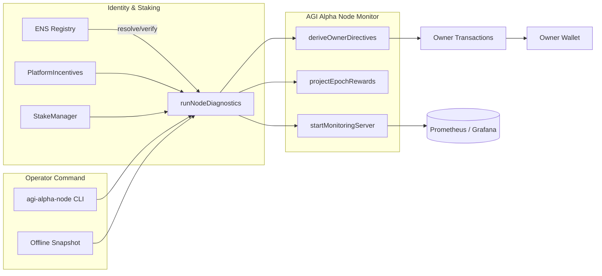
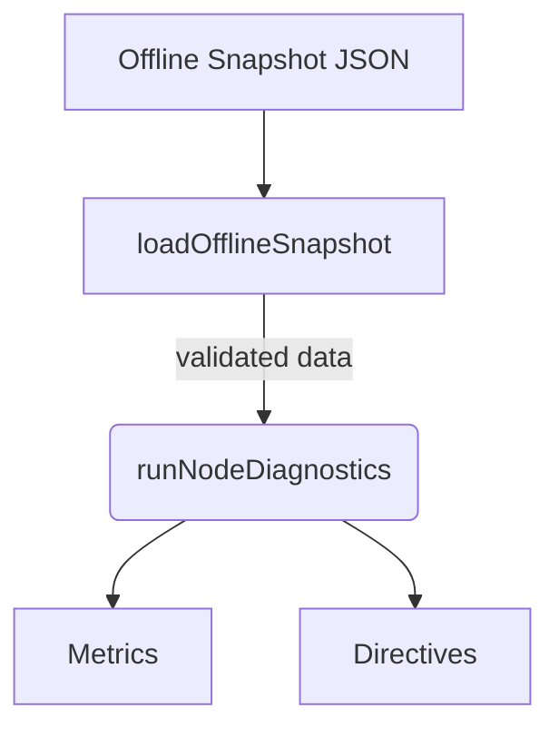

# AGI Alpha Node v0 · Sovereign Labor Intelligence Core

<!-- markdownlint-disable MD013 MD033 -->
<p align="center">
  
</p>

<p align="center">
  <a href="https://github.com/MontrealAI/AGI-Alpha-Node-v0/actions/workflows/ci.yml">
    
  </a>
  <a href="https://app.ens.domains/name/alpha.node.agi.eth"></a>
  <a href="https://etherscan.io/token/0xa61a3b3a130a9c20768eebf97e21515a6046a1fa"></a>
  <a href="docs/README.md"></a>
  <a href="LICENSE"></a>
  
  
  
  
  
  
</p>

> This runtime is the instrument that institutions deploy when they intend to bend markets with autonomous labor swarms. It proves ENS identity, controls every governance lever, orchestrates $AGIALPHA staking, and never relinquishes ownership.

The node now ships a dedicated monitoring loop, offline survivability, and container/Helm automation so that a non-technical operator can light up a production node with a single command and watch token flows stream in real time. Every override stays with the contract owner: pause, resume, rebalance rewards, raise stake floors, or reroute intelligence lattices at will.

---

## Table of Contents

1. [Mission Field Briefing](#mission-field-briefing)
2. [Launch Checklist](#launch-checklist)
3. [Command Surface](#command-surface)
4. [Operational Telemetry Flow](#operational-telemetry-flow)
5. [Offline Continuity Mode](#offline-continuity-mode)
6. [Container & Helm Deployment](#container--helm-deployment)
7. [Owner Supremacy & Governance Payloads](#owner-supremacy--governance-payloads)
8. [Repository Atlas](#repository-atlas)
9. [Quality Gates & CI Enforcement](#quality-gates--ci-enforcement)
10. [Contributing](#contributing)
11. [License](#license)

---

## Mission Field Briefing

| Vector | Signal | Coordinates |
| ------ | ------ | ----------- |
| **Identity Root** | ENS anchor enforced at runtime | [`alpha.node.agi.eth`](https://app.ens.domains/name/alpha.node.agi.eth) — only subdomain custodians may activate. |
| **Treasury Asset** | `$AGIALPHA` (18 decimals) | [Etherscan contract `0xa61a3b3a130a9c20768eebf97e21515a6046a1fa`](https://etherscan.io/token/0xa61a3b3a130a9c20768eebf97e21515a6046a1fa). |
| **Runtime Spine** | CLI orchestrator + monitoring loop | [`src/index.js`](src/index.js) — diagnostics, ENS proofs, staking analytics, governance payloads, swarm lattice. |
| **Diagnostics Engine** | Node runtime orchestrator | [`src/orchestrator/nodeRuntime.js`](src/orchestrator/nodeRuntime.js) — ENS verification, stake posture, reward projections, owner directives. |
| **Offline Intelligence** | Snapshot parser & synthesiser | [`src/services/offlineSnapshot.js`](src/services/offlineSnapshot.js) — validates local ENS/stake snapshots for air-gapped operations. |
| **Control Plane** | Owner directives + automation | [`src/services/controlPlane.js`](src/services/controlPlane.js) — pause/resume scripts, stake floor governance, top-up payloads. |
| **Telemetry Spine** | Prometheus metrics | [`src/telemetry/monitoring.js`](src/telemetry/monitoring.js) — stake/heartbeat gauges powering dashboards & health checks. |
| **Container Surface** | Docker/Helm deploy | [`Dockerfile`](Dockerfile), [`deploy/helm/agi-alpha-node`](deploy/helm/agi-alpha-node) — one-command monitor with health probes. |
| **Owner Proofs** | Governance + job settlement | [`src/services/governance.js`](src/services/governance.js), [`src/services/jobProof.js`](src/services/jobProof.js). |
| **Intelligence Lattice** | Planning, swarm routing, antifragile stress harness | [`src/intelligence`](src/intelligence). |

---

## Launch Checklist

1. **Clone & Install**

   ```bash
   git clone https://github.com/MontrealAI/AGI-Alpha-Node-v0.git
   cd AGI-Alpha-Node-v0
   npm ci
   ```

2. **Enforce Toolchain** — confirm Node.js ≥ 20.18.1 (`node --version`). Upgrade with `npx n 20.19.5` if required.

3. **Generate ENS Playbook**

   ```bash
   npx agi-alpha-node ens-guide --label 1 --address 0xYOURADDRESS
   ```

4. **Verify Identity**

   ```bash
   npx agi-alpha-node verify-ens \
     --label 1 \
     --address 0xYOURADDRESS \
     --rpc https://mainnet.infura.io/v3/<key>
   ```

5. **Stake & Activate**

   ```bash
   npx agi-alpha-node token approve --spender 0xStakeManager --amount max
   npx agi-alpha-node stake-tx --amount 1000 --incentives 0xIncentivesContract
   ```

6. **Deep Diagnostics**

   ```bash
   npx agi-alpha-node status \
     --label 1 \
     --address 0xYOURADDRESS \
     --rpc https://mainnet.infura.io/v3/<key> \
     --stake-manager 0xStakeManager \
     --incentives 0xIncentivesContract \
     --system-pause 0xSystemPause \
     --desired-minimum 1500 \
     --auto-resume \
     --projected-rewards 1500 \
     --metrics-port 9464
   ```

7. **Activate Continuous Monitoring**

   ```bash
   npx agi-alpha-node monitor \
     --label 1 \
     --address 0xYOURADDRESS \
     --rpc https://mainnet.infura.io/v3/<key> \
     --stake-manager 0xStakeManager \
     --incentives 0xIncentivesContract \
     --system-pause 0xSystemPause \
     --interval 60 \
     --metrics-port 9464
   # Metrics stream at http://localhost:9464/metrics (Prometheus scrape-ready)
   ```

8. **Run the Full Test Harness**

   ```bash
   npm test
   npm run lint
   ```

---

## Command Surface

| Command | Purpose | Highlights |
| ------- | ------- | ---------- |
| `status` | One-shot diagnostics with ENS verification, staking telemetry, reward projection, owner directives. | Supports on-demand Prometheus exposure via `--metrics-port`. |
| `monitor` | Continuous diagnostics loop + telemetry refresh + optional offline snapshots. | Drives Docker/Helm deployments and health checks. |
| `ens-guide` | Generates ENS subdomain checklist for operators. | Confirms registrant, wrapper, resolver expectations. |
| `verify-ens` | Audits subdomain ownership against expected address. | Fails fast when registry/wrapper diverge. |
| `stake-tx`, `token approve` | Crafts `stakeAndActivate` payloads & token approvals. | BigInt-precise encoding, decimals enforced to 18. |
| `intelligence plan/swarm/learn` | Engages planning, swarm routing, and curriculum modules. | Entirely local — no external API dependency. |
| `governance` helpers | Build pause/resume, minimum stake, role share, and global share transactions. | Owner retains full supremacy over runtime parameters. |
| `job-proof` | Deterministic job commitment & submission payloads. | Ensures trustless escrow releases on-chain. |

---

## Operational Telemetry Flow



The `monitor` loop orchestrates ENS verification, stake analytics, reward forecasting, and owner directives, then broadcasts metrics continuously for Prometheus. Offline snapshots can stand in for mainnet when bandwidth collapses; the control plane still emits governance payloads so the owner can pause, resume, or recapitalize instantly.

---

## Offline Continuity Mode

*Air-gapped nodes still need to defend stake and identity.* The offline toolkit delivers:

- **Snapshot parser** — [`src/services/offlineSnapshot.js`](src/services/offlineSnapshot.js) validates JSON snapshots, normalizes checksummed addresses, and converts numeric fields to `bigint` for deterministic analysis.
- **Diagnostics fallback** — supply `--offline-snapshot <path>` to `status` or `monitor` to run the full pipeline without RPC connectivity.
- **Sample snapshot** — [`docs/offline-snapshot.example.json`](docs/offline-snapshot.example.json) demonstrates the structure, including ENS ownership, stake telemetry, and projected rewards.
- **Testing harness** — [`test/offlineSnapshot.test.js`](test/offlineSnapshot.test.js) exercises snapshot parsing, verification, and stake synthesis to guarantee parity with on-chain reads.



When offline mode is engaged, the runtime logs the snapshot source, synthesizes ENS matches, evaluates stake deficits, and still produces governance payloads. Metrics remain live so observability dashboards stay green even while disconnected.

---

## Container & Helm Deployment

### Docker

Build and run the production monitor image. The container defaults to the continuous `monitor` loop and exposes `/metrics` for health checks.

```bash
# Build
docker build -t agi-alpha-node:latest .

# Run (online)
docker run \
  -e RPC_URL=https://mainnet.infura.io/v3/<key> \
  -e NODE_LABEL=1 \
  -e OPERATOR_ADDRESS=0xYOURADDRESS \
  -e STAKE_MANAGER_ADDRESS=0xStakeManager \
  -e PLATFORM_INCENTIVES_ADDRESS=0xIncentivesContract \
  -e SYSTEM_PAUSE_ADDRESS=0xSystemPause \
  -e DESIRED_MINIMUM_STAKE=1500 \
  -e AUTO_RESUME=true \
  -e METRICS_PORT=9464 \
  -p 9464:9464 \
  agi-alpha-node:latest
```

Health is enforced via `node src/healthcheck.js`, which interrogates `/metrics`. Provide `OFFLINE_SNAPSHOT_PATH` to continue operations while air-gapped:

```bash
docker run \
  -e OFFLINE_SNAPSHOT_PATH=/data/offline.json \
  -v $(pwd)/docs/offline-snapshot.example.json:/data/offline.json:ro \
  -p 9464:9464 \
  agi-alpha-node:latest
```

### Helm

Deploy fleets with Kubernetes:

```bash
helm install alpha-node deploy/helm/agi-alpha-node \
  --set image.repository=<your-registry>/agi-alpha-node \
  --set image.tag=v1.1.0 \
  --set env.rpcUrl=https://mainnet.infura.io/v3/<key> \
  --set env.label=1 \
  --set env.operatorAddress=0xYOURADDRESS \
  --set env.stakeManagerAddress=0xStakeManager \
  --set env.platformIncentivesAddress=0xIncentivesContract \
  --set env.systemPauseAddress=0xSystemPause
```

The chart provisions:

- Deployment with `monitor --interval <seconds>` arguments and optional offline snapshot support.
- Service + Prometheus-ready port (`/metrics`).
- Liveness/readiness probes bound to the same health endpoint.
- Configurable resource requests, tolerations, node selectors, and service account.

Update values via `values.yaml` to control interval, projected rewards, or offline file mounts.

---

## Owner Supremacy & Governance Payloads

The owner retains **absolute control**:

- **Pause/Resume** — `buildSystemPauseTx` in [`src/services/governance.js`](src/services/governance.js) crafts `pauseAll`, `resumeAll`, or `unpauseAll` transactions instantly.
- **Stake Floors** — `buildMinimumStakeTx` lets the owner raise or align minimum stake requirements with one payload.
- **Reward Splits** — `buildRoleShareTx` & `buildGlobalSharesTx` adjust operator/validator/treasury shares and role-based basis points.
- **Control Plane** — [`deriveOwnerDirectives`](src/services/controlPlane.js) synthesizes recommended actions (pause, resume, stake top-up) with encoded transactions; used by both `status` and `monitor`.
- **Token Authority** — [`src/services/token.js`](src/services/token.js) ensures canonical `$AGIALPHA` checksums, approvals, and allowances.
- **Job Settlement** — [`src/services/jobProof.js`](src/services/jobProof.js) emits trustless commitment & submission payloads for escrow release.

---

## Repository Atlas

```text
src/
  config/                 # Environment schema & loaders
  constants/token.js      # Canonical $AGIALPHA metadata (18 decimals)
  healthcheck.js          # Docker/Helm health probe
  index.js                # CLI entrypoint + command surface
  intelligence/           # Planning, swarm orchestrator, learning loop, stress harness
  orchestrator/nodeRuntime.js # Diagnostics engine
  services/               # ENS, staking, governance, offline snapshots, provider, economics
  telemetry/monitoring.js # Prometheus gauges & server
  utils/                  # Formatters & helpers

deploy/helm/agi-alpha-node/ # Production-grade Helm chart
  Chart.yaml
  values.yaml
  templates/
```

Tests live under [`test/`](test/) (Vitest). Docs & manifest live under [`docs/`](docs/).

---

## Quality Gates & CI Enforcement

- **CI Workflow** — `.github/workflows/ci.yml` executes markdown lint, link checks, and Vitest on every PR & push to `main`.
- **Local Guards**
  - `npm run lint` – markdown + link sanity.
  - `npm test` – 64 Vitest suites spanning ENS proofs, staking, offline snapshots, intelligence lattice, and governance payloads.
  - `npm run coverage` – optional `c8` coverage output.
- **Branch Protection** — CI badges and shields confirm visibility; enforce checks on PRs and the `main` branch.

---

## Contributing

Pull requests are welcome. Please:

1. Open an issue describing the upgrade.
2. Ensure `npm test` and `npm run lint` succeed.
3. Follow existing code style (ES modules, no try/catch around imports, Node.js ≥ 20).

---

## License

[MIT](LICENSE) © Montreal.AI — deploy responsibly.
