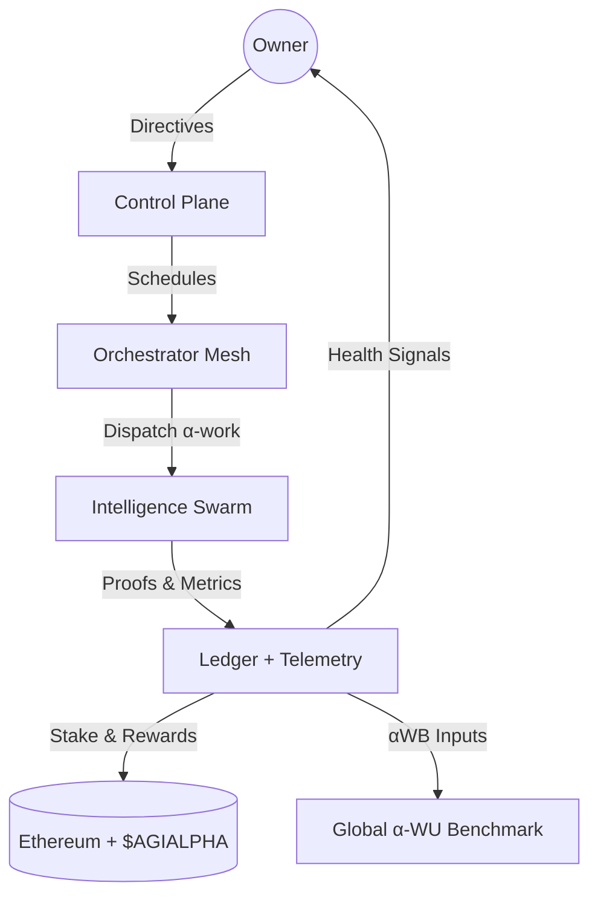
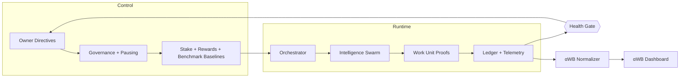
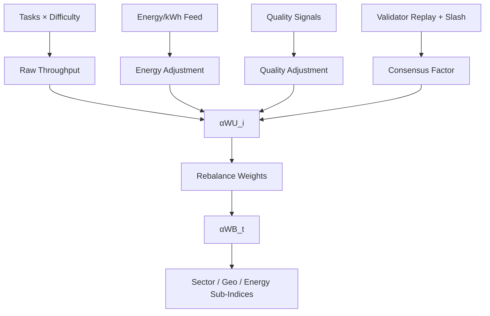
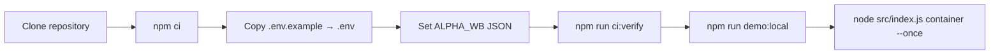
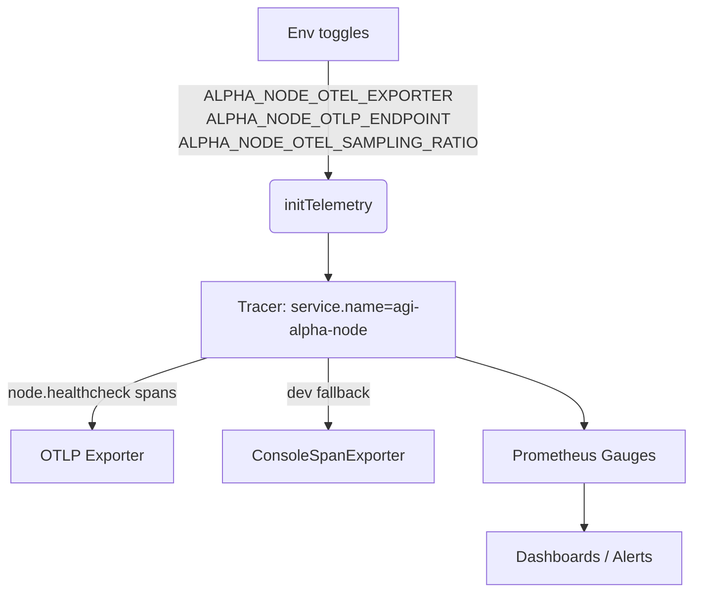
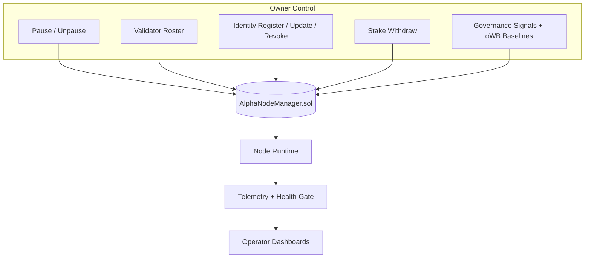
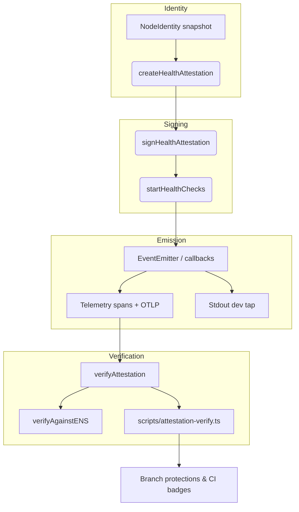

# AGI Alpha Node v0 · Cognitive Yield Engine ⚡

<!-- markdownlint-disable MD013 MD033 -->
<p align="center">
  <picture>
    <source srcset="1.alpha.node.agi.eth.svg" type="image/svg+xml" />
    
  </picture>
</p>

<p align="center">
  <a href="https://github.com/MontrealAI/AGI-Alpha-Node-v0/actions/workflows/ci.yml?query=branch%3Amain">
    
  </a>
  <a href=".github/required-checks.json">
    
  </a>
  
  
  
  
  <a href="https://etherscan.io/address/0xa61a3b3a130a9c20768eebf97e21515a6046a1fa"></a>
  
  <a href="Dockerfile"></a>
  <a href="deploy/helm/agi-alpha-node"></a>
  <a href="LICENSE"></a>
  <a href="docs/alpha-wb.md"></a>
</p>

> **AGI Alpha Node v0** concentrates a sovereign cognitive core into on‑chain proof, compounding `$AGIALPHA` while the owner keeps
> absolute command. Every pulse is attestable, deterministic, and observable—deployable by a non‑technical operator yet powerful
> enough to tilt markets.



## Table of Contents

1. [Mission Snapshot](#mission-snapshot)
2. [Architecture Pulse](#architecture-pulse)
3. [α‑WB Benchmark](#alpha-wb-benchmark)
4. [Quickstart](#quickstart)
5. [Telemetry Surface](#telemetry-surface)
6. [Owner Command Surface](#owner-command-surface)
7. [Health Attestation Mesh](#health-attestation-mesh)
8. [$AGIALPHA Treasury](#agialpha-treasury)
9. [Identity & ENS Fabric](#identity--ens-fabric)
10. [Testing & CI Gates](#testing--ci-gates)
11. [Deployment Vectors](#deployment-vectors)
12. [Repository Atlas](#repository-atlas)
13. [Reference Snippets](#reference-snippets)

---

## Mission Snapshot

- **Canonical treasury binding** — Hardwired to the 18-decimal `$AGIALPHA` contract
  [`0xa61a3b3a130a9c20768eebf97e21515a6046a1fa`](https://etherscan.io/address/0xa61a3b3a130a9c20768eebf97e21515a6046a1fa) for
  staking, rewards, and settlement.
- **Owner-dominated controls** — Pausing, validator rosters, identity registration/rotation, stake withdrawals, benchmark
  baselines, and governance signaling remain exclusively with the contract owner (`AlphaNodeManager.sol`).
- **Deterministic attestations** — Canonical JSON, signed payloads, and independent verification keep liveness and identity
  integrity provable.
- **Live health plane** — `startHealthChecks` signs latency-aware attestations, emits OpenTelemetry spans, and exposes canonical
  payloads for verifiers and dashboards.
- **Production-hardening** — Markdown + link linting, Vitest suites, coverage, Solidity lint/compile, subgraph builds, Docker
  smoke, npm audit, and policy/branch gates are enforced in CI and required on PRs/main.
- **Operator empathy** — Docker, Helm, scripts, and CLI taps let non-technical operators deploy and validate without touching
  internals while retaining full override authority.
- **Global productivity gauge** — α‑WU metering now feeds the α‑WB benchmark, delivering a live, energy‑aware, quality‑aware
  “S&P 500 for autonomous work.”

---

## Architecture Pulse



- **Control Plane** — Owner-owned governance calls flow through `AlphaNodeManager.sol`, adjusting validator sets, identity
  lifecycles, runtime overrides, and α‑WB baselines in real time.
- **Runtime Orchestration** — `src/orchestrator/bootstrap.js` hydrates identity, stakes, telemetry, health gates, validator
  runtimes, and orchestrator loops before dispatching α‑work.
- **Telemetry Spine** — OpenTelemetry spans plus Prometheus metrics capture every health beat; console exporters keep local dev
  frictionless while OTLP endpoints ship spans upstream.

---

## Alpha-WB Benchmark

The α‑WB benchmark is a production-grade, anti-gaming index that prices autonomous work in α‑WU while adjusting for energy,
quality, and validator consensus. Code lives in [`src/services/alphaBenchmark.js`](src/services/alphaBenchmark.js) with operator
controls parsed via `ALPHA_WB` in [`src/config/schema.js`](src/config/schema.js). Read the full blueprint in
[`docs/alpha-wb.md`](docs/alpha-wb.md).



- **Mathematics:** `αWU_i = Raw_Throughput × EA × QA × VC`; `αWB_t = Σ(weight_i × αWU_i) / Base_Divisor`.
- **Energy / quality clamps:** Floors and caps prevent energy-washing or quality inflation. Consensus factors absorb
  reproducibility penalties and slash signals.
- **Owner surface:** Tune baselines, caps, divisors, and smoothing windows via `ALPHA_WB` without code edits.
- **Validator integrity:** Independent replays + slash events are first-class inputs; non-reproducible outputs lose weight.

---

## Quickstart



1. **Clone & install (pulls cryptography deps such as @noble/ed25519)**

   ```bash
   git clone https://github.com/MontrealAI/AGI-Alpha-Node-v0.git
   cd AGI-Alpha-Node-v0
   npm ci
   ```

   Node.js **20.18+** is enforced for deterministic builds.

2. **Configure identity, telemetry, payouts, and α‑WB**

   - Copy `.env.example` → `.env` and fill ENS label/name, payout targets, telemetry exporters, OTLP endpoint (if any), staking
     thresholds, RPC endpoints, and `ALPHA_WB` JSON for benchmark baselines.
   - Provide signing material through `ALPHA_NODE_KEYFILE` (JSON keyfile) or `NODE_PRIVATE_KEY` so live attestations match your
     ENS-published pubkey.
   - Verify ENS alignment before launching:

     ```bash
     npm run ens:inspect -- --name <your-node>.eth
     node -e "import { loadNodeIdentity } from './src/identity/loader.js'; (async()=>console.log(await loadNodeIdentity('<your-node>.eth')))();"
     ```

3. **Mirror CI locally**

   ```bash
   npm run ci:verify
   ```

   Executes linting, tests, coverage, Solidity hygiene, subgraph build, npm audit (high), policy, and branch gates.

4. **Launch the orchestrator**

   ```bash
   npm run demo:local       # seeds fixtures and observability loops
   node src/index.js container --once
   ```

   Bootstrap hydrates ENS, governance, staking posture, telemetry, and the health gate before dispatching α-work.

5. **Lock in CI parity**

   - Run `npm run ci:verify` before every PR to mirror the enforced gate set.
   - Required checks are enforced on `main` and PRs via branch protections and [`.github/required-checks.json`](.github/required-checks.json).

---

## Telemetry Surface



- `src/telemetry/config.ts|js` reads runtime env:
  - `ALPHA_NODE_OTEL_EXPORTER=otlp|console|none`
  - `ALPHA_NODE_OTLP_ENDPOINT=https://otel-collector.example.com/v1/traces`
  - `ALPHA_NODE_OTEL_SAMPLING_RATIO=0.25` (clips to `[0,1]`).
- `src/telemetry/otel.ts` initializes a singleton tracer with `service.name=agi-alpha-node`, OTLP when configured, and console
  exporter fallback for local dev.
- `src/attestation/health_service.ts` wraps every health emission in a `node.healthcheck` span, attaching ENS, peer ID, role,
  version, fuses, expiry, DNSAddr presence, status, latency, and signature type—flagging errors for degraded/unhealthy states.
- Misconfiguration is logged (never crashes) and toggling envs swaps exporters without code changes.

---

## Owner Command Surface



- **Complete override authority** — `contracts/AlphaNodeManager.sol` empowers the owner to pause/unpause, update validator sets,
  register or rotate ENS identities, alter identity status, withdraw stake, and backstop α‑work issuance.
- **Parameter agility** — Owner-set tunables (validator roster, staking posture, heartbeat cadence, attestation role/version
  metadata, α‑WB baselines) are read at runtime, enabling rapid pivots without redeploying contracts.
- **Runtime enforcement** — Services in `src/services/` (governance, staking, rewards, control plane, benchmark) read owner
  directives and refuse execution when the health gate or treasury posture is off-policy.

---

## Health Attestation Mesh



- **Schema** — [`src/attestation/schema.ts`](src/attestation/schema.ts) defines `HealthAttestation` v1 (`timestamp`, `ensName`,
  `peerId`, `nodeVersion`, `multiaddrs`, optional `fuses/expiry/latency/meta`, `status: healthy | degraded | unhealthy`) plus
  canonical serialization helpers.
- **Signing & verification** — [`src/attestation/verify.ts`](src/attestation/verify.ts) signs with secp256k1 or ed25519 and
  rehydrates ENS-published keys before verifying signatures.
- **Spans as truth** — `startHealthChecks` attaches ENS, peer ID, role, version, expiry/fuses, DNSAddr presence, status,
  latency, and signature type to every `node.healthcheck` span, marking errors for degraded/unhealthy states.

---

## $AGIALPHA Treasury

- **Token** — `$AGIALPHA` ERC-20 at
  [`0xa61a3b3a130a9c20768eebf97e21515a6046a1fa`](https://etherscan.io/address/0xa61a3b3a130a9c20768eebf97e21515a6046a1fa) (18
  decimals) is wired as the canonical staking asset.
- **Staking orchestration** — Ledger + on-chain flows are mediated through `AlphaNodeManager.sol` and the orchestrator, ensuring
  only owner-approved validators can record validations or accept work.
- **Rewards flywheel** — Telemetry, attestations, and α‑WB outputs feed adaptive incentives, pulling more validators/agents in as
  performance compounds.

---

## Identity & ENS Fabric

- **ENS hydration** — `src/identity/loader.js` and `src/ens/` utilities fetch ENS pubkeys, fuses, expiry, and multiaddrs for
  runtime alignment.
- **Key alignment** — Bootstrap validates local keypairs against ENS records; mismatches halt startup to prevent false
  attestations.
- **DNSAddr guardrails** — `src/identity/dnsaddr.ts` ensures multiaddrs carry `dnsaddr` presence, tracked in telemetry spans for
  observability.

---

## Testing & CI Gates

- **Local parity:**

  ```bash
  npm run lint          # markdown + link lint
  npm run test          # vitest suites
  npm run coverage      # c8 + vitest coverage
  npm run lint:sol      # solhint
  npm run test:sol      # solidity compile & checks
  npm run ci:ts         # subgraph codegen/build
  npm run ci:security   # npm audit (high)
  npm run ci:policy     # health gate policy
  npm run ci:branch     # branch protection enforcement
  ```

- **CI enforcement:** `.github/workflows/ci.yml` runs all gates on PRs and `main`; badges publish from the `badges` job when
  `main` is green. Branch protection mirrors [`.github/required-checks.json`](.github/required-checks.json).
- **Smoke parity:** Docker build + `--help` smoke test ensures the containerized CLI stays bootable.

---

## Deployment Vectors

- **Container:** `docker build --tag agi-alpha-node:latest .` then run with env overrides for ENS, RPC endpoints, telemetry
  exporters, payout addresses, and `ALPHA_WB` baselines.
- **Helm:** `deploy/helm/agi-alpha-node` charts wire config, secrets, and service endpoints for Kubernetes operators.
- **Bare metal / VM:** `node src/index.js container --once` bootstraps ENS, telemetry, staking posture, health gate, α‑WB
  baselines, and validator runtimes.

---

## Repository Atlas

- `src/orchestrator/` — Bootstrap, monitor loops, stake activation, validator runtime wiring.
- `src/services/alphaBenchmark.js` — α‑WB benchmark math, anti-gaming clamps, and weight rebalance helpers.
- `src/attestation/` — Health attestations, signing, schema, verification, and span instrumentation.
- `src/telemetry/` — OpenTelemetry initialization (`otel.ts`/`otelCore.js`), env parsing (`config.ts`/`config.js`), metrics, and
  Alpha-Wu telemetry helpers.
- `src/identity/` — ENS loaders, keypair alignment, DNSAddr validation.
- `contracts/` — `AlphaNodeManager.sol` with owner-only pause/unpause, validator management, identity lifecycle, staking,
  mint/validate/acceptance recording, and slashing hooks.
- `scripts/` — ENS inspection, branch/policy gates, coverage badge publisher, local cluster demo, Solidity runner, and manifest
  rendering.
- `subgraph/` — Codegen/build hooks for indexing Alpha Work Units and treasury posture.
- `docs/` — Economics, manifesto, identity guidance, α‑WU metering, α‑WB benchmark blueprint, and auxiliary briefs.

---

## Reference Snippets

### Initialize telemetry with OTLP exporter

```bash
ALPHA_NODE_OTEL_EXPORTER=otlp \
ALPHA_NODE_OTLP_ENDPOINT=https://otel.example.com/v1/traces \
ALPHA_NODE_OTEL_SAMPLING_RATIO=0.5 \
node src/index.js container --once
```

### Verify a signed health attestation against ENS

```bash
npm run attestation:verify -- --ens-name 1.alpha.node.agi.eth --file ./signed-attestation.json
```

### Run the full CI gate locally (mirrors branch protection)

```bash
npm run ci:verify
```

### Compute an α‑WB snapshot from live metering

```bash
node -e "import { computeAlphaWorkBenchmarkIndex, deriveThroughputFromSegments } from './src/services/alphaBenchmark.js'; import { getSegmentsSnapshot } from './src/services/metering.js'; const throughput = deriveThroughputFromSegments(getSegmentsSnapshot()); console.log(computeAlphaWorkBenchmarkIndex([{ ...throughput, energyKwhPerAlphaWU: 1, energyCostPerKwh: 0.12, qualityScore: 1, consensusRate: 0.99 }]));"
```

### Execute the Docker smoke test locally

```bash
docker build --tag agi-alpha-node:dev .
docker run --rm \
  -e NODE_LABEL=smoke-test \
  -e OPERATOR_ADDRESS=0x0000000000000000000000000000000000000001 \
  -e RPC_URL=https://rpc.invalid \
  agi-alpha-node:dev --help
```

---

**Expect deterministic control, uncompromising observability, a live α‑WB productivity index, and an execution flywheel tuned
for perpetual alpha—always under the owner’s command.**
