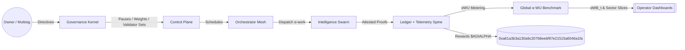

# AGI Alpha Node v0 · Cognitive Yield Engine ⚡️

<!-- markdownlint-disable MD033 -->
<p align="center">
  <picture>
    <source srcset="1.alpha.node.agi.eth.svg" type="image/svg+xml" />
    
  </picture>
</p>

<p align="center">
  <a href="https://github.com/MontrealAI/AGI-Alpha-Node-v0/actions/workflows/ci.yml?query=branch%3Amain">
    
  </a>
  <a href=".github/required-checks.json">
    
  </a>
  
  
  <a href="https://etherscan.io/address/0xa61a3b3a130a9c20768eebf97e21515a6046a1fa">
    
  </a>
  
  
  
  <a href="Dockerfile"></a>
  <a href="deploy/helm/agi-alpha-node"></a>
  
  
</p>

> **AGI Alpha Node v0** is the cognitive yield engine that turns heterogeneous agentic work into verifiable α‑Work Units (α‑WU), anchors every unit to the `$AGIALPHA` treasury (`0xa61a3b3a130a9c20768eebf97e21515a6046a1fa`, 18 decimals), and keeps every lever under the owner’s command—pause, re-weight, rotate validators, refresh baselines, reroute rewards, and rewrite participation rules without redeploying code.

## Table of contents

- [Why this node](#why-this-node)
- [Architecture at a glance](#architecture-at-a-glance)
- [Quickstart](#quickstart)
- [Telemetry ingestion v0](#telemetry-ingestion-v0)
- [Data spine: domain, migrations, seeds](#data-spine-domain-migrations-seeds)
- [Owner controls & on-chain levers](#owner-controls--on-chain-levers)
- [CI, quality gates, and release rigor](#ci-quality-gates-and-release-rigor)
- [Operations playbook](#operations-playbook)
- [Contributing](#contributing)

## Why this node

- **Owner-first sovereignty**: every critical switch is held by the contract owner—pause/unpause, validator rotation, identity lifecycle, staking withdrawals, index rewrites, and slashing routines are callable without redeployment from `contracts/AlphaNodeManager.sol`.
- **Telemetry-ingestion hardened**: JSON Schema–verified payloads, hashed API keys, provider-aware rate-limit stubs, and idempotent task run recording keep provider signals clean while rejecting duplicates.
- **Deterministic data spine**: SQLite migrations seed providers, task types, runs, telemetry, α‑index values, and constituent weights with indexes on provider/day for instant dashboards and subgraph alignment.
- **Production-safe defaults**: the CLI, seeds, CI gates, and Helm chart mirror automation paths so non-specialists can bootstrap a high-stakes node with a single command stream.
- **Always-on alpha extraction**: agentic swarms route jobs through provider meshes, generating synthetic labor, quality, and energy telemetry that continuously tune the `$AGIALPHA` flywheel.

## Architecture at a glance



```mermaid
graph TD
  subgraph Ingestion[Telemetry Ingestion v0]
    APIKeys[X-API-Key (hashed)] --> Gate[Provider Resolver]
    Gate --> Validator[JSON Schema v0]
    Validator -->|TaskRunTelemetry| TaskRuns[(task_runs)]
    Validator -->|EnergyReportPayload| Energy[(energy_reports)]
    Validator -->|QualityEvalPayload| Quality[(quality_evaluations)]
    TaskRuns --> Dedup[Idempotency Guard]
  end

  subgraph Control[Owner Control Plane]
    pause[Pause / Unpause]
    rotate[Rotate Validators]
    stakeOps[Stake Withdrawals]
    identityOps[ENS Identity Lifecycle]
    weights[Index Weights]
  end

  subgraph Data[Telemetry & Data Spine]
    providers[(providers)]
    tasks[(task_types)]
    runs[(task_runs)]
    quality[(quality_evaluations)]
    energy[(energy_reports)]
    synth[(synthetic_labor_scores)]
    idx[(index_values)]
  end

  Owner[[Owner Multisig]] --> Control
  Control -->|Commands| Ingestion
  Ingestion -->|Verified signals| Data
  Data -->|αWB snapshots| Control
  Control -->|Treasury Signals| Token[$AGIALPHA 0xa61a...a1fa]
```

## Quickstart

```bash
git clone https://github.com/MontrealAI/AGI-Alpha-Node-v0.git
cd AGI-Alpha-Node-v0
npm ci                     # installs native better-sqlite3, solc, vitest, subgraph toolchain
npm run db:migrate         # initializes SQLite spine (override with AGI_ALPHA_DB_PATH)
npm run db:seed            # loads canonical providers + task types
npm test                   # full vitest suite, policy gates, persistence coverage
npm start -- --help        # explore runtime flags
```

**One-liner for operators:** `npm ci && npm run ci:verify` executes the exact GitHub Actions pipeline locally.

### Issue a provider API key (hashed at rest)

```bash
node -e "import {initializeDatabase} from './src/persistence/database.js'; import {seedProviders, seedTaskTypes} from './src/persistence/seeds.js'; import {TelemetryIngestionService} from './src/services/telemetryIngestion.js';
 const db = initializeDatabase({ filename: process.env.AGI_ALPHA_DB_PATH || ':memory:' });
 seedTaskTypes(db); seedProviders(db);
 const svc = new TelemetryIngestionService({ db });
 const provider = svc.providers.list()[0];
 svc.registerApiKey({ providerId: provider.id, apiKey: 'YOUR_SECRET_API_KEY', label: 'ops' });
 console.log('Use X-API-Key: YOUR_SECRET_API_KEY for provider', provider.name);
"
```

## Telemetry ingestion v0

- **Endpoints**: `POST /ingest/task-runs`, `POST /ingest/energy`, `POST /ingest/quality`
- **Auth**: `X-API-Key` or `Authorization: Bearer <api-key>`; keys stored hashed with provider scoping and last-used tracking.
- **Validation**: JSON Schema v0 (`spec/task_run_telemetry.schema.json`, `spec/energy_report.schema.json`, `spec/quality_eval.schema.json`) compiled with Ajv; structured errors returned on failure.
- **Idempotency**: `idempotency_key` per task run; duplicates are rejected with collision logging.
- **Rate limiting**: stubbed counters emit `X-RateLimit-*` headers for observability.

```bash
curl -X POST http://localhost:8080/ingest/task-runs \
  -H 'Content-Type: application/json' \
  -H 'X-API-Key: YOUR_SECRET_API_KEY' \
  -d '{
    "schema_version": "v0",
    "idempotency_key": "task-telemetry-1",
    "task_type": "research-dossier",
    "status": "completed",
    "external_id": "ext-telemetry-1",
    "timing": {"started_at": "2024-01-01T00:00:00Z", "completed_at": "2024-01-01T00:05:00Z"},
    "metrics": {"tokens_processed": 2048, "quality_score": 0.93},
    "metadata": {"device": "gpu-a100"}
  }'
```

```bash
curl -X POST http://localhost:8080/ingest/energy \
  -H 'Content-Type: application/json' \
  -H 'X-API-Key: YOUR_SECRET_API_KEY' \
  -d '{
    "schema_version": "v0",
    "task": {"idempotency_key": "task-telemetry-1"},
    "energy": {"kwh": 1.25, "region": "na-east", "carbon_intensity_gco2_kwh": 110}
  }'
```

```bash
curl -X POST http://localhost:8080/ingest/quality \
  -H 'Content-Type: application/json' \
  -H 'X-API-Key: YOUR_SECRET_API_KEY' \
  -d '{
    "schema_version": "v0",
    "task": {"idempotency_key": "task-telemetry-1"},
    "quality": {"score": 0.91, "evaluator": "qa-suite"}
  }'
```

## Data spine: domain, migrations, seeds

SQLite migrations live in `src/persistence/migrations` and bootstrap the telemetry surface end-to-end.

| Entity | Purpose | Key fields |
| --- | --- | --- |
| `providers` | Registered execution nodes with region, sector tags, energy mix, metadata | `name`, `operator_address`, `region`, `sector_tags[]`, `energy_mix`, `metadata`, timestamps |
| `provider_api_keys` | Hashed API keys scoped to providers with usage timestamps | `provider_id`, `hashed_key`, `label`, `rate_limit_quota`, `last_used_at`, `revoked_at` |
| `task_types` | Canonical α‑WU templates with difficulty coefficients | `name`, `description`, `difficulty_coefficient`, timestamps |
| `task_runs` | Individual executions tied to providers & task types | `provider_id`, `task_type_id`, `external_id`, `status`, `raw_throughput`, `tokens_processed`, `tool_calls`, `novelty_score`, `quality_score`, `started_at`, `completed_at`, `idempotency_key`, `schema_version`, `payload_hash`, `metadata`, timestamps |
| `quality_evaluations` | Evaluator-scored runs with schema/versioning | `task_run_id`, `evaluator`, `score`, `notes`, `schema_version`, `metadata`, timestamps |
| `energy_reports` | Energy/region signals per run with schema/versioning | `task_run_id`, `kwh`, `energy_mix`, `carbon_intensity_gco2_kwh`, `cost_usd`, `region`, `schema_version`, `metadata`, timestamps |
| `synthetic_labor_scores` | Synthetic labor uplift per provider/run | `provider_id`, `task_run_id`, `score`, `rationale`, timestamps |
| `index_values` | Headline Alpha Index values | `effective_date`, `headline_value`, `energy_adjustment`, `quality_adjustment`, `consensus_factor`, timestamps |
| `index_constituent_weights` | Provider weights for each index value | `index_value_id`, `provider_id`, `weight`, timestamps |

### Migrate & seed

```bash
npm run db:migrate            # uses AGI_ALPHA_DB_PATH or in-memory
npm run db:seed               # seeds task types & providers
node src/persistence/cli.js migrate data/alpha.sqlite
node src/persistence/cli.js seed data/alpha.sqlite
```

Seeds include high-signal task types (`code-refactor`, `research-dossier`, `data-cleanse`, `agent-benchmark`) and exemplar providers (`helios-labs`, `aurora-intel`) including sector tags, regions, and energy mixes.

## Owner controls & on-chain levers

- Governance payload builders exposed at `POST /governance/*` (pause, minimum stake, validator thresholds, registry upgrades, role shares, emission schedules, dispute triggers, identity delegates, incentives controls).
- Owner authentication uses `GOVERNANCE_API_TOKEN`; ledger entries are persisted for non-dry runs.
- AlphaNodeManager and staking/reward engines remain fully owner-modifiable for upgrades, emission rewrites, and pause/unpause flows without redeployment.

## CI, quality gates, and release rigor

- **Checks enforced on PRs and `main`**: markdown lint, link validation, JS/TS tests, coverage, Solidity lint + compilation, subgraph codegen/build, security audit stub, policy & branch gates.
- **Run locally**: `npm run ci:verify` mirrors GitHub Actions. `npm run coverage` emits c8/LCOV + JSON summary.
- **Health probes**: `GET /healthz` and `GET /status` expose node readiness and α‑WU telemetry snapshots.

## Operations playbook

- **Runtime**: Node.js 20.18+, `npm start` serves the agent API (default `8080`), verifier server, and metrics endpoint (`/metrics`, default `9464`).
- **Metrics**: Prometheus-compatible metrics powered by `prom-client`; `scripts/healthcheck.js` probes `/metrics` for readiness.
- **Owner directives**: `GET/POST /governance/directives` allow out-of-band instructions (pause, reroute, notices) with full audit logging.

## Contributing

Pull requests are welcome. Please run `npm run ci:verify` before opening a PR and include context for any governance or telemetry changes. The ledger, schemas, and migrations are considered stability-critical surfaces.
