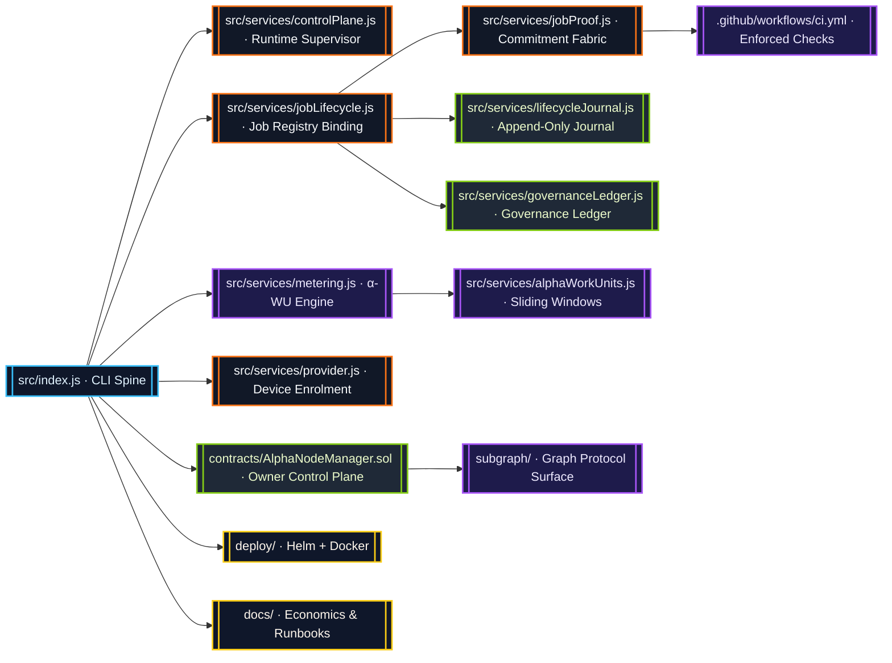

# AGI Alpha Node v0 · Sovereign Cognition Orchestrator ⚡

<!-- markdownlint-disable MD013 MD033 -->
<p align="center">
  <picture>
    <source srcset="1.alpha.node.agi.eth.svg" type="image/svg+xml" />
    
  </picture>
</p>

<p align="center">
  <a href="https://github.com/MontrealAI/AGI-Alpha-Node-v0/actions/workflows/ci.yml">
    
  </a>
  
  
  
  
  
  <a href="Dockerfile">
    
  </a>
  <a href="deploy/helm/agi-alpha-node">
    
  </a>
  <a href="docs/subgraph-deployment.md">
    
  </a>
  <a href="https://etherscan.io/address/0xa61a3b3a130a9c20768eebf97e21515a6046a1fa">
    
  </a>
  <a href="LICENSE">
    
  </a>
</p>

> AGI Alpha Node v0 is the command lattice where deterministic cognition, provable metering, and owner-directed governance converge. It channels intelligence, liquidity, and telemetry with precision worthy of planetary infrastructure.

---

## Contents

1. [Mandate](#mandate)
2. [Constellation](#constellation)
3. [Telemetry & Alpha-WU Metrics](#telemetry--alpha-wu-metrics)
4. [Status & Diagnostics Surfaces](#status--diagnostics-surfaces)
5. [Governance & Owner Mastery](#governance--owner-mastery)
6. [Operational Launch](#operational-launch)
7. [Continuous Verification & CI](#continuous-verification--ci)
8. [Token Mechanics](#token-mechanics)
9. [Repository Atlas](#repository-atlas)
10. [Reference Library](#reference-library)

---

## Mandate

The Alpha Node is engineered so an owner can redirect computation, staking posture, and validator policy instantly while maintaining crystalline observability. Every subsystem is tuned for production-critical deployments and runnable by a non-technical operator.

Highlights:

* **Deterministic cognition fabric** — lifecycle orchestration in [`src/services/jobLifecycle.js`](src/services/jobLifecycle.js) reconciles job state with α-WU telemetry.
* **Adaptive capital routing** — [`contracts/AlphaNodeManager.sol`](contracts/AlphaNodeManager.sol) centralizes pausing, staking redirection, validator rotation, ENS rebinding, reward distribution, and penalty enforcement.
* **Tamper-evident journaling** — governance and lifecycle ledgers append hashes that can be replayed and diffed against on-chain truth.
* **Owner totality** — every critical parameter is owner-controlled via contract functions, CLI commands, or automation scripts; there are no external custodians.
* **$AGIALPHA economy** — the canonical 18-decimal token at [`0xa61a3b3a130a9c20768eebf97e21515a6046a1fa`](https://etherscan.io/address/0xa61a3b3a130a9c20768eebf97e21515a6046a1fa) fuels staking, validator compensation, and alpha flywheels.

---

## Constellation



Every arrow is instrumented. Services emit events, journals hash entries, and CI enforces deterministic builds so the owner maintains a single source of truth spanning runtime, chain, and analytics surfaces.

---

## Telemetry & Alpha-WU Metrics

Prometheus metrics are exported by [`src/telemetry/monitoring.js`](src/telemetry/monitoring.js) and activated through `startMonitorLoop`. The following counters and gauges provide production-grade observability:

| Metric | Type | Labels | Description |
| ------ | ---- | ------ | ----------- |
| `alpha_wu_total` | Counter | `node_label`, `device_class`, `sla_profile` | Cumulative alpha work units emitted per device class and SLA. |
| `alpha_wu_epoch` | Gauge | `epoch_id` | α-WU totals rolled up by epoch during the monitor loop. |
| `alpha_wu_per_job` | Gauge | `job_id` | Optional high-cardinality per-job totals (enable via `enableAlphaWuPerJob`). |
| `agi_alpha_node_alpha_wu_*` | Gauges/Counters | windowed labels | Backwards-compatible metrics retained for observability dashboards. |
| `agi_alpha_node_agent_utilization` | Gauge | `agent` | Utilization ratios reported by diagnostics surfaces. |
| `agi_alpha_node_health_gate_state` | Gauge | `state` | Readiness posture from the ENS/stake health gate. |

Additional gauges track stake balances, heartbeat freshness, projected $AGIALPHA emissions, quality scores, and breakdown analytics. Metrics are exposed at `http://<host>:9464/metrics` by default.

**Segment Recording** — `metering.stopSegment` streams α-WU updates as soon as a compute segment closes, ensuring counters and gauges remain synchronized with on-chain proofs.

**Epoch Rollups** — `startMonitorLoop` refreshes recent epoch summaries and feeds them to `updateAlphaWorkUnitEpochMetrics`, which resets gauges prior to populating new samples to avoid stale labels.

---

## Status & Diagnostics Surfaces

The HTTP API in [`src/network/apiServer.js`](src/network/apiServer.js) exposes operational intelligence tuned for automated supervision and human-readable dashboards.

### `/status`

```jsonc
{
  "status": "ok",
  "offlineMode": false,
  "alphaWU": {
    "lastEpoch": { "id": "epoch-420", "alphaWU": 123.45 },
    "lifetimeAlphaWU": 9876.54
  }
}
```

* `lastEpoch` reflects the most recent monitor rollup.
* `lifetimeAlphaWU` aggregates α-WU from the metering engine for fast burn-rate calculations.

### `/status/diagnostics`

Detailed epoch history including per-job, per-device-class, and per-SLA breakdowns. Responses are numerically normalized and sorted for deterministic diffing. These surfaces power Grafana dashboards, automated alerting, and validation harnesses.

---

## Governance & Owner Mastery

The [`AlphaNodeManager`](contracts/AlphaNodeManager.sol) contract gives the owner full control to pause, upgrade identities, direct validators, and manage slashing. Key capabilities:

* **Pausing & resumption** — `pause()` and `unpause()` freeze staking, minting, and acceptance pathways when required.
* **Identity orchestration** — register ENS controllers, rotate keys, or revoke access on demand.
* **Validator authority** — add or remove validators, enforce stake minimums, and authorize validation events.
* **Stake management** — deposit/withdraw $AGIALPHA, reallocate balances, and record alpha work units validated or accepted.
* **Slash enforcement** — apply slashes with granular identifiers and validator attribution.

For scripted governance payloads, inspect [`src/services/governance.js`](src/services/governance.js) and the CLI surfaces in [`src/index.js`](src/index.js). Transaction builders return ABI-encoded payloads ready for multi-sig execution.

---

## Operational Launch

1. **Install dependencies**

   ```bash
   npm install
   ```

2. **Bootstrap local runtime**

   ```bash
   npm start -- --config config/local.json
   ```

3. **Expose telemetry** — ensure the runtime has access to the Prometheus endpoint or forward the port into your observability stack.
4. **Integrate diagnostics** — poll `/status` for liveness checks and `/status/diagnostics` for granular reporting.
5. **Run owner directives** — use `npm run scripts -- <command>` to craft transactions or integrate directly with the governance service.

Offline-first operators can load historical state snapshots via `--offline-snapshot <path>` which feeds deterministic data back into the telemetry subsystem.

---

## Continuous Verification & CI

```mermaid
flowchart TD
  classDef gate fill:#0f172a,stroke:#22c55e,stroke-width:2px,color:#dcfce7;
  classDef test fill:#1e1b4b,stroke:#a855f7,stroke-width:2px,color:#ede9fe;
  classDef build fill:#111827,stroke:#38bdf8,stroke-width:2px,color:#e0f2fe;

  Trigger[[Pull Request · main]]:::gate --> Verify[ci.yml · npm run ci:verify]:::build
  Verify --> Lint[Markdown + Link Lint]:::test
  Verify --> Unit[Vitest + Coverage]:::test
  Verify --> Solidity[Solhint + solc ABI build]:::test
  Verify --> Subgraph[Graph Codegen + Build]:::test
  Verify --> Security[NPM Audit (High)]:::test
  Verify --> Policy[Health Gate + Branch Policy]:::gate
  Verify --> Badge[[Status Badge Updated]]:::build
```

PR checks are enforced on `main` and must remain green before merge. Recommended local validation:

```bash
npm run lint
npm run test
npm run coverage
npm run ci:solidity
npm run ci:verify
```

---

## Token Mechanics

* **Token** — `$AGIALPHA` (`18` decimals) at [`0xa61a3b3a130a9c20768eebf97e21515a6046a1fa`](https://etherscan.io/address/0xa61a3b3a130a9c20768eebf97e21515a6046a1fa).
* **Staking** — operators stake via `stake(uint256)` once identity is active; the contract enforces pause gates and stake sufficiency.
* **Emissions & rewards** — telemetry surfaces expose projected rewards so owners can rebalance validators, redirect emissions, or enforce slashing.

---

## Repository Atlas

| Domain | Path | Notes |
| ------ | ---- | ----- |
| CLI & Runtime | [`src/index.js`](src/index.js) | Entry point, argument parsing, and orchestration bootstrap. |
| Orchestrator | [`src/orchestrator/`](src/orchestrator) | Monitor loop, diagnostics, offline snapshots, telemetry wiring. |
| Services | [`src/services/`](src/services) | Metering, lifecycle, governance, provider enrolment, economic models. |
| Telemetry | [`src/telemetry/`](src/telemetry) | Prometheus exporters, alpha metric normalization, monitoring server. |
| Network API | [`src/network/apiServer.js`](src/network/apiServer.js) | REST surfaces for jobs, diagnostics, governance payloads. |
| Smart Contracts | [`contracts/`](contracts) | Owner-managed control plane and interfaces. |
| Subgraph | [`subgraph/`](subgraph) | Assembly, manifests, and indexing scripts. |
| Deployment | [`deploy/`](deploy) | Docker + Helm charts for production rollouts. |
| Docs & Economics | [`docs/`](docs) | Whitepapers, economic models, and operator guides. |

---

## Reference Library

* [Economics & Flywheel](docs/economics.md)
* [Operator Runbook](docs/README.md)
* [Manifesto](docs/manifesto.md)
* [Subgraph Deployment](docs/subgraph-deployment.md)
* [License](LICENSE)

---

The AGI Alpha Node exists to help autonomous agent swarms identify and exploit alpha, orchestrate jobs through blockchain coordination, and scale nodes that reshape the global economy. With telemetry, governance, and CI discipline intertwined, the runtime operates with the confidence of a network built for Kardashev-scale aspirations.
