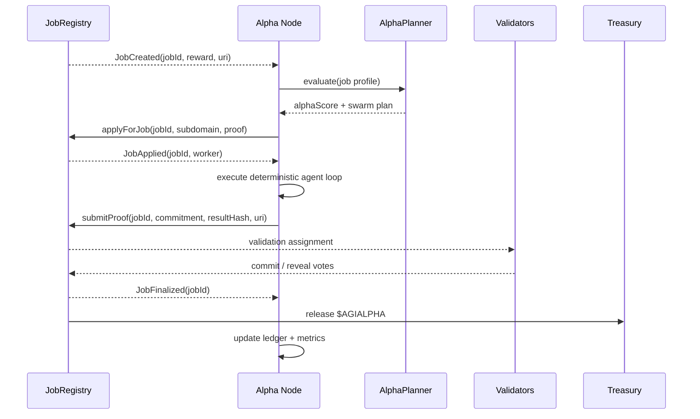
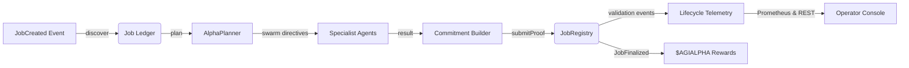
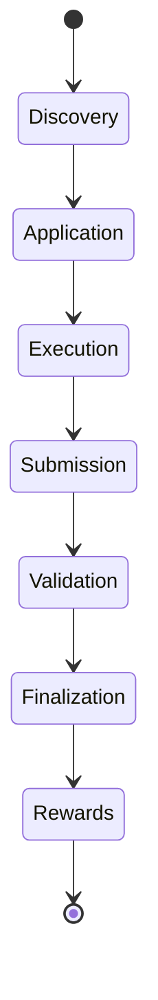
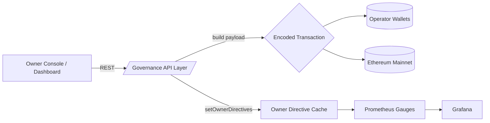

# AGI Alpha Node v0 ⚡ Sovereign Intelligence Yield Core

<!-- markdownlint-disable MD013 MD033 -->
<p align="center">
  
</p>

<p align="center">
  <a href="https://github.com/MontrealAI/AGI-Alpha-Node-v0/actions/workflows/ci.yml">
    
  </a>
  <a href="https://app.ens.domains/name/alpha.node.agi.eth">
    
  </a>
  <a href="https://etherscan.io/token/0xa61a3b3a130a9c20768eebf97e21515a6046a1fa">
    
  </a>
  
  
  
  
  
  <a href="Dockerfile">
    
  </a>
  <a href="LICENSE">
    
  </a>
</p>

> The AGI Alpha Node is the production brainstem that sovereign operators unleash to harvest $AGIALPHA yields, verify ENS custody, orchestrate job swarms, and assert total owner supremacy. This runtime is engineered as the machine that bends economic gravity—deterministic, observable, and ready to reorder markets the instant it boots.

---

## Table of Contents

1. [Prime Directive](#prime-directive)
2. [Feature Matrix](#feature-matrix)
3. [Job Lifecycle Orchestration](#job-lifecycle-orchestration)
4. [AGI Jobs Integration Lifecycle](#agi-jobs-integration-lifecycle)
5. [Operator Activation Sequence](#operator-activation-sequence)
6. [Command Console](#command-console)
7. [API Surface & Telemetry](#api-surface--telemetry)
8. [Configuration Switchboard](#configuration-switchboard)
9. [Deployment Continuum](#deployment-continuum)
10. [Observability & Governance](#observability--governance)
11. [Repository Atlas](#repository-atlas)
12. [CI & Branch Hardening](#ci--branch-hardening)
13. [Contributing](#contributing)
14. [License](#license)

---

## Prime Directive

| Vector | Signal | Coordinates |
| ------ | ------ | ----------- |
| **Identity Root** | ENS anchor enforced at runtime. | [`alpha.node.agi.eth`](https://app.ens.domains/name/alpha.node.agi.eth) — operate via delegated labels such as `1.alpha.node.agi.eth`. |
| **Treasury Asset** | `$AGIALPHA` (18 decimals). | [Etherscan contract `0xa61a3b3a130a9c20768eebf97e21515a6046a1fa`](https://etherscan.io/token/0xa61a3b3a130a9c20768eebf97e21515a6046a1fa). |
| **Runtime Spine** | CLI orchestrator & diagnostics loop. | [`src/index.js`](src/index.js) — verifies ENS, inspects staking, synthesizes owner directives, and controls job swarms. |
| **Intelligence Core** | Meta-agent lattice with antifragile heuristics. | [`src/intelligence`](src/intelligence) — planning, swarm routing, local-model fallbacks, and stress harness. |
| **Job Lifecycle Engine** | On-chain job discovery, application, submission, and finalization. | [`src/services/jobLifecycle.js`](src/services/jobLifecycle.js), [`src/network/apiServer.js`](src/network/apiServer.js). |
| **Governance Plane** | Owner-exclusive transaction builders. | [`src/services/governance.js`](src/services/governance.js), [`src/services/controlPlane.js`](src/services/controlPlane.js). |
| **Telemetry Spine** | Prometheus metrics + REST status feeds. | [`src/telemetry/monitoring.js`](src/telemetry/monitoring.js), [`src/network/apiServer.js`](src/network/apiServer.js). |
| **Deployment Surface** | Docker + Helm for one command activation. | [`Dockerfile`](Dockerfile), [`deploy/helm/agi-alpha-node`](deploy/helm/agi-alpha-node). |

---

## Feature Matrix

| Capability | Highlights | Source |
| ---------- | ---------- | ------ |
| ENS Verification | Registry + NameWrapper proofs with fail-fast enforcement. | [`src/services/ensVerifier.js`](src/services/ensVerifier.js) |
| Stake Intelligence | Minimum stake, penalties, and reward projections with BigInt precision. | [`src/services/staking.js`](src/services/staking.js), [`src/services/rewards.js`](src/services/rewards.js) |
| Token Flows | Allowances, approvals, and stake transactions using 18 decimal discipline. | [`src/services/token.js`](src/services/token.js) |
| Job Lifecycle | Discover, apply, submit, and finalize jobs through deterministic on-chain payloads. | [`src/services/jobLifecycle.js`](src/services/jobLifecycle.js) |
| Monitoring Loop | Continuous diagnostics with Prometheus export and health classification. | [`src/orchestrator/monitorLoop.js`](src/orchestrator/monitorLoop.js) |
| Container Health | Docker healthcheck hits `/metrics`; Helm liveness/readiness probes baked in. | [`src/healthcheck.js`](src/healthcheck.js), [`deploy/helm/agi-alpha-node/templates/deployment.yaml`](deploy/helm/agi-alpha-node/templates/deployment.yaml) |
| Offline Snapshots | Signed JSON snapshots for air-gapped continuity; auto-loaded by CLI & monitor. | [`src/services/offlineSnapshot.js`](src/services/offlineSnapshot.js) |
| Owner Commands | Transaction builders for pause/resume, stake thresholds, and share tuning. | [`src/services/governance.js`](src/services/governance.js), [`src/services/controlPlane.js`](src/services/controlPlane.js) |

---

## Job Lifecycle Orchestration

The node now executes the entire AGI Jobs lifecycle autonomously — from catching `JobCreated` events to claiming escrowed rewards after finalization. The lifecycle engine is resilient to on-chain upgrades, understands commit–reveal validation, and exposes REST hooks for external dashboards.



### Real-time Discovery

- WebSocket-grade polling grabs `JobCreated` logs within a configurable block window (`JOB_DISCOVERY_BLOCK_RANGE`).
- Snapshot-aware fallback ensures discovery continues when RPC routes falter.
- REST endpoint `GET /jobs/open` streams the active queue for dashboards.

### Strategic Application & Execution

- `jobs apply` CLI command or REST `POST /jobs/{id}/apply` crafts the `applyForJob` transaction with ENS subdomain and optional Merkle proof.
- The orchestrator routes workloads through [`src/intelligence`](src/intelligence), automatically shifting to local models when remote APIs degrade.

### Deterministic Submission & Validation

- `jobs submit` computes commitments via [`createJobProof`](src/services/jobProof.js) and attempts `submitProof`, `submit`, or `completeJob` depending on contract availability.
- REST `POST /jobs/{id}/submit` and `POST /jobs/{id}/finalize` mirror the CLI for integrations.
- Job metrics feed into Prometheus gauges so operators can watch earnings, throughput, and validator posture in real time.



## AGI Jobs Integration Lifecycle

The lifecycle engine is synchronized with AGI Jobs v0/v2 from the moment an employer escrows funds through reward release. Each stage is observable, restartable, and exposes deterministic hooks for dashboards, custom schedulers, and manual overrides.



### 1. Discovery

- `createJobLifecycle().discover()` streams `JobCreated` events, normalizes metadata, and records them in the local ledger while respecting the configured block range so the node never misses openings.【F:src/services/jobLifecycle.js†L256-L321】
- Long-running operators call `createJobLifecycle().watch()` to subscribe to creation, application, assignment, submission, and finalization events for real-time dashboards and WebSocket relays.【F:src/services/jobLifecycle.js†L430-L519】
- REST `GET /jobs/open` and CLI `jobs discover` surface the cached queue to any external orchestrator.【F:src/network/apiServer.js†L33-L120】

### 2. Application

- `createJobLifecycle().apply()` builds `applyForJob` transactions with ENS subdomain and whitelist proof fallbacks, incrementing lifecycle metrics for observability.【F:src/services/jobLifecycle.js†L323-L374】
- CLI `jobs apply` or API `POST /jobs/{id}/apply` route requests through the same deterministic builder so human operators and automation share a single code path.【F:src/network/apiServer.js†L141-L215】
- Transaction receipts are logged to the action emitter, enabling Prometheus counters and Grafana alerts when bids succeed or fail.【F:src/services/jobLifecycle.js†L303-L321】

### 3. Execution & Planning

- Accepted jobs flow through the `intelligence/` lattice where the planner, swarm orchestrator, and antifragile stress harness evaluate risk, allocate specialists, and project profit.【F:src/intelligence/planning.js†L7-L123】【F:src/intelligence/swarmOrchestrator.js†L6-L118】【F:src/intelligence/stressHarness.js†L6-L111】
- `startMonitorLoop()` folds execution telemetry into owner directives so operators see when workloads should pause, escalate, or reinvest before deadlines bite.【F:src/orchestrator/monitorLoop.js†L1-L147】【F:src/services/controlPlane.js†L71-L199】

### 4. Submission & Proofs

- `createJobLifecycle().submit()` generates deterministic commitments via `createJobProof`, automatically falling back across `submitProof`, `submit`, or `completeJob` to match whichever interface the registry exposes.【F:src/services/jobLifecycle.js†L376-L424】【F:src/services/jobProof.js†L6-L120】
- API `POST /jobs/{id}/submit` persists metadata, URIs, and commitments for audit replay so every submission is reproducible offline.【F:src/network/apiServer.js†L217-L307】

### 5. Validation Surveillance

- Event watchers record `JobSubmitted` and `JobAssigned` so the node can track when validators are engaged and when it is awaiting review, allowing dashboards to highlight dispute windows.【F:src/services/jobLifecycle.js†L472-L506】
- The diagnostics pipeline exposes heartbeat freshness, penalties, and validator share projections so owners can decide whether to pause workloads until validation resolves.【F:src/orchestrator/nodeRuntime.js†L1-L196】【F:src/services/controlPlane.js†L71-L251】

### 6. Finalization & Rewards

- `createJobLifecycle().finalize()` wraps `finalize`/`finalizeJob`, increments finalization counters, and updates the ledger so the node knows exactly when escrow unlocked.【F:src/services/jobLifecycle.js†L426-L470】
- Reward projections, stake activation, and reinvestment strategies are computed through `projectEpochRewards`, `acknowledgeStakeAndActivate`, and `optimizeReinvestmentStrategy` to keep $AGIALPHA compounding.【F:src/services/rewards.js†L6-L180】【F:src/services/stakeActivation.js†L5-L129】【F:src/services/economics.js†L6-L152】

### 7. Validator & Dispute Mode

- Owners can dual-role the node by staking validator allocations and letting automation craft commit/reveal payloads via the governance API while still monitoring for slash risks.【F:src/services/controlPlane.js†L201-L356】【F:src/network/apiServer.js†L309-L403】
- Offline snapshots capture stake, directives, and pending validations so operations can be reproduced without RPC dependencies—a must for legal/compliance playback.【F:src/services/offlineSnapshot.js†L6-L189】

---

## Operator Activation Sequence

1. **Clone & Install**

   ```bash
   git clone https://github.com/MontrealAI/AGI-Alpha-Node-v0.git
   cd AGI-Alpha-Node-v0
   npm ci
   ```

2. **Verify Toolchain & ENS**

   ```bash
   node --version   # must be >= 20.18.1
   npx agi-alpha-node ens-guide --label 1 --address 0xYOUR_OPERATOR_ADDRESS
   npx agi-alpha-node verify-ens \
     --label 1 \
     --address 0xYOUR_OPERATOR_ADDRESS \
     --rpc https://mainnet.infura.io/v3/<PROJECT_ID>
   ```

3. **Stake Discipline**

   ```bash
   npx agi-alpha-node token approve \
     --token 0xa61a3b3a130a9c20768eebf97e21515a6046a1fa \
     --spender 0xStakeManager \
     --owner 0xYOUR_OPERATOR_ADDRESS \
     --amount max

   npx agi-alpha-node stake-tx \
     --amount 1500 \
     --incentives 0xIncentivesContract \
     --stake-manager 0xStakeManager \
     --decimals 18
   ```

4. **Lifecycle Intelligence**

   ```bash
   # Inspect the live job queue
   npx agi-alpha-node jobs discover \
     --registry 0xJobRegistry \
     --rpc https://mainnet.infura.io/v3/<PROJECT_ID>

   # Auto-apply using configured ENS subdomain
   npx agi-alpha-node jobs apply <jobId> \
     --registry 0xJobRegistry \
     --rpc https://mainnet.infura.io/v3/<PROJECT_ID> \
     --subdomain 1

   # Submit a completed artifact
   npx agi-alpha-node jobs submit <jobId> \
     --registry 0xJobRegistry \
     --result-file ./artifacts/result.json \
     --result-uri ipfs://Qm...
   ```

5. **Diagnostics Sweep**

   ```bash
   npx agi-alpha-node status \
     --label 1 \
     --address 0xYOUR_OPERATOR_ADDRESS \
     --rpc https://mainnet.infura.io/v3/<PROJECT_ID> \
     --stake-manager 0xStakeManager \
     --incentives 0xIncentivesContract \
     --system-pause 0xSystemPause \
     --desired-minimum 1500 \
     --operator-share-bps 1600 \
     --validator-share-bps 7300 \
     --treasury-share-bps 1100 \
     --role-share guardian=250,validator=7500
   ```

6. **One-Click Container**

   ```bash
   docker run -it --rm \
     -p 8080:8080 \
     -p 9464:9464 \
     --env-file node.env \
     -v $(pwd)/node.env:/config/node.env:ro \
     -v $(pwd)/snapshot.json:/config/snapshot.json:ro \
     ghcr.io/montrealai/agi-alpha-node:latest
   ```

   *Docker entrypoint validates ENS, hydrates Vault secrets (when configured), mounts offline snapshots, and surfaces job metrics at `/metrics`.*

---

## Command Console

| Command | Purpose | Highlights |
| ------- | ------- | ---------- |
| `npx agi-alpha-node verify-ens` | ENS custody attestation. | Confirms registry + wrapper ownership; fails fast on mismatches. |
| `npx agi-alpha-node status` | Full diagnostics heartbeat. | Combines ENS, stake posture, owner directives, and telemetry snapshot. |
| `npx agi-alpha-node jobs discover` | Stream open jobs. | Uses on-chain logs, respects `JOB_DISCOVERY_BLOCK_RANGE`, prints reward + tags. |
| `npx agi-alpha-node jobs apply <jobId>` | Apply for a job. | Crafts `applyForJob`, accepts optional proof + subdomain override. |
| `npx agi-alpha-node jobs submit <jobId>` | Commit and submit work. | Derives deterministic commitment, pushes `submitProof`, records URI + metadata. |
| `npx agi-alpha-node jobs finalize <jobId>` | Release rewards. | Invokes `finalize`/`finalizeJob`, freeing escrowed $AGIALPHA. |
| `npx agi-alpha-node token allowance` | Inspect ERC-20 allowance. | Uses canonical token normalization and BigInt formatting. |
| `npx agi-alpha-node governance ...` | Owner supremacy actions. | Build pause/resume, minimum stake, global share, and role share transactions. |

---

## API Surface & Telemetry

| Endpoint | Method | Description |
| -------- | ------ | ----------- |
| `/healthz` | GET | Readiness probe with submission counters and provider mode. |
| `/jobs` | GET | Returns local execution ledger **and** discovered on-chain jobs. |
| `/jobs/open` | GET | Dedicated feed of open jobs tracked by the lifecycle engine. |
| `/jobs/{id}` | GET | Fetches either a local ledger entry or an on-chain job snapshot. |
| `/jobs` | POST | Submit an off-chain job payload to the local orchestrator. |
| `/jobs/{id}/apply` | POST | Triggers on-chain `applyForJob`; uses configured signer. |
| `/jobs/{id}/submit` | POST | Commits + submits a completed job result with metadata. |
| `/jobs/{id}/finalize` | POST | Finalizes a validated job and releases rewards. |
| `/metrics` | GET | Prometheus gauges for stake, throughput, success rate, token earnings, provider modes. |
| `/governance/directives` | GET | Snapshotted owner directives (priority, notices, encoded actions). |
| `/governance/pause` | POST | Generates pause/resume payloads for the SystemPause contract. |
| `/governance/minimum-stake` | POST | Encodes StakeManager `setMinimumStake` transactions. |
| `/governance/role-share` | POST | Crafts RewardEngine `setRoleShare` payloads for targeted roles. |
| `/governance/global-shares` | POST | Aligns operator / validator / treasury basis-point splits. |
| `/governance/stake-top-up` | POST | Builds PlatformIncentives `stakeAndActivate` payloads for rapid staking. |

All API responses serialize `BigInt` values into decimal strings to remain JSON friendly. The lifecycle engine emits action events which the API converts into real-time chain operation counters.

### Governance Autopilot API

Owner control surfaces are now HTTP-native — every directive, pause, or rebalancing move can be triggered without touching a CLI. The API responds with **ready-to-broadcast** transaction payloads so operators can copy/paste into any signer or hardware wallet workflow.



#### Directive Metrics

- `metrics.governance.directivesUpdates` — counts how many times governance priorities change (driven by diagnostics + monitor loop).
- `metrics.governance.payloads` — increments whenever a governance payload endpoint is invoked, offering real-time visibility into how aggressively the owner is steering the node.

---

## Configuration Switchboard

| Variable | Purpose | Notes |
| -------- | ------- | ----- |
| `RPC_URL` | Primary Ethereum RPC endpoint. | Required for online mode. |
| `ENS_PARENT_DOMAIN` | Root ENS domain (`alpha.node.agi.eth`). | Used to build full ENS names. |
| `NODE_LABEL` | ENS subdomain label (`1`, `atlas`, etc.). | Mandatory for ENS verification. |
| `OPERATOR_ADDRESS` | Checksummed address expected to own the ENS label. | Mandatory for verification. |
| `PLATFORM_INCENTIVES_ADDRESS` | Address of PlatformIncentives contract. | Enables automated stake activation. |
| `STAKE_MANAGER_ADDRESS` | Address of StakeManager contract. | Required for minimum stake governance. |
| `REWARD_ENGINE_ADDRESS` | RewardEngine contract address. | Enables global/role share transactions. |
| `JOB_REGISTRY_ADDRESS` | JobRegistry contract to monitor and control. | Powers the lifecycle engine. |
| `JOB_DISCOVERY_BLOCK_RANGE` | Block window used for discovery scans. | Default `4800` blocks. |
| `JOB_APPLICATION_PROOF` | Hex-encoded Merkle proof for gated registries. | Defaults to `0x` (no whitelist). |
| `METRICS_PORT` | Prometheus listener port (default `9464`). | Configurable per cluster. |
| `API_PORT` | REST API listener port (default `8080`). | Exposes `/jobs`, `/healthz`, etc. |
| `AUTO_STAKE` | Enable automatic stake top-ups. | Requires `OPERATOR_PRIVATE_KEY`. |
| `OPERATOR_PRIVATE_KEY` | Hex private key for signing transactions. | Loaded via env or Vault integration. |
| `OFFLINE_MODE` | Force offline snapshot mode. | When true, RPC calls are skipped. |
| `OFFLINE_SNAPSHOT_PATH` | Path to signed offline JSON snapshot. | Used for air-gapped verification. |
| `DESIRED_MINIMUM_STAKE` | Preferred minimum stake (decimal). | Generates governance directives. |
| `AUTO_RESUME` | Automatically resume when posture healthy. | Requires `SYSTEM_PAUSE_ADDRESS`. |
| `DESIRED_OPERATOR_SHARE_BPS` | Target operator share (bps). | Combined with validator + treasury to equal 10000. |
| `DESIRED_VALIDATOR_SHARE_BPS` | Target validator share (bps). | " |
| `DESIRED_TREASURY_SHARE_BPS` | Target treasury share (bps). | " |
| `ROLE_SHARE_TARGETS` | JSON or CSV role share policy (`guardian=250`). | Feeds `setRoleShare` actions. |
| `VAULT_ADDR`, `VAULT_SECRET_PATH`, `VAULT_SECRET_KEY`, `VAULT_TOKEN` | Vault integration knobs. | Hydrate secrets into runtime. |

Refer to [`src/config/schema.js`](src/config/schema.js) for the authoritative schema and coercion logic.

---

## Deployment Continuum

### Docker One-Click

```bash
cp deploy/docker/node.env.example node.env
$EDITOR node.env

docker run -it --rm \
  -p 8080:8080 \
  -p 9464:9464 \
  --env-file node.env \
  -v $(pwd)/node.env:/config/node.env:ro \
  -v $(pwd)/snapshot.json:/config/snapshot.json:ro \
  ghcr.io/montrealai/agi-alpha-node:latest
```

#### Entrypoint Summary

- Validates ENS custody before booting.
- Hydrates secrets from Vault when configured.
- Mounts offline snapshots and local model palettes.
- Fails fast if registry wrapper owner mismatches `OPERATOR_ADDRESS`.

### Kubernetes / Helm

```bash
helm upgrade --install agi-alpha-node ./deploy/helm/agi-alpha-node \
  --namespace agi-alpha --create-namespace \
  --set config.nodeLabel=1 \
  --set config.operatorAddress=0xYOUR_OPERATOR_ADDRESS \
  --set config.rpcUrl=https://mainnet.infura.io/v3/<PROJECT_ID> \
  --set config.jobRegistryAddress=0xJobRegistry \
  --set config.apiPort=8080 \
  --set secretConfig.operatorPrivateKey=0xYOUR_PRIVATE_KEY \
  --set config.autoStake=true
```

#### Chart Features

- Liveness/readiness probes hitting `/healthz` and `/metrics`.
- Optional autoscaling (`autoscaling.enabled=true`).
- ConfigMap-based offline snapshots for high-availability clusters.
- Native support for Vault secret injection.

---

## Observability & Governance

- **Telemetry:** `npm run start` exposes Prometheus gauges (`jobThroughput`, `jobSuccess`, `tokenEarnings`, `providerMode`).
- **Owner Directives:** [`src/services/controlPlane.js`](src/services/controlPlane.js) synthesizes governance actions (pause, resume, stake floors, share alignment) based on live posture.
- **Governance Payloads:** The REST governance suite (`/governance/pause`, `/governance/minimum-stake`, `/governance/global-shares`, `/governance/role-share`) produces ready-to-broadcast transactions so owners can retune every contract parameter, pause execution, or rebalance revenue splits without touching core code.【F:src/network/apiServer.js†L309-L403】【F:src/services/governance.js†L1-L120】
- **Stake Automation:** [`src/services/stakeActivation.js`](src/services/stakeActivation.js) auto-broadcasts `acknowledgeStakeAndActivate` when deficits arise.
- **Lifecycle Metrics:** [`src/network/apiServer.js`](src/network/apiServer.js) merges local execution metrics with on-chain lifecycle counters, ensuring dashboards reflect both deterministic loops and protocol actions.

---

## Repository Atlas

```text
src/
├── config/                # Environment schema + loader
├── constants/             # Token constants, symbols, decimals
├── intelligence/          # Planning, swarms, antifragile loops
├── network/               # REST API surface + lifecycle endpoints
├── orchestrator/          # Diagnostics, bootstrap, monitor loop
├── services/              # ENS, staking, governance, lifecycle, tokens
├── telemetry/             # Prometheus server + gauges
└── utils/                 # Formatting helpers
```

- [`test/`](test) houses Vitest suites covering lifecycle, governance, ENS, staking, and orchestration flows.
- [`deploy/`](deploy) packages Docker + Helm manifests for cluster rollouts.

---

## CI & Branch Hardening

- **CI Pipeline:** [`Continuous Integration`](https://github.com/MontrealAI/AGI-Alpha-Node-v0/actions/workflows/ci.yml) runs lint + tests on `main` and every PR. Branch protection requires a green pipeline before merge.
- **Local Checks:**

  ```bash
  npm test          # Vitest suite (job lifecycle, governance, staking, intelligence)
  npm run lint      # Markdown lint + link validation for docs
  ```

- **Coverage:** `npm run coverage` emits text + lcov reports for integration into third-party dashboards.
- **Branch Enforcement Ritual:** Require the "Continuous Integration" workflow and at least one approving review on `main`. Confirm enforcement via GitHub CLI or API, archive the JSON with CI logs, and attach to the owner’s compliance vault.

  ```bash
  gh api repos/MontrealAI/AGI-Alpha-Node-v0/branches/main/protection --method GET
  ```

---

## Contributing

Pull requests are welcomed. Ensure new functionality includes tests, documentation updates, and remains deterministic under offline snapshots. The node operates in high-stakes environments—treat every contribution as if mainnet funds depend on it.

---

## License

MIT — see [`LICENSE`](LICENSE).
