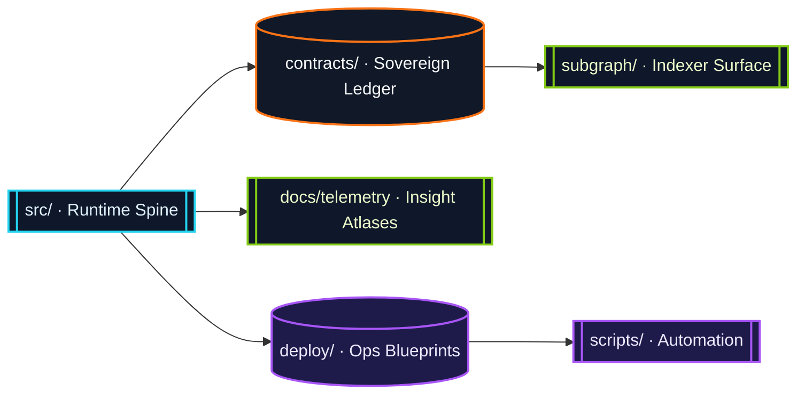
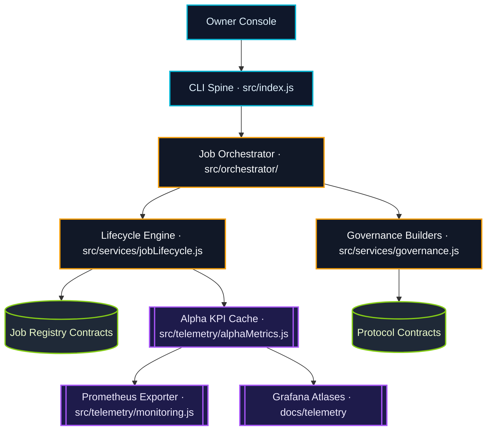
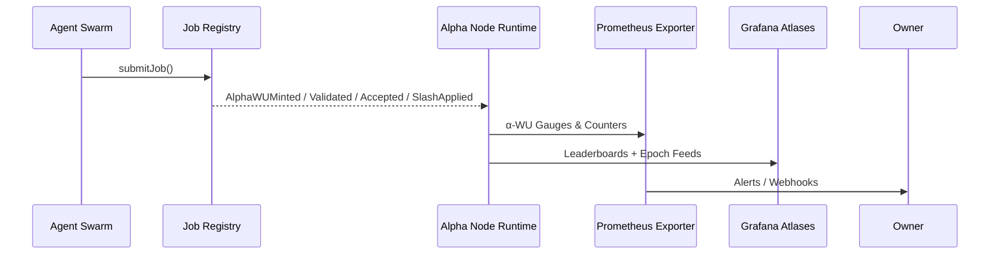

# AGI Alpha Node v0 · Sovereign Cognition Spine ⚡

<!-- markdownlint-disable MD013 MD033 -->
<p align="center">
  <picture>
    <source srcset="1.alpha.node.agi.eth.svg" type="image/svg+xml" />
    
  </picture>
</p>

<p align="center">
  <a href="https://github.com/MontrealAI/AGI-Alpha-Node-v0/actions/workflows/ci.yml">
    
  </a>
  
  
  <a href="Dockerfile">
    
  </a>
  <a href="deploy/helm/agi-alpha-node">
    
  </a>
  <a href="https://etherscan.io/address/0xa61a3b3a130a9c20768eebf97e21515a6046a1fa">
    
  </a>
  <a href="LICENSE">
    
  </a>
</p>

> The control plane that shapes global alpha: deterministic work units, ruthless telemetry, and total operator sovereignty in a single deployable lattice.

---

## Contents

1. [Mission & Highlights](#mission--highlights)
2. [Repository Topography](#repository-topography)
3. [Runtime Lattice](#runtime-lattice)
4. [α-WU Economics](#α-wu-economics)
5. [Smart Contract Sovereignty](#smart-contract-sovereignty)
6. [Telemetry & Insight Mesh](#telemetry--insight-mesh)
7. [Deployment & Operations](#deployment--operations)
8. [Governance & Owner Controls](#governance--owner-controls)
9. [Continuous Integration](#continuous-integration)
10. [Quickstart](#quickstart)
11. [Testing & Quality Gates](#testing--quality-gates)
12. [Further Reading](#further-reading)

---

## Mission & Highlights

AGI Alpha Node v0 is the command spine for validator-weighted α-work units. It couples blockchain truth with high-intensity compute routing so that a single owner can steer a fleet of agents, enclaves, and validators in real time.

* **Unified Metering:** [`src/constants/workUnits.js`](src/constants/workUnits.js) defines α-WU from first principles and powers every on-chain reward, KPI, and treasury shift.
* **Owner Supremacy:** [`contracts/AlphaNodeManager.sol`](contracts/AlphaNodeManager.sol) provides fine-grained ownership controls—pause, resume, reassign validators, rotate ENS identities, and redirect stakes instantly.
* **Observability First:** Prometheus exporters, Grafana blueprints, and streaming KPIs render every alpha pulse visible.
* **Battle-tested Delivery:** Container images, Helm charts, and CI enforcement ensure non-technical operators can deploy and audit the node safely.

---

## Repository Topography

| Surface | Description |
| --- | --- |
| [`src/`](src) | Node.js runtime, orchestration services, telemetry exporters, and config schema. |
| [`contracts/`](contracts) | Solidity control plane for validators, staking, and work unit events. |
| [`docs/`](docs) | Economics papers, telemetry references, and the new [`α-WU framework`](docs/alpha-wu.md). |
| [`deploy/`](deploy) | Helm chart, Kubernetes manifests, and operational bootstrapping. |
| [`scripts/`](scripts) | Automation for CI gates, subgraph rendering, and governance verification. |
| [`subgraph/`](subgraph) | Graph Protocol mappings aligned with on-chain KPI events. |



---

## Runtime Lattice

The runtime weaves CLI commands, orchestration daemons, and streaming telemetry into a coherent sovereignty mesh.



*Commands fire from [`src/index.js`](src/index.js) and traverse the orchestrator, ensuring deterministic application of policy, treasury directives, and ENS guardianship.*

---

## α-WU Economics

α-work units are the canonical ledger for all compute accomplished by the node. They combine GPU minutes, workload classification, VRAM tier, SLA profile, and benchmark multipliers into a single metric.

* **Base Unit:** `ALPHA_WU = 1` within [`src/constants/workUnits.js`](src/constants/workUnits.js).
* **Configurable Weights:** The `WORK_UNITS` block in [`src/config/schema.js`](src/config/schema.js) accepts JSON overrides to adjust model class, VRAM, SLA, and benchmark weights—invalid or negative entries are rejected.
* **Documentation:** Refer to the dedicated [α-WU framework](docs/alpha-wu.md) for canonical tables and worked examples (including 20-minute 80 GB, 70B low-latency enclave jobs).
* **Ledger Impact:** KPI dashboards, staking rewards, and treasury routing all derive from these weights; adjust them to express bespoke economics without touching code.

Example override:

```bash
export WORK_UNITS='{"baseUnit":1.5,"epochDurationSeconds":1800,"weights":{"modelClass":{"LLM_70B":5.0}}}'
```

---

## Smart Contract Sovereignty

The Solidity surface is tailored for absolute owner control while honoring canonical $AGIALPHA staking.

| Contract | Role | Owner Controls |
| --- | --- | --- |
| [`AlphaNodeManager.sol`](contracts/AlphaNodeManager.sol) | Ownable orchestrator for validators, staking, and α-WU event emission. | Pause / unpause, assign validators, register ENS identities, rotate controllers, set identity status, revoke identities, and manage stake flows. |
| [`IAlphaWorkUnitEvents.sol`](contracts/interfaces/IAlphaWorkUnitEvents.sol) | Shared ABI for runtime, subgraph, and off-chain analytics. | Emits `AlphaWUMinted`, `AlphaWUValidated`, `AlphaWUAccepted`, and `SlashApplied`. |

*The canonical $AGIALPHA token (18 decimals) is fixed at [`0xa61a3b3a130a9c20768eebf97e21515a6046a1fa`](https://etherscan.io/address/0xa61a3b3a130a9c20768eebf97e21515a6046a1fa); schema validation enforces this checksum for every deployment.*

---

## Telemetry & Insight Mesh

Prometheus gauges, Grafana atlases, and CLI KPIs share the same α-WU cache so that every vantage point remains synchronized.



* Gauges live in [`src/telemetry/monitoring.js`](src/telemetry/monitoring.js).
* Grafana JSON atlases reside in [`docs/telemetry`](docs/telemetry).
* KPI calculations reuse [`src/telemetry/alphaMetrics.js`](src/telemetry/alphaMetrics.js) for deterministic reporting across CLI, Prometheus, and dashboards.

---

## Deployment & Operations

| Surface | Highlights |
| --- | --- |
| [`Dockerfile`](Dockerfile) | Node.js 20 production image with CLI, telemetry exporters, and healthchecks baked in. |
| [`deploy/helm/agi-alpha-node`](deploy/helm/agi-alpha-node) | Helm chart orchestrating ConfigMaps, Prometheus scraping, ENS secrets, and rollout policies. |
| [`scripts/`](scripts) | Tooling for verifying health gates, rendering subgraph manifests, and simulating KPI flows. |

Operational recommendations:

1. Build or pull the Docker image and supply environment overrides via Kubernetes secrets or `.env` files.
2. Apply the Helm chart with enforced `WORK_UNITS` overrides if the economics differ from the canonical tables.
3. Wire Prometheus to scrape the exporter endpoint (`METRICS_PORT`, default `9464`).
4. Forward Grafana dashboards using the JSON atlases for immediate visualization.

---

## Governance & Owner Controls

The owner address wields complete authority over runtime parameters and can adjust business levers without redeploying contracts.

* **Pausing:** `pause()` and `unpause()` freeze or resume validator activity instantly.
* **Validator Registry:** `setValidator(address,bool)` approves or revokes operators.
* **Identity Mesh:** Register ENS nodes, rotate controllers, and toggle activation through `registerIdentity`, `updateIdentityController`, and `setIdentityStatus`.
* **Stake Custody:** Deposit or withdraw stakes, enforce minimums via configuration, and align treasury shares with `ROLE_SHARE_TARGETS`.
* **Work Unit Policy:** Tune α-WU economics through `WORK_UNITS` configuration; the runtime validates inputs before bootstrapping.

---

## Continuous Integration

All pull requests and the `main` branch are protected by a comprehensive CI suite defined in [`.github/workflows/ci.yml`](.github/workflows/ci.yml). Required checks (codified in [`.github/required-checks.json`](.github/required-checks.json)) enforce:

1. **Linting:** Markdown + link lint, Solidity lint, TypeScript/JS generation gates.
2. **Testing:** Vitest unit suite, Solidity compilation, subgraph build validation.
3. **Security & Policy:** `npm audit`, health gate verification, and branch policy checks.
4. **Coverage:** Automated coverage reporting via CI badge above.

A green badge on this README reflects the current status of all required checks. The workflow blocks merges unless every gate is satisfied.

---

## Quickstart

```bash
npm install
npm run start -- --help                 # Explore CLI commands
npm run lint                            # Markdown + link linting
npm run test                            # Vitest suite
npm run ci:verify                       # Full CI pipeline locally
```

To supply configuration overrides, create a `.env` file or export variables:

```bash
export RPC_URL="https://rpc.ankr.com/eth"
export OPERATOR_ADDRESS="0x..."
export WORK_UNITS='{"weights":{"slaProfile":{"LOW_LATENCY_ENCLAVE":2.5}}}'
node src/index.js jobs list
```

---

## Testing & Quality Gates

| Command | Purpose |
| --- | --- |
| `npm run lint` | Markdown linting + link verification across docs and README. |
| `npm run test` | Executes the Vitest suite, including configuration schema validation. |
| `npm run coverage` | Generates coverage reports (text, lcov, JSON). |
| `npm run ci:verify` | Mirrors the GitHub Actions workflow locally for pre-flight validation. |
| `npm run ci:solidity` | Runs Solidity lint and compilation gates. |
| `npm run ci:ts` | Builds and validates the subgraph manifest. |

---

## Further Reading

* [$AGIALPHA Token Constants](src/constants/token.js)
* [α-WU Canonical Framework](docs/alpha-wu.md)
* [Telemetry Atlases](docs/telemetry)
* [Economics Treatise](docs/economics.md)
* [Manifesto](docs/manifesto.md)

---

### License

Released under the [MIT License](LICENSE).
