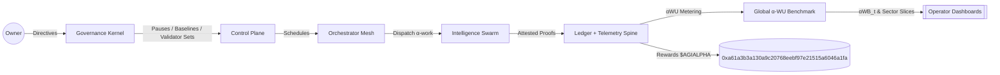
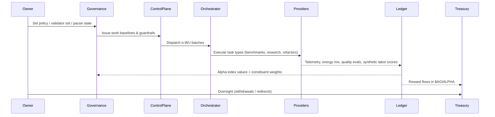

# AGI Alpha Node v0 · Cognitive Yield Engine ⚡

<!-- markdownlint-disable MD013 MD033 -->
<p align="center">
  <picture>
    <source srcset="1.alpha.node.agi.eth.svg" type="image/svg+xml" />
    
  </picture>
</p>

<p align="center">
  <a href="https://github.com/MontrealAI/AGI-Alpha-Node-v0/actions/workflows/ci.yml?query=branch%3Amain">
    
  </a>
  <a href=".github/required-checks.json">
    
  </a>
  
  
  
  <a href="https://etherscan.io/address/0xa61a3b3a130a9c20768eebf97e21515a6046a1fa"></a>
  
  <a href="LICENSE"></a>
  <a href="Dockerfile"></a>
  <a href="deploy/helm/agi-alpha-node"></a>
  <a href="docs/testing.md"></a>
</p>

> **AGI Alpha Node v0** is the cognitive yield engine that turns heterogeneous agentic work into verifiable α‑Work Units (α‑WU), anchors them to the `$AGIALPHA` treasury (`0xa61a3b3a130a9c20768eebf97e21515a6046a1fa`), and keeps every lever under the owner’s command—pause, re-weight, rotate validators, refresh baselines, and reroute rewards without redeploying code.



## Why this node

- **Owner-first control**: every critical switch is held by the contract owner—pause/unpause, validator rotation, identity lifecycle, staking withdrawals, and slashing routines are callable without redeployment from `contracts/AlphaNodeManager.sol`.
- **Deterministic data spine**: the node persists providers, task types, runs, telemetry, and α-index values through SQLite with migrations and seeds so that dashboards, subgraphs, and settlement always agree.
- **Enterprise-grade gates**: CI enforces lint, tests, coverage, Solidity checks, TypeScript/subgraph builds, policy gates, security audit scan, and branch guards on every PR before merge.
- **Operator clarity**: the README, CLI, and docs are wired for non-specialists—commands mirror production automation (`npm run ci:verify`, `node src/persistence/cli.js migrate`, etc.).

## System topology



## Repository map

- **Runtime**: `src/index.js` boots telemetry, health gates, orchestrator loops, and service wiring.
- **Contracts**: `contracts/AlphaNodeManager.sol` (owner-led control plane, staking, validator registry) with canonical `$AGIALPHA` token address baked in.
- **Persistence**: `src/persistence` contains SQLite migrations, seeders, repositories, and CLI entrypoints for repeatable data operations.
- **Docs**: `docs/` holds identity, economics, manifesto, and ops guidance.
- **Tests**: `test/` runs Vitest suites (JS + TS) covering governance, attestation, persistence, ENS, staking, and orchestrator behavior.
- **Subgraph**: `subgraph/` contains Graph Node manifest generation and TypeScript bindings for on-chain indexing.

## Core data model

The storage layer encodes the AGI Alpha Index across providers and work units. All tables are created by `src/persistence/migrations/0001_core.sql` and wrapped by repositories in `src/persistence/repositories.js`.

| Entity | Purpose | Key fields |
| --- | --- | --- |
| `providers` | Registered execution nodes with region, sector tags, energy mix, metadata | `name`, `operator_address`, `region`, `sector_tags[]`, `energy_mix`, `metadata` |
| `task_types` | Canonical α‑WU templates with difficulty coefficients | `name`, `description`, `difficulty_coefficient` |
| `task_runs` | Individual executions tied to providers & task types | `provider_id`, `task_type_id`, `status`, `raw_throughput`, `tokens_processed`, `tool_calls`, `novelty_score`, `quality_score`, timestamps |
| `quality_evaluations` | Evaluator-scored runs | `task_run_id`, `evaluator`, `score`, `notes` |
| `energy_reports` | Energy/region signals per run | `task_run_id`, `kwh`, `energy_mix`, `carbon_intensity_gco2_kwh`, `cost_usd`, `region` |
| `synthetic_labor_scores` | Synthetic labor uplift per provider/run | `provider_id`, `task_run_id`, `score`, `rationale` |
| `index_values` | Headline Alpha Index values | `effective_date`, `headline_value`, `energy_adjustment`, `quality_adjustment`, `consensus_factor` |
| `index_constituent_weights` | Provider weights for each index value | `index_value_id`, `provider_id`, `weight` |

### Migrations & seeds

- **Apply migrations**: `node src/persistence/cli.js migrate [dbPath]` (defaults to in-memory).
- **Seed catalog**: `node src/persistence/cli.js seed [dbPath]` loads task types (code-refactor, research-dossier, data-cleanse, agent-benchmark) and sample providers (hydro + wind mixes) from `src/persistence/seeds.js`.
- **Repositories**: CRUD helpers for each entity enforce JSON/tags serialization and timestamp updates.

## Smart contract control surface

- **Contract**: `contracts/AlphaNodeManager.sol` defaults to staking token `$AGIALPHA` at `0xa61a3b3a130a9c20768eebf97e21515a6046a1fa` with owner-overridable directives.
- **Owner powers**: pause/unpause, validator rotation (`setValidator`), identity lifecycle (`registerIdentity`, `updateIdentityController`, `setIdentityStatus`, `revokeIdentity`), α‑WU lifecycle events (`recordAlphaWUMint`, `recordAlphaWUValidation`, `recordAlphaWUAcceptance`), slashing, and treasury withdrawals (`withdrawStake`).
- **Validator safety**: active identity checks gate staking and validation actions; stake balances are tracked per controller.

## Quickstart

1. **Install dependencies** (Node.js 20.18+):

   ```bash
   npm ci
   ```

2. **Run full verification locally**:

   ```bash
   npm run ci:verify
   ```

3. **Launch runtime** with your operator settings:

   ```bash
   export OPERATOR_ADDRESS=0x0000000000000000000000000000000000000001
   export RPC_URL=https://your-rpc
   npm start -- --help
   ```

4. **Bootstrap data** for dashboards:

   ```bash
   node src/persistence/cli.js migrate data/alpha.sqlite
   node src/persistence/cli.js seed data/alpha.sqlite
   ```

5. **Docker/Helm**: use the `Dockerfile` for container builds or `deploy/helm/agi-alpha-node` for cluster rollouts.

## Observability & telemetry

- OpenTelemetry traces are initialized in `src/telemetry` and exported via OTLP HTTP; metrics are exposed through `prom-client` counters/gauges.
- Health gates live in `src/healthcheck.js` with CLI test coverage in `test/healthGate.test.js` and runtime probes.
- Logging uses structured `pino` across orchestrator, governance, and identity services for deterministic audit trails.

## Continuous integration & quality gates

- **Workflow**: `.github/workflows/ci.yml` runs markdown lint, link checks, policy/branch gates, JS/TS tests, coverage, Solidity lint + compilation, subgraph build, npm audit, and Docker smoke tests on every push/PR to `main`.
- **One-command parity**: `npm run ci:verify` mirrors the workflow locally.
- **Required checks**: `.github/required-checks.json` locks PR merges to green CI; badges above reflect the live status.
- **Coverage artifacts**: generated via `npm run coverage` and uploaded in CI for traceability.

## Subgraph and ENS utilities

- Subgraph manifest rendering lives in `scripts/render-subgraph-manifest.mjs` with TypeScript bindings under `subgraph/`.
- ENS inspection/verification scripts: `scripts/ens-inspect.ts`, `scripts/attestation-verify.ts`, and associated tests in `test/ens*` keep identity wiring consistent.

## Testing matrix

- Run the full suite: `npm test` (Vitest) and `npm run coverage` for reports.
- Solidity checks: `npm run ci:solidity` (solhint + `scripts/run-solc.mjs`).
- Markdown/link lint: `npm run lint`.
- Policy gates: `npm run ci:policy` and `npm run ci:branch` enforce operational guardrails.

## Deployment posture

- **Configuration**: `.env` (or environment variables) configures RPC endpoints, operator addresses, telemetry exporters, and storage paths.
- **Resilience**: WAL-enabled SQLite with foreign keys prevents partial writes; migrations are idempotent and tracked in `schema_migrations`.
- **Upgrades**: Owner controls cover pausing, validator rotation, identity updates, and stake withdrawals without contract redeploys, keeping production uptime while governance evolves.

AGI Alpha Nodes harvest α from autonomous agent swarms, settle rewards in `$AGIALPHA`, and keep operators in sovereign control. Deploy, gate, observe, and iterate—every artifact here is production-ready and enforced by green CI.
