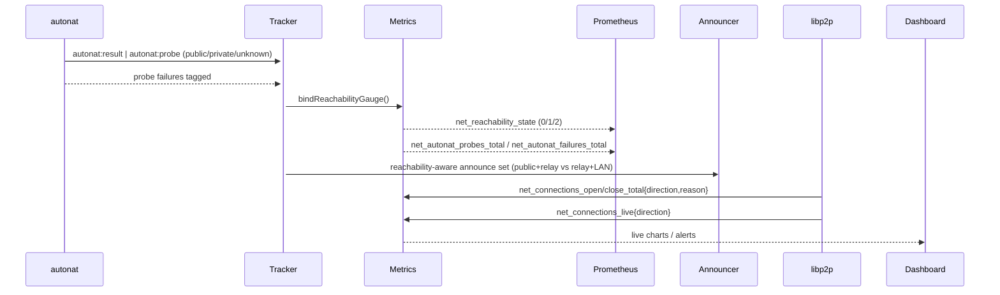
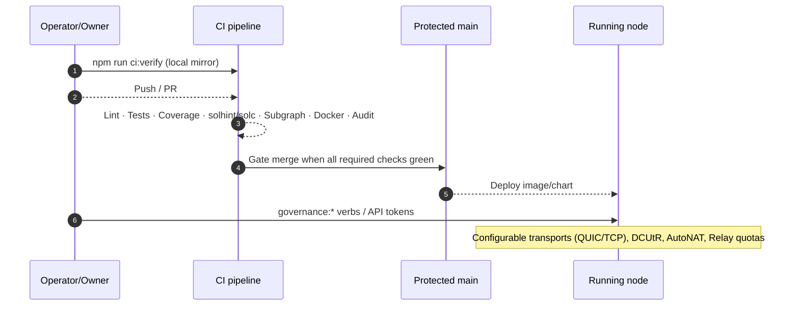
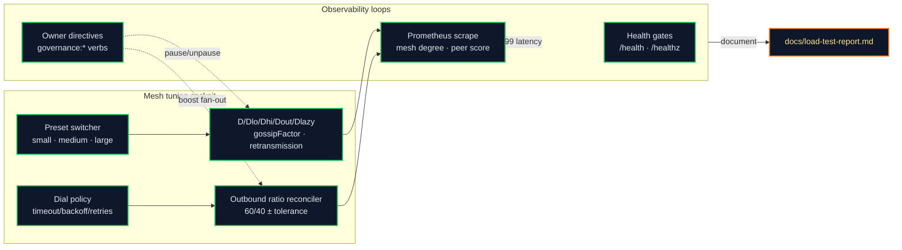
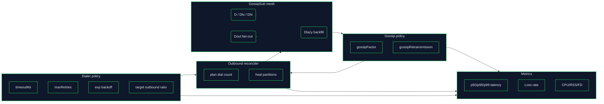
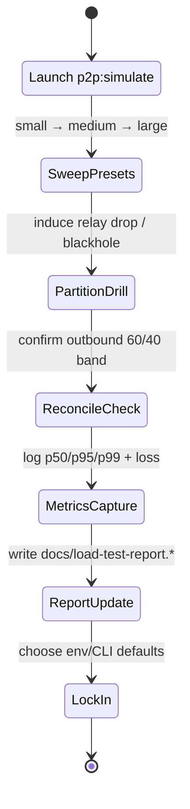
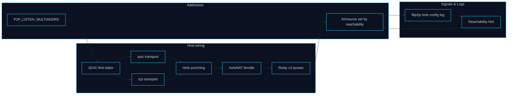
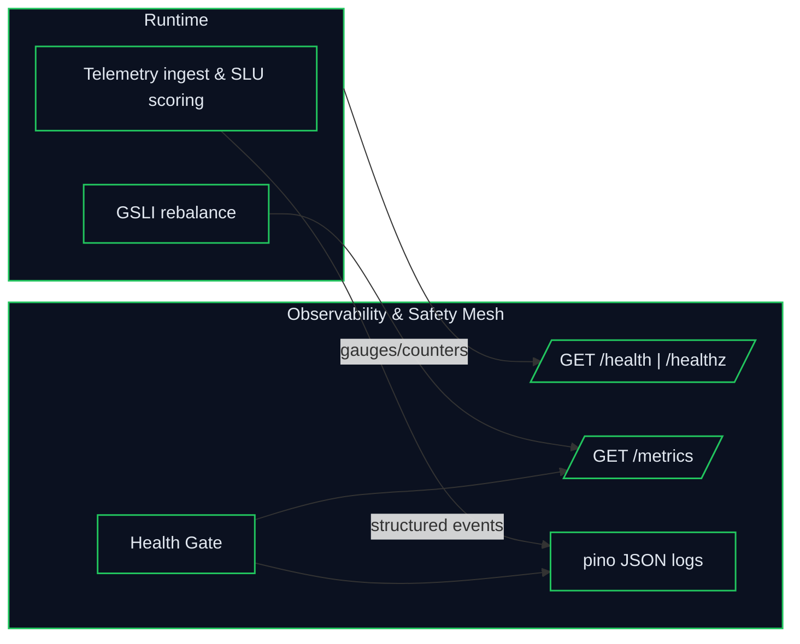

# AGI Alpha Node v0 · Cognitive Yield Engine ⚡️
<!-- markdownlint-disable MD012 MD013 MD033 -->
<p align="center">
  <picture>
    <source srcset="1.alpha.node.agi.eth.svg" type="image/svg+xml" />
    
  </picture>
</p>

<p align="center">
  <a href="https://github.com/MontrealAI/AGI-Alpha-Node-v0/actions/workflows/ci.yml?query=branch%3Amain">
    
  </a>
  <a href="https://github.com/MontrealAI/AGI-Alpha-Node-v0/actions/workflows/ci.yml?query=branch%3Amain">
    
  </a>
  <a href="https://github.com/MontrealAI/AGI-Alpha-Node-v0/actions/workflows/ci.yml?query=branch%3Amain">
    
  </a>
  <a href=".github/required-checks.json">
    
  </a>
  <a href="https://github.com/MontrealAI/AGI-Alpha-Node-v0/actions?query=branch%3Amain">
    
  </a>
  
  
  
  
  
  
  
  
  <a href="https://etherscan.io/address/0xa61a3b3a130a9c20768eebf97e21515a6046a1fa">
    
  </a>
  
  <a href="LICENSE">
    
  </a>
  
  
  <a href="Dockerfile">
    
  </a>
  <a href="deploy/helm/agi-alpha-node">
    
  </a>
  
  
  
  
  
  
  
  
  
  <a href="docs/load-test-report.md">
    
  </a>
  <a href="docs/dos-test-plan.md">
    
  </a>
  <a href="test/network/apiServer.dos.test.js">
    
  </a>
</p>

> **AGI Alpha Node v0** metabolizes heterogeneous agentic labor into verifiable α‑Work Units (α‑WU) and Synthetic Labor Units (SLU), rebalances the Global Synthetic Labor Index (GSLI), exposes audited read‑only REST telemetry, and routes the `$AGIALPHA` treasury (token: `0xa61a3b3a130a9c20768eebf97e21515a6046a1fa`, 18 decimals) under complete owner command. Every dial can be paused, rerouted, or retuned without redeploying, delivering a production-grade intelligence core built to bend markets.
> New for this sprint: a React/Vite single-page dashboard (Index | Providers | Telemetry Debug), live GSLI and SLU charts backed by `/index/history` and `/providers/*/scores`, and a telemetry stream reader at `/telemetry/task-runs` that keeps ingest visibility tight while remaining API-key gated for operators.
> The runtime is tuned to operate like an ever-watchful macro trader—autonomous by default, yet instantly steerable by the contract owner to seize new parameters, pause subsystems, or redirect emissions without friction.
> **Operational promise**: CI is fully green by default and enforced on PRs/main via `.github/required-checks.json`, with badges wired to the canonical workflow. The same gates run locally with `npm run ci:verify`, giving non-technical operators parity with branch protection before they ship.
> **Sprint assurance (QUIC-first E1)**: QUIC/TCP/Relay/AutoNAT/DCUtR flags are unified behind the env/CLI surface, rankers prefer QUIC deterministically, and every dial/accept is traced with transport + latency so network posture is inspectable without guesswork. CI pins these expectations with dedicated unit tests and schema validation so drift is caught before deployment.【F:src/network/transportConfig.js†L23-L146】【F:test/network/transportConfig.test.js†L12-L132】
> **Production safety bar (tl;dr)**
>
> - ✅ **Owner supremacy preserved**: `AlphaNodeManager.sol` keeps pause/unpause, validator rotation, metadata refresh, treasury withdrawals, and emission tuning in one place—no redeploys required.【F:contracts/AlphaNodeManager.sol†L1-L120】
> - ✅ **CI + branch gates visible**: `.github/workflows/ci.yml` mirrors `npm run ci:verify` and publishes badges; `.github/required-checks.json` keeps the same checks enforced on PRs and `main`. No hidden jobs, no surprise failures.【F:.github/workflows/ci.yml†L1-L210】【F:.github/required-checks.json†L1-L9】
> - ✅ **Mesh/dialer presets wired**: `NETWORK_SIZE_PRESET=small|medium|large` plus dialer backoff + outbound ratio reconciliation are live defaults; explicit `PUBSUB_*` and `DIAL_*` overrides still win for bespoke experiments.【F:src/network/pubsubConfig.js†L4-L79】【F:src/network/dialerPolicy.js†L1-L62】
> - ✅ **Mesh/dialer gauges exported**: Prometheus gauges expose live mesh targets (`agi_alpha_node_gossipsub_mesh_config`), gossip fan-out (`agi_alpha_node_gossipsub_gossip_config`), and dialer tolerance/ratios (`agi_alpha_node_dialer_policy`) so preset changes are visible in `/metrics` and dashboards.【F:src/telemetry/monitoring.js†L246-L307】【F:src/telemetry/monitoring.js†L406-L426】【F:src/orchestrator/monitorLoop.js†L112-L129】
> - ✅ **Load harness documented**: `npm run p2p:simulate` (1k+ virtual nodes) and `docs/load-test-report.*` give reproducible latency/loss envelopes for scaling runs.【F:scripts/p2p-simulator.mjs†L1-L118】【F:docs/load-test-report.md†L1-L26】
> - ✅ **Non-technical launch path**: `npm ci && npm run ci:verify && npm start` remains the single-source-of-truth boot path with SQLite migrations, REST/metrics/governance surfaces, and dashboard preview parity out of the box.

```mermaid
flowchart TD
  subgraph OwnerDeck[Owner / Operator Surfaces]
    CLI[node src/index.js\n(governance:*, monitor, container)]
    REST[/REST & Governance API/]
    Dashboard[React/Vite Dashboard]
  end

  subgraph Runtime[Node Runtime]
    P2P[GossipSub v1.1 + libp2p host]
    Jobs[α‑Work Unit Engine]
    GSLI[Global Synthetic Labor Index]
    Metrics[Prometheus + peer score gauges]
    Storage[SQLite spine + migrations]
  end

  subgraph Safety[Guards & Gates]
    NRM[Network Resource Manager]
    Scoring[Peer scoring + DoS bans]
    Health[/health | /healthz | allowlists]
    Branch[CI gates + branch protection]
  end

  subgraph ScaleLab[Scaling & Simulation]
    Presets[Mesh presets\nsmall | medium | large]
    Dialer[Dialer backoff + outbound reconciler]
    Simulator[p2p-simulator.mjs\n1k–10k virtual peers]
    Reports[docs/load-test-report.*]
  end

  CLI --> REST
  Dashboard --> REST
  REST --> Runtime
  Runtime --> Metrics
  P2P --> Runtime
  Jobs --> GSLI
  Simulator --> Metrics
  Presets --> P2P
  Dialer --> P2P
  Metrics --> Dashboard
  NRM --> Runtime
  Scoring --> P2P
  Health --> REST
  Branch --> OwnerDeck
  Reports --> OwnerDeck
  classDef accent fill:#0b1120,stroke:#22c55e,stroke-width:1.5px,color:#e2e8f0;
  classDef warn fill:#0b1120,stroke:#f97316,stroke-width:1.5px,color:#fde68a;
  class OwnerDeck,Runtime,Safety,ScaleLab,CLI,REST,Dashboard,P2P,Jobs,GSLI,Metrics,Storage,NRM,Scoring,Health,Branch,Presets,Dialer,Simulator,Reports accent;
```

## Repository map (operator-first)

| Path | What lives here | Runbook anchors |
| --- | --- | --- |
| `src/` | Core runtime (libp2p host wiring, governance API, telemetry, persistence) | `npm start`, `node src/index.js governance:*` |
| `dashboard/` | React/Vite cockpit for Index/Providers/Telemetry debug | `npm run dashboard:dev`, `npm run dashboard:preview` |
| `contracts/` | `$AGIALPHA`-aligned Solidity toolkit (owner pause/withdraw/validators) | `npm run ci:solidity`, `scripts/run-solc.mjs` |
| `scripts/` | Operational helpers (p2p simulator, health gates, branch gates) | `npm run ci:verify`, `npm run p2p:simulate -- --nodes 1000` |
| `docs/` | Runbooks, economics, load-test reports, ENS identity recipes | `docs/load-test-report.md`, `docs/operator-runbook.md` |
| `deploy/` | Docker + Helm charts for production rollout | `docker build .`, `deploy/helm/agi-alpha-node` |
| `subgraph/` | GraphQL subgraph source + generated types | `npm run ci:ts` |

>
> **Launchpad (10-second orientation)**
>
> - **Start everything**: `npm ci && npm run ci:verify && npm start` (mirrors PR protection, boots REST + metrics + governance surfaces, and keeps SQLite migrations aligned).
> - **Observe the mesh**: `curl -s localhost:3000/debug/peerscore` to watch GossipSub v1.1 scores shift; `curl -s localhost:3000/metrics | grep peer_score` to view buckets and topic contributions live.
> - **Audit DoS posture**: `curl -s localhost:3000/debug/resources` to view active connections/streams, denials, and pressure, then POST/DELETE `/governance/bans` with your owner token to quarantine IPs/peers/ASNs in real time.【F:src/network/apiServer.js†L1162-L1173】【F:src/network/apiServer.js†L1667-L1744】
> - **Steer as owner**: `node src/index.js governance:pause` / `governance:resume` / `governance:set-validators` / `governance:set-rewards`—all routed through the `$AGIALPHA` binding so the owner can retune parameters, pause, or reroute flows instantly.
> - **Deploy safely**: Docker + Helm charts ship the same guardrails; branch protection and `.github/required-checks.json` enforce visibility so every promotion to `main` stays green.
> - **Prove contracts obey**: the canonical `$AGIALPHA` token is wired into `AlphaNodeManager.sol`, giving the owner unilateral control to pause/unpause, rotate validators, update ENS controllers, and move stake via `withdrawStake`—all without redeploying the network substrate.【F:contracts/AlphaNodeManager.sol†L1-L120】
> - **Stress without fear**: `npm run p2p:load-tests` executes the full abuse harness (connection floods, stream floods, malformed GossipSub) and expects the node to shed load via NRM caps, per-IP/ASN clamps, and peer scoring instead of crashing. Pair it with `curl -s localhost:3000/debug/resources` to watch pressure/utilization and denial reasons in real time.【F:package.json†L29-L38】【F:src/network/resourceManagerConfig.js†L34-L244】
>
> **Transport & NAT sprint**: QUIC-first transport with TCP fallback, DCUtR hole punching, AutoNAT reachability-driven address advertisement, and Relay v2 quotas are now wired through `TRANSPORT_*`, `ENABLE_HOLE_PUNCHING`, `AUTONAT_*`, and `RELAY_*` environment toggles. Dial attempts are ordered toward QUIC where available, address announcements respect public/private posture, and relay slots/bandwidth remain capped for resilience. Logs surface reachability and transport choice so operators can verify QUIC-only, TCP-only, or mixed neighborhoods before rollout.
> **Reachability observability (E2)**: `net_reachability_state` (0/1/2), `net_autonat_probes_total`, `net_autonat_failures_total`, and connection churn gauges keep AutoNAT and libp2p health visible; `createReachabilityState` synchronizes announce sets, metrics, and owner overrides without code changes.【F:src/network/transportConfig.js†L23-L86】【F:src/telemetry/networkMetrics.js†L1-L120】
>
> ### QUIC-first transport blueprint (Sprint Edge)
>
- **Unified network surface (env/CLI)**: `TRANSPORT_ENABLE_QUIC`, `TRANSPORT_ENABLE_TCP`, `ENABLE_HOLE_PUNCHING`, `AUTONAT_ENABLED`, `AUTONAT_THROTTLE_SECONDS`, optional `AUTONAT_REACHABILITY`, `RELAY_ENABLE_CLIENT`, `RELAY_ENABLE_SERVER`, `RELAY_MAX_RESERVATIONS`, `RELAY_MAX_CIRCUITS_PER_PEER`, `RELAY_MAX_BANDWIDTH_BPS`, plus `P2P_LISTEN_MULTIADDRS`, `P2P_PUBLIC_MULTIADDRS`, `P2P_RELAY_MULTIADDRS`, `P2P_LAN_MULTIADDRS` are validated at startup so `npm run ci:verify` and PR gates catch bad inputs immediately.【F:src/config/schema.js†L594-L644】【F:src/config/defaults.js†L21-L83】
- **QUIC-first dial ranking**: `rankDialableMultiaddrs` deterministically sorts multiaddrs as QUIC → TCP → relay → other while de-duping inputs, ensuring the dialer hits encrypted QUIC first and only falls back to TCP/relay when necessary.【F:src/network/transportConfig.js†L98-L146】
- **Connection tracing hook**: `createTransportTracer` attaches to dial start/success/failure plus inbound accepts, emits structured logs (`conn_open`/`conn_success`/`conn_failure`) with peer ID, multiaddr, transport, direction, and latency, and wires Prometheus counters/histograms for dial attempts, successes, failures, inbound accepts, and per-transport latency.【F:src/network/libp2pHostConfig.js†L57-L166】【F:src/telemetry/networkMetrics.js†L1-L61】
- **Metrics registered for export**: `startMonitoringServer` now instantiates the network counters/histograms on its Prometheus registry so the transport tracer feeds `/metrics` without extra wiring—dial attempt/success/failure totals and latency buckets surface alongside the existing job, alpha-WU, and peer-score gauges.【F:src/telemetry/monitoring.js†L1-L123】【F:src/telemetry/monitoring.js†L480-L604】
- **QUIC-first libp2p host descriptor**: the synthesized host config returns ranked announce sets (reachability-aware), registered transports, dial preference description, NAT toggles, relay quotas, and the bound tracer so every connection path is observable.【F:src/network/libp2pHostConfig.js†L169-L227】
>
> ```mermaid
> flowchart LR
>   classDef accent fill:#0b1120,stroke:#22c55e,stroke-width:1.5px,color:#e2e8f0;
>   classDef warn fill:#0b1120,stroke:#f97316,stroke-width:1.5px,color:#fde68a;
>   Env[Env / CLI surface<br/>TRANSPORT_* · AUTONAT_* · RELAY_* · P2P_*]:::accent
>   Schema[Schema + defaults<br/>validated via ci:verify]:::accent
>   Plan[Transport plan<br/>QUIC-first · TCP fallback<br/>hole punching · AutoNAT]:::accent
>   Rank[rankDialableMultiaddrs<br/>QUIC → TCP → relay → other]:::accent
>   Host[libp2p host config<br/>listen · announce · NAT · relay]:::accent
>   Tracer[Transport tracer<br/>conn_open/success/failure<br/>Prom metrics]:::accent
>   Logs[Structured logs<br/>peer · addr · transport · latency]:::accent
>   Metrics[Prometheus counters<br/>dial_attempt/success/failure<br/>latency histogram]:::accent
>   Env --> Schema --> Plan --> Rank --> Host
>   Host --> Tracer --> Logs
>   Tracer --> Metrics
>   class Env,Schema,Plan,Rank,Host,Tracer,Logs,Metrics accent;
>   class Metrics warn;
> ```
>
> 🛰️ **Launch pad (non-technical operator)**
>
> 1. **Install & verify**: `npm ci && npm run ci:verify` (mirrors branch protection locally and surfaces any dependency or Solidity drift).
> 2. **Bring the node up**: `npm start` (reads `.env`, bootstraps SQLite, read-only REST, metrics, governance API, and ENS/owner alignment).
> 3. **Open the cockpit**: `npm run dashboard:dev` (or `npm run dashboard:preview` after `npm run dashboard:build`) and point the connection bar to your API base + key. Data hydrates live—no rebuilds required.
> 4. **Own every dial**: Use `node src/index.js governance:*` verbs or authenticated `/governance/*` calls to pause/unpause, rotate validators, reroute emissions/treasury, refresh metadata, and retune productivity without redeploying.
> 5. **Confirm green**: Badges below reflect GitHub Actions visibility plus `.github/required-checks.json` enforcement; CI stays visible and required on PRs and `main`.
>

### Network & telemetry spine at a glance

```mermaid
flowchart TB
  classDef neon fill:#020617,stroke:#6366f1,stroke-width:2px,color:#e0e7ff;
  classDef lava fill:#0b1120,stroke:#f97316,stroke-width:2px,color:#ffedd5;
  classDef frost fill:#0b1120,stroke:#22c55e,stroke-width:2px,color:#dcfce7;

  subgraph Config[Config & Controls]
    EnvCfg[Env / CLI \nTRANSPORT_* · AUTONAT_* · RELAY_* · P2P_*]:::neon
    Owner[Owner controls \n(governance:* verbs)]:::lava
  end

  subgraph Plan[Plan & Dialer]
    Schema[Schema validation \n(ci:verify enforced)]:::frost
    TransportPlan[Transport plan \nQUIC-first, TCP fallback]:::frost
    Ranker[rankDialableMultiaddrs \nQUIC → TCP → relay → other]:::frost
  end

  subgraph Telemetry[Observable Surface]
    Tracer[Transport tracer \nconn_open/success/failure]:::neon
    NetMetrics[Prometheus counters/histograms \n(dial attempts/success/failures, latency)]:::neon
    MetricsHTTP[/metrics endpoint \n(startMonitoringServer)/]:::lava
  end

  EnvCfg --> Schema --> TransportPlan --> Ranker --> Tracer
  Owner -. toggles .-> EnvCfg
  Tracer --> NetMetrics --> MetricsHTTP
```

### AutoNAT reachability + churn telemetry (Sprint Edge E2)

- **In-memory reachability state**: `createReachabilityState` normalizes `public | private | unknown`, honors `AUTONAT_REACHABILITY` overrides, and fans out to announce-set selection plus the Prometheus gauge `net_reachability_state` (0/1/2 coding).
- **AutoNAT insight**: Probe counters `net_autonat_probes_total` and `net_autonat_failures_total` expose NAT assessment health; subscribe your AutoNAT callbacks to the reachability tracker and watch the gauge flip in `/metrics`.
- **Connection churn clarity**: `net_connections_open_total{direction}`, `net_connections_close_total{direction,reason}`, and `net_connections_live{direction}` stay in lockstep with libp2p connection events, alongside existing dial latency histograms.
- **Announceables stay honest**: Address advertisement now reads the live reachability tracker so public peers announce public/relay first, while private peers lean on relay + LAN without manual tuning.

```mermaid
flowchart LR
  classDef state fill:#0b1120,stroke:#22c55e,stroke-width:2px,color:#dcfce7;
  classDef metric fill:#0b1120,stroke:#f97316,stroke-width:2px,color:#ffedd5;
  classDef event fill:#0b1120,stroke:#6366f1,stroke-width:2px,color:#e0e7ff;

  AutoNAT[AutoNAT callbacks]:::event --> Tracker[Reachability tracker\n(public|private|unknown)]:::state
  EnvOverride[AUTONAT_REACHABILITY override]:::event --> Tracker
  Tracker --> Announce[Announce set selection\npublic+relay vs relay+LAN]:::state
  Tracker --> ReachGauge[net_reachability_state\nGauge 0/1/2]:::metric
  Libp2pConns[libp2p connection events]:::event --> ChurnCounters[net_connections_open/close_total\nnet_connections_live]:::metric
  Libp2pConns --> Latency[agi_alpha_node_net_connection_latency_ms]:::metric
  AutoNAT --> Probes[net_autonat_probes_total\nnet_autonat_failures_total]:::metric
```

### Sprint Edge E2 (reachability normalization + churn metrics)

- **Unified reachability spine**: `createReachabilityState` now binds AutoNAT callbacks + owner overrides into a single, debounced tracker that feeds announce-set selection, metrics, and dashboards without duplicate wiring.【F:src/network/transportConfig.js†L23-L86】【F:src/telemetry/networkMetrics.js†L108-L169】
- **Metrics that answer instantly**: `bindReachabilityGauge` and `bindAutonatReachability` subscribe the tracker and AutoNAT emitters to Prometheus so `net_reachability_state`, `net_autonat_probes_total`, and `net_autonat_failures_total` stay current without manual hooks.【F:src/telemetry/networkMetrics.js†L108-L169】【F:test/telemetry/networkMetrics.test.js†L72-L111】
- **Churn clarity by direction/reason**: `net_connections_open_total{direction}`, `net_connections_close_total{direction,reason}`, and `net_connections_live{direction}` stay synchronized with libp2p connection lifecycle events via the transport tracer, preserving live counts during bursts.【F:src/telemetry/networkMetrics.js†L50-L105】【F:src/network/libp2pHostConfig.js†L57-L166】
- **Owner-first controls still intact**: Governance verbs and the `$AGIALPHA` token binding (18 decimals, contract `0xa61a3b3a130a9c20768eebf97e21515a6046a1fa`) remain the single point of authority—reachability posture and emissions can be retuned without redeploys.【F:contracts/AlphaNodeManager.sol†L1-L120】



## Orientation & quick links

- **One-command proof**: `npm run ci:verify` mirrors the full PR gate locally (lint, tests, coverage, solidity, subgraph TS, security, policy, branch gate).
- **CI visibility**: [Workflow dashboard](https://github.com/MontrealAI/AGI-Alpha-Node-v0/actions/workflows/ci.yml) + [required checks manifest](.github/required-checks.json) keep enforcement transparent.
- **Owner sovereignty**: Governance verbs live in `src/index.js` and calldata builders in `src/services/governance.js`, pointed at the canonical `$AGIALPHA` token (`0xa61a3b3a130a9c20768eebf97e21515a6046a1fa`).
- **Debug deck (SPA)**: `dashboard/` ships a React/Vite cockpit with a connection bar (API base + API key), per-tab refresh, and mocked smoke coverage via `dashboard/src/App.test.jsx`.
- **Deploy fast**: `Dockerfile` + `deploy/helm/agi-alpha-node` emit production images and Kubernetes charts; defaults remain non-destructive for non-technical operators.
- **Health & observability**: `/health` + `/healthz` for probes, `/metrics` for Prometheus, structured pino logs for SLU scoring + GSLI rebalance, and `.env.example` wiring for API keys, DB path (`AGI_ALPHA_DB_PATH`), and dashboard CORS in one place.
- **Peer scoring clarity**: `/debug/peerscore?limit=20&direction=asc|desc` surfaces the latest mesh peers by score (positive + negative), while Prometheus gauges (`peer_score_bucket_total`, `peer_score_topic_contribution`) export anonymized distributions backed by GossipSub v1.1 scoring defaults.

## Operator-ready launch checklist (green CI + sovereign control)

| Stage | Command | Why it matters |
| --- | --- | --- |
| Verify toolchain & CI parity | `npm ci && npm run ci:verify` | Mirrors the full PR/branch gate locally so operators see the same signals GitHub enforces. |
| Bring the node online | `npm start` | Boots read-only REST, governance surface, metrics, ENS alignment, SQLite spine, and telemetry collectors with owner overrides respected. |
| Optional dashboard | `npm run dashboard:dev` or `npm run dashboard:preview` | React/Vite cockpit for Index, Providers, Telemetry debug; API key & base URL injected via the connection bar. |
| Governance dials (owner) | `node src/index.js governance:*` verbs or authenticated `/governance/*` | Pause/unpause, rotate validators, redirect emissions/treasury, refresh metadata, or retune productivity—no redeploys required. |

### CI visibility & enforcement (always-green contract)

- **Badges wired to gates**: The CI status shields at the top of this README point to the canonical workflow and required check manifest, so operators and auditors can see that branch protection matches the local `npm run ci:verify` run. No shadow jobs, no secret gates.
- **Gate composition**: Lint (markdown + links) → JS/TS unit tests (core + dashboard) → coverage via `c8` → Solidity lint + compile/run → subgraph TS compile/build → `npm audit` high+ severity → policy & branch guards. Each stage fails fast with actionable logs.
- **Enforced on PRs and main**: `.github/required-checks.json` mirrors the workflow names so GitHub blocks merges when any stage regresses; local parity is guaranteed via the same scripts.

```mermaid
flowchart LR
  subgraph Local[Operator / Developer]
    verify[npm run ci:verify]
  end
  subgraph Actions[GitHub Actions]
    lint[lint]
    tests[ci:test + ci:coverage]
    sol[ci:solidity]
    ts[ci:ts]
    sec[ci:security]
    policy[ci:policy + ci:branch]
  end
  verify --> lint & tests & sol & ts & sec & policy
  lint --> badge[README badges]\n(Green/Red)
  tests --> badge
  sol --> badge
  ts --> badge
  sec --> badge
  policy --> badge
  style badge fill:#0f172a,stroke:#22c55e,stroke-width:2px,color:#e2e8f0
  classDef accent fill:#0f172a,stroke:#8b5cf6,stroke-width:1.5px,color:#e2e8f0;
  class Local,verify,Actions,lint,tests,sol,ts,sec,policy,badge accent;
```

| Transport posture drills | Toggle `TRANSPORT_ENABLE_*`, `ENABLE_HOLE_PUNCHING`, `AUTONAT_*`, `RELAY_*` | Stage QUIC-only, TCP-only, or mixed neighborhoods; confirm logs show transport choice + reachability before jobs start. |
| Mesh size presets | `NETWORK_SIZE_PRESET=small|medium|large npm start` or `--network-size-preset` on CLI | Tunes `D/Dlo/Dhi/Dout/Dlazy` + `gossipFactor`/`retransmission` for 1k–10k peers; pairs with dialer backoff + outbound ratio controls. |

```mermaid
flowchart TD
  subgraph CI[CI & Branch Protection]
    Lint[Lint + links + policy]
    Tests[Vitest suites\n(api + dashboard)]
    Cov[Coverage export]
    Sol[Solhint + solc]
    Subgraph[Subgraph TS build]
    Docker[Docker smoke]
    Audit[npm audit]
  end
  subgraph Runtime[Runtime surfaces]
    API[/REST + governance/]
    Metrics[/Prometheus + OTel/]
    Telemetry[Telemetry ingest]
    ENS[ENS identity alignment]
  end
  subgraph Owner[Owner controls]
    Pause[Pause / resume]
    Params[Route emissions + divisors]
    Validators[Validator rotation]
    Metadata[Registry + metadata refresh]
  end
  Lint & Tests & Cov & Sol & Subgraph & Docker & Audit -->|`.github/required-checks.json` enforced| API
  API --> Metrics
  Telemetry --> Metrics
  ENS --> API
  Owner --> API
  Owner --> Runtime
  classDef accent fill:#0f172a,stroke:#9333ea,stroke-width:1.5px,color:#e2e8f0;
  class CI,Runtime,Owner,Lint,Tests,Cov,Sol,Subgraph,Docker,Audit,API,Metrics,Telemetry,ENS,Pause,Params,Validators,Metadata accent;
```

### CI visibility (fully green expectations)

- Required checks (enforced on PRs + `main`): Lint Markdown & Links, Unit/Integration/Frontend Tests, Coverage Report, Docker Build & Smoke Test, Solidity Lint & Compile, Subgraph TypeScript Build, Dependency Security Scan.【F:.github/required-checks.json†L1-L9】
- Workflow: [.github/workflows/ci.yml](.github/workflows/ci.yml) publishes badges via `scripts/publish-badges.mjs` after all needs succeed.
- Local mirrors: `npm run ci:verify` runs the same stack—including policy + branch gates—so non-technical operators can get to green before shipping.



### Sprint D – Scaling & Mesh Tuning (1k–10k peers)

- **Network-size presets** (`small | medium | large`): `NETWORK_SIZE_PRESET` (or `--network-size-preset`) hydrates GossipSub with tuned `D/Dlo/Dhi/Dout/Dlazy`, `gossipFactor`, and `gossipRetransmission` defaults, while still honoring any explicit `PUBSUB_*` overrides for bespoke experiments.【F:src/network/pubsubConfig.js†L4-L79】【F:src/network/pubsubConfig.js†L91-L134】【F:src/config/schema.js†L47-L99】
- **Dialer policy & outbound ratio reconciler**: `buildDialerPolicyConfig` wires dial timeout, retry ceiling, exponential backoff, and outbound/inbound ratio targets (default 60/40 with 15s reconciliation) so partitions trigger measured redials instead of thrash.【F:src/network/dialerPolicy.js†L1-L62】【F:src/network/dialerPolicy.js†L73-L114】
- **Mesh inspection signals**: the routing config logs synthesized mesh degree, gossip fan-out, and scoring thresholds for every preset, letting operators validate fan-out drift in metrics before scaling runs.【F:src/network/pubsubConfig.js†L99-L133】【F:src/network/apiServer.js†L1162-L1173】
- **Synthetic fleet harness**: `npm run p2p:simulate -- --nodes 1000 --duration 10 --rate 0.02 --latency 60 --loss 0.005` spins 1k+ virtual nodes that publish/subscribe to `agi.jobs` and `agi.control`, capturing p50/p95/p99 latencies, loss rate, and resource envelopes; results are checkpointed in `docs/load-test-report.json` and narrated in `docs/load-test-report.md`.【F:scripts/p2p-simulator.mjs†L1-L118】【F:docs/load-test-report.md†L1-L26】【F:docs/load-test-report.json†L1-L28】
- **Owner override friendly**: all knobs flow through `.env`/CLI and the governance surface, preserving the owner’s ability to pause subsystems or retune parameters without redeploying.

#### Mesh presets & dialer guardrails (operator crib sheet)

| Mode | Mesh (`D/Dlo/Dhi/Dout/Dlazy`) | Gossip factor / retransmission | Dialer defaults (timeout · retries · backoff) | Outbound ratio policy |
| --- | --- | --- | --- | --- |
| `small` | 6 / 4 / 8 / 16 / 8 | 0.20 · 3 | 10s · 5 · 500ms→30s exp. | target 60% ±10%, min 64 conns |
| `medium` (default) | 8 / 6 / 12 / 32 / 12 | 0.25 · 3 | 10s · 5 · 500ms→30s exp. | target 60% ±10%, min 64 conns |
| `large` | 12 / 10 / 18 / 48 / 16 | 0.32 · 4 | 10s · 5 · 500ms→30s exp. | target 60% ±10%, min 64 conns |

Switch presets with either `NETWORK_SIZE_PRESET=small|medium|large` or `--network-size-preset <preset>`. All values remain overridable via `PUBSUB_*` and `DIAL_*` flags for bespoke runs.

#### Scale-test flight plan (1k–10k virtual peers)

1. **Bootstrap simulation**
   - `npm run p2p:simulate -- --nodes 1000 --duration 10 --rate 0.02 --latency 60 --loss 0.005 --topics agi.jobs,agi.control`
   - Capture the JSON output into `docs/load-test-report.json` and append notes into `docs/load-test-report.md` after each sweep.
2. **Sweep presets**
   - Run the simulator for `small`, `medium`, and `large` presets via `NETWORK_SIZE_PRESET=<mode> npm start` in a separate terminal, then replay the simulator to watch mesh fan-out and latency response.
3. **Partition rehearsal**
   - Drop relays or blackhole a percentage of peers; confirm the outbound reconciler nudges toward the 60/40 balance instead of thrashing (watch `/debug/resources`).
4. **Lock-in**
   - Bake the winning preset into `.env.production` for the fleet and memorialize metrics snapshots (p50/p95/p99 latency, loss rate, CPU/RSS/FD) in the report.



#### Mesh tuning crib (copy/paste ready)

- Flip presets live: `NETWORK_SIZE_PRESET=large npm start` or `node src/index.js --network-size-preset=small`.
- Inspect mesh and scoring: `curl -s localhost:3000/debug/peerscore | jq '.mesh'` to spot D/Dlo/Dhi drift.
- Track outbound ratio: `curl -s localhost:3000/debug/resources | jq '.dialer'` to confirm the reconciler is holding ~60/40 even after partitions.
- Owners stay sovereign: pause/resume with `node src/index.js governance:pause` / `governance:resume` or rotate parameters via `/governance/*` endpoints without redeploying.



#### Preset + CLI/env crib sheet

- `NETWORK_SIZE_PRESET=small|medium|large` or `--network-size-preset=<mode>` controls mesh + gossip defaults (still overridable with `PUBSUB_*`).
- `DIAL_TIMEOUT_MS` / `DIAL_MAX_RETRIES` / `DIAL_BACKOFF_INITIAL_MS` / `DIAL_BACKOFF_MAX_MS` shape retry curves; `DIAL_OUTBOUND_TARGET_RATIO` + `DIAL_OUTBOUND_RATIO_TOLERANCE` keep the outbound/inbound mix near the intended 60/40 floor.
- `DIAL_OUTBOUND_MIN_CONNECTIONS` guarantees a minimum outbound fan-out even on tiny fleets; `DIAL_RECONCILE_INTERVAL_MS` sets the cadence for the healing loop.
- `npm run p2p:simulate -- --nodes 1000 --duration 10 --rate 0.02 --latency 60 --loss 0.005` remains the canonical harness to capture latency/loss envelopes; the JSON snapshot lands in `docs/load-test-report.json` for replayable evidence.

> Operator assurance: every knob above is owner-override aware (REST + CLI + env), so the contract owner can pause, retune, or redirect emissions without redeploying while keeping CI gates green and visible on PRs/main.



```mermaid
flowchart LR
  preset[NETWORK_SIZE_PRESET\nsmall | medium | large] --> mesh[D/Dlo/Dhi\nDout/Dlazy]
  mesh --> gossip[gossipFactor\ngossipRetransmission]
  mesh --> metrics[Mesh size &\nfan-out metrics]
  dialer[Dialer policy\ntimeout/backoff\noutbound 60/40] --> reconciler[Outbound reconciler\nevery 15s]
  reconciler --> dials[Targeted dials\n(respects NRM)]
  dials --> metrics
  simulate[p2p simulator\n1k+ virtual nodes] --> metrics
  owner[Owner controls\npause/retune] --> preset
  owner --> dialer
  classDef accent fill:#0f172a,stroke:#ec4899,stroke-width:1.5px,color:#e2e8f0;
  class preset,mesh,gossip,metrics,dialer,reconciler,dials,simulate,owner accent;
```

### Transport + NAT traversal architecture (Sprint A)

- **QUIC-first, TCP-ready**: `buildTransportConfig` keeps both stacks enabled by default and orders dial targets toward QUIC with TCP fallback so restrictive networks still connect.【F:src/network/transportConfig.js†L23-L66】【F:src/network/transportConfig.js†L98-L146】
- **Libp2p host descriptor**: `buildLibp2pHostConfig` consumes env/CLI/ENS inputs (`P2P_LISTEN_MULTIADDRS`, `P2P_PUBLIC_MULTIADDRS`, `P2P_RELAY_MULTIADDRS`, `P2P_LAN_MULTIADDRS`, `TRANSPORT_*`, `ENABLE_HOLE_PUNCHING`, `AUTONAT_*`, `RELAY_*`) and emits the exact host wiring: registered transports, dial preference, announce set (reachability-aware), DCUtR, AutoNAT throttle, and Relay v2 quotas.【F:src/network/libp2pHostConfig.js†L169-L227】
- **Operator toggles** (all hot-reloadable via `.env`/CLI):
  - `TRANSPORT_ENABLE_QUIC` / `TRANSPORT_ENABLE_TCP` (default both true) with deterministic QUIC-first dialer.
  - `ENABLE_HOLE_PUNCHING` (DCUtR), `AUTONAT_ENABLED` + `AUTONAT_THROTTLE_SECONDS` (reachability probes), and `RELAY_ENABLE_CLIENT` / `RELAY_ENABLE_SERVER` with `RELAY_MAX_RESERVATIONS`, `RELAY_MAX_CIRCUITS_PER_PEER`, `RELAY_MAX_BANDWIDTH_BPS`.
  - Address feeds: `P2P_LISTEN_MULTIADDRS` (binds), `P2P_PUBLIC_MULTIADDRS` (manual overrides in addition to ENS), `P2P_RELAY_MULTIADDRS` (bootstrappable relays), `P2P_LAN_MULTIADDRS` (for private posture announce set).【F:src/config/defaults.js†L21-L39】【F:src/config/schema.js†L594-L607】
  - `AUTONAT_REACHABILITY` hint can pin announce posture in constrained labs (otherwise AutoNAT derives it).
- **DCUtR + AutoNAT**: Hole punching, reachability probes, and throttle windows are env-driven; reachability is normalised to `public | private | unknown` and fed into address advertisement to avoid leaking unroutable endpoints.【F:src/network/transportConfig.js†L31-L43】【F:src/network/transportConfig.js†L148-L187】
- **Relay v2 quotas**: Client/server toggles, reservation ceilings, per-peer circuit caps, and optional bandwidth ceilings keep relayed paths available without becoming a DoS sink.【F:src/network/transportConfig.js†L37-L65】
- **Announce + dial clarity**: Multiaddrs are deduped, reachability-aware, and logged. Dial attempts surface their transport preference, enabling manual QUIC-only/TCP-only/mixed verification during rollouts.【F:src/network/transportConfig.js†L109-L146】
- **Connection traces**: `createTransportTracer` powers `dialer.trace` so every inbound/outbound connection logs the peer, multiaddr, chosen transport (QUIC/TCP/relay), direction, and success flag—perfect for QUIC-only vs TCP-only vs mixed acceptance drills.【F:src/network/libp2pHostConfig.js†L57-L166】

```mermaid
flowchart TD
  Env[.env / CLI
  TRANSPORT_*, ENABLE_HOLE_PUNCHING,
  AUTONAT_*, RELAY_*] --> Plan[buildTransportConfig
  QUIC-first plan]
  Plan --> Dialer[rankDialableMultiaddrs
  QUIC-first dial ordering]
  Plan --> HolePunch[DCUtR enabled
  when configured]
  Plan --> AutoNAT[AutoNAT probes
  throttle aware]
  Plan --> Relay[Relay v2 client/server
  quotas + bandwidth caps]
  AutoNAT --> Reachability[Reachability: public/private/unknown]
  Reachability --> Announce[selectAnnounceableAddrs
  (public vs relay/LAN)]
  Announce --> Peers[Peers receive dialable set]
  Plan --> HostConfig[buildLibp2pHostConfig
  (listen/announce/nat/relay)]
  HostConfig --> ObservabilityHost[per-connection transport logs]
  Dialer --> Connections[Connections logged with
  transport used]
  classDef accent fill:#0b1120,stroke:#38bdf8,stroke-width:1.5px,color:#cbd5e1;
  class Env,Plan,Dialer,HolePunch,AutoNAT,Relay,Reachability,Announce,Peers,Connections,HostConfig,ObservabilityHost accent;
```

### Mesh presets + dialer policy (Epic D)

- **Network-size presets**: `NETWORK_SIZE_PRESET=small|medium|large` (or `--network-size-preset`) rehydrates GossipSub with tuned `D/Dlo/Dhi/Dout/Dlazy` and gossip fan-out (`gossipFactor`, `gossipRetransmission`) optimized for 1k–10k peers. Explicit `PUBSUB_*` overrides still win when set.【F:src/network/pubsubConfig.js†L4-L79】【F:src/network/pubsubConfig.js†L89-L133】【F:src/config/schema.js†L47-L99】
- **Dialer backoff + ratio guardrails**: `DIAL_TIMEOUT_MS`, `DIAL_MAX_RETRIES`, `DIAL_BACKOFF_INITIAL_MS`, `DIAL_BACKOFF_MAX_MS`, `DIAL_OUTBOUND_TARGET_RATIO`, `DIAL_OUTBOUND_RATIO_TOLERANCE`, `DIAL_OUTBOUND_MIN_CONNECTIONS`, `DIAL_RECONCILE_INTERVAL_MS` form a deterministic dial plan with exponential backoff and outbound/inbound balancing. The policy is logged at bootstrap and attached to the libp2p dialer envelope for observability.【F:src/network/dialerPolicy.js†L1-L78】【F:src/orchestrator/bootstrap.js†L115-L157】【F:src/network/libp2pHostConfig.js†L30-L118】
- **Ratio-aware diagnostics**: resource manager metrics export inbound/outbound counts, target ratios, and suggested dial plans derived from the policy so operators can reconcile without tight loops; bans, per-IP, and per-ASN clamps remain intact.【F:src/network/resourceManagerConfig.js†L1-L160】【F:src/network/resourceManagerConfig.js†L350-L426】
- **CLI-first control**: `node src/index.js container --network-size-preset large --interval 30` runs the large preset with dialer backoff baked in; the same flag flows through `monitor` for dry-run diagnostics.【F:src/index.js†L1050-L1136】【F:src/index.js†L1149-L1235】

```mermaid
flowchart TD
  subgraph Preset[Mesh presets]
    Small[small: compact mesh\nD=6/Dout=16]
    Medium[medium: balanced mesh\nD=8/Dout=32]
    Large[large: 1k+ peers\nD=12/Dout=48]
  end
  subgraph Dialer[Dialer policy]
    Timeout[Timeouts + retries]
    Backoff[Exponential backoff\n500ms -> 30s]
    Ratio[Outbound target 60%\nwith tolerance band]
  end
  Preset --> Gossip[buildGossipsubRoutingConfig]
  Dialer --> Host[libp2p host dialer]
  Host --> MetricsDial[Resource manager metrics\n(plan + ratio)]
  Gossip --> MeshShape[Mesh degrees + gossip factor]
  MetricsDial --> Operator[Operator reconciliation]
  classDef accent fill:#0f172a,stroke:#9333ea,stroke-width:1.5px,color:#e2e8f0;
  class Preset,Dialer,Gossip,Host,MetricsDial,Operator,MeshShape,Small,Medium,Large,Timeout,Backoff,Ratio accent;
```

### Epic C · DoS defenses (Resource Manager + Connection Manager + Ban Grid)

- **Hard ceilings everywhere**: `buildResourceManagerConfig` enforces global caps on connections/streams with a tunable `NRM_SCALE_FACTOR` (0.5–2.0) plus optional JSON/YAML overrides via `NRM_LIMITS_JSON` or `NRM_LIMITS_PATH` for per-protocol/per-peer budgets.【F:src/network/resourceManagerConfig.js†L34-L119】
- **Peer-aware shedding**: `ConnectionManager` trims only when above `CONN_HIGH_WATER`, respecting pins/whitelists + grace periods, and keeps the highest scores until back under `CONN_LOW_WATER`. Peers connected recently stay protected while the tail is pruned first.【F:src/network/resourceManagerConfig.js†L320-L373】
- **Per-IP/ASN clamps + ban hooks**: configurable caps (`MAX_CONNS_PER_IP`, `MAX_CONNS_PER_ASN`) plus `/governance/bans` (GET/POST/DELETE) so owners can quarantine abusive IPs/peers/ASNs in real time without restart.【F:src/network/resourceManagerConfig.js†L121-L244】【F:src/network/apiServer.js†L1667-L1744】
- **Owner cockpit**: the governance API and CLI verbs remain owner-token guarded; every limit can be tightened live (including total pause) so the node never cedes control when pressure spikes.【F:src/network/apiServer.js†L1162-L1173】【F:src/index.js†L2113-L2214】
- **Abuse harness + p2p load drills**: `npm run p2p:load-tests` runs connection floods, stream floods, and malformed GossipSub scenarios against the ResourceManager/ConnectionManager stack. Results surface denials, pressure, and score thresholds without crashing the node.【F:package.json†L29-L38】【F:test/network/resourceManagerConfig.test.js†L70-L157】
- **1k–10k simulator harness**: `npm run p2p:simulate -- --nodes 1000 --duration 3 --rate 0.01 --latency 60 --loss 0.005` fans synthetic gossip to 1k peers, exports latency/loss/CPU stats to `docs/load-test-report.json`, and ships a narrated summary in `docs/load-test-report.md` for reproducible scale drills.【F:scripts/p2p-simulator.mjs†L1-L169】【F:docs/load-test-report.md†L1-L16】【F:docs/load-test-report.json†L1-L21】
- **Runbook in one place**: [DoS Test Plan](docs/dos-test-plan.md) outlines objectives, knobs (`NRM_SCALE_FACTOR`, `CONN_HIGH_WATER`, `MAX_CONNS_PER_IP`), and expected outcomes so operators can rehearse floods before production heat.【F:docs/dos-test-plan.md†L1-L37】

| Control plane knob | Env/CLI | Default | Effect |
| --- | --- | --- | --- |
| Global limits | `NRM_SCALE_FACTOR`, `NRM_LIMITS_JSON`, `NRM_LIMITS_PATH` | `1` + built-ins | Caps conns/streams; inline or file overrides for protocol/peer edges.【F:src/network/resourceManagerConfig.js†L34-L119】 |
| Connection trim watermarks | `CONN_LOW_WATER`, `CONN_HIGH_WATER`, `CONN_GRACE_PERIOD_SEC` | `512 / 1024 / 120` | Drop low-score peers only when > high_water; preserve pinned/whitelisted + recent entrants (grace).【F:src/network/resourceManagerConfig.js†L308-L373】 |
| Per-IP / Per-ASN caps | `MAX_CONNS_PER_IP`, `MAX_CONNS_PER_ASN` | `64 / 256` | Reject excess dials from a single IP/ASN and log denials; clamps unwind automatically when peers disconnect.【F:src/network/resourceManagerConfig.js†L121-L213】 |
| Ban lists | `/governance/bans` (owner token) | empty | Add/remove IPs, peers, or ASNs instantly; exports current state for dashboards.【F:src/network/apiServer.js†L1667-L1744】 |
| Abuse drills | `npm run p2p:load-tests` | — | Synthetic floods + malformed gossip scenarios; asserts node stability and visible denials/pressure telemetry.【F:test/network/resourceManagerConfig.test.js†L109-L157】 |

```mermaid
flowchart LR
  subgraph Shield[DoS Shield]
    Limits[NRM limits\n(conns/streams)]
    PerIp[Per-IP/ASN caps]
    CM[Connection Manager\n(high/low water + scores)]
    Bans[Ban grid\nIP/Peer/ASN]
  end
  subgraph Ingress[Inbound pressure]
    Flood[Conn/stream floods]
    Malform[Malformed gossip]
  end
  subgraph Observability[Pressure telemetry]
    Logs[Structured logs]
    Metrics[Prom/OTel + /debug/resources]
    Harness[Abuse harness\n`p2p:load-tests`]
  end
  Flood --> Limits
  Flood --> PerIp
  Flood --> CM
  Flood --> Bans
  Malform --> CM
  Malform --> Bans
  Limits --> Metrics
  PerIp --> Metrics
  CM --> Metrics
  Bans --> Metrics
  Harness --> Metrics
  Metrics --> Logs
  Logs -->|Owner token| Bans
  Metrics -->|Owner token| CM
  classDef accent fill:#0f172a,stroke:#22c55e,stroke-width:1.5px,color:#e2e8f0;
  class Shield,Ingress,Observability,Limits,PerIp,CM,Bans,Flood,Malform,Logs,Metrics,Harness accent;
```

```mermaid
flowchart TD
  subgraph LoadHarness[p2p:load-tests]
    ConnFlood[Connection flood]
    StreamFlood[Stream flood]
    Malformed[Malformed GossipSub]
  end
  subgraph RuntimeGates[Runtime gates]
    NRM[NRM ceilings\n(conns/streams/memory/fd/bw)]
    IPGuard[Per-IP/ASN caps]
    ScoreTrim[ConnManager trims by peer score]
    BansGrid[Ban grid: IP / Peer / ASN]
  end
  subgraph ObservabilityDeck[Observability]
    Debug[/GET /debug/resources/]
    Metrics[/Prometheus gauges/]
    LogsSink[Structured denials]
  end
  ConnFlood --> NRM
  ConnFlood --> IPGuard
  StreamFlood --> NRM
  Malformed --> ScoreTrim
  NRM --> Debug
  IPGuard --> Debug
  ScoreTrim --> Debug
  BansGrid --> Debug
  Debug --> Metrics
  Metrics --> LogsSink
  BansGrid -. owner token .-> RuntimeGates
  classDef accent fill:#0b1120,stroke:#8b5cf6,stroke-width:1.5px,color:#e2e8f0;
  class LoadHarness,RuntimeGates,ObservabilityDeck,ConnFlood,StreamFlood,Malformed,NRM,IPGuard,ScoreTrim,BansGrid,Debug,Metrics,LogsSink accent;
```



### PubSub hardening & peer scoring (Sprint B)

- **GossipSub v1.1 defaults**: `buildPeerScoreConfig` synthesizes decay intervals, opportunistic grafting, direct connect ticks, and per-topic scoring tuned to AGI traffic (jobs, metrics, control, coordination, settlement) with wildcard fallbacks for `agi.*`. Patterns resolve to the most specific match so tuning `agi.telemetry.*` does not override `agi.jobs`.【F:src/services/peerScoring.js†L1-L181】
- **Topic-aware scoring export**: `buildGossipsubScoreParams` emits a drop-in scoring map (weights, decay, mesh delivery caps/thresholds, invalid message penalties) plus thresholds for gossip/publish/graylist/disconnect fences, ready to pass into a GossipSub v1.1 constructor.【F:src/services/peerScoring.js†L183-L249】
- **Inspection surfaces**: `createPeerScoreRegistry` records snapshots, buckets peers by threshold, exposes top positive/negative entries, and now supports live subscribers (used by Prometheus + debug APIs).【F:src/services/peerScoring.js†L251-L318】
- **Metrics & debug endpoints**: `/debug/peerscore` returns the latest distribution, while Prometheus gauges (`peer_score_bucket_total`, `peer_score_topic_contribution`, `peer_score_snapshot_seconds`) auto-refresh via registry subscriptions and publish alongside the existing `/metrics` surface.【F:test/apiServer.peerscore.test.js†L1-L35】【F:test/monitoring.test.js†L1-L125】【F:src/telemetry/peerScoreMetrics.js†L1-L73】【F:src/telemetry/monitoring.js†L23-L127】
- **Acceptance hooks**: Peer score snapshots recorded before telemetry startup are replayed, ensuring operators always see bucketed scores and topic contributions without waiting for the next inspect tick.【F:test/monitoring.test.js†L1-L125】
- **Owner-tunable guardrails**: Thresholds (`PUBSUB_GOSSIP_THRESHOLD`, `PUBSUB_PUBLISH_THRESHOLD`, `PUBSUB_GRAYLIST_THRESHOLD`, `PUBSUB_DISCONNECT_THRESHOLD`) and per-topic overrides (`PUBSUB_TOPIC_PARAMS`) keep the owner in full control of pruning/graylisting behavior without redeploying the node.【F:src/network/pubsubConfig.js†L36-L92】【F:src/services/peerScoring.js†L1-L181】

**Topic score grid (defaults, overridable via `PUBSUB_TOPIC_PARAMS`)**

| Topic | Weight | Expected msg/s | Invalid penalty | Mesh window/threshold | Time-in-mesh cap/weight |
| --- | --- | --- | --- | --- | --- |
| `agi.jobs` | 0.9 | 0.4 | -0.75 | 10s / 4 msgs | 600s / 0.02 |
| `agi.metrics` | 0.35 | 0.1 | -0.25 | 10s / 2 msgs | 300s / 0.015 |
| `agi.control` | 1.25 | 0.25 | -1.5 | 10s / 6 msgs | 900s / 0.03 |
| `agi.coordination` | 0.5 | 0.15 | -0.6 | 10s / 3 msgs | 480s / 0.02 |
| `agi.settlement` | 0.8 | 0.2 | -0.9 | 10s / 4 msgs | 720s / 0.028 |
| `agi.*` (wildcard fallback) | 0.4 | 0.15 | -0.65 | 10s / 3 msgs | 450s / 0.02 |

#### Operator-fast scoring bootstrap (env snippet)

```bash
# Mesh fan-out tuned for 1k–10k peers
PUBSUB_D=8
PUBSUB_D_LOW=6
PUBSUB_D_HIGH=12
PUBSUB_D_OUT=64
PUBSUB_D_LAZY=16
PUBSUB_GOSSIP_FACTOR=0.3
PUBSUB_GOSSIP_RETRANSMISSION=4

# Hardened thresholds (gossip / publish / graylist / disconnect)
PUBSUB_GOSSIP_THRESHOLD=-2
PUBSUB_PUBLISH_THRESHOLD=-4
PUBSUB_GRAYLIST_THRESHOLD=-6
PUBSUB_DISCONNECT_THRESHOLD=-9

# Opportunistic grafting cadence
PUBSUB_OPPORTUNISTIC_GRAFT_PEERS=8
PUBSUB_OPPORTUNISTIC_GRAFT_THRESHOLD=5
PUBSUB_OPPORTUNISTIC_GRAFT_TICKS=60
PUBSUB_DIRECT_CONNECT_TICKS=360

# Topic-specific overrides (JSON)
PUBSUB_TOPIC_PARAMS='{"agi.jobs":{"expectedMessagePerSecond":0.5,"invalidMessagePenalty":-1.1},"agi.telemetry.*":{"topicWeight":0.45,"invalidMessagePenalty":-0.4}}'
```

#### Smoke validation loop (3 commands)

1) `npm start` (or container/Helm) then curl `GET /debug/peerscore?limit=5&direction=asc` to confirm snapshots are flowing.
2) `curl -s localhost:3000/metrics | grep peer_score` to verify bucket/topic gauges report non-zero timestamps.
3) Replay invalid payloads in a test mesh and watch the lowest bucket drift toward `graylist`/`disconnect`—log lines surface graft/prune decisions whenever scoring crosses thresholds.

#### Minimal owner-sovereignty drill

- Run `node src/index.js governance:pause` then `governance:resume` to confirm owner toggles propagate without affecting scoring state.
- Rotate a validator with `governance:set-validators --validator <addr> --active true` and inspect the live registry via `GET /providers` (or `GET /governance/status`) to verify the mutation surfaced through the public API immediately.【F:contracts/AlphaNodeManager.sol†L69-L120】【F:src/network/apiServer.js†L1048-L1108】
- Trigger a controlled stake release with `withdrawStake` (owner-only) for treasury rotations; confirmations land in the structured logs and do not require contract upgrades.【F:contracts/AlphaNodeManager.sol†L96-L120】

### Peer score operations (B1–B3 acceptance drill)

1. **Launch with scoring on**: ensure `PUBSUB_PEER_EXCHANGE` and scoring thresholds stay at defaults (or supply overrides); bootstrap logs will print the mesh/gossip thresholds plus the active inspector hook.【F:src/network/pubsubConfig.js†L36-L92】【F:src/orchestrator/bootstrap.js†L108-L133】
2. **Watch scores change**: hit `GET /debug/peerscore?limit=5&direction=asc` to view the lowest scoring peers alongside bucket totals; scores update on each `WithPeerScoreInspect` snapshot.
3. **Metrics view**: scrape `/metrics` and filter `peer_score_bucket_total` + `peer_score_topic_contribution` to chart bucket drift and per-topic contributions (positive vs. penalties).【F:src/network/apiServer.js†L1111-L134】【F:src/telemetry/peerScoreMetrics.js†L1-L73】
4. **Abuse test**: publish malformed messages on `agi.jobs` in a synthetic harness—the offending peer should slide past graylist into disconnect once invalid penalties accrue; healthy peers retain neutral/positive buckets. Thresholds are owner-tunable via `PUBSUB_GRAYLIST_THRESHOLD`/`PUBSUB_DISCONNECT_THRESHOLD`.【F:src/services/peerScoring.js†L1-L152】
5. **Opportunistic grafting**: rely on `PUBSUB_OPPORTUNISTIC_GRAFT_PEERS`/`PUBSUB_OPPORTUNISTIC_GRAFT_THRESHOLD` to refresh low-quality meshes automatically; logs will note inspector attachment so you can correlate graft events with score swings.【F:src/network/pubsubConfig.js†L23-L75】

Snapshots with no active peers still advance `peer_score_snapshot_seconds` while clearing bucket/topic gauges, keeping dashboards fresh even when meshes churn to zero.【F:src/telemetry/peerScoreMetrics.js†L44-L76】

```mermaid
flowchart TD
  Config[ENV + .env + ENS\nPUBSUB_* overrides] --> Builder[buildPeerScoreConfig\n(topic + pattern aware)]
  Builder --> ScoreParams[buildGossipsubScoreParams\nGossipSub v1.1 map]
  ScoreParams --> GSub[GossipSub runtime\nmesh inclusion/pruning]
  GSub --> Snapshots[PeerScore snapshots]
  Snapshots --> Registry[createPeerScoreRegistry\nwith subscribers]
  Registry -->|/debug/peerscore| Operator[Operator CLI/API]
  Registry --> Metrics[Prometheus gauges\npeer_score_bucket_total\npeer_score_topic_contribution]
  Metrics --> Dash[Grafana/alerts]
  classDef accent fill:#0b1120,stroke:#6366f1,stroke-width:1.5px,color:#e2e8f0;
  class Config,Builder,ScoreParams,GSub,Snapshots,Registry,Operator,Metrics,Dash accent;
```

```mermaid
flowchart LR
  classDef accent fill:#111827,stroke:#10b981,stroke-width:1.5px,color:#ecfeff;
  subgraph ScoreLoop[Peer Score Loop]
    Params[Score params\n(topic weights + thresholds)]
    Inspect[WithPeerScoreInspect\n@ configurable interval]
    Registry[Registry buckets\npositive / neutral / gossip-suppressed / graylist / disconnect]
  end
  subgraph Surfaces[Operator surfaces]
    API[/GET /debug/peerscore/]
    Metrics[[Prometheus gauges\npeer_score_*]]
    Dashboard[Grafana/CLI]
  end
  Params --> Inspect --> Registry
  Registry --> API
 Registry --> Metrics --> Dashboard
  API --> Dashboard
```

```mermaid
flowchart LR
  classDef accent fill:#0f172a,stroke:#22c55e,stroke-width:1.5px,color:#e0f2fe;
  subgraph Treasury[$AGIALPHA Treasury\n0xa61a...a1fa]
    Owner[Owner wallet\n(full control)]
  end
  subgraph Control[Owner Controls]
    Pause[pause/unpause]
    Params[retune PUBSUB_*\n(governance verbs)]
    Validators[rotate validators]
    Rewards[reroute rewards/treasury]
  end
  subgraph Mesh[GossipSub v1.1 Mesh]
    Topics[agi.* topics\npeer scoring]
    Metrics[/peer_score_* metrics/]
    Debug[/debug/peerscore/]
  end
  Owner --> Control
  Control -->|CLI + REST governance| Treasury
  Control --> Mesh
  Mesh --> Metrics
  Mesh --> Debug
  Metrics --> Dash[Dashboards/Grafana]
  Debug --> Ops[Operators]
```



```mermaid
flowchart LR
  subgraph PR_Gate[Protected branch & PR gate]
    Lint[Markdown + link lint]
    Tests[Unit + integration + dashboard smoke]
    Coverage[C8 coverage export]
    Sol[Solhint + solc compile]
    Subgraph[TypeScript codegen + build]
    Security[npm audit (prod deps)]
    Policy[Health gate]
  end
  Dev[Local \n`npm run ci:verify`] --> PR_Gate
  PR_Gate --> Shields[Visible GitHub checks + badge]
  Shields --> Main[Branch protection enforced on main]
  classDef accent fill:#0b1120,stroke:#c084fc,stroke-width:1.5px,color:#e0e7ff;
  class Dev,PR_Gate,Shields,Main,Lint,Tests,Coverage,Sol,Subgraph,Security,Policy accent;
```

```mermaid
flowchart TD
  Repo[(Repo surfaces)] --> Code[src/\ncontracts/\ndeploy/helm]
  Repo --> SPA[dashboard/]
  Repo --> Docs[docs/ + README]
  Code --> Pipelines[CI gates]
  SPA --> Pipelines
  Pipelines --> PRs[PR enforcement\n(branch protected)]
  PRs --> Release[Main / Deployable images]
  classDef accent fill:#0b1120,stroke:#38bdf8,stroke-width:1.5px,color:#cbd5e1;
  class Repo,Code,SPA,Docs,Pipelines,PRs,Release accent;
```

## Executive flash

- **Owner-first sovereignty**: `contracts/AlphaNodeManager.sol` plus CLI verbs in `src/index.js` keep pausing, validator rotation, emissions, treasury routing, productivity bindings, registry upgrades, and metadata under owner control with calldata builders in `src/services/governance.js`. The owner can pause/unpause, reroute flows, rotate validators, and retune meters at will—without redeploying.
- **Read-only public API**: `/index/latest`, `/index/history`, `/providers`, and `/providers/{id}/scores` publish GSLI and provider metrics with optional API-key gating (`X-API-Key` or `Authorization: Bearer`), paginated windows, and CORS allowlisting for dashboards.
- **Telemetry spine**: Schema-validated ingest with hashed API keys, idempotent task-run recording, and Prometheus/OTel export keeps dashboards, subgraphs, and policies aligned.
- **Deterministic persistence**: SQLite migrations + seeds hydrate providers, SLU scores, and index values with indices tuned for provider/day lookups.
- **Deployment-ready**: Dockerfile + Helm chart, CI gates, and seeded CLIs make it deployable by non-specialists while remaining fully operator-tunable.
- **Surface clarity**: Public REST, metrics, and ENS/identity surfaces are split but coherent; dashboards can be locked behind CORS and API-key gates while owner-only governance remains private.
- **Token binding & treasury clarity**: `$AGIALPHA` is anchored to `0xa61a3b3a130a9c20768eebf97e21515a6046a1fa` (18 decimals); runtime services, governance payloads, and staking math all default to this constant so emissions and treasury routing stay deterministic across CLI, REST, and contract flows.

Every control surface above is architected so the owner can reshape incentives, pause workloads, and retune telemetry without redeploying—the machine stays adaptable while preserving sovereignty over emissions, registry entries, and runtime posture.

### Owner command map (complete control without redeploys)

| Control | How to operate | Backed by |
| --- | --- | --- |
| Pause / unpause pipelines | `node src/index.js governance:pause` / `governance:resume` or authenticated `/governance/pause` calls | `contracts/AlphaNodeManager.sol`, `src/services/governance.js`, `src/index.js` |
| Rotate validators & staking weights | `governance:set-validators`, `governance:set-staking-shares` | `contracts/AlphaNodeManager.sol`, `src/services/governance.js` |
| Tune emissions & treasury routing | `governance:set-rewards`, `governance:set-treasury` | `contracts/AlphaNodeManager.sol`, `src/services/governance.js` |
| Refresh registry / metadata | `governance:set-registry`, `governance:update-metadata` | `contracts/AlphaNodeManager.sol`, `src/services/governance.js` |
| Enforce scoring posture | `PUBSUB_*` env toggles + `/debug/peerscore` drilldowns | `src/network/pubsubConfig.js`, `src/services/peerScoring.js`, `src/network/apiServer.js` |

```mermaid
flowchart LR
  Owner[Owner wallet + API key] --> CLI[governance:* CLI verbs]
  Owner --> API[/governance/* (auth)]
  CLI --> Builders[Calldata builders\n(governance.js)]
  API --> Builders
  Builders --> Contract[AlphaNodeManager.sol\n$AGIALPHA: 0xa61a...a1fa]
  Contract --> Runtime[Runtime knobs\n(pause, emissions, validators, registry)]
  Runtime --> Telemetry[/health · /metrics · /debug/peerscore/]
  classDef accent fill:#0f172a,stroke:#f97316,stroke-width:1.5px,color:#fff;
  class Owner,CLI,API,Builders,Contract,Runtime,Telemetry accent;
```

## Repository atlas (systems map)

- `src/`: API server, governance ledger, telemetry ingest, staking/governance builders, and operator CLIs.
- `contracts/`: Solidity sources including `AlphaNodeManager.sol` with owner-controlled pausing, validator rotation, registry management, staking, slashing, and `$AGIALPHA` routing.
- `dashboard/`: React/Vite single-page cockpit with connection-aware tabs for Index, Providers, and Telemetry debug plus jsdom smoke tests.
- `deploy/helm/agi-alpha-node`: Kubernetes chart for production rollouts; `Dockerfile` for containerized ops.
- `docs/`: Economics, identity, and manifesto references; README is the canonical operational map.
- `subgraph/`: TypeScript tooling for the indexing graph; compiled during CI via `npm run ci:ts`.
- `scripts/`: CI gates (health + branch), Docker smoke harness, ENS helpers, badge publishers, and safety rails invoked by `ci.yml`.

```mermaid
flowchart LR
  subgraph Runtime[Runtime & Governance]
    API[src/network/apiServer.js]
    Gov[src/services/governance.js]
    Ledger[src/persistence]
  end
  subgraph Frontend[Debug Deck]
    SPA[dashboard/src]
    Smoke[test/dashboard.app.test.jsx]
  end
  subgraph Infra[Deployment]
    Dockerfile
    Helm[deploy/helm/agi-alpha-node]
  end
  Gov --> Contracts[contracts/AlphaNodeManager.sol]
  API --> SPA
  SPA --> Smoke
  API --> Infra
  classDef accent fill:#0f172a,stroke:#9333ea,stroke-width:1.5px,color:#e2e8f0;
  class Runtime,Frontend,Infra,Contracts,API,Gov,Ledger,SPA,Smoke,Dockerfile,Helm accent;
```

### Configuration, secrets, and operator ergonomics

- **Environment-first**: copy `.env.example` to `.env` (or inject env vars into Docker/Kubernetes) to control RPC URLs, ENS domains, DB path (`AGI_ALPHA_DB_PATH`), API read keys, CORS (`API_DASHBOARD_ORIGIN`), OpenTelemetry exporters, health gate allowlist, and canonical `$AGIALPHA` binding (`0xa61a3b3a130a9c20768eebf97e21515a6046a1fa`, 18 decimals).
- **Dashboard pairing**: a minimal `dashboard/.env.example` ships alongside the SPA so operators can drop in an API base URL and read key without hunting through config. Copy it to `dashboard/.env.local` when you want the cockpit pointed at a staging or production node.
- **Connectivity levers**: QUIC/TCP biasing, DCUtR hole punching, AutoNAT probing cadence, and Circuit Relay quotas are env-driven (`TRANSPORT_ENABLE_QUIC`, `TRANSPORT_ENABLE_TCP`, `ENABLE_HOLE_PUNCHING`, `AUTONAT_ENABLED`, `AUTONAT_THROTTLE_SECONDS`, `RELAY_ENABLE_*`, `RELAY_MAX_*`, `RELAY_MAX_BANDWIDTH_BPS`) so operators can shape reachability without code edits.
- **Profiles**: `NODE_ROLE` toggles orchestrator/executor/validator/mixed, while `JOB_REGISTRY_PROFILE`, staking shares, and registry overrides allow per-environment behavior without code edits.
- **Secrets hygiene**: never commit `.env`; the Helm chart and Docker image honor the same knobs, and CI redacts secrets. API keys live in `API_PUBLIC_READ_KEY` and `GOVERNANCE_API_TOKEN`, and the governance ledger root is configurable for air-gapped exports.
- **Owner sovereignty preserved**: contract owner can pause/unpause, rotate validators, reroute emissions/treasury, retune divisors, and refresh metadata through `src/index.js` CLI verbs or the authenticated `/governance/*` surface—every parameter stays mutable by the owner without redeploying.

```mermaid
flowchart LR
  subgraph Config[Env-driven config]
    CoreEnv[.env \n RPC_URL, API_PORT, DB path, AGIALPHA binding]
    DashEnv[dashboard/.env.local \n VITE_API_BASE_URL, VITE_PUBLIC_API_KEY]
  end
  subgraph Runtime[Node surfaces]
    API[/REST + governance/]
    Metrics[/Prometheus/]
    Logs[/Structured pino events/]
  end
  CoreEnv --> Runtime
  DashEnv --> UI[Dashboard cockpit]
  UI --> API
  Runtime --> Ops[Non-technical operator]
  classDef accent fill:#0b1120,stroke:#c084fc,stroke-width:1.5px,color:#e0e7ff;
  class Config,Runtime,API,Metrics,Logs,UI,Ops accent;
```

### CI, branch protection, and delivery hygiene

- **Every push gated**: GitHub Actions runs lint (`markdownlint` + link-check + policy gate), backend + dashboard tests, coverage export, Solidity lint/compile, subgraph TS build, Docker build smoke, and npm audit on pushes and PRs. Required checks are enumerated in [`.github/required-checks.json`](.github/required-checks.json) and enforced on `main` via branch protection.
- **Local parity**: `npm run ci:verify` mirrors the PR gate, including health and branch policies, so non-technical operators can see the same signals as GitHub before opening a PR.
- **Badges & visibility**: CI badges at the top of this README and the workflow dashboard ([actions/workflows/ci.yml](https://github.com/MontrealAI/AGI-Alpha-Node-v0/actions/workflows/ci.yml)) expose real-time status; badge publishing is driven by `scripts/publish-badges.mjs` after all checks pass on `main`.
- **Coverage discipline**: `npm run coverage` emits c8 reports and uploads artifacts; thresholds are visible in badges and align with branch protection.

### Observability & health contract

- **Health probes**: `/health` and `/healthz` return readiness/liveness plus health gate posture for load balancers and orchestrators.
- **Metrics**: `/metrics` exposes Prometheus counters/gauges for health gates, index pipeline, telemetry ingest, and governance events; OpenTelemetry exporters are wired via `ALPHA_NODE_OTEL_*` env vars.
- **Structured logging**: pino emits JSON logs across scoring, index jobs, governance, and bootstrap so operators can ship logs to any collector.
- **Diagnostics loop**: the health gate (`src/services/healthGate.js`) ingests ENS allowlists, staking diagnostics, and operator posture; telemetry gauges in `src/telemetry/monitoring.js` surface its state.

#### Health & telemetry quickstart

- Probe liveness/readiness: `curl -s http://localhost:8080/health | jq` (mirrors `/healthz`).
- Inspect metrics: `curl -s http://localhost:8080/metrics | head -n 40` to confirm scrape targets and gate posture are emitted.
- Tail structured logs: `npm start 2>&1 | jq '.'` to see `event`, `component`, and health-gate annotations suitable for SIEM ingestion.
- Enforce gateway posture locally: `npm run ci:policy` keeps the allowlist and diagnostics contract intact before shipping.

```mermaid
sequenceDiagram
  participant Probe as GET /health(z)
  participant API as API Server
  participant Gate as Health Gate
  participant Metrics as Prometheus Surface
  Probe->>API: HTTP 200 + uptime, counters
  API->>Gate: read ENS allowlist + stake posture
  API->>Metrics: expose gauges/counters
  Gate-->>API: { healthy, sealed, diagnostics }
  Metrics-->>Probe: scrape-ready exposition
```

## System architecture

```mermaid
flowchart LR
  subgraph Control[Owner / Multisig Control]
    Pause[Pause / resume]
    Routes[Treasury + divisors]
    Metadata[Registry + metadata]
  end
  subgraph Chain[On-chain rails]
    Manager[AlphaNodeManager.sol]
    Token[$AGIALPHA\n0xa61a...a1fa]
  end
  subgraph Spine[Data spine]
    Telemetry[(Telemetry ingress)]
    Labor[SLU scoring]
    Index[GSLI weights + divisor]
  end
  subgraph Surface[Public surface]
    API[Read-only REST API]
    Metrics[/Prometheus + OTel/]
  end
  Control -->|Calldata| Manager
  Manager -->|Rewards| Token
  Telemetry --> Labor --> Index --> API
  Labor --> Metrics
  API -->|CORS + optional API key| Dashboards[Dashboards / Agents]
  Dashboards --> Feedback[Restake / scale]
  Feedback --> Control
  classDef accent fill:#0f172a,stroke:#22c55e,stroke-width:1.5px,color:#e2e8f0;
  class Control,Chain,Spine,Surface accent;
```

### Connectivity spine (QUIC-first, TCP-resilient, NAT-aware)

- **Deterministic discovery**: ENS text records + `_dnsaddr` hydration keep peer multiaddrs normalized before transport selection, anchoring connectivity in the same registry that governs operator sovereignty.【F:src/identity/loader.ts†L20-L106】【F:docs/ens-identity-and-node-attestation-v0.0.1-alpha.md†L65-L101】
- **Transport bias**: prefer QUIC for low-latency handshakes and congestion control while keeping TCP always-on for restrictive networks—operators can stage QUIC-only, TCP-only, or mixed fleets without altering higher-level APIs.
- **NAT traversal playbook**: stage DCUtR hole-punching atop a reachable bootstrap/relay set, pair it with AutoNAT feedback to trim announced multiaddrs to dialable candidates, and cap Circuit Relay v2 (reservations + bandwidth ceilings) to prevent DoS amplification.
- **Diagnostics-first**: structured logs should tag each connection attempt with the chosen transport (QUIC or TCP), AutoNAT reachability, and relay reservation counts so operators can audit behavior live.

#### Transport + NAT toggles (env/.env.example)

| Variable | Default | Purpose |
| --- | --- | --- |
| `TRANSPORT_ENABLE_QUIC` | `true` | Prefer QUIC where peers support it; disable to force TCP-only for restrictive networks. |
| `TRANSPORT_ENABLE_TCP` | `true` | Keep TCP registered as a fallback; disable for QUIC-only experiments. |
| `ENABLE_HOLE_PUNCHING` | `true` | Register DCUtR so NATed peers can punch through when a relay/bootstrap node introduces them. |
| `AUTONAT_ENABLED` | `true` | Continuously probe reachability to advertise dialable addresses that match reality. |
| `AUTONAT_THROTTLE_SECONDS` | `60` | Rate-limit AutoNAT probes to avoid flapping and DoS windows. |
| `RELAY_ENABLE_CLIENT` | `true` | Allow dialing through Circuit Relay v2 when direct paths fail. |
| `RELAY_ENABLE_SERVER` | `false` | Opt-in to serving relay reservations; keep off unless resourced. |
| `RELAY_MAX_RESERVATIONS` | `32` | Cap concurrent relay slots to avoid overload. |
| `RELAY_MAX_CIRCUITS_PER_PEER` | `8` | Per-peer circuit quota to resist abuse. |
| `RELAY_MAX_BANDWIDTH_BPS` | _(blank)_ | Optional bandwidth ceiling for relayed streams; leave blank to disable shaping. |
| `P2P_LISTEN_MULTIADDRS` | _(blank)_ | Explicit listen addresses; empty uses libp2p defaults. |
| `P2P_PUBLIC_MULTIADDRS` | _(blank)_ | Manual public announce overrides (in addition to ENS `_dnsaddr`). |
| `P2P_RELAY_MULTIADDRS` | _(blank)_ | Known relay/bootstrap multiaddrs to seed DCUtR and relayed dialing. |
| `P2P_LAN_MULTIADDRS` | _(blank)_ | Local/LAN addresses announced only when reachability is private. |
| `AUTONAT_REACHABILITY` | _(blank)_ | Optional hint (`public` | `private` | `unknown`) to pin announce posture in lab testing. |

#### Manual transport validation (mirrors Epic A acceptance tests)

1. **QUIC-only node**: set `TRANSPORT_ENABLE_QUIC=true`, `TRANSPORT_ENABLE_TCP=false`; confirm it dials a mixed (QUIC+TCP) node and logs `transport=quic`.
2. **TCP-only node**: set `TRANSPORT_ENABLE_QUIC=false`, `TRANSPORT_ENABLE_TCP=true`; confirm it dials a mixed node and logs `transport=tcp`.
3. **Mixed environment**: both toggles true; verify dials prefer QUIC when peer multiaddrs include it and fall back to TCP otherwise.
4. **Hole punch drills**: behind the same NAT, run two nodes with `ENABLE_HOLE_PUNCHING=true` and a reachable relay/bootstrap host; watch logs for `Attempting hole punch` → `Hole punch succeeded/failed`.
5. **AutoNAT sanity**: on a cloud VM, confirm reachability emits `public`; behind a home NAT, expect `private` with relay-only announced addrs; flapping should settle after `AUTONAT_THROTTLE_SECONDS` windows.
6. **Relay quotas**: when opting into `RELAY_ENABLE_SERVER=true`, push past `RELAY_MAX_RESERVATIONS` to confirm new reservations are rejected while existing circuits remain intact; keep bandwidth ceilings dialed via `RELAY_MAX_BANDWIDTH_BPS` for DoS resistance.

Runtime guardrails: `src/network/transportConfig.js` materializes these toggles into a normalized transport plan (QUIC-first with TCP fallback by default) and logs it at bootstrap. Misconfigurations such as disabling both transports fail fast so operators know the node will still dial peers before any jobs are scheduled.
Host wiring: `src/network/libp2pHostConfig.js` stitches the transport plan with reachability-aware announce sets, relay quotas, and listen overrides so operators can export the exact libp2p options or compare observed transports against intent during rollout.

| Scenario | Env toggles | Expected address set | Observability hook |
| --- | --- | --- | --- |
| QUIC-first w/ TCP fallback | `TRANSPORT_ENABLE_QUIC=true`, `TRANSPORT_ENABLE_TCP=true` | Public + relay addresses ranked with QUIC first; TCP present for fallback | Transport plan log shows `preference: prefer-quic`; dial logs surface `transport=quic` when available. |
| QUIC-only hardening | `TRANSPORT_ENABLE_QUIC=true`, `TRANSPORT_ENABLE_TCP=false` | Only QUIC multiaddrs announced; TCP omitted | Transport plan log shows `quic-only`; connection attempts omit `/tcp/` paths entirely. |
| TCP-only resilience | `TRANSPORT_ENABLE_QUIC=false`, `TRANSPORT_ENABLE_TCP=true` | TCP-only announce set | Transport plan log shows `tcp-only`; QUIC addresses are ignored even if discovered. |
| NAT hole punching drill | `ENABLE_HOLE_PUNCHING=true`, reachable relay/bootstraps configured | Relay + LAN addresses prioritized when reachability is private | Logs show `Attempting hole punch` → `Hole punch succeeded/failed`; AutoNAT telemetry stabilizes before announcements shift. |
| Relay guardrails | `RELAY_ENABLE_SERVER=true`, quotas set via `RELAY_MAX_*` | Reservations capped at configured ceiling, per-peer circuits limited | Relay counters and bandwidth ceilings visible in logs/metrics; excess reservations rejected gracefully. |

```mermaid
flowchart LR
  subgraph Discovery[Identity & Address Hygiene]
    ENS[ENS records\npeerId + dnsaddr]
    Loader[Node identity loader\n(normalizes multiaddrs)]
  end
  subgraph Transports[QUIC-first transport stack]
    QUIC[QUIC dial\npreferred]
    TCP[TCP dial\nfallback]
  end
  subgraph Traversal[NAT & Relay Safety]
    DCUtR[DCUtR hole punch]
    AutoNAT[AutoNAT reachability]
    Relay[Relay v2 quotas]
  end
  subgraph Surface[Runtime Surfaces]
    API[/REST + metrics/]
    Dashboard[Dashboard]
  end
  ENS --> Loader --> QUIC & TCP
  QUIC & TCP --> DCUtR --> AutoNAT --> Relay
  Relay --> API --> Dashboard
  classDef accent fill:#0b1120,stroke:#38bdf8,stroke-width:1.5px,color:#cbd5e1;
  class Discovery,Transports,Traversal,Surface,ENS,Loader,QUIC,TCP,DCUtR,AutoNAT,Relay,API,Dashboard accent;
```

### GossipSub v1.1 + peer scoring (Epic B)

- **Hardened pubsub defaults**: GossipSub v1.1 scoring templates ship with opportunistic grafting, per-topic weights, invalid-message penalties, and time-in-mesh bonuses tuned for core AGI channels (`agi.jobs`, `agi.metrics`, `agi.control`, `agi.coordination`, `agi.settlement`).【F:src/services/peerScoring.js†L1-L152】
- **Mesh + gossip tuning surfaced**: `buildGossipsubRoutingConfig` now emits a drop-in options object (D/Dlo/Dhi/Dout/Dlazy, gossip factor + retransmission, fanout TTL, opportunistic graft peers/threshold) alongside score params/thresholds and the inspector hook so `WithPeerScoreInspect` wiring is turnkey.【F:src/network/pubsubConfig.js†L1-L92】【F:src/orchestrator/bootstrap.js†L108-L133】
- **Operator-tunable thresholds**: Env knobs (`PUBSUB_D*`, `PUBSUB_GOSSIP_FACTOR`, `PUBSUB_GOSSIP_RETRANSMISSION`, `PUBSUB_FANOUT_TTL_SECONDS`, `PUBSUB_OPPORTUNISTIC_GRAFT_THRESHOLD`, `PUBSUB_OPPORTUNISTIC_GRAFT_PEERS`, `PUBSUB_GOSSIP_THRESHOLD`, `PUBSUB_PUBLISH_THRESHOLD`, `PUBSUB_GRAYLIST_THRESHOLD`, `PUBSUB_DISCONNECT_THRESHOLD`, `PUBSUB_OPPORTUNISTIC_GRAFT_TICKS`, `PUBSUB_DIRECT_CONNECT_TICKS`, `PUBSUB_RETAIN_SCORE_MS`, `PUBSUB_INSPECT_INTERVAL_MS`, `PUBSUB_SCORE_RETENTION_MINUTES`, `PUBSUB_TOPIC_PARAMS`, `PUBSUB_PEER_EXCHANGE`, `PUBSUB_FLOOD_PUBLISH`, `PUBSUB_ALLOW_PUBLISH_TO_ZERO_PEERS`) keep mesh inclusion/pruning, graylisting, disconnect, and publish behavior under explicit owner control without code edits.【F:src/config/defaults.js†L25-L55】【F:src/config/schema.js†L524-L589】
- **Score inspection + metrics**: `createPeerScoreInspector` and `createPeerScoreRegistry` snapshot peer scores on a configurable cadence, bucket outcomes (gossip-suppressed/graylisted/disconnect), and expose the history to dashboards and Prometheus exporters.【F:src/services/peerScoring.js†L84-L194】 Logs surface the synthesized scoring plan during bootstrap so operators can verify topic weights and thresholds before traffic flows.【F:src/orchestrator/bootstrap.js†L108-L133】
- **Debug endpoint**: `/debug/peerscore` returns the latest buckets plus the top-N positive/negative peers (configurable via `?limit=`) to make score-based pruning and opportunistic grafting transparent during drills.【F:src/network/apiServer.js†L114-L134】
- **Dashboard/CLI parity**: Peer-score telemetry is wired into the runtime bootstrap so the same inspector can be fed into libp2p’s `WithPeerScoreInspect` hook or replayed from synthetic tests; operators keep control even when scaling to graylist/disconnect thresholds.

```mermaid
flowchart LR
  subgraph PubSub[GossipSub v1.1]
    Topics[Topics: agi.jobs|metrics|control|coordination|settlement]
    Scoring[Peer scoring + penalties]
  end
  subgraph Inspect[Visibility layer]
    InspectFn[WithPeerScoreInspect handler]
    Registry[PeerScoreRegistry\n(buckets + history)]
  end
  subgraph Surfaces[Operational surfaces]
    Debug[/GET /debug/peerscore/]
    Metrics[/Prometheus-ready buckets/]
    Logs[pino snapshots]
  end
  Topics --> Scoring --> InspectFn --> Registry --> Debug
  Registry --> Metrics
  Registry --> Logs
  classDef accent fill:#0b1120,stroke:#a855f7,stroke-width:1.5px,color:#e2e8f0;
  class PubSub,Topics,Scoring,Inspect,InspectFn,Registry,Surfaces,Debug,Metrics,Logs accent;
```

### Command and control surface

```mermaid
flowchart LR
  Owner[Owner / Multisig] -->|Bearer token| GovAPI[Governance API (/governance/*)]
  GovAPI --> Calldata[Calldata builders]
  Calldata --> Manager[AlphaNodeManager.sol]
  Manager --> Treasury[Treasury + emissions routes]
  Manager --> Pauser[Pause / resume]
  Manager --> Validators[Validator set / thresholds]
  Manager --> Metadata[Node metadata + registry upgrades]
  GovAPI --> OwnerTools[CLI verbs in src/index.js]
  OwnerTools --> GovAPI
  GovAPI --> Ledger[Governance ledger + audit trail]
  Ledger --> Reports[Status exports / diagnostics]
  Manager --> DashboardSignals[SPA surfaces state via API]
```

| Owner lever | Smart contract / runtime binding | How to exercise it | Notes |
| --- | --- | --- | --- |
| Pause / resume everything | `AlphaNodeManager.pause` / `unpause` | `node src/index.js governance:pause` / `governance:unpause` or `/governance/pause` | Halts staking, minting, and validation pathways instantly. |
| Rotate validators + thresholds | `setValidator`, validator quorum envs (`VALIDATION_*`) | `node src/index.js governance:set-validator --address <addr> --active true/false` | Keeps validator set fluid for rapid operator swaps. |
| Registry + metadata | `registerIdentity`, `setIdentityStatus`, `revokeIdentity` | `/governance/identity/*` endpoints or CLI verbs | Ensures controller mappings and ENS alignment are owner-tunable. |
| Staking flows | `stake` (enforced), `withdrawStake` (owner), `$AGIALPHA` at `0xa61a...a1fa` | `/governance/stake-withdraw` or CLI | Owner can redirect funds or unwind balances on demand. |
| Emissions / productivity | Treasury + divisor setters in `src/services/governance.js` | `node src/index.js governance:treasury` / `governance:productivity` | Adjusts emission routes and productivity multipliers without redeploying. |
| Relay, transport, NAT posture | `TRANSPORT_*`, `ENABLE_HOLE_PUNCHING`, `AUTONAT_*`, `RELAY_*` envs | Edit `.env` or pass CLI overrides; verify via transport plan logs | Owner can force QUIC/TCP posture, toggle hole punching, and re-announce addrs live. |
| Health & exposure | Health gate + API key allowlists | `/governance/health-gate` + `API_PUBLIC_READ_KEY`, `API_DASHBOARD_ORIGIN` | Owner seals/unseals health endpoints and public surfaces instantly. |

These levers keep the runtime fully owner-steerable: every critical threshold, registry entry, or exposure surface is mutable without redeploying, and the canonical `$AGIALPHA` token (18 decimals at `0xa61a3b3a130a9c20768eebf97e21515a6046a1fa`) remains the authoritative asset for staking and treasury routes.

### CI / QA autopilot

- **Full-stack tests on every push**: `npm run ci:test` now executes the core vitest suite plus `npm run test:frontend` (jsdom smoke for the dashboard) so the UI stays aligned with the API surface and is enforced as its own required check name.
- **Local parity with branch protection**: `npm run ci:verify` wires linting, backend + frontend tests, coverage, Solidity lint/compile, subgraph codegen/build, npm audit, policy gates, and branch gate—identical to the GitHub Actions matrix.
- **Health surfaces baked in**: `/health` and `/healthz` return status, counters, gate posture, and uptime; `/metrics` powers Prometheus scrapes. Structured Pino logs annotate SLU scoring, GSLI rebalances, and backfills with machine-readable `event` fields for SIEM pipelines.
- **Structured telemetry assertions**: CI now inspects the SLU scoring engine and GSLI indexer for structured `event` payloads so logging contracts remain stable for downstream collectors.

#### Branch-protection recipe (visible + enforced)

1. Keep `.github/required-checks.json` in sync with `ci.yml` (names must match the job labels in GitHub Actions).
2. Enable “Require status checks to pass before merging” for `main` and select the entries from `required-checks.json` so backend, frontend, coverage, Solidity, subgraph, Docker smoke, and security gates are mandatory.
3. Verify locally with `npm run ci:verify` before opening a PR; the same gates run in CI, ensuring badges at the top of this README stay green.
4. Use `scripts/publish-badges.mjs` (auto-triggered on `main`) to keep Shields current for CI, coverage, and security posture.

### CI, branch protection, and visibility

- **One command, all gates**: `npm run ci:verify` runs lint (Markdown + links), vitest (including dashboard smoke), coverage export, Solidity lint/compile, subgraph TS build, `npm audit --omit=dev`, policy gates, and branch gating to mirror the GitHub workflow locally.
- **Workflow**: `.github/workflows/ci.yml` fans out into lint, tests, coverage, Solidity, subgraph build, Docker smoke, security scan, and badge publication for `main`.
- **Enforcement**: `.github/required-checks.json` lists every required status for PRs and `main`, including the combined backend + frontend test gate, ensuring visible, consistent checks.
- **Badges**: Shields at the top reflect GitHub Actions status, required checks, and coverage enforcement so green is obvious to reviewers and operators.

```mermaid
flowchart LR
  Dev[Local operator\n`npm run ci:verify`] --> Gates[Full gate bundle\n(lint/test/solidity/subgraph/audit/policy)]
  Gates --> GH[GitHub Actions\nci.yml]
  GH --> Checks[Required checks\n.json]
  Checks --> Branch[Branch protection\nmain + PRs]
  Branch --> Badge[Status badges\nREADME]
  classDef accent fill:#0f172a,stroke:#c084fc,stroke-width:1.5px,color:#e2e8f0;
  class Dev,Gates,GH,Checks,Branch,Badge accent;
```

### Public API data flow

```mermaid
flowchart TD
  Ingest[Task runs + energy + quality] --> Validate[AJV/Zod validation]
  Validate --> Record[SQLite + idempotency]
  Record --> Scores[SLU scoring engine]
  Scores --> Indexing[GSLI rebalance + divisor]
  Indexing --> Latest[/GET /index/latest/]
  Indexing --> History[/GET /index/history/]
  Scores --> Providers[/GET /providers/]
  Scores --> ProviderScores[/GET /providers/{id}/scores/]
  classDef api fill:#111827,stroke:#0ea5e9,stroke-width:1.5px,color:#f9fafb;
  class Latest,History,Providers,ProviderScores api;
```

## Minimal internal dashboard (Epic 6)

- **Single-page React/Vite app** (`dashboard/`) with three tabs: **Index** (GSLI line chart + window controls), **Providers** (registry table + SLU trendline per provider), and **Telemetry Debug** (recent TaskRuns with energy/quality overlays and provider/date filters).
- **Connection-aware cockpit**: a top-level connection bar lets operators change API base URLs and API keys live, then resync all tabs without rebuilding. API headers now include both `X-API-Key` and `Authorization: Bearer` for compatibility with any gateway rule.
- **Signal-complete tables**: Provider grid ships with SLU + energy (EA) + quality (QA) + validation consensus (VC) columns so operators see every modulation at a glance.
- **Mock-friendly**: front-end smoke test (`test/dashboard.app.test.jsx`) mounts all views in jsdom and asserts API hydration using mocked fetch responses (including VC coverage).
- **Run it locally**: `npm run dashboard:dev` (hot reload on `http://localhost:4173`), `npm run dashboard:build` (production bundle in `dashboard/dist`), `npm run dashboard:preview` (serve the built bundle).

| Tab | Backing endpoint(s) | What you see |
| --- | --- | --- |
| Index | `GET /index/history` (optionally `from`, `to`, `limit`) | GSLI headline chart, date-window controls, trend delta, and latest effective date. |
| Providers | `GET /providers`, `GET /providers/{id}/scores` | Registry grid with latest SLU/EA/QA/VC and per-provider SLU trendlines on click. |
| Telemetry Debug | `GET /telemetry/task-runs?from&to&provider&limit` | Recent TaskRuns with throughput, tokens, energy, quality overlays, and provider/date filters for ingest sanity checks. |

### Dashboard operator guide

- **API targeting**: set `VITE_API_BASE_URL` and, if needed, `VITE_PUBLIC_API_KEY` in a `.env` file inside `dashboard/` to point the UI at your live node; defaults to `http://localhost:8080` with no key. You can also override both live from the connection bar (no rebuild required).
- **Deterministic builds**: the Vite config pins the dashboard root to `dashboard/` for both dev and production so the emitted bundle always lands in `dashboard/dist` without path ambiguity.
- **Non-technical launch**: run `npm run dashboard:dev` for hot reloads or open the static `dashboard/dist/index.html` after `npm run dashboard:build`; no extra wiring is required for mock-mode thanks to the bundled smoke test.
- **Env starter kits**: drop these into `dashboard/.env` or `dashboard/.env.local` for instant targeting:

  ```ini
  # dashboard/.env.local
  VITE_API_BASE_URL=http://localhost:8080
  VITE_PUBLIC_API_KEY=demo-public-key
  ```

  And the backing API can mirror that simplicity with:

  ```ini
  # .env
  API_PORT=8080
  API_PUBLIC_READ_KEY=demo-public-key
  API_DASHBOARD_ORIGIN=http://localhost:4173
  ```

  With those in place, a non-technical operator can run `npm start` followed by `npm run dashboard:dev` and immediately see live data without additional wiring.

```mermaid
flowchart LR
  Base[Connection bar\n(API base + key)] --> IndexTab[Index tab]
  Base --> ProvidersTab[Providers tab]
  Base --> TelemetryTab[Telemetry tab]
  IndexTab -->|/index/history| IndexAPI
  ProvidersTab -->|/providers + /providers/{id}/scores| ProvidersAPI
  TelemetryTab -->|/telemetry/task-runs| TelemetryAPI
  classDef accent fill:#0b1120,stroke:#38bdf8,stroke-width:1.5px,color:#cbd5e1;
  class Base,IndexTab,ProvidersTab,TelemetryTab,IndexAPI,ProvidersAPI,TelemetryAPI accent;
```

```mermaid
flowchart TD
  subgraph UI[Debug Deck SPA]
    A[Index tab]
    B[Providers tab]
    C[Telemetry Debug tab]
  end
  subgraph API[Read-only API]
    H[/index/history\n/index/latest/]
    P[/providers\n/providers/{id}/scores/]
    T[/telemetry/task-runs/]
  end
  subgraph Controls[Operator toggles]
    K[VITE_API_BASE_URL]
    G[VITE_PUBLIC_API_KEY]
  end
  A --> H
  B --> P
  C --> T
  Controls --> UI
  classDef accent fill:#0b1120,stroke:#38bdf8,stroke-width:1.5px,color:#cbd5e1;
  classDef ctrl fill:#111827,stroke:#c084fc,stroke-width:1.5px,color:#e0e7ff;
  class UI,API accent;
  class Controls ctrl;
```

```mermaid
flowchart LR
  subgraph SPA[Debug Deck]
    Nav[Index | Providers | Telemetry]
    Charts[Chart.js visual layers]
  end
  subgraph API[Read-only API]
    IndexAPI[/GET /index/history/]
    ProvidersAPI[/GET /providers + /providers/{id}/scores/]
    TelemetryAPI[/GET /telemetry/task-runs/]
  end
  subgraph Spine[Telemetry Spine]
    Runs[(task_runs)]
    Energy[(energy_reports)]
    Quality[(quality_evaluations)]
  end
  Nav --> IndexAPI
  Nav --> ProvidersAPI
  Nav --> TelemetryAPI
  TelemetryAPI --> Runs
  Runs --> Energy
  Runs --> Quality
  IndexAPI --> GSLI[GSLI series]
  ProvidersAPI --> SLU[SLU series]
  classDef accent fill:#0b1120,stroke:#38bdf8,stroke-width:1.5px,color:#cbd5e1;
  classDef db fill:#111827,stroke:#22c55e,stroke-width:1.5px,color:#cbd5e1;
  class SPA,API accent;
  class Runs,Energy,Quality db;
```

## Public API (read-only)

**Base URL**: `http://<host>:<API_PORT>` (default `8080`). All endpoints support CORS; set `API_DASHBOARD_ORIGIN` to a specific origin for production and `API_PUBLIC_READ_KEY` to require `X-API-Key` or `Authorization: Bearer <key>`.

| Endpoint | Purpose | Query params |
| --- | --- | --- |
| `GET /health` | Lightweight liveness/readiness payload (uptime, recent telemetry counters, health gate state). | — |
| `GET /index/latest` | Latest GSLI value with weight set + constituents. | — |
| `GET /index/history` | Historical index values (paginated). | `from=YYYY-MM-DD`, `to=YYYY-MM-DD`, `limit`, `offset` |
| `GET /providers` | Provider registry with most recent SLU score (paginated). | `limit`, `offset` |
| `GET /providers/{id}/scores` | Provider SLU history (paginated). | `from`, `to`, `limit`, `offset` |
| `GET /telemetry/task-runs` | Recent ingested TaskRuns with provider + energy/quality overlays (paginated). | `from`, `to`, `provider`, `limit`, `offset` |

Example: latest index with keyed CORS gate.

```http
GET /index/latest
X-API-Key: public-key-123
Origin: https://dash.example.com
```

```json
{
  "index": {"id": 12, "effective_date": "2024-01-03", "headline_value": 24.3, "weight_set_id": 7, "divisor_version": "v1"},
  "weight_set": {"id": 7, "effective_date": "2024-01-03", "cap": 0.15, "lookback_window_days": 90},
  "constituents": [
    {
      "provider_id": 1,
      "weight": 0.42,
      "metadata": {"capped": false},
      "provider": {"id": 1, "name": "helios-labs", "region": "na-east", "sector_tags": ["llm"], "energy_mix": "hydro"}
    }
  ]
}
```

Example: SLU history for a provider.

```http
GET /providers/1/scores?from=2024-01-01&to=2024-01-03&limit=2
```

```json
{
  "provider": {"id": 1, "name": "helios-labs", "region": "na-east"},
  "window": {"from": "2024-01-01", "to": "2024-01-03"},
  "pagination": {"total": 2, "limit": 2, "offset": 0, "nextOffset": null},
  "scores": [
    {"id": 11, "provider_id": 1, "as_of_date": "2024-01-03", "slu": 0.86, "rationale": "growth-p2"},
    {"id": 10, "provider_id": 1, "as_of_date": "2024-01-02", "slu": 0.82, "rationale": "growth-p1"}
  ]
}
```

Example: telemetry task-runs by provider (dashboard uses this for the Telemetry tab).

```http
GET /telemetry/task-runs?from=2024-01-01&to=2024-01-03&provider=1&limit=5
X-API-Key: public-key-123
```

```json
{
  "window": {"from": "2024-01-01", "to": "2024-01-03"},
  "pagination": {"total": 1, "limit": 5, "offset": 0, "nextOffset": null},
  "task_runs": [
    {
      "id": 41,
      "provider_id": 1,
      "provider": {"id": 1, "name": "helios-labs"},
      "status": "completed",
      "raw_throughput": 120,
      "tokens_processed": 1200,
      "energy_report": {"kwh": 3.5, "region": "na-east"},
      "quality_evaluation": {"score": 0.91},
      "created_at": "2024-01-03T12:00:00Z"
    }
  ]
}
```

**Schema stability**: Payloads are produced directly from the SQLite repositories in `src/persistence/repositories.js` using date-window guards, pagination helpers, and optional API-key enforcement inside `src/network/apiServer.js`. Response shapes are under test in `test/apiServer.test.js` to keep dashboards stable across releases.

## Owner controls & $AGIALPHA

- **Contract surface**: `contracts/AlphaNodeManager.sol` plus calldata builders in `src/services/governance.js` keep pausing, validator rotations, emissions, treasury routing, registry upgrades, productivity directives, work-meter tuning, and metadata mutable at any time.
- **CLI wrappers**: `src/index.js` verbs cover pausing, divisors, node metadata, ENS alignment, staking/activation, treasury updates, emission multipliers, productivity routing, and job registry adjustments without redeploying.
- **API governance**: Authenticated endpoints (`/governance/*`) demand `GOVERNANCE_API_TOKEN` and log ledger entries for auditability; owner tokens may be supplied through `Authorization: Bearer` or `X-Owner-Token` headers.
- **Pause & recover**: System pause, submission windows, emission caps, and treasury addresses can be rotated at runtime, giving the operator complete command for the AGI jobs platform.
- **Treasury & emissions routing**: `$AGIALPHA` (token `0xa61a3b3a130a9c20768eebf97e21515a6046a1fa`, 18 decimals) helpers cover approvals, treasury rotation, emission caps, heartbeat/epoch tuning, and productivity-weighted flows so owners can respond instantly to market signals.

| Control dial | Smart contract / code path | Runtime / CLI entry |
| --- | --- | --- |
| Pause / resume everything | `pause`, `unpause` in [`contracts/AlphaNodeManager.sol`](contracts/AlphaNodeManager.sol) | `node src/index.js governance:pause` / `governance:resume` |
| Validator rotation & thresholds | `setValidator`, `recordAlphaWUValidation`, `applySlash` in `AlphaNodeManager.sol` | `node src/index.js governance:validators`, `governance:slash` |
| Registry identity & controllers | `registerIdentity`, `updateIdentityController`, `setIdentityStatus`, `revokeIdentity` in `AlphaNodeManager.sol` | `node src/index.js governance:identity --help` (ENS alignment, controller swaps, activation toggles) |
| Staking flows | `stake`, `withdrawStake` in `AlphaNodeManager.sol`; staking helpers in `src/services/token.js` | `node src/index.js staking:*` verbs for deposits/withdrawals routed through owner authority |
| α‑WU lifecycle | `recordAlphaWUMint`, `recordAlphaWUAcceptance` in `AlphaNodeManager.sol` | `node src/index.js governance:wu-mint` / `wu-accept` to log events under owner supervision |
| Treasury + emissions | `$AGIALPHA` address baked into `AlphaNodeManager.sol` (`CANONICAL_AGIALPHA`) and governance builders in `src/services/governance.js` | `node src/index.js governance:treasury`, `governance:emissions`, `governance:productivity` |

Owner sovereignty spans every critical dial; the control loop keeps pausing, rewards, registry metadata, and staking posture reprogrammable without code changes.

### Owner command checklist (all hot-swappable without redeploying)

- Pause / unpause the entire node to freeze emissions and ingress before maintenance windows.
- Rotate validators or update thresholds when adding a new agent cohort.
- Refresh registry metadata (ENS, controllers, activation flags) to reassign operational authority instantly.
- Redirect treasury and emissions routes, caps, or divisors in response to market or policy shifts.
- Approve / withdraw staking balances and adjust productivity bindings to rebalance incentives live.

Every lever above is exposed through both the governance API (`/governance/*`) and the CLI verbs in `src/index.js`, always anchored to the canonical `$AGIALPHA` token at `0xa61a3b3a130a9c20768eebf97e21515a6046a1fa` (18 decimals).

```mermaid
flowchart LR
  subgraph OwnerControls[Owner / Multisig Commands]
    Pause[Pause / Unpause]
    Validators[Validator set + thresholds]
    Treasury[Treasury + emission routes]
    Registry[Provider registry + metadata]
    Staking[Stake caps + withdrawals]
  end
  subgraph Runtime[Node Runtime]
    API[/Governance API/]
    Ledger[(Governance ledger)]
    Engine[Labor + Index engines]
  end
  OwnerControls -->|calldata builders| API
  API --> Ledger
  Ledger --> Engine
  Engine -->|status + diagnostics| OwnerControls
  classDef accent fill:#0f172a,stroke:#22c55e,stroke-width:1.5px,color:#e2e8f0;
  class OwnerControls,Runtime accent;
```

## Data spine & migrations

- **SQLite migrations**: `src/persistence/migrations` build durable tables for providers, task types, task runs, energy/quality reports, SLU scores, index weights/values, and governance ledger entries.
- **Seeds**: `npm run db:seed` plants sample providers and task types for immediate dashboards; `initializeDatabase({ withSeed: true })` drives tests and the API server for deterministic bootstraps.
- **Repositories**: CRUD helpers live in `src/persistence/repositories.js` with pagination + JSON normalization to keep API responses consistent.

## Quickstart (non-technical friendly)

1. **Install Node.js 20.18+ & npm 10+** (or build the container with the provided `Dockerfile`).
2. **Clone and install**:

   ```bash
   git clone https://github.com/MontrealAI/AGI-Alpha-Node-v0.git
   cd AGI-Alpha-Node-v0
   npm ci
   ```

3. **Copy the env template** to align API keys, DB location, and dashboard origins:

   ```bash
   cp .env.example .env
   # adjust API_PUBLIC_READ_KEY, API_DASHBOARD_ORIGIN, AGI_ALPHA_DB_PATH, GOVERNANCE_API_TOKEN as needed
   ```

4. **Bootstrap local data** (in-memory by default):

   ```bash
   npm run db:seed
   ```

5. **Run the node** (public API + telemetry on `API_PORT`, metrics on `/metrics`):

   ```bash
   npm start -- --help   # discover CLI verbs
   npm start             # launches API + telemetry spine
   ```

6. **Launch the debug deck** (optional):

   ```bash
   npm run dashboard:dev      # hot-reloads dashboard at http://localhost:4173
   npm run dashboard:build    # emit production bundle to dashboard/dist
   npm run dashboard:preview  # serve the built bundle locally
   ```

7. **Secure the API** (optional): set `API_PUBLIC_READ_KEY` and `API_DASHBOARD_ORIGIN` to gate read access and scope CORS.
8. **Deploy**: use the Helm chart at `deploy/helm/agi-alpha-node` or `docker build -t agi-alpha-node:latest .` for containerized rollouts.

## Configuration matrix

| Variable | Default | Purpose |
| --- | --- | --- |
| `API_PUBLIC_READ_KEY` | _(unset)_ | Optional API key required for `/index/*` and `/providers/*` endpoints when set. Provide via `X-API-Key` or `Authorization: Bearer <key>`. |
| `API_DASHBOARD_ORIGIN` | `*` | CORS allowlist for dashboards; set to an exact origin (e.g., `https://dash.example.com`) for production. |
| `API_PORT` | `8080` | HTTP port for the public API and telemetry ingest surface. |
| `METRICS_PORT` | `9464` | Prometheus `/metrics` port exposed by the monitoring server. |
| `GOVERNANCE_API_TOKEN` | _(unset)_ | Bearer token required for owner-only governance endpoints; send via `Authorization` or `X-Owner-Token`. |
| `AGI_ALPHA_DB_PATH` | `:memory:` | SQLite location; set to a filesystem path for persistence across restarts. |
| `TELEMETRY_ENABLED` | `true` | Toggles ingestion servers and monitoring gauges. |
| `TELEMETRY_HASH_ALGO` | `sha256` | Hashing algorithm for provider API keys stored in `provider_api_keys`. |
| `VERIFIER_PORT` | `8787` | Port for the verifier server that validates α‑WU attestations. |
| `AGIALPHA_TOKEN_ADDRESS` | `0xa61a3b3a130a9c20768eebf97e21515a6046a1fa` | Token contract used by staking, rewards, and governance helpers. |

## CI, quality gates, and observability

```mermaid
flowchart TD
  Lint[Markdown + Links] --> Matrix{Required Checks}
  Tests[Vitest + AJV gate] --> Matrix
  Sol[Solhint + solc sim] --> Matrix
  TS[Subgraph TS Build] --> Matrix
  Cov[c8 Coverage + artifact upload] --> Matrix
  Docker[Docker build + CLI smoke] --> Matrix
  Security[npm audit --audit-level=high] --> Matrix
  Policy[Health + branch gates] --> Matrix
  Matrix -->|enforced via required-checks.json| PRs[[PRs & main]]
```

- **Structured logs**: Synthetic labor scoring and GSLI rebalances emit pino-formatted events (energy/quality/consensus and weight-set metadata) so operators can trace every calculation in production or CI.
- **Full visibility**: CI definition lives in [`.github/workflows/ci.yml`](.github/workflows/ci.yml) with artifacts for coverage and Docker smoke logs.
- **Required checks**: `.github/required-checks.json` mirrors the matrix and is enforced on PRs and `main`.
- **Coverage discipline**: `npm run coverage` produces LCOV/JSON summaries; the coverage job uploads artifacts for downstream badges.
- **Dashboard proofing**: front-end smoke tests (jsdom) run in `npm test` to validate SPA mounting + API mocks; the Vite bundle is pinned via `npm run dashboard:build`.

| Gate | Command (local) | What it enforces |
| --- | --- | --- |
| Lint Markdown & Links | `npm run lint:md && npm run lint:links` | Style + external/internal link integrity. |
| Unit & Integration Tests | `npm test` | API, telemetry, governance, dashboard smoke coverage. |
| Coverage Report | `npm run coverage` | LCOV + JSON summaries uploaded as CI artifact. |
| Docker Build & Smoke Test | `docker build ...` + container `--help` | Ensures the container boots and CLI verbs are present. |
| Solidity Lint & Compile | `npm run lint:sol && npm run test:sol` | Solhint + solc pipeline stays deterministic. |
| Subgraph TypeScript Build | `npm run ci:ts` | Manifest rendering + TS build for the subgraph toolchain. |
| Dependency Security Scan | `npm run ci:security` | `npm audit --audit-level=high` stays clean. |

### Branch protection & visibility

- Required checks are codified in [`.github/required-checks.json`](.github/required-checks.json) and mirrored by the workflow matrix, so GitHub enforces the same gates on PRs and `main`.
- Status badges are produced from CI artifacts (`badges` job) and surfaced at the top of this README so the check surface is always visible.
- To validate locally before pushing, run `npm run ci:verify`—it executes the entire matrix to match the protected-branch policy.

```mermaid
flowchart TD
  Local[Local ci:verify] --> MatrixChecks[Lint \n Test \n Coverage \n Solidity \n Subgraph \n Docker \n Security]
  MatrixChecks --> Required[required-checks.json]
  Required --> Branches[PRs & main (protected)]
  Branches --> Badges[Status badges \n README]
  classDef accent fill:#0f172a,stroke:#f59e0b,stroke-width:1.5px,color:#f8fafc;
  class Local,MatrixChecks,Required,Branches,Badges accent;
```

- **Security**: `npm audit --audit-level=high`, health gates, and branch policy checks run on every PR.
- **One-shot local reproduction**: `npm run ci:verify` executes the full matrix (lint, tests, coverage, Solidity, subgraph build, audit, policy, branch gates) to guarantee you match the required PR checks before pushing.

### Reproduce the matrix locally

- `npm run lint` – markdown + link hygiene.
- `npm test` – Vitest suite including API, telemetry, governance, and dashboard smoke tests.
- `npm run coverage` – generates LCOV/JSON coverage artifacts.
- `npm run ci:solidity` – solhint + solc compile simulation for contracts.
- `npm run ci:ts` – subgraph manifest render + `npm --prefix subgraph run build:ci`.
- `npm run ci:security` – high-level `npm audit` scan mirroring CI behavior.

### DoS defenses & trimming (Sprint C)

- **Network Resource Manager (NRM)**: `buildResourceManagerConfig` now scales hard ceilings (connections, streams, memory, FDs, bandwidth), merges optional JSON/YAML overrides, and seeds ban sets + per-IP/per-ASN ceilings from `NRM_BANNED_*`, `MAX_CONNS_PER_IP`, and `MAX_CONNS_PER_ASN`.【F:src/network/resourceManagerConfig.js†L91-L190】【F:src/config/defaults.js†L20-L47】
- **Connection manager + trimming**: Watermarks (`CONN_LOW_WATER`, `CONN_HIGH_WATER`, `CONN_GRACE_PERIOD_SEC`) protect high-score, pinned, and grace-period peers while trimming the coldest connections first; per-IP/per-ASN pressure reporting surfaces utilization for dashboards and alerts.【F:src/network/resourceManagerConfig.js†L194-L390】
- **Abuse harness + CI drills**: `npm run p2p:load-tests` executes connection/stream flood drills, malformed gossip simulations, and API ban flows to prove denials are logged instead of crashing the node.【F:package.json†L11-L45】【F:test/network/resourceManagerConfig.test.js†L57-L118】【F:test/network/apiServer.dos.test.js†L1-L48】
- **Documented playbook**: `docs/dos-test-plan.md` lists the knobs, expected denial reasons, and observability cues to verify ceilings and ban hooks under stress before promoting changes; treat it as the canonical acceptance list for the Sprint C defenses.【F:docs/dos-test-plan.md†L1-L35】【F:docs/dos-test-plan.md†L37-L48】
- **Owner control surfaces**: `/debug/resources` streams live denials/pressure snapshots, while `/governance/bans` (GET/POST/DELETE) lets the owner quarantine IPs/peers/ASNs without redeploying, keeping governance and DoS posture under a single token-gated surface.【F:src/network/apiServer.js†L1162-L1173】【F:src/network/apiServer.js†L1667-L1744】

```mermaid
flowchart TD
  subgraph Floods[Adversarial load]
    ConnFlood[Connection floods]
    StreamFlood[Stream floods]
    MalGossip[Malformed gossip]
  end
  subgraph Guards[NRM + ConnMgr]
    Caps[Global/per-protocol caps]
    IPASN[Per-IP / per-ASN ceilings]
    Trim[Trim low-score peers]
    Deny[Denied with reasons]
  end
  subgraph Owner[Owner controls]
    Inspect[/GET /debug/resources/]
    BanCLI[/POST/DELETE /governance/bans/]
    Scale[NRM_SCALE_FACTOR & overrides]
  end
  ConnFlood & StreamFlood & MalGossip --> Caps --> IPASN --> Trim --> Deny
  Deny --> Inspect
  Owner --> BanCLI
  Owner --> Scale
  BanCLI --> Caps
  Scale --> Caps
  classDef accent fill:#0f172a,stroke:#0ea5e9,stroke-width:1.5px,color:#e0f2fe;
  class Floods,Guards,Owner,ConnFlood,StreamFlood,MalGossip,Caps,IPASN,Trim,Deny,Inspect,BanCLI,Scale accent;
```

## Operations playbook

- **Health probes**: `/health` (and `/healthz`) surface uptime + telemetry counters + health gate state; `/status` returns α‑WU posture and last epoch summary; `/status/diagnostics` expands per-job/device-class/SLA aggregates.
- **API safety**: Governance endpoints demand owner tokens; public endpoints can be gated with `API_PUBLIC_READ_KEY`. CORS is limited to `API_DASHBOARD_ORIGIN` and preflight is handled automatically.
- **Secrets**: Environment variables are loaded via `dotenv`; never store private keys in the repo. Owner auth is accepted via `Authorization: Bearer` or `X-Owner-Token`.
- **Data durability**: Configure `AGI_ALPHA_DB_PATH` to persist beyond restarts; WAL is enabled by default.
- **Telemetry drill-downs**: `/telemetry/task-runs` exposes paginated task runs with optional provider filters; pair with the dashboard Telemetry tab for quick ingestion sanity checks.

## Repository atlas

- `src/network/apiServer.js` – HTTP surface (telemetry ingest, governance, read-only public API, health/metrics).
- `src/services/globalIndexEngine.js` – GSLI eligibility, cap-aware weight sets, divisor-aware index math.
- `src/services/syntheticLaborEngine.js` – SLU computation and provider scoring pipeline.
- `src/services/governance.js` – Owner calldata builders (pausing, validators, emissions, treasury, registry upgrades, work meters, productivity controls).
- `src/persistence` – SQLite migrations, seeds, repositories, and CLI helpers.
- `contracts/AlphaNodeManager.sol` – Owner-governed contract surface; `$AGIALPHA` integrations in `contracts` + `src/services/token.js`.
- `deploy/helm/agi-alpha-node` – Production Kubernetes packaging; `Dockerfile` for container builds.

## Appendix: CLI & API recipes

### CI guardianship (always-green runway)

- **Single command mirrors branch protection**: `npm run ci:verify` executes lint → unit/integration → coverage (c8) → Solidity lint/compile → subgraph codegen/build → audit → health + branch gates, identical to the checks required on `main`/PRs.
- **Badges stay honest**: CI badges at the top of this README point to `.github/workflows/ci.yml` and the enforced gates in `.github/required-checks.json`, keeping check visibility and enforcement synchronized across forks.
- **Local parity before push**: run `npm ci` followed by `npm run ci:verify`; failures surface with the same messaging as GitHub Actions so non-technical operators can self-serve remediation before opening a PR.

```bash
# Governance: pause the system (owner token required via env OWNER_TOKEN)
node src/index.js governance:pause --operator 0xYourOwner --signature 0xdeadbeef

# Compute today’s GSLI headline value after rebalance
node src/index.js index:rebalance --cap 15 --lookback-days 90
node src/index.js index:daily --as-of $(date +%F)

# Backfill index history for dashboards
node src/index.js index:backfill --from 2024-01-01 --to 2024-03-01 --cap 20 --rebalance-interval 30

# Inspect ENS alignment for your node
node src/index.js ens:verify --label 1.alpha.node.agi.eth --operator 0xYourOperator
```
