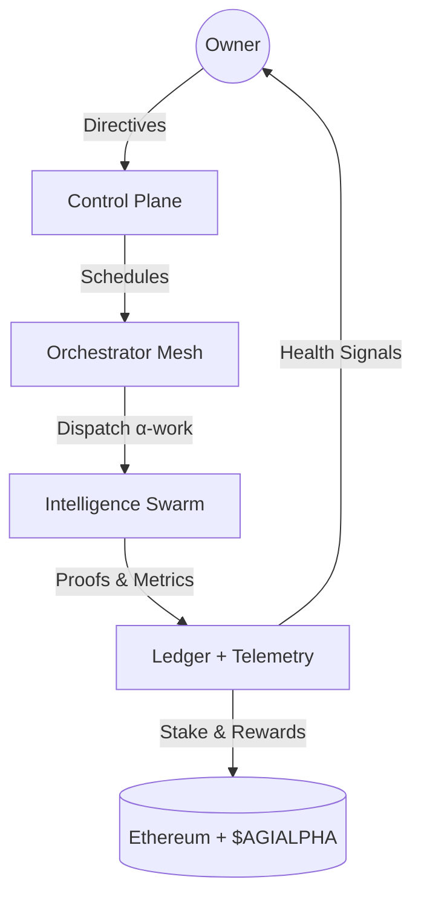
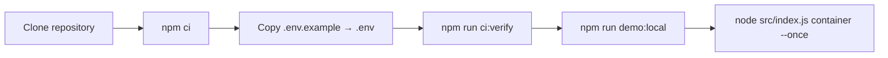
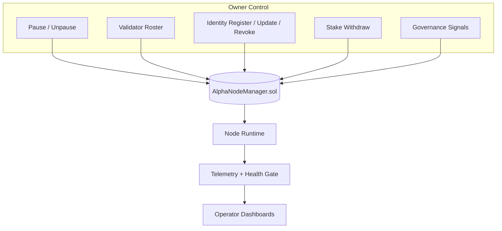
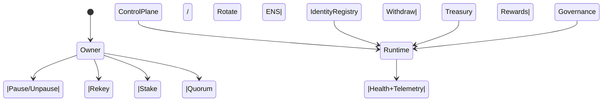
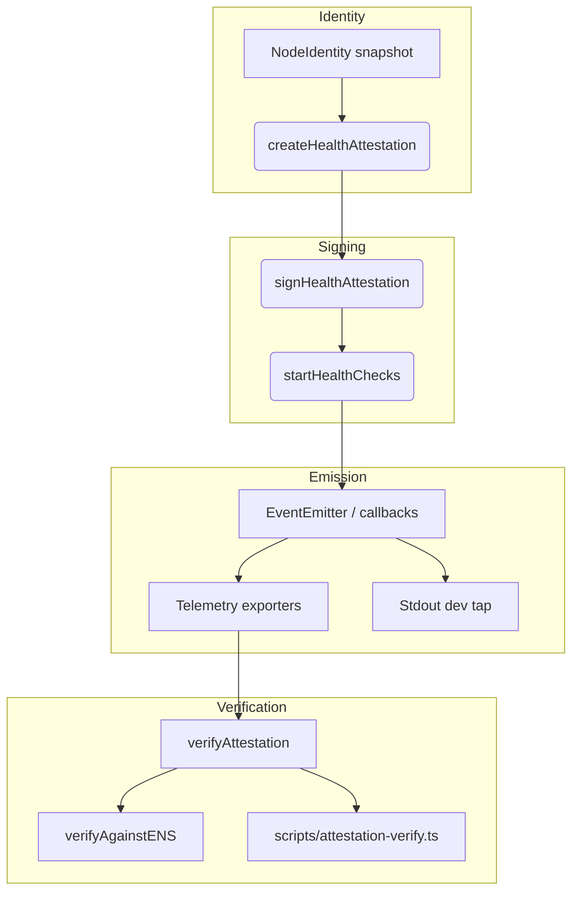
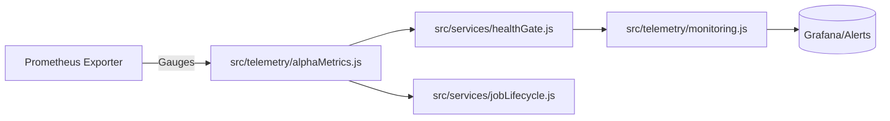
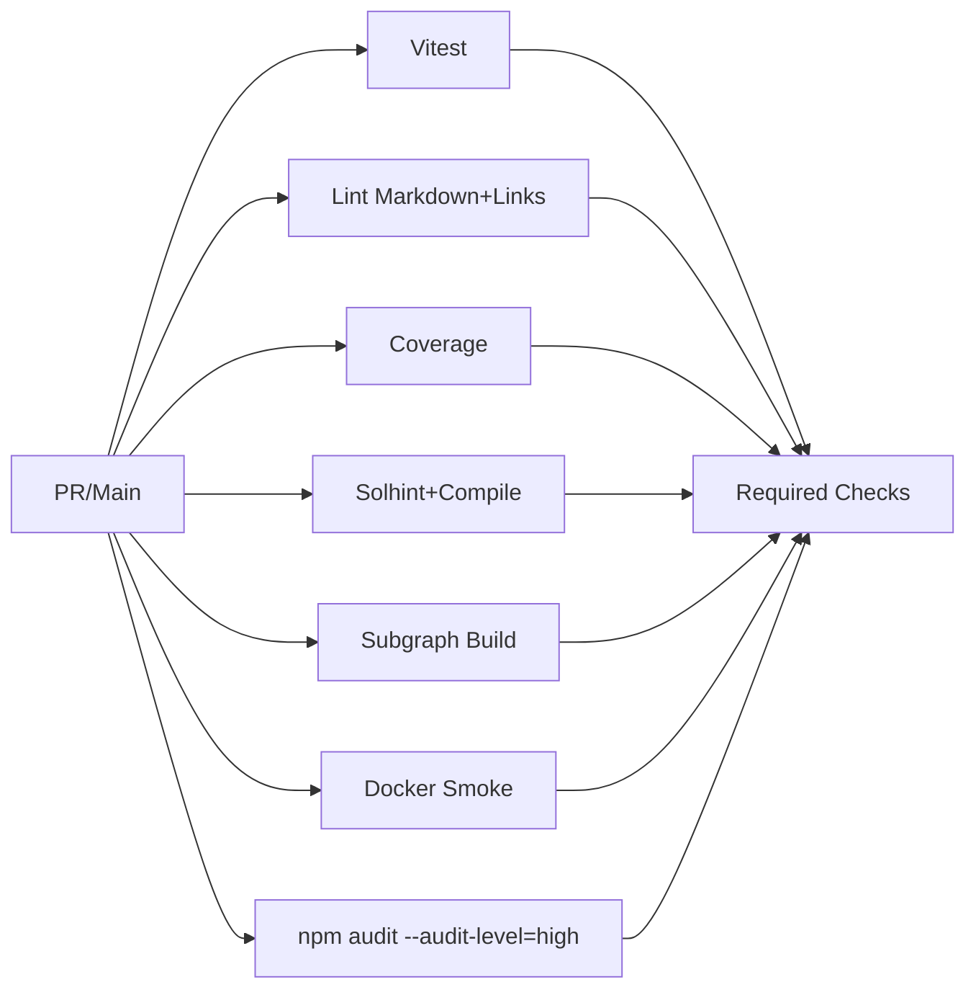

# AGI Alpha Node v0 · Command the Cognitive Armada ⚡

<!-- markdownlint-disable MD013 MD033 -->
<p align="center">
  <picture>
    <source srcset="1.alpha.node.agi.eth.svg" type="image/svg+xml" />
    
  </picture>
</p>

<p align="center">
  <a href="https://github.com/MontrealAI/AGI-Alpha-Node-v0/actions/workflows/ci.yml">
    
  </a>
  
  <a href=".github/required-checks.json">
    
  </a>
  
  
  
  
  <a href="https://etherscan.io/address/0xa61a3b3a130a9c20768eebf97e21515a6046a1fa"></a>
  
  <a href="Dockerfile"></a>
  <a href="deploy/helm/agi-alpha-node"></a>
  <a href="LICENSE"></a>
</p>

> **AGI Alpha Node v0 metabolizes cognition into $AGIALPHA while keeping the operator in absolute command.** Every heartbeat, proof, and payout is attestable, deterministic, and tied to owner-held controls.

> Built to feel like an inexhaustible co-processor: sovereign control for the owner, cryptographic attestations for verifiers, and ruthless CI discipline so every change lands clean.



---

## Table of Contents

1. [Mission Snapshot](#mission-snapshot)
2. [Quickstart](#quickstart)
3. [Owner Command Surface](#owner-command-surface)
4. [Health Attestation Mesh](#health-attestation-mesh)
5. [$AGIALPHA Treasury](#agialpha-treasury)
6. [ENS-Aligned Identity Fabric](#ens-aligned-identity-fabric)
7. [Autonomous Job Orchestration](#autonomous-job-orchestration)
8. [Observability Stack](#observability-stack)
9. [Testing & CI Gates](#testing--ci-gates)
10. [Deployment Vectors](#deployment-vectors)
11. [Repository Atlas](#repository-atlas)
12. [Reference Snippets](#reference-snippets)

---

## Mission Snapshot

- **Canonical treasury binding** — Hardwired to the 18-decimal `$AGIALPHA` contract [`0xa61a3b3a130a9c20768eebf97e21515a6046a1fa`](https://etherscan.io/address/0xa61a3b3a130a9c20768eebf97e21515a6046a1fa) for staking, rewards, and settlement.
- **Owner-dominated controls** — Pausing, validator rosters, identity registration, controller updates, stake withdrawal, and governance signaling stay exclusively with the contract owner (`AlphaNodeManager.sol`).
- **Deterministic attestations** — Canonical JSON, signed payloads, and independent verification keep liveness and identity integrity provable.
- **Live health plane** — `startHealthChecks` signs latency-aware attestations on a timer, emitting canonical payloads that telemetry and verifiers can trust without drift.
- **Production-hardening** — Markdown + link linting, Vitest suites, coverage, Solidity lint/compile, subgraph builds, Docker smoke, npm audit, and policy gates are enforced in CI and required on PRs/main.
- **Operator empathy** — Docker, Helm, scripts, and CLI taps let non-technical operators deploy and validate without touching internals while retaining full override authority.

---

## Quickstart



1. **Clone & install (pulls cryptography deps such as @noble/ed25519)**

   ```bash
   git clone https://github.com/MontrealAI/AGI-Alpha-Node-v0.git
   cd AGI-Alpha-Node-v0
   npm ci
   ```

   Node.js **20.18+** is enforced for deterministic builds.

2. **Configure identity & payouts**
   - Copy `.env.example` → `.env` and fill ENS label/name, payout targets, telemetry endpoints, staking thresholds, and RPC endpoints.
   - Provide signing material through `ALPHA_NODE_KEYFILE` (JSON keyfile) or `NODE_PRIVATE_KEY` so live attestations match your ENS-published pubkey.
   - Verify ENS alignment before launching:

     ```bash
     npm run ens:inspect -- --name <your-node>.eth
     node -e "import { loadNodeIdentity } from './src/identity/loader.js'; (async()=>console.log(await loadNodeIdentity('<your-node>.eth')))();"
     ```

3. **Mirror CI locally**

   ```bash
   npm run ci:verify
   ```

   Executes linting, tests, coverage, Solidity hygiene, subgraph build, npm audit (high), and policy/branch gates.

4. **Launch the orchestrator**

   ```bash
   npm run demo:local       # seeds fixtures and observability loops
  node src/index.js container --once
  ```

   Bootstrap hydrates ENS, governance, staking posture, telemetry, and the health gate before dispatching α-work.

5. **Lock in CI parity**

   - Run `npm run ci:verify` before every PR to mirror the enforced gate set.
   - Confirm the green badge above stays green; required checks are enforced on `main` and PRs via branch protections and [`.github/required-checks.json`](.github/required-checks.json).

---

## Owner Command Surface



- **Complete override authority** — `contracts/AlphaNodeManager.sol` empowers the owner to pause/unpause, update validator sets, register or rotate ENS identities, alter identity status, and withdraw stake.
- **Parameter agility** — Owner-set tunables (minimum stake, quorum thresholds, reward curves, fuses/expiry, attestation cadence) are read at runtime, allowing rapid pivots without redeploying contracts.
- **Runtime overrides** — Owner-triggered updates immediately propagate through orchestrator services, attestation emission windows, and treasury logic, enabling responsive control of every critical parameter.
- **Runtime enforcement** — Services in `src/services/` (governance, staking, rewards, control plane) read owner directives and refuse execution when the health gate or treasury posture is off-policy.
- **Token discipline** — Staking and payouts are normalized to wei precision against the canonical `$AGIALPHA` address; non-canonical overrides are rejected at config parsing.



---

## Health Attestation Mesh



- **Schema** — [`src/attestation/schema.ts`](src/attestation/schema.ts) defines `HealthAttestation` v1 (`timestamp`, `ensName`, `peerId`, `nodeVersion`, `multiaddrs`, optional `fuses/expiry/latency/meta`, `status: healthy | degraded | unhealthy`) plus canonical serialization helpers for stable signatures.
- **Emission** — [`src/attestation/health_service.ts`](src/attestation/health_service.ts) builds attestations from `NodeIdentity`, measures latency, signs via the node keypair, emits through an `EventEmitter` and callback, and can pretty-print to stdout for dev observability.
- **Verification** — [`src/attestation/verify.ts`](src/attestation/verify.ts) recomputes canonical digests and verifies `secp256k1` or `ed25519` signatures. `verifyAgainstENS` reloads ENS identity to prevent drift from owner-declared records.
- **CLI verifier** — `npm run attestation:verify -- --file signed.json --ens alpha.node.eth --print` loads the ENS identity (or a local `NodeIdentity` JSON) and exits non-zero on failure.

### Sample signed attestation

```json
{
  "attestation": {
    "version": "v1",
    "timestamp": "2024-06-01T00:00:00.000Z",
    "ensName": "alpha.node.eth",
    "peerId": "12D3KooXexample",
    "role": "orchestrator",
    "nodeVersion": "1.0.0",
    "multiaddrs": ["/dns4/example.com/tcp/443/wss/p2p/12D3KooXexample"],
    "status": "healthy",
    "latencyMs": 42
  },
  "signature": "0x…",
  "signatureType": "secp256k1"
}
```

---

## $AGIALPHA Treasury

- **Token constants** — `$AGIALPHA`, 18 decimals, canonical address enforced in [`src/constants/token.js`](src/constants/token.js) and [`src/config/schema.js`](src/config/schema.js). Divergent overrides are rejected.
- **Treasury runtime** — Staking, reward, and treasury loops in [`src/services/staking.js`](src/services/staking.js), [`src/services/rewards.js`](src/services/rewards.js), and [`src/services/economics.js`](src/services/economics.js) normalize token math to wei precision.
- **Ledger discipline** — Validation and settlement events (`recordAlphaWUMint`, `recordAlphaWUValidation`, `recordAlphaWUAcceptance`, `applySlash`) emit on-chain proofs that downstream subgraphs can index without ambiguity.

---

## ENS-Aligned Identity Fabric

- **Identity loader** — [`src/identity/loader.ts`](src/identity/loader.ts) hydrates ENS pubkeys, peerIds, `_dnsaddr` multiaddrs, fuses, expiry, and metadata before any orchestrator work is scheduled.
- **Resolver tooling** — [`src/ens/config.ts`](src/ens/config.ts) and [`src/ens/client.ts`](src/ens/client.ts) encapsulate ENS registry/resolver addresses, while [`src/identity/dnsaddr.ts`](src/identity/dnsaddr.ts) normalizes multiaddrs for libp2p alignment.
- **Health gate** — [`src/services/healthGate.js`](src/services/healthGate.js) ties stake posture, heartbeat freshness, and diagnostics into a single decision point so orchestrators only run when identities are healthy and funded.

---

## Autonomous Job Orchestration

- **Lifecycle kernel** — [`src/services/jobLifecycle.js`](src/services/jobLifecycle.js) drives discovery → execution → validation → settlement for α-work units with auditable journaling.
- **Control plane** — [`src/services/controlPlane.js`](src/services/controlPlane.js) accepts owner directives and routes workloads into the orchestrator mesh.
- **Validator loop** — [`src/validator/validatorLoop.js`](src/validator/validatorLoop.js) and [`src/validator/runtime.js`](src/validator/runtime.js) enforce validation, quorum, and proof replay discipline.
- **Swarm intelligence** — [`src/intelligence/swarmOrchestrator.js`](src/intelligence/swarmOrchestrator.js), [`src/intelligence/planning.js`](src/intelligence/planning.js), and [`src/intelligence/learningLoop.js`](src/intelligence/learningLoop.js) coordinate autonomous agents while respecting owner priorities.

---

## Observability Stack



- **Metrics** — [`src/telemetry/monitoring.js`](src/telemetry/monitoring.js) exposes Prometheus metrics populated by gauges in [`src/telemetry/alphaMetrics.js`](src/telemetry/alphaMetrics.js).
- **AlphaWU signals** — [`src/telemetry/alphaWuTelemetry.js`](src/telemetry/alphaWuTelemetry.js) records execution and reward traces for every α-work unit.
- **Healthcheck endpoint** — [`src/healthcheck.js`](src/healthcheck.js) provides liveness probes aligned with the health gate and identity posture.

---

## Testing & CI Gates



- **One-command mirror** — `npm run ci:verify` executes linting, tests, coverage, Solidity hygiene, subgraph build, npm audit (high), and policy/branch gates.
- **Required checks** — Enforced on PRs/main via [`.github/required-checks.json`](.github/required-checks.json): Lint Markdown & Links, Unit & Integration Tests, Coverage Report, Docker Build & Smoke Test, Solidity Lint & Compile, Subgraph TypeScript Build, Dependency Security Scan.
- **Targeted commands**
  - `npm run lint` — Markdown + link linting
  - `npm test` — Vitest suites
  - `npm run coverage` — c8 coverage report
  - `npm run ci:solidity` — solhint + solc harness
  - `npm run ci:ts` — subgraph codegen + build
  - `npm run ci:security` — npm audit (high)
  - `npm run attestation:verify -- --file signed.json --ens <name>` — validate attestation signatures

---

## Deployment Vectors

- **Docker** — Build and smoke-test locally:

  ```bash
  docker build -t agi-alpha-node:local .
  docker run --rm \
    -e NODE_LABEL=smoke-test \
    -e OPERATOR_ADDRESS=0x0000000000000000000000000000000000000001 \
    -e RPC_URL=https://rpc.invalid \
    agi-alpha-node:local --help
  ```

- **Helm** — Production chart at [`deploy/helm/agi-alpha-node`](deploy/helm/agi-alpha-node).
- **Subgraph** — Subgraph build pipeline lives in [`subgraph/`](subgraph/) and is exercised by `npm run ci:ts`.

---

## Repository Atlas

| Path | Purpose |
| --- | --- |
| `src/attestation/` | Health schema, signer, verifier, and CLI helpers. |
| `src/identity/` | ENS identity loaders, key handling, DNSAddr normalization. |
| `src/services/` | Governance, staking, rewards, control plane, lifecycle, telemetry gates. |
| `src/orchestrator/` | Node bootstrap, monitor loop, runtime coordination. |
| `src/intelligence/` | Planning, learning, swarm orchestration, stress harnesses. |
| `src/validator/` | Validator runtime and quorum enforcement. |
| `contracts/` | Solidity contracts (AlphaNodeManager, access control, interfaces). |
| `deploy/helm/` | Kubernetes deployment artifacts. |
| `scripts/` | CI gates, ENS inspection, attestation verification, solc harness, badge publisher. |
| `test/` | Vitest suites covering orchestration, ENS, governance, attestation, telemetry. |

---

## Reference Snippets

- **Run the attestation verifier (ENS-backed)**

  ```bash
  npm run attestation:verify -- --file signed-attestation.json --ens alpha.node.eth --print
  ```

- **Run the attestation verifier with a local NodeIdentity JSON**

  ```bash
  npm run attestation:verify -- --file signed-attestation.json --identity identity.json
  ```

- **Regenerate subgraph manifest and build**

  ```bash
  npm run ci:ts
  ```

- **Run Prometheus monitoring locally**

  ```bash
  node -e "import { startMonitoringServer } from './src/telemetry/monitoring.js'; startMonitoringServer({ port: 9090 });"
  ```

Operate this node as a sovereign, ever-accelerating cognitive engine: health attestations are provable, treasury flows are deterministic, and every control surface answers only to the owner.
