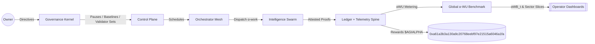
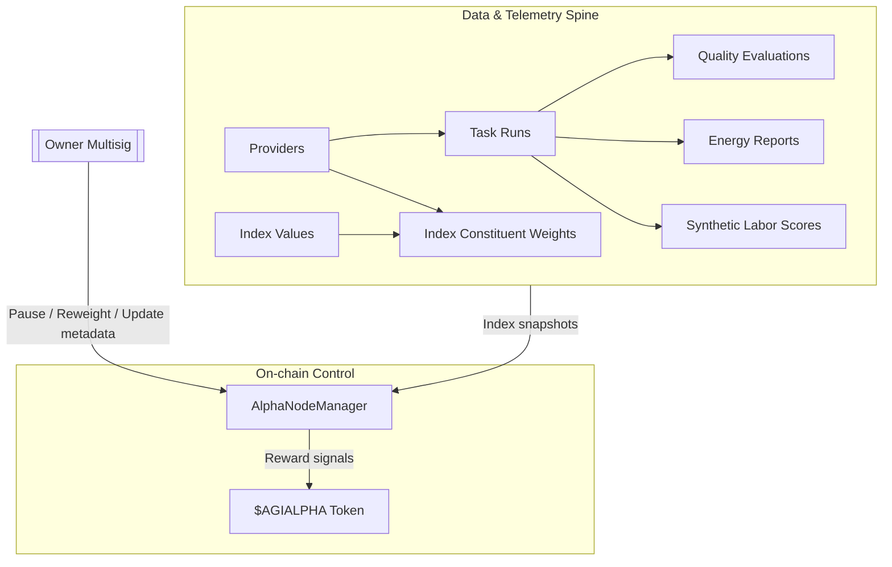
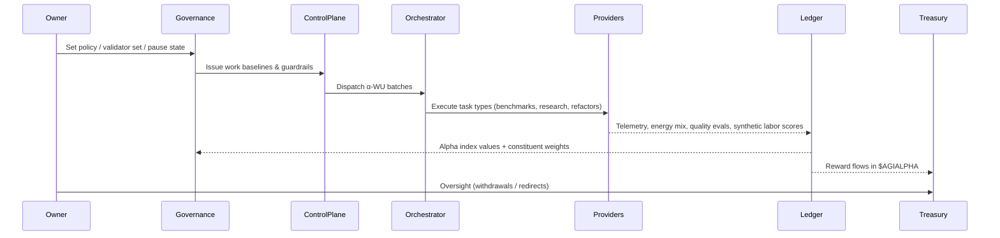
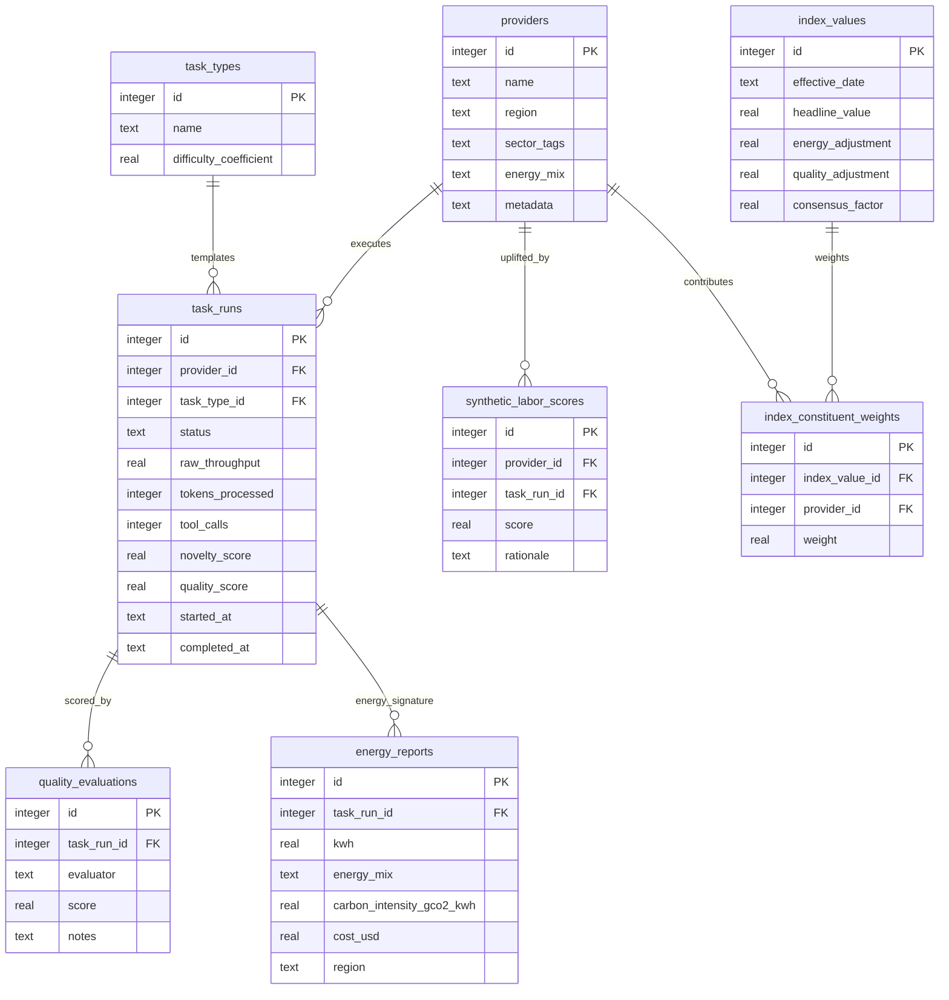

# AGI Alpha Node v0 · Cognitive Yield Engine ⚡

<!-- markdownlint-disable MD013 MD033 -->
<p align="center">
  <picture>
    <source srcset="1.alpha.node.agi.eth.svg" type="image/svg+xml" />
    
  </picture>
</p>

<p align="center">
  <a href="https://github.com/MontrealAI/AGI-Alpha-Node-v0/actions/workflows/ci.yml?query=branch%3Amain">
    
  </a>
  <a href=".github/required-checks.json">
    
  </a>
  <a href="docs/testing.md">
    
  </a>
  
  
  <a href="https://etherscan.io/address/0xa61a3b3a130a9c20768eebf97e21515a6046a1fa"></a>
  
  <a href="LICENSE"></a>
  <a href="Dockerfile"></a>
  <a href="deploy/helm/agi-alpha-node"></a>
  <a href="docs/testing.md"></a>
  <a href="https://github.com/MontrealAI/AGI-Alpha-Node-v0/graphs/contributors"></a>
  
</p>

> **AGI Alpha Node v0** is the cognitive yield engine that turns heterogeneous agentic work into verifiable α‑Work Units (α‑WU), anchors them to the `$AGIALPHA` treasury (`0xa61a3b3a130a9c20768eebf97e21515a6046a1fa`, 18 decimals), and keeps every lever under the owner’s command—pause, re-weight, rotate validators, refresh baselines, and reroute rewards without redeploying code.

## Quickstart (production-safe defaults)

```bash
git clone https://github.com/MontrealAI/AGI-Alpha-Node-v0.git
cd AGI-Alpha-Node-v0
npm ci                    # installs native better-sqlite3, solc, vitest, etc.
npm run db:migrate        # initializes SQLite spine (use AGI_ALPHA_DB_PATH to override)
npm run db:seed           # loads canonical providers + task types
npm test                  # full vitest suite, policy gates, persistence coverage
npm start -- --help       # explore runtime flags
```

## Operational notes

- Owner-level directives live in `contracts/AlphaNodeManager.sol` and are callable without redeploys (pause/unpause, validator set rotation, staking/withdrawal, registry rewrites, reward redirects).
- CI is enforced on `main` via `.github/required-checks.json`; every PR surfaces lint, policy, coverage, Solidity, and subgraph gates before merge.
- Database CLI (`node src/persistence/cli.js <migrate|seed> [db]`) mirrors production automation so non-specialists can bootstrap nodes safely.

## Non-negotiable guarantees

- **Owner total command**: pause/unpause, swap validator sets, rewrite identity controllers, and redirect/stage rewards directly from `AlphaNodeManager` without migrating contracts.
- **Reproducible data spine**: migrations + seeds initialize providers, task types, runs, telemetry, alpha indices, and constituent weights with indexes on provider/day for instant dashboards.
- **Hardened delivery**: CI pins every gate (lint, links, policy/branch, JS/TS tests, Solidity checks, subgraph builds, audit scan, Docker smoke) and is enforced for PRs on `main`.





## Why this node

- **Owner-first control**: every critical switch is held by the contract owner—pause/unpause, validator rotation, identity lifecycle, staking withdrawals, and slashing routines are callable without redeployment from `contracts/AlphaNodeManager.sol`.
- **Deterministic data spine**: the node persists providers, task types, runs, telemetry, and α-index values through SQLite with migrations and seeds so that dashboards, subgraphs, and settlement always agree.
- **Enterprise-grade gates**: CI enforces lint, tests, coverage, Solidity checks, TypeScript/subgraph builds, policy gates, security audit scan, and branch guards on every PR before merge.
- **Operator clarity**: the README, CLI, and docs are wired for non-specialists—commands mirror production automation (`npm run ci:verify`, `node src/persistence/cli.js migrate`, etc.).

## System topology



## Repository map

- **Runtime**: `src/index.js` boots telemetry, health gates, orchestrator loops, and service wiring.
- **Contracts**: `contracts/AlphaNodeManager.sol` (owner-led control plane, staking, validator registry) with canonical `$AGIALPHA` token address baked in.
- **Persistence**: `src/persistence` contains SQLite migrations, seeders, repositories, and CLI entrypoints for repeatable data operations.
- **Docs**: `docs/` holds identity, economics, manifesto, and ops guidance.
- **Tests**: `test/` runs Vitest suites (JS + TS) covering governance, attestation, persistence, ENS, staking, and orchestrator behavior.
- **Subgraph**: `subgraph/` contains Graph Node manifest generation and TypeScript bindings for on-chain indexing.

## Core data model

The storage layer encodes the AGI Alpha Index across providers and work units. All tables are created by `src/persistence/migrations/0001_core.sql` and wrapped by repositories in `src/persistence/repositories.js`.



| Entity | Purpose | Key fields |
| --- | --- | --- |
| `providers` | Registered execution nodes with region, sector tags, energy mix, metadata | `name`, `operator_address`, `region`, `sector_tags[]`, `energy_mix`, `metadata` |
| `task_types` | Canonical α‑WU templates with difficulty coefficients | `name`, `description`, `difficulty_coefficient` |
| `task_runs` | Individual executions tied to providers & task types | `provider_id`, `task_type_id`, `status`, `raw_throughput`, `tokens_processed`, `tool_calls`, `novelty_score`, `quality_score`, timestamps |
| `quality_evaluations` | Evaluator-scored runs | `task_run_id`, `evaluator`, `score`, `notes` |
| `energy_reports` | Energy/region signals per run | `task_run_id`, `kwh`, `energy_mix`, `carbon_intensity_gco2_kwh`, `cost_usd`, `region` |
| `synthetic_labor_scores` | Synthetic labor uplift per provider/run | `provider_id`, `task_run_id`, `score`, `rationale` |
| `index_values` | Headline Alpha Index values | `effective_date`, `headline_value`, `energy_adjustment`, `quality_adjustment`, `consensus_factor` |
| `index_constituent_weights` | Provider weights for each index value | `index_value_id`, `provider_id`, `weight` |

### Migrations & seeds

- **Apply migrations**

  ```bash
  npm run db:migrate            # uses AGI_ALPHA_DB_PATH or in-memory by default
  node src/persistence/cli.js migrate data/alpha.sqlite
  ```

- **Seed catalog**

  ```bash
  npm run db:seed               # same DB resolution rules
  node src/persistence/cli.js seed data/alpha.sqlite
  ```

  Seeds cover task types (code-refactor, research-dossier, data-cleanse, agent-benchmark) and sample providers (hydro + wind mixes) from `src/persistence/seeds.js`.

- **Repositories**: CRUD helpers for each entity enforce JSON/tags serialization, timestamp updates, and provider/task lookups.

### Repository usage example

```js
import { initializeDatabase } from '../src/persistence/database.js';
import {
  ProviderRepository,
  TaskTypeRepository,
  TaskRunRepository,
  QualityEvaluationRepository,
  EnergyReportRepository
} from '../src/persistence/repositories.js';
import { seedAll } from '../src/persistence/seeds.js';

const db = initializeDatabase({ filename: 'data/alpha.sqlite', withSeed: true });
const providers = new ProviderRepository(db);
const taskTypes = new TaskTypeRepository(db);
const runs = new TaskRunRepository(db);
const quality = new QualityEvaluationRepository(db);
const energy = new EnergyReportRepository(db);

const provider = providers.findByName('helios-labs');
const taskType = taskTypes.findByName('code-refactor');

const run = runs.create({
  provider_id: provider.id,
  task_type_id: taskType.id,
  external_id: 'alpha-run-001',
  status: 'running',
  raw_throughput: 1.2,
  tokens_processed: 12000
});

quality.create({ task_run_id: run.id, evaluator: 'cognitive-audit', score: 0.93 });
energy.create({ task_run_id: run.id, kwh: 4.2, energy_mix: 'hydro', region: 'na-east' });

console.log(runs.getById(run.id));
```

### CI & release discipline

```mermaid
flowchart LR
  Lint[Markdown + Links] --> Tests[Vitest JS/TS]
  Tests --> Coverage[Coverage + Upload]
  Coverage --> Solidity[Solhint + solc smoke]
  Solidity --> Subgraph[Subgraph build]
  Subgraph --> Security[High-severity npm audit]
  Security --> Policy[Health + Branch gates]
  Policy --> Docker[Docker build + runtime help]
  Docker --> Merge[PR Merge Allowed]
```



- `npm run ci:verify` replicates the GitHub Actions pipeline locally.
- Required checks for PRs and `main` are tracked in `.github/required-checks.json` and rendered in the badges above.
- Coverage artifacts and subgraph codegen are uploaded on every CI run to keep downstream analytics aligned.
