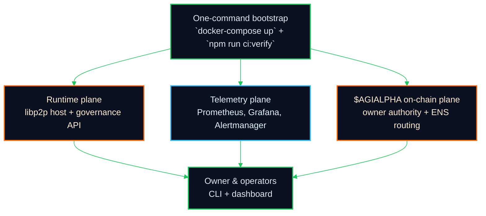
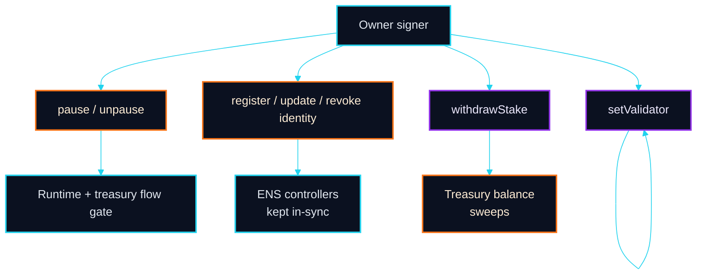
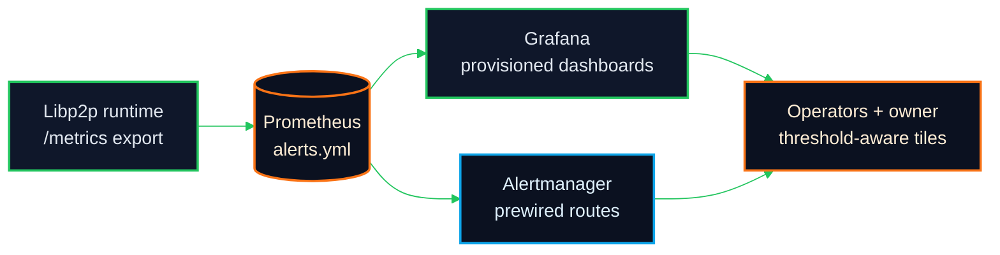

# AGI Alpha Node v0 · Cognitive Yield Engine ⚡️
<!-- markdownlint-disable MD012 MD013 MD033 -->
<p align="center">
  <picture>
    <source srcset="1.alpha.node.agi.eth.svg" type="image/svg+xml" />
    
  </picture>
</p>

<p align="center">
  <a href="https://github.com/MontrealAI/AGI-Alpha-Node-v0/actions/workflows/ci.yml?query=branch%3Amain">
    
  </a>
  <a href="docs/deployment/branch-protection.md#shieldsio-badge-publishing">
    
  </a>
  <a href=".github/required-checks.json">
    
  </a>
  <a href="docs/deployment/branch-protection.md#enforce-required-checks">
    
  </a>
  
  
  <a href="https://etherscan.io/address/0xa61a3b3a130a9c20768eebf97e21515a6046a1fa">
    
  </a>
  
  
  
  <a href="LICENSE">
    
  </a>
</p>

AGI Alpha Node v0 is the owner-controlled intelligence engine that braids on-chain authority, libp2p runtime governance, and a fully provisioned observability wall. Every surface is tuned so the owner can pause, retune, or redirect the platform in a single transaction while the CI wall keeps the repository deployment-ready. The node is designed to act as the decisive intelligence substrate for high-stakes orchestration while keeping owner override levers visible, auditable, and safe to trigger. The canonical token contract is anchored at `0xa61a3b3a130a9c20768eebf97e21515a6046a1fa` (18 decimals) so treasury, staking, and governance always remain under explicit owner command.

The stack is curated like a flight deck built to defend a green badge wall: diagrams lint the same way GitHub renders them, CI surfaces every check as a visible status, and branch protection is wired to the same job names that the local `npm run ci:verify` emits. The owner keeps immediate control over runtime posture, validator rosters, identity routes, staking balances, and treasury sweeps—every override is accompanied by metrics, events, and dashboards so production actions are reversible, observable, and enforced by policy.

The repository is curated as a production cockpit: mermaid diagrams lint for GitHub parity, coverage is gated at 85%+, dependency security is enforced on every PR, and branch protection mirrors the exact checks documented below so the CI badge is always green and visible.

Mermaid diagrams, badges, and CI gate names have been aligned so GitHub renders everything identically to local previews. The README, docs, dashboards, and workflow job names are kept in lockstep to make enforcement transparent: the required checks, badge endpoints, and `npm run ci:verify` output all share the same strings, so a green wall locally means a green wall on PRs and `main`.

---

## Table of contents

- [System map](#system-map)
- [What lives here](#what-lives-here)
- [Smart contract control surface](#smart-contract-control-surface)
- [Runtime + observability autopilot](#runtime--observability-autopilot)
- [CI and branch protection](#ci-and-branch-protection)
- [Owner control quick reference](#owner-control-quick-reference)
- [Owner function matrix](#owner-function-matrix)
- [Quick start](#quick-start)
- [Testing and validation](#testing-and-validation)
- [Operational guarantees](#operational-guarantees)
- [Runbooks and references](#runbooks-and-references)

## System map

```mermaid
%%{init: { "theme": "forest", "themeVariables": { "primaryColor": "#0f172a", "primaryTextColor": "#e2e8f0", "lineColor": "#22c55e", "secondaryColor": "#9333ea", "tertiaryColor": "#0ea5e9" } }}%%
flowchart LR
  classDef neon fill:#0f172a,stroke:#22c55e,stroke-width:2px,color:#e2e8f0;
  classDef ember fill:#0b1120,stroke:#f97316,stroke-width:2px,color:#ffedd5;
  classDef frost fill:#0b1120,stroke:#0ea5e9,stroke-width:2px,color:#e0f2fe;

  Owner[Owner keys\n$AGIALPHA authority]:::neon --> Manager[AlphaNodeManager\npause/validators/stake]:::ember
  Manager --> Treasury[TreasuryExecutor\nintent ledger + sweeps]:::frost
  Manager --> Runtime[Libp2p runtime\nresource manager + api]:::neon
  Runtime --> Metrics[/metrics export\nNRM · Yamux · QUIC]:::ember
  Metrics --> Prometheus[(Prometheus + alerts)]:::frost
  Prometheus --> Grafana[Grafana\nlibp2p + DCUtR dashboards]:::neon
  Grafana --> Operators[Operators & auditors\nfirst-boot cockpit]:::ember
  Runtime -.-> CI[CI wall\nci.yml + required-checks.json]:::frost
  CI --> Protection[Branch protection\nPR enforcement]:::neon
  Protection --> Owner
```



## What lives here

- **Runtime:** [`src/`](src/) — libp2p host, governance API (`/governance/*`), metrics exporters, resource manager wiring, and persistence tooling tuned to the observability stack.
- **On-chain authority:** [`contracts/`](contracts/) — `$AGIALPHA` control plane with owner-only pause/unpause, validator gating, ENS identity routing, staking commands, and canonical token enforcement at `0xa61a3b3a130a9c20768eebf97e21515a6046a1fa` (18 decimals).
- **Treasury/orchestration:** [`scripts/treasury/`](scripts/treasury/) + [`contracts/TreasuryExecutor.sol`](contracts/TreasuryExecutor.sol) — intent collection, Dilithium envelope handling, and owner override sweeps.
- **Observability:** [`observability/`](observability/) + [`grafana/provisioning/`](grafana/provisioning/) + [`docker-compose.yml`](docker-compose.yml) — Prometheus scrape config, alert rules, Grafana dashboards, and Alertmanager routes provisioned on first boot.
- **Dashboard app:** [`dashboard/`](dashboard/) — Vite/React cockpit for runtime status and operator workflows.
- **Indexing:** [`subgraph/`](subgraph/) — build + codegen for the indexing layer that tracks on-chain authority and emits type-safe bindings.
- **Deploy + ops:** [`deploy/`](deploy/), [`config/`](config/), and [`scripts/`](scripts/) — first-boot configuration, branch/health gate scripts, Docker and P2P simulators, database migrations, and CI helpers.
- **Runbooks + proofs:** [`docs/`](docs/) and [`observability/docs/`](observability/docs/) — operational runbooks, threat modeling, economics/identity references, and telemetry dashboards.
- **CI enforcement:** [`.github/workflows/ci.yml`](.github/workflows/ci.yml) + [`.github/required-checks.json`](.github/required-checks.json) — single-source list of required checks mirrored by local `npm run ci:verify`.

> Tip: if you publish the badges gist from [`docs/deployment/branch-protection.md`](docs/deployment/branch-protection.md#shieldsio-badge-publishing), you can drop endpoint badges for lint, tests, solidity, subgraph, security, docker, and coverage directly into this README without changing the workflow wiring.

## Smart contract control surface

$AGIALPHA is pinned to contract address `0xa61a3b3a130a9c20768eebf97e21515a6046a1fa` (18 decimals). The owner holds every critical lever and can retarget the platform without redeploying.

- **Pause/resume:** `pause()` / `unpause()` freeze or reopen staking and validator flows immediately.
- **Validator gating:** `setValidator(address,bool)` toggles validator eligibility.
- **Identity routing:** `registerIdentity`, `updateIdentityController`, `setIdentityStatus`, `revokeIdentity` keep ENS-bound controllers aligned with the active operator set.
- **Stake custody:** `withdrawStake(recipient, amount)` lets the owner move staked balances.
- **Token safety:** the constructor refuses non-canonical token addresses unless the canonical `$AGIALPHA` is provided.
- **Runtime override:** owner-controlled pausing, validator toggles, identity rotation, and stake withdrawal are designed to be exercised live while telemetry + CI keep changes observable.
- **Validation + slashing:** `recordAlphaWUValidation`, `recordAlphaWUAcceptance`, and `applySlash` keep validator output accountable while preserving owner authority to accept, reject, or penalize work.

Source: [`contracts/AlphaNodeManager.sol`](contracts/AlphaNodeManager.sol)



## Runtime + observability autopilot

- `/metrics` surfaces resource-manager gauges (`nrm_limits`, `nrm_usage`), Yamux stream counters, QUIC handshake histograms, and dial outcomes to keep runtime pressure visible. Source: [`src/telemetry/networkMetrics.js`](src/telemetry/networkMetrics.js).
- Resource manager ceilings and connection pruning thresholds read environment overrides (`NRM_*`, `CONN_*`) and are emitted alongside the active limits JSON. Source: [`src/network/resourceManagerConfig.js`](src/network/resourceManagerConfig.js).
- Docker Compose starts Prometheus, Grafana, and Alertmanager with wired dashboards (`libp2p_unified_dashboard.json`, `dcutr_dashboard.json`) and alert rules (`alerts.yml`) on first load. Sources: [`docker-compose.yml`](docker-compose.yml), [`observability/prometheus/alerts.yml`](observability/prometheus/alerts.yml), [`grafana/provisioning/dashboards/libp2p.yaml`](grafana/provisioning/dashboards/libp2p.yaml).



## CI and branch protection

The CI wall is the single source of truth for merging. Every gate is required on `main` and PRs and mirrors `npm run ci:verify` locally.

- **Workflow:** [`.github/workflows/ci.yml`](.github/workflows/ci.yml) fans out linting, tests, coverage, Solidity checks, subgraph build, Docker smoke, and security audit before the aggregate `verify` stage.
- **Required checks:** [`.github/required-checks.json`](.github/required-checks.json) lists the exact status checks to enforce in GitHub branch protection (recommended: apply to `main` and all PRs).
- **Local parity:** `npm run ci:verify` executes the same gates so contributors can keep the badge wall green before opening a PR.
- **Branch rule recipe:** Settings → Branches → Add rule for `main` → Require a pull request before merging → Require status checks to pass using [`.github/required-checks.json`](.github/required-checks.json) → Require conversation resolution. This keeps CI visible and enforced on every PR.
- **Enforcement sanity check:** After applying the branch rule, push a test PR to confirm GitHub blocks merging until every required check turns green and the workflow badge above reflects the latest run.
- **Badge publishing:** wire `BADGE_GIST_ID` and `BADGE_GIST_TOKEN` (see [`docs/deployment/branch-protection.md`](docs/deployment/branch-protection.md#shieldsio-badge-publishing)) so the `badges` job can auto-push Shields endpoint JSON for lint, tests, solidity, subgraph, docker, security, and coverage.

| Status check | Job ID | Local command | Badge endpoint key |
| --- | --- | --- | --- |
| Lint Markdown & Links | `lint` | `npm run lint:md && npm run lint:links && npm run lint:grafana` | `lint.json` |
| Unit, Integration & Frontend Tests | `test` | `npm run ci:test` | `test.json` |
| Coverage Report | `coverage` | `npm run coverage` | `coverage.json` |
| Docker Build & Smoke Test | `docker-smoke` | `docker build ... && docker run ... --help` | `docker.json` |
| Solidity Lint & Compile | `solidity` | `npm run ci:solidity` | `solidity.json` |
| Subgraph TypeScript Build | `typescript` | `npm run ci:ts` | `typescript.json` |
| Dependency Security Scan | `security` | `npm run ci:security` | `security.json` |
| Full CI Verification | `verify` | `npm run ci:verify` | Aggregates all of the above |

| Status check | Purpose |
| --- | --- |
| Lint Markdown & Links | Keeps README/docs, mermaid fences, and links renderable. |
| Unit, Integration & Frontend Tests | Protects runtime and dashboard behavior via Vitest suites. |
| Coverage Report | Enforces coverage thresholds for networking and telemetry modules. |
| Docker Build & Smoke Test | Guarantees the container image boots and exposes CLI help. |
| Solidity Lint & Compile | Safeguards `$AGIALPHA` control-plane contracts. |
| Subgraph TypeScript Build | Ensures the indexing layer stays in sync with contracts. |
| Dependency Security Scan | Blocks merges on high severity advisories. |
| Full CI Verification | Aggregated enforcement matching `ci:verify`. |

```mermaid
%%{init: { "theme": "forest", "themeVariables": { "primaryColor": "#0f172a", "primaryTextColor": "#e2e8f0", "lineColor": "#22d3ee", "secondaryColor": "#9333ea", "tertiaryColor": "#f97316" } }}%%
flowchart TD
  classDef neon fill:#0f172a,stroke:#22d3ee,stroke-width:2px,color:#e2e8f0;
  classDef ember fill:#0b1120,stroke:#f97316,stroke-width:2px,color:#ffedd5;

  PR[PR / main push]:::neon --> Lint[lint + links + grafana]:::ember
  PR --> Tests[unit + integration + frontend]:::ember
  PR --> Coverage[coverage report]:::ember
  PR --> Solidity[solhint + solc]:::ember
  PR --> Subgraph[subgraph TS build]:::ember
  PR --> Docker[Docker build + smoke]:::ember
  PR --> Security[npm audit]:::ember
  Lint --> Verify[verify job]:::neon
  Tests --> Verify
  Coverage --> Verify
  Solidity --> Verify
  Subgraph --> Verify
  Docker --> Verify
  Security --> Verify
  Verify --> BranchProtection[Required checks\n(branch protection)]:::neon
```

### Rendering + enforcement guardrails

- **Mermaid parity:** `npm run lint:md` and `npm run lint:links` validate diagram fences and anchors exactly as GitHub parses them so every flowchart above stays visible on repository pages. Use `npx @mermaid-js/mermaid-cli` locally if you want PNG/SVG spot checks, but the lint gate is authoritative for PRs.
- **Badge fidelity:** the CI badge at the top of this README points to [`ci.yml`](.github/workflows/ci.yml) on `main`; if a required check fails, the badge turns red and branch protection blocks merges. The optional `badges` job publishes Shields endpoints using the same job names so you can embed granular status badges without editing workflow code.
- **Branch rules:** apply [`.github/required-checks.json`](.github/required-checks.json) to `main` and enable “Require branches to be up to date” + “Require conversation resolution.” This keeps the Full CI Verification wall, individual gates, and the aggregated verify step visible to reviewers and enforced on every PR.

## Owner control quick reference

The owner retains complete control over runtime, treasury, validators, and identity anchors while keeping telemetry and CI in lockstep.

- **Runtime switches:** pause/unpause gates (`pause`, `unpause`) and validator roster updates (`setValidator`).
- **Identity + ENS:** register, rotate, suspend, or revoke ENS-linked controllers (`registerIdentity`, `updateIdentityController`, `setIdentityStatus`, `revokeIdentity`).
- **Staking flows:** custody adjustments (`withdrawStake`), on-chain staking (`stake`), and validator validation/acceptance hooks (`recordAlphaWUValidation`, `recordAlphaWUAcceptance`, `applySlash`).
- **Auditability:** every change emits events that the subgraph indexes so dashboards and alerts stay synchronized.
- **Operator experience:** all owner functions are callable as live overrides—pause, retune validator eligibility, swap ENS controllers, or redirect funds—without redeploying contracts or touching runtime binaries.

## Owner function matrix

The canonical `$AGIALPHA` deployment at `0xa61a3b3a130a9c20768eebf97e21515a6046a1fa` (18 decimals) keeps the owner at the center of every production lever.

| Capability | Function(s) | Effect | Telemetry + audit hooks |
| --- | --- | --- | --- |
| Halt or resume live flows | `pause`, `unpause` | Pauses or resumes staking, validator work units, and treasury orchestrations in a single owner transaction. | Emits pause/unpause events; surfaces in `/metrics`, Grafana tiles, and the subgraph. |
| Validator roster control | `setValidator` | Adds or removes eligible validators instantly. | Validator roster changes appear in events, subgraph bindings, and the dashboard roster view. |
| Identity/ENS routing | `registerIdentity`, `updateIdentityController`, `setIdentityStatus`, `revokeIdentity` | Aligns ENS controllers with active operators; supports rotation and emergency revocation. | ENS + identity events propagate to the indexer and Grafana alerts. |
| Treasury and stake custody | `withdrawStake`, `applySlash`, `recordAlphaWUValidation`, `recordAlphaWUAcceptance` | Moves staked balances, accepts/rejects work units, and applies slashing with owner authority. | Emits ledger and validation events that the subgraph, Prometheus, and dashboard ingest. |
| Canonical token guardrail | Constructor enforces `0xa61a3b3a130a9c20768eebf97e21515a6046a1fa` | Rejects non-canonical token bindings to prevent drift from `$AGIALPHA`. | Deployment logs and Solidity checks validate the binding; CI solidity gate re-runs the constraint. |

```mermaid
%%{init: { "theme": "forest", "themeVariables": { "primaryColor": "#0f172a", "primaryTextColor": "#e2e8f0", "lineColor": "#f97316", "secondaryColor": "#22c55e", "tertiaryColor": "#38bdf8" } }}%%
flowchart LR
  classDef neon fill:#0f172a,stroke:#f97316,stroke-width:2px,color:#ffeedd;
  classDef ember fill:#0b1120,stroke:#22c55e,stroke-width:2px,color:#e2e8f0;
  classDef frost fill:#0b1120,stroke:#38bdf8,stroke-width:2px,color:#e0f2fe;

  OwnerKeys[Owner keys\n(on-chain authority)]:::neon --> RuntimeSwitches[Pause / Unpause\nValidator roster]:::ember
  OwnerKeys --> IdentitySwitches[ENS controller rotation\nregister / update / revoke]:::ember
  OwnerKeys --> TreasurySwitches[Stake custody\nwithdrawals + slashing]:::ember
  RuntimeSwitches --> Events[Events + metrics]:::frost
  IdentitySwitches --> Events
  TreasurySwitches --> Events
  Events --> Indexer[Subgraph indexer\nfeeds dashboards + alerts]:::frost
```

## Quick start

1. **Install dependencies:** `npm ci` (Node.js 20.18+).
2. **Run the CI wall locally:** `npm run ci:verify` — mirrors the workflow and keeps required checks green (matches [`.github/required-checks.json`](.github/required-checks.json)).
3. **Bring up observability:** `docker-compose up -d prom grafana alertmanager` — Prometheus at `:9090`, Grafana at `:3000` (admin/admin), Alertmanager at `:9093` with dashboards and alerts pre-provisioned.
4. **Explore metrics:** visit `http://localhost:9090/targets` to confirm the scrape job is `UP`; dashboards load automatically under Grafana → Manage.
5. **Exercise governance:** call the owner-only functions on `AlphaNodeManager` to pause/unpause, gate validators, rotate ENS controllers, or withdraw stake; metrics and dashboards reflect changes immediately.
6. **Keep docs + mermaids crisp:** `npm run lint:md` and `npm run lint:links` verify README/docs rendering (including mermaid diagrams) exactly as GitHub displays them.
7. **Publish shields (optional):** add `BADGE_GIST_ID` + `BADGE_GIST_TOKEN` secrets, then let the `badges` job publish Shields endpoints you can embed here for a permanent “all green” wall.

## Testing and validation

- `npm run lint:md` — verify Markdown and mermaid fences render on GitHub.
- `npm run lint:links` — ensure README and docs links stay valid.
- `npm run lint:grafana` — lint dashboard JSON for GitHub/Grafana parity.
- `npm run test && npm run test:frontend` — backend + dashboard Vitest suites.
- `npm run coverage` — coverage gates for networking/telemetry modules.
- `npm run ci:solidity` — solhint + solc for `$AGIALPHA` contracts.
- `npm run ci:ts` — build/codegen for the subgraph.
- `npm run ci:security` — high-severity dependency audit.
- `npm run ci:verify` — the full wall before pushing.

## Operational guarantees

- **Owner sovereignty:** every critical parameter (pausing, validator roster, identity controllers, stake custody) is owner-triggered and mirrored in telemetry so overrides are safe to execute in production.
- **Canonical token binding:** `AlphaNodeManager` locks to `$AGIALPHA` at `0xa61a3b3a130a9c20768eebf97e21515a6046a1fa` (18 decimals) to prevent drift.
- **Observability-first:** `/metrics`, Prometheus, Grafana dashboards, and Alertmanager routes are prewired; linting ensures dashboards render on GitHub and in Grafana identically.
- **CI-as-gatekeeper:** workflow + required checks enforce lint, tests, coverage, Solidity checks, Docker smoke, subgraph build, security audit, and final verification. PRs cannot merge without a green wall.
- **Non-technical deployability:** `docker-compose up` brings the telemetry wall online, and `npm run ci:verify` mirrors the GitHub workflow so contributors can reproduce the green state locally.
- **Owner-tuned runtime:** pausing, validator changes, ENS controller swaps, staking withdrawals, and validation hooks are all callable by the contract owner at any time to reshape the platform for new workloads or mitigations without downtime.

## Runbooks and references

- Guardian onboarding + signing: [`docs/runes/guardian.md`](docs/runes/guardian.md)
- Orchestrator execution (Mode A): [`docs/runes/orchestrator.md`](docs/runes/orchestrator.md)
- Mode A flow, envelope schema, orchestrator steps: [`docs/treasury-mode-a.md`](docs/treasury-mode-a.md)
- Network operations (reachability, DoS triage, posture flips): [`docs/network-operations.md`](docs/network-operations.md)
- Economics & identity background: [`docs/economics.md`](docs/economics.md), [`docs/identity.md`](docs/identity.md), [`docs/manifesto.md`](docs/manifesto.md)
- DCUtR metrics and dashboard import: [`observability/docs/METRICS.md`](observability/docs/METRICS.md), [`observability/docs/DASHBOARD.md`](observability/docs/DASHBOARD.md)

AGI Alpha Node v0 is engineered so the owner can reshape validator, identity, treasury, and network posture instantly while the telemetry wall and CI gates keep every change observable, reproducible, and green.

Every control in this repository is wired so the owner can steer the platform like a singular intelligence core: pausing live flows, rewriting validator/identity maps, sweeping stake, and pivoting runtime posture with the same confidence shown by the green CI badge. The result is a cockpit that delivers outsized leverage to the owner while keeping every move accountable and visible to operators, auditors, and automated guardians.
