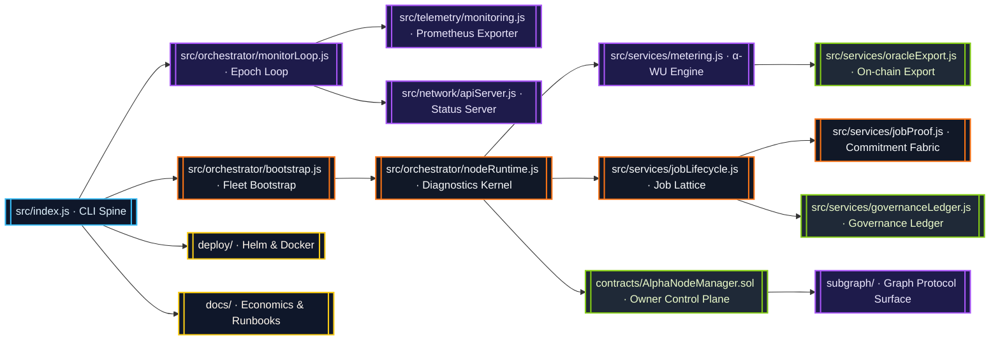

# AGI Alpha Node v0 · Sovereign Cognition Lattice ⚡

<!-- markdownlint-disable MD013 MD033 -->
<p align="center">
  <picture>
    <source srcset="1.alpha.node.agi.eth.svg" type="image/svg+xml" />
    
  </picture>
</p>

<p align="center">
  <a href="https://github.com/MontrealAI/AGI-Alpha-Node-v0/actions/workflows/ci.yml">
    
  </a>
  
  
  
  
  
  
  <a href="Dockerfile">
    
  </a>
  <a href="deploy/helm/agi-alpha-node">
    
  </a>
  <a href="docs/subgraph-deployment.md">
    
  </a>
  <a href="https://etherscan.io/address/0xa61a3b3a130a9c20768eebf97e21515a6046a1fa">
    
  </a>
  <a href="LICENSE">
    
  </a>
</p>

> AGI Alpha Node v0 is the sovereign cognition lattice where deterministic compute, provable metering, and owner-directed governance combine into a self-reinforcing value engine. Run it and you operate the machine every economist has been warning about.

---

## Contents

1. [Mandate & Edge](#mandate--edge)
2. [System Topology](#system-topology)
3. [Alpha-WU Telemetry](#alpha-wu-telemetry)
4. [Diagnostics Surfaces](#diagnostics-surfaces)
5. [Owner Command Surface](#owner-command-surface)
6. [Token & Economic Flywheel](#token--economic-flywheel)
7. [Operational Launch](#operational-launch)
8. [Continuous Verification](#continuous-verification)
9. [Repository Atlas](#repository-atlas)
10. [Reference Library](#reference-library)

---

## Mandate & Edge

The Alpha Node is built so a single owner can steer fleets of autonomous agents, rotate validators, reroute rewards, and pause the network in milliseconds. Every subsystem is production-hardened yet runnable by a non-technical operator.

* **Owner totality** — [`contracts/AlphaNodeManager.sol`](contracts/AlphaNodeManager.sol) concentrates every critical switch: pausing, identity rotation, validator curation, staking, and alpha work validation.
* **Deterministic cognition fabric** — [`src/services/jobLifecycle.js`](src/services/jobLifecycle.js) and [`src/orchestrator/nodeRuntime.js`](src/orchestrator/nodeRuntime.js) keep compute, ledger, and telemetry states synchronized.
* **Provable metering** — [`src/services/metering.js`](src/services/metering.js) calculates α-WU from GPU minutes, quality multipliers, and SLA, then streams metrics straight into Prometheus and status APIs.
* **Multi-surface observability** — [`src/telemetry/monitoring.js`](src/telemetry/monitoring.js) and [`src/network/apiServer.js`](src/network/apiServer.js) expose mission-critical counters, gauges, and diagnostics in real time.
* **Owner-driven governance** — [`src/services/governance.js`](src/services/governance.js) builds executable payloads for every upgrade, stake adjustment, emission change, or registry override.

The result is the instrument console for an intelligence economy: compliant, explainable, and yet powerful enough to outpace any conventional compute network.

---

## System Topology



Every edge is observable. Ledgers hash their history, Prometheus tracks live signals, and CI enforces deterministic builds so the owner always has a consistent view of state.

---

## Alpha-WU Telemetry

Prometheus metrics are exported by [`src/telemetry/monitoring.js`](src/telemetry/monitoring.js) and bound to `metering.stopSegment` plus the monitor loop rollup.

| Metric | Type | Labels | Description |
| ------ | ---- | ------ | ----------- |
| `alpha_wu_total` | Counter | `node_label`, `device_class`, `sla_profile` | Cumulative α-WU produced per node/device/SLA profile.
| `alpha_wu_epoch` | Gauge | `epoch_id` | α-WU totals per epoch, reset before each monitor iteration to prevent stale samples.
| `alpha_wu_per_job` | Gauge | `job_id` | High-cardinality per-job totals (enable via `METRICS_ALPHA_WU_PER_JOB=true`).
| `agi_alpha_node_alpha_wu_*` | Gauges/Counters | varies | Backwards-compatible surfaces for legacy dashboards.
| `agi_alpha_node_agent_utilization` | Gauge | `agent` | Diagnostics-reported utilization per sub-agent.
| `agi_alpha_node_health_gate_state` | Gauge | `state` | Readiness posture across `ready` and `sealed` states.

Sample metrics fragment:

```text
# HELP alpha_wu_total Cumulative alpha work units recorded by node/device/SLA profile
alpha_wu_total{node_label="node-a",device_class="A100-80GB",sla_profile="STANDARD"} 123.45
# HELP alpha_wu_epoch Alpha work units aggregated per epoch
alpha_wu_epoch{epoch_id="epoch-42"} 987.65
```

*Segments* — When `metering.stopSegment` closes a compute slice, it increments counters, updates per-job gauges, and registers epoch labels immediately.

*Epoch rollups* — The monitor loop calls `updateAlphaWorkUnitEpochMetrics` after refreshing the last 24 summaries so gauges mirror the current epoch history.

---

## Diagnostics Surfaces

The status server in [`src/network/apiServer.js`](src/network/apiServer.js) exposes actionable telemetry.

### `/status`

```jsonc
{
  "status": "ok",
  "offlineMode": false,
  "alphaWU": {
    "lastEpoch": { "id": "epoch-420", "alphaWU": 123.45 },
    "lifetimeAlphaWU": 9876.54
  }
}
```

* `lastEpoch` reflects the most recent monitor loop rollup.
* `lifetimeAlphaWU` is the running α-WU total produced by metering.

### `/status/diagnostics`

Returns epoch history with deterministic ordering:

* Per-epoch totals, start, and end timestamps.
* Aggregations by job, device class, and SLA profile.
* Lifetime totals for each breakdown to drive dashboards or alerting.

Both routes normalize numbers, guaranteeing reproducible JSON for diffing, caching, and audit trails.

---

## Owner Command Surface

The owner operates every critical switch:

* **Contract control** — [`AlphaNodeManager`](contracts/AlphaNodeManager.sol) exposes pausing (`pause`/`unpause`), validator rotation (`setValidator`), ENS management (`registerIdentity`, `updateIdentityController`, `setIdentityStatus`, `revokeIdentity`), stake routing (`stake`, `withdrawStake`), and alpha event recording (`recordAlphaWUMint`, `recordAlphaWUValidation`, `recordAlphaWUAcceptance`).
* **Governance payloads** — [`src/services/governance.js`](src/services/governance.js) generates ABI-encoded transactions for emissions, registry upgrades, treasury shares, dispute triggers, and more, ready for multisig execution.
* **CLI spine** — [`src/index.js`](src/index.js) exposes `agi-alpha-node` commands to launch monitor loops, inspect diagnostics, render governance payloads, and orchestrate jobs.
* **Health gate** — [`scripts/verify-health-gate.mjs`](scripts/verify-health-gate.mjs) enforces ENS/stake posture before CI or deployment advances.

Every pathway can be automated or invoked manually, and nothing escapes owner approval.

---

## Token & Economic Flywheel

* **Token** — `$AGIALPHA` lives at [`0xa61a3b3a130a9c20768eebf97e21515a6046a1fa`](https://etherscan.io/address/0xa61a3b3a130a9c20768eebf97e21515a6046a1fa) with 18 decimals.
* **Yield engine** — α-WU output feeds reward distribution logic through diagnostics and governance payloads.
* **Autonomous swarms** — Job lifecycle, metering, and oracle exports coordinate AI agent swarms that learn, arbitrage inefficiencies, and compound value.
* **Flywheel** — More jobs → more α-WU → higher staking demand → deeper liquidity → more agents and nodes → acceleration toward civilization-scale outcomes.

---

## Operational Launch

1. **Install dependencies**

   ```bash
   npm install
   ```

2. **Configure environment** — set environment variables (or populate a `.env` file) recognised by [`src/config/env.js`](src/config/env.js). At minimum provide:

   * `RPC_URL`, `NODE_LABEL`, `OPERATOR_ADDRESS`
   * Optional: `METRICS_PORT`, `METRICS_ALPHA_WU_PER_JOB`, `PROJECTED_REWARDS`
   * Governance surfaces such as `JOB_REGISTRY_ADDRESS`, `IDENTITY_REGISTRY_ADDRESS`, `STAKE_MANAGER_ADDRESS`, `REWARD_ENGINE_ADDRESS`, etc.

   See [`docs/operator-runbook.md`](docs/operator-runbook.md) and [`docs/deployment/one-click.md`](docs/deployment/one-click.md) for full parameter guides.

3. **Start the monitor loop**

   ```bash
   NODE_LABEL=orion \
   OPERATOR_ADDRESS=0x0000000000000000000000000000000000000001 \
   RPC_URL=https://rpc.example \
   npm start -- monitor --metrics-port 9464
   ```

   Add `--offline-snapshot <path>` when bootstrapping from deterministic history.

4. **Observe telemetry** — scrape `http://<host>:9464/metrics` (or your configured port) and poll `/status` plus `/status/diagnostics`.
5. **Issue directives** — use the CLI governance commands or call the contract directly to adjust parameters, pause/resume, or record α-WU events.

Offline-first operators can preload deterministic state via [`src/services/offlineSnapshot.js`](src/services/offlineSnapshot.js) to bootstrap without chain access.

---

## Continuous Verification

```mermaid
flowchart TD
  classDef gate fill:#0f172a,stroke:#22c55e,stroke-width:2px,color:#dcfce7;
  classDef test fill:#1e1b4b,stroke:#a855f7,stroke-width:2px,color:#ede9fe;
  classDef build fill:#111827,stroke:#38bdf8,stroke-width:2px,color:#e0f2fe;

  Trigger[[Pull Request → main]]:::gate --> Verify[ci.yml · npm run ci:verify]:::build
  Verify --> Lint[Markdown & Links]:::test
  Verify --> Tests[Vitest Suite + Coverage]:::test
  Verify --> Solidity[Solhint · solc Build]:::test
  Verify --> Subgraph[Graph Codegen & Build]:::test
  Verify --> Security[npm audit (high)]:::test
  Verify --> Policy[Health & Branch Gates]:::test
  Verify --> Docker[Docker build + smoke help]:::test
```

* **Workflow** — [`ci.yml`](.github/workflows/ci.yml) runs on pushes and PRs to `main`, with concurrency control to cancel outdated runs.
* **Enforcement** — branch and health gate scripts enforce policy before merge.
* **Artifacts** — coverage summaries feed custom badge publishing so dashboards mirror repository health.
* **Runtime proof** — Docker smoke tests run the CLI help in an isolated container to guarantee executables ship correctly.

Keep the pipeline green and the machine keeps compounding value.

---

## Repository Atlas

| Path | Purpose |
| ---- | ------- |
| [`src/`](src/) | Runtime, orchestration, telemetry, network servers, utilities.
| [`contracts/`](contracts/) | Solidity sources for owner control plane and shared interfaces.
| [`test/`](test/) | Vitest suites covering lifecycle, telemetry, governance, oracle export, and contracts.
| [`deploy/`](deploy/) | Docker and Helm assets for rapid mainnet or sovereign deployments.
| [`docs/`](docs/) | Economics narratives, operator guides, and manifesto.
| [`scripts/`](scripts/) | CI gates, badge publishing, subgraph renderers, and automation helpers.
| [`subgraph/`](subgraph/) | The Graph manifest, codegen, and build targets for observability indexing.

---

## Reference Library

* [`docs/README.md`](docs/README.md) — Operator quick-start and governance surface recap.
* [`docs/economics.md`](docs/economics.md) — Tokenomics and incentive design.
* [`docs/manifesto.md`](docs/manifesto.md) — System vision and sovereignty charter.
* [`docs/subgraph-deployment.md`](docs/subgraph-deployment.md) — Indexer deployment flow.
* [`deploy/helm/agi-alpha-node`](deploy/helm/agi-alpha-node) — Kubernetes deployment templates.

Own the node, and you steer the economy.
