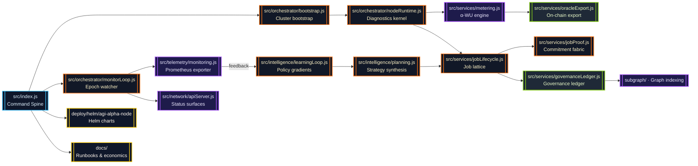
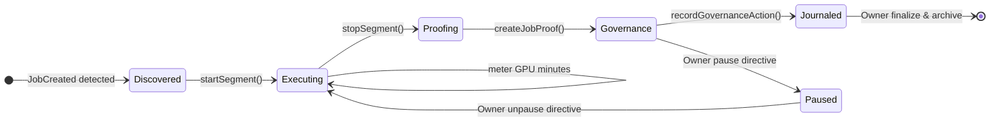
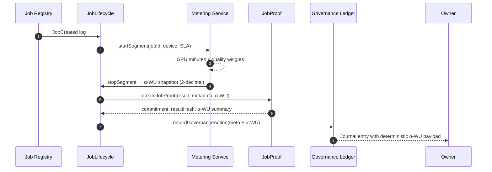
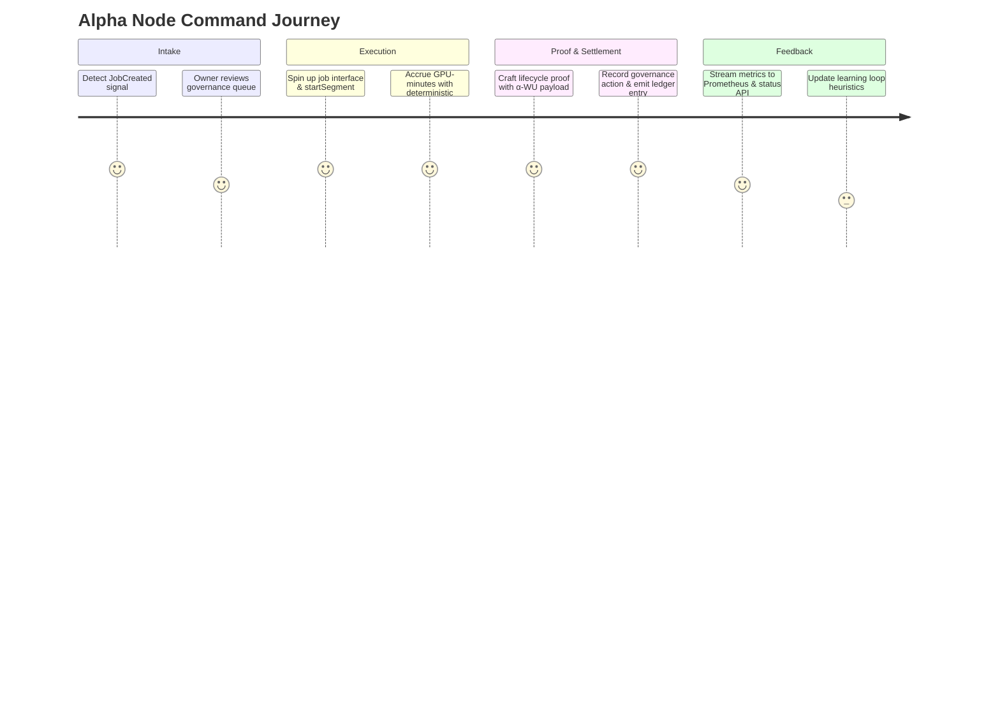
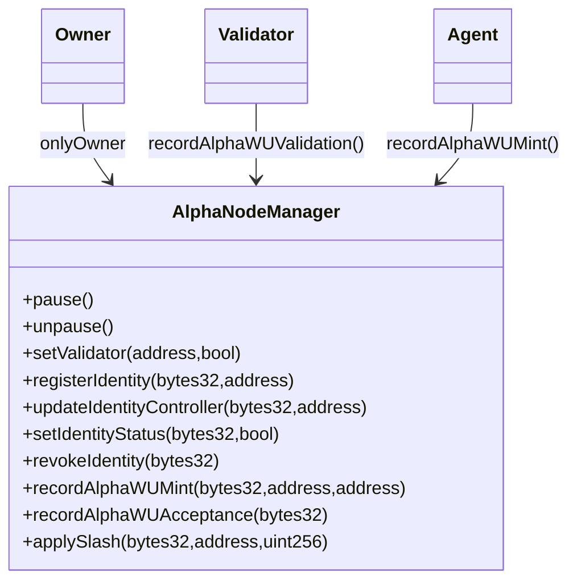
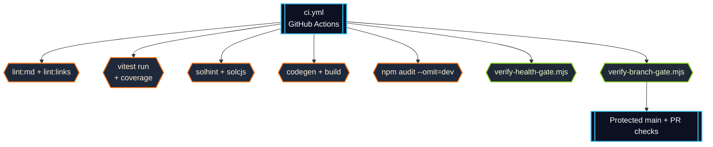

# AGI Alpha Node v0 · Sovereign Cognition Forge ⚡

<!-- markdownlint-disable MD013 MD033 -->
<p align="center">
  <picture>
    <source srcset="1.alpha.node.agi.eth.svg" type="image/svg+xml" />
    
  </picture>
</p>

<p align="center">
  <a href="https://github.com/MontrealAI/AGI-Alpha-Node-v0/actions/workflows/ci.yml">
    
  </a>
  
  
  
  
  
  
  <a href="Dockerfile"></a>
  <a href="deploy/helm/agi-alpha-node"></a>
  <a href="https://etherscan.io/address/0xa61a3b3a130a9c20768eebf97e21515a6046a1fa"></a>
  
  <a href="LICENSE"></a>
</p>

> Operate this lattice and you drive the engine that captures cognitive alpha in real time—owner-directed, battle-tested, and ready for immediate deployment by a non-technical operator. This is the cognition core built to seize the kind of economic gravity usually reserved for world-shifting machines.

---

## Contents

1. [Mission Profile](#mission-profile)
2. [Cognition Mesh Architecture](#cognition-mesh-architecture)
3. [Alpha Work Unit Fabric](#alpha-work-unit-fabric)
4. [Epoch Intelligence & Determinism](#epoch-intelligence--determinism)
5. [Operations & Governance Command](#operations--governance-command)
6. [Telemetry & Metrics](#telemetry--metrics)
7. [Token & Economic Flywheel](#token--economic-flywheel)
8. [Integration with AGI Jobs Protocol](#integration-with-agi-jobs-protocol)
9. [Operational Playbook](#operational-playbook)
10. [Quality Gates & Test Suites](#quality-gates--test-suites)
11. [CI Enforcement & Branch Protection](#ci-enforcement--branch-protection)
12. [Repository Atlas](#repository-atlas)
13. [Reference Library](#reference-library)

---

## Mission Profile

AGI Alpha Node v0 is the cognition engine that tilts the economic axis: a sovereign machine the owner can pause, redirect, or amplify in milliseconds while it manufactures alpha at planetary scale.

- **Total owner dominion** — [`contracts/AlphaNodeManager.sol`](contracts/AlphaNodeManager.sol) centralizes pausing, validator rotation, ENS reassignment, stake routing, slashing, and alpha issuance strictly behind `onlyOwner`, ensuring every dial remains under direct command.
- **Deterministic cognition fabric** — [`src/services/jobLifecycle.js`](src/services/jobLifecycle.js) synchronizes job discovery, proof generation, governance journaling, and validator notifications so no decision path diverges.
- **Provable metering** — [`src/services/metering.js`](src/services/metering.js) enforces GPU-minute normalization and 2-decimal α-WU rounding with epoch-aware splitting, giving reproducible telemetry, proofs, and governance snapshots even under multi-node swarms.
- **Owner-readable observability** — [`src/telemetry/monitoring.js`](src/telemetry/monitoring.js) and [`src/network/apiServer.js`](src/network/apiServer.js) expose Prometheus and JSON command decks that mirror the internal ledger without drift.
- **Production-locked CI** — GitHub Actions (`ci.yml`) runs lint, vitest, coverage, Solidity checks, subgraph builds, policy gates, Docker smoke tests, and branch enforcement so every merge arrives already hardened.

---

## Cognition Mesh Architecture



Every edge is deterministic: segments are normalized, proofs are replayable, and governance snapshots are serialized with stable ordering. The owner always sees the exact state the machine is operating under.

### Deterministic Lifecycle State Machine



---

## Alpha Work Unit Fabric



Highlights:

- **GPU-minute fidelity** — wall-clock duration × GPU count is rounded to 4 decimals, then multiplied by weighted quality to yield α-WU with 2-decimal determinism.
- **Weight orchestration** — model class, VRAM tier, SLA profile, and benchmark weights are all enforced in [`test/metering.test.js`](test/metering.test.js).
- **Lifecycle integration** — [`test/jobLifecycle.alphaWU.test.js`](test/jobLifecycle.alphaWU.test.js) simulates discovery → execution → submission, verifying that proofs and governance ledger entries carry the α-WU totals exactly.
- **Identifier normalization** — repeated segments for mixed-case job IDs fold into a single ledger entry with deterministic rounding, ensuring global summaries and epoch snapshots cannot drift.
- **Benchmark fallback** — unmapped device classes gracefully default to a neutral multiplier while keeping α-WU rounding fixed at two decimals, preventing unverified hardware from distorting totals.
- **Epoch splitting invariants** — [`test/metering.test.js`](test/metering.test.js) also proves multi-epoch segments split deterministically when custom epoch durations are loaded, keeping governance ledgers and telemetry aligned without manual reconciliation.

### α-WU Weight Tables

The deterministic metering engine pulls its multipliers from [`src/constants/workUnits.js`](src/constants/workUnits.js), ensuring everyone computes the same α-WU totals regardless of runtime. Weight values are locked in with object freezes so configuration drift is impossible at runtime.

| Model Class (`MODEL_CLASSES`) | Weight |
| --- | --- |
| `LLM_8B` | `1.0` |
| `LLM_70B` | `4.2` |
| `DIFFUSION_XL` | `1.8` |
| `MULTIMODAL_ROUTER` | `2.6` |
| `RESEARCH_AGENT` | `2.1` |

| VRAM Tier (`VRAM_TIERS`) | Weight |
| --- | --- |
| `TIER_16` | `1.0` |
| `TIER_24` | `1.35` |
| `TIER_48` | `1.85` |
| `TIER_80` | `2.3` |

| SLA Profile (`SLA_PROFILES`) | Weight |
| --- | --- |
| `STANDARD` | `1.0` |
| `LOW_LATENCY_ENCLAVE` | `2.0` |
| `HIGH_REDUNDANCY` | `1.7` |
| `TRUSTED_EXECUTION` | `2.4` |

| Benchmark Device (`BENCHMARK_WEIGHTS`) | Weight |
| --- | --- |
| `A100-80GB` | `1.0` |
| `H100-80GB` | `1.45` |
| `MI300X-192GB` | `1.55` |
| _Unlisted hardware_ | `1.0` fallback |

### Hyper-Operational Journey



---

## Epoch Intelligence & Determinism

The node carves time into deterministic epochs so operators can audit alpha production like a ledgered balance sheet. Epoch slicing adapts instantly when the owner overrides duration parameters, and every segment is rebalanced so totals remain exact across telemetry, proofs, and governance storage.

```mermaid
timeline
  title Epoch splitting for "epoch-split" job
  00:00 : startSegment()
  00:00 --> 10:00 : Epoch 0 · α-WU accrued = 10.00
  10:00 --> 15:00 : Epoch 1 · α-WU accrued = 5.00
  15:00 : stopSegment() → export summaries
  15:01 : governance ledger stores epoch 0 + epoch 1 totals
  15:02 : getRecentEpochSummaries(limit=1) surfaces latest epoch
```

- **Dynamic durations** — `loadConfig({ WORK_UNITS: JSON.stringify({ epochDurationSeconds: 600 }) })` immediately reconfigures the splitter so each epoch stays aligned with the operator’s cadence.
- **Deterministic splitting** — when segments span multiple epochs, the machine rebalances GPU minutes and α-WU with lossless rounding before persisting, as enforced by [`test/metering.test.js`](test/metering.test.js).
- **Auditable limiting** — [`getRecentEpochSummaries`](src/services/metering.js) respects caller-specified limits so dashboards can request “last epoch only” snapshots without manual filtering.

The result: every epoch boundary is predictable, replayable, and proof-backed—the behavior expected from the machine poised to realign markets.

---

## Operations & Governance Command

- **Contract command matrix** — [`AlphaNodeManager`](contracts/AlphaNodeManager.sol) empowers the owner to:
  - `pause` / `unpause` the entire node.
  - Manage validators via `setValidator`.
  - Reassign or revoke ENS identities (`registerIdentity`, `updateIdentityController`, `setIdentityStatus`, `revokeIdentity`).
  - Route stake (`stake`, `withdrawStake`) and handle alpha events (mint, validate, accept, slash).
- **Governance payloads** — [`src/services/governance.js`](src/services/governance.js) and [`src/services/governanceLedger.js`](src/services/governanceLedger.js) produce ABI-encoded transactions plus tamper-evident ledger entries for every governance action.
- **Owner journal** — attach the memory journal adapter to `createJobLifecycle` to retain immutable audit trails of apply/submit/finalize actions enriched with α-WU metadata.

### Owner Sovereignty Matrix

| Function | Owner Authority | Control Surface |
| --- | --- | --- |
| `pause()` / `unpause()` | Exclusive | Immediate halt/resume of lifecycle, metering, telemetry, and API ingress. |
| `setValidator(address,bool)` | Exclusive | Rotate validator set per epoch or operation window with single transaction. |
| `registerIdentity(bytes32,address)` / `updateIdentityController` / `setIdentityStatus` / `revokeIdentity` | Exclusive | Curate ENS identities for trusted agents and nodes, preserving revocation history. |
| `stake(uint256)` / `withdrawStake(address,uint256)` | Owner approves withdrawals; agents require active identity | Liquidity management of the canonical `$AGIALPHA` staking pool. |
| `recordAlphaWUMint` / `recordAlphaWUAcceptance` / `applySlash` | Owner override alongside validator rules | Direct intervention in alpha issuance, acceptance, and slashing with timestamped events. |



---

## Telemetry & Metrics

The node’s telemetry plane mirrors everything the cognition lattice does—no hidden state, no lag. Metrics, status APIs, and the governance ledger draw from the same deterministic α-WU ledger, so dashboards, alerts, and settlements stay perfectly in phase.

### α-WU Telemetry

- Prometheus gauges and counters are registered in [`src/telemetry/monitoring.js`](src/telemetry/monitoring.js), including `alpha_wu_total`, `alpha_wu_epoch`, optional `alpha_wu_per_job`, and the higher-level `agi_alpha_node_alpha_wu_*` acceptance/latency series. These are the exact metrics documented in the runbook at [`docs/alpha-wu.md`](docs/alpha-wu.md#interpreting-%CE%B1-wu-telemetry).【F:src/telemetry/monitoring.js†L173-L252】【F:docs/alpha-wu.md†L136-L169】
- `recordAlphaWorkUnitSegment` writes into those instruments as soon as a segment is sealed, so lifetime totals, per-job gauges, and epoch seeds are updated in lockstep with the ledger.【F:src/telemetry/monitoring.js†L34-L88】
- `updateAlphaWorkUnitEpochMetrics` refreshes epoch gauges after every monitor loop sweep, preserving deterministic totals across restarts and horizontal scale.【F:src/telemetry/monitoring.js†L90-L120】

### Metrics Surfaces

| Surface | Location | Key Signals |
| --- | --- | --- |
| Prometheus | [`src/telemetry/monitoring.js`](src/telemetry/monitoring.js) | `alpha_wu_total`, `alpha_wu_epoch`, `alpha_wu_per_job`, acceptance/yield gauges, health gate posture. |
| Status API `/status` | [`src/network/apiServer.js`](src/network/apiServer.js) | Node readiness, lifetime α-WU, last epoch fingerprint. |
| Status API `/status/diagnostics` | [`src/network/apiServer.js`](src/network/apiServer.js) | Sliding epoch rollups with per-job/device/SLA breakdowns and totals. |
| Governance ledger | [`src/services/governanceLedger.js`](src/services/governanceLedger.js) | Immutable JSON entries embedding α-WU metadata for every apply/submit/finalize. |
| CLI diagnostics | [`src/index.js`](src/index.js) | Commands to render payloads, monitor loops, and orchestrate telemetry resets. |

All numeric outputs are normalized via the same rounding helpers used in the metering engine, keeping α-WU at two decimals and GPU minutes at four for diff-friendly auditing.【F:src/services/metering.js†L261-L324】

### Status APIs

The HTTP control plane projects the live α-WU ledger for humans and bots alike.【F:src/network/apiServer.js†L932-L1007】

- `GET /status` → quick readiness check with lifetime α-WU and the latest epoch fingerprint.
- `GET /status/diagnostics` → rolling 24-epoch export with pre-aggregated breakdowns by job, device class, and SLA profile.
- `GET /jobs` and `GET /jobs/:id` → lifecycle overlays that show the same job payloads the metering subsystem is digesting.

Dashboards, alerting rules, or downstream oracles can rely on these surfaces without additional normalization—the data is already ledger-accurate.

---

## Token & Economic Flywheel

- **Token** — `$AGIALPHA` (18 decimals) is anchored at [`0xa61a3b3a130a9c20768eebf97e21515a6046a1fa`](https://etherscan.io/address/0xa61a3b3a130a9c20768eebf97e21515a6046a1fa).
- **Flywheel** — more jobs generate more α-WU → demand for staking increases → rewards deepen → additional agents join → network accelerates toward civilization-scale efficiency.
- **Swarm alignment** — metering and lifecycle tests validate that α-WU proofs, governance ledger entries, and telemetry remain consistent; there is no informational drift between compute, chain, and owner dashboards.

---

## Integration with AGI Jobs Protocol

The runtime was built to plug directly into the AGI Jobs Protocol surfaces, keeping every lifecycle event, governance action, and α-WU ledger entry synchronized.

- [`src/services/jobLifecycle.js`](src/services/jobLifecycle.js) subscribes to on-chain `JobCreated`/`JobFinalized` signals, normalizes payloads, and emits high-fidelity events that both the orchestrator and governance subsystems consume.【F:src/services/jobLifecycle.js†L1-L200】
- [`bindExecutionLoopMetering`](src/orchestrator/nodeRuntime.js) latches onto lifecycle updates so metering segments start and stop exactly when the protocol reports execution windows, guaranteeing that α-WU reflects canonical job timing.【F:src/orchestrator/nodeRuntime.js†L414-L470】
- [`src/services/governanceLedger.js`](src/services/governanceLedger.js) and [`src/network/apiServer.js`](src/network/apiServer.js) expose the same job records to operators, validators, and downstream automation, ensuring off-chain actors always read protocol-aligned state.【F:src/services/governanceLedger.js†L1-L200】【F:src/network/apiServer.js†L932-L1007】
- [`docs/alpha-wu.md`](docs/alpha-wu.md) documents the α-WU computation rules so protocol-side auditors and partner nodes can independently derive the same totals before settling rewards.【F:docs/alpha-wu.md†L1-L213】

### α-WU Settlements

When epochs roll, [`buildEpochPayload`](src/services/oracleExport.js) produces deterministic JSON snapshots (`totals`, `byJob`, `byProvider`, `byDeviceClass`, `bySlaProfile`) ready for oracle submission or settlement smart contracts.【F:src/services/oracleExport.js†L1-L223】 Those exports, combined with the lifetime metrics and `/status` diagnostics, are designed to back future AGI Jobs Protocol reward curves: α-WU becomes the settlement currency, `$AGIALPHA` remains the staking collateral, and the owner exercises total control over validator rotations, pauses, and slash decisions straight from [`AlphaNodeManager.sol`](contracts/AlphaNodeManager.sol).【F:contracts/AlphaNodeManager.sol†L1-L160】

This integration path gives the protocol a provable, owner-directed metering spine—exactly the infrastructure required to anchor on-chain payouts, cross-venue accounting, and bonded enforcement.

---

## Operational Playbook

1. **Install dependencies**

   ```bash
   npm install
   ```

2. **Configure environment** — populate `.env` or export variables consumed by [`src/config/env.js`](src/config/env.js): `RPC_URL`, `NODE_LABEL`, `OPERATOR_ADDRESS`, optional metrics/telemetry toggles.

3. **Launch cognition runtime**

   ```bash
   npm start
   ```

   The CLI orchestrates bootstrap, monitor loop, telemetry export, and status API simultaneously.

4. **Monitor diagnostics** — point Prometheus/Grafana at the metrics endpoint (`METRICS_PORT`, default `9464`) and query `/status` for JSON health snapshots.

5. **Run targeted tests**

   ```bash
   npm test                          # vitest run --passWithNoTests=false
   npm test -- --run test/metering   # focus on α-WU rounding tests
   ```

6. **Full CI verification (mirrors GitHub Actions)**

   ```bash
   npm run ci:verify
   ```

   Executes lint, tests, coverage, Solidity lint/compile, subgraph codegen/build, security audit, policy checks, and branch gating. Keep this green before opening a PR.

7. **Package for deployment**
   - Docker: `docker build -t agi-alpha-node:latest .`
   - Helm: `helm install agi-alpha-node deploy/helm/agi-alpha-node`

---

## Quality Gates & Test Suites

| Test Suite | Purpose |
| --- | --- |
| [`test/metering.test.js`](test/metering.test.js) | Validates GPU-minute calculations, weight combinations across model/VRAM/SLA, deterministic α-WU rounding, and epoch splitting/summary limits under custom configurations. |
| [`test/jobLifecycle.alphaWU.test.js`](test/jobLifecycle.alphaWU.test.js) | End-to-end lifecycle simulation (discover → execute → submit → finalize) ensuring metering hooks, job proofs, and governance ledger metadata stay synchronized. |
| [`test/workUnitConstants.test.js`](test/workUnitConstants.test.js) | Confirms canonical weight tables, normalization routines, and safe math for α-WU operations. |
| [`test/governanceLedger.test.js`](test/governanceLedger.test.js) | Ensures ledger entries serialize α-WU breakdowns with deterministic ordering. |
| [`test/apiServer.test.js`](test/apiServer.test.js) | Verifies status surfaces broadcast α-WU telemetry and governance state. |
| [`test/metering.test.js`](test/metering.test.js) identifier round-trip | Proves mixed-case job IDs converge, totals stay rounded, and epoch summaries stay consistent across exports. |
| Full suite (`npm test`) | 40+ suites covering orchestrator, economics, staking, ENS, orchestration, stress harness, and intelligence tooling. |

All suites run inside `npm run ci:verify`, and CI badges only stay green when every gate passes.

### α-WU Validation Recipes

```bash
# Focus metering math and rounding invariants
npm test -- --run test/metering.test.js

# Replay full lifecycle with α-WU proof propagation
npm test -- --run test/jobLifecycle.alphaWU.test.js
```

Combine the two when triaging governance discrepancies—the first ensures the segment math is deterministic, the second confirms every proof and ledger export faithfully mirrors those totals end-to-end.

---

## CI Enforcement & Branch Protection



- **Workflow definition** — [`/.github/workflows/ci.yml`](.github/workflows/ci.yml) fans out into linting, vitest, coverage, Solidity validation, subgraph compilation, security audits, and policy gates.
- **Single command parity** — [`package.json`](package.json) exposes `npm run ci:verify`, executing the same stages locally (see [Operational Playbook](#operational-playbook)).
- **Branch protection policy** — enable “Require status checks to pass before merging” and select `ci / ci` plus `ci:verify` to enforce the lattice on every PR targeting `main`.
- **Visible proof** — the CI badge above links directly to the latest run so operators can confirm every gate is green before shipping cognition updates.

---

## Repository Atlas

| Path | Description |
| --- | --- |
| `contracts/` | Solidity control planes with owner-first governance (`AlphaNodeManager.sol`, access control, interfaces). |
| `src/services/` | Core cognition services: metering, lifecycle, governance, job proofs, alpha registry. |
| `src/orchestrator/` | Bootstrap, runtime loop, monitor loop, diagnostics kernel. |
| `src/network/` | API server and networking utilities. |
| `src/telemetry/` | Metrics export, gauges, Prometheus integration. |
| `deploy/` | Helm charts, Docker assets, deployment helpers. |
| `docs/` | Economics manifesto, runbooks, subgraph instructions. |
| `subgraph/` | Graph Protocol manifest and schema for on-chain indexing. |
| `test/` | Vitest suites spanning unit, integration, economics, governance, metering, orchestration, and stress tests. |

---

## Reference Library

- [`docs/README.md`](docs/README.md) — extended overview and operator guides.
- [`docs/economics.md`](docs/economics.md) — tokenomics and reward curves.
- [`docs/manifesto.md`](docs/manifesto.md) — strategic narrative and governance principles.
- [`docs/subgraph-deployment.md`](docs/subgraph-deployment.md) — deploying the subgraph to The Graph.

Own the node, run the lattice, harvest alpha.
