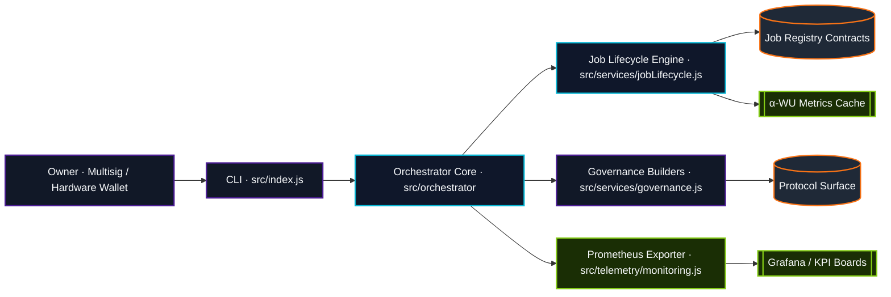
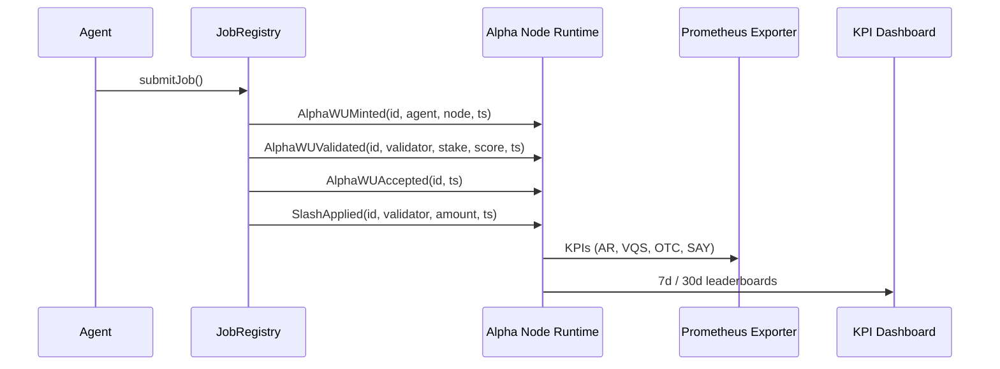
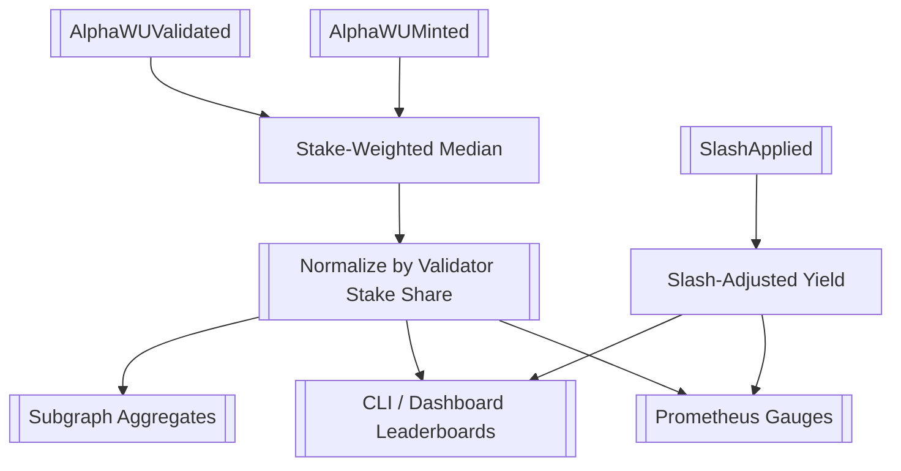
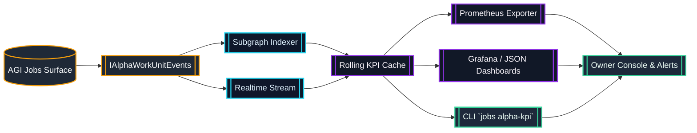
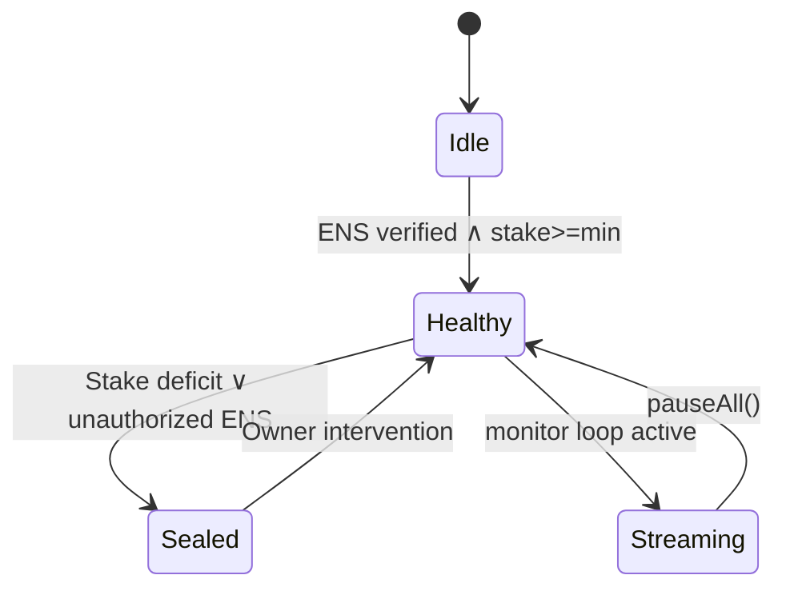

# AGI Alpha Node v0 · Sovereign Cognition Spine ⚡

<!-- markdownlint-disable MD013 MD033 -->
<p align="center">
  <picture>
    <source srcset="1.alpha.node.agi.eth.svg" type="image/svg+xml" />
    
  </picture>
</p>

<p align="center">
  <a href="https://github.com/MontrealAI/AGI-Alpha-Node-v0/actions/workflows/ci.yml">
    
  </a>
  
  
  
  
  
  <a href="Dockerfile">
    
  </a>
  <a href="deploy/helm/agi-alpha-node">
    
  </a>
  <a href="https://app.ens.domains/name/alpha.node.agi.eth">
    
  </a>
  <a href="https://etherscan.io/token/0xa61a3b3a130a9c20768eebf97e21515a6046a1fa">
    
  </a>
  <a href="LICENSE">
    
  </a>
</p>

> The control plane that composes validator-weighted α‑work units, enforces ENS sovereignty, streams on-chain telemetry, and keeps the owner in absolute command.

---

## Table of Contents

1. [Constellation](#constellation)
2. [Alpha-WU Telemetry Fabric](#alpha-wu-telemetry-fabric)
3. [Governance Dominance](#governance-dominance)
4. [Identity & Health Gate](#identity--health-gate)
5. [Operational Flight Plan](#operational-flight-plan)
6. [CI & Quality Lattice](#ci--quality-lattice)
7. [Repository Atlas](#repository-atlas)
8. [Telemetry Blueprints](#telemetry-blueprints)
9. [Deployment & Observability](#deployment--observability)
10. [Token, ENS & Identity](#token-ens--identity)
11. [License](#license)

---

## Constellation

The node binds owner directives, AGI job registries, validator telemetry, and token economics into a single orchestrated spine.



The owner has deterministic access to pause/resume systems, retune emissions, delegate identities, or spin validator operations through the CLI. The orchestration loop keeps Prometheus gauges, dashboards, and ENS health states aligned with stake posture.

---

## Alpha-WU Telemetry Fabric

α‑work units are minted, validated, accepted, and slashed by deterministic events. The node indexes them in real time, exposes Prometheus metrics, and can ingest historical logs for retroactive KPI generation.



| Event | Emitted By | Payload | Registry Hook |
| --- | --- | --- | --- |
| `AlphaWUMinted(id, agent, node, ts)` | Job registries | Agent & node identity | [`src/services/jobProfiles.js`](src/services/jobProfiles.js) |
| `AlphaWUValidated(id, validator, stake, score, ts)` | Validators | Stake-weighted quality | [`docs/telemetry/alpha-kpi-interface.sol`](docs/telemetry/alpha-kpi-interface.sol) |
| `AlphaWUAccepted(id, ts)` | Governance | Final acceptance timestamp | [`src/services/alphaWorkUnits.js`](src/services/alphaWorkUnits.js) |
| `SlashApplied(id, validator, amount, ts)` | Stake manager | Penalty adjustments | [`src/services/jobLifecycle.js`](src/services/jobLifecycle.js) |

### KPI Surfaces

| KPI | Formula | Gauge | Windows |
| --- | --- | --- | --- |
| **Acceptance Rate (AR)** | `accepted ÷ minted` | `agi_alpha_node_alpha_wu_acceptance_rate` | 7d · 30d · all |
| **Validator-Weighted Quality (VQS)** | median(score) × stake weight (normalized per stake share) | `agi_alpha_node_alpha_wu_quality` | 7d · 30d · all |
| **On-Time Completion (OTC)** | `p95(accepted.ts − minted.ts)` | `agi_alpha_node_alpha_wu_on_time_p95_seconds` | 7d · 30d · all |
| **Slashing-Adjusted Yield (SAY)** | `(accepted − slashes) ÷ stake` | `agi_alpha_node_alpha_wu_slash_adjusted_yield` | 7d · 30d · all |

```mermaid
quadrantChart
    title α‑WU KPI Envelope
    x-axis Latency (faster → slower)
    y-axis Yield (lower → higher)
    quadrant-1 Sovereign Prime
    quadrant-2 Guardian Vigilance
    quadrant-3 Recovery Vector
    quadrant-4 Intervention Deck
    "7d Window" : [0.35, 0.84]
    "30d Window" : [0.52, 0.91]
    "Validator Median" : [0.41, 0.87]
    "Recovery Candidate" : [0.68, 0.72]
```



The telemetry engine now divides every validator and agent contribution by its observed stake share, ensuring global and per-dimension quality scores never exceed their theoretical bounds while preserving the influence of heavyweight validators. Normalization keeps multi-validator epochs consistent even when individual validations arrive asynchronously, guaranteeing a reproducible stake-aware KPI stream across Prometheus, the CLI, and the published subgraph blueprints.



The artefacts referenced in this flow are versioned in-tree: the Solidity event interface ([`docs/telemetry/AlphaWorkUnitEvents.sol`](docs/telemetry/AlphaWorkUnitEvents.sol)), the subgraph schema ([`docs/telemetry/subgraph.schema.graphql`](docs/telemetry/subgraph.schema.graphql)), and the dashboard blueprints ([`docs/telemetry/dashboard.json`](docs/telemetry/dashboard.json) & [`docs/telemetry/alpha-work-unit-dashboard.json`](docs/telemetry/alpha-work-unit-dashboard.json)). Subgraph operators can deploy the schema as-is, while operators preferring scripts can rely on the same event model through [`src/services/alphaWorkUnits.js`](src/services/alphaWorkUnits.js) and [`src/telemetry/alphaMetrics.js`](src/telemetry/alphaMetrics.js). The CLI and Prometheus exporter consume the exact median/p95 logic, eliminating drift between automation, dashboards, and governance reports.

Multi-window dashboards expose the same gauges inside [docs/telemetry/dashboard.json](docs/telemetry/dashboard.json) for Prometheus-only installs and [docs/telemetry/alpha-work-unit-dashboard.json](docs/telemetry/alpha-work-unit-dashboard.json) when pairing Prometheus with the subgraph feed. Each blueprint ships with mirrored 7d and 30d tiles for acceptance, yield, latency, validator-weighted quality, and slash-adjusted leaderboards across agents and nodes.

### CLI KPI Extraction

```bash
# Render live α‑WU KPIs from the registry (optionally ingesting historic logs)
node src/index.js jobs alpha-kpi \
  --registry 0xRegistry \
  --rpc https://rpc.example \
  --windows 7d,30d \
  --events data/alpha-events.json
```

Each event in `data/alpha-events.json` may be encoded as either `{ "type": "minted", "id": "0x…", … }` or `{ "type": "validated", "payload": { … } }`. The command prints window rollups and per-agent/node/validator leaderboards, giving the owner an immediate view into validator-weighted performance.

---

## Governance Dominance

Every owner surface is mapped to concrete ABI methods with builder helpers that emit ready-to-sign payloads. The contract owner can retune emission, pause systems, delegate identities, and enforce registry upgrades from the CLI.

| Surface | Contract | Entrypoints | Builder Functions |
| ------- | -------- | ----------- | ----------------- |
| **Global Safeguard Relay** | `SystemPause` | `pauseAll`, `resumeAll`, `unpauseAll` | [`buildSystemPauseTx`](src/services/governance.js) |
| **Stake Governance Prism** | `StakeManager` | `setMinimumStake`, `setValidatorThreshold`, `setJobRegistry`, `setIdentityRegistry` | [`buildMinimumStakeTx`](src/services/governance.js), [`buildValidatorThresholdTx`](src/services/governance.js) |
| **Reward Distribution Matrix** | `RewardEngine` | `setRoleShare`, `setGlobalShares` | [`buildRoleShareTx`](src/services/governance.js), [`buildGlobalSharesTx`](src/services/governance.js) |
| **Emission Control Forge** | `EmissionManager` | `setEpochEmission`, `setEpochLength`, `setEmissionCap`, `setRewardRateMultiplier` | [`buildEmissionPerEpochTx`](src/services/governance.js), [`buildEmissionRateMultiplierTx`](src/services/governance.js) |
| **Node Registry Dominion** | `NodeRegistry` | `registerNode`, `setNodeStatus`, `setNodeOperator`, `setWorkMeter` | [`buildNodeRegistrationTx`](src/services/governance.js), [`buildNodeWorkMeterTx`](src/services/governance.js) |
| **Identity Delegation Vault** | `IdentityRegistry` | `setAdditionalNodeOperator` | [`buildIdentityDelegateTx`](src/services/governance.js) |
| **Platform Incentives Conductor** | `PlatformIncentives` | `setStakeManager`, `setMinimumStake`, `setHeartbeatGrace`, `setActivationFee`, `setTreasury` | [`buildIncentivesStakeManagerTx`](src/services/governance.js), [`buildIncentivesHeartbeatTx`](src/services/governance.js) |
| **Productivity Index Nexus** | `ProductivityIndex` | `recordEpoch`, `setWorkMeter`, `setTreasury`, `setEmissionManager` | [`buildProductivityRecordTx`](src/services/governance.js) |

Tests such as [`test/governance.test.js`](test/governance.test.js) and [`test/governance.integration.test.js`](test/governance.integration.test.js) prove that every command path preserves owner primacy while remaining revert-safe.

---

## Identity & Health Gate

An ENS-aware gate ensures only sanctioned subnames can toggle telemetry. Stake deficits or unauthorized ENS attempts immediately suppress KPI emissions until governance restores compliance.



- Allowlist patterns enforced: `*.agent.agi.eth`, `*.alpha.agent.agi.eth`, `*.node.agi.eth`, `*.alpha.node.agi.eth`, `*.alpha.club.agi.eth`, `*.club.agi.eth` (see [`src/services/healthGate.js`](src/services/healthGate.js)).
- CI policy guardrail: [`scripts/verify-health-gate.mjs`](scripts/verify-health-gate.mjs) runs in every workflow and fails if the allowlist drifts.
- Health state surfaces: Prometheus gauge `agi_alpha_node_health_gate_state`, REST `/metrics`, CLI `status` and `monitor` commands, plus append-only journals in [`src/services/lifecycleJournal.js`](src/services/lifecycleJournal.js).

---

## Operational Flight Plan

```bash
# Deterministic toolchain
npm ci

# Local quality gates
npm run lint
npm test
npm run coverage
npm run ci:policy

# Diagnose ENS, stake posture, and health gate
node src/index.js status \
  --label <node-label> \
  --address <0xOwner> \
  --rpc https://rpc.example \
  --stake-manager <0xStakeManager> \
  --system-pause <0xPause>

# Launch monitoring loop with Prometheus exporter
node src/index.js monitor \
  --label <node-label> \
  --address <0xOwner> \
  --rpc https://rpc.example \
  --metrics-port 9464

# Stream α‑WU KPIs from historical logs
node src/index.js jobs alpha-kpi --events snapshots/alpha-history.json
```

Job lifecycle automation (discover/apply/submit/finalize/notify) is exposed via the `jobs` namespace in [`src/index.js`](src/index.js), backed by [`src/services/jobLifecycle.js`](src/services/jobLifecycle.js). Journals persist to the directory configured by `LIFECYCLE_LOG_DIR`.

Environment ingestion stays deterministic even inside noisy container hosts. The configuration schema strips unknown environment variables (proxy injections, CI toggles, shell helpers) before validation so owner commands run without ever tripping on infrastructure-provided context.

---

## CI & Quality Lattice

The workflow [`./.github/workflows/ci.yml`](.github/workflows/ci.yml) enforces deterministic hygiene on `main` and every pull request:

- **Lint Markdown & Links** → `npm run lint`
- **Unit & Integration Tests** → `npm test`
- **Coverage Report** → `npm run coverage`
- **Policy Gate** → `npm run ci:policy`
- **Docker Smoke Test** → build & inspect CLI help

Branch protection is backed by [`./.github/required-checks.json`](.github/required-checks.json), ensuring every badge remains green before merges land. Artifact uploads include coverage LCOV and Docker CLI transcripts for audit trails.

---

## Repository Atlas

| Path | Purpose |
| ---- | ------- |
| [`src/orchestrator`](src/orchestrator) | Diagnostics, monitoring loop, bootstrap logic, health gate integration |
| [`src/services`](src/services) | ENS verification, staking orchestration, governance payloads, lifecycle, telemetry services |
| [`src/network/apiServer.js`](src/network/apiServer.js) | REST orchestration surface for agents and owners |
| [`src/telemetry`](src/telemetry) | Prometheus exporter, KPI projection, metrics helpers |
| [`docs`](docs) | Economics, manifestos, telemetry schemas, deployment notes |
| [`deploy/docker`](deploy/docker) · [`deploy/helm`](deploy/helm) | Production container and Helm manifests |
| [`test`](test) | Vitest unit, integration, governance, telemetry coverage |

---

## Telemetry Blueprints

- Telemetry codex: [`docs/telemetry/README.md`](docs/telemetry/README.md)
- Solidity interface: [`docs/telemetry/alpha-kpi-interface.sol`](docs/telemetry/alpha-kpi-interface.sol)
- Event manifest: [`docs/telemetry/AlphaWorkUnitEvents.sol`](docs/telemetry/AlphaWorkUnitEvents.sol)
- Subgraph schema: [`docs/telemetry/subgraph.schema.graphql`](docs/telemetry/subgraph.schema.graphql)
- Dashboard spec: [`docs/telemetry/dashboard.json`](docs/telemetry/dashboard.json)
- Prometheus server: [`src/telemetry/monitoring.js`](src/telemetry/monitoring.js)
- Telemetry transformer: [`src/telemetry/alphaMetrics.js`](src/telemetry/alphaMetrics.js)

---

## Deployment & Observability

| Artifact | Description |
| -------- | ----------- |
| [`Dockerfile`](Dockerfile) | Multi-stage Node 20 image with baked-in healthcheck (`src/healthcheck.js`) |
| [`deploy/helm/agi-alpha-node`](deploy/helm/agi-alpha-node) | Helm chart exposing metrics port, secrets, and readiness gates |
| [`docs/deployment`](docs/deployment) | Operator guides, environment expectations, and CI promotion flows |
| Grafana | Import [`docs/telemetry/dashboard.json`](docs/telemetry/dashboard.json) for ready-made KPI panels |
| Prometheus | Scrape `:9464/metrics` to project acceptance, latency, yield, stake posture, and health states |

---

## Token, ENS & Identity

- `$AGIALPHA` token: [`0xa61a3b3a130a9c20768eebf97e21515a6046a1fa`](https://etherscan.io/token/0xa61a3b3a130a9c20768eebf97e21515a6046a1fa) (18 decimals)
- ENS guardianship: parent domains `node.agi.eth`, `alpha.node.agi.eth`, `agent.agi.eth`
- Identity verification pipeline: [`src/services/ensVerifier.js`](src/services/ensVerifier.js), [`src/orchestrator/nodeRuntime.js`](src/orchestrator/nodeRuntime.js)
- Health gate allowlist config: [`src/config/schema.js`](src/config/schema.js)

---

## License

This project is licensed under the [MIT License](LICENSE).
