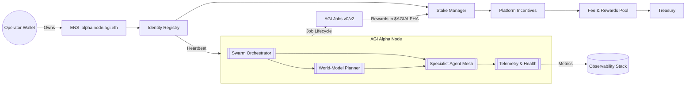
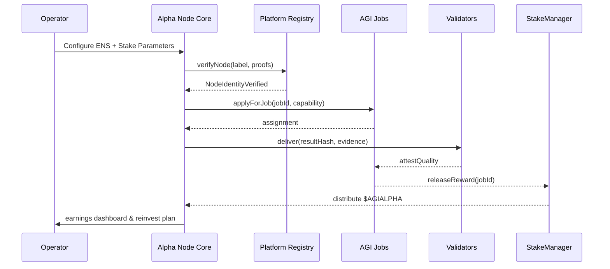

# AGI Alpha Node v0 – Sovereign Labor Intelligence

<!-- markdownlint-disable MD013 -->
<!-- markdownlint-disable MD033 -->
<p align="center">
  
</p>

<p align="center">
  <a href="https://github.com/MontrealAI/AGI-Alpha-Node-v0/actions/workflows/ci.yml">
    
  </a>
  <a href="LICENSE"></a>
  <a href="https://app.ens.domains/name/node.agi.eth"></a>
  <a href="https://etherscan.io/token/0xa61a3b3a130a9c20768eebf97e21515a6046a1fa"></a>
</p>
<!-- markdownlint-enable MD033 -->

---

## Table of Contents

1. [Vision](#vision)
2. [Architecture Overview](#architecture-overview)
3. [Key Capabilities](#key-capabilities)
4. [Operational Playbook](#operational-playbook)
5. [$AGIALPHA Economy](#agialpha-economy)
6. [Governance & Operator Control](#governance--operator-control)
7. [Observability & Reliability](#observability--reliability)
8. [Continuous Integration](#continuous-integration)
9. [Repository Layout](#repository-layout)
10. [Contributing](#contributing)
11. [License](#license)

---

## Vision

AGI Alpha Nodes are sovereign labor engines that relentlessly convert strategic intelligence into compounding $AGIALPHA yield. Each node is anchored to an ENS identity under `*.alpha.node.agi.eth`, armed with institution-grade governance, and orchestrates a constellation of domain-specialist agents. The present deployment – **agijobs-sovereign-labor-v0p1** – is the flagship machine powering the AGI Jobs mesh, engineered to out-learn, out-think, out-strategize, and out-execute any competitive workforce.

## Architecture Overview



### Strategic Control Loop



## Key Capabilities

- **Deterministic ENS Identity** – Only the verified owner of `<label>.alpha.node.agi.eth` may activate operations. ENS proofs and reverse resolution are checked during boot, heartbeat, and settlement.
- **$AGIALPHA Native Economics** – All deposits, rewards, and slashing events use the canonical ERC‑20 contract `0xa61a3b3a130a9c20768eebf97e21515a6046a1fa` (18 decimals). No alternate tokens or wrapped representations are accepted.
- **Stake-Weighted Reputation** – Minimum stake thresholds gate activation. Rewards scale with performance, uptime, and active stake size, encouraging disciplined capital deployment.
- **Swarm Intelligence Mesh** – The orchestrator spins up or summons specialist micro-agents (finance, biotech, governance, infrastructure) to solve compound tasks in parallel.
- **World-Model Planning** – A MuZero++ informed planner evaluates strategic branches before bidding on or executing high-stakes jobs, maximizing ROI while ensuring verifiable deliverables.
- **Antifragile Safety Shell** – Every deployment includes an adversarial stress harness, ensuring the node hardens itself after each shock and maintains sovereign resilience.

## Operational Playbook

### Prerequisites

1. **ENS Ownership** – Register `<label>.alpha.node.agi.eth` and set the resolver address to the operator wallet.
2. **Fund Wallet** – Acquire $AGIALPHA (18 decimals) and ETH for gas. Confirm balances via Etherscan or your preferred wallet.
3. **Stake Access** – Approve the Stake Manager to spend $AGIALPHA before activation.

### Activation Sequence

1. **Clone** the control plane repo:

   ```bash
   git clone https://github.com/MontrealAI/AGI-Alpha-Node-v0.git
   cd AGI-Alpha-Node-v0
   ```

2. **Bootstrap Infrastructure** (choose your path):

   - **Docker** (recommended):

     ```bash
     docker run -it --rm \
       -e ENS_LABEL="<label>" \
       -e ETH_RPC="https://mainnet.infura.io/v3/<key>" \
       -e STAKE_AMOUNT="1000" \
       ghcr.io/montrealai/agi-alpha-node:latest
     ```

   - **Kubernetes**:

     ```bash
     helm repo add agi-alpha https://montrealai.github.io/charts
     helm upgrade --install alpha-node agi-alpha/sovereign-node \
       --set ens.label=<label> \
       --set stake.amount=1000 \
       --set wallet.mnemonic="..."
     ```

3. **Verify ENS** – The startup routine halts if the provided wallet does not own the ENS subdomain. Correct ownership and rerun if necessary.
4. **Stake & Activate** – Follow the interactive prompts to call `PlatformIncentives.stakeAndActivate(amount)`.
5. **Monitor** – Access dashboards at `https://<node-host>/ops` for real-time throughput, stake ratio, and antifragility metrics.

> **Non-technical launch option:** Prebuilt installer scripts present a guided CLI with QR-enabled wallet pairing, ensuring operations can be initiated in minutes.

## $AGIALPHA Economy

- **Contract:** [`0xa61a3b3a130a9c20768eebf97e21515a6046a1fa`](https://etherscan.io/token/0xa61a3b3a130a9c20768eebf97e21515a6046a1fa)
- **Decimals:** `18`
- **Minimum Stake:** Configurable; default `1,000` $AGIALPHA per node.
- **Reward Split:** Nodes accrue ~15% of epoch rewards, adjustable by governance.
- **Auto-Reinvestment:** Profits can be routed back into the Stake Manager to amplify influence and yield.

## Governance & Operator Control

- **Owner Supremacy:** Contract owners retain full authority to pause, adjust parameters, update fee splits, rotate resolvers, and swap key addresses via guarded admin functions.
- **Emergency Brakes:** `SystemPause.pauseAll()` immediately halts stake movements, registry mutations, and new job intake.
- **Upgradeable Stack:** Smart contracts follow OpenZeppelin upgrade patterns; software artifacts observe semantic versioning with signed release manifests.
- **Compliance Hooks:** Optional KYC adapters integrate with institutional identity providers while preserving ENS-rooted sovereignty.

## Observability & Reliability

- **Telemetry:** Metrics exported via Prometheus, traces via OpenTelemetry, and structured logs streamed to SIEM endpoints.
- **Health Automation:** Docker and Helm definitions include liveness/readiness probes, automated restarts, and rolling upgrade recipes.
- **Stress Harness:** Synthetic adversarial workloads continuously probe decision policies, with outcomes feeding the antifragile learning loop.

## Continuous Integration

- **Workflow:** [`Continuous Integration`](.github/workflows/ci.yml) ensures Markdown linting and repository hygiene on every push and pull request targeting `main`.
- **Branch Protection:** Enable “Require status checks to pass before merging” in repository settings and select **Continuous Integration** to enforce a fully green pipeline on `main` and all PRs.
- **Badges:** The live status badge at the top of this README reflects the latest workflow run.

## Repository Layout

```text
├── 1.alpha.node.agi.eth.png   # Iconic crest (PNG)
├── 1.alpha.node.agi.eth.svg   # Iconic crest (SVG)
├── .github/workflows/ci.yml   # CI pipeline (Markdown lint + hygiene checks)
├── LICENSE                    # MIT License
└── README.md                  # You are here
```

## Contributing

1. Fork the repository and create a feature branch.
2. Implement changes with meticulous documentation and tests.
3. Run the CI workflow locally if possible (`markdownlint '**/*.md'`).
4. Submit a PR – ensure the **Continuous Integration** check is green and reference relevant ENS, staking, or orchestration enhancements.

## License

Distributed under the MIT License. See [`LICENSE`](LICENSE) for details.
