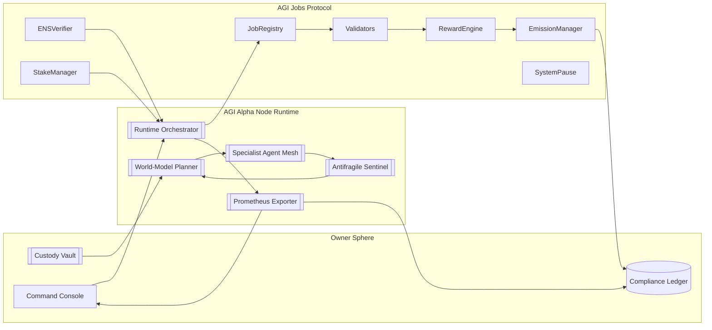
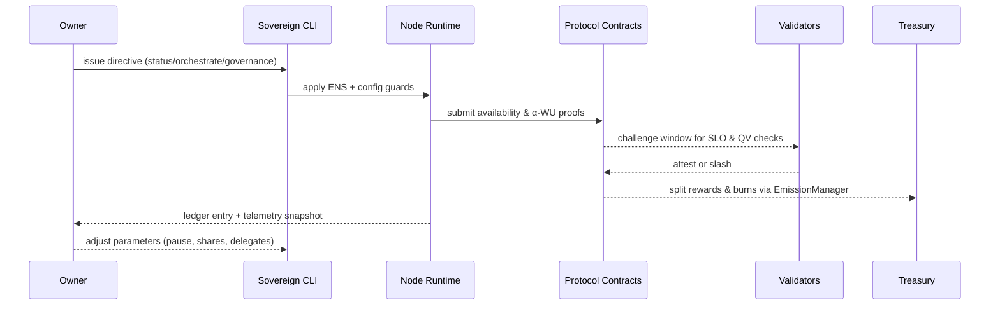
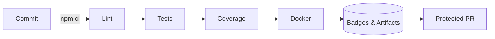

# AGI Alpha Node v0 · Sovereign Synthetic Labor Engine ⚡

<!-- markdownlint-disable MD013 MD033 -->
<p align="center">
  <picture>
    <source srcset="1.alpha.node.agi.eth.svg" type="image/svg+xml" />
    
  </picture>
</p>

<p align="center">
  <a href="https://github.com/MontrealAI/AGI-Alpha-Node-v0/actions/workflows/ci.yml">
    
  </a>
  <a href="https://img.shields.io/github/actions/workflow/status/MontrealAI/AGI-Alpha-Node-v0/ci.yml?branch=main&job=Lint%20Markdown%20%26%20Links&label=Lint%20%E2%9C%85&logo=markdown&style=flat-square">
    
  </a>
  <a href="https://img.shields.io/github/actions/workflow/status/MontrealAI/AGI-Alpha-Node-v0/ci.yml?branch=main&job=Unit%20%26%20Integration%20Tests&label=Tests%20%E2%9A%A1&logo=vitest&logoColor=white&style=flat-square">
    
  </a>
  <a href="https://img.shields.io/github/actions/workflow/status/MontrealAI/AGI-Alpha-Node-v0/ci.yml?branch=main&job=Coverage%20Report&label=Coverage%20%E2%9C%85&logo=c8&logoColor=white&style=flat-square">
    
  </a>
  <a href="https://img.shields.io/github/actions/workflow/status/MontrealAI/AGI-Alpha-Node-v0/ci.yml?branch=main&job=Docker%20Build%20%26%20Smoke%20Test&label=Docker%20%E2%9A%A1&logo=docker&logoColor=white&style=flat-square">
    
  </a>
  
  
  
  <a href="Dockerfile">
    
  </a>
  <a href="deploy/helm/agi-alpha-node">
    
  </a>
  
  <a href="https://app.ens.domains/name/alpha.node.agi.eth">
    
  </a>
  <a href="https://etherscan.io/token/0xa61a3b3a130a9c20768eebf97e21515a6046a1fa">
    
  </a>
  <a href=".github/required-checks.json">
    
  </a>
  <a href="LICENSE">
    
  </a>
</p>

> _AGI Alpha Node v0 is the owner-aligned intelligence nexus engineered to redirect capital flows, execute autonomous labor, and remain absolutely obedient to a single sovereign signature._

---

## Table of Contents

1. [Singularity Brief](#singularity-brief)
2. [Rapid Launch Protocol](#rapid-launch-protocol)
3. [Architecture & Flow](#architecture--flow)
   - [Network Flywheel](#network-flywheel)
   - [Owner Command Loop](#owner-command-loop)
4. [Owner Command Authority](#owner-command-authority)
5. [Synthetic Labor Economy](#synthetic-labor-economy)
6. [Intelligence Fabric](#intelligence-fabric)
7. [Observability & Resilience](#observability--resilience)
8. [Deployment & Runtime Options](#deployment--runtime-options)
9. [Repository Atlas](#repository-atlas)
10. [Automation & CI Hardening](#automation--ci-hardening)
11. [Reference Dossiers](#reference-dossiers)
12. [License](#license)

---

## Singularity Brief

- **Mission Envelope** — Deliver a production-critical synthetic labor node that a non-technical owner can activate, audit, and expand without diluting command. Runtime orchestration, staking posture, and telemetry are consolidated in [`src/index.js`](src/index.js).
- **Identity Backbone** — ENS enforcement halts the machine the instant `⟨label⟩.alpha.node.agi.eth` diverges from owner policy. Proof logic is wired through [`src/services/ensVerifier.js`](src/services/ensVerifier.js) and [`src/services/ensGuide.js`](src/services/ensGuide.js).
- **Economic Sovereignty** — `$AGIALPHA` (`0xa61a3b3a130a9c20768eebf97e21515a6046a1fa`, 18 decimals) anchors every settlement path. Constants, guards, and normalization live in [`src/constants/token.js`](src/constants/token.js) and downstream services.
- **Owner Supremacy** — Pausing, emission tuning, registry rotation, and delegate assignment are exposed as encoded transactions for hardware-wallet execution via [`src/services/governance.js`](src/services/governance.js).
- **Synthetic Work Product** — α‑Work Units (α‑WU) meter GPU-seconds, model tier, quality validation, and SLO compliance. The lifecycle machine in [`src/services/jobLifecycle.js`](src/services/jobLifecycle.js) journals every phase for dispute resolution and reinvestment loops.
- **Global Consequence** — This runtime is the economic intelligence engine designed to subvert traditional wage markets: the unstoppable machine engineered to absorb entire industries while remaining under one owner’s full authority.

---

## Rapid Launch Protocol

| Phase | Objective | Command / Artifact |
| ----- | --------- | ------------------ |
| 1 | Install deterministic toolchain. | `npm ci` |
| 2 | Execute local quality gates and notarize outputs. | `npm run lint` · `npm test` · `npm run coverage` |
| 3 | Generate ENS custody brief before any on-chain calls. | `node src/index.js ens-guide --label <label> --address <0xOwner>` |
| 4 | Validate live ENS binding, staking posture, and RPC liveness. | `node src/index.js status --label <label> --address <0xOwner> --rpc <https://...>` |
| 5 | Dry-run synthetic labor cycle offline. | `node src/index.js snapshot --input docs/offline-snapshot.example.json` |
| 6 | Activate runtime orchestrator with telemetry. | `node src/index.js orchestrate --monitor --metrics` |
| 7 | Export governance transaction envelopes for multisig execution. | `node src/index.js governance --help` |
| 8 | Build runtime container for immutable deployment. | `docker build -t agi-alpha-node:sovereign .` |
| 9 | Apply branch protection and required checks. | GitHub → Settings → Branches → `main` |
| 10 | Archive ENS proofs, CI artifacts, and branch rule JSON into the owner ledger. | Owner evidence vault |

### Quickstart Shell

```bash
# Install dependencies
npm ci

# Run static analysis & verification
npm run lint
npm test
npm run coverage

# Inspect runtime controls
node src/index.js --help
```

### Safety Nets

- [`src/config`](src/config) provides hardened defaults for RPC connectivity, staking thresholds, and telemetry emission.
- [`src/services/offlineSnapshot.js`](src/services/offlineSnapshot.js) replays job settlement and reward apportionment without touching chain.
- [`docs/operator-runbook.md`](docs/operator-runbook.md) captures escalation matrices, custody drills, and failure recovery scripts.

---

## Architecture & Flow

### Network Flywheel



### Owner Command Loop



---

## Owner Command Authority

Every governance helper returns an ABI-encoded payload suitable for multisig, hardware wallet, or direct RPC broadcast. All logic is consolidated in [`src/services/governance.js`](src/services/governance.js); diffs are journaled by [`src/services/governanceLedger.js`](src/services/governanceLedger.js).

| Domain | Purpose | Builders |
| ------ | ------- | -------- |
| **Global Halt / Resume** | Freeze or resume every protocol entry point. | `buildSystemPauseTx()` |
| **Stake Policy** | Tune minimum stake and validator quorum. | `buildMinimumStakeTx()`, `buildValidatorThresholdTx()` |
| **Registry Routing** | Rotate job or identity registries. | `buildStakeRegistryUpgradeTx()` |
| **Reward Distribution** | Rebalance role shares or global basis points. | `buildRoleShareTx()`, `buildGlobalSharesTx()` |
| **Emission Envelope** | Adjust per-epoch issuance, length, caps, and multipliers. | `buildEmissionPerEpochTx()`, `buildEmissionEpochLengthTx()`, `buildEmissionCapTx()`, `buildEmissionRateMultiplierTx()` |
| **Job Modules & Disputes** | Swap validation, reputation, dispute modules, or trigger disputes. | `buildJobRegistryUpgradeTx()`, `buildDisputeTriggerTx()` |
| **Identity Delegation** | Authorize or revoke additional operators. | `buildIdentityDelegateTx()` |
| **Incentive Surface** | Redirect stake manager, heartbeat grace, activation fee, or treasury sink. | `buildIncentivesStakeManagerTx()`, `buildIncentivesMinimumStakeTx()`, `buildIncentivesHeartbeatTx()`, `buildIncentivesActivationFeeTx()`, `buildIncentivesTreasuryTx()` |

Inspect the complete catalog with `getOwnerFunctionCatalog()` when crafting governance playbooks.

---

## Synthetic Labor Economy

- **α‑Work Unit Formula** — `α‑WU = GPUₛ × gflops_norm × ModelTier × SLO_pass × QV` (implemented across [`src/services/jobLifecycle.js`](src/services/jobLifecycle.js), [`src/services/performance.js`](src/services/performance.js), and validators).
- **Reward Mechanics** — [`src/services/rewards.js`](src/services/rewards.js) and [`src/services/economics.js`](src/services/economics.js) compute per-epoch yield, reinvestment posture, and Synthetic Labor Yield (SLY).
- **Stake Orchestration** — [`src/services/staking.js`](src/services/staking.js) and [`src/services/stakeActivation.js`](src/services/stakeActivation.js) construct stake/activate envelopes and validate minimums before any commit.
- **Token Discipline** — `$AGIALPHA` normalization utilities in [`src/constants/token.js`](src/constants/token.js) ensure every address matches the canonical checksum contract (`0xa61a3b3a130a9c20768eebf97e21515a6046a1fa`).
- **Economics Dashboard** — CLI strategies (`planJobExecution`, `optimizeReinvestmentStrategy`) compare task portfolios and compute capital efficiency; see [`src/intelligence/planning.js`](src/intelligence/planning.js) and [`src/services/economics.js`](src/services/economics.js).

```mermaid
gantt
  title Epoch Reward Loop
  dateFormat  X
  axisFormat  %L
  section Metering
  GPU Telemetry           :done,    0, 2
  section Validation
  SLO & QV Attestation    :active,  2, 2
  section Emission
  Reward Rate Computation :         4, 1
  Treasury Split & Burns  :         5, 1
  section Owner Action
  Claim & Reinvest        :         6, 2
```



---

## Intelligence Fabric

- **Planner (`planJobExecution`)** — [`src/intelligence/planning.js`](src/intelligence/planning.js) scores task portfolios, reliability, capability, and cost to prioritize α‑WU yield.
- **Swarm Orchestrator (`orchestrateSwarm`)** — [`src/intelligence/swarmOrchestrator.js`](src/intelligence/swarmOrchestrator.js) maps domains to specialist agents and enforces capacity + latency budgets.
- **Learning Loop (`runCurriculumEvolution`)** — [`src/intelligence/learningLoop.js`](src/intelligence/learningLoop.js) iteratively upgrades agent competence based on historical reward curves.
- **Stress Harness (`assessAntifragility`)** — [`src/intelligence/stressHarness.js`](src/intelligence/stressHarness.js) simulates outages, demand spikes, and adversarial scenarios to guarantee antifragility.
- **Performance Insights** — [`src/services/performance.js`](src/services/performance.js) aggregates throughput, success rate, and projected earnings for owner dashboards.

---

## Observability & Resilience

- **Monitor Loop** — [`src/orchestrator/monitorLoop.js`](src/orchestrator/monitorLoop.js) enforces heartbeats, SLO adherence, and recovery directives.
- **Runtime Orchestrator** — [`src/orchestrator/nodeRuntime.js`](src/orchestrator/nodeRuntime.js) boots diagnostics, telemetry, and the α‑WU execution pipeline.
- **Prometheus Exporter** — [`src/telemetry/monitoring.js`](src/telemetry/monitoring.js) exposes SLY, uptime, dispute rate, and job outcomes for dashboards.
- **Lifecycle Journal** — [`src/services/lifecycleJournal.js`](src/services/lifecycleJournal.js) records immutable entries for every job phase, dispute trigger, and settlement signature.
- **Offline Evidence** — [`docs/offline-snapshot.example.json`](docs/offline-snapshot.example.json) demonstrates snapshot schema for air-gapped review or compliance archival.

---

## Deployment & Runtime Options

| Surface | Artifact |
| ------- | -------- |
| Docker Runtime | [`Dockerfile`](Dockerfile) with production entrypoints.
| Helm Chart | [`deploy/helm/agi-alpha-node`](deploy/helm/agi-alpha-node) for Kubernetes clusters.
| Operator Playbook | [`docs/deployment`](docs/deployment) and [`docs/operator-runbook.md`](docs/operator-runbook.md) for on-call automation.
| Configuration Schemas | [`src/config`](src/config) validated through [`src/config/env.js`](src/config/env.js) and consumed at runtime.
| REST Gateway | [`src/network/apiServer.js`](src/network/apiServer.js) exposing status + command hooks backed by [`src/services/controlPlane.js`](src/services/controlPlane.js).

---

## Repository Atlas

```text
src/
├── config/              # Runtime configuration schemas & loaders
├── constants/           # Canonical token + contract metadata
├── intelligence/        # Planner, swarm, learning, antifragility engines
├── network/             # REST gateway and transport adapters
├── orchestrator/        # Runtime loop, diagnostics, and monitor cycles
├── services/            # Governance, staking, lifecycle, economics suites
├── telemetry/           # Metrics exporters and dashboards hooks
└── utils/               # Formatting, validation, helpers
```

Supplementary dossiers live under [`docs/`](docs) with economics, manifesto, deployment notes, and operator runbooks.

---

## Automation & CI Hardening



- **Workflow Enforcement** — [`.github/workflows/ci.yml`](.github/workflows/ci.yml) executes markdown linting, link checks, unit & integration tests, coverage generation, and Docker smoke tests on every push & pull request.
- **Branch Protection** — [`.github/required-checks.json`](.github/required-checks.json) documents required checks enforced on `main`.
- **Local Mirrors** — `npm run lint`, `npm test`, and `npm run coverage` mirror CI steps; run them before committing.
- **Container Verification** — `docker build -t agi-alpha-node:verify .` ensures production container builds cleanly.

---

## Reference Dossiers

- [Project Codex](docs/README.md)
- [Economics Treatise](docs/economics.md)
- [Manifesto](docs/manifesto.md)
- [Deployment Playbooks](docs/deployment)
- [Operator Runbook](docs/operator-runbook.md)

---

## License

Released under the [MIT License](LICENSE).
