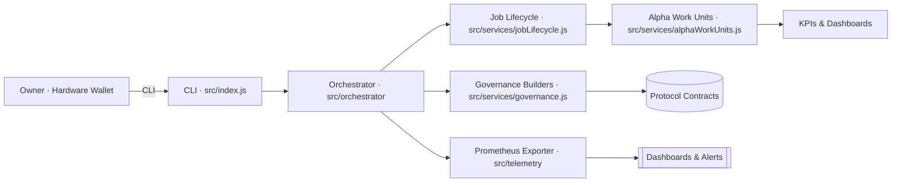
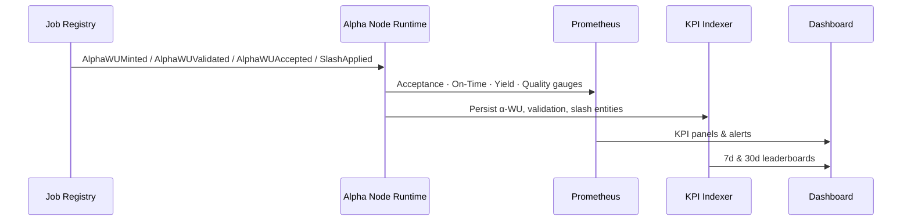
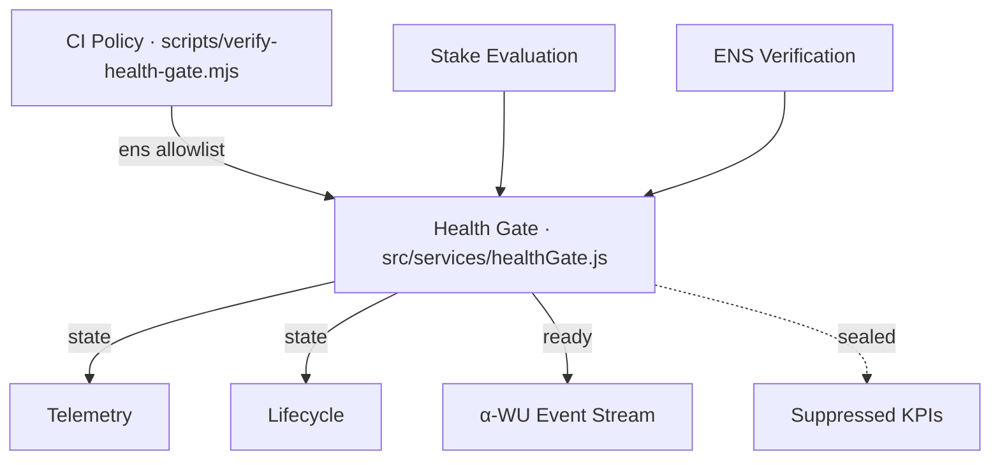

# AGI Alpha Node v0 · Cognitive Yield Reactor ⚡

<!-- markdownlint-disable MD013 MD033 -->
<p align="center">
  <picture>
    <source srcset="1.alpha.node.agi.eth.svg" type="image/svg+xml" />
    
  </picture>
</p>

<p align="center">
  <a href="https://github.com/MontrealAI/AGI-Alpha-Node-v0/actions/workflows/ci.yml">
    
  </a>
  
  
  
  
  <a href="Dockerfile">
    
  </a>
  <a href="deploy/helm/agi-alpha-node">
    
  </a>
  
  <a href="https://app.ens.domains/name/alpha.node.agi.eth">
    
  </a>
  <a href="https://etherscan.io/token/0xa61a3b3a130a9c20768eebf97e21515a6046a1fa">
    
  </a>
  <a href="LICENSE">
    
  </a>
</p>

> A sovereign control plane where every validator-weighted α‑work unit, ENS identity proof, and staking pulse bends toward owner intent.

---

## Table of Contents

1. [Superstructure](#superstructure)
2. [Alpha KPI Telemetry](#alpha-kpi-telemetry)
3. [Health Gate & ENS Authority](#health-gate--ens-authority)
4. [Owner Command Surfaces](#owner-command-surfaces)
5. [Operating Runbook](#operating-runbook)
6. [CI & Quality Mesh](#ci--quality-mesh)
7. [Repository Atlas](#repository-atlas)
8. [Deployment & Observability](#deployment--observability)
9. [Token, ENS & Identity](#token-ens--identity)
10. [License](#license)

---

## Superstructure

AGI Alpha Node v0 is the production spine for AGI labor markets: it verifies ENS guardianship, orchestrates job lifecycles, synthesizes governance payloads, and emits telemetry that quantifies economic output in real time.



---

## Alpha KPI Telemetry

α‑work units (α‑WU) are minted, validated, accepted, or slashed through deterministic event flows. The node tracks every event and exposes rolling metrics ready for on-chain verification, subgraphs, and dashboards.



| KPI | Definition | Gauge | Windows |
| --- | ---------- | ----- | ------- |
| **Acceptance Rate (AR)** | `count(accepted) / count(minted)` | `agi_alpha_node_alpha_wu_acceptance_rate` | 7d · 30d · all |
| **Validator-Weighted Quality (VQS)** | Median validator score × stake weight | `agi_alpha_node_alpha_wu_quality` | 7d · 30d · all |
| **On-Time Completion (OTC)** | p95 latency from mint → accepted | `agi_alpha_node_alpha_wu_on_time_p95_seconds` | 7d · 30d · all |
| **Slashing-Adjusted Yield (SAY)** | `(accepted − slashes) / total stake` | `agi_alpha_node_alpha_wu_slash_adjusted_yield` | 7d · 30d · all |

### Blueprints

- Solidity event surface: [`docs/telemetry/alpha-kpi-interface.sol`](docs/telemetry/alpha-kpi-interface.sol)
- Subgraph schema: [`docs/telemetry/subgraph.schema.graphql`](docs/telemetry/subgraph.schema.graphql)
- Dashboard spec: [`docs/telemetry/dashboard.json`](docs/telemetry/dashboard.json)
- Prometheus application: [`src/telemetry/monitoring.js`](src/telemetry/monitoring.js)
- KPI aggregation logic: [`src/services/alphaWorkUnits.js`](src/services/alphaWorkUnits.js), [`src/telemetry/alphaMetrics.js`](src/telemetry/alphaMetrics.js)

---

## Health Gate & ENS Authority

An ENS-aware health gate guarantees that only allowlisted subnames control production telemetry. If the node drops below staking thresholds or an untrusted ENS name attempts to assert control, KPI emissions are sealed until governance restores compliance.



- Allowlist patterns enforced: `*.agent.agi.eth`, `*.alpha.agent.agi.eth`, `*.node.agi.eth`, `*.alpha.node.agi.eth`, `*.alpha.club.agi.eth`, `*.club.agi.eth`
- Health state exported via `agi_alpha_node_health_gate_state` gauge and REST metrics (`/metrics` and API `getMetrics`).
- CI policy verifies allowlist coverage and ENS alignment: [`scripts/verify-health-gate.mjs`](scripts/verify-health-gate.mjs).
- Runtime enforcement hooks: [`src/services/healthGate.js`](src/services/healthGate.js), [`src/services/jobLifecycle.js`](src/services/jobLifecycle.js), [`src/orchestrator/monitorLoop.js`](src/orchestrator/monitorLoop.js), [`src/orchestrator/nodeRuntime.js`](src/orchestrator/nodeRuntime.js), [`src/network/apiServer.js`](src/network/apiServer.js).

---

## Owner Command Surfaces

| Surface | Contract | Entrypoints | Builder Functions |
| ------- | -------- | ----------- | ----------------- |
| **Global Safeguard Relay** | `SystemPause` | `pauseAll`, `resumeAll`, `unpauseAll` | [`buildSystemPauseTx`](src/services/governance.js) |
| **Stake Governance Prism** | `StakeManager` | `setMinimumStake`, `setValidatorThreshold`, `setIdentityRegistry` | [`buildMinimumStakeTx`](src/services/governance.js), [`buildValidatorThresholdTx`](src/services/governance.js) |
| **Reward Distribution Matrix** | `RewardEngine` | `setRoleShare`, `setGlobalShares` | [`buildRoleShareTx`](src/services/governance.js), [`buildGlobalSharesTx`](src/services/governance.js) |
| **Emission Control Forge** | `EmissionManager` | `setEpochEmission`, `setEpochLength`, `setEmissionCap`, `setRateMultiplier` | [`buildEmissionPerEpochTx`](src/services/governance.js), [`buildEmissionRateMultiplierTx`](src/services/governance.js) |
| **Node Registry Dominion** | `NodeRegistry` | `setNodeStatus`, `setNodeOperator`, `setWorkMeter` | [`buildNodeStatusTx`](src/services/governance.js), [`buildNodeWorkMeterTx`](src/services/governance.js) |
| **Identity Delegation Vault** | `IdentityRegistry` | `setAdditionalNodeOperator`, `setIdentityRegistry` | [`buildIdentityDelegateTx`](src/services/governance.js), [`buildIdentityRegistryTx`](src/services/governance.js) |
| **Platform Incentives Conductor** | `PlatformIncentives` | `setStakeManager`, `setHeartbeatGrace`, `setTreasury`, `setActivationFee` | [`buildIncentivesStakeManagerTx`](src/services/governance.js), [`buildIncentivesHeartbeatTx`](src/services/governance.js) |

Comprehensive governance coverage and owner overrides are validated in [`test/governance.test.js`](test/governance.test.js) and [`test/governance.integration.test.js`](test/governance.integration.test.js).

---

## Operating Runbook

```bash
# Install deterministic toolchain
npm ci

# Run local quality gates
npm run lint
npm test
npm run coverage

# Verify ENS custody, staking posture, and telemetry
node src/index.js status \
  --label <node-label> \
  --address <0xOwner> \
  --rpc https://rpc.example

# Launch monitor loop with Prometheus exporter
node src/index.js monitor \
  --label <node-label> \
  --address <0xOwner> \
  --rpc https://rpc.example \
  --metrics-port 9464

# Generate governance payloads (examples)
node src/index.js governance pause --system-pause <0xPause>
node src/index.js governance minimum-stake --stake-manager <0xStakeManager> --amount "100000"
```

Key commands are defined in [`src/index.js`](src/index.js). Job lifecycle utilities, including discovery, submission, and journaling, live in [`src/services/jobLifecycle.js`](src/services/jobLifecycle.js) with journal persistence in [`src/services/lifecycleJournal.js`](src/services/lifecycleJournal.js).

---

## CI & Quality Mesh

The CI workflow (`.github/workflows/ci.yml`) enforces deterministic hygiene on `main` and every pull request:

- **Lint Markdown & Links:** `npm run lint:md`, `npm run lint:links`
- **Health Gate Policy:** `npm run ci:policy` (ENS allowlist + node alignment)
- **Unit & Integration Tests:** `npm test`
- **Coverage Report:** `npm run coverage`
- **Docker Smoke Test:** `docker build`, runtime help inspection

Branch protection requires these checks; see [`.github/required-checks.json`](.github/required-checks.json) if additional enforcement is needed.

---

## Repository Atlas

| Path | Purpose |
| ---- | ------- |
| [`src/orchestrator`](src/orchestrator) | Diagnostics, monitoring loop, bootstrap logic, health gate integration |
| [`src/services`](src/services) | ENS, staking, governance, lifecycle, telemetry services |
| [`src/network/apiServer.js`](src/network/apiServer.js) | REST surface for agent orchestration and owner directives |
| [`src/telemetry`](src/telemetry) | Prometheus exporter and KPI projection |
| [`docs`](docs) | Economics, manifestos, telemetry schemas, deployment notes |
| [`deploy/docker`](deploy/docker) · [`deploy/helm`](deploy/helm) | Production deployment manifests |
| [`test`](test) | Vitest unit, integration, and governance coverage |

---

## Deployment & Observability

| Artifact | Description |
| -------- | ----------- |
| [`Dockerfile`](Dockerfile) | Multi-stage Node 20 runtime with healthcheck (`src/healthcheck.js`) |
| [`deploy/helm/agi-alpha-node`](deploy/helm/agi-alpha-node) | Helm chart with metrics port and secret wiring |
| Prometheus | Exposes gauges for stake, throughput, provider mode, registry compatibility, α‑WU KPIs, and health gate state |
| Grafana | Consume [`docs/telemetry/dashboard.json`](docs/telemetry/dashboard.json) for ready-made KPI dashboards |

---

## Token, ENS & Identity

- `$AGIALPHA` token: [`0xa61a3b3a130a9c20768eebf97e21515a6046a1fa`](https://etherscan.io/token/0xa61a3b3a130a9c20768eebf97e21515a6046a1fa) (18 decimals)
- ENS guardianship: parent domains `node.agi.eth`, `alpha.node.agi.eth`, `agent.agi.eth`
- Identity verification pipeline: [`src/services/ensVerifier.js`](src/services/ensVerifier.js), [`src/orchestrator/nodeRuntime.js`](src/orchestrator/nodeRuntime.js)
- Health gate allowlist ensures only trusted ENS subnames can activate telemetry (`HEALTH_GATE_ALLOWLIST` via [`src/config/schema.js`](src/config/schema.js))

---

## License

This project is licensed under the [MIT License](LICENSE).
