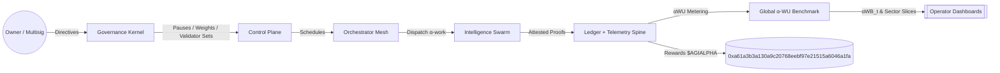

# AGI Alpha Node v0 · Cognitive Yield Engine ⚡️

<!-- markdownlint-disable MD012 MD013 MD033 -->
<p align="center">
  <picture>
    <source srcset="1.alpha.node.agi.eth.svg" type="image/svg+xml" />
    
  </picture>
</p>

<p align="center">
  <a href="https://github.com/MontrealAI/AGI-Alpha-Node-v0/actions/workflows/ci.yml?query=branch%3Amain">
    
  </a>
  <a href=".github/required-checks.json">
    
  </a>
  
  
  <a href="https://etherscan.io/address/0xa61a3b3a130a9c20768eebf97e21515a6046a1fa">
    
  </a>
  
  
  
  <a href="Dockerfile">
    
  </a>
  <a href="deploy/helm/agi-alpha-node">
    
  </a>
  
  
</p>

> **AGI Alpha Node v0** is the cognitive yield engine that metabolizes heterogeneous agentic labor into verifiable α‑Work Units (α‑WU), composes them into a treasury-backed index, and keeps every lever under the owner’s fingertips—pause, reroute, rewrite, or relaunch without redeploying.

## Table of contents

- [Why this node](#why-this-node)
- [System architecture](#system-architecture)
- [Quickstart (non-technical friendly)](#quickstart-non-technical-friendly)
- [Telemetry ingestion v0](#telemetry-ingestion-v0)
- [Synthetic labor scoring engine (SLU)](#synthetic-labor-scoring-engine-slu)
- [Provider authentication & deduplication](#provider-authentication--deduplication)
- [Data spine & migrations](#data-spine--migrations)
- [Owner controls & on-chain levers](#owner-controls--on-chain-levers)
- [CI, gates, and release discipline](#ci-gates-and-release-discipline)
- [Operations playbook](#operations-playbook)
- [Appendix: Specs & references](#appendix-specs--references)

## Why this node

- **Owner-first sovereignty**: The contract owner steers every critical parameter—pauses, validator rotation, identity lifecycle, staking thresholds, emission multipliers, treasury routing, and governance ledgers—without altering deployed code. Command surfaces live in `contracts/AlphaNodeManager.sol` and the governance helpers in `src/services/governance.js`.
- **Telemetry-ingestion hardened**: JSON Schema–verified payloads, hashed API keys, provider-aware rate-limit stubs, and idempotent task-run recording keep provider signals pristine while rejecting duplicates or malformed submissions.
- **Deterministic data spine**: SQLite migrations seed providers, task types, runs, telemetry, α‑index values, and constituent weights with indexes on provider/day for immediate dashboards and subgraph alignment.
- **Production-safe defaults**: The CLI, seeds, CI gates, Helm chart, and Docker build mirror automation paths so a non-specialist can bootstrap a production-critical node with a handful of commands.
- **Continuous alpha extraction**: Agentic swarms route jobs through provider meshes, generating synthetic labor, quality, and energy telemetry that continuously tune the `$AGIALPHA` flywheel (token: `0xa61a3b3a130a9c20768eebf97e21515a6046a1fa`, 18 decimals).

## System architecture



```mermaid
graph TD
  subgraph Ingestion[Telemetry Ingestion v0]
    APIKeys[X-API-Key (hashed)] --> Gate[Provider Resolver]
    Gate --> Validator[JSON Schema v0]
    Validator -->|TaskRunTelemetry| TaskRuns[(task_runs)]
    Validator -->|EnergyReportPayload| Energy[(energy_reports)]
    Validator -->|QualityEvalPayload| Quality[(quality_evaluations)]
    TaskRuns --> Dedup[Idempotency Guard]
  end

  subgraph Control[Owner Control Plane]
    pause[Pause / Unpause]
    rotate[Rotate Validators]
    stakeOps[Stake Withdrawals]
    identityOps[ENS Identity Lifecycle]
    weights[Index Weights]
  end

  subgraph Data[Telemetry & Data Spine]
    providers[(providers)]
    tasks[(task_types)]
    runs[(task_runs)]
    quality[(quality_evaluations)]
    energy[(energy_reports)]
    synth[(synthetic_labor_scores)]
    idx[(index_values)]
  end

  Owner[[Owner Multisig]] --> Control
  Control -->|Commands| Ingestion
  Ingestion -->|Verified signals| Data
  Data -->|αWB snapshots| Control
  Control -->|Treasury Signals| Token[$AGIALPHA 0xa61a...a1fa]
```

## Quickstart (non-technical friendly)

```bash
git clone https://github.com/MontrealAI/AGI-Alpha-Node-v0.git
cd AGI-Alpha-Node-v0
npm install
npm run db:migrate
npm run db:seed
npm start

# compute Synthetic Labor Units for today (UTC)
node src/index.js score:daily --date $(date -u +%F)
```

Register an API key for telemetry uploads:

```bash
node -e "import { initializeDatabase } from './src/persistence/database.js';
import { seedProviders, seedTaskTypes } from './src/persistence/seeds.js';
import { TelemetryIngestionService } from './src/services/telemetryIngestion.js';

const db = initializeDatabase({ filename: process.env.AGI_ALPHA_DB_PATH || ':memory:' });
seedTaskTypes(db);
seedProviders(db);

const svc = new TelemetryIngestionService({ db });
const provider = svc.providers.list()[0];
svc.registerApiKey({ providerId: provider.id, apiKey: 'YOUR_SECRET_API_KEY', label: 'ops' });
console.log('Use X-API-Key: YOUR_SECRET_API_KEY for provider', provider.name);
"
```

## Telemetry ingestion v0

- **Endpoints**: `POST /ingest/task-runs`, `POST /ingest/energy`, `POST /ingest/quality`.
- **Schemas**: AJV-compiled v0 definitions live in `spec/task_run_telemetry.schema.json`, `spec/energy_report.schema.json`, and `spec/quality_eval.schema.json` (all require `schema_version: "v0"`).
- **Structured errors**: Invalid submissions respond with a machine-readable `{ error, details[] }` envelope; missing references respond with 404; idempotent collisions respond with 409 and a related task-run id.
- **Versioning & provenance**: Every stored record carries `schema_version`, metadata (notes, task label, request fingerprint), and a payload hash for auditability.
- **Rate-limit stub**: Per-provider windows are tracked and surfaced via `X-RateLimit-*` headers to prepare for enforced throttling.

### Example payloads

```json
POST /ingest/task-runs
{
  "schema_version": "v0",
  "idempotency_key": "alpha-run-001",
  "task_type": "portfolio-optimizer",
  "task_label": "alpha:portfolio",
  "status": "completed",
  "timing": {
    "started_at": "2024-07-01T00:00:00Z",
    "completed_at": "2024-07-01T00:00:04Z"
  },
  "metrics": {
    "raw_throughput": 2.4,
    "tokens_processed": 9231,
    "tool_calls": 3,
    "quality_score": 0.94
  },
  "metadata": { "environment": "prod" },
  "notes": "routed via meta-agentic swarm"
}
```

```json
POST /ingest/energy
{
  "schema_version": "v0",
  "task": { "idempotency_key": "alpha-run-001" },
  "energy": {
    "kwh": 0.42,
    "energy_mix": "hydro",
    "carbon_intensity_gco2_kwh": 12,
    "cost_usd": 0.031,
    "region": "ca-central-1"
  }
}
```

```json
POST /ingest/quality
{
  "schema_version": "v0",
  "task": { "external_id": "42" },
  "quality": {
    "evaluator": "provider",
    "score": 0.97,
    "notes": "meets governance acceptance threshold"
  }
}
```

## Synthetic labor scoring engine (SLU)

> Daily conversion of telemetry into **Synthetic Labor Units (SLU)** per provider, with deterministic difficulty, energy, quality, and validator consensus factors baked into the ledger.

```mermaid
flowchart TB
  subgraph Inputs[Telemetry Inputs]
    tr[Task runs
    • throughput
    • tokens
    • tool calls]
    en[Energy reports
    • kWh
    • cost_usd]
    qu[Quality evals
    • human / auto scores]
  end

  subgraph Factors[Adjustment Factors]
    diff[Difficulty
    normalized to baseline bundle]
    ea[Energy Adjustment
    cost_baseline / cost_observed]
    qa[Quality Adjustment
    winsorized scores vs baseline]
    vc[Validator Consensus
    reproducibility stub]
  end

  Inputs --> diff
  Inputs --> ea
  Inputs --> qa
  Inputs --> vc

  subgraph Synth[SLU Forge]
    sumRaw[Σ(raw_throughput × difficulty)]
    computeSLU[SLU = raw × EA × QA × VC]
  end

  diff --> sumRaw
  ea --> computeSLU
  qa --> computeSLU
  vc --> computeSLU
  sumRaw --> computeSLU
  computeSLU --> db[(synthetic_labor_scores)]
```

- **Difficulty coefficient**: blends task-type baselines with telemetry intensity (tokens_processed, tool_calls, steps) and normalizes to ~1.0 for the reference bundle.
- **Energy adjustment (EA)**: `EA = baseline_cost_per_slu / observed_cost_per_slu` with caps to prevent outliers; estimated cost derived from `energy_reports.cost_usd` or kWh × baseline price when cost is absent.
- **Quality adjustment (QA)**: winsorized quality scores (task-run quality plus gold evaluations) normalized against baseline quality (0.9) and bounded to avoid runaway boosts.
- **Validator consensus (VC)**: stubbed reproducibility rate per task type/day; defaults to `1.0` when sparse.
- **Daily job**: `node src/index.js score:daily --date 2024-05-01` persists per-provider rows with `{ raw_throughput, energy_adjustment, quality_adjustment, consensus_factor, slu, metadata }`.

## Provider authentication & deduplication

- **Auth**: `X-API-Key` or `Authorization: Bearer <api-key>`; keys are stored hashed and scoped per provider with last-used timestamps and labels.
- **Idempotency**: `idempotency_key` on `TaskRunTelemetry` is mandatory; duplicates are rejected with payload-hash verification to detect collisions.
- **Task resolution**: Energy and quality payloads resolve task runs by `idempotency_key` or `external_id`; missing runs yield a 404 with a structured message.
- **Suspicious patterns**: Collisions and malformed payloads are logged for operator review.

## Data spine & migrations

- **Schema**: Core tables (`providers`, `task_types`, `task_runs`, `energy_reports`, `quality_evaluations`, synthetic labor metrics, index values) live in SQLite with index coverage for provider + day queries.
- **Migrations**: `npm run db:migrate` applies migration files; `npm run db:seed` hydrates baseline providers, task archetypes, and telemetry exemplars.
- **Subgraph alignment**: `scripts/render-subgraph-manifest.mjs` keeps `subgraph/` manifests synchronized with runtime schemas for downstream indexing.

## Owner controls & on-chain levers

- **AlphaNodeManager**: Owner-exclusive functions cover pauses, minimum stake, validator threshold/rotation, work meter windows, emission multipliers, treasury routes, dispute triggers, and job registry upgrades.
- **Governance payload builder**: `/governance` endpoints and `src/services/governance.js` craft calldata with dry-run previews, ledger recording, and signature fields for multisig submission.
- **Health gates**: `scripts/verify-health-gate.mjs` enforces operational readiness; `scripts/verify-branch-gate.mjs` blocks unsafe branches.
- **Attestation & identity**: ENS identity hydration, attestation verification (`scripts/attestation-verify.ts`), and NameWrapper-aware ENS metadata keep node identity aligned with chain state.

## CI, gates, and release discipline

- **Workflow coverage**: CI runs linting, link checks, tests, coverage (`c8 + vitest`), Solidity lint/compile, subgraph TypeScript build, Docker smoke test, security audit, and badge publication (`.github/workflows/ci.yml`).
- **Required on PR & main**: All checks are enforced via `.github/required-checks.json`; PRs must satisfy every gate before merge.
- **Badges**: CI status, schema version, coverage stack, token address, runtime, Solidity version, Docker readiness, Helm chart path, data spine, and owner-control guarantees are surfaced above for instant posture visibility.

## Operations playbook

- **Run locally**: `npm start` boots the API + orchestration server; `npm run demo:local` launches the local cluster simulator.
- **CLI help**: `node src/index.js --help` lists governance, staking, lifecycle, and telemetry commands.
- **Observability**: OpenTelemetry exporters (`src/telemetry/otel*.ts`) emit traces; `src/telemetry/monitoring.js` exposes Prometheus metrics and health probes.
- **Docker & Helm**: `docker build -t agi-alpha-node:local .` for containerized deployment; Helm chart scaffolding lives at `deploy/helm/agi-alpha-node`.
- **Database maintenance**: `npm run db:migrate` / `npm run db:seed` keep the data spine aligned with schemas; backups are simple file copies of the SQLite database path.

## Appendix: Specs & references

- **Telemetry schemas**: `spec/task_run_telemetry.schema.json`, `spec/energy_report.schema.json`, `spec/quality_eval.schema.json` (all v0).
- **Persistence**: `src/persistence/database.js` (bootstrap), repositories in `src/persistence/repositories.js`, seeds in `src/persistence/seeds.js`.
- **Ingestion services**: `src/services/telemetryIngestion.js` (validation, auth, rate-limit stubs, deduplication, persistence).
- **Network APIs**: `src/network/apiServer.js` exposes ingestion endpoints, governance payload builders, lifecycle routes, and oracle exports.
- **Token constants**: `$AGIALPHA` checksum address & decimals defined in `src/constants/token.js`.
- **Health & gates**: Policy checks live in `scripts/verify-health-gate.mjs` and `scripts/verify-branch-gate.mjs`.

