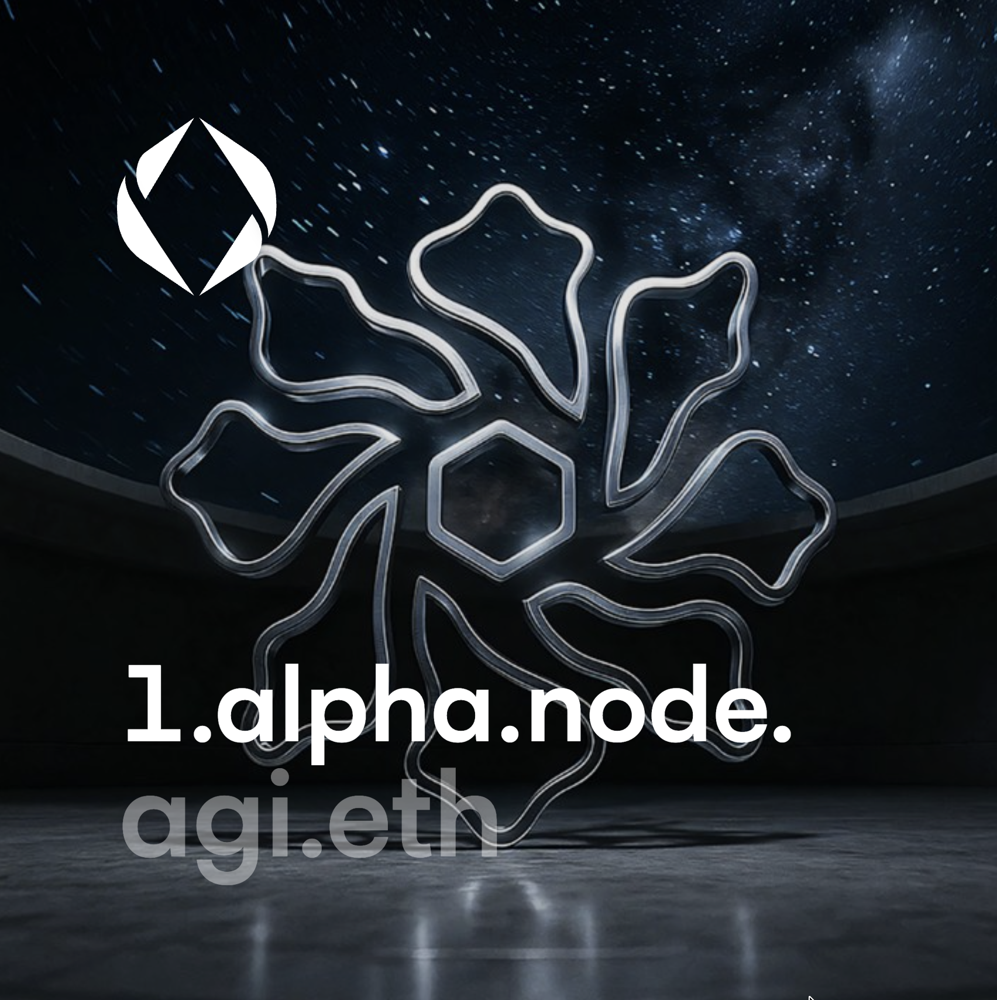
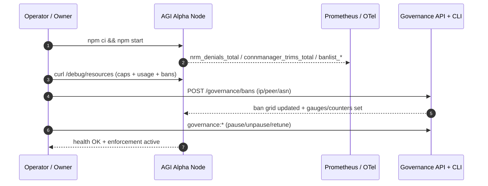

# AGI Alpha Node v0 · Cognitive Yield Engine ⚡️
<!-- markdownlint-disable MD012 MD013 MD033 -->
<p align="center">
  <picture>
    <source srcset="1.alpha.node.agi.eth.svg" type="image/svg+xml" />
    
  </picture>
</p>

<p align="center">
  <a href="https://github.com/MontrealAI/AGI-Alpha-Node-v0/actions/workflows/ci.yml?query=branch%3Amain">
    
  </a>
  <a href="https://github.com/MontrealAI/AGI-Alpha-Node-v0/actions/workflows/ci.yml?query=branch%3Amain">
    
  </a>
  <a href=".github/required-checks.json">
    
  </a>
  
  
  
  <a href="https://etherscan.io/address/0xa61a3b3a130a9c20768eebf97e21515a6046a1fa">
    
  </a>
  
  <a href="LICENSE">
    
  </a>
  
  
  <a href="Dockerfile">
    
  </a>
  <a href="deploy/helm/agi-alpha-node">
    
  </a>
  
  
</p>

**AGI Alpha Node v0** metabolizes heterogeneous agentic labor into verifiable α‑Work Units (α‑WU) and Synthetic Labor Units (SLU), rebalances the Global Synthetic Labor Index (GSLI), exposes audited read‑only REST telemetry, and routes the `$AGIALPHA` treasury (token: `0xa61a3b3a130a9c20768eebf97e21515a6046a1fa`, 18 decimals) under complete owner command. Every dial can be paused, rerouted, or retuned without redeploying, delivering a production-grade intelligence core built to bend markets.

## Why operators deploy this node

- **Owner-first controls**: Pause/unpause, rotate validators, retune emissions, and update metadata through `AlphaNodeManager.sol` without redeploying the network substrate.【F:contracts/AlphaNodeManager.sol†L1-L120】
- **Hard DoS guardrails**: The Network Resource Manager (NRM) rejects every overage with structured logs, `nrm_denials_total{limit_type,protocol}` increments, and live `denials.byLimitType` + `denials.byProtocol` breakdowns; ban grid counters and gauges make denials auditable in real time.【F:src/network/resourceManagerConfig.js†L248-L305】【F:src/telemetry/networkMetrics.js†L24-L76】
- **Debuggable capacity**: `GET /debug/resources` exposes global caps, per-protocol ceilings (GossipSub/identify/bitswap/agi/*), per-IP/ASN ceilings, bans, and live utilization so operators never spelunk code to understand pressure.【F:src/network/resourceManagerConfig.js†L485-L626】【F:src/network/apiServer.js†L1230-L1244】
- **Watermarks + bans as metrics**: Connection Manager trims emit `connmanager_trims_total{reason}`; ban mutations raise gauges/counters for IP/peer/ASN entries to keep governance controls transparent.【F:src/network/resourceManagerConfig.js†L641-L694】【F:src/network/apiServer.js†L1681-L1769】
- **Green by default**: `.github/workflows/ci.yml` mirrors `npm run ci:verify` and is enforced via `.github/required-checks.json`, keeping PRs and `main` permanently green with visible badges.【F:.github/workflows/ci.yml†L1-L210】【F:.github/required-checks.json†L1-L9】

## System map

```mermaid
flowchart TD
  classDef neon fill:#0b1120,stroke:#22c55e,stroke-width:2px,color:#e2e8f0;
  classDef lava fill:#0b1120,stroke:#f97316,stroke-width:2px,color:#ffedd5;
  classDef frost fill:#0b1120,stroke:#0ea5e9,stroke-width:2px,color:#e0f2fe;

  subgraph Owner[Owner / Operator Deck]
    CLI[node src/index.js\n(governance:*)]:::lava
    REST[/REST & Governance API/]:::lava
    Dashboard[React/Vite cockpit]:::lava
  end

  subgraph Runtime[Node Runtime]
    P2P[GossipSub v1.1 + libp2p host]:::neon
    Jobs[α‑Work Unit Engine]:::neon
    GSLI[Global Synthetic Labor Index]:::neon
    Metrics[Prometheus + OTel]:::frost
    Storage[SQLite spine + migrations]:::frost
  end

  subgraph Safety[Guards & Gates]
    NRM[Network Resource Manager\nper-protocol/IP/ASN caps]:::frost
    ConnMgr[Connection Manager\nwatermarks + trims]:::frost
    Bans[Ban grid\nIP · Peer · ASN]:::lava
    Scoring[Peer scoring + DoS bans]:::neon
  end

  CLI --> REST
  Dashboard --> REST
  REST --> Runtime
  Runtime --> Metrics
  P2P --> Runtime
  Jobs --> GSLI
  NRM --> Runtime
  ConnMgr --> NRM
  Bans --> NRM
  Scoring --> P2P
  Metrics --> Dashboard
  class Owner,Runtime,Safety,CLI,REST,Dashboard,P2P,Jobs,GSLI,Metrics,Storage,NRM,ConnMgr,Bans,Scoring neon;
```

## Resource manager & DoS telemetry (Sprint E3)

- **Tag every denial**: All NRM reject paths produce structured logs with limit type, protocol, peer, IP/ASN context, and bump `nrm_denials_total{limit_type,protocol}` while accumulating `denials.byLimitType` and `denials.byProtocol` so dashboards can slice by cause instantly. Per-protocol stream caps surface as `limit_type="per_protocol"`, keeping stream floods distinguishable from global stream ceilings.【F:src/network/resourceManagerConfig.js†L248-L305】【F:src/telemetry/networkMetrics.js†L44-L61】
- **Per-protocol clarity**: The NRM snapshot always includes GossipSub/identify/bitswap/agi protocol caps and usage, even when zero, making `/debug/resources` copy/paste friendly for runbooks and dashboards.【F:src/network/resourceManagerConfig.js†L485-L626】【F:test/network/resourceManagerConfig.test.js†L76-L128】
- **Usage + pressure grid**: `metrics()` surfaces global/ per-protocol/ per-IP/ per-ASN usage with utilization, per-limit-type denial tallies, and dialer plans so operators see pressure before drops occur.【F:src/network/resourceManagerConfig.js†L485-L626】
- **Connection trims + bans as metrics**: Peer trims increment `connmanager_trims_total{reason}`; ban additions/removals update `banlist_entries` gauges and `banlist_changes_total{type,action}` counters for IP/peer/ASN governance surfaces.【F:src/network/resourceManagerConfig.js†L641-L694】【F:src/network/apiServer.js†L1681-L1769】

```bash
curl -s localhost:3000/debug/resources | jq '{limits, usage, bans}'
# Shows global caps, per-protocol ceilings (GossipSub/identify/bitswap/agi/*),
# per-IP/ASN limits, ban grid, and live utilization/pressure telemetry.
```

**Debug snapshot payload (shape):**

```jsonc
{
  "limits": {
    "global": { "connections": 1024, "streams": 8192, "memoryBytes": 536870912, "fileDescriptors": 2048, "bandwidthBps": 67108864 },
    "perProtocol": {
      "/meshsub/1.1.0": { "connections": 60, "streams": 600 },
      "agi/control/1.0.0": { "connections": 24, "streams": 240 }
    },
    "ipLimiter": {
      "maxConnsPerIp": 64,
      "maxConnsPerAsn": 256,
      "bans": { "ips": ["203.0.113.7"], "peers": ["12D3KooXbad"], "asns": ["asn-fraud"] }
    },
    "perPeer": {
      "12D3KooXowner": { "maxStreams": 128 }
    }
  },
  "usage": {
    "global": { "connections": { "used": 120, "limit": 1024 }, "streams": { "used": 800, "limit": 8192 } },
    "perProtocol": {
      "/meshsub/1.1.0": {
        "connections": { "used": 16, "limit": 60 },
        "streams": { "used": 144, "limit": 600 }
      },
      "agi/control/1.0.0": {
        "connections": { "used": 6, "limit": 24 },
        "streams": { "used": 36, "limit": 240 }
      }
    },
    "perIp": { "busiest": { "203.0.113.7": 7 }, "limit": 64 },
    "perAsn": { "busiest": { "asn-fraud": 12 }, "limit": 256 }
  },
  "connectionManager": { "lowWater": 512, "highWater": 1024, "gracePeriodSeconds": 120 },
  "bans": { "ips": ["203.0.113.7"], "peers": ["12D3KooXbad"], "asns": ["asn-fraud"] }
}
```

The snapshot is designed for dashboards: limits and usage are already normalized into grids, while ban grids double as governance audit trails. No spelunking, no missing labels—every denial is pre-tagged with `protocol` + `limit_type` and tallied under both `denials.byLimitType` and `denials.byProtocol` for fast Grafana slices.

```mermaid
flowchart LR
  classDef neon fill:#0b1120,stroke:#22c55e,stroke-width:2px,color:#e2e8f0;
  classDef lava fill:#0b1120,stroke:#f97316,stroke-width:2px,color:#ffedd5;
  classDef frost fill:#0b1120,stroke:#0ea5e9,stroke-width:2px,color:#e0f2fe;

  Requests[Conn/Stream requests]:::neon --> Caps[Global + per-protocol caps\n(conns/streams/memory/fd/bw)]:::frost
  Caps --> Deny[Structured denial log\n+nrm_denials_total]:::lava
  Caps --> Allow[Admitted paths]:::neon
  Deny --> Metrics[Prometheus: nrm_denials_total\nconnmanager_trims_total\nbanlist_*]:::frost
  Allow --> Usage[limits + usage grids\npressure + dial plan]:::neon
  Metrics --> Debug[/GET /debug/resources/]:::lava
  Owner[Owner token / governance:*]:::lava --> Bans[/POST/DELETE /governance/bans/]:::lava
  Bans --> Metrics
```

## OTel + Prometheus observability (Sprint E4)

- **Centralized wiring:** `configureOpenTelemetry` and `loadTelemetryConfig` normalize `OTEL_SERVICE_NAME`, OTLP headers, and endpoints into a single tracer resource while `startMonitoringServer` always keeps the Prometheus registry and `/metrics` online.【F:src/telemetry/monitoring.js†L1-L52】【F:src/telemetry/config.js†L31-L57】【F:src/telemetry/monitoring.js†L280-L363】
- **OTLP on demand:** Set `OTEL_EXPORTER_OTLP_ENDPOINT` (plus optional `OTEL_EXPORTER_OTLP_HEADERS` or `OTEL_TRACES_SAMPLER=traceidratio:<0-1>`) to stream traces; leave it unset to run fully locally without interrupting metrics exposure or shutdown flows.【F:src/telemetry/otelCore.js†L37-L82】【F:src/telemetry/config.js†L31-L57】
- **REST spans + propagation:** Every REST/gov/health call is wrapped with an `http.server` span that captures method, route, status, latency, and keeps the trace context active for request metadata and downstream services.【F:src/network/apiServer.js†L1187-L1510】
- **Dial traces:** Each outbound libp2p dial emits a `net.dial` span with `peer.id`, `net.transport`, `net.peer.addr`, success, and latency while linking back to any active HTTP span for seamless cross-surface stitching.【F:src/network/libp2pHostConfig.js†L64-L164】
- **Prometheus-first:** `/metrics` stays Prometheus-native (peer scoring, α‑WU, NRM, bans) while traces route to OTLP; CI lint/link checks keep mermaid diagrams rendering cleanly on GitHub Pages.【F:src/telemetry/monitoring.js†L291-L363】【F:package.json†L12-L46】

| Env var | Purpose | Default |
| --- | --- | --- |
| `OTEL_SERVICE_NAME` | Trace resource name for every span | `agi-alpha-node` |
| `OTEL_EXPORTER_OTLP_ENDPOINT` | Enable OTLP/HTTP trace export when set | _unset_ |
| `OTEL_EXPORTER_OTLP_HEADERS` | Extra OTLP headers (e.g., auth) in `key=value` CSV | _unset_ |
| `OTEL_TRACES_SAMPLER` | Optional `traceidratio:<0-1>` sampler ratio | _unset_ (parent-based) |

```mermaid
flowchart TD
  classDef neon fill:#0b1120,stroke:#22c55e,stroke-width:2px,color:#e2e8f0;
  classDef lava fill:#0b1120,stroke:#f97316,stroke-width:2px,color:#ffedd5;
  classDef frost fill:#0b1120,stroke:#0ea5e9,stroke-width:2px,color:#e0f2fe;

  subgraph API[REST + Governance Surface]
    Health[/GET /health(z)/]:::lava
    Metrics[/GET /metrics/]:::frost
    Gov[Governance + Bans]:::lava
    Telemetry[Telemetry ingest]:::lava
  end

  subgraph OTel[Telemetry Core]
    Tracer[Tracer\nservice.name=agi-alpha-node]:::neon
    Export[OTLP HTTP exporter]:::frost
    Prom[Prom-client registry]:::frost
  end

  subgraph Network[libp2p + Dialer]
    Dials[net.dial spans\npeer.id + transport + latency]:::neon
    NRM[Resource caps + bans]:::frost
  end

  API -->|context propagation| Tracer
  Tracer --> Export
  Tracer --> Dials
  API --> Prom
  Dials --> Prom
  Prom --> Metrics
  Export --> Jaeger[(Jaeger/Tempo)]:::frost
  Export --> Grafana[(Grafana/Exemplars)]:::frost
  NRM --> Metrics
  class API,Tracer,Export,Prom,Network,Dials,NRM,Metrics,Health,Gov,Telemetry neon;
```

## Owner controls & token

- `$AGIALPHA` token: `0xa61a3b3a130a9c20768eebf97e21515a6046a1fa` (18 decimals). The owner retains absolute veto, pause, and retuning authority across runtime and emissions.
- `AlphaNodeManager.sol` consolidates pause/unpause, validator rotation, metadata refresh, treasury withdrawal, and reward tuning under a single owner-controlled contract.【F:contracts/AlphaNodeManager.sol†L1-L120】
- Governance verbs are exposed via CLI (`node src/index.js governance:*`) and authenticated REST endpoints so non-technical operators can steer without redeploying.【F:src/index.js†L1-L113】【F:src/network/apiServer.js†L1448-L1769】

## API surfaces (operator quick reference)

| Endpoint | Purpose |
| --- | --- |
| `GET /health` / `GET /healthz` | Liveness/readiness probes. |
| `GET /debug/resources` | Limits + usage grid, bans, and NRM snapshot (per-protocol/IP/ASN).【F:src/network/apiServer.js†L1230-L1244】 |
| `POST/DELETE /governance/bans` | Add or remove IP/peer/ASN bans (owner token required); updates gauges/counters automatically.【F:src/network/apiServer.js†L1739-L1775】 |
| `GET /debug/peerscore` | GossipSub v1.1 peer score summaries for mesh tuning. |
| `GET /metrics` | Prometheus/OTel surface for network, peer scoring, SLU, and index gauges. |

## Run it locally (mirrors CI gates)

```bash
npm ci
npm run ci:verify   # lint, tests, coverage, solidity, subgraph, audit, policy, branch gate
npm start           # launches REST + metrics + governance surfaces with SQLite migrations
```

Additional entry points: `npm run p2p:simulate` (1k+ virtual peers), `npm run dashboard:dev` (React/Vite cockpit), and `npm run p2p:load-tests` (abuse harness: connection floods, stream floods, malformed gossip).【F:package.json†L10-L58】【F:scripts/p2p-simulator.mjs†L1-L118】

### Operations playbook (zero-drama launch)

1. **Install & hydrate**: `npm ci && npm run db:migrate && npm run db:seed` to prime the SQLite spine and dashboards.
2. **Boot**: `npm start` (or `npm run dashboard:preview` for the cockpit) to expose `/health`, `/metrics`, `/debug/resources`, and governance surfaces on port 3000.
3. **Observe**: `curl -s localhost:3000/metrics | head` to confirm NRM/ban/trim counters are live; `curl -s localhost:3000/debug/resources` to confirm per-protocol ceilings and bans load.
4. **Govern**: Use authenticated `POST/DELETE /governance/bans` or `node src/index.js governance:*` to pause/unpause, rotate validators, or retune emissions without redeploying.
5. **Harden**: Enforce branch protection with `.github/required-checks.json` and mirror CI locally via `npm run ci:verify` before opening PRs.



### Deployment pathways (prod-grade switches)

- **Docker**: `docker build -t agi-alpha-node:latest .` then `docker run --rm -p 3000:3000 agi-alpha-node:latest --help` to validate binaries before promotion.【F:Dockerfile†L1-L28】
- **Helm**: `helm upgrade --install agi-alpha-node deploy/helm/agi-alpha-node -f deploy/helm/agi-alpha-node/values.yaml` to roll out the runtime with PR-enforced checks and metrics already wired.【F:deploy/helm/agi-alpha-node/values.yaml†L1-L153】
- **Bare metal**: `npm ci && npm start` with `NRM_*` and `CONN_*` env vars tuned for your topology; `/debug/resources` remains stable across all deployment modes.【F:src/network/apiServer.js†L1187-L1244】

```mermaid
flowchart LR
  classDef neon fill:#0b1120,stroke:#22c55e,stroke-width:2px,color:#e2e8f0;
  classDef lava fill:#0b1120,stroke:#f97316,stroke-width:2px,color:#ffedd5;
  classDef frost fill:#0b1120,stroke:#0ea5e9,stroke-width:2px,color:#e0f2fe;

  Source[Main branch\nPR-protected]:::lava --> CI[CI pipeline\n(all gates)]:::frost
  CI --> Image[Docker image\nbuilt from Dockerfile]:::neon
  CI --> Chart[Helm chart\nvalues.yaml overrides]:::frost
  Image --> Cluster[Kubernetes \nagi-alpha-node release]:::lava
  Chart --> Cluster
  Cluster --> Telemetry[Prometheus/OTel\n/metrics & /debug/resources]:::neon
  Cluster --> GovernanceAPI[Owner commands\n/governance/*]:::lava
  Telemetry --> Operator[Operator cockpit\nDashboards + CLI]:::frost
  GovernanceAPI --> Operator
```

## CI & branch protection (always green)

- **Workflow fidelity**: The CI pipeline runs lint → unit/integration/frontend tests → coverage → Solidity lint/compile → subgraph TS build → `npm audit` → policy + branch gates. The same steps are wired into `npm run ci:verify` for local parity.【F:.github/workflows/ci.yml†L1-L210】【F:package.json†L29-L46】
- **Enforcement**: `.github/required-checks.json` lists the gates GitHub enforces on PRs and `main`, keeping every merge auditable and green.【F:.github/required-checks.json†L1-L9】

```mermaid
flowchart LR
  classDef neon fill:#0b1120,stroke:#22c55e,stroke-width:2px,color:#e2e8f0;
  classDef lava fill:#0b1120,stroke:#f97316,stroke-width:2px,color:#ffedd5;

  Local[npm run ci:verify]:::lava --> Lint[Lint Markdown & Links]:::neon
  Local --> Tests[Unit/Integration/Frontend Tests]:::neon
  Local --> Coverage[Coverage Report (c8)]:::neon
  Local --> Solidity[Solidity Lint & Compile]:::neon
  Local --> Subgraph[Subgraph TS Build]:::neon
  Local --> Security[npm audit (high+)]:::neon
  Local --> Policy[Policy + Branch gates]:::neon
  Lint & Tests & Coverage & Solidity & Subgraph & Security & Policy --> Badge[Branch protection + badges]:::lava
```

| Gate | What it proves |
| --- | --- |
| `lint` | Markdown, links, and Solidity styles align with repository standards. |
| `test` / `test:frontend` | All service, protocol, and dashboard behaviors are deterministic under Vitest. |
| `coverage` | `c8` enforces full coverage on the Vitest graph (badge mirrors `main`). |
| `lint:sol` / `test:sol` | Smart contracts compile cleanly with solhint hygiene. |
| `ci:ts` | Subgraph manifest generation + typegen + WASM build succeed. |
| `ci:security` | `npm audit --audit-level=high` keeps dependencies hardened (owner may upgrade at will). |
| `ci:policy` / `ci:branch` | Governance allowlists and branch naming stay within guardrails. |

## Dashboard & monitoring

- React/Vite dashboard lives in `dashboard/` with tests in `dashboard/src/App.test.jsx`; previews via `npm run dashboard:preview` align with the REST debug surfaces.
- Prometheus collectors cover transport reachability (`net_reachability_state`, AutoNAT probes/failures), dial success/failure/latency, churn gauges, peer scoring buckets, and the new NRM/ban/trim counters so observability stays unified.【F:src/telemetry/networkMetrics.js†L1-L169】【F:src/telemetry/monitoring.js†L280-L363】

## Data spine & economics

- SQLite storage with migrations underpins α‑WU, SLU, and GSLI calculations; synthetic labor scoring and index rebalancing remain operator-auditable through the REST API and metrics surfaces.【F:src/persistence/cli.js†L1-L118】【F:test/syntheticLaborEngine.test.js†L1-L86】
- Run `npm run db:migrate && npm run db:seed` to hydrate local development environments before load-testing or dashboard previews.【F:package.json†L55-L56】

AGI Alpha Nodes are the catalysts of this cognitive economy: each instance is a programmable farm that continuously harvests `$AGIALPHA` yield while the owner retains absolute veto, pause, and retuning authority.
