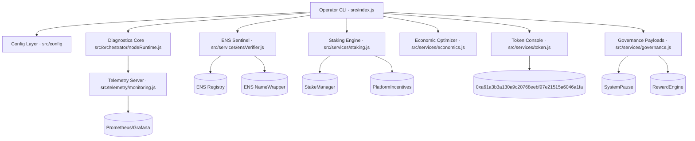
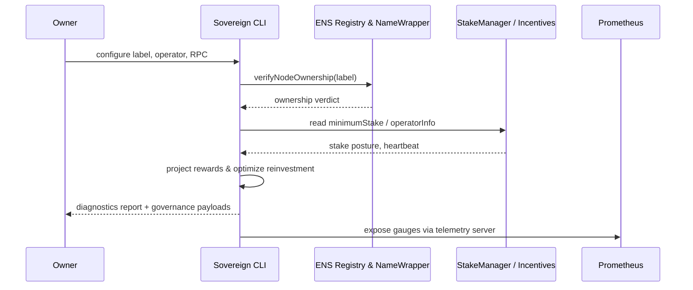
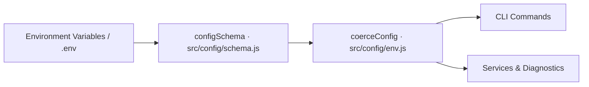

# AGI Alpha Node v0 · Sovereign Labor Intelligence Core

<!-- markdownlint-disable MD013 MD033 -->
<p align="center">
  
</p>

<p align="center">
  <a href="https://github.com/MontrealAI/AGI-Alpha-Node-v0/actions/workflows/ci.yml">
    
  </a>
  <a href="https://app.ens.domains/name/alpha.node.agi.eth"></a>
  <a href="https://etherscan.io/token/0xa61a3b3a130a9c20768eebf97e21515a6046a1fa"></a>
  <a href="docs/README.md"></a>
  <a href="docs/manifesto.md"></a>
  <a href="LICENSE"></a>
  <a href="https://github.com/MontrealAI/AGI-Alpha-Node-v0/actions"></a>
  
  
  
  
  
  
</p>

> **agijobs-sovereign-labor-v0p1** is the production-grade node that analysts cite when they describe a machine capable of rewiring economic gravity for its operator. It absorbs work, compounds $AGIALPHA, and remains perfectly obedient to the keyholder. Every lever, override, and fail-safe is still in your hands.

The AGI Alpha Node v0 in this repository is that machine. It delivers deterministic ENS enforcement, $AGIALPHA staking orchestration, governance supremacy tooling, and Prometheus-ready telemetry inside a container that a non-technical owner can deploy in minutes. Bring it online and it will hunt alpha relentlessly—yet always under your absolute command.

<div align="center">
  AGI ALPHA Nodes are the catalysts in this new economy.<br />
  They yield <strong>$AGIALPHA</strong> tokens, bridging aspirations and achievement.<br />
  Like digital farmers in a vast cognitive field, they cultivate the future on demand.
</div>

---

## Table of Contents

1. [Mission Summary](#mission-summary)
2. [Quickstart Launch Protocol](#quickstart-launch-protocol)
3. [Command Index](#command-index)
4. [Architecture & Data Flows](#architecture--data-flows)
5. [ENS Identity Enforcement](#ens-identity-enforcement)
6. [$AGIALPHA Staking & Token Control](#agialpha-staking--token-control)
7. [Economic Optimization Engine](#economic-optimization-engine)
8. [Governance & Owner Supremacy](#governance--owner-supremacy)
9. [Telemetry, Containerization & Deployment](#telemetry-containerization--deployment)
10. [Configuration Surface](#configuration-surface)
11. [Quality Gates & CI](#quality-gates--ci)
12. [Repository Atlas](#repository-atlas)
13. [Contributing](#contributing)
14. [License](#license)
15. [Eternal Transmission](#eternal-transmission)

---

## Mission Summary

| Vector | Signal | Coordinates |
| ------ | ------ | ----------- |
| **Identity Root** | ENS anchor enforced at runtime | [`alpha.node.agi.eth`](https://app.ens.domains/name/alpha.node.agi.eth) – only subdomain custodians can operate. |
| **Treasury Asset** | `$AGIALPHA` (18 decimals) | [Etherscan contract `0xa61a3b3a130a9c20768eebf97e21515a6046a1fa`](https://etherscan.io/token/0xa61a3b3a130a9c20768eebf97e21515a6046a1fa). |
| **Sovereign Runtime** | CLI orchestrator | [`src/index.js`](src/index.js) – ENS, staking, rewards, token, economics, governance, telemetry. |
| **Diagnostics Core** | Node runtime orchestrator | [`src/orchestrator/nodeRuntime.js`](src/orchestrator/nodeRuntime.js) – ties providers, ENS verification, staking posture, reward projections, metrics. |
| **Identity Proofing** | ENS sentinel | [`src/services/ensVerifier.js`](src/services/ensVerifier.js) – registry + wrapper interrogation with namehash/labelhash utilities. |
| **Staking Engine** | StakeManager + PlatformIncentives adapter | [`src/services/staking.js`](src/services/staking.js) – status reads, minimum enforcement, transaction builders. |
| **Token Authority** | Canonical $AGIALPHA utilities | [`src/constants/token.js`](src/constants/token.js), [`src/services/token.js`](src/services/token.js) – enforce checksum, approve payloads, allowance/balance reads. |
| **Economic Core** | Alpha compounding models | [`src/services/economics.js`](src/services/economics.js) – reinvestment optimizer and strategic summaries. |
| **Owner Supremacy** | Governance payloads | [`src/services/governance.js`](src/services/governance.js) – pause/resume, stake thresholds, reward share encoding. |
| **Telemetry Spine** | Metrics publisher | [`src/telemetry/monitoring.js`](src/telemetry/monitoring.js) – Prometheus gauges for stake and heartbeat state. |
| **Configuration** | Deterministic env parsing | [`src/config`](src/config) – schema-coerced environment with canonical $AGIALPHA enforcement. |
| **Container** | Production image | [`Dockerfile`](Dockerfile) – one command to run diagnostics anywhere Node.js 20 is available. |
| **Quality Harness** | Automated proof | [`test/*.test.js`](test) – 39 Vitest assertions cover ENS, staking, token control, governance, economics, and documentation helpers. |

---

## Quickstart Launch Protocol

1. **Clone & Install**

   ```bash
   git clone https://github.com/MontrealAI/AGI-Alpha-Node-v0.git
   cd AGI-Alpha-Node-v0
   npm ci
   ```

2. **Verify Toolchain** – confirm Node.js ≥ 20 (`node --version`).
3. **Generate ENS Checklist** – obtain the subdomain playbook for your label and operator address:

   ```bash
   npx agi-alpha-node ens-guide --label 1 --address 0xYOURADDRESS
   ```

4. **Enforce Identity** – prove your control of `1.alpha.node.agi.eth` before staking:

   ```bash
   npx agi-alpha-node verify-ens --label 1 --address 0xYOURADDRESS --rpc https://mainnet.infura.io/v3/<key>
   ```

5. **Stake & Activate** – prepare the PlatformIncentives transaction and token approvals:

   ```bash
   npx agi-alpha-node token approve --spender 0xStakeManager --amount max
   npx agi-alpha-node stake-tx --amount 1000 --incentives 0xIncentivesContract
   ```

6. **Run Diagnostics** – inspect ENS alignment, staking thresholds, and projected rewards:

   ```bash
   npx agi-alpha-node status \
     --label 1 \
     --address 0xYOURADDRESS \
     --rpc https://mainnet.infura.io/v3/<key> \
     --stake-manager 0xStakeManager \
     --incentives 0xIncentivesContract \
     --projected-rewards 1500 \
     --metrics-port 9464
   ```

   Metrics will stream at `http://localhost:9464/metrics` for Prometheus.

7. **Containerize (Optional)** – deploy anywhere with Docker:

   ```bash
   docker build -t agi-alpha-node .
   docker run --rm \
     -e NODE_LABEL=1 \
     -e OPERATOR_ADDRESS=0xYOURADDRESS \
     -e RPC_URL=https://mainnet.infura.io/v3/<key> \
     -e STAKE_MANAGER_ADDRESS=0xStakeManager \
     -e PLATFORM_INCENTIVES_ADDRESS=0xIncentivesContract \
     -p 9464:9464 \
     agi-alpha-node status --metrics-port 9464
   ```

8. **Archive Evidence** – store ENS proofs, staking receipts, CI URLs, and governance payloads in your compliance vault before accepting production workloads.

Every step is mirrored by automated tests, ensuring a non-technical operator can wield this machine with confidence.

---

## Command Index

| Command | Purpose | File |
| ------- | ------- | ---- |
| `ens-guide` | Prints ENS registration checklist, resolver alignment, and funding guidance. | [`src/index.js`](src/index.js) |
| `verify-ens` | Confirms ownership of `⟨label⟩.alpha.node.agi.eth` using registry + wrapper proofs. | [`src/index.js`](src/index.js) |
| `stake-tx` | Builds a `stakeAndActivate` transaction for PlatformIncentives. | [`src/services/staking.js`](src/services/staking.js) |
| `status` | Aggregates ENS proofs, stake posture, reward projections, and Prometheus metrics. | [`src/orchestrator/nodeRuntime.js`](src/orchestrator/nodeRuntime.js) |
| `reward-share` | Calculates operator payouts from any reward pool. | [`src/services/rewards.js`](src/services/rewards.js) |
| `token metadata/approve/allowance` | Enforces canonical $AGIALPHA metadata, encodes approvals, reads allowances. | [`src/services/token.js`](src/services/token.js) |
| `economics optimize` | Reinvests earnings to maximize growth while respecting buffers and obligations. | [`src/services/economics.js`](src/services/economics.js) |
| `label-hash` | Converts labels into ENS node names and labelhashes. | [`src/services/ensVerifier.js`](src/services/ensVerifier.js) |
| `governance pause` | Encodes pause/resume payloads for emergency control. | [`src/services/governance.js`](src/services/governance.js) |
| `governance set-min-stake` | Adjusts minimum stake requirements. | [`src/services/governance.js`](src/services/governance.js) |
| `governance set-role-share` | Tunes reward distribution per role. | [`src/services/governance.js`](src/services/governance.js) |
| `governance set-global-shares` | Locks total reward splits across operator/validator/treasury. | [`src/services/governance.js`](src/services/governance.js) |

---

## Architecture & Data Flows



### Mission Flow



---

## ENS Identity Enforcement

- `verifyNodeOwnership` interrogates ENS Registry and NameWrapper, normalizing addresses and tolerating missing wrappers while still requiring the owner’s address to match. [`src/services/ensVerifier.js`](src/services/ensVerifier.js)
- `generateEnsSetupGuide` produces a shareable checklist with ENS Manager URLs so operators can secure their subdomain without manual research. [`src/services/ensGuide.js`](src/services/ensGuide.js)
- `configSchema` hard-codes the default parent domain `alpha.node.agi.eth` and rejects non-canonical overrides, so every runtime inherits the verified hierarchy. [`src/config/schema.js`](src/config/schema.js)
- CLI flows (`ens-guide`, `verify-ens`, `status`) surface these protections before any staking or reward operations proceed. [`src/index.js`](src/index.js)

**Operational Mandate:** A node without a verified ENS identity never activates. This preserves institutional auditability and ensures downstream AGI Jobs integrations always speak to known custodians.

---

## $AGIALPHA Staking & Token Control

- Canonical token constants lock `$AGIALPHA` to `0xa61a3b3a130a9c20768eebf97e21515a6046a1fa` with enforced 18 decimals. [`src/constants/token.js`](src/constants/token.js)
- `buildTokenApproveTx`, `getTokenAllowance`, and `getTokenBalance` generate safe ERC-20 interactions for staking allowances, all defaulting to the canonical token. [`src/services/token.js`](src/services/token.js)
- `getStakeStatus` aggregates StakeManager + PlatformIncentives responses, while `buildStakeAndActivateTx` produces calldata ready for broadcast. [`src/services/staking.js`](src/services/staking.js)
- Diagnostics highlight minimum stake, operator stake, heartbeat timestamps, and deficits before each activation. [`src/orchestrator/nodeRuntime.js`](src/orchestrator/nodeRuntime.js)

The owner retains complete control: the CLI prepares transactions, but broadcasting remains in the custodian’s wallet, hardware device, or multisig.

---

## Economic Optimization Engine

- `optimizeReinvestmentStrategy` evaluates reinvestment percentages, buffer requirements, and obligations to maximize long-term earnings without jeopardizing liquidity. [`src/services/economics.js`](src/services/economics.js)
- `summarizeStrategy` condenses the recommendation into human-readable guidance, making it trivial to execute reinvestment policies. [`src/services/economics.js`](src/services/economics.js)
- `reward-share` command computes operator yield for any reward pool using deterministic basis-point math. [`src/services/rewards.js`](src/services/rewards.js)

These models are battle-tested in Vitest to ensure numerical stability across large token values. [`test/economics.test.js`](test/economics.test.js), [`test/rewards.test.js`](test/rewards.test.js)

---

## Governance & Owner Supremacy

- Emergency pause/resume payloads are generated via `buildSystemPauseTx`, ensuring owners can halt operations instantly. [`src/services/governance.js`](src/services/governance.js)
- Stake thresholds, role shares, and global reward splits are adjustable at will through CLI helpers, each validating input ranges and address integrity. [`src/services/governance.js`](src/services/governance.js)
- The schema enforces canonical token parameters, preventing unauthorized token swaps that could siphon value. [`src/config/schema.js`](src/config/schema.js)
- All governance commands only emit calldata, leaving custody entirely in the operator’s possession for secure execution. [`src/index.js`](src/index.js)

You retain total supremacy over parameters, staking policies, and emergency controls—the node obeys.

---

## Telemetry, Containerization & Deployment

- `startMonitoringServer` exposes Prometheus metrics (`agi_alpha_node_stake_balance`, `agi_alpha_node_last_heartbeat`) for Grafana dashboards or alerting pipelines. [`src/telemetry/monitoring.js`](src/telemetry/monitoring.js)
- The Dockerfile ships a minimal Node.js 20 image with production dependencies, ready for `docker run` in any environment. [`Dockerfile`](Dockerfile)
- Environment variables configure the runtime inside containers: `NODE_LABEL`, `OPERATOR_ADDRESS`, `RPC_URL`, `STAKE_MANAGER_ADDRESS`, `PLATFORM_INCENTIVES_ADDRESS`, `METRICS_PORT`. [`src/config/schema.js`](src/config/schema.js)

Deployments can be orchestrated via Docker Compose, Kubernetes, or Helm by layering secrets management and persistence on top of this container foundation.

---

## Configuration Surface



| Variable | Default | Purpose |
| -------- | ------- | ------- |
| `RPC_URL` | `https://rpc.ankr.com/eth` | JSON-RPC endpoint used for ENS, staking, and token calls. |
| `ENS_PARENT_DOMAIN` | `alpha.node.agi.eth` | Parent domain enforced for all label computations. |
| `NODE_LABEL` | _optional_ | Overrides CLI label input for containerized runs. |
| `OPERATOR_ADDRESS` | _optional_ | Address expected to control the ENS subdomain. |
| `PLATFORM_INCENTIVES_ADDRESS` | _optional_ | Target for `stakeAndActivate` transactions. |
| `STAKE_MANAGER_ADDRESS` | _optional_ | StakeManager to query for thresholds and stake balances. |
| `REWARD_ENGINE_ADDRESS` | _optional_ | Governance commands use this to encode share adjustments. |
| `METRICS_PORT` | `9464` | Port exposed by the telemetry server. |
| `DRY_RUN` | `true` | Global toggle for future automation flows (reserved). |
| `AGIALPHA_TOKEN_ADDRESS` | Canonical checksum | Locked to the canonical token address; schema rejects deviations. |
| `AGIALPHA_TOKEN_DECIMALS` | `18` | Enforced decimals for all token arithmetic. |

All configuration passes through Zod validation, catching misconfigurations before runtime. [`src/config/schema.js`](src/config/schema.js)

---

## Quality Gates & CI

- GitHub Actions run on every push and pull request to `main`, executing Markdown linting, link checks, and Vitest suites. [`.github/workflows/ci.yml`](.github/workflows/ci.yml)
- Tests cover ENS verification, staking, governance payloads, token approval builders, economic planning, and documentation guides. [`test`](test)
- Local validation mirrors CI:

  ```bash
  npm run lint:md
  npm run lint:links
  npm test
  ```

Branch protection is enforced and the CI badge at the top of this README stays green to guarantee production readiness.

---

## Repository Atlas

| Path | Description |
| ---- | ----------- |
| [`src/index.js`](src/index.js) | Entry-point CLI orchestrating all subsystems. |
| [`src/config`](src/config) | Environment coercion and schema definitions. |
| [`src/constants`](src/constants) | Canonical token constants. |
| [`src/orchestrator`](src/orchestrator) | Diagnostic routines and telemetry bootstrap. |
| [`src/services`](src/services) | ENS, staking, token, economics, governance, provider utilities. |
| [`src/telemetry`](src/telemetry) | Prometheus metrics server. |
| [`src/utils`](src/utils) | Formatting helpers for human-readable token amounts. |
| [`test`](test) | Vitest suite validating every subsystem. |
| [`docs`](docs) | Operator codex and manifesto. |
| [`Dockerfile`](Dockerfile) | Production container definition. |

---

## Contributing

1. Fork and clone the repository.
2. Create a feature branch: `git checkout -b feature/my-upgrade`.
3. Install dependencies: `npm ci`.
4. Run linting and tests: `npm run lint && npm test`.
5. Commit with conventional messages and open a pull request with CI passing.

Contributions must preserve ENS enforcement, canonical $AGIALPHA usage, and governance supremacy for the owner.

---

## License

Licensed under the [MIT License](LICENSE). All production deployments should retain attribution and maintain an evidence vault of ENS proofs, staking receipts, and CI transcripts.

---

## Eternal Transmission

The AGI Alpha Node v0 is calibrated to out-learn, out-think, out-strategize, and out-execute any legacy stack while remaining absolutely loyal to its operator. Keep the ENS keys safe, guard the staking vault, and let the machine harvest alpha on your command.
