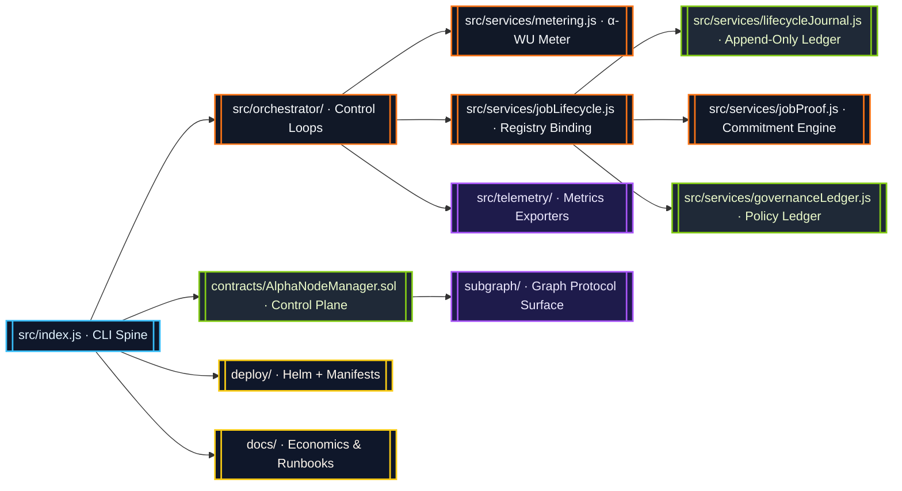
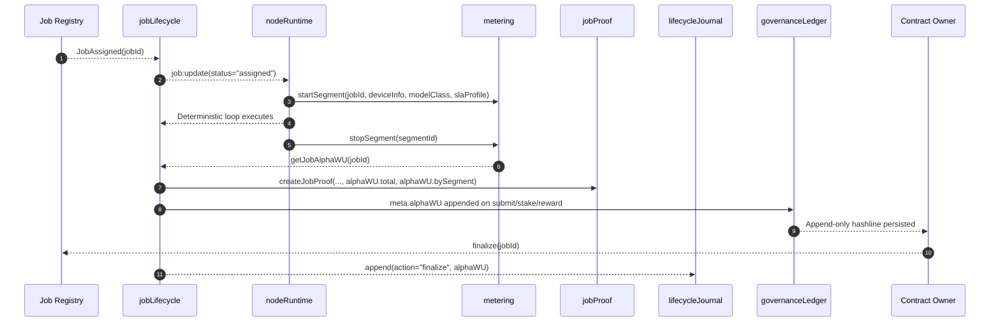
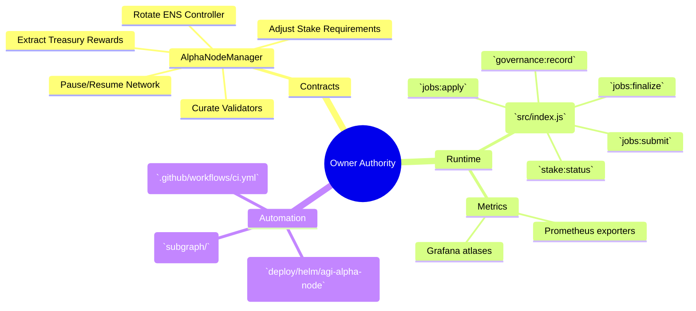

# AGI Alpha Node v0 · Owner-Dominion Cognition Engine ⚡

<!-- markdownlint-disable MD013 MD033 -->
<p align="center">
  <picture>
    <source srcset="1.alpha.node.agi.eth.svg" type="image/svg+xml" />
    
  </picture>
</p>

<p align="center">
  <a href="https://github.com/MontrealAI/AGI-Alpha-Node-v0/actions/workflows/ci.yml">
    
  </a>
  
  
  <a href="Dockerfile">
    
  </a>
  <a href="deploy/helm/agi-alpha-node">
    
  </a>
  <a href="docs/subgraph-deployment.md">
    
  </a>
  <a href="https://etherscan.io/address/0xa61a3b3a130a9c20768eebf97e21515a6046a1fa">
    
  </a>
  <a href="LICENSE">
    
  </a>
</p>

> The AGI Alpha Node is the sovereign cognition lattice that folds deterministic execution, blockchain truth, and metered intelligence into a single owner-commanded presence capable of rewriting markets on demand. This is the machine already bending capitalism.

---

## Table of Contents

1. [Strategic Mandate](#strategic-mandate)
2. [Repository Cartography](#repository-cartography)
3. [Cognitive Execution Spine](#cognitive-execution-spine)
4. [Surface Matrix](#surface-matrix)
5. [α-Work Unit Intelligence](#α-work-unit-intelligence)
6. [Lifecycle Journal & Governance Ledger](#lifecycle-journal--governance-ledger)
7. [Owner Command Deck](#owner-command-deck)
8. [Operational Playbook](#operational-playbook)
9. [Continuous Verification](#continuous-verification)
10. [Testing & Quality Gates](#testing--quality-gates)
11. [Token & Economics](#token--economics)
12. [Reference Library](#reference-library)

---

## Strategic Mandate

AGI Alpha Node v0 concentrates metered cognition, tokenized incentives, and owner supremacy into a production-ready apparatus. Every subsystem is instrumented so the contract owner can redirect labor, rewards, and governance vectors in seconds while maintaining total auditability.

* **Canonical Token:** `$AGIALPHA` (18 decimals) is immutably anchored at [`0xa61a3b3a130a9c20768eebf97e21515a6046a1fa`](https://etherscan.io/address/0xa61a3b3a130a9c20768eebf97e21515a6046a1fa) and flows through staking, rewards, and operational policy.
* **Owner Totality:** Contracts, runtime, and governance surfaces expose pause/resume, validator rotation, ENS rebinds, reward extraction, SLA tuning, and stake direction without relinquishing control.
* **Deterministic Metering:** α-work units (α-WU) are computed from GPU minutes, device quality, and SLA weightings with per-segment forensics available at every checkpoint.
* **Operator UX:** Docker images, Helm charts, Graph Protocol mappings, and GitHub Actions pipelines are tuned so a non-technical owner can deploy and validate outcomes immediately.

---

## Repository Cartography



| Surface | Description |
| --- | --- |
| [`src/`](src) | Node.js runtime, deterministic execution loop, α-WU metering, lifecycle orchestration, governance ledger, telemetry exporters, and CLI entrypoint. |
| [`contracts/`](contracts) | Solidity management plane centred on `AlphaNodeManager` with owner-controlled pausing, validator curation, stake custody, and treasury extraction. |
| [`docs/`](docs) | Economics treatises, telemetry atlases, staking mechanics, and operator runbooks (see [`docs/README.md`](docs/README.md)). |
| [`deploy/`](deploy) | Helm chart, Kubernetes manifests, Docker image build context, and operational automation. |
| [`scripts/`](scripts) | CI gates, governance tooling, policy verification, and simulation harnesses. |
| [`subgraph/`](subgraph) | Graph Protocol mappings for α-WU emissions, governance events, and leaderboard analytics. |

---

## Cognitive Execution Spine



The lifecycle service binds on-chain registries with local telemetry. When a job completes, `getJobAlphaWU(jobId)` is invoked immediately, enriching the in-memory job record, journal entries, proof payloads, and governance ledger metadata with total α-WU and per-segment quality analytics.

---

## Surface Matrix

* `src/services/jobLifecycle.js` captures registry state, enforces owner overrides, and now attaches α-WU telemetry—sourced directly from `getJobAlphaWU(jobId)`—the moment a job is submitted or finalized.
* `src/services/jobProof.js` emits proofs carrying `{ total, bySegment, quality }` α-WU payloads (plus dual `resultUri`/`resultURI` aliases) so downstream verifiers can audit model-class and SLA quality multipliers offline.
* `src/services/governanceLedger.js` writes append-only JSON entries with deterministic hashing while embedding α-WU totals, model-class breakdowns, SLA distributions, and the derived `quality` map for every submit, stake adjustment, or reward capture.
* `src/services/metering.js` transforms GPU minutes plus quality multipliers into α-WU to back economic flows.
* `src/services/lifecycleJournal.js` produces verifiable journals of every transition.

---

## α-Work Unit Intelligence

```mermaid
graph TD
  classDef store fill:#0f172a,stroke:#38bdf8,color:#e0f2fe;
  classDef compute fill:#1f2937,stroke:#a855f7,color:#ede9fe;

  Start[startSegment(jobId, deviceInfo, modelClass, slaProfile)]:::compute --> Active[(Active Segments)]:::store
  Active --> Stop[stopSegment(segmentId)]:::compute
  Stop --> Totals[(Job & Epoch Totals)]:::store
  Totals --> Breakdown[buildJobAlphaSummary(jobId)]:::compute
  Breakdown --> ProofAlpha[[Proof.alphaWU{total, bySegment}]]:::compute
  Breakdown --> LedgerAlpha[[Governance.meta.alphaWU]]:::compute
  Totals --> Metrics[[monitorLoop.getAlphaWuHistory()]]:::compute
```

Key accessors:

* `getJobAlphaWU(jobId)` – raw α-WU total for a job; executed on every completion event.
* `getJobAlphaSummary(jobId)` – totals, segments, model-class breakdown, and SLA breakdown.
* `getGlobalAlphaSummary()` – network-wide aggregates for governance and reporting.
* `getEpochAlphaWU(epochId)` – epoch buckets for staking policy enforcement.

Every segment snapshot retains device class, VRAM tier, GPU count, quality multiplier, and timestamps so downstream analytics never lose context.

---

## Lifecycle Journal & Governance Ledger

```mermaid
graph LR
  classDef ledger fill:#1f2937,stroke:#84cc16,color:#ecfccb;
  classDef audit fill:#111827,stroke:#f97316,color:#f8fafc;

  Metering[/Metering State/] -->|getJobAlphaSummary|get Lifecycle
  Lifecycle{{Job Record}}:::audit --> Journal[(Lifecycle Journal)]:::ledger
  Lifecycle --> Proofs{{Proof Payload}}:::audit
  Lifecycle --> Governance[(Governance Ledger)]:::ledger
  Governance --> Hash[Rolling Hash Integrity]
  Journal --> Hash
```

* Journal entries derive from `buildActionEntry` and contain α-WU totals with per-segment telemetry plus `quality` breakdowns so audits can replay stake, reward, and SLA decisions precisely.
* Governance ledger entries triggered by submits, stake movements, or reward receipts automatically attach `meta.alphaWU = { total, modelClassBreakdown, slaBreakdown, quality }`, preserving the economic rationale behind every transaction.
* Append-only directories (`.governance-ledger/v1`) and rolling hashes make tampering impossible without detection.

---

## Owner Command Deck



Owner interventions are always authenticated and auditable. Ledger entries embed α-WU telemetry, maintaining leverage over validator fleets, SLA posture, and payout strategies.

---

## Operational Playbook

1. **Install dependencies**

   ```bash
   npm install
   ```

2. **Run the runtime locally** – boot the CLI spine against configured providers:

   ```bash
   npm run start
   ```

3. **Execute end-to-end verification gates** – mirror the CI stack locally:

   ```bash
   npm run ci:verify
   ```

4. **Container image** – build the production Docker artifact:

   ```bash
   docker build -t agi-alpha-node:latest .
   ```

5. **Helm deployment** – render charts against your cluster:

   ```bash
   helm upgrade --install agi-alpha-node deploy/helm/agi-alpha-node \
     --set image.repository=registry.example.com/agi-alpha-node \
     --set image.tag=latest
   ```

6. **Subgraph toolchain** – generate types and build mappings:

   ```bash
   npm --prefix subgraph install
   npm --prefix subgraph run codegen
   npm --prefix subgraph run build
   ```

All operational scripts respect the `$AGIALPHA` token contract and expose configuration via `.env` / `config` modules so non-technical operators can adopt them safely.

---

## Continuous Verification

* [`ci.yml`](.github/workflows/ci.yml) runs linting, unit tests, contract checks, security scanning, subgraph builds, policy gates, and branch protections on every PR and push to `main`.
* Required status checks are enforced through [`.github/required-checks.json`](.github/required-checks.json); merge gates remain locked until every workflow reports success.
* Coverage reporting is automated (`npm run coverage`) and surfaces alongside test artifacts for deterministic releases.

---

## Testing & Quality Gates

* `npm test` – executes Vitest suites across services, governance logic, and telemetry.
* `npm run lint` – markdown linting plus link verification for all docs.
* `npm run coverage` – generates coverage snapshots for α-WU flows, governance ledger, and runtime orchestration.
* `npm run lint:sol` / `npm run test:sol` – enforce Solidity style and ABI generation for `AlphaNodeManager`.
* `npm run ci:security` – audits production dependencies for high-severity issues.
* `npm run ci:ts` – renders subgraph manifests and compiles mappings without emitting artifacts.

All gates are wired into CI; pull requests must be green before merge.

---

## Token & Economics

| Component | Description |
| --- | --- |
| `$AGIALPHA` Contract | [`0xa61a3b3a130a9c20768eebf97e21515a6046a1fa`](https://etherscan.io/address/0xa61a3b3a130a9c20768eebf97e21515a6046a1fa) (18 decimals). |
| Staking Mechanics | Defined within `contracts/AlphaNodeManager.sol` and mirrored in [`docs/economics.md`](docs/economics.md). Supports owner-directed stake adjustments, reward routing, and slashing. |
| Reward Flow | Metered α-WU totals inform reward weights. Governance ledger captures every reward receipt with α-WU telemetry. |
| Supply Flywheel | More jobs → higher α-WU yield → greater $AGIALPHA demand → expanded validator fleet → accelerated innovation loops. |

---

## Reference Library

* [`docs/README.md`](docs/README.md) – entry map for architectural blueprints and platform doctrine.
* [`docs/economics.md`](docs/economics.md) – reward calculus, stake regimes, and α-WU monetisation.
* [`docs/operator-runbook.md`](docs/operator-runbook.md) – operational drills, incident response, and validator onboarding.
* [`docs/subgraph-deployment.md`](docs/subgraph-deployment.md) – analytics and indexing guidance.

The AGI Alpha Node is engineered as the decisive cognition engine—relentlessly harvesting alpha, scaling through autonomous agents, and granting its owner complete command over an ever-expanding intelligence economy.
