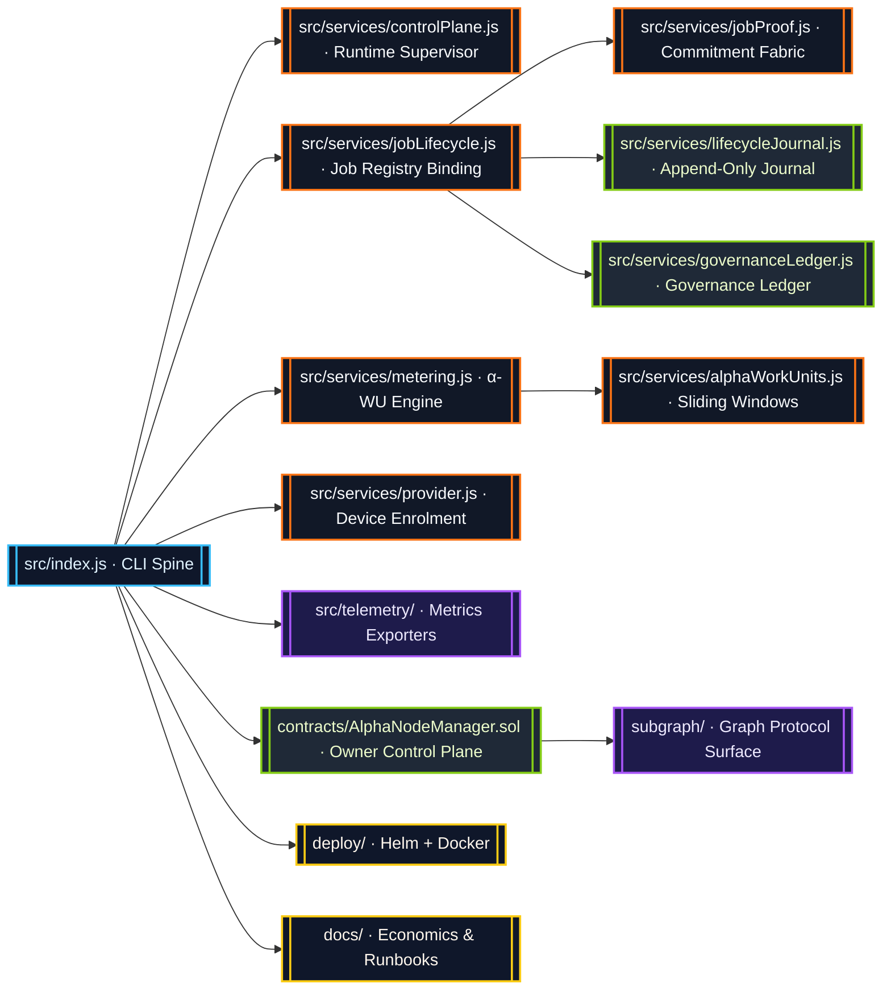
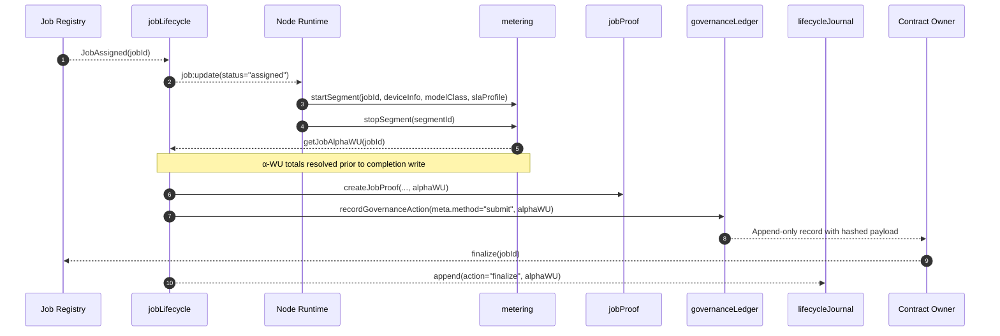

# AGI Alpha Node v0 · Sovereign Cognition Orchestrator ⚡

<!-- markdownlint-disable MD013 MD033 -->
<p align="center">
  <picture>
    <source srcset="1.alpha.node.agi.eth.svg" type="image/svg+xml" />
    
  </picture>
</p>

<p align="center">
  <a href="https://github.com/MontrealAI/AGI-Alpha-Node-v0/actions/workflows/ci.yml">
    
  </a>
  
  
  
  <a href="Dockerfile">
    
  </a>
  <a href="deploy/helm/agi-alpha-node">
    
  </a>
  <a href="docs/subgraph-deployment.md">
    
  </a>
  <a href="https://etherscan.io/address/0xa61a3b3a130a9c20768eebf97e21515a6046a1fa">
    
  </a>
  <a href="LICENSE">
    
  </a>
</p>

> AGI Alpha Node v0 is the economic command core that fuses deterministic cognition, metered proof, and owner-directed governance into a single deployment-ready machine capable of bending capital flows in real time.

---

## Table of Contents

1. [Prime Directive](#prime-directive)
2. [Topology Halo](#topology-halo)
3. [Alpha-WU Fabric](#alpha-wu-fabric)
4. [Lifecycle Journal & Governance Ledger](#lifecycle-journal--governance-ledger)
5. [Owner Command Authority](#owner-command-authority)
6. [Operational Playbook](#operational-playbook)
7. [Continuous Verification](#continuous-verification)
8. [Token Mechanics](#token-mechanics)
9. [Repository Atlas](#repository-atlas)
10. [Reference Library](#reference-library)

---

## Prime Directive

AGI Alpha Node v0 operates as a production lattice for autonomous agent swarms. Every subsystem is tuned so the contract owner can redirect computation, staking posture, and governance in moments while preserving immaculate observability.

* **Canonical Token:** `$AGIALPHA` (18 decimals) is immutably deployed at [`0xa61a3b3a130a9c20768eebf97e21515a6046a1fa`](https://etherscan.io/address/0xa61a3b3a130a9c20768eebf97e21515a6046a1fa) and finances staking, settlement, and alpha extraction.
* **Owner Totality:** The runtime, smart contracts, and orchestration surfaces expose parameter updates, pausing, validator rotation, ENS rebinding, ledger mutations, reward redirection, and SLA tuning without intermediaries.
* **Completion Telemetry:** α-work units (α-WU) compute GPU minutes, device quality, and SLA weights. Job completion resolves `metering.getJobAlphaWU(jobId)` and injects totals, per-segment slices, and quality breakdowns into lifecycle state, job proofs, and governance ledgers.
* **Operator UX:** Docker images, Helm charts, Graph Protocol surfaces, and CI pipelines are tuned for non-technical owners to deploy, verify, and govern instantly.

---

## Topology Halo



Every arrow is typed, hashed, and journaled—no side-channel updates, no hidden caches. The system weaves deterministic services into a unified control plane so owners exercise direct command.

---

## Alpha-WU Fabric



Finalized job records, proofs, and governance entries embed the same α-WU snapshot:

```jsonc
{
  "jobId": "0x…",
  "resultHash": "0x…",
  "alphaWU": {
    "total": 42.6,
    "bySegment": [
      {
        "segmentId": "seg-1",
        "modelClass": "LLM_8B",
        "slaProfile": "STANDARD",
        "gpuMinutes": 18.5,
        "qualityMultiplier": 1.3,
        "alphaWU": 24.05
      }
    ],
    "modelClassBreakdown": { "LLM_8B": 24.05 },
    "slaBreakdown": { "STANDARD": 24.05 },
    "qualityBreakdown": {
      "modelClass": { "LLM_8B": 24.05 },
      "sla": { "STANDARD": 24.05 }
    }
  }
}
```

That payload follows jobs through the runtime, verifying that each execution slice, quality multiplier, and SLA weighting is accounted for. The owner always sees the exact α-WU inventory backing staking rewards and policy decisions.

---

## Lifecycle Journal & Governance Ledger

* **Lifecycle Journal (`src/services/lifecycleJournal.js`):** Append-only JSONL log with deterministic hashing. Every action entry stores normalized job metadata plus α-WU breakdowns so forensic checks remain trivial.
* **Governance Ledger (`src/services/governanceLedger.js`):** Ledger writes for submissions, stake movements, and reward receipts decorate `meta.alphaWU` with `{ total, modelClassBreakdown, slaBreakdown, bySegment, qualityBreakdown }` while preserving append-only storage. Hashline continuity ensures tamper detection.
* **Health Gates:** Policy scripts (`scripts/verify-health-gate.mjs`) prevent misconfigured deployments from emitting alpha signals until the environment satisfies owner-defined constraints.

Owners can replay both ledgers to reconstruct every governance and runtime decision with cryptographic fingerprints intact.

---

## Owner Command Authority

`contracts/AlphaNodeManager.sol` grants the contract owner total operational authority. Representative controls include:

| Capability | Function | Description |
| --- | --- | --- |
| Circuit breaker | `pause()` / `unpause()` | Halt or resume staking and α-WU recording instantly. |
| Validator curation | `setValidator(address,bool)` | Activate or retire validators responsible for α-WU validation. |
| Identity graph | `registerIdentity(bytes32,address)`<br/>`updateIdentityController(bytes32,address)`<br/>`setIdentityStatus(bytes32,bool)` | Bind ENS nodes to controllers, rotate operators, and toggle availability on command. |
| Treasury flow | `stake(uint256)` / `withdrawStake(address,uint256)` | Pull or redirect $AGIALPHA as business logic evolves. |
| Parameter rotation | `setSlaProfile(bytes32,uint256)`<br/>`setModelClass(bytes32,uint256)`<br/>`setDeviceClass(bytes32,uint256)` | Tune SLA weights, model multipliers, and hardware tiers without downtime. |
| Rewards lifecycle | `recordReward(address,uint256)` / `slash(address,uint256)` | Route incentives or penalties based on ledger evidence. |

The governance ledger and lifecycle journal mirror every invocation so owners maintain non-repudiable state.

---

## Operational Playbook

1. **Install dependencies**

   ```bash
   npm install
   ```

2. **Configure environment** – copy `.env.example` to `.env`, set RPC endpoints, registry addresses, and telemetry sinks.
3. **Launch the node**

   ```bash
   npm start
   ```

4. **Submit proofs** – use `src/services/jobProof.js` helpers or `agi-alpha-node submit --job <id>` (see `docs/operator-runbook.md`).
5. **Inspect α-WU metrics**

   ```bash
   node scripts/inspect-alpha.mjs --job <jobId>
   ```

6. **Replay ledgers** – parse `.agi/lifecycle/actions.jsonl` and `.governance-ledger/v1/*.json` for audit trails.

For containerized deployment, leverage `deploy/docker` for Compose stacks or `deploy/helm/agi-alpha-node` for Kubernetes clusters.

---

## Continuous Verification

The GitHub Actions workflow [`ci.yml`](.github/workflows/ci.yml) enforces an eight-stage verification gate on every pull request and on `main`:

```text
lint → unit tests → coverage → solidity lint/build → subgraph codegen/build → npm audit → policy gates → branch policy
```

Run the full suite locally before opening a PR:

```bash
npm run ci:verify
```

Individual stages can be invoked via `npm run ci:lint`, `npm run ci:test`, `npm run ci:coverage`, `npm run ci:solidity`, `npm run ci:ts`, `npm run ci:security`, `npm run ci:policy`, and `npm run ci:branch`. Branch protection rules require all checks to pass prior to merge.

---

## Token Mechanics

* **Ticker:** `$AGIALPHA`
* **Decimals:** `18`
* **Contract:** [`0xa61a3b3a130a9c20768eebf97e21515a6046a1fa`](https://etherscan.io/address/0xa61a3b3a130a9c20768eebf97e21515a6046a1fa)
* **Utility Loop:** more jobs completed → higher α-WU attestations → increased demand for staking → elevated rewards → new nodes and agents onboarding.

Token flows, staking posture, and governance signatures are documented in `docs/economics.md` and `docs/manifesto.md`.

---

## Repository Atlas

| Path | Description |
| --- | --- |
| `src/` | Runtime services (lifecycle, governance, metering, provider integration, telemetry exporters). |
| `contracts/` | Solidity control plane anchored by `AlphaNodeManager.sol`. |
| `deploy/` | Docker and Helm deployment manifests for production rollout. |
| `docs/` | Economic framing, operator guides, testing strategy, telemetry reference. |
| `scripts/` | Automation for health gates, subgraph generation, simulations, and CI harnesses. |
| `subgraph/` | Graph Protocol manifest and TypeScript handlers for indexed visibility. |
| `test/` | Vitest suites covering lifecycle, governance, and metering logic. |

---

## Reference Library

* [docs/operator-runbook.md](docs/operator-runbook.md) – CLI usage, environment setup, and recovery procedures.
* [docs/alpha-wu.md](docs/alpha-wu.md) – α-WU specification, device tiers, and SLA quality multipliers.
* [docs/deployment/](docs/deployment/) – infrastructure blueprints, including Kubernetes and bare-metal paths.
* [docs/telemetry/](docs/telemetry/) – Prometheus metrics, dashboards, and alerting hooks.
* [docs/testing.md](docs/testing.md) – recommended validation paths prior to production deployment.

---

AGI Alpha Node v0 is engineered so autonomous agent collectives can identify and compound alpha faster than any human market participant. Every ledger entry, proof, and governance action is synchronized, authenticated, and owner-controlled—ready for immediate production critical deployments.
