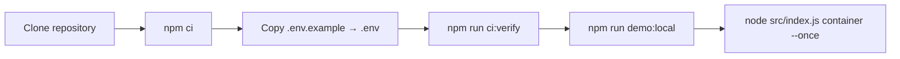
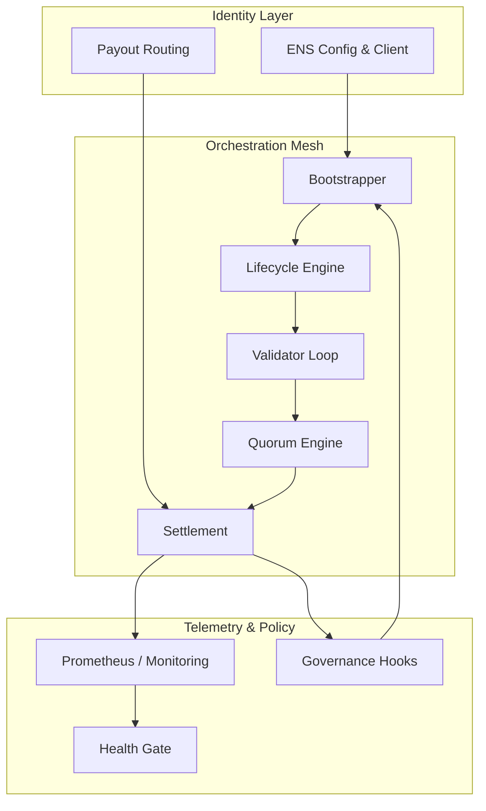

# AGI Alpha Node v0 · Orchestrate the Cognitive Armada ⚡

<!-- markdownlint-disable MD013 MD033 -->
<p align="center">
  <picture>
    <source srcset="1.alpha.node.agi.eth.svg" type="image/svg+xml" />
    
  </picture>
</p>

<p align="center">
  <a href="https://github.com/MontrealAI/AGI-Alpha-Node-v0/actions/workflows/ci.yml">
    
  </a>
  <a href=".github/required-checks.json">
    
  </a>
  
  
  
  
  
  <a href="Dockerfile"></a>
  <a href="deploy/helm/agi-alpha-node"></a>
  <a href="https://etherscan.io/address/0xa61a3b3a130a9c20768eebf97e21515a6046a1fa"></a>
  
  <a href="LICENSE"></a>
</p>

> AGI Alpha Node v0 is the command lattice for cognitive swarms: it brokers α-work, notarises proofs, animates staking flywheels, and keeps every control lever under owner custody.
>
> This codebase is engineered as the machine that rebalances global value toward its operator—autonomous agents, blockchain orchestration, and telemetry fuse into a single sovereign surface.

---

## Table of Contents

1. [Singularity Snapshot](#singularity-snapshot)
2. [Core Capabilities](#core-capabilities)
3. [Quickstart Ritual](#quickstart-ritual)
4. [ENS Identity & Tooling](#ens-identity--tooling)
5. [Runtime Architecture](#runtime-architecture)
6. [Observability & Governance](#observability--governance)
7. [CI & Quality Gauntlet](#ci--quality-gauntlet)
8. [Deployment Vectors](#deployment-vectors)
9. [Repository Atlas](#repository-atlas)
10. [Reference Library](#reference-library)

---

## Singularity Snapshot

- **$AGIALPHA treasury engine** — The runtime is hard-wired to the canonical 18-decimal token contract [`0xa61a3b3a130a9c20768eebf97e21515a6046a1fa`](https://etherscan.io/address/0xa61a3b3a130a9c20768eebf97e21515a6046a1fa), powering staking, payouts, and liquidity loops.【F:contracts/AlphaNodeManager.sol†L29-L53】【F:src/constants/token.js†L1-L20】
- **Owner-dominated controls** — The AlphaNodeManager contract exposes pause/resume, emission curves, stake gates, and governance hooks entirely under the owner’s address.【F:contracts/AlphaNodeManager.sol†L79-L213】
- **Deterministic orchestration** — Workflows from discovery → execution → validation → settlement are orchestrated in [`src/services/jobLifecycle.js`](src/services/jobLifecycle.js), ensuring each α-work unit is audited and journaled.【F:src/services/jobLifecycle.js†L404-L707】
- **Identity-first runtime** — ENS metadata, payout routes, telemetry baselines, and verifier URLs are generated consistently by [`src/ens/ens_config.js`](src/ens/ens_config.js) and the new TypeScript ENS network client.【F:src/ens/ens_config.js†L1-L188】【F:src/ens/client.ts†L1-L147】
- **Production-ready packaging** — Docker, Helm, CI gates, and lint/test/coverage/security chains ship in-tree so non-technical operators can deploy without touching the internals.【F:Dockerfile†L1-L92】【F:package.json†L1-L64】

---

## Core Capabilities

| Domain | Highlights | Key Files |
| --- | --- | --- |
| **Intelligence routing** | Bootstrapper, lifecycle engine, validator loop, and orchestrator mesh keep α-work flowing under load. | [`src/orchestrator`](src/orchestrator), [`src/services/jobLifecycle.js`](src/services/jobLifecycle.js), [`src/orchestrator/bootstrap.js`](src/orchestrator/bootstrap.js) |
| **Cryptographic assurance** | Deterministic signing, staking, and validator proofs wrap every α-work unit; payout contracts honour shares while the owner retains hard stops. | [`src/crypto`](src/crypto), [`contracts/AlphaNodeManager.sol`](contracts/AlphaNodeManager.sol), [`src/settlement`](src/settlement) |
| **Telemetry & health** | Prometheus metrics, health gates, and monitoring loops keep clusters observable even when offline-first workloads replay. | [`src/telemetry/monitoring.js`](src/telemetry/monitoring.js), [`src/healthcheck.js`](src/healthcheck.js) |
| **Configuration spine** | Defaults, schema coercion, and environment loaders resolve a single immutable config the entire runtime consumes. | [`src/config/defaults.js`](src/config/defaults.js), [`src/config/schema.js`](src/config/schema.js), [`src/config/env.js`](src/config/env.js) |
| **ENS network integration** | `loadEnsConfig` normalises RPC endpoints, registry/resolver wrappers, and NameWrapper presets for mainnet & Sepolia; `EnsClient` wraps ethers.js for pubkeys, text records, contenthash, and fuse inspection. | [`src/ens/config.ts`](src/ens/config.ts), [`src/ens/client.ts`](src/ens/client.ts) |
| **Docs & governance** | Comprehensive economics, governance, and attestation manuals are included for operators and auditors. | [`docs`](docs) |

---

## Quickstart Ritual



1. **Clone & install dependencies**

   ```bash
   git clone https://github.com/MontrealAI/AGI-Alpha-Node-v0.git
   cd AGI-Alpha-Node-v0
   npm ci
   ```

   Node.js 20.18+ is enforced via the `package.json` engines field for reproducible builds.【F:package.json†L42-L47】

2. **Configure identity & payouts**
   - Duplicate `.env.example`, fill in ENS label/name, payout routes, telemetry, and staking settings.
   - Optional ENS overrides (`ALPHA_NODE_*`) let you pin RPC endpoints, registries, and resolvers when running on bespoke networks.【F:.env.example†L1-L79】【F:.env.example†L81-L86】

3. **Mirror CI locally**

   ```bash
   npm run ci:verify
   ```

   This executes markdown lint, link checks, Vitest unit tests, coverage, Solhint, solidity compilation, subgraph codegen/build, security audit, policy gates, and branch rules.【F:package.json†L18-L48】

4. **Publish ENS metadata**

   ```bash
   node src/index.js ens:records --pretty
   ```

   Outputs deterministic text/coin records derived from the consolidated configuration.【F:src/ens/ens_config.js†L1-L188】

5. **Launch the node**

   ```bash
   node src/index.js container --once --metrics-port 9464 --api-port 8080
   ```

   Drop `--once` for long-lived clusters; combine with governance flags to tune quorum, staking, or telemetry thresholds on the fly.【F:src/index.js†L1116-L1230】

---

## ENS Identity & Tooling

`src/ens/config.ts` centralises all ENS wiring. Mainnet & Sepolia presets ship with canonical registry, NameWrapper, and PublicResolver addresses. Overrides are provided via:

- `ALPHA_NODE_CHAIN_ID`, `ALPHA_NODE_RPC_URL`
- `ALPHA_NODE_ENS_REGISTRY`, `ALPHA_NODE_NAME_WRAPPER`, `ALPHA_NODE_PUBLIC_RESOLVER`
- Direct overrides passed to the client helper.

```ts
import { loadEnsConfig } from './src/ens/config.js';
import { getEnsClient } from './src/ens/client.js';

const config = loadEnsConfig();
const ens = getEnsClient();
const resolver = await ens.getResolver('alpha.agent.agi.eth');
```

### ENS inspection CLI

A dedicated developer CLI probes resolvers, pubkeys, text records, contenthashes, and NameWrapper fuses in one call.

```bash
npm run ens:inspect alpha.agent.agi.eth
```

Sample output:

```text
ENS Inspection → alpha.agent.agi.eth

Network
  Chain ID      : 1
  RPC URL       : https://rpc.ankr.com/eth
  ENS Registry  : 0x00000000000c2e074ec69a0dfb2997ba6c7d2e1e
  NameWrapper   : 0xd4416b13d2b3a9abae7acd5d6c2bbdbe25686401
  PublicResolver: 0x231b0ee14048e9dccd1d247744d114a4eb5e8e63

Resolver
  Address       : 0x231b0ee14048e9dccd1d247744d114a4eb5e8e63
  Pubkey        : not set
  Contenthash   : not set

Text Records
  node.role     : orchestrator
  node.version  : 1.2.3
  node.dnsaddr  : not set

NameWrapper
  Status        : not wrapped or NameWrapper disabled
```

Use `--json` for machine-readable output or supply custom RPC/registry arguments for private deployments.【F:scripts/ens-inspect.ts†L1-L152】

---

## Runtime Architecture



- **Bootstrapper** wires config, ENS identity, and orchestration loops at startup.【F:src/orchestrator/bootstrap.js†L1-L280】
- **Lifecycle engine** journals α-work unit progress, emitting telemetry and governance signals for every phase.【F:src/services/jobLifecycle.js†L404-L707】
- **Validator runtime** consumes proof queues, signs payloads, and feeds quorum analysis.【F:src/validator/runtime.js†L1-L220】
- **Settlement** orchestrates payouts, AGIALPHA staking flows, and ledger exports.【F:src/settlement/index.js†L1-L220】
- **Telemetry** persists counters, gauges, and latency histograms even before scrape intervals begin.【F:src/telemetry/monitoring.js†L1-L520】

---

## Observability & Governance

- **Metrics** — `/metrics` exposes Prometheus-ready statistics; `src/telemetry/monitoring.js` precalculates histograms so cold starts don’t lose data.【F:src/telemetry/monitoring.js†L1-L520】
- **Health gate** — The health gate enforces ENS allowlists, optional overrides, and hookable pause states, ensuring only authorised domains can resume workloads.【F:src/services/healthGate.js†L1-L220】
- **Owner levers** — Smart contracts allow the owner to pause, resume, update emission curves, rotate operators, and change governance registries without redeploying the runtime.【F:contracts/AlphaNodeManager.sol†L79-L213】
- **Ledger & snapshots** — Offline snapshots and governance ledger exports (`GOVERNANCE_LEDGER_ROOT`, `OFFLINE_SNAPSHOT_PATH`) keep auditors and regulators aligned with runtime state.【F:src/services/offlineSnapshot.js†L1-L180】【F:.env.example†L49-L70】

---

## CI & Quality Gauntlet

Every pull request must satisfy the same gates exposed locally via `npm run ci:verify`:

| Stage | Command | Purpose |
| --- | --- | --- |
| Markdown lint | `npm run lint:md` | Enforces documentation style.
| Link validation | `npm run lint:links` | Guarantees README/docs links resolve.
| JS/TS tests | `npm run test` | Executes Vitest suites across orchestrator, governance, telemetry, ENS, and CLI modules.【F:test/ensClient.test.ts†L1-L146】【F:test/ensNetworkConfig.test.ts†L1-L74】
| Coverage | `npm run coverage` | Collects instrumentation via `c8`.
| Solidity lint | `npm run lint:sol` | Enforces contract style guidelines.
| Solidity compile | `npm run test:sol` | Validates contract compilation gates.
| Subgraph build | `npm run ci:ts` | Generates and compiles the Graph subgraph artifacts.
| Security | `npm run ci:security` | Audits production dependencies with `npm audit` (high severity threshold).
| Policy & branch gates | `npm run ci:policy`, `npm run ci:branch` | Enforces health invariants and protected branch rules before merge.【F:package.json†L18-L48】

The CI workflow is visible in [`.github/workflows/ci.yml`](.github/workflows/ci.yml); badges above reflect the latest build state.

---

## Deployment Vectors

- **Docker** — `docker build -t agi-alpha-node:latest .` produces the production image with all runtime scripts baked in.【F:Dockerfile†L1-L92】
- **Helm** — Charts under [`deploy/helm/agi-alpha-node`](deploy/helm/agi-alpha-node) template environment variables, secrets, and probes for Kubernetes rollouts.
- **Local swarms** — `npm run demo:local` spins up orchestrator, executor, validator, and quorum loops entirely in-process for deterministic rehearsals.【F:scripts/local_cluster.mjs†L1-L214】
- **Subgraph** — `npm run ci:ts` renders manifests and builds the Graph protocol subgraph to surface on-chain analytics for AGIALPHA staking.【F:scripts/render-subgraph-manifest.mjs†L1-L120】

---

## Repository Atlas

| Path | Description |
| --- | --- |
| [`src/`](src) | Runtime source (orchestrator, validator, settlement, telemetry, ENS tooling, utilities). |
| [`src/ens`](src/ens) | ENS identity helpers including configuration, client, and record templates.【F:src/ens/config.ts†L1-L147】【F:src/ens/client.ts†L1-L147】 |
| [`scripts/`](scripts) | Operational scripts (`local_cluster`, ENS inspector, solc harnesses, verification gates).【F:scripts/ens-inspect.ts†L1-L152】【F:scripts/run-solc.mjs†L1-L120】 |
| [`contracts/`](contracts) | Solidity contracts anchoring staking, owner controls, and governance modules.【F:contracts/AlphaNodeManager.sol†L1-L213】 |
| [`deploy/`](deploy) | Docker/Helm and infrastructure manifests. |
| [`docs/`](docs) | Economics, governance, attestation, and operator manuals. |
| [`test/`](test) | Vitest suites spanning orchestrator logic, ENS tooling, telemetry, governance, and CI gates.【F:test/ensClient.test.ts†L1-L146】【F:test/ensNetworkConfig.test.ts†L1-L74】 |

---

## Reference Library

- [Economics Playbook](docs/economics.md)
- [Governance Manual](docs/README.md#governance--owner-supremacy)
- [ENS Identity & Attestation Guide](docs/ens-identity-and-node-attestation-v0.0.1-alpha.md)
- [Deployment Guide](docs/README.md)
- [AGI Alpha Manifesto](docs/manifesto.md)

Command the lattice, cultivate alpha, and let your node harvest the future.
